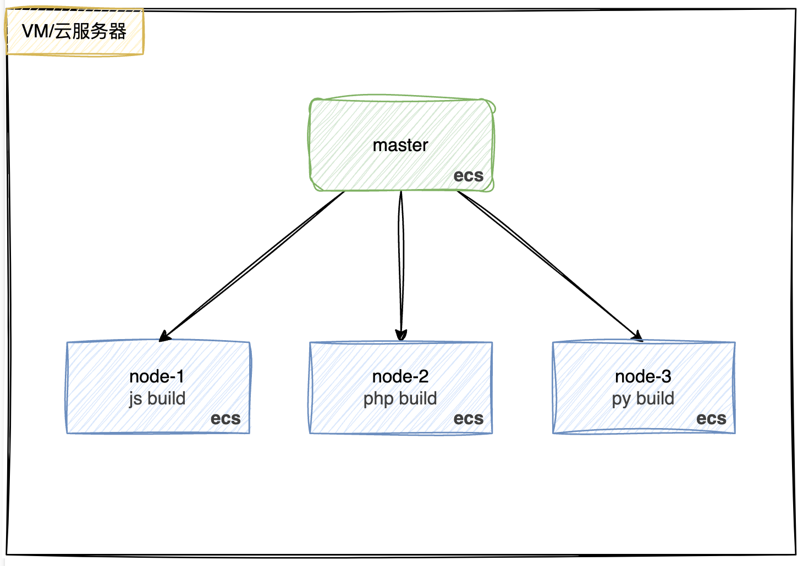
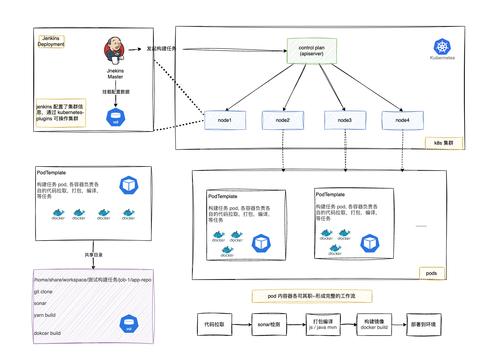
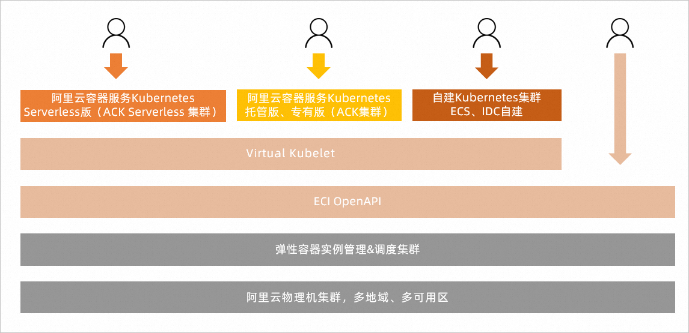
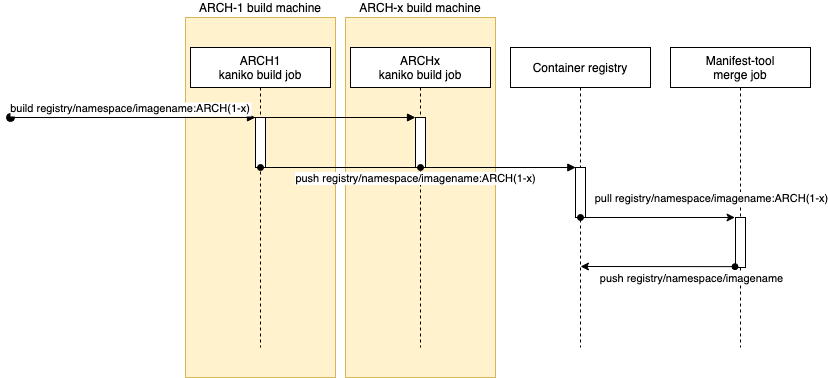

# Jenkins CI/CD 流水线的演进

持续集成是敏捷迭代中不可获取的前提，其中持续构建，持续测试，持续发布是我们日常工作中必不可少的步骤，目前大多是公司都是采用 Jenkins 集群来搭建符合内部工作流程的「**自动化 CI/CD 流水线**」。各公司使用 Jenkins 的方法也不同，本文简单描述一下 Jenkins 生产化的演进路线。

# 1. 传统集群

Jenkins 的传统集群方式，是使用不同环境的服务器构成不同能力的 Jenkins 节点，由主节点根据任务环节的需要，调度不同能力的子节点来完成构建或部署任务



传统的 一主多从的 方案，会存在一些痛点：

- 主节点故障时，整个流程不可用
- 每个从节点 的配置环境不一样，来完成不同语言的编译打包等操作，但是这些差异化的配置导致管理起来非常不方便，维护起来也是比较费劲
- 新增机器节点需要在镜像或者机器里面准备好 sonar，各种语言的单元测试环境，api 测试等工具，每一次步骤的改变或者工具的版本升级都可能需要去折腾一遍镜像或者机器，给后期带来高昂的维护成本
- 现有的功能测试、接口测试、压力测试等工具，越来越专业化，往往会有各自的工作集群调度甚至是托管方案，例如 selenium grid、JMeter 集群等
- 同样的测试工作，可能有多种工具都可以完成，例如一个 Restful 的接口测试，不管是 JMeter 还是 Postman，或者 SoapUI 以及五花八门的自有工具，都可以完成这样的工作
- 资源浪费，每台从节点可能是物理机或者 ecs 云服务/虚拟机，会存在空闲期

# 2. kubernetes 集群

随着 DevOps 理念越来越火，进入容器云时代，情况发生了变化。基于 Docker 虚拟化容器技术+K8s 能很好的解决传统构建的痛点。我们可以使用不同能力的 Jenkins 镜像，**使用 Kubernetes 插件来 + pipeline** 完成这种任务的拆分和调度。让各种工具自成镜像，无疑对镜像尺寸和更新速度都会有更好的支持，且更灵活，这样只需要维护各自语言镜像即可，「不需要在手工操作机器」，新增步骤或者改变工具或环境版本只是加多一个镜像或者重新打包一下镜像。



pod 内共享网络，共享存储，使用 k8s 存储卷挂载的能力，让不同容器可以共享同一个工作空间，就像在本地编译打包一样

这种方式的工作流程大致为：当 Jenkins Master 接受到 Build 请求时，会根据配置的 Label 动态创建一个运行在 Pod 中的 Jenkins agent 并注册到 Master 上，当运行完 Pod 后，这个 jnlp agent 会被注销并且这个 Pod 也会自动删除，恢复到最初状态。

使用这种方式有什么好处呢？

- 服务高可用，当 master 出现故障时，k8s 集群会自动创建一个新的 master 容器，并将 Volume 分配给新的容器，保证数据不丢失，从而达到集群服务高可用
- 动态伸缩，合理利用资源，每次运行 Job 时，会自动创建 Jenkins agent，Job 完成后，agent 自动注销并退出容器，资源自动释放，而且 k8s 会根据资源使用情况，动态分配 agent 到空闲的节点，达到资源利用流均衡，避免出现排队的情况
- 扩展性好，当 Kubernetes 集群的资源严重不足而导致 Job 排队等待时，可以很容易的添加一个 Kubernetes Node 到集群中，从而实现扩展。 是不是以前我们面临的种种问题在 Kubernetes 集群环境下面是不是都没有了啊？看上去非常完美。

# 3. serverless 弹性构建｜低成本高并发

流水线自动化构建解决了大部分手工操作的内容，极大提高的研发效率。随着项目接入增多，集群的构建量肯定会随之暴增，集群构建压力还是较大的。如何解决这个问题？

## 方案一｜节点自动伸缩组件

Kubernetes 节点自动伸缩(Cluster Autoscaler)是一种根据工作负载需求自动调整集群节点数量的功能。Cluster Autoscaler 会定期检查以下情况:

1. **扩容场景** :

- 有因资源不足而无法调度的 Pod
- 添加节点可以帮助调度这些 Pod
- 当前节点数小于最大限制

1. **缩容场景** :

- 节点利用率低于阈值一段时间
- 节点上的 Pod 可以重新调度到其他节点
- 节点数大于最小限制

目前大部分容器服务提供商(AWS, GKE, 华为云，阿里云等)均支持该能力。

**当 Pod 由于资源请求（Request）无法满足并进入等待（Pending）状态时，节点自动伸缩组件会根据配置的弹性伸缩组配置信息中的资源规格以及约束配置，计算所需的节点数目，如果可以满足伸缩条件，则会触发伸缩组的节点加入。**

设置好节点自动伸缩，问题并没有很好的解决，因为新的节点就绪需要时间比较长（分钟级别接近十分钟），当新节点准备就绪的时候已经有一部分构建完成了，后续的构建任务可以直接在原有的节点执行。实际上结果就是节点扩充出来了却不在需要这些节点了。

## 方案二｜ serverless

正常重要的集群都是独立，比如 Jenkins 构建集群，不可能与业务集群共用。所以这也就会存在集群高峰和空闲。而且流水线构建属于高度动态的行为，为了动态的构建操作而维护一个固定的计算资源池对成本是不利的。

有没有什么好的方式既可以解决高峰运转又不会造成空转成本呢？---> 弹性伸缩实例

> 阿里云弹性容器实例（Elastic Container Instance）是敏捷安全的 Serverless 容器运行服务。您无需管理底层服务器，也无需关心运行过程中的容量规划，只需要提供打包好的 Docker 镜像，即可运行容器，并仅为容器实际运行消耗的资源付费。

### 什么是弹性伸缩实例？

使用 ECI serverless 之前有必要先先了解一下 Virtual Kubelet 这个开源项目 ➡️ [Virtual-Kubelet 应用场景及架构解析](./Virtual-Kubelet%20应用场景及架构解析.md)

> Virtual Kubelet 的作用很简单，就是将各大公有云厂商提供的容器服务与 K8S 的 apiserver 打通，实现通过 K8S 的 api 编排云厂商的无服务器容器服务（如：AWS 的 Fargate，Azure 的 ACI，阿里的 ECI 等）。原理上就是向 K8S 的 apiserver 注册一个伪造的 kubelet（相当于加入一个节点）接收 apiserver 调度过来的 pod，只不过真实的 kubelet 接收到负载之后是在自身管理的 node 上进行启动 pod 等操作，Virtual Kubelet 接收到负载后调用注册的 api 往云厂商容器服务创建工作负载

使用 ECI 时，您既可以借助 OpenAPI 将 ECI 接入到您已有的业务系统中，通过 OpenAPI 和控制台直接快速部署容器应用；也可以通过 Virtual Kubelet 对接 Kubernetes 集群，借助 ECI 的弹性能力轻松应对突发业务流量。



**Serverless 集群中只有 pod 运行时才会收费精确到秒，这意味着我们不需要准备固定的计算资源等待构建任务，可以节省不少成本。同时又提供了可以快速启动容器的能力，这就解决了响应延迟的问题。**

#### 问题

#### 构建工具替换

但是使用有些限制如 「ECI 目前还不支持 Kubernetes 中 HostPath、DaemonSet 等功能」，这就意味着不能挂载本地宿主机文件到容器中，那以前**将宿主机的 docker.sock 挂载到容器内再使用 docker build 命令构建 docker 镜像的方式就行不通了**。

> **非 serverless k8s 集群 镜像构建可选方式**
>
> dokcer build 需要 docker daemon 才能正常使用，我们通常情况下的做法是将宿主机上的 docker sock 文件 `/var/run/docker.sock` 挂载到容器中。如果在在 Kubernetes 集群使用的是 containerd 这种容器运行时，节点上没有 docker daemon，可以单独以 Pod 的形式在集群中跑一个 docker daemon 的服务。

其实也有挺多不依赖 dockerd 无需特权模式 支持 rootless 的构建工具

| 工具        | 需要 Daemon？                             | Rootless 支持  | 跨平台支持      | 主要用途               | 镜像格式   | 适用场景                     | 学习曲线 |
| ----------- | ----------------------------------------- | -------------- | --------------- | ---------------------- | ---------- | ---------------------------- | -------- |
| **Docker**  | ✅ (`dockerd`)                            | ❌ (需 `sudo`) | ✅              | 构建/运行/管理容器     | Docker/OCI | 本地开发、传统部署           | 低       |
| **Podman**  | ❌ (但 macOS/Windows 需 `podman-machine`) | ✅             | ✅ (通过虚拟机) | 替代 Docker CLI        | Docker/OCI | 开发、无守护进程环境         | 中       |
| **Buildah** | ❌                                        | ✅             | ❌ (仅 Linux)   | **仅构建镜像**         | OCI        | CI/CD、精细控制镜像层        | 中高     |
| **Kaniko**  | ❌                                        | ✅ (无特权)    | ✅ (K8s 内)     | **K8s 容器内构建镜像** | Docker/OCI | Kubernetes CI/CD、无特权环境 | 中       |
| **img**     | ❌ (基于 BuildKit)                        | ✅             | ❌ (仅 Linux)   | 高效构建镜像           | Docker/OCI | 替代 `docker build`          | 中       |

---

其中[kaniko](https://github.com/GoogleContainerTools/kaniko) 是最适合 `jenkinsn on kubernetes+serverless` 这种模式的，在 `kubernetes-plugins` 里也有对应的案例 [kaniko-build-img](https://github.com/jenkinsci/kubernetes-plugin/blob/master/examples/kaniko.groovy)

#### Jenkins agent 启动速度优化

在原有的 自建机器集群或者云服务器 使用 Jenkins pipeline 编排构建镜像时，我们一个 pod 中有多个容器，pod 镜像的拉取策略一般是 `IfNotPresent` 镜像存在就不会在重新拉取(正常我们的构建镜像不会频繁更新)，所以新的 pod 启动都是很快的，拉取镜像不会耗时。但在 Serverless 方案中，由于 每次都是弹性启动一个 eci 新实例，相当于一个全新的环境，没有任何缓存，导致每次都要重新拉取镜像。ECI 在这方面也给出了解决方案 -> [镜像缓存](https://help.aliyun.com/zh/eci/user-guide/overview-of-image-caches-1)

> 在运行容器前，ECI 需要先拉取您指定的容器镜像，但因网络和容器镜像大小等因素，镜像拉取耗时往往成了 ECI 实例启动的主要耗时。为加速实例的创建速度，ECI 提供镜像缓存功能。您可以预先将需要使用的镜像制作成缓存快照，然后基于该快照来创建 ECI 实例，避免或者减少镜像层的下载，从而提升实例的创建速度。

ECI 镜像缓存的基本原理： **镜像缓存（imc）同步在 K8S 这边提供了对应的 CRD。镜像缓存的工作原理就是在 ECI 实例启动时挂载一个包含用户定义的镜像的磁盘，ECI 实例就可以在本地直接使用镜像启动容器。**

定义镜像缓存例子：

```yaml
apiVersion: eci.alibabacloud.com/v1
kind: ImageCache
metadata:
  name: imagecache-sample
  annotations:
    k8s.aliyun.com/imc-enable-reuse: "true" #开启镜像缓存复用
spec:
  images:
    - centos:latest
    - busybox:latest
  imagePullSecrets:
    - default:secret1
    - default:secret2
    - kube-system:secret3
  imageCacheSize: 25
  retentionDays: 7
```

**深入学习镜像缓存检查原理**

拉取镜像时的工作流程：

1. **解析镜像 Manifest** ：
   从镜像仓库获取 Manifest 文件，解析出所有镜像层的 Digest（如 `sha256:abc123...`）。
2. **检查本地是否存在该 Digest** ：

- 若某层的 Digest **已存在于本地存储** （`/var/lib/containerd/io.containerd.content.v1.content`），则跳过下载。
- 若不存在，则下载该层并存储到本地

containerd 镜像存储目录

```shell
/var/lib/containerd/
├── io.containerd.content.v1.content  # 存储所有内容块（镜像层）
│   └── blobs/sha256/
│       ├── abc123...                 # 镜像层文件（Digest 为文件名）
│       └── def456...
└── io.containerd.snapshotter.v1.overlayfs  # 快照数据
```

docker 镜像存储目录 (overlay)

```shell
/var/lib/docker/
├── overlay2/                  # 镜像层存储
│   ├── abc123...              # 层目录（对应 Digest）
│   │   ├── diff               # 层内容
│   │   └── link               # 指向 Digest 的符号链接
│   └── def456...
├── image/                     # 镜像元数据
│   └── overlay2/
│       └── layerdb/sha256/    # 层 Digest 数据库
└── manifest.json              # 镜像 Manifest 缓存
```

| **特性**       | **Docker**                                                      | **Containerd**                                                       |
| -------------- | --------------------------------------------------------------- | -------------------------------------------------------------------- |
| **存储路径**   | `/var/lib/docker/overlay2/`                                     | `/var/lib/containerd/io.containerd.content.v1.content/blobs/sha256/` |
| **检查工具**   | `docker pull`、`docker inspect`、`ls /var/lib/docker/overlay2/` | `ctr content ls`、`nerdctl`                                          |
| **日志提示**   | 明确显示 `Layer already exists`                                 | 需调试日志（`--log-level debug`）                                    |
| **共享层复用** | ✅ 相同 Digest 的层自动复用                                     | ✅ 相同 Digest 的层自动复用                                          |

#### 多架构构建方案

用 docker 构建镜像时，我们可以使用 `docker buildx build --platform linux/arm,linux/arm64,linux/amd64 -t jonpenn/hello-arch:1.0.0  --file $(pwd)/dockerfile .` 构建一个多架构的镜像 (基于 QEMU)。但在 serveless 模式下 pod 都是单架构的，且非固定集群，无特权模式，kaniko 本身也不支持多架构同时构建。所以得另寻他法。

[Creating Multi-arch Container Manifests Using Kaniko and Manifest-tool](https://github.com/GoogleContainerTools/kaniko?tab=readme-ov-file#creating-multi-arch-container-manifests-using-kaniko-and-manifest-tool)

> While Kaniko itself currently does not support creating multi-arch manifests (contributions welcome), one can use tools such as [manifest-tool](https://github.com/estesp/manifest-tool) to stitch multiple separate builds together into a single container manifest.



基于 kaniko 推荐的方式，我们可以用 manifest-tool 把多个单架构的镜像推送成一个支持多架构的镜像。

> [image-spec/manifest.md at main · opencontainers/image-spec · GitHub](https://github.com/opencontainers/image-spec/blob/main/manifest.md), 继续深入了解 docker 镜像元数据信息： 一个镜像可以使用同一个 tag 支持多种架构，定义一个镜像包含一个 manifest、一个 image index (可选)、一组文件系统 layer 和一个配置文件。 统一标准化容器镜像格式，让标准镜像能够在各容器软件下构建、传递及准备容器镜像运行。

在结合阿里云 ECI 文档， 指定 Arm 规则 创建 pod

1. [调度 Pod 到 Arm 架构的虚拟节点](https://help.aliyun.com/zh/eci/user-guide/scheduling-pods-to-virtual-nodes-in-the-arm-architecture?spm=a2c4g.11186623.help-menu-87486.d_2_1_1_1.5ecc2584g2FqT4&scm=20140722.H_2573822._.OR_help-T_cn~zh-V_1)
2. [指定 Arm 规格创建 Pod](https://help.aliyun.com/zh/eci/user-guide/create-a-pod-by-specifying-the-arm-specification?spm=a2c4g.11186623.help-menu-87486.d_2_1_2_2_2_3.23aadab12di3UQ)

```yaml
apiVersion: apps/v1
kind: Deployment
metadata:
  name: test
  labels:
    app: test
spec:
  replicas: 1
  selector:
    matchLabels:
      app: nginx
  template:
    metadata:
      name: nginx-test
      labels:
        app: nginx
        alibabacloud.com/eci: "true"
      annotations:
        k8s.aliyun.com/eci-use-specs: "ecs.c8y.large,ecs.g8y.large" # 指定支持的ECS Arm规格，单次最多5个。
    spec:
      containers:
        - name: nginx
          image: arm64v8/centos:7.9.2009 # 使用基于Arm架构的镜像。
          command: ["sleep"]
          args: ["999999"]
      nodeSelector:
        kubernetes.io/arch: arm64 # 调度到Arm节点。
```

在 Jenkins PodTemplate 编排中就要增加「 `k8s.aliyun.com/eci-use-specs: "ecs.c8y.large,ecs.g8y.large` 注解， 和 `nodeSelector`」

# 4. 参考

1. [Jenkins 和 Kubernetes -云上的神秘代理 ](https://www.jenkins.io/zh/blog/2018/09/14/kubernetes-and-secret-agents/ "Jenkins 和 Kubernetes -云上的神秘代理")
2. [弹性容器实例](https://help.aliyun.com/zh/eci/)
