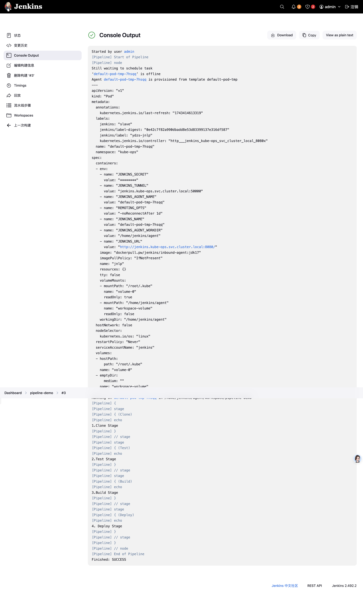
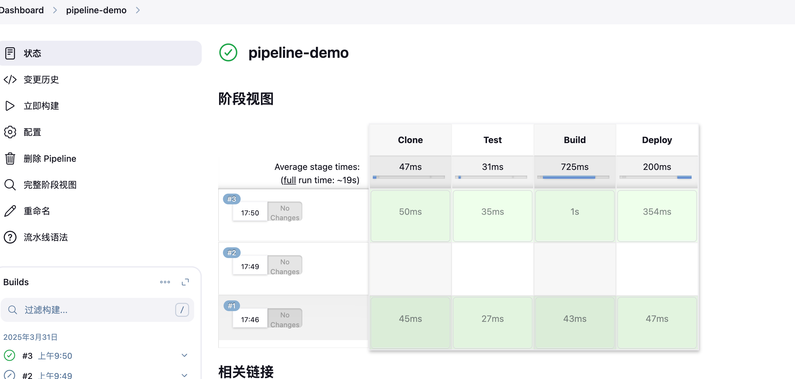
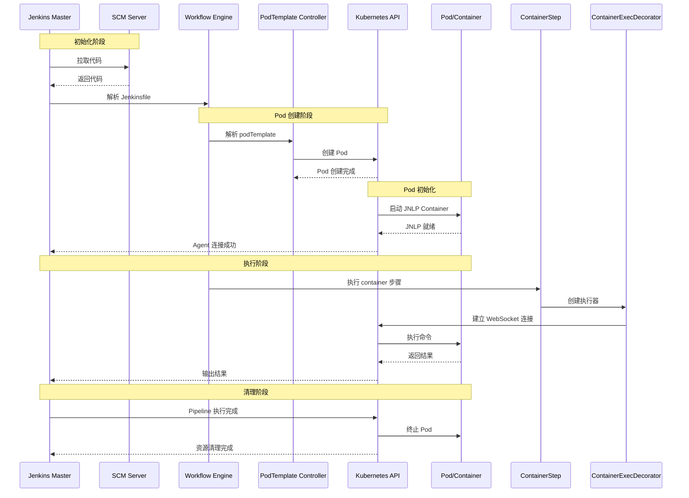

# Jenkins Pipeline 实践

# 1. 基本概念

Jenkins Pipeline 有几个核心概念：

- Node：节点，一个 Node 就是一个 Jenkins 节点，Master 或者 Agent，是执行 Step 的具体运行环境，比如我们之前动态运行的 Jenkins Slave 就是一个 Node 节点
- Stage：阶段，一个 Pipeline 可以划分为若干个 Stage，每个 Stage 代表一组操作，比如：Build、Test、Deploy，Stage 是一个逻辑分组的概念，可以跨多个 Node
- Step：步骤，Step 是最基本的操作单元，可以是打印一句话，也可以是构建一个 Docker 镜像，由各类 Jenkins 插件提供，比如命令：sh 'make'，就相当于我们平时 shell 终端中执行 make 命令一样。

那么我们如何创建 Jenkins Pipline 呢？

- Pipeline 脚本是由 Groovy 语言实现的，但是我们没必要单独去学习 Groovy，当然你会的话最好
- Pipeline 支持两种语法：Declarative(声明式)和 Scripted Pipeline(脚本式)语法
- Pipeline 也有两种创建方法：可以直接在 Jenkins 的 Web UI 界面中输入脚本；也可以通过创建一个 Jenkinsfile 脚本文件放入项目源码库中
- 一般我们都推荐在 Jenkins 中直接从源代码控制(SCMD)中直接载入 Jenkinsfile Pipeline 这种方法

## 小试牛刀

我们这里来给大家快速创建一个简单的 Pipeline，直接在 Jenkins 的 Web UI 界面中输入脚本运行。

- 新建任务：在 Web UI 中点击 `新建任务` -> 输入名称：`pipeline-demo` -> 选择下面的 `流水线` -> 点击 `确定`
- 配置：在最下方的 Pipeline 区域输入如下 Script 脚本，然后点击保存。

```groovy
node{
    stage('Clone'){
    echo"1.Clone Stage"
    }
    stage('Test'){
    echo"2.Test Stage"
    }
    stage('Build'){
    echo"3.Build Stage"
    }
    stage('Deploy'){
    echo"4. Deploy Stage"
    }
}
```

- 构建：点击左侧区域的 `立即构建`，可以看到 Job 开始构建了



console output 我们可以看到上面我们 Pipeline 脚本中的 4 条输出语句都打印出来了，证明是符合我们的预期的。

如果大家对 Pipeline 语法不是特别熟悉的，可以前往输入脚本的下面的链接 [流水线语法](http://jenkins.k8s.local:9980/job/pipeline-demo/pipeline-syntax) 中进行查看，这里有很多关于[ Pipeline 语法](https://www.jenkins.io/doc/book/pipeline/syntax/)的介绍，也可以自动帮我们生成一些脚本。

## 在 slave 上跑任务

上面我们创建了一个简单的 Pipeline 任务，但是我们可以看到这个任务并没有在 Jenkins 的 Slave 中运行，那么如何让我们的任务跑在 Slave 中呢？还记得前面我们在添加 Slave Pod 的时候，一定要记住添加的 label 吗？没错，我们就需要用到这个 label，我们重新编辑上面创建的 Pipeline 脚本，给 node 添加一个 label 属性，如下：

```groovy
node('ydzs-jnlp') {
  stage('Clone') {
    echo "1.Clone Stage"
  }
  stage('Test') {
    echo "2.Test Stage"
  }
  stage('Build') {
    echo "3.Build Stage"
  }
  stage('Deploy') {
    echo "4. Deploy Stage"
  }
}

```

重新构建任务，就可以在集群中看到对应 Pod

安装 `Pipeline: Stage View Plugin` 这个插件，就可以看到大家可能比较熟悉的 `阶段视图` 界面



# 2. 部署 kubernetes 应用

参考阳明大佬博客> https://www.qikqiak.com/k3s/devops/pipeline/

```groovy
def label = "slave-${UUID.randomUUID().toString()}"


def helmLint(String chartDir) {
    println "校验 chart 模板"
    sh "helm lint ${chartDir}"
}


def helmDeploy(Map args) {
    if (args.debug) {
        println "Debug 应用"
        sh "helm upgrade --dry-run --debug --install ${args.name} ${args.chartDir} -f ${args.valuePath} --set image.tag=${args.imageTag} --namespace ${args.namespace}"
    } else {
        println "部署应用"
        sh "helm upgrade --install ${args.name} ${args.chartDir} -f ${args.valuePath} --set image.tag=${args.imageTag} --namespace ${args.namespace}"
        echo "应用 ${args.name} 部署成功. 可以使用 helm status ${args.name} 查看应用状态"
    }
}


podTemplate(label: label, containers: [
  containerTemplate(name: 'golang', image: 'golang:1.14.2-alpine3.11', command: 'cat', ttyEnabled: true),
  containerTemplate(name: 'docker', image: 'docker:latest', command: 'cat', ttyEnabled: true),
  containerTemplate(name: 'helm', image: 'cnych/helm', command: 'cat', ttyEnabled: true),
  containerTemplate(name: 'kubectl', image: 'cnych/kubectl', command: 'cat', ttyEnabled: true)
], serviceAccount: 'jenkins', envVars: [
  envVar(key: 'DOCKER_HOST', value: 'tcp://docker-dind:2375')  // 环境变量
]) {
  node(label) {
    def myRepo = checkout scm

    stage('代码拉取') {
      echo "从 公司私仓 拉取代码 到本地"
    }


    stage('单元测试') {
      echo "测试阶段"
    }
    stage('代码编译打包') {
      try {
        container('golang') {
          echo "2.代码编译打包阶段"
          sh """
            export GOPROXY=https://goproxy.cn
            GOOS=linux GOARCH=amd64 go build -v -o demo-app
            """
        }
      } catch (exc) {
        println "构建失败 - ${currentBuild.fullDisplayName}"
        throw(exc)
      }
    }


     // 获取 git commit id 作为镜像标签
    def imageTag = sh(script: "git rev-parse --short HEAD", returnStdout: true).trim()
    // 仓库地址
    def registryUrl = "harbor.k8s.local"
    def imageEndpoint = "course/devops-demo"
    // 镜像
    def image = "${registryUrl}/${imageEndpoint}:${imageTag}"
    stage('构建 Docker 镜像') {
      withCredentials([[$class: 'UsernamePasswordMultiBinding',
        credentialsId: 'docker-auth',
        usernameVariable: 'DOCKER_USER',
        passwordVariable: 'DOCKER_PASSWORD']]) {
          container('docker') {
            echo "3. 构建 Docker 镜像阶段"
            sh """
              cat /etc/resolv.conf
              docker login ${registryUrl} -u ${DOCKER_USER} -p ${DOCKER_PASSWORD}
              docker build -t ${image} .
              docker push ${image}
              """
          }
      }
    }
    stage('运行 Helm') {
      withCredentials([file(credentialsId: 'kubeconfig', variable: 'KUBECONFIG')]) {
        container('helm') {
          sh "mkdir -p ~/.kube && cp ${KUBECONFIG} ~/.kube/config"
          echo "4.开始 Helm 部署"
          def userInput = 'Dev'
          echo "部署应用到 ${userInput} 环境"
          // 选择不同环境下面的 values 文件
          if (userInput == "Dev") {
              // deploy dev stuff
          } else if (userInput == "QA"){
              // deploy qa stuff
          } else {
              // deploy prod stuff
          }
          helmDeploy(
              debug       : false,
              name        : "devops-demo",
              chartDir    : "./helm",
              namespace   : "kube-ops",
              valuePath   : "./helm/my-values.yaml",
              imageTag    : "${imageTag}"
          )
        }
      }
    }
  }
}
```

# 3. 原理之数据流



### 1. 整体工作流程

当您提交一个 Pipeline Script from SCM 的任务时，流程如下：

1. **初始化阶段**：

   - Jenkins Master 从 SCM 拉取代码，解析 Jenkinsfile
   - 识别到 `podTemplate` 定义，准备创建 Kubernetes Pod

2. **Pod 创建阶段**：

   - Jenkins Master 通过 Kubernetes API 创建 Pod
   - Pod 包含您定义的所有容器（golang、docker、helm、kubectl）以及一个默认的 `jnlp` 容器
   - `jnlp` 容器是关键组件，负责与 Jenkins Master 建立通信

3. **执行阶段**：

   - Pod 启动后，`jnlp` 容器首先运行并连接到 Jenkins Master
   - Pipeline 中的命令通过 kubernetes api 直接操作 pod 中的容器
   - 根据 `container('xxx')` 块的定义，在相应容器中执行命令

### 2. 核心代码实现

在 Jenkins Kubernetes Plugin 中，`container('xxx')` 的实现主要涉及以下几个关键部分：

1. **Container Step 定义**

```java:/kubernetes-plugin/src/main/java/org/csanchez/jenkins/plugins/kubernetes/pipeline/ContainerStep.java
public class ContainerStep extends Step {
    private final String name;
    private ContainerTemplate containerTemplate;
    private String shell;

    @DataBoundConstructor
    public ContainerStep(String name) {
        this.name = name;
    }

    // ... 其他代码 ...

    @Override
    public StepExecution start(StepContext context) throws Exception {
        return new ContainerStepExecution(this, context);
    }
}
```

2. **Container Step 执行器**

```java:/kubernetes-plugin/src/main/java/org/csanchez/jenkins/plugins/kubernetes/pipeline/ContainerStepExecution.java
public class ContainerStepExecution extends AbstractStepExecutionImpl {
    private static final long serialVersionUID = 7634132798345235774L;

    private static final String CONTAINER_NAME = "container";

    private final ContainerStep step;

    ContainerStepExecution(ContainerStep step, StepContext context) {
        super(context);
        this.step = step;
    }

    @Override
    public boolean start() throws Exception {
        KubernetesClient client = getClient();
        // 获取当前的 pod
        String podName = getPodName();
        // 设置当前执行的容器名称
        getContext().newBodyInvoker()
                .withContext(BodyInvoker
                        .mergeLauncherDecorators(getContext().get(LauncherDecorator.class), new ContainerExecDecorator(client, podName, step.getName())))
                .withCallback(new ContainerExecCallback(step))
                .start();
        return false;
    }
}
```

3. **容器执行装饰器**

```java:/kubernetes-plugin/src/main/java/org/csanchez/jenkins/plugins/kubernetes/pipeline/ContainerExecDecorator.java
public class ContainerExecDecorator extends LauncherDecorator implements Serializable {
    private static final long serialVersionUID = 4419929753433397655L;

    private final KubernetesClient client;
    private final String podName;
    private final String containerName;

    public ContainerExecDecorator(KubernetesClient client, String podName, String containerName) {
        this.client = client;
        this.podName = podName;
        this.containerName = containerName;
    }

    @Override
    public Launcher decorate(Launcher launcher, Node node) {
        return new ContainerExecDecorator.ProcStarter(launcher);
    }
}

```

```java
ExecWatch watch = getClient()
        .pods()
        .inNamespace(getNamespace())
        .withName(getPodName())
        .inContainer(containerName)
        .redirectingInput(STDIN_BUFFER_SIZE)  // 重定向输入
        .writingOutput(stream)                // 重定向输出
        .writingError(stream)                 // 重定向错误
        .usingListener(new ExecListener() {   // 监听连接状态
            @Override
            public void onOpen() {
                alive.set(true);
                started.countDown();
            }
            // ... 其他监听器方法
        })
        .exec(sh);
```

```java
/**
 * This decorator interacts directly with the Kubernetes exec API to run commands inside a container. It does not use
 * the Jenkins agent to execute commands.
 */
```

ContainerExecDecorator 实际上是直接与 Kubernetes API 进行交互的，而不是通过 JNLP agent 转发。这一点从代码中可以明确看出

#### 工作流程解析

1. **Pipeline 解析阶段**：

   - Jenkins Master 解析 Jenkinsfile 时，会将整个 pipeline 转换为一系列的 Step 对象
   - 每个 `container('xxx')` 块会被转换为 `ContainerStep` 对象

2. **执行阶段**：

   - 当执行到 `container('xxx')` 时，会创建 `ContainerStepExecution` 实例
   - `ContainerStepExecution` 负责设置当前执行环境，指定要使用的容器
   - `ContainerExecDecorator` 负责实际的命令执行，它会确保命令在指定的容器中运行

### 3. JNLP Agent 的职责：

1. JNLP Agent 主要职责 ：

```java
public class Engine extends Thread {
    // 1. 建立与 Master 的 TCP 连接
    // 2. 维护工作目录
    // 3. 处理文件传输
    // 4. 环境变量管理
}
```

核心职责包括：

- 节点注册和管理
- 工作空间维护
- 环境变量处理
- 基础通信保障
- 安全认证

# 4. 参考

1. [Jenkins Pipeline 实践](https://www.qikqiak.com/k3s/devops/pipeline/#Jenkins-Pipeline)
2. [有关 Jenkins CI/CD 的全面资料](https://jenkins.xfoss.com/Ch00_Overview.html)
3. [kubernetes-plugin](https://github.com/jenkinsci/kubernetes-plugin)
