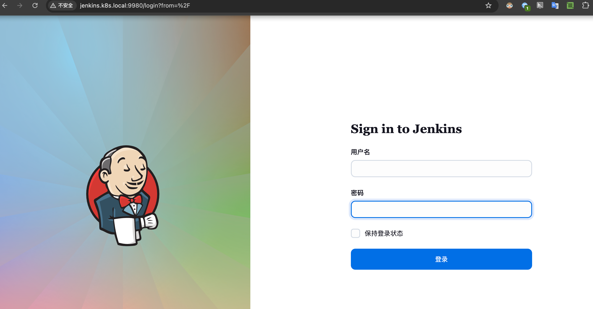
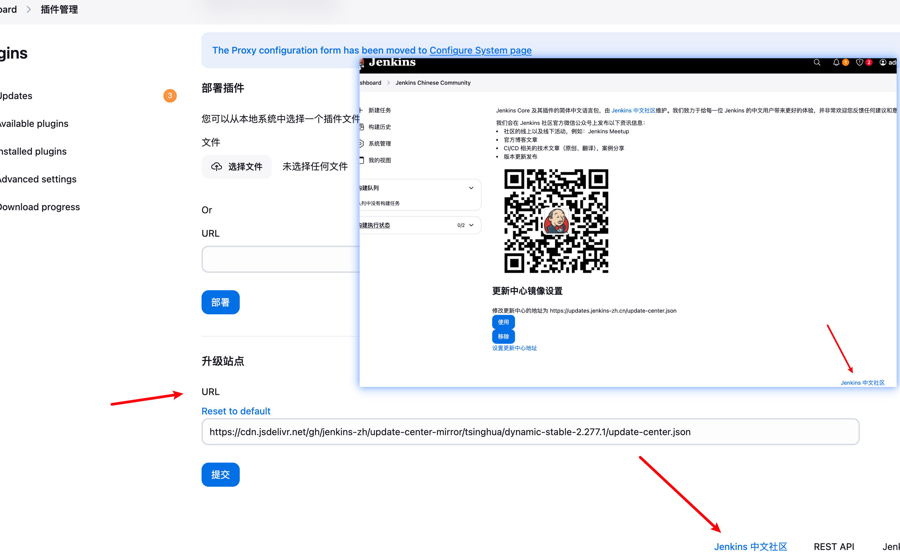
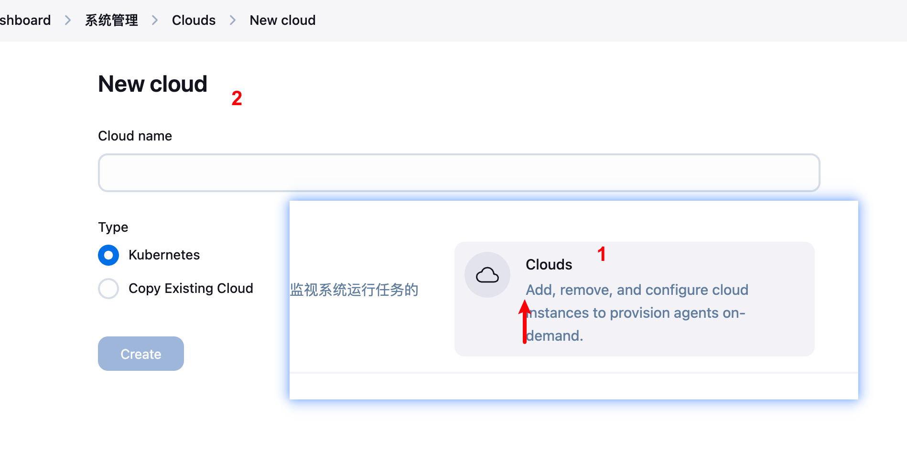
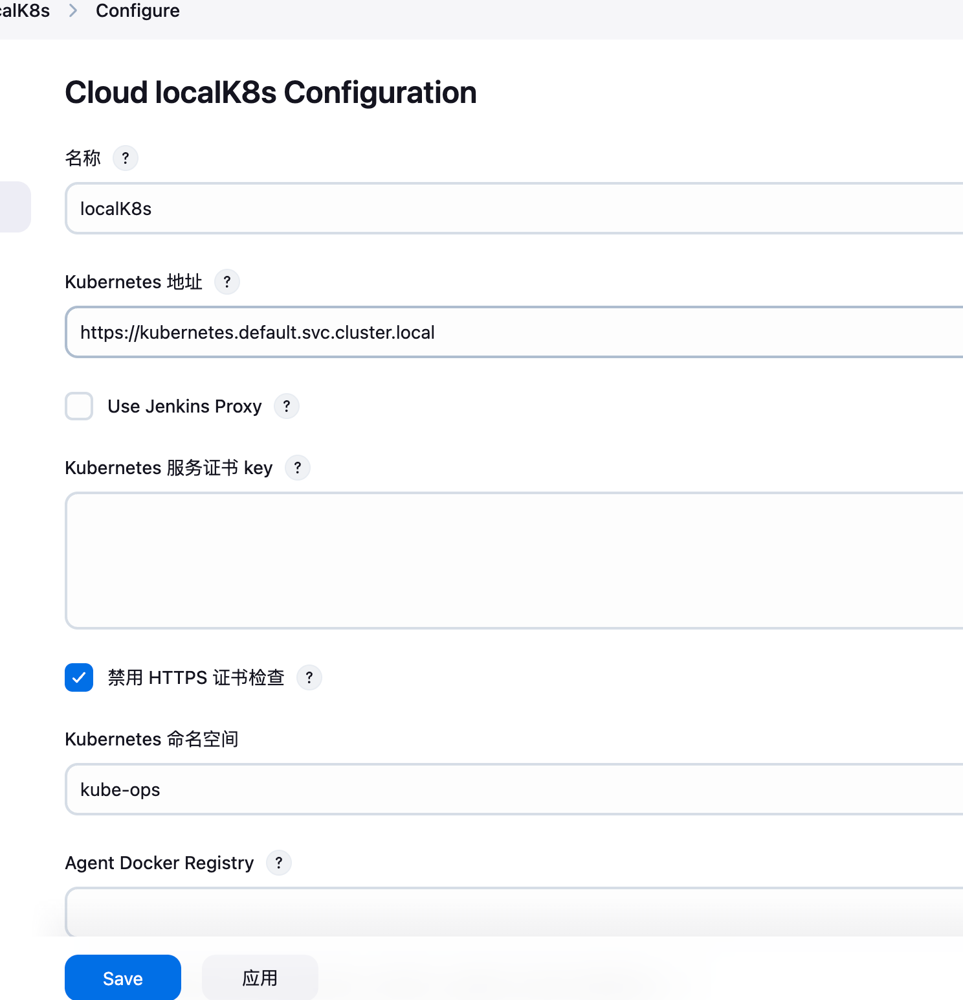
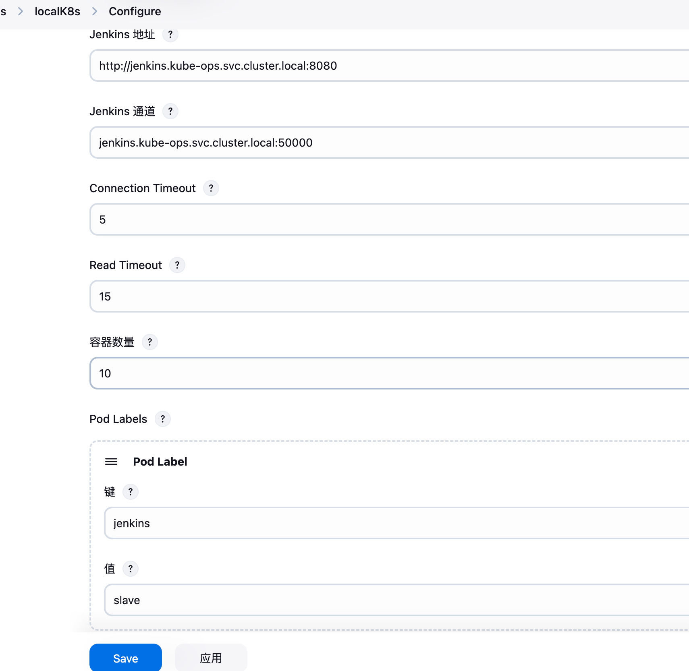
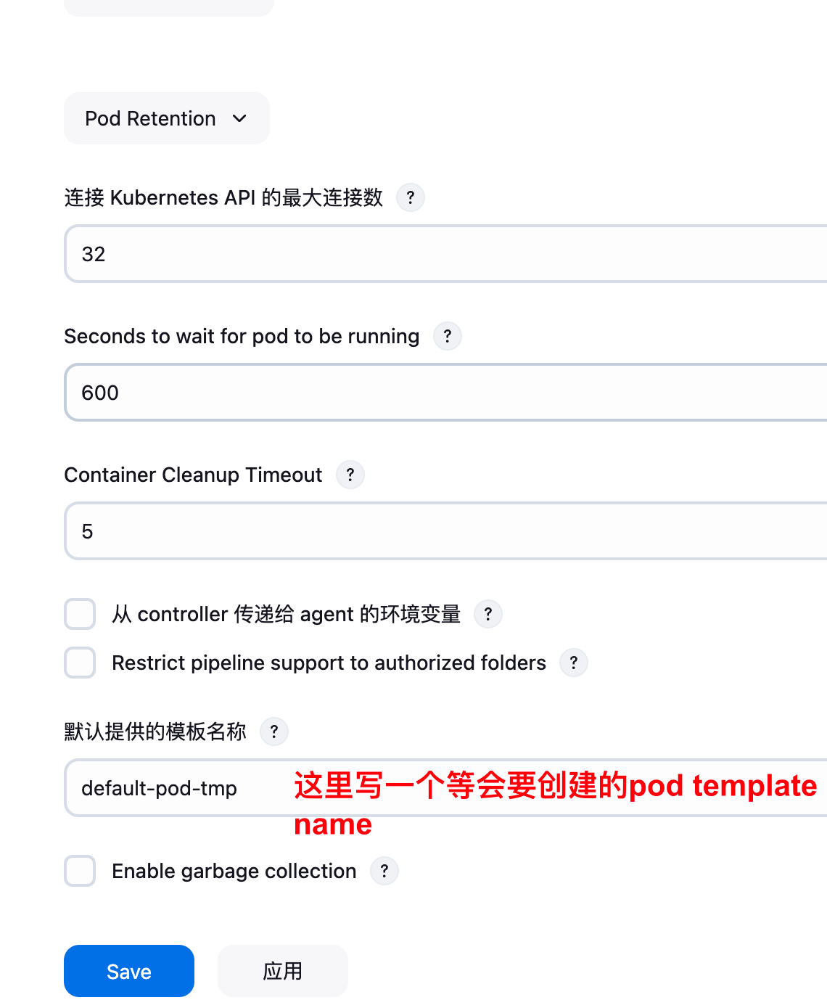
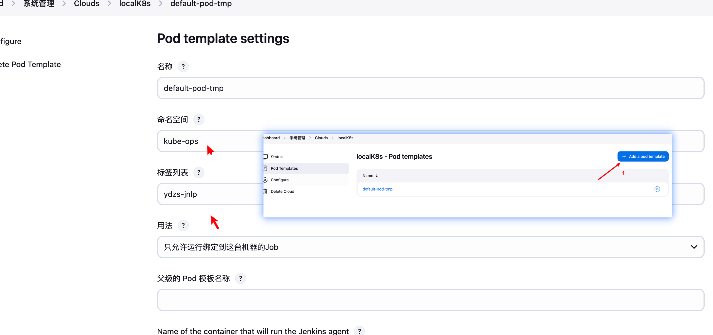
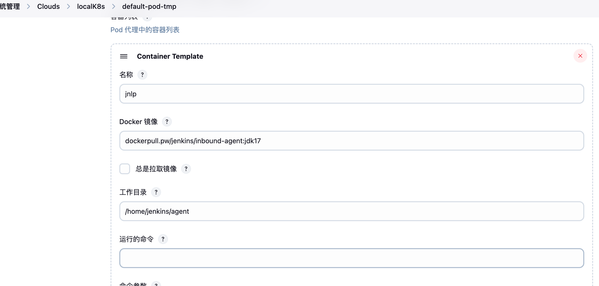
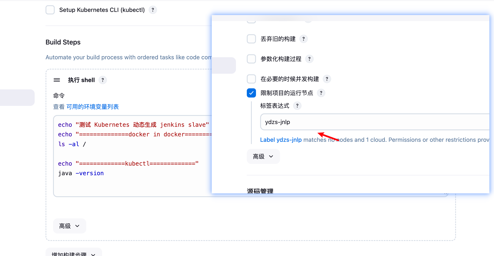
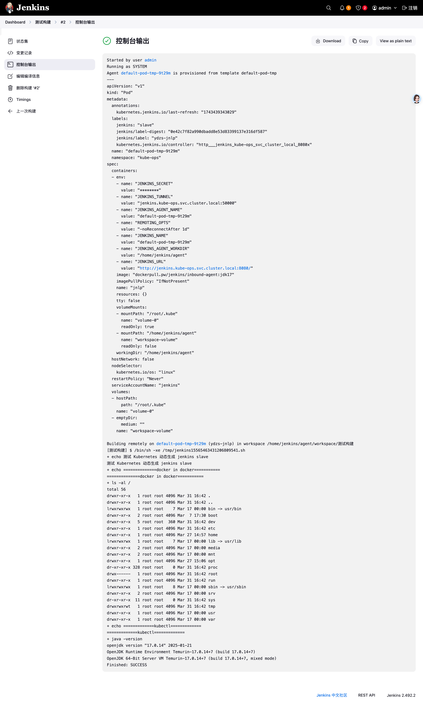

# 1. 目标

> 目标：学习 Jenkins on Kubernetes 的运行模式，部署架构，数据流

# 2. 安装 Jenkins

## 2.1 前提-基于 k3d 集群

[K3D ｜高效创建轻量级 k8s 集群 (run in dokcer) ](https://github.com/Panlq/xopensource/tree/main/k3d-demo)

```yaml
# k3d.yaml
ports:
  - port: 9980:80
    nodeFilters:
      - loadbalancer
  - port: 9910:30080
    nodeFilters:
      - loadbalancer
```

- 9980 是 ingress 80 端口映射到本地 9980 端口
- 9910 是集群内 30080 nodeport 映射到本地 9910

## 2.2 安装 Jenkins

既然要基于 Kubernetes 来做 CI/CD，我们这里最好还是将 Jenkins 安装到 Kubernetes 集群当中，安装的方式也很多，我们这里仍然还是使用手动的方式，这样可以了解更多细节，对应的资源清单文件如下所示

```yaml
# jenkins.yaml
# jenkins.yaml
apiVersion: v1
kind: PersistentVolumeClaim
metadata:
  name: jenkins-pvc
  namespace: kube-ops
spec:
  storageClassName: local-path
  accessModes:
    - ReadWriteOnce
  resources:
    requests:
      storage: 2Gi
---
apiVersion: v1
kind: ServiceAccount
metadata:
  name: jenkins
  namespace: kube-ops
---
kind: ClusterRole
apiVersion: rbac.authorization.k8s.io/v1
metadata:
  name: jenkins
rules:
  - apiGroups: ["extensions", "apps"]
    resources: ["deployments", "ingresses"]
    verbs: ["create", "delete", "get", "list", "watch", "patch", "update"]
  - apiGroups: [""]
    resources: ["services"]
    verbs: ["create", "delete", "get", "list", "watch", "patch", "update"]
  - apiGroups: [""]
    resources: ["pods"]
    verbs: ["create", "delete", "get", "list", "patch", "update", "watch"]
  - apiGroups: [""]
    resources: ["pods/exec"]
    verbs: ["create", "delete", "get", "list", "patch", "update", "watch"]
  - apiGroups: [""]
    resources: ["pods/log", "events"]
    verbs: ["get", "list", "watch"]
  - apiGroups: [""]
    resources: ["secrets"]
    verbs: ["get"]
---
apiVersion: rbac.authorization.k8s.io/v1
kind: ClusterRoleBinding
metadata:
  name: jenkins
  namespace: kube-ops
roleRef:
  apiGroup: rbac.authorization.k8s.io
  kind: ClusterRole
  name: jenkins
subjects:
  - kind: ServiceAccount
    name: jenkins
    namespace: kube-ops
---
apiVersion: apps/v1
kind: Deployment
metadata:
  name: jenkins
  namespace: kube-ops
spec:
  selector:
    matchLabels:
      app: jenkins
  template:
    metadata:
      labels:
        app: jenkins
    spec:
      serviceAccount: jenkins
      initContainers:
        - name: fix-permissions
          image: busybox:1.35.0
          command: ["sh", "-c", "chown -R 1000:1000 /var/jenkins_home"]
          securityContext:
            privileged: true
          volumeMounts:
            - name: jenkinshome
              mountPath: /var/jenkins_home

      containers:
        - name: jenkins
          image: jenkins/jenkins:lts-jdk17
          imagePullPolicy: IfNotPresent
          env:
            - name: JAVA_OPTS
              value: -Dhudson.model.DownloadService.noSignatureCheck=true -Dhudson.security.csrf.DefaultCrumbIssuer.EXCLUDE_SESSION_ID=true
          ports:
            - containerPort: 8080
              name: web
              protocol: TCP
            - containerPort: 50000
              name: agent
              protocol: TCP
          resources:
            limits:
              cpu: 1500m
              memory: 2048Mi
            requests:
              cpu: 1500m
              memory: 2048Mi
          readinessProbe:
            httpGet:
              path: /login
              port: 8080
            initialDelaySeconds: 60
            timeoutSeconds: 5
            failureThreshold: 12
          volumeMounts:
            - name: jenkinshome
              mountPath: /var/jenkins_home
            - name: disable-csrf
              mountPath: /usr/share/jenkins/ref/init.groovy.d/disable-csrf.groovy
              subPath: disable-csrf.groovy
      volumes:
        - name: jenkinshome
          persistentVolumeClaim:
            claimName: jenkins-pvc
        - name: disable-csrf
          configMap:
            name: jenkins-disable-csrf
---
apiVersion: v1
kind: Service
metadata:
  name: jenkins
  namespace: kube-ops
  labels:
    app: jenkins
spec:
  selector:
    app: jenkins
  ports:
    - name: web
      port: 8080
      targetPort: web
    - name: agent
      port: 50000
      targetPort: agent

---

---
apiVersion: v1
kind: Service
metadata:
  name: jenkins-nodeport
  namespace: kube-ops
  labels:
    app: jenkins
spec:
  selector:
    app: jenkins
  type: NodePort
  ports:
    - name: web
      port: 8080
      nodePort: 30080
      targetPort: web

---
apiVersion: v1
kind: ConfigMap
metadata:
  name: jenkins-disable-csrf
  namespace: kube-ops
data:
  disable-csrf.groovy: |
    import jenkins.model.Jenkins
    Jenkins.instance.setCrumbIssuer(null)

---
apiVersion: networking.k8s.io/v1
kind: Ingress
metadata:
  name: jenkins
  namespace: kube-ops
spec:
  rules:
    - host: jenkins.k8s.local
      http:
        paths:
          - path: /
            pathType: Prefix
            backend:
              service:
                name: jenkins
                port:
                  name: web
```

`jenkins/jenkins:lts-jdk17` 这是 jenkins 官方的 Docker 镜像，然后也有一些环境变量，当然我们也可以根据自己的需求来定制一个镜像，比如我们可以将一些插件打包在自定义的镜像当中，可以参考文档：https://github.com/jenkinsci/docker，我们这里使用默认的官方镜像就行，另外一个还需要注意的数据的持久化，将容器的 /var/jenkins_home 目录持久化即可，我们这里使用的是一个 StorageClass。

由于我们这里使用的镜像内部运行的用户 uid=1000，所以我们这里挂载出来后会出现权限问题，为解决这个问题，我们同样还是用一个简单的 initContainer 来修改下我们挂载的数据目录。

另外由于 jenkens 会对 update-center.json 做签名校验安全检查，这里我们需要先提前关闭，否则下面更改插件源可能会失败，通过配置环境变量 JAVA_OPTS=-Dhudson.model.DownloadService.noSignatureCheck=true 即可。

另外我们这里还需要使用到一个拥有相关权限的 serviceAccount：jenkins，我们这里只是给 jenkins 赋予了一些必要的权限，当然如果你对 serviceAccount 的权限不是很熟悉的话，我们给这个 sa 绑定一个 cluster-admin 的集群角色权限也是可以的，当然这样具有一定的安全风险。

然后我们可以通过 Ingress 中定义的域名 jenkins.k8s.local(需要做 DNS 解析或者在本地 /etc/hosts 中添加映射)来访问 jenkins 服务。

> 127.0.0.1 jenkins.k8s.local

执行如下命令来创建 jenkins 的资源清单即可：

```shell
k apply -f jenkins.yaml

k get all -n kube-ops                                                                                ⎈ k3d-dev-cluster
NAME                          READY   STATUS    RESTARTS       AGE
pod/jenkins-c997c45c7-x5wzz   1/1     Running   1 (7h9m ago)   7h26m

NAME                       TYPE        CLUSTER-IP      EXTERNAL-IP   PORT(S)              AGE
service/jenkins            ClusterIP   10.43.246.89    <none>        8080/TCP,50000/TCP   10h
service/jenkins-nodeport   NodePort    10.43.169.177   <none>        8080:30080/TCP       7h49m

NAME                      READY   UP-TO-DATE   AVAILABLE   AGE
deployment.apps/jenkins   1/1     1            1           10h

NAME                                 DESIRED   CURRENT   READY   AGE
replicaset.apps/jenkins-db94684c6    0         0         0       10h
replicaset.apps/jenkins-5d448844d5   0         0         0       10h
replicaset.apps/jenkins-8d568bc74    0         0         0       9h
replicaset.apps/jenkins-7bf5c6cf75   0         0         0       7h54m
replicaset.apps/jenkins-7c465fbcc8   0         0         0       7h36m
replicaset.apps/jenkins-75677fb958   0         0         0       7h50m
replicaset.apps/jenkins-86d89d8565   0         0         0       7h35m
replicaset.apps/jenkins-5f46878df5   0         0         0       7h31m
replicaset.apps/jenkins-c997c45c7    1         1         1       7h26m
```

当安装成功后，执行如下命令查看 admin 密码

```shell
 k exec -it -n kube-ops jenkins-c997c45c7-x5wzz -c jenkins -- cat /var/jenkins_home/secrets/initialAdminPassword

31a66e7434fb40daae70ea22d61aa91a
```



进入主页后，首先安装中文插件，搜索 `Localization: Chinese`，安装重启完成后，点击最下方的 `Jenkins 中文社区` 进入页面配置插件代理，在页面中点击下方的 `设置更新中心地址` 链接：

在新的页面最下面配置升级站点 URL 地址为 `https://updates.jenkins-zh.cn/update-center.json`（可能因为版本的问题会出现错误，可以尝试使用地址：`https://cdn.jsdelivr.net/gh/jenkins-zh/update-center-mirror/tsinghua/dynamic-stable-2.277.1/update-center.json` 进行测试），然后点击 `提交`，最后点击 `立即获取`：



比如我们可以搜索安装 `Pipeline` 插件，配置完成后正常下载插件就应该更快了。

## 2.3 配置

接下来我们就需要来配置 Jenkins，让他能够动态的生成 Slave 的 Pod。

第 1 步. 我们需要安装 [kubernetes 插件](https://github.com/jenkinsci/kubernetes-plugin)， 点击 Manage Jenkins -> Manage Plugins -> Available -> Kubernetes 勾选安装即可。


第 2 步. 安装完毕后，进入 `http://jenkins.k8s.local:9980/configureClouds/` 页面：在该页面我们可以点击 `Add a new cloud` -> 选择 `Kubernetes`，首先点击 `Kubernetes Cloud details...` 按钮进行配置：



首先配置连接 Kubernetes APIServer 的地址，由于我们的 Jenkins 运行在 Kubernetes 集群中，所以可以使用 Service 的 DNS 形式进行连接 `https://kubernetes.default.svc.cluster.local`：



注意 namespace，我们这里填 kube-ops，然后点击 `Test Connection`，如果出现 `Connected to Kubernetes...` 的提示信息证明 Jenkins 已经可以和 Kubernetes 系统正常通信了。

然后下方的 Jenkins URL 地址：`http://jenkins.kube-ops.svc.cluster.local:8080`，这里的格式为：`服务名.namespace.svc.cluster.local:8080`，根据上面创建的 jenkins 的服务名填写，包括下面的 Jenkins 通道，默认是 50000 端口（要注意是 TCP，所以不要填写 http）：



第 3 步. 点击最下方的保存，然后进入创建的 `Pod Templates` 按钮用于配置 Jenkins Slave 运行的 Pod 模板，命名空间我们同样是用 kube-ops，Labels 这里也非常重要，对于后面执行 Job 的时候需要用到该值。



然后配置下面的容器模板，我们这里使用的是 ` dockerpull.pw/jenkins/inbound-agent:jdk17` 这个镜像，这个是官方对应的 agent jnlp 镜像。



容器的名称必须是 `jnlp`，这是默认拉起的容器，另外需要将 `运行的命令` 和 `命令参数` 的值都删除掉，否则会失败。

到这里我们的 Kubernetes 插件就算配置完成了，记得保存。

注意 jenkins 和 jnlp 的版本要对应，否则无法正常使用，参考

#### jenkins & jnlp agent 版本对应关系

| Jenkins 主版本    | 推荐 Agent 镜像      | Java 版本 |
| ----------------- | -------------------- | --------- |
| jenkins:lts       | inbound-agent        | Java 11   |
| jenkins:lts-jdk17 | inbound-agent:jdk17  | Java 17   |
| jenkins:latest    | inbound-agent:latest | Java 11+  |

## 2.4 新建测试任务

Kubernetes 插件的配置工作完成了，接下来我们就来添加一个 Job 任务，看是否能够在 Slave Pod 中执行，任务执行完成后看 Pod 是否会被销毁。

在 Jenkins 首页点击 `新建任务`，创建一个测试的任务，输入任务名称，然后我们选择 `构建一个自由风格的软件项目` 类型的任务，注意在下面的 `Label Expression` 这里要填入 `ydzs-jnlp`，就是前面我们配置的 Slave Pod 中的 Label，这两个地方必须保持一致：

然后往下拉，在 `构建` 区域增加构建步骤选择 `执行 shell`：

```shell
echo "测试 Kubernetes 动态生成 jenkins slave"
echo "==============docker in docker==========="
ls -al /

echo "=============kubectl============="
java -version

```



现在我们直接在页面点击左侧的 `立即构建` 触发构建即可，然后观察 Kubernetes 集群中 Pod 的变化：

```shell
k get pod -n kube-ops                                                                                ⎈ k3d-dev-cluster
NAME                      READY   STATUS    RESTARTS      AGE
jenkins-c997c45c7-x5wzz   1/1     Running   1 (24h ago)   24h
default-pod-tmp-9t29m     1/1     Running   0             22s
```

我们可以看到在我们点击立刻构建的时候可以看到一个新的 Pod：`default-pod-tmp-9t29m` 被创建了，这就是我们的 Jenkins Slave。任务执行完成后我们可以看到任务信息:



到这里证明我们的任务已经构建完成，然后这个时候我们再去集群查看我们的 Pod 列表，发现 kube-ops 这个 namespace 下面已经没有之前的 Slave 这个 Pod 了。

# 3. 基本原理

我们都知道 Jenkins 是 master/agent 的架构。而 master 与 agent 之间通信方法有两种：

1. 通过 JNLP 协议：需要启动 JNLP 客户端主动连接 master。这是 Kubernetes 插件使用的方式。
2. 通过 SSH 协议：master 使用 SSH 主动连接 agent 机器。

Kubernetes 插件的具体的做法就是连接到 Kubernetes 集群，然后启动一个 Pod。Pod 中包含一个 JNLP 客户端，容器名约定为：jnlp。jnlp 会主动连接 Jenkins master。

# 4. 问题

## 1. csrf 校验

```shell
HTTP ERROR 403 No valid crumb was included in the request
URI:	/pluginManager/install
STATUS:	403
MESSAGE:	No valid crumb was included in the request
SERVLET:	Stapler
```

彻底解决方法

### 通过 init.groovy 脚本彻底禁用

1. 创建一个 ConfigMap：

```yaml
apiVersion: v1
kind: ConfigMap
metadata:
  name: jenkins-disable-csrf
  namespace: kube-ops
data:
  disable-csrf.groovy: |
    import jenkins.model.Jenkins
    Jenkins.instance.setCrumbIssuer(null)
```

2. 修改你的 Deployment，添加 volume 挂载：

```yaml
volumes:
  - name: disable-csrf
    configMap:
      name: jenkins-disable-csrf
volumeMounts:
  - name: disable-csrf
    mountPath: /usr/share/jenkins/ref/init.groovy.d/disable-csrf.groovy
    subPath: disable-csrf.groovy
```

# 参考

1. [Jenkins on kubernetes 实践](https://www.qikqiak.com/k3s/devops/jenkins/)
2. [有关 Jenkins CI/CD 的全面资料](https://jenkins.xfoss.com/Ch00_Overview.html)
3. [kubernetes-plugin](https://github.com/jenkinsci/kubernetes-plugin)
4. [Difference between: jenkins/agent and jenkins/inbound-agent images?](https://community.jenkins.io/t/difference-between-jenkins-agent-and-jenkins-inbound-agent-images/1017)
