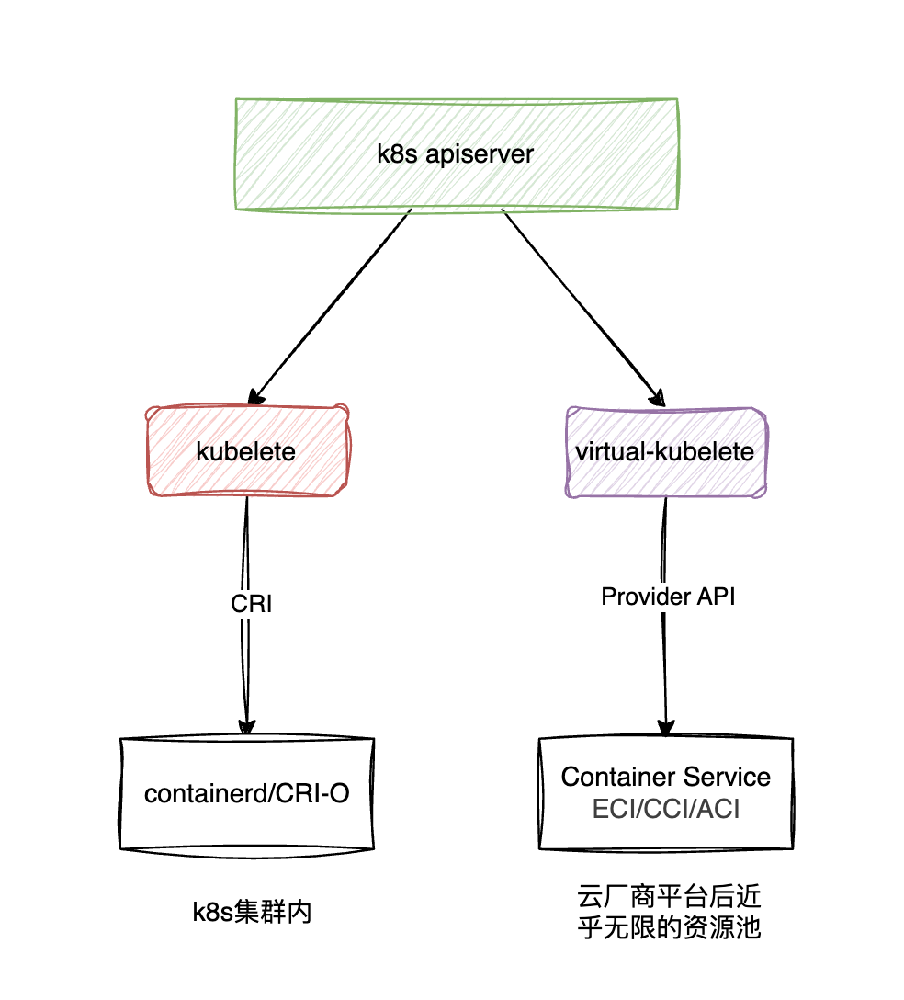
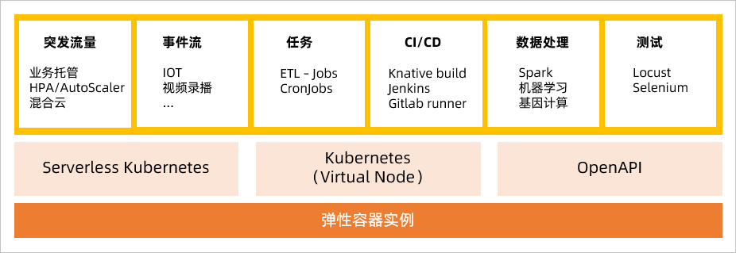
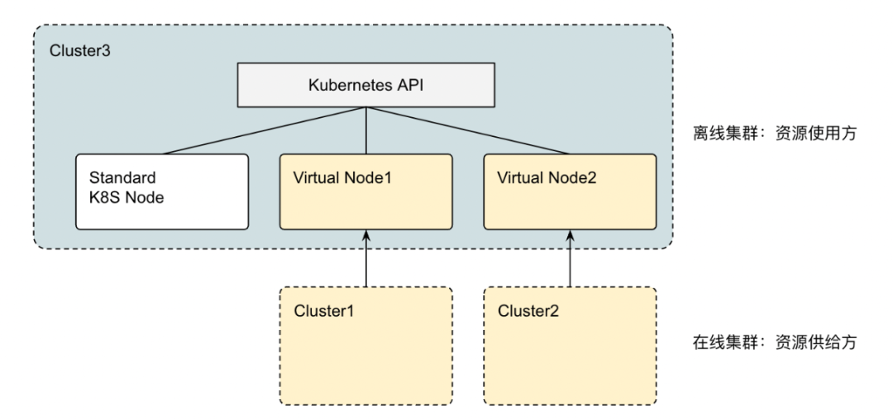
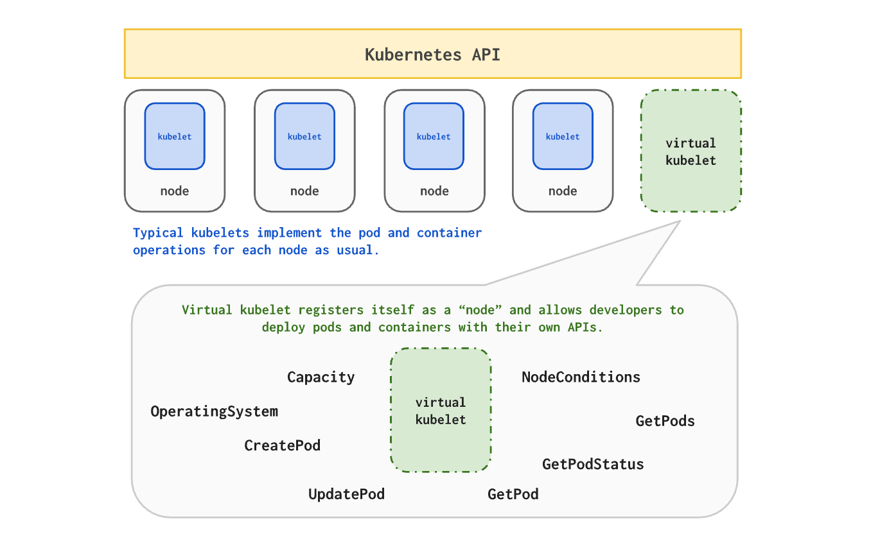
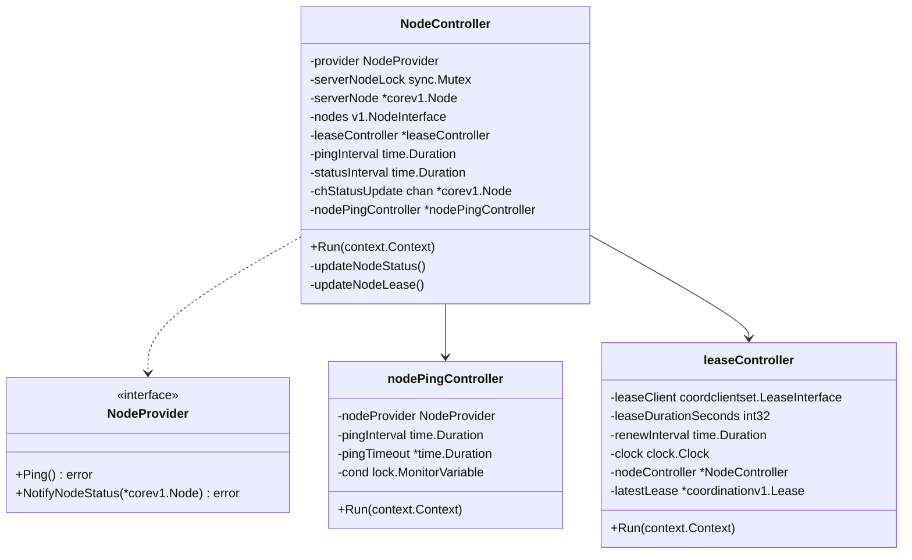
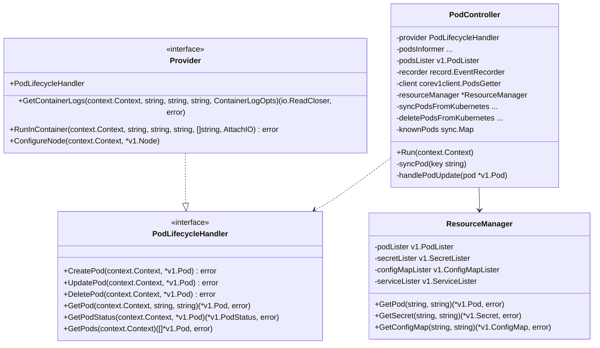
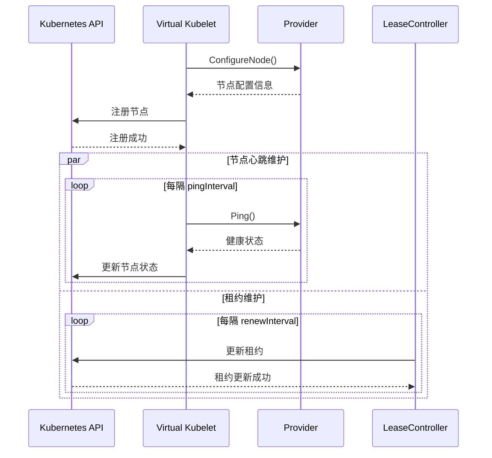
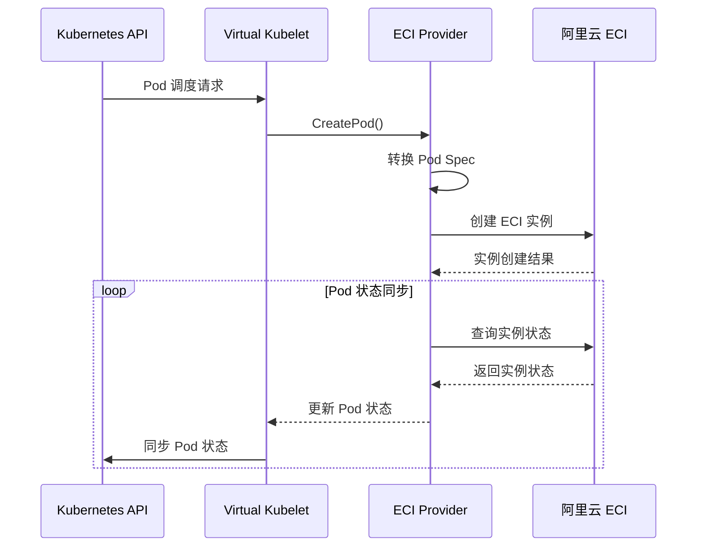
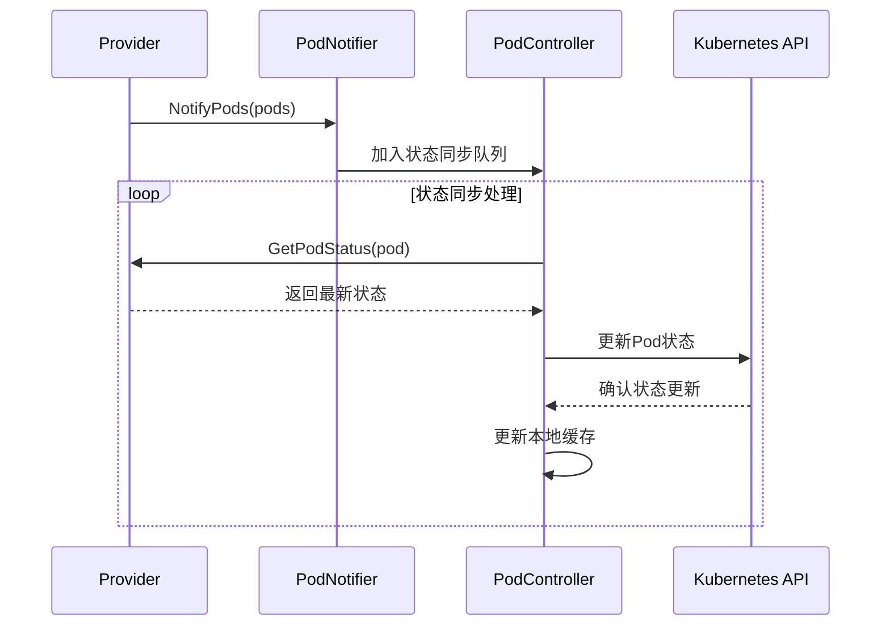

# Virtual-Kubelet 应用场景及架构解析

# 1. 简介

- virtual-kubelet 是一个开源的社区主导型项目，是 Kubernetes kubelet 的一种实现
- 它伪装成 kubelet，与 Kubernetes 集群 API 通信
- 实现 Kubernetes API 向阿里云的 ECI、AWS 的 Fargate 等 serverless 平台扩展
- Github 项目地址[virtual-kubelet](https://github.com/virtual-kubelet/virtual-kubelet)

# 2. 工作原理



Virtual Kubelet 的作用很简单，就是将各大公有云厂商提供的容器服务与 K8S 的 apiserver 打通，实现通过 K8S 的 api 编排云厂商的无服务器容器服务（如：AWS 的 Fargate，Azure 的 ACI，阿里的 ECI 等）。原理上就是向 K8S 的 apiserver 注册一个伪造的 kubelet（相当于加入一个节点）接收 apiserver 调度过来的 pod，只不过真实的 kubelet 接收到负载之后是在自身管理的 node 上进行启动 pod 等操作，Virtual Kubelet 接收到负载后调用注册的 api 往云厂商容器服务创建工作负载。

- Virtual-kubelet 在 Kubernetes API 看来，跟普通的 kubelet API 差不多，区别在于可以在其他地方调度容器。
- 某种程度上来讲，可以把 Virtual-kubelet 理解为一个功能受限的、资源近乎无限的 node 节点
- 所有的 Pod 并不会跑在一个集中式的“真实”节点上，而是被打散到云平台资源池里面
- 为了实现 kubelet API，Virtual-kubelet 提供插件式的[Provider](https://github.com/virtual-kubelet/virtual-kubelet#Providers)接口，允许开发者去根据自身情况自定义的实现普通 kubelet 功能，提供 Provider 的基本是公有云厂商，目前的提供方可查看-> [current-providers ](https://virtual-kubelet.kubernetes.ac.cn/docs/providers/#current-providers)

## 跟实际 kubelet 的区别

> 由于 Virtual-kubelet 需要考虑安全性问题，并不会实现所有 kubelet 功能，例如特权容器，因此没法挂载宿主机的 docker

这里以[阿里云的 ECI 为例](https://help.aliyun.com/zh/eci/product-overview/limits?spm=a2c4g.11186623.help-menu-87486.d_0_0_5.4d0062f8n06mjW&scm=20140722.H_89138._.OR_help-T_cn~zh-V_1#section-9rc-bzz-e7y)

基于 Kubernetes 社区的 Virtual Kubelet 技术，ECI 通过虚拟节点与 Kubernetes 实现无缝对接，因此 ECI 实例并不会运行在一个集中式的真实节点上，而是打散分布在整个阿里云的资源池中。

基于公有云的安全性和虚拟节点本身带来的限制，ECI 目前还不支持 Kubernetes 中 HostPath、DaemonSet 等功能

| **不支持的功能**         | **说明**                          | **推荐替代方案**                       |
| ------------------------ | --------------------------------- | -------------------------------------- |
| HostPath                 | 挂载本地宿主机文件到容器中        | 使用 emptyDir、云盘或者 NAS 文件系统   |
| HostNetwork              | 将宿主机端口映射到容器上          | 使用 type=LoadBalancer 的负载均衡      |
| DaemonSet                | 在容器所在宿主机上部署 Static Pod | 通过 sidecar 形式在 Pod 中部署多个镜像 |
| type=NodePort 的 Service | 将宿主机端口映射到容器上          | 使用 type=LoadBalancer 的负载均衡      |

禁用 hostpath 的方式之一：**PodSecurityPolicy**

```yaml
apiVersion: policy/v1beta1
kind: PodSecurityPolicy
metadata:
  name: restrict-hostpath
spec:
  allowedVolumes:
    - "configMap" # 允许使用 ConfigMap
    - "secret" # 允许使用 Secret
    - "emptyDir" # 允许使用临时卷
    - "persistentVolumeClaim" # 允许使用 PVC
  # 禁止使用 hostPath（宿主机目录挂载）
  hostPath:
    - type: "" # 清空所有 hostPath 允许规则，即完全禁止
  seLinux:
    rule: RunAsAny
  runAsUser:
    rule: RunAsAny
  fsGroup:
    rule: RunAsAny
  supplementalGroups:
    rule: RunAsAny
```

# 3. [应用场景](https://help.aliyun.com/zh/eci/product-overview/scenarios?spm=a2c4g.11186623.help-menu-87486.d_0_0_3.6a5a62f8LA73jN&scm=20140722.H_89132._.OR_help-T_cn~zh-V_1)

弹性容器实例适用于容器形态下大部分业务场景，从弹性及成本角度，特别适用于在线业务的免运维托管、大数据计算任务（Spark、Presto）、事件驱动型业务和 Job 型业务，以及 DevOps、机器学习、在线测试等各类场景



[腾讯云 Crane 基于 Virtual Kubelet 的实践](https://cloud.tencent.com/developer/article/2278407)------大规模离在线混部和资源调度，利用 virtual-kubelet 在在线集群中注册虚拟节点，监控过剩资源，提供给离线集群调度。

Crane 的 Virtual Kubelet Provider 实现了对单集群所有节点闲置资源的监听汇总，并更新至虚拟节点可分配资源中。一个节点就能代表整个集群的所有离线算力。



## 优势

对于很多 Kubernetes 集群，通常同时支撑在线和离线多种负载，在线负载流量的波动性和离线计算任务的时间不确定性，导致在不同时刻负载的资源需求呈波峰波谷状，比如很多企业需要在周末、月中和月末进行大批量的数据计算，在特定的时间点需要大量的计算力，以应对突发的计算资源需求。

对于 Jenkins 构建任务，工作期间的构建相对属于高峰期，但是非工作时间集群就属于空转了(基于构建集群和业务集群相互独立不影响的前提)。

目前 k8s 通常的做法是通过 autoscaler 自动扩容节点（约 3 min+启动一个新节点），直到 pod 被成功调度运行，当 pod 执行完成后会自动回收临时节点。这种扩容方式 pod 往往需要等待 > 3 min 才能被调度运行。有时候可能当节点就绪后，排队任务已经在已有节点跑起来了。

通过 Virtual kubelet ，可以用最小的运维成本（无需调整节点数量），来应对集群计算资源高峰压力，以零成本(按需计费)来应对集群的空转。

# 4. Virtual Kubelet 架构分析



## 整体架构说明

[Virtual Kubelet ](https://github.com/virtual-kubelet/virtual-kubelet)是一个开源项目，它实现了 Kubernetes 节点接口，使得外部计算资源能够无缝集成到 Kubernetes 集群中。其核心组件包括：

- **NodeController**: 负责节点生命周期管理，维护节点状态和心跳
- **PodController**: 处理 Pod 的创建、更新、删除等操作
- **Provider Interface**: 定义了需要实现的核心功能接口

## 核心组件类图





## 核心类关系说明

### NodeController

NodeController 是节点管理的核心组件，主要职责包括：

- 通过 NodeProvider 接口实现节点状态维护
- 维护节点心跳和健康状态检查
- 管理节点租约(Lease)以确保节点存活性
- 定期更新节点状态到 Kubernetes API Server

### PodController

PodController 负责 Pod 的生命周期管理，核心功能包括：

- 监听并处理 Pod 的创建、更新、删除事件
- 通过 PodLifecycleHandler 接口执行具体的 Pod 操作
- 维护 Pod 状态并同步到 Kubernetes API Server
- 通过 ResourceManager 管理 Pod 依赖的 ConfigMap、Secret 等资源

### Provider 接口

Provider 是整个 Virtual Kubelet 的核心抽象接口，它：

- 继承了 PodLifecycleHandler 接口，提供 Pod 生命周期管理能力
- 扩展了容器运行时操作能力(日志、执行命令等)
- 提供节点状态维护的能力
- 作为适配层连接 Kubernetes 与实际的计算资源提供方

### 辅助组件

- **nodePingController**: 负责维护节点心跳，定期检查节点健康状态
- **leaseController**: 管理节点租约，确保节点在 Kubernetes 集群中的存活性
- **ResourceManager**: 管理 Pod 依赖的 ConfigMap、Secret 等资源，提供统一的资源访问接口

## 核心流程时序图

### 虚拟节点注册流程

虚拟节点注册流程描述了 Virtual Kubelet 如何将 Provider 提供的计算资源注册到 Kubernetes 集群中，并保持节点的可用性：

1. **节点配置初始化**

   - Virtual Kubelet 启动时调用 Provider 的 ConfigureNode()方法
   - Provider 返回节点的配置信息，包括资源容量、标签等

2. **节点注册**

   - Virtual Kubelet 将节点信息注册到 Kubernetes API Server
   - API Server 确认注册并返回成功响应

3. **并行维护机制**

   - 心跳维护：
     - 定期调用 Provider 的 Ping()方法检查健康状态
     - 将最新的节点状态同步到 API Server
   - 租约维护：
     - LeaseController 定期更新节点租约
     - 确保节点在集群中保持活跃状态



### ECI Pod 调度创建流程

ECI Pod 调度流程展示了当 Pod 被调度到 Virtual Kubelet 节点后，如何通过 ECI Provider 创建和管理容器实例：

1. **Pod 调度**

   - Kubernetes 调度器将 Pod 分配到 Virtual Kubelet 节点
   - Virtual Kubelet 接收到 Pod 创建请求

2. **实例创建**

   - Virtual Kubelet 调用 ECI Provider 的 CreatePod()方法
   - Provider 将 Kubernetes Pod 规格转换为 ECI 实例规格
   - 调用阿里云 API 创建 ECI 实例

3. **状态同步**

   - Provider 定期查询 ECI 实例状态
   - 将实例状态转换为 Pod 状态
   - 通过 Virtual Kubelet 同步到 Kubernetes API Server

4. **生命周期管理**

   - Pod 更新和删除操作会触发相应的 ECI 实例操作
   - 保持 Kubernetes 中 Pod 状态与 ECI 实例状态的一致性



#### 源码分析

#### Pod 事件处理流程

PodController 通过 Informer 机制监听 Pod 的变更事件，核心实现位于[podcontroller.go](https://github.com/virtual-kubelet/virtual-kubelet/blob/master/node/podcontroller.go)：

```go
// 注册Pod事件处理函数
var eventHandler cache.ResourceEventHandler = cache.ResourceEventHandlerFuncs{
    AddFunc: func(pod interface{}) {
        if key, err := cache.MetaNamespaceKeyFunc(pod); err != nil {
            log.G(ctx).Error(err)
        } else {
            pc.knownPods.Store(key, &knownPod{})
            pc.syncPodsFromKubernetes.Enqueue(ctx, key)
        }
    },
    UpdateFunc: func(oldObj, newObj interface{}) {
        oldPod := oldObj.(*corev1.Pod)
        newPod := newObj.(*corev1.Pod)

        if key, err := cache.MetaNamespaceKeyFunc(newPod); err != nil {
            log.G(ctx).Error(err)
        } else {
            if podShouldEnqueue(oldPod, newPod) {
                pc.syncPodsFromKubernetes.Enqueue(ctx, key)
            }
        }
    },
    DeleteFunc: func(pod interface{}) {
        if key, err := cache.DeletionHandlingMetaNamespaceKeyFunc(pod); err != nil {
            log.G(ctx).Error(err)
        } else {
            pc.knownPods.Delete(key)
            pc.syncPodsFromKubernetes.Enqueue(ctx, key)
        }
    },
}
```

主要处理逻辑：

1. AddFunc：生成 Pod 唯一标识 key，将 Pod 加入 knownPods 缓存，并将 key 加入同步队列
2. UpdateFunc：对比新旧 Pod 状态，决定是否需要同步更新
3. DeleteFunc：从 knownPods 缓存中删除 Pod，并将删除事件加入同步队列

#### Pod 创建/更新流程

Pod 的创建和更新由 syncPodFromKubernetesHandler 处理，核心实现如下：

```go
func (pc *PodController) syncPodFromKubernetesHandler(ctx context.Context, key string) (retErr error) {
    namespace, name, err := cache.SplitMetaNamespaceKey(key)
    if err != nil {
        return err
    }

    // 从API Server获取最新Pod对象
    pod, err := pc.podsLister.Pods(namespace).Get(name)
    if err != nil {
        if errors.IsNotFound(err) {
            // Pod已被删除，从Provider中删除
            if err := pc.provider.DeletePod(ctx, pod); err != nil {
                return err
            }
            return nil
        }
        return err
    }

    // 调用Provider进行Pod同步
    if err := pc.syncPodInProvider(ctx, pod); err != nil {
        return err
    }
    return nil
}


func (pc *PodController) createOrUpdatePod(ctx context.Context, pod *corev1.Pod) error {
    // 检查Provider中是否存在Pod
    existingPod, err := pc.provider.GetPod(ctx, pod.Namespace, pod.Name)
    if err != nil {
        if !errdefs.IsNotFound(err) {
            return err
        }
        // Pod不存在，创建新Pod
        if err := pc.provider.CreatePod(ctx, pod); err != nil {
            return err
        }
        return nil
    }

    // Pod已存在，执行更新操作
    if err := pc.provider.UpdatePod(ctx, pod); err != nil {
        return err
    }
    return nil
}
```

主要处理逻辑：

1. 解析 Pod 的 namespace 和 name
2. 从 podsLister 获取最新的 Pod 对象
3. 调用 syncPodInProvider 进行实际的 Pod 同步
4. 在 createOrUpdatePod 中，先检查 Provider 中是否存在 Pod
5. 根据 Pod 是否存在，调用 Provider 的 CreatePod 或 UpdatePod 方法

### Pod 状态同步流程



Pod 状态同步流程描述了 Provider 如何将 Pod 的最新状态异步通知给 Virtual Kubelet，并最终同步到 Kubernetes API Server。这个流程涉及多个组件的交互，主要包括 Provider、PodController 和 Kubernetes API Server。

#### 源码分析

1. **Provider 状态同步**

   - Provider 通过 syncProviderWrapper 实现状态同步，源码位于 `node/sync.go`
   - Provider.Run 启动后会运行一个 goroutine 执行 syncPodStatuses，每 5 秒同步一次 Pod 状态：

   ```go
   func (p *syncProviderWrapper) run(ctx context.Context) {
       interval := 5 * time.Second
       timer := time.NewTimer(interval)
       for {
           timer.Reset(interval)
           select {
           case <-ctx.Done():
               return
           case <-timer.C:
           }
           p.syncPodStatuses(ctx)
       }
   }
   ```

2. **状态变更通知**

   - Provider 检测到 Pod 状态变化时，通过 NotifyPods 方法通知 PodController：

   ```go
   func (p *syncProviderWrapper) NotifyPods(ctx context.Context, f func(*corev1.Pod)) {
       p.notify = f
   }
   ```

   - PodController 收到通知后，调用 enqueuePodStatusUpdate 将 Pod 加入状态更新队列：

   ```go
   func (pc *PodController) enqueuePodStatusUpdate(ctx context.Context, pod *corev1.Pod) {
       kpod.lastPodStatusReceivedFromProvider = pod
       pc.syncPodStatusFromProvider.Enqueue(ctx, key)
   }
   ```

3. **状态更新处理**

   - syncPodStatusFromProviderHandler 从队列中获取 Pod 并处理状态更新：

   ```go
   func (pc *PodController) syncPodStatusFromProviderHandler(ctx context.Context, key string) (retErr error) {
       pod, err := pc.podsLister.Pods(namespace).Get(name)
       if err != nil {
           return pkgerrors.Wrap(err, "error looking up pod")
       }
       return pc.updatePodStatus(ctx, pod, key)
   }
   ```

   - updatePodStatus 负责将状态同步到 Kubernetes API Server：

   ```go
   func (pc *PodController) updatePodStatus(ctx context.Context, podFromKubernetes *corev1.Pod, key string) error {
       if shouldSkipPodStatusUpdate(podFromKubernetes) {
           return nil
       }
       // 更新Pod状态
       if _, err := pc.client.Pods(podFromKubernetes.Namespace).UpdateStatus(ctx, podFromProvider, metav1.UpdateOptions{}); err != nil {
           return pkgerrors.Wrap(err, "error while updating pod status in kubernetes")
       }
       return nil
   }
   ```

**主要处理逻辑**:

1. Provider.Run -> syncPodStatuses 周期性同步 Pod 状态
2. Provider 通过 NotifyPods 通知状态变更
3. PodController.enqueuePodStatusUpdate 将更新加入队列
4. syncPodStatusFromProvider.Enqueue 触发状态更新
5. syncPodStatusFromProviderHandler 处理状态更新
6. updatePodStatus 同步状态到 Kubernetes API Server

# 5. 参考

1. [无处不在的离线算力-Crane 基于 Virtual Kubelet 的实践](https://cloud.tencent.com/developer/article/2278407)
2. [阿里云弹性容器实例（Elastic Container Instance）](https://help.aliyun.com/zh/eci/product-overview/what-is-elastic-container-instance?spm=a2c4g.11186623.help-menu-87486.d_0_0_0.233d44bbvDKLHo)
3. [kubernetes 基于 virtual-kubelet 实现弹性 Pod](https://luanlengli.github.io/2020/11/10/kubernetes%E5%9F%BA%E4%BA%8Evirtual-kubelet%E5%AE%9E%E7%8E%B0%E5%BC%B9%E6%80%A7Pod.html)
4. [深究 Virtual-Kubelet 源码](https://zhuanlan.zhihu.com/p/621485573)
5. [华为云基于 K8S 构建企业级 Serverless Container 平台实践](http://mp.weixin.qq.com/s?__biz=MzU1OTAzNzc5MQ==&mid=2247486452&idx=1&sn=76db917f8338a6984a977466e4eab7b2&chksm=fc1c27c4cb6baed2460e40dcdf2edc0b2a5109a01aa2db9ed9774dedfc59e6df46e636f59bab&scene=21#wechat_redirect)
