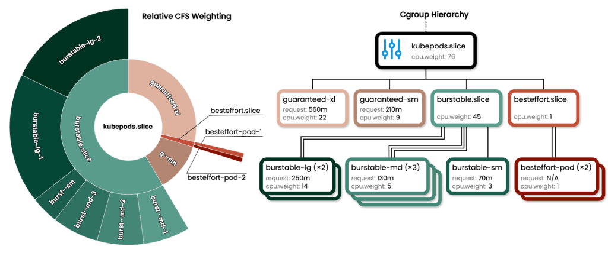

```yaml
apiVersion: v1
kind: Pod
metadata:
  name: demo-pod
spec:
  containers:
    - name: app
      image: nginx
      resources:
        requests:
          cpu: "0.5" # 请求 0.5 核
          memory: "100Mi" # 请求 100MB
        limits:
          cpu: "1" # 限制 1 核
          memory: "200Mi" # 限制 200MB
```

优先了解[Kubernetes 中 cpu, mem 的资源单位](https://kubernetes.io/zh-cn/docs/concepts/configuration/manage-resources-containers/#resource-units-in-kubernetes)

**CPU 属于可压缩资源**，其中 CPU 资源的分配和管理是 Linux 内核借助于完全公平调度算法（ CFS ）和 Cgroup 机制共同完成的。简单地讲，如果 pod 中服务使用 CPU 超过设置的 CPU `limits`， pod 的 CPU 资源会被限流（ throttled ）。对于没有设置 `limit`的 pod ，一旦节点的空闲 CPU 资源耗尽，之前分配的 CPU 资源会逐渐减少。不管是上面的哪种情况，最终的结果都是 Pod 已经越来越无法承载外部更多的请求，表现为应用延时增加，响应变慢。

**内存属于不可压缩资源**， Pod 之间是无法共享的，完全独占的，这也就意味着资源一旦耗尽或者不足，分配新的资源一定是会失败的。有的 Pod 内部进程在初始化启动时会提前开辟出一段内存空间。比如 JVM 虚拟机在启动的时候会申请一段内存空间。如果内存 `requests` 指定的数值小于 JVM 虚拟机向系统申请的内存，导致内存申请失败（ oom-kill ），从而 Pod 出现不断地失败重启。

> 注：kubelet 在启动时就会预留一部分系统级的资源给 如 kubelet,sshd 等系统组件，剩下的才是给 pod 的。
>
> ```yaml
> systemReserved:
>   cpu: 500m
>   memory: 500Mi
> ```
>
> 通过 kubectl describe node 可以看到节点所剩可分配资源
>
> ```bash
> Capacity:
>   cpu:                4
>   <omitted>
>   memory:             6069552Ki
> Allocatable:
>   cpu:                3500m
>   <omitted>
>   memory:             5455152Ki
>
> ```

## **1. CPU 资源映射关系**

### **(1) `limits.cpu` → `cpu.max`**

- **Kubernetes** ：`limits.cpu: "1"`
- **Cgroup v2** ：

```bash
  # 格式: $MAX $PERIOD (单位: 微秒)
  echo "100000 100000" > /sys/fs/cgroup/kubepods.slice/cpu.max
```

- `100000/100000 = 1核`（即每 100ms 周期内最多使用 100ms CPU 时间）
- **作用** ：硬性限制容器最多使用 1 核 CPU

### **(2) `requests.cpu` → `cpu.weight`**

- **Kubernetes** ：`requests.cpu: "0.5"`
- **Cgroup v2** ：

```bash
  # 权重范围 1-10000，默认 100
  echo 50 > /sys/fs/cgroup/kubepods.slice/cpu.weight
```

- `0.5核 / 1核 = 50%` → 权重值 `50`（相对于默认值 100）
- **作用** ：当节点 CPU 竞争时，此容器至少获得 50% 的 CPU 时间份额

关于 cpu.weight 的计算并非入商简单的 0.5\*100，而是有一个复杂的计算公式，主要是为了平衡 node 可用 cpu 的时间片分配。在 cpu 资源竞争时，按照 cpu.weight 的比例瓜分 cpu 资源。

cpu.weight 的计算公式：

> (((cpuShares - 2) \* 9999) / 262142) + 1

比如总的 4 核 cpu，pod1 cpu.weight = 79 pod2 cpu.weight = 39

- `pod1`: (79/118) _ 100 _ 4 = ~ 267% (or 2.67 CPU)
- `pod1`: (39/118) _ 100 _ 4 = ~ 132% (or 1.32 CPU)

## **2. 内存资源映射关系**

[使用 cgroup v2 的内存 QOS](https://kubernetes.io/zh-cn/docs/concepts/workloads/pods/pod-qos/#memory-qos-with-cgroup-v2), 以下是[新特性](https://kubernetes.io/blog/2021/11/26/qos-memory-resources/)，「**默认未打开**」。

> **特性状态：** `Kubernetes v1.22 [alpha]` (enabled by default: false)

内存 QoS 使用 cgroup v2 的内存控制器来保证 Kubernetes 中的内存资源。 Pod 中容器的内存请求和限制用于设置由内存控制器所提供的特定接口 `memory.min` 和 `memory.high`。 当 `memory.min` 被设置为内存请求时，内存资源被保留并且永远不会被内核回收； 这就是内存 QoS 确保 Kubernetes Pod 的内存可用性的方式。而如果容器中设置了内存限制， 这意味着系统需要限制容器内存的使用；内存 QoS 使用 `memory.high` 来限制接近其内存限制的工作负载， 确保系统不会因瞬时内存分配而不堪重负。


### **(1) `limits.memory` → `memory.max`**

- **Kubernetes** ：`limits.memory: "200Mi"`
- **Cgroup v2** ：

```bash
  echo "209715200" > /sys/fs/cgroup/kubepods.slice/memory.max
```

- `200MiB = 200 * 1024 * 1024 = 209715200 字节`
- **作用** ：容器内存使用超过 200MB 时触发 OOM Kill

### **(2) `requests.memory`**

requests.memory 并没有映射到 cgroup v2 中的配置项，该值是在 kube-schedule 调度期间使用的，调度器会计算 pod 中包括 getMaxMem(init 容器)+sum(所有其他业务容器) 所需的 mem request 然后过滤是否有合适的 node。在 1.22 特性启新特性的话，会映射到 `memory.min`

- **Kubernetes** ：`requests.memory: "100Mi"`
- **Cgroup v2** ：

```bash
  echo "104857600" > /sys/fs/cgroup/kubepods.slice/memory.min
```

- `100MiB = 104857600 字节`
- **作用** ：
  - 当节点内存紧张时，系统会尽量保护这 100MB 内存不被回收
  - 类似于"内存最低保障"，但允许临时超用（不超过 `memory.max`）

### cgroup v2 中的重要 memory 控制文件

你可以在 `/sys/fs/cgroup/<kubepods>/<pod-id>/<container-id>/memory.max` 等路径下查看：

| 文件名             | 含义                                     |
| ------------------ | ---------------------------------------- |
| `memory.max`       | 内存使用上限（对应 `limits.memory`）     |
| `memory.current`   | 当前内存使用量                           |
| `memory.high`      | 软性限制，超过后会触发内存回收（可选）   |
| `memory.low`       | 低优先级保留内存（低于该值时不轻易回收） |
| `memory.min`       | 强制保留内存（最低保障，不轻易回收）     |
| `memory.swap.max`  | swap 使用上限                            |
| `memory.oom.group` | OOM 控制行为                             |
| `memory.pressure`  | 实时内存压力指标（如 `some`,`full`）     |

---

## **3. 完整 cgroup v2 文件树示例**



假设 Pod 的 UID 为 `1234abcd`，在 systemd 管理的节点上：

```bash
/sys/fs/cgroup/
└── kubepods.slice/
    └── kubepods-pod1234abcd.slice/
        ├── cpu.max          # "100000 100000" (limits.cpu: 1)
        ├── cpu.weight       # "50" (requests.cpu: 0.5)
        ├── memory.max       # "209715200" (limits.memory: 200Mi)
        ├── memory.low       # "104857600" (requests.memory: 100Mi)
        └── cgroup.procs     # 包含容器内所有进程的 PID
```

## **4. 实际场景行为分析**

### **场景 1：CPU 资源竞争**

- **节点有 2 个核** ，运行了 2 个 Pod：
  - PodA：`requests.cpu: 0.5` → `cpu.weight=50`
  - PodB：`requests.cpu: 1.5` → `cpu.weight=150`
- **资源分配** ：
  - 总权重 `50 + 150 = 200`
  - PodA 获得 `50/200 = 25%` 的 CPU 时间（即 0.5 核）
  - PodB 获得 `150/200 = 75%` 的 CPU 时间（即 1.5 核）
- **关键点** ：
  - `cpu.weight` 仅在竞争时生效，无竞争时 Pod 可超用（不超过 `cpu.max`）

### **场景 2：内存超用**

- 容器内存使用增长：
  1. `<100MB`：正常使用，受 `memory.low` 保护
  2. `100MB~200MB`：允许使用，但可能被回收（内核优先回收其他无保护的内存）
  3. `>200MB`：触发 OOM Kill
- **关键点** ：
  - `memory.low` 不是硬限制，而是"尽量保障"的语义
  - 实际分配可能超过 `requests`，但不会超过 `limits`

## **5. 与 Kubernetes 调度器的关系**

1. **调度阶段** ：

- 仅检查 `requests`（`cpu.request`/`memory.request`）

* 确保节点有足够资源满足所有 Pod 的 `requests` 总和

1. **运行时阶段** ：

- `limits` 通过 `cpu.max`/`memory.max` 强制限制
- `requests` 通过 `cpu.weight` 提供服务质量保障

### requests 是如何影响 K8s 调度决策的？

```golang
// pkg/scheduler/framework/plugins/noderesources/fit.go
// computePodResourceRequest returns a framework.Resource that covers the largest
// width in each resource dimension. Because init-containers run sequentially, we collect
// the max in each dimension iteratively. In contrast, we sum the resource vectors for
// regular containers since they run simultaneously.
//
// # The resources defined for Overhead should be added to the calculated Resource request sum
//
// Example:
//
// Pod:
//
//	InitContainers
//	  IC1:
//	    CPU: 2
//	    Memory: 1G
//	  IC2:
//	    CPU: 2
//	    Memory: 3G
//	Containers
//	  C1:
//	    CPU: 2
//	    Memory: 1G
//	  C2:
//	    CPU: 1
//	    Memory: 1G
//
// Result: CPU: 3, Memory: 3G
func computePodResourceRequest(pod *v1.Pod) *preFilterState {
	// pod hasn't scheduled yet so we don't need to worry about InPlacePodVerticalScalingEnabled
	reqs := resource.PodRequests(pod, resource.PodResourcesOptions{})
	result := &preFilterState{}
	result.SetMaxResource(reqs)
	return result
}

// pkg/api/v1/resource/helpers.go
// PodRequests computes the pod requests per the PodResourcesOptions supplied. If PodResourcesOptions is nil, then
// the requests are returned including pod overhead. The computation is part of the API and must be reviewed
// as an API change.
func PodRequests(pod *v1.Pod, opts PodResourcesOptions) v1.ResourceList {
	// attempt to reuse the maps if passed, or allocate otherwise
	reqs := reuseOrClearResourceList(opts.Reuse)

	var containerStatuses map[string]*v1.ContainerStatus
	if opts.InPlacePodVerticalScalingEnabled {
		containerStatuses = make(map[string]*v1.ContainerStatus, len(pod.Status.ContainerStatuses))
		for i := range pod.Status.ContainerStatuses {
			containerStatuses[pod.Status.ContainerStatuses[i].Name] = &pod.Status.ContainerStatuses[i]
		}
	}

	for _, container := range pod.Spec.Containers {
		containerReqs := container.Resources.Requests
		if opts.InPlacePodVerticalScalingEnabled {
			cs, found := containerStatuses[container.Name]
			if found {
				if pod.Status.Resize == v1.PodResizeStatusInfeasible {
					containerReqs = cs.AllocatedResources.DeepCopy()
				} else {
					containerReqs = max(container.Resources.Requests, cs.AllocatedResources)
				}
			}
		}

		if len(opts.NonMissingContainerRequests) > 0 {
			containerReqs = applyNonMissing(containerReqs, opts.NonMissingContainerRequests)
		}

		if opts.ContainerFn != nil {
			opts.ContainerFn(containerReqs, podutil.Containers)
		}

		addResourceList(reqs, containerReqs)
	}

	restartableInitContainerReqs := v1.ResourceList{}
	initContainerReqs := v1.ResourceList{}
	// init containers define the minimum of any resource
	// Note: In-place resize is not allowed for InitContainers, so no need to check for ResizeStatus value
	//
	// Let's say `InitContainerUse(i)` is the resource requirements when the i-th
	// init container is initializing, then
	// `InitContainerUse(i) = sum(Resources of restartable init containers with index < i) + Resources of i-th init container`.
	//
	// See https://github.com/kubernetes/enhancements/tree/master/keps/sig-node/753-sidecar-containers#exposing-pod-resource-requirements for the detail.
	for _, container := range pod.Spec.InitContainers {
		containerReqs := container.Resources.Requests
		if len(opts.NonMissingContainerRequests) > 0 {
			containerReqs = applyNonMissing(containerReqs, opts.NonMissingContainerRequests)
		}

		if container.RestartPolicy != nil && *container.RestartPolicy == v1.ContainerRestartPolicyAlways {
			// and add them to the resulting cumulative container requests
			addResourceList(reqs, containerReqs)

			// track our cumulative restartable init container resources
			addResourceList(restartableInitContainerReqs, containerReqs)
			containerReqs = restartableInitContainerReqs
		} else {
			tmp := v1.ResourceList{}
			addResourceList(tmp, containerReqs)
			addResourceList(tmp, restartableInitContainerReqs)
			containerReqs = tmp
		}

		if opts.ContainerFn != nil {
			opts.ContainerFn(containerReqs, podutil.InitContainers)
		}
		maxResourceList(initContainerReqs, containerReqs)
	}

	maxResourceList(reqs, initContainerReqs)

	// Add overhead for running a pod to the sum of requests if requested:
	if !opts.ExcludeOverhead && pod.Spec.Overhead != nil {
		addResourceList(reqs, pod.Spec.Overhead)
	}

	return reqs
}

// pkg/scheduler/framework/types.go
// SetMaxResource compares with ResourceList and takes max value for each Resource.
func (r *Resource) SetMaxResource(rl v1.ResourceList) {
	if r == nil {
		return
	}

	for rName, rQuantity := range rl {
		switch rName {
		case v1.ResourceMemory:
			r.Memory = max(r.Memory, rQuantity.Value())
		case v1.ResourceCPU:
			r.MilliCPU = max(r.MilliCPU, rQuantity.MilliValue())
		case v1.ResourceEphemeralStorage:
			r.EphemeralStorage = max(r.EphemeralStorage, rQuantity.Value())
		default:
			if schedutil.IsScalarResourceName(rName) {
				r.SetScalar(rName, max(r.ScalarResources[rName], rQuantity.Value()))
			}
		}
	}
}
```

从上面的源码中不难看出，调度器（实际上是 Schedule thread ）首先会在 Pre filter 阶段计算出待调度 pod 所需要的资源，具体讲就是从 Pod Spec 中分别计算初始容器和工作容器 `requests`之和，并取其较大者，特别地，对于像 Kata-container 这样微虚机，其自身的虚拟化开销相比于容器来说是不能忽略不计的，所以还需要加上虚拟化本身的资源开销，计算出的结果存入到缓存中，在紧接着的 Filter 阶段，会遍历所有节点过滤出符合符合条件的节点。

实际上在过滤出所有符合条件的节点以后，如果当前满足的条件的节点只有一个，那么该 pod 随后将被调度到该结点。但是更多的情况下，此时过滤之后符合条件的结点往往有多个，这时候就需要进入 Score 阶段，依次对这些结点进行打分（ Score ）。而打分本身也是包括多个维度通过内置 plugin 的形式综合评判的。值得注意的是，前面我们定义的 pod 的 `requests`和 `limits`参数也会直接影响到 `NodeResourcesLeastAllocated`算法最终的计算结果。源码如下：

```golang
// leastResourceScorer favors nodes with fewer requested resources.
// It calculates the percentage of memory, CPU and other resources requested by pods scheduled on the node, and
// prioritizes based on the minimum of the average of the fraction of requested to capacity.
//
// Details:
// (cpu((capacity-requested)*MaxNodeScore*cpuWeight/capacity) + memory((capacity-requested)*MaxNodeScore*memoryWeight/capacity) + ...)/weightSum
func leastResourceScorer(resources []config.ResourceSpec) func([]int64, []int64) int64 {
	return func(requested, allocable []int64) int64 {
		var nodeScore, weightSum int64
		for i := range requested {
			if allocable[i] == 0 {
				continue
			}
			weight := resources[i].Weight
			resourceScore := leastRequestedScore(requested[i], allocable[i])
			nodeScore += resourceScore * weight
			weightSum += weight
		}
		if weightSum == 0 {
			return 0
		}
		return nodeScore / weightSum
	}
}

// The unused capacity is calculated on a scale of 0-MaxNodeScore
// 0 being the lowest priority and `MaxNodeScore` being the highest.
// The more unused resources the higher the score is.
func leastRequestedScore(requested, capacity int64) int64 {
	if capacity == 0 {
		return 0
	}
	if requested > capacity {
		return 0
	}

	return ((capacity - requested) * framework.MaxNodeScore) / capacity
}

```

> 可以看到在 NodeResourcesLeastAllocated 算法中，对于同一个 pod ，目标结点的资源越充裕，那么该结点的得分也就越高。
> 换句话说，同一个 pod 更倾向于调度到资源充足的结点。需要注意的是，实际上在创建 pod 的过程中，一方面， K8s 需要拨备包含 CPU 和内存在内的多种资源。每种资源都会对应一个权重（对应源码中的 resToWeightMap 数据结构），所以这里的资源均衡是包含 CPU 和内存在内的所有资源的综合考量。另一方面，在 Score 阶段，除了 NodeResourcesLeastAllocated 算法以外，调用器还会使用到其他算法（例如 InterPodAffinity）进行分数的评定。

> 注：在 K8s 调度器中，会把调度过程分为若干个阶段，即 Pre filter, Filter, Post filter, Score 等。在 Pre filter 阶段，用于选择符合 Pod Spec 描述的 Nodes 。

### QoS 是如何影响 K8s 调度决策的？

QOS 作为 K8s 中一种资源保护机制，其主要是针对不可压缩资源比如的内存的一种控制技术，比如在内存中其通过为不同的 pod 和容器构造 OOM 评分，并且通过内核的策略的辅助，从而实现当节点内存资源不足的时候，内核可以按照策略的优先级，优先 kill 掉哪些优先级比较低（分值越高优先级越低）的 pod。相关源码如下:

```golang
// GetContainerOOMScoreAdjust returns the amount by which the OOM score of all processes in the
// container should be adjusted.
// The OOM score of a process is the percentage of memory it consumes
// multiplied by 10 (barring exceptional cases) + a configurable quantity which is between -1000
// and 1000. Containers with higher OOM scores are killed if the system runs out of memory.
// See https://lwn.net/Articles/391222/ for more information.
func GetContainerOOMScoreAdjust(pod *v1.Pod, container *v1.Container, memoryCapacity int64) int {
	if types.IsNodeCriticalPod(pod) {
		// Only node critical pod should be the last to get killed.
		return guaranteedOOMScoreAdj
	}

	switch v1qos.GetPodQOS(pod) {
	case v1.PodQOSGuaranteed:
		// Guaranteed containers should be the last to get killed.
		return guaranteedOOMScoreAdj
	case v1.PodQOSBestEffort:
		return besteffortOOMScoreAdj
	}

	// Burstable containers are a middle tier, between Guaranteed and Best-Effort. Ideally,
	// we want to protect Burstable containers that consume less memory than requested.
	// The formula below is a heuristic. A container requesting for 10% of a system's
	// memory will have an OOM score adjust of 900. If a process in container Y
	// uses over 10% of memory, its OOM score will be 1000. The idea is that containers
	// which use more than their request will have an OOM score of 1000 and will be prime
	// targets for OOM kills.
	// Note that this is a heuristic, it won't work if a container has many small processes.
	memoryRequest := container.Resources.Requests.Memory().Value()
	if utilfeature.DefaultFeatureGate.Enabled(features.InPlacePodVerticalScaling) {
		if cs, ok := podutil.GetContainerStatus(pod.Status.ContainerStatuses, container.Name); ok {
			memoryRequest = cs.AllocatedResources.Memory().Value()
		}
	}
	oomScoreAdjust := 1000 - (1000*memoryRequest)/memoryCapacity
	// A guaranteed pod using 100% of memory can have an OOM score of 10. Ensure
	// that burstable pods have a higher OOM score adjustment.
	if int(oomScoreAdjust) < (1000 + guaranteedOOMScoreAdj) {
		return (1000 + guaranteedOOMScoreAdj)
	}
	// Give burstable pods a higher chance of survival over besteffort pods.
	if int(oomScoreAdjust) == besteffortOOMScoreAdj {
		return int(oomScoreAdjust - 1)
	}
	return int(oomScoreAdjust)
}

```

不同 QoS 的 Pod 具有不同的 OOM 分数，当出现资源不足时，集群会优先 Kill 掉 `Best-Effort` 类型的 Pod ，其次是 `Burstable` 类型的 Pod ，最后是 `Guaranteed` 类型的 Pod，所以合理地设置 pod 的 QoS 可以进一步提高集群稳定性。

## **6. 总结：关键知识点**

| 参数/文件      | Cgroup v1                           | Cgroup v2                           | Kubernetes 关联                                                            | 作用说明                                                                            |
| -------------- | ----------------------------------- | ----------------------------------- | -------------------------------------------------------------------------- | ----------------------------------------------------------------------------------- |
| **CPU 权重**   | `cpu.shares` (基准 1024)            | `cpu.weight` (基准 100)             | `spec.containers[].resources.requests.cpu`                                 | **权重分配** ：竞争时按比例分配 CPU 时间                                            |
| **CPU 硬限制** | `cpu.cfs_quota_us`cpu.cfs_period_us | `cpu.max`                           | `spec.containers[].resources.limits.cpu`                                   | **硬性限制** ：限制最大 CPU 使用量                                                  |
| **内存保护**   | `memory.soft_limit_in_bytes`        | `memory.min`                        | `requests.memory`                                                          | **保护性分配** ：内存紧张时尽量保障的用量（不严格强制）<br />注意这个特性默认未启用 |
| **内存硬限制** | `memory.limit_in_bytes`             | `memory.max`                        | `limits.memory`                                                            | **硬性限制** ：超过此值触发 OOM Kill                                                |
| **进程数限制** | `pids.max` (v1/v2 相同)             | `pids.max`                          | [pidlimit](https://kubernetes.io/zh-cn/docs/concepts/policy/pid-limiting/) | 限制容器内进程数（需通过 kubelet 全局配置）                                         |
| **内存监控**   | `memory.usage_in_bytes`             | `memory.current`                    | `kubectl top pod`                                                          | 查看当前内存使用情况                                                                |
| **压力监控**   | 无原生支持                          | `cpu.pressure`<br />memory.pressure |                                                                            | 提供资源竞争导致的延迟统计（PSI 机制）                                              |

## 7. cgroupv1 和 cgroupv2 目录结构对比

### **假设条件**

- Pod 名称：`demo-pod`
- Pod UID：`1234abcd`
- 容器 ID：`5678efgh`
- Kubernetes 使用的 cgroup 驱动：`cgroupfs`（默认）

### **Cgroup v1 目录结构（含 Pod 和容器层级）**

```bash
/sys/fs/cgroup/
├── cpu,cpuacct/                 # CPU 控制器
│   └── kubepods/                # 所有 Pod 的父目录
│       ├── pod1234abcd/         # 具体 Pod 的目录（含 UID）
│       │   ├── cpu.shares       # 对应 requests.cpu=0.5 → 512
│       │   ├── cpu.cfs_quota_us # 对应 limits.cpu=1 → 100000
│       │   └── cpu.cfs_period_us# → 100000
│       │       └── 5678efgh/    # 容器目录（容器 ID）
│       │           └── ...      # 容器级配置继承 Pod
├── memory/                      # 内存控制器
│   └── kubepods/
│       └── pod1234abcd/
│           ├── memory.soft_limit_in_bytes # requests.memory=100Mi → 104857600
│           ├── memory.limit_in_bytes      # limits.memory=200Mi → 209715200
│           └── 5678efgh/
└── pids/                        # PID 控制器
    └── kubepods/
        └── pod1234abcd/
            ├── pids.max         # 全局 PID 限制
            └── 5678efgh/
```

### **Cgroup v2 目录结构（含 Pod 和容器层级）**

```bash
/sys/fs/cgroup/
└── kubepods.slice/                          # 所有 Pod 的父 slice
    ├── kubepods-pod1234abcd.slice/          # 具体 Pod 的 slice（含 UID）
    │   ├── cpu.max                          # limits.cpu=1 → "100000 100000"
    │   ├── cpu.weight                       # requests.cpu=0.5 → 50
    │   ├── memory.max                       # limits.memory=200Mi → 209715200
    │   ├── memory.low                       # requests.memory=100Mi → 104857600
    │   └── cri-containerd-5678efgh.scope/   # 容器目录（容器 ID）
    │       └── ...                          # 容器级配置继承 Pod
    └── kubepods-burstable.slice/            # 其他 QoS 类别的 Pod
```

### 在不同驱动下目录结构不同

Cgroup v2 配合不同的 cgroup 驱动（systemd 驱动 vs. cgroupfs 驱动）会呈现完全不同的目录结构和资源管理方式

**云原生环境** ：优先使用 `systemd + Cgroup v2`（现代 Kubernetes 的默认选择）

| **特性**                | **systemd 驱动**                             | **cgroupfs 驱动**             |
| ----------------------- | -------------------------------------------- | ----------------------------- |
| **目录结构**            | 嵌套的 systemd slice/scope 单元              | 平面目录结构                  |
| **路径示例**            | `/sys/fs/cgroup/kubepods.slice/...`          | `/sys/fs/cgroup/kubepods/...` |
| **管理方式**            | 通过 systemd 单元文件管理                    | 直接操作 cgroup 文件系统      |
| **与 rootfs 的关系**    | 需挂载在 `/sys/fs/cgroup`（统一层级）        | 可分散挂载到 rootfs 任意位置  |
| **Kubernetes 默认选择** | 现代发行版默认（如 Ubuntu 22.04+，k3s 默认） | 旧版 Kubernetes 或自定义集群  |

---

## 8. CGroup 子系统

想要定义“计算机”各种容量大小，就涉及到支撑容器的第二个技术 **Cgroups （Control Groups）** 了。Cgroups 可以对指定的进程做各种计算机资源的限制，比如限制 CPU 的使用率，内存使用量，IO 设备的流量等等。

Cgroups 究竟有什么好处呢？要知道，在 Cgroups 出现之前，任意一个进程都可以创建出成百上千个线程，可以轻易地消耗完一台计算机的所有 CPU 资源和内存资源。

但是有了 Cgroups 这个技术以后，我们就可以对一个进程或者一组进程的计算机资源的消耗进行限制了。

Cgroups 通过不同的子系统限制了不同的资源，每个子系统限制一种资源。每个子系统限制资源的方式都是类似的，就是把相关的一组进程分配到一个控制组里，然后通过**树结构**进行管理，每个控制组都设有自己的资源控制参数

完整的 Cgroups 子系统的介绍，你可以查看[Linux Programmer’s Manual](https://man7.org/linux/man-pages/man7/cgroups.7.html) 中 Cgroups 的定义。

- CPU 子系统，用来限制一个控制组(一组进程，可以理解为一个容器里所有的进程)可使用的最大 CPU
- memory 子系统，用来限制一个控制组最大的内存使用量
- blkio 子系统，限制磁盘的 I/O，这个子系统为块设备设定输入/输出限制，比如物理设备（磁盘，固态硬盘，USB 等等
- pids 子系统，用来控制一个控制组里最多可以运行多个少进程
- cpuset 子系统，用来限制一个控制组里的进程可以在哪里几个物理 cpu 上运行
- freezer: 负责挂起或恢复 cgroup 中的任务
- devices：可允许或拒绝 cgroup 中的任务访问设备
- net_cls：使用等级识别符(classid)标记网络数据包，可允许 Linux 流量控制程序(tc)识别从具体 cgroup 生成的数据包
- net_prio：设计网络流量的优先级
- hugetlb：这个子系统主要针对于 HugeTLB 系统进行限制，这是一个大页文件系统

# 参考与延伸阅读

1. **强烈推荐》》》**[CPU and Memory Management on Kubernetes with Cgroupsv2](https://linuxera.org/cpu-memory-management-kubernetes-cgroupsv2)
2. [你真的理解 K8s 中的 requests 和 limits 吗？](https://kubesphere.io/zh/blogs/deep-dive-into-the-k8s-request-and-limit/)
3. [张晋涛--一篇搞懂容器技术的基石： cgroup](https://zhuanlan.zhihu.com/p/434731896)
4. [Setting the right requests and limits in Kubernetes](https://learnk8s.io/setting-cpu-memory-limits-requests)
