# 深入探索 go 语言

TODO:

1. select 多路复用
2. 堆内存管理

# 参考与延伸阅读

1. [【幼麟实验室】Golang 合辑](https://www.bilibili.com/video/BV1hv411x7we)
2. [曹大](https://cch123.github.io/ooo/)，[饶大](https://qcrao.com/), [煎鱼](https://eddycjy.com/)
3. [Go 程序员面试笔试宝典](https://golang.design/go-questions)
4. [Go 语言原本-欧长坤](https://golang.design/under-the-hood/)
5. [Go 语言设计与实现-左书祺(draven)-面向信仰编程](https://draven.co/golang/)
6. go118 源码
7. 《Go 并发编程实战-郝林》

# String

### `+` 操作符性能差的原因

1. **字符串不可变性**
   Go 语言中字符串是不可变的，每次使用 `+` 拼接时，都会创建一个新的字符串对象，并将原字符串内容复制到新对象中。
2. **O (n²) 时间复杂度**
   假设拼接 n 个长度为 k 的字符串：
   - 第 1 次拼接：分配 k 字节内存，复制 k 字节
   - 第 2 次拼接：分配 2k 字节内存，复制 2k 字节
   - ...
   - 总时间复杂度为 O (k + 2k + 3k + ... + nk) = O (n²k)
3. **内存分配与垃圾回收压力**
   频繁的内存分配和释放会导致垃圾回收（GC）负担加重，尤其在大量拼接时性能显著下降。

## strings.Builder

`strings.Builder` 是 Go 1.10 引入的专门用于高效字符串拼接的结构，相比 `+`、`bytes.Buffer` 等方式，它在底层做了多项优化，使其成为**最高效的字符串拼接方式**

```go
type Builder struct {
    addr *Builder // 用于检测拷贝
    buf  []byte   // 底层字节数组
}
```

### **底层使用 `[]byte` 而非 `string`，避免频繁内存分配**

**`string` 是不可变的** ，每次 `+` 拼接都会生成新的 `string`，导致内存分配和拷贝。

**`[]byte` 是可变的** ，`Builder` 直接在底层字节数组上追加数据，避免频繁内存分配。

### **自动扩容策略（类似 `slice` 的扩容，但更智能）**

当 `buf` 容量不足时，`Builder` 会自动扩容：

- **初始容量** ：默认是 0，但可以通过 `Grow(n int)` 预分配内存。
- **扩容规则** ：
- 如果容量不足，会按照 `2 * cap + len(newData)` 的方式扩容（类似 `slice` 的扩容策略）。
- 避免频繁扩容，减少内存分配次数。

### **零拷贝转换 `[]byte` → `string`**

当调用 `String()` 方法时，`Builder` 会直接将 `[]byte` 转换为 `string`， **避免额外拷贝** ：

```go
func (b *Builder) String() string {
    return *(*string)(unsafe.Pointer(&b.buf)) // 零拷贝转换
}
```

- 标准方式（`string([]byte)`）会进行一次内存拷贝。
- `strings.Builder` 使用 `unsafe.Pointer` 直接转换， **不拷贝数据** ，性能更高。

> ⚠️ **注意** ：由于 `unsafe` 的使用，`Builder` 不能并发安全（非线程安全）。

# slice

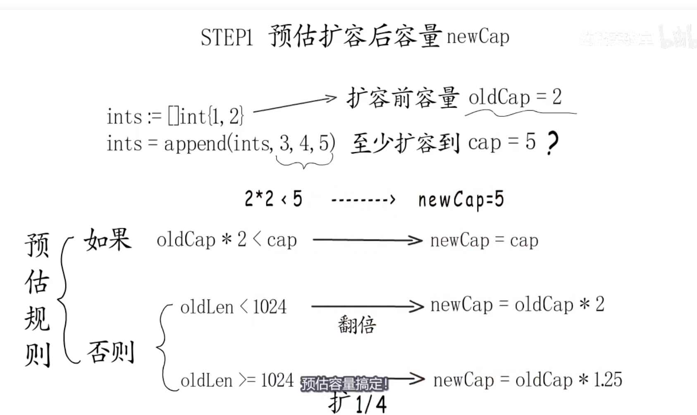

# map

设计一个哈希表要考虑的东西

- 存储结构
- hash 函数，选择散列均匀的 hash 函数可以避免稀疏
- 如何处理哈希冲突
- 溢出后如何扩容
- rehash 过程

go 语言的 map，底层是一个 hmap

```go
// A header for a Go map.
type hmap struct {
    // 元素个数，调用 len(map) 时，直接返回此值
	count     int
	flags     uint8
	// buckets 的对数 log_2
	B         uint8
	// overflow 的 bucket 近似数
	noverflow uint16
	// 计算 key 的哈希的时候会传入哈希函数
	hash0     uint32
    // 指向 buckets 数组，大小为 2^B
    // 如果元素个数为0，就为 nil
	buckets    unsafe.Pointer
	// 等量扩容的时候，buckets 长度和 oldbuckets 相等
	// 双倍扩容的时候，buckets 长度会是 oldbuckets 的两倍
	oldbuckets unsafe.Pointer
	// 指示扩容进度，小于此地址的 buckets 迁移完成
	nevacuate  uintptr
	extra *mapextra // optional fields
}
```

### 底层存储结构


### 哈希过程


哈希表存储 假设桶容量为 m

桶索引取值方法：

1. 取模法: hash % m
2. 与运算: hash & (m-1) 前提：m 必须是 2 的幂

详细分析可参考: [按位与运算替换取模计算](../../算法/按位与运算替换取模计算.md)

### 哈希冲突

hash 冲突解决办法：

- 开链法（链地址法)：使用链表将多个哈希值相同的节点串连在一起，从而解决冲突问题，redis 的哈希表就是用这种方式，golang map，Java hashmap 也是这种方式，
- 开放地址法：包括线性探测法，二次探测法，伪随机探测法，通过线性函数逐步探测可用的地址，因为函数一样所以插入或查询计算的结果肯定是一样的
- 再哈希法：使用另一个哈希函数计算新的地址，直到不发生冲突

**两种解决方案比较**

对于链地址法，基于数组 + 链表进行存储，链表节点可以在需要时再创建，不必像开放寻址法那样事先申请好足够内存，因此链地址法对于内存的利用率会比开方寻址法高。链地址法对装载因子的容忍度会更高，并且适合存储大对象、大数据量的哈希表。而且相较于开放寻址法，它更加灵活，支持更多的优化策略，比如可采用[红黑树](https://zhida.zhihu.com/search?content_id=234870507&content_type=Article&match_order=1&q=%E7%BA%A2%E9%BB%91%E6%A0%91&zhida_source=entity)代替链表。但是链地址法需要额外的空间来存储指针。

对于开放寻址法，它只有数组一种数据结构就可完成存储，继承了数组的优点，易于实现，对 CPU 缓存友好，易于序列化操作。但是它对内存的利用率不如链地址法，且发生冲突时代价更高。**当数据量明确、装载因子小，适合采用开放寻址法。**

golang map 处理哈希冲突的方式是链地址法：具体就是 **插入 key 到 map 中时** ，当 key 定位的桶 **填满 8 个元素后** （这里的单元就是桶，不是元素），将会创建一个溢出桶，并且将溢出桶插入当前桶所在链表尾部。

```go
if inserti == nil {
        // all current buckets are full, allocate a new one.
        newb := h.newoverflow(t, b)
        // 创建一个新的溢出桶
        inserti = &newb.tophash[0]
        insertk = add(unsafe.Pointer(newb), dataOffset)
        elem = add(insertk, bucketCnt*uintptr(t.keysize))
}
```

### **哈希冲突的解决方式**

### **（1）链地址法（Separate Chaining）**

- 当不同的键（如 `key1` 和 `key2`）计算出的哈希值映射到同一个桶时，Go 会：
  1. 先尝试把键值对存入该桶的空闲位置。
  2. 如果桶已满（默认每个桶存 8 个键值对），则创建一个 **溢出桶** ，并用链表方式连接。
- 查找时，先定位到桶，再遍历链表（桶 + 溢出桶）找到目标键。

### **（2）示例**

假设有一个 `map[string]int`，存储以下数据：

```go
m := make(map[string]int)
m["Alice"] = 25
m["Bob"] = 30
m["Charlie"] = 35
```

假设 `"Alice"` 和 `"Bob"` 的哈希值经过计算后都映射到 **Bucket 0** ，而 `"Charlie"` 映射到 **Bucket 1** ：

- **Bucket 0** ：`["Alice":25, "Bob":30]`
- **Bucket 1** ：`["Charlie":35]`

如果继续存入 `"David":40`，而 `"David"` 的哈希值也映射到 **Bucket 0** ，但 **Bucket 0** 已满（假设每个桶只能存 2 个键值对），则会创建一个 **溢出桶** ：

- **Bucket 0** ：`["Alice":25, "Bob":30] -> Overflow Bucket ["David":40]`
- **Bucket 1** ：`["Charlie":35]`

### 扩容规则

当 hash 表存储内容超过负载因子后，会进行扩容，有增量扩容和等量扩容

负载因子：load factor = count / m

渐进式扩容：逐步的将旧桶的数据迁移到新桶，并非一次性，减小迁移影响

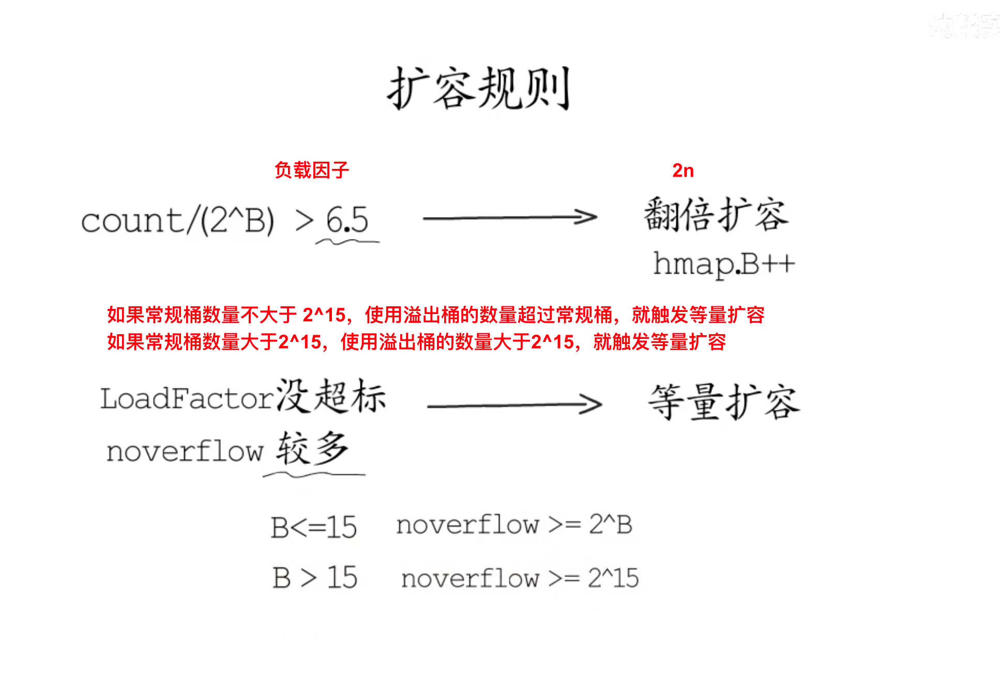

### 为什么需要等量扩容？

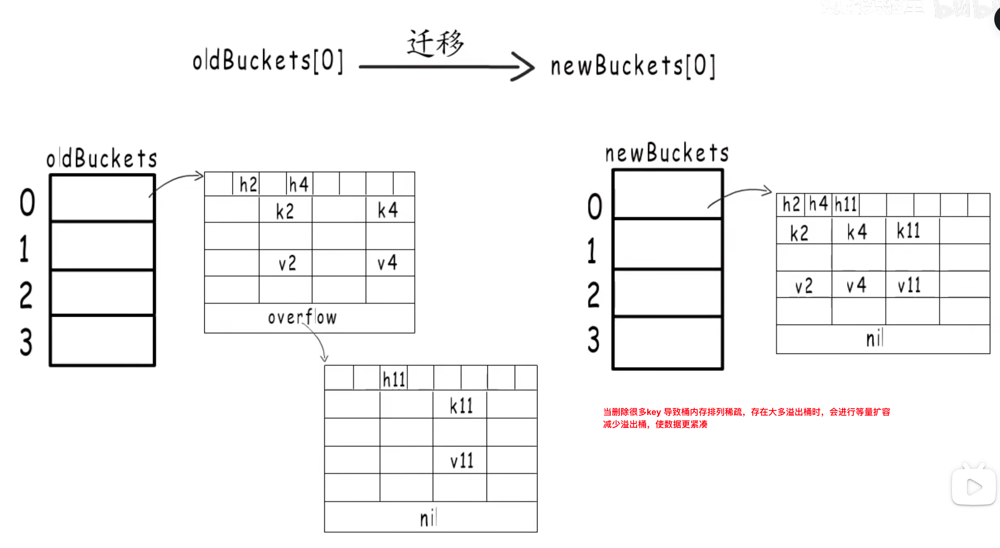

解决当删除很多 key 导致桶内存排列稀疏，存在太多溢出桶，等量扩容重新排列后数据会更加紧凑，减少溢出桶

## map 不是并发安全的

`sync.Map` 是 Go 语言标准库中提供的一个 并发安全的 map 实现 ，它从 Go 1.9 开始引入，位于 `sync` 包中。它的本质和设计目标与普通的 `map`（配合互斥锁使用）有所不同

sync.Map 的本质是一种适合 `高并发读多写少场景` 线程安全的 map。其内部实现采用了 **双 store 结构** ：一个用于快速读取的只读映射（`readOnly`），和一个用于写入的可变映射（`dirty`）。这种结构让它在某些场景下比 `map + mutex` 更高效

```go
// readOnly is an immutable struct stored atomically in the Map.read field.
type readOnly struct {
	m       map[any]*entry
	amended bool // true if the dirty map contains some key not in m.
}


type Map struct {
	mu Mutex

	// 只读映射，不加锁即可访问的，高效读
	read atomic.Pointer[readOnly]

	// 脏映射，包含将来可能升级到只读映射的数据，需要加锁访问
	dirty map[any]*entry

	// 记录从只读映射读取失败的次数 用于决定是否将 dirty 升级为 readOnly
	misses int
}
```

### 工作原理简述

1. **读操作（Load）**
   - 直接访问 `readOnly` 中的 map。
   - 如果命中则返回结果。
   - 如果未命中，则会增加 `misses`，并尝试访问 `dirty`（需加锁）。
2. **写操作（Store/Delete）**
   - 先尝试加锁，然后操作 `dirty`。
   - 如果当前 `readOnly` 和 `dirty` 不一致（即 `dirty != nil`），就直接操作 `dirty`。
   - 如果 `dirty == nil`，则复制 `readOnly` 到 `dirty`，再进行修改。
3. **升级机制**
   - 当 `misses >= len(dirty)` 时，自动将 `dirty` 提升为新的 `readOnly`，并将 `dirty` 清空，重新开始累积写入

## 问题案例

### 1. delete nil map no-opp

```go
package main

import "fmt"

func main() {
	// 1.
	var timeZone = map[string]int{
		"UTC": 0 * 60 * 60,
		"EST": -5 * 60 * 60,
		"CST": -6 * 60 * 60,
		"MST": -7 * 60 * 60,
		"PST": -8 * 60 * 60,
	}

	// It's safe to do this even if the key is already absent from the map
	// [1]
	delete(timeZone, "PDT")

	var m map[string]int
	// [2] The delete built-in function deletes the element with the specified key (m[key]) from the map. If m is nil or there is no such element, delete is a no-op.
	delete(m, "no in map!")
	fmt.Println(m) // --> map[]

	// [3] get value from nil map will return zero value
	i := m["no in map"]
	fmt.Println(i)

	// [4] set value to nil map will panic
	m["no in map"] = 1
	fmt.Println(m)
}

```

> 1. [The delete built-in function deletes the element with the specified key (m[key]) from the map. If m is nil or there is no such element, delete is a no-op.](https://pkg.go.dev/builtin#delete)
> 2. Assigning to an element of a `nil` map causes a [run-time panic](https://go.dev/ref/spec?spm=a2ty_o01.29997173.0.0.7d8a5171IeO7lL#Run_time_panics).
> 3. get value from nil map will return zero value

# 内存对齐

内存对齐所指的对象是实际存储的数据层

## 解决的问题

- **提高内存访问效率**: CPU 访问内存数据时，以特定长度（字长，32 位 CPU 字长一般 4 字节，64 位 CPU 字长一般 8 字节 ）为单位读取。内存对齐后，数据能按 CPU 字长边界存储，CPU 一次读取操作就能获取完整数据，减少读取次数。比如 64 位系统下，8 字节的 `int64` 类型数据若未对齐，可能需两次读取；对齐后一次即可

```go
64位CPU 寄存器大小，每次读取8字节
[][][][][][][][] | [][][][][][][][]
0 1 2 3 4 5 6 7   8 9 10 11 12 13 14 15

假如从 1 开始读取到 8，则cpu要读取两次
第一次从 0-7 然后保留 1-7
第二次从 8-15 然后只保留 8
最后再合并结果
```

- **提高内存利用率**: CPU 缓存按内存行存储数据（一般 64 字节 ），内存对齐后，数据更易完整存于连续内存行，提升内存命中率，加速数据访问
- **增强可移植性** ：不同硬件平台对内存访问规则有差异，部分 CPU 只能从特定地址读取特定长度数据。内存对齐使代码在各平台按一致规则存储数据，避免因硬件差异产生的访问错误，增强可移植性。

内存对齐主要解决的是提高内存利用率和访问效率

内存存储地址

以及占用的字节数都要是对齐边界的倍数

## 每种类型的对齐边界

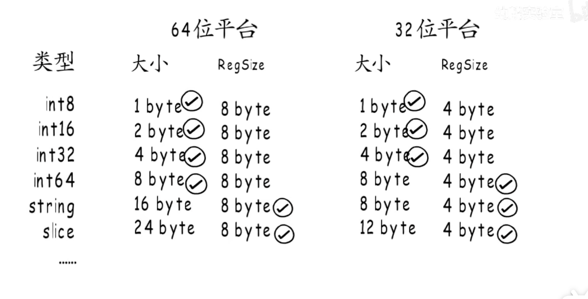

上面是基本类型的对齐边界，Go 语言中基本类型的对齐边界与其自身大小有关，通常是其大小字节数，且是 2 的幂次。比寄存器小的就用字节大小(减少内存浪费)，大于的就取寄存器大小。

接口类型的对齐边界：接口类型在 64 位系统中通常大小为 16 字节（包含一个指向类型信息的指针和一个指向数据的指针 ），对齐边界一般为 8 字节。在 32 位系统中，接口类型大小一般为 8 字节（两个指针各 4 字节 ），对齐边界为 4 字节

指针类型的对齐边界：在 64 位系统中，指针类型大小为 8 字节，对齐边界通常是 8 字节；在 32 位系统中，指针类型大小为 4 字节，对齐边界是 4 字节

`RegSize` 可理解为寄存器大小（Register Size） ，代表 CPU 寄存器能处理的数据长度。在 32 位平台，寄存器通常一次处理 4 字节数据；64 位平台则为 8 字节。它影响内存对齐策略，因为数据存储和访问需考虑与寄存器大小适配，便于 CPU 高效处理

### 结构体类型的对齐边界

要求如下

1. 结构体中每个字段的对齐边界取最大值
2. 第一个字段从偏移量 0 开始存储，后续字段存储的的起始地址必须是对齐边界的倍数
3. 结构体整体占用字节数是对齐边界的倍数，不够的话要往外扩充

```go
type T struct {
    a int8
    b int64
    c int32
    d int16
}
```

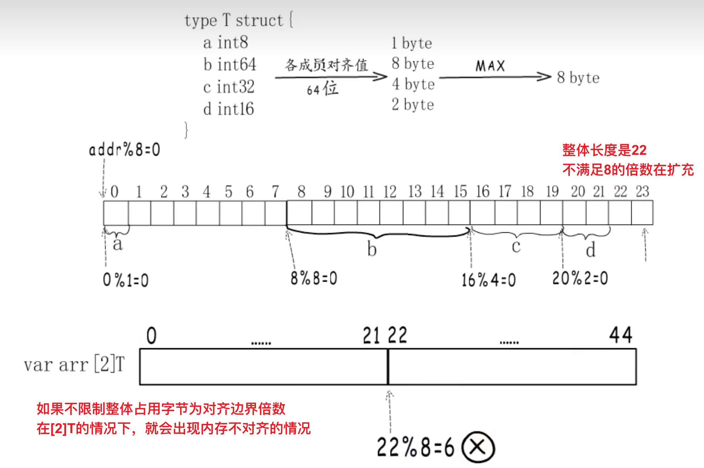

## faq

#### 1. 为什么要限制类型大小等于对齐边界的整数倍？

如果不限制整体占用字节数为对齐边界的倍数，在复合变量下，就会出现内存不对齐的情况，所以要求最小单位的内存对齐

比如上面的 `var arr [2]T`。如果按照 22 的字节数来，2 个就是 44，在这种情况下，模拟下内存读数据的逻辑，按 8 个字节读，读到 16-23 的时候就会包含一部分是[1]T, 一部分是[2T]的数据了。这种情况下，都不知道要怎么合并了，还要单独记录起始位置。如果约定好不管怎么都按类型大小等于对齐边界的整数倍，则按约定的逻辑取数据 ：一个 T 占用字节数就是 24，那 0-23 就是[1]T，24-47 就是[2]T 了。

# 内存划分

在计算机程序的运行过程中，内存被划分为不同的区域来存储不同类型的数据。这些区域[包括堆（Heap） 、栈（Stack）](https://www.cnblogs.com/panlq/p/13069726.html) 、代码段（Code Segment）和 数据段（Data Segment）

### **1. 堆（Heap）**

- **定义** ：堆是一个动态分配的内存区域，用于存储程序运行时需要动态申请的内存（比如通过 `new` 或 `malloc` 分配的内存）。它的特点是生命周期由程序员控制，使用完成后需要手动释放（在 Go 中由垃圾回收器自动管理）。
- **特点** ：
- 内存分配较慢，因为需要动态管理。
- 内存可以全局共享，生命周期较长。
- 通常用于存储较大的数据结构或需要跨函数使用的对象。

---

### **2. 栈（Stack）**

- **定义** ：栈是一个后进先出（LIFO）的内存区域，用于存储函数调用时的局部变量、返回地址等信息。每次函数调用时，都会在栈上分配一块内存（称为栈帧），函数返回后这块内存会被自动释放。
- **特点** ：
- 内存分配非常快，因为是连续的内存区域。
- 生命周期短，仅限于函数调用期间。
- 通常用于存储局部变量和函数调用的上下文。

---

### **3. 代码段（Code Segment）**

- **定义** ：代码段是存储程序执行代码的内存区域，包含编译后的机器指令。它是只读的，防止程序意外修改自己的指令。
- **特点** ：
- 只读，保护程序的核心逻辑。
- 通常由操作系统加载到内存中，供 CPU 执行。

---

### **4. 数据段（Data Segment）**

- **定义** ：数据段是存储全局变量和静态变量的内存区域。它又分为两个部分：
- **已初始化数据段** ：存储已经赋初值的全局变量和静态变量。
- **未初始化数据段（BSS 段）** ：存储未初始化的全局变量和静态变量。
- **特点** ：
- 生命周期与程序相同，从程序启动到结束。
- 全局可见，所有函数都可以访问。

### 案例

```json
package main

import "fmt"

// 全局变量，存放在数据段
var globalVar = 10

// 函数 add，其代码存放在代码段
func add(a, b int) int {
    // 局部变量，存放在栈上
    sum := a + b
    return sum
}

func main() {
    // 局部变量，存放在栈上
    num1 := 5
    num2 := 3

    // 调用函数，函数调用信息和局部变量存放在栈上
    result := add(num1, num2)

    // 动态分配内存，存放在堆上
    ptr := new(int)
    *ptr = 20

    fmt.Printf("The result of %d + %d is %d\n", num1, num2, result)
    fmt.Printf("The value of global variable is %d\n", globalVar)
    fmt.Printf("The value pointed by ptr is %d\n", *ptr)
}
```

# 函数栈帧

go 语言每个栈的大小初始化时都是 2KB，当超过容量阈值时会触发栈扩容，最大的协程栈在 64 位系统中是 1G，在 32 位系统中时 250M

go 语言函数栈帧，返回值在参数之上，函数栈帧格式如下
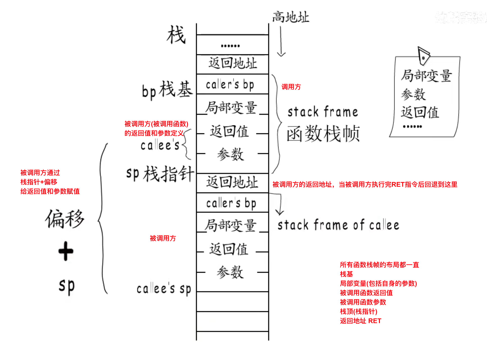

执行时主要有两个指令 call, ret，假设 函数 a2 调用函数 a1 调用 b1

- call
  - 记录入栈返回地址 a2
  - 跳转到指令起始地址 b1
- ret
  - 弹出返回地址即 a2
  - 跳转到返回地址 a2

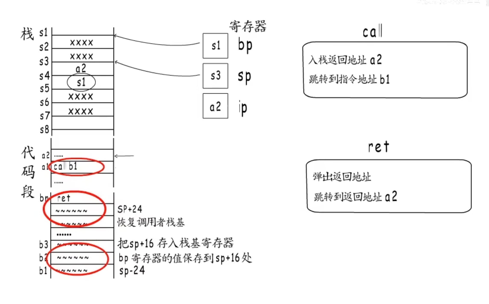

# 方法

方法在栈中体现，注意结构体中的 func(a A) / func(a \*A)

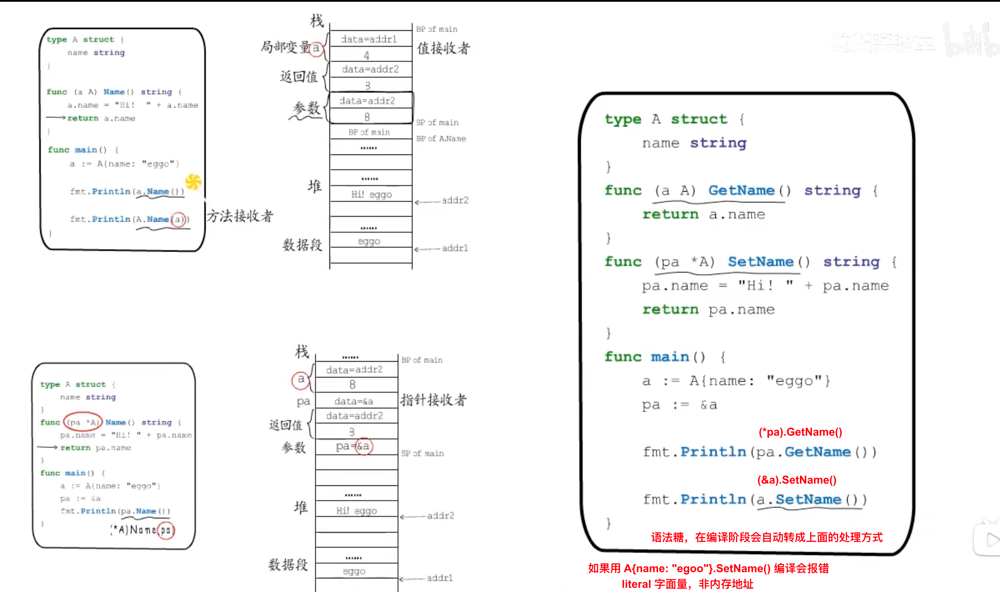

# 闭包

1. 必要要有在函数外部定义，在函数内部引用的“自由变量"
2. 脱离了形成闭包的上下文(如：外层函数执行完毕退出，堆栈数据释放了)，闭包也能正常使用这些自由变量

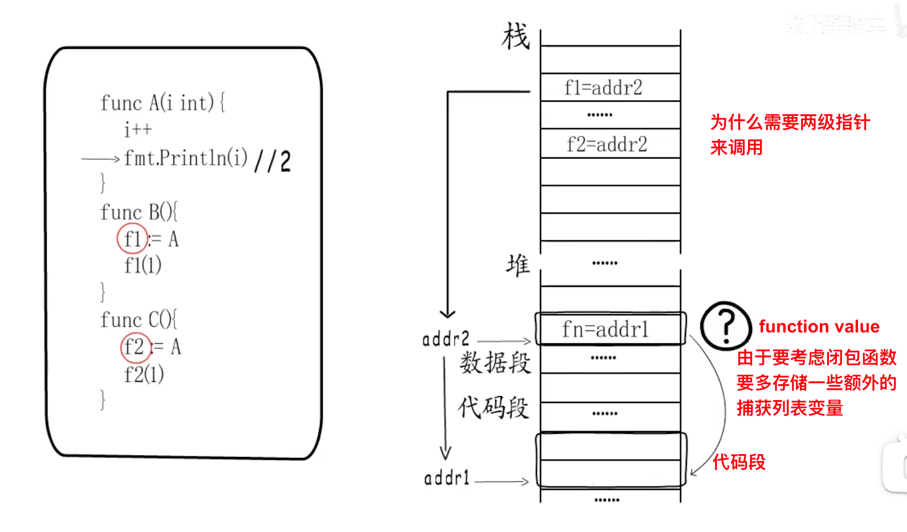

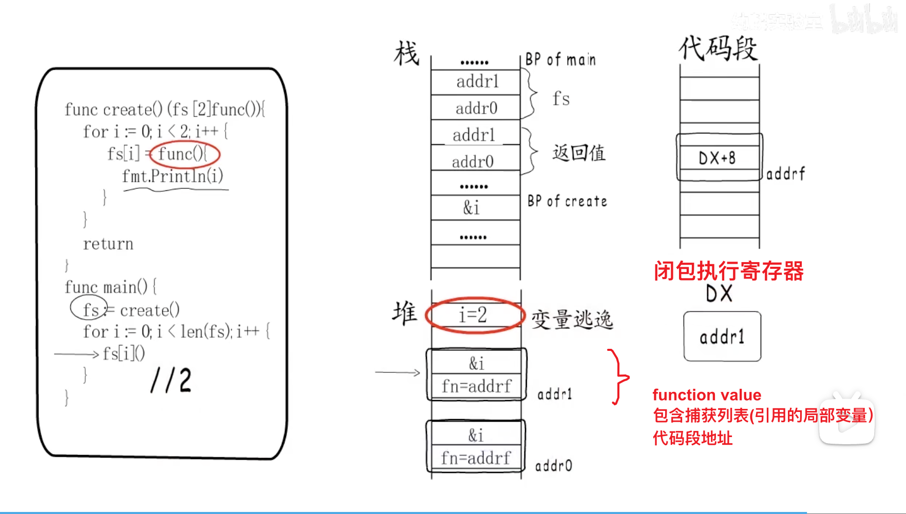

注意：闭包导致的局部变量堆分配，也是变量逃逸的一种场景

```go
func TestGofun(t *testing.T) {
	for i := 0; i < 5; i++ {
		go func() {
			fmt.Println(i)
		}()
	}
}

```

以上代码输出结果有几种可能

1. 输出一个 5，或两个
2. 启动后结束了，没有任何输出，主协程退出了，其他任务也就销毁了

# defer

defer 语句会将其后面跟随的语句进行延迟处理，一般用来处理资源的释放，如: 资源清理，文件句柄关闭，解锁及时间记录等

在 go 语言的函数中 return 语句在底层并不是原子操作，分为给返回值赋值和 RET 指令两步。defer 语句的执行实际就在返回值赋值操作后，RET 指令执行前。RET 指令的主要作用就是从当前执行函数(被调用者)回退到调用者


## 执行顺序

当函数内存在多个 defer 函数时， 在底层使用链表存储的，最后加入的会在表头，所以 defer 是倒序执行的。

g.\_defer 在注册时添加到链表头，执行时从链表中移除

```go

func Test_defer_multi_call(t *testing.T) {

	// call last
	defer func() {
		fmt.Println("last")
	}()

	// call second
	defer func() {
		fmt.Println("second")
	}()

	// call first
	defer func() {
		fmt.Println("first")
	}()

	fmt.Println("main")
}

```

注意 ⚠️：defer 从 go 1.2,1.3,1.4 一直在优化性能，从原本的堆栈+链表形式，到最新的 open coded defer + 链表

open coded defer 的含义就是，直接在编译阶段，就把 defer 函数插入到函数栈内，当做普通函数，插入时按照规定的顺序即可，就不需要链表和堆分配了，也比较高效，针对需要逻辑判断才执行的 defer ，通过一个标记为控制。

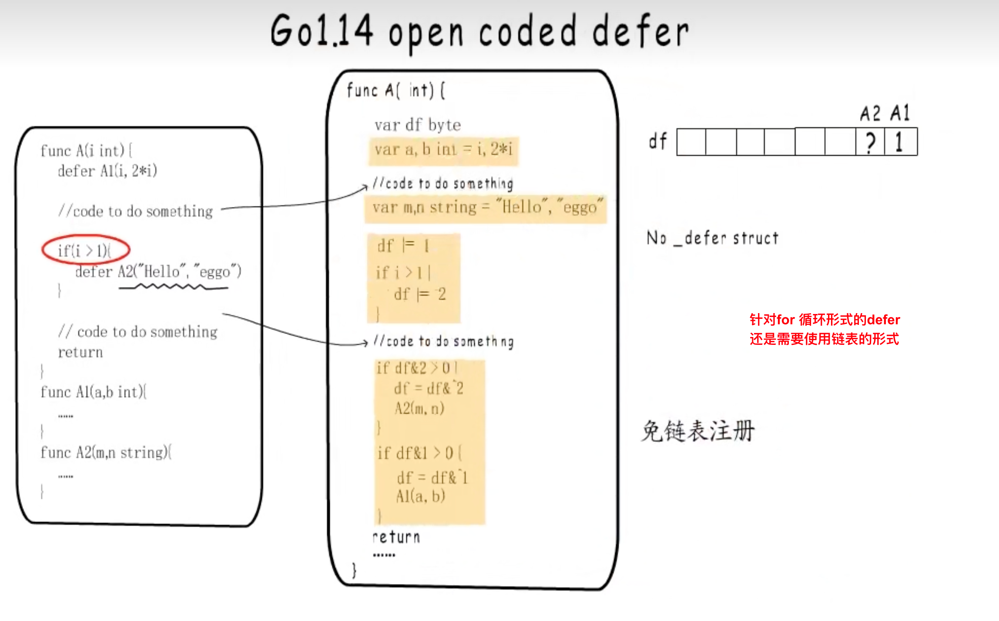

这种优化给性能带来极大提升，但是针对 for 循环形式的 defer 还是需要链表的形式

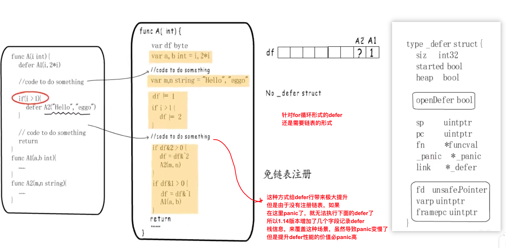

## 值传递

在初始化 dA 时，返回的参数就要确定了，所以 dB(a) 会直接执行得到确定的值

```go

func dB(a int) int {
	return a * 2
}

func dA(a int) {
	fmt.Println(a)
}

func Test_defer_func_params(t *testing.T) {
	a := 1

	defer dA(dB(a))

	fmt.Println(a)
}
```

## 匿名返回值

```go
func incr(a int) {
	var b int

	defer func() {
		a++
		b++
	}()

	a++
	b = a
	return b
}


func main() {
	var a,b int
	b = incr(a)
	fmt.Println(b)
}
```

返回 1
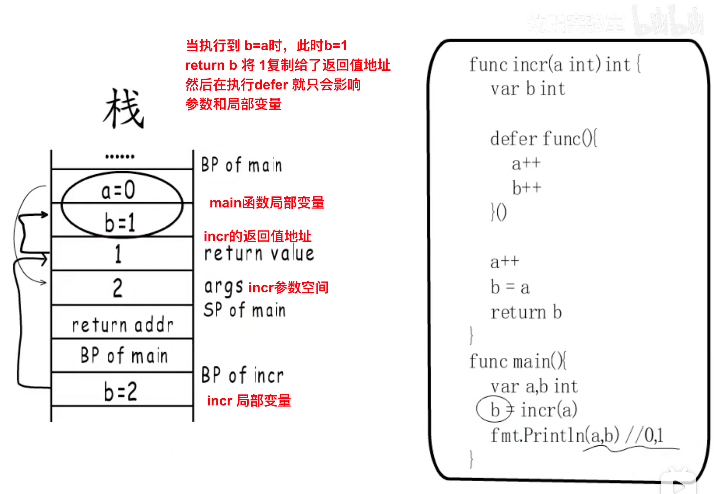

## 命令返回值

```go
func incr(a int) (b int) {

	defer func() {
		a++
		b++
	}()

	a++
	return a
}


func main() {
	var a,b int
	b = incr(a)
	fmt.Println(b)
}

```

返回 2

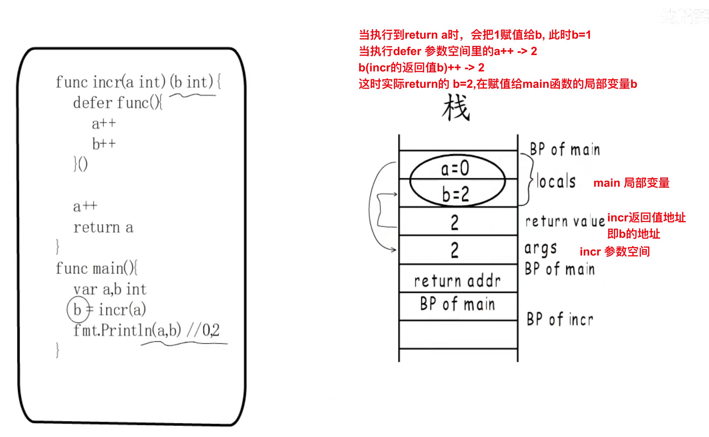

# panic&recover

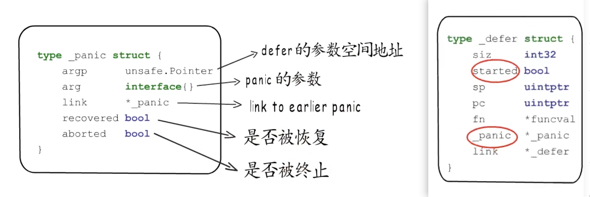

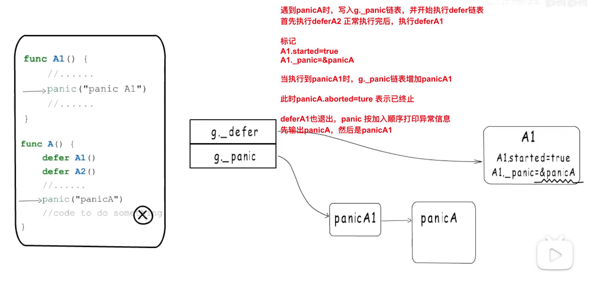

先标记后释放，目的是为了终止之前发送的 panic

异常信息的输出方式，按顺序(panic 发生的顺序)输出 g.\_panic 链表上的所有 panic 结构体信息，

# [类型系统](https://gfw.go101.org/article/type-system-overview.html)

go 语言中，每种类型的类型元数据都是唯一的

## 类型

## [值部](https://gfw.go101.org/article/value-part.html)

在 C 中，值的内存结构都是很透明的；但在 Go 中，对于某些类型的值，其内存结构却不是很透明。 在 C 中，每个值在内存中只占据一个[内存块](https://gfw.go101.org/article/memory-block.html)（一段连续内存）；但是，一些 Go 类型的值可能占据多个内存块。

以后，我们称一个 Go 值分布在不同内存块上的部分为此值的各个值部（value part）。 一个分布在多个内存块上的值含有一个直接值部和若干被此直接值部[引用着](https://gfw.go101.org/article/pointer.html#references)的间接值部。

上面的段落描述了两个类别的 Go 类型。下表将列出这两个类别（category）中的类型（type）种类（kind）：

- 单直接值部：每个值在内存中只分布在一个内存块上的类型
  - 布尔
  - 各种数值类型
  - 指针
  - 非类型安全指针类型
  - 结构体类型
  - 数组类型
- 多值部类型：每个值在内存中会分布在多个内存块上的类型
  - 切片类型
  - 映射类型
  - 通道类型
  - 函数类型
  - 接口类型
  - 字符串类型

在 Go 中，**每个赋值操作（包括函数调用传参等）都是一个值的浅复制过程（假设源值和目标值的类型相同）**。 换句话说，在一个赋值操作中，只有源值的直接部分被复制给了目标值。 如果源值含有间接部分，则在此赋值操作完成之后，目标值和源值的直接部分将引用着相同的间接部分。 换句话说，两个值将共享底层的间接值部。

但针对接口和字符串赋值，由于底层间接值部是只读的不可变的，所以在编译期做了优化没有复制。

# 接口

## 空接口

空接口的值由一个具体的类型和具体类型的值两部分组成，这两部分分别称为接口的动态类型和动态值

```go
type _interface struct {
	dynamicType  *_type         // 引用着接口值的动态类型
	dynamicValue unsafe.Pointer // 引用着接口值的动态值
}
```

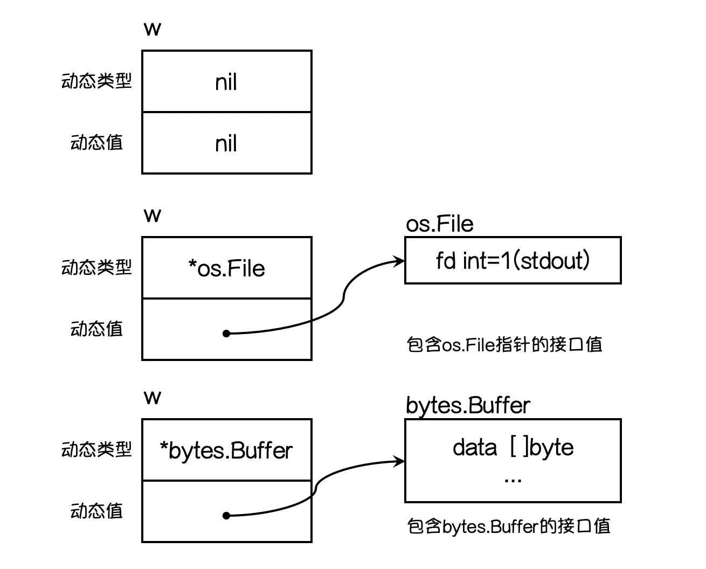

```golang
var w io.Writer
w = os.Stdout
w = new(bytes.Buffer)
w = nil
```

有关面试题

```golang

// 下面代码输出什么？
func Test18(t *testing.T) {
	var i interface{}
	if i == nil {
		fmt.Println("nil")
	}
	fmt.Println("not nil")
}
```

> 当且仅当接口的动态值和动态类型都为 nil 时，接口类型值才为 nil

#### 空接口的应用 很广泛

- 作为函数的参数，则可以接受任意类型的函数参数
- 作为 map 的值，实现可以保存任意值的字典

  ```golang
  dict := make(map[string]interface{})
  dict['name'] = "f4"
  dict['age'] = 33
  ```

## 非空接口

```go
type _interface struct {
	tab *itab                   // 接口的方法列表和动态类型信息
	dynamicValue unsafe.Pointer // 引用着动态值
}

type interfacetype struct {
	typ _type
	pkgpath name
	mhdr []imethod   // 方法列表
}

type itab struct {
	inter *interfacetype        // 接口类型元数据
	dynamicType  *_type         // 引用着接口值的动态类型  动态类型元数据
	hash uint32          // 从动态类型元数据拷贝的类型 hash值，用于快速判断类型是否相等
	_ [4]type
	fun [x]uintptr       // 动态类型实现的接口要求的方法地址数组
	// fun 会从动态类型元数据拷贝接口类型元数据中要求的方法的地址，以便通过实例快读定位到方法
}
```

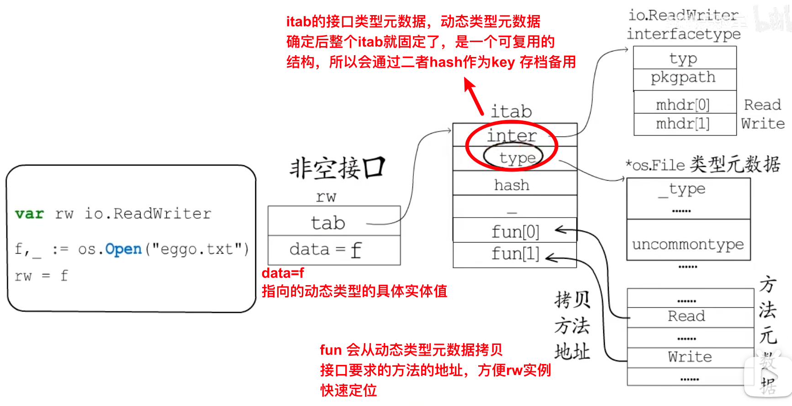

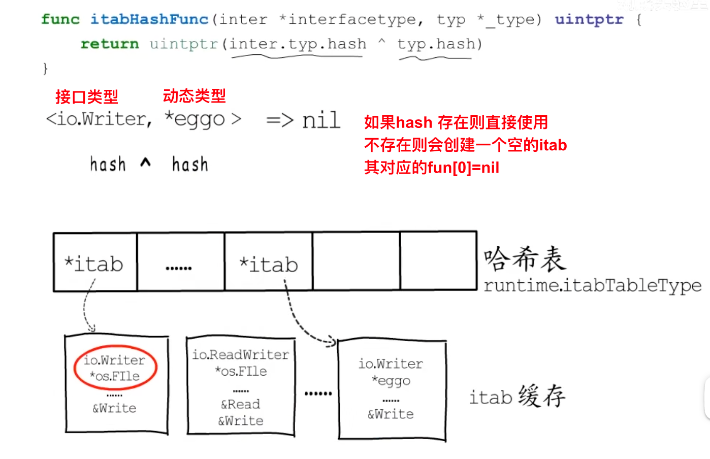

> ⚠️ 注意：上图中有一点失误，如果查看的 hash 不存在，看那个的 itab 中 fun[0]=0
>
> 标识动态类型并没有实现接口要求的全部方法

# 类型断言

## 空接口.(具体类型)

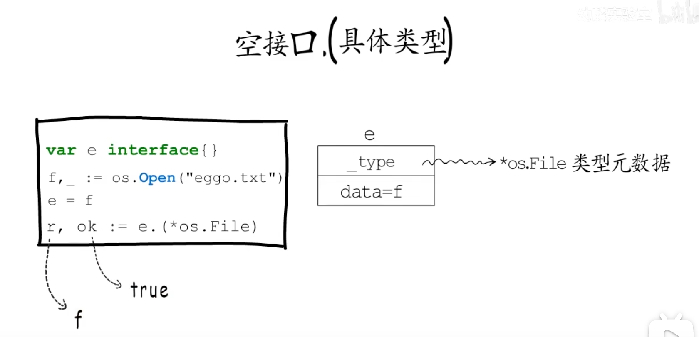

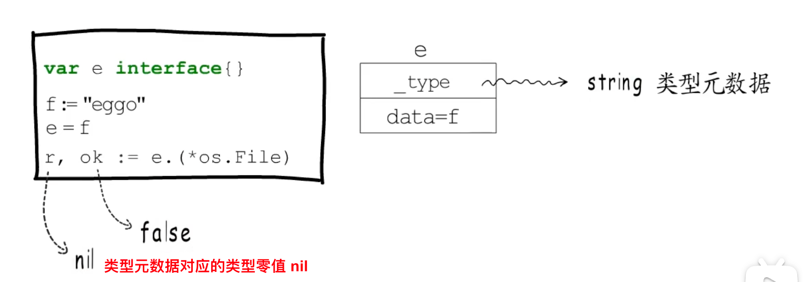

## 非空接口.(具体类型)

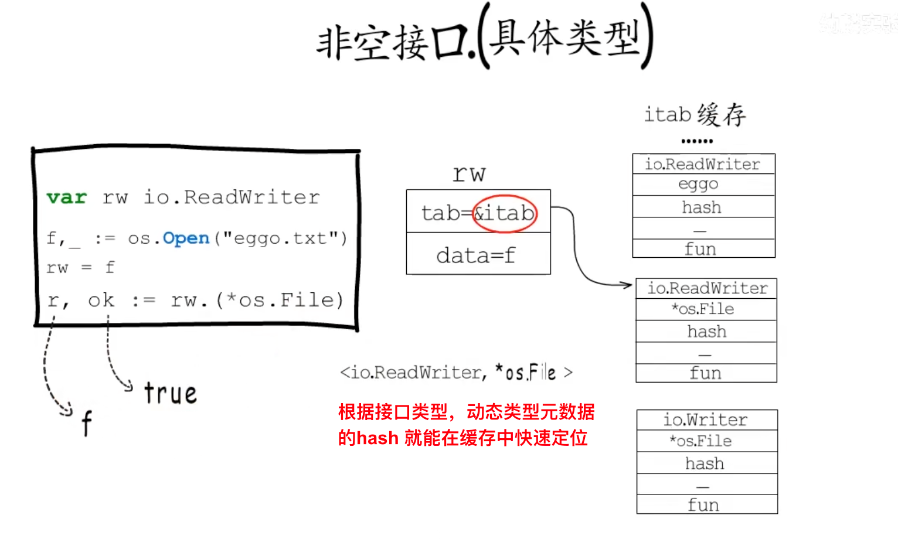

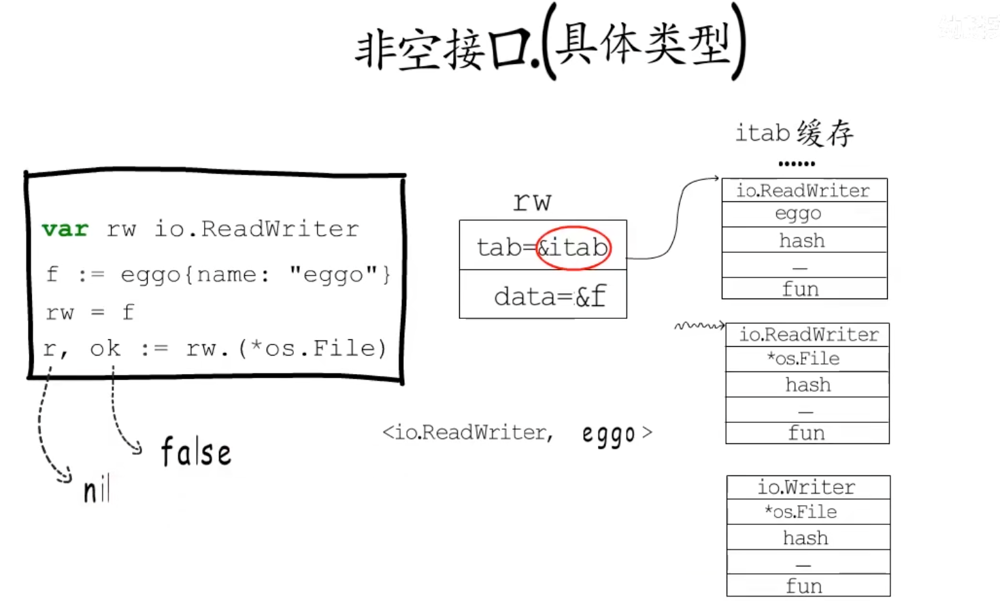

## 空接口.(非空接口)

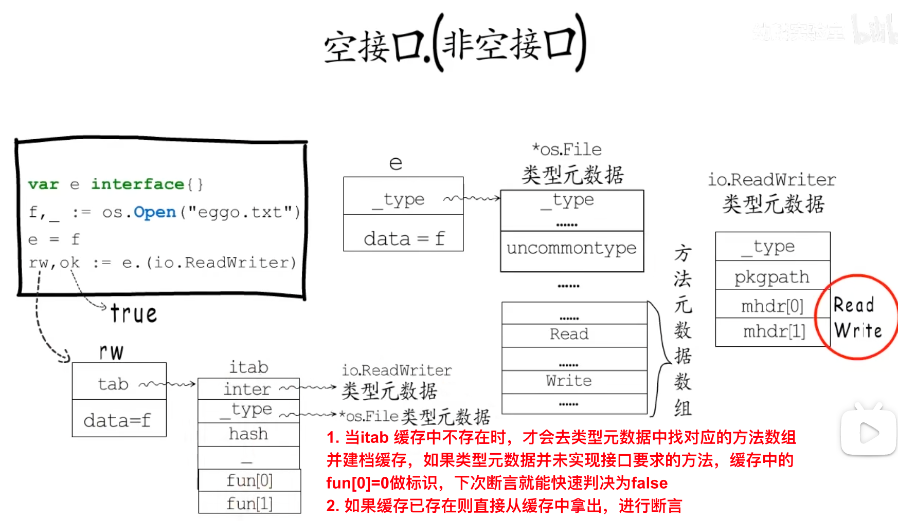

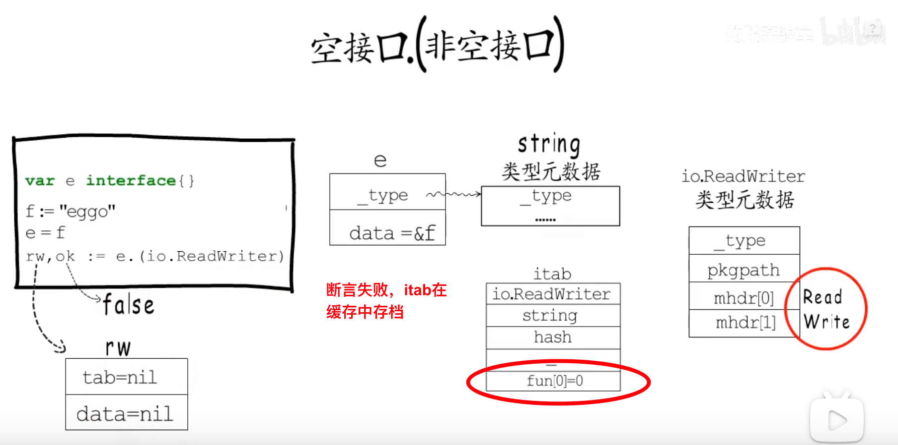

## 非空接口.(非空接口)

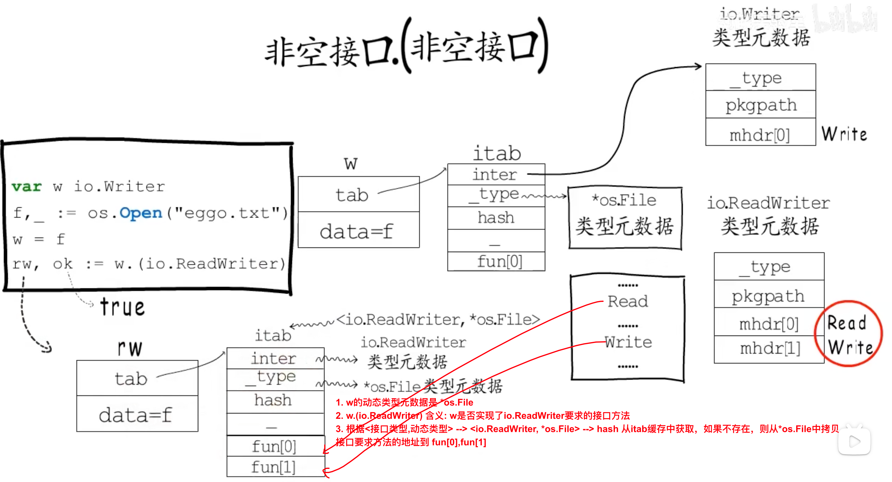

# GPM

关键字

两级线程模型

M:N 调度模型： 将 M 个协程映射到 N 个系统线程上，实现用户态的多任务调度

该模型为何被称为两级？

**即用户调度器实现用户线程到 KSE 的『调度』，内核调度器实现 KSE 到 CPU 上的『调度』** 。

在 golang 中协程和线程的区别

- **协程（Goroutine）**
  - **用户态调度** ：由 Go 运行时（runtime）负责调度，不依赖操作系统内核。
  - **M:N 调度模型** ：将 M 个协程映射到 N 个系统线程上，实现用户级的多任务调度。
  - **轻量级上下文切换** ：切换时仅需保存寄存器、程序计数器等少量信息，开销极小。
- **线程（Thread）**
  - **内核态调度** ：由操作系统内核负责调度，涉及用户态与内核态的切换。
  - **1:1 调度模型** ：每个线程对应一个内核线程，调度成本较高。
  - **重量级上下文切换** ：需要保存和恢复大量 CPU 状态，包括内存页表等，开销大。

## 1. 概念

### G

G 表示 go 语句启用的 goroutine 的一个封装实例。G 的结构中存储了状态，栈上下文等信息。G 的状态有如下值

- Gidle：表示当前 G 刚被新分配，但未初始化
- Grunable：表示当前 G 正在可运行队列中等待运行
- Grunning：表示当前 G 正在运行
- Gpreempted: 表示当前 G 已被抢占
- GWaiting：表示当前 G 正在阻塞，如并发函数中涉及网络 I/O，或者定时器、time.Sleep，抑或是等待从通道中接收/发送值。
- Gsyscall：表示当前 G 正在执行某个系统调用
- Gcopystack：表示当前 G 的栈正在被移动，移动的原因可是栈的扩展/收缩
- Gdead：表示当前 G 正处于闲置状态，此状态的 G，会被放进调度器自由队列或者本地 P 自由队列，等待被重新初始化利用

**除了以上状态，还有一个** `GScan`的状态。不过这个状态并不能独立存在，而是组合状态的一部分。如：Gsacn 与 Grunnable 组合成 `Gscanrunnable`状态。代表当前 G 正等待运行，同时它的栈正被扫描，扫描的原因一般是 GC(垃圾回收)任务的执行。

**又如：Gscan 与 Grunning 组合成 Gscanrunning 状态。表示正处于 Gruning 状态的当前 G 的栈要被 GC 扫描时的一个短暂时刻**

### p

P: processor, 代表执行一个 go 代码片段所需的资源(上下文环境)，管理一个本地 runq (可运行 G 的)队列

    runq: 待调度的 g 队列

    freeq：自由 g 队列，保存的已运行完成的 g，当要运行一个新 g 的时候，从这里面获取一个替换一些必要变量(go语句携带的函数，参数等)，提高复用率，减少新建的消耗。

p 的状态

- pidle: 当前 p 未与任何 M 存在关联
- pruning：当前 p 正在与某个 M 关联
- psyscall：当前 p 中的运行的那个 G 正在进行系统调用
- pgcstop：运行时系统需要停止调度，是 p 创建初始状态，但很快就会被运行系统设置为 pidle，如：运行时系统在开始垃圾回收的某些步骤前，就会试图把全局 p 列表中的所有 p 都置于此状态
- pdead：当前 p 已经不会在被使用。如：在运行时，通过调用 runtime.GOMAXPROCS 函数减少 p 的数量，多余的 p 就会进入这个状态

P 的最大数量等于当前机器的 CPU 核数 runtime.GOMAXPROCS，最终值不会超过 256(硬性上限值)

### m

M: 代表内核线程 ，与内核线程一对一，最多是可使用 10000 个线程，但操作系统大概率是不会给这么多的，基本可以忽略这个限制。

spining=true: 表示 M 处于自选状态，正在寻找可运行的 G

运行时系统中的每个 M 都会拥有一个 特殊的 G,g0。g0 管辖的内存称为 M 的调度栈。可以说，M 的 g0 对应操作系统为相应线程创建的栈。M 的调度栈也可以称为 OS 线程栈或系统栈，对应源码中的 runtime.systemstack

g0 是有 Go 运行时系统初始化 M 时创建并分配给 M 的。一般用于执行调度、垃圾回收、栈管理等。

M 还会拥有一个专用于处理信号的 G，称为 gsignal，它的栈称为信号栈。

系统栈和信号栈不会自动增长，但一定会有足够的空间执行代码。

除了 g0 之外，其他由 M 运行的 G 称为用户级别的 G

## 2. 承载 GPM 结构实例的核心容器

| **中文名称**              | **源码名称**                                             | **作用域**     | **说明**                                                                    |
| ------------------------- | -------------------------------------------------------- | -------------- | --------------------------------------------------------------------------- |
| **全局 M 列表**           | **runtime.allm**                                         | **运行时系统** | **存放所有 M 的一个单向链表**                                               |
| **全局 P 列表**           | **runtime.allp**                                         | **运行时系统** | **存放所有 P 的一个数组**                                                   |
| **全局 G 列表**           | **runtime.allgs**                                        | **运行时系统** | **存放所有 G 的一个切片**                                                   |
| **调度器的空闲 M 列表**   | **runtime.sched.midle**                                  | **调度器**     | **存放空闲 M 的一个单向链表**                                               |
| **调度器的空闲 P 列表**   | **runtime.sched.pidle**                                  | **调度器**     | **存放空闲的 P 的一个单向链表**                                             |
| **调度器的可运行 G 队列** | **runtime.sched.runqhead**runtime.sched.runqtail         | **调度器**     | **存放可运行 G 的一个 FIFO 队列**                                           |
| **调度器的自由 G 队列**   | **runtime.sched.gFree.stack**runtime.sched.gFree.noStack | **调度器**     | **存放自由的 G 的两个单向链表**                                             |
| **P 的可运行 G 队列**     | **runtime.p.runq**                                       | **本地 P**     | **存放当前 P 中的可运行 G 的一个 FIFO 队列<br />最多容纳 256 个 goroutine** |
| **P 的自由 G 队列**       | **runtime.p.gfree**                                      | **本地 P**     | **存放当前 P 中的自由 G 的一个单项链表**                                    |

全局列表中存的都是指针

当一个 p 不再与任何 M 关联的时候(此时的 p runq = empty)，运行时系统就会把它放入 runtime.sched.pidle

调度器的可运行 G 队列由两个变量代表，

runqhead 代表队列的头部，runqtail 代表队列的尾部，新的可运行 G 会被追加到队列的尾部，已入堆的 G 只会从头部去走，就是 FIFO 队列的特性。

当执行 runtime.GOMAXPORC 函数，导致运行时系统把将死的 P 的运行 G 队列中的 G，全部转移到调度器的可运行队列

调度器有自己的数据结构，形成此结构的主要目的就是更方便管理和调度各个核心元素的实例，其中就有上面列的几个队列。下面是另外几个重要字段

| **字典名称** | 数据类型 | 用途                                     |
| ------------ | -------- | ---------------------------------------- |
| gcwaiting    | uint32   | 表示是否需要印一些任务和停止调度         |
| stopwait     | int32    | 表示需要停止但仍未停止的 P 的数量        |
| stopnote     | note     | 用于实现与 stopwait 相关的事件通知机制   |
| sysmonwait   | uint32   | 表示在停止调度期间系统监控任务是否在等待 |
| sysmonnote   | note     | 用于实现与 sysmonwait 相关的事件通知机制 |

在 go 运行时系统中，一些任务在执行前需要暂停调度，如：垃圾回收任务中的某些子任务，发起运行时恐慌的任务等 暂且称为串行运行时任务。

字段 gcwaiting、stopwait 和 stopnote 都是串行运行时任务执行前后的辅助协调手段。gcwaiting 字段的值用于表示是否需要停止调度:在停止调度前，

该值会被设置为 1;在恢复调度之前，该值会被设置为 0。这样做的作用是,一些调度任务在执行时只要发现 gcwaiting 的值为 1，就会把当前 P 的状态置为 Pgcstop，然后自减 stopwait 字段的值。

如果发现自减后的值为 0,就说明所有 P 的状态都已为 Pgcstop。这时就可以利用 stopnote 字段，唤醒因等待调度停止而暂停的串行运行时任务了。

字段 sysmonwait 和 sysmonnote 与前面那一组字段的用途类似，只不过它们针对的是系统监测任务。

在串行运行时任务执行之前，系统监测任务也需要暂停。sysmonwait 字没的作用就是表示是否已暂停,0 表示未暂停，1 表示已暂停。

系统监测任务是持续执行的。更确切地说，它处在无尽的循环之中。在每次迭代之初，系统监测程序都会先检查周度情况。

一旦发现调度停止(gcwaiting 字段的值不为 0 或所有的 P 都已闲置)，就会把 sysmonwait 字段的值设置为 1，并利用 sysmonnote 字段暂停自身。

另一方面，在恢复周度之前，调度器若发现 sysmonwait 字段的值不为 0，就会把它置为 0，并利用 sysmonnote 字段恢复系统监测任务的执行。
上述 5 个调度器字段都是为了串行运行时任务而存在的。并且，运行时系统一定会呆证操作它们时的并发安全。

它们在用户任务(或者说用户程序)和运行时系统任务的办调执行方面起着举足轻重的作用。

[go 语言设计与实现-调度器](https://draven.co/golang/docs/part3-runtime/ch06-concurrency/golang-goroutine/)

[深入浅出 Go 语言的 GPM 模型（Go1.21）](https://blog.csdn.net/Hedon954/article/details/139649427)

## 3. 调度器消费 G 的逻辑

调度器全力查找可执行 G 的子流程由 runtime.findrunnable 函数处理，返回一个处于 Grunnable 状态的 G。主要分为 2 个阶段 10 个步骤

内容来自《Go 并发编程实战--郝林》

### 第一阶段

1. 获取执行终结器的 G。一个终结函数可以与一个对象关联，通过调用 runtime.SetFinalizer 函数就可以产生这种关联。当一个对象变为不可达(即：未被任何其他对象引用)时，垃圾回收期在回收该对象之前，就会执行与之关联的终结函数(如果有的话)。所有的终结函数都会有一个专门的 G 负责。调度器会在判定这个专用 G 已完成任务之后试图获取它，然后把它置为 Grunnable 状态并放入本地 P 的可运行 G 队列
2. 从本地 P 可运行队列获取 G
3. 从调度器的可运行队列获取 G
4. 从网络 I/O 轮询器(netpoller)处获取 G。如果 netpoller 已被初始化且已有过网络 I/O 操作，那么调度器会试着从 netpoller 那里获取一个 G 列表，并把作为表头的那个 G 当作结果返回，同时把其余的 G 都放入调度器的可运行 G 队列。如果 netpoller 还未被初始化或还未有过网络 IO 操作，这一步就会跳过。注意，这里的获取只是浅尝辄止，即使没有获取成功也不会阻塞。
5. 从其他 P 的可运行队列获取 G。在条件允许的情况下，调度器会使用一种伪随机算法在全局 P 列表中选取 P，然后试着从它们的可运行 G 队列中盗取(或者说转移)一半的 G 到本地 P 的可运行 G 队列。选取 P 和盗取 G 的过程会重复多次，成功即停止。如果成功，那么调度器就会把盗取的一个 G 作为结果返回;否则，搜索的第一阶段就结束了。
   1. 条件 一：除了本地 P 外还有非空闲的 P
   2. 条件二：当前 M 正处于自旋状态，或者处于自选状态 M 的数量小于非空闲 P 的数量的二分之一(主要是为了控制自旋 M 的数量，过多的自旋 M 会消耗太多的 CPU。)

### 第二阶段

6. 获取执行 GC 标记任务的 G。在搜索的第二阶段，调度器会先判断是否正处在 GC 的标记阶段，以及本地 P 是否可用于 GC 标记任务。如果案都是 true，调度器就会把本地 P 持有的 GC 标记专用 G 置为 runnable 状态并作为结果返回。
7. 从调度器的可运行 G 队列获取 G。调度器再次尝试从该处获取一个 G，并把它作为结果返回。如果依然找不到可运行的 G，就会**解除本地 P 与当前 M 的关联，并把该 P 放入调度器的空闲 P 列表**
8. 从全局 P 列表中每个 P 的可运行 G 队列获取 G。遍历全局 P 列表中的 P，并检查它们的可运行 G 队列。只要发现某个 P 的可运行 G 队列不是空的，就从调度器的空闲 P 列表中取出一个 P，并在判定其可用后与当前 M 关联在一起，然后再返回第一阶段重新搜索可运行的 G。如果所有只的可运行 G 队列都是空的，那就只能继续后面的搜索。
9. 获取执行 GC 标记任务的 G。判断是否正处于 GC 的标记阶段，以及与 GC 标记任务相关的全局资源是否可用。如果答案都是 true，调度器就会从其空闲 P 列表拿出一个 P。如果这个 P 持有一个 GC 标记专用 G，就关联该 P 与当前 M，然后再次执行第二阶段(从第(6)个步骤开始)。
10. 从网络 1/〇轮询器(netpoller)处获取 G。如果 netpoller 已被初始化，并且有过网络 I/O 操作，那么调度器会再次试着从 netpoller 那里获取一个 G 列表。此步骤与上述第(4)步基本相同。但有一个明显的区别:这里的获取是阻塞的。只有当 netpoller 那里有可用的 G 时，阻塞才会解除。同样的，如果 netpoller 还未被初始化，或还未有过网络 IO 操作，这一步就会跳过。

如果经过上面这 10 个步骤依然没有找到可运行的 G，调度器就会停止当前的 M。在之后的某个时刻，该 M 被唤醒之后，它会重新进人“全力查找可运行的 G”的子流程。

网络 O 轮询器(即 netpoller)是 Go 为了在操作系统提供的异步 I/0 基础组件之上,实现自己的阻塞式 IO 而编写的一个子程序。Go 所选用的异步 IO 基础组件都是可以高效执行网络 I/0 的利器(比如 epoll 和 kqueue)。当一个 G 试图在一个网络连接上进行读写操作时，底层程序(包括基础组件)就会开始为此做准备，此时这个 G 会被迫转入 Gwaiting 状态。一旦准备就绪，基础组件就会返回相应的事件，这会让 netpoller 立即通知为此等待的 G。因此，从 netpoller 处获取 G 的意思，就是获取那些已经接收到通知的 G。它们既然已经可以进行网络读写操作了，那么调度器理应让它们转入 Grunnable 状态并等待运行。

## 4. 协程的让出、抢占、监控和调度

协程的调度执行流程如下，其实在上面的已经说过，这里从源码在大致看一下

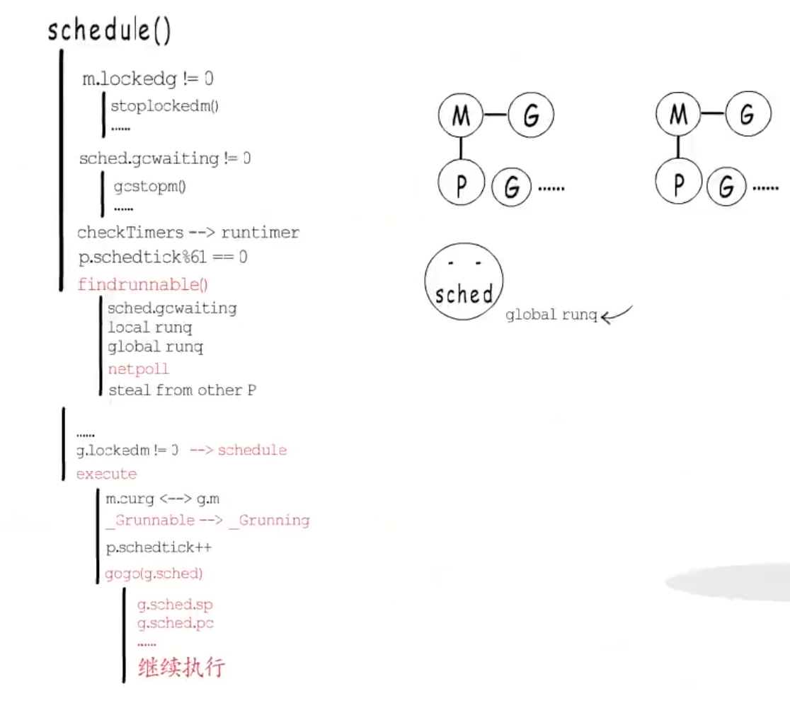

1. 确定当前 m 是否根 g 绑定了，如果绑定了 m 就不行执行其他 g 了，所以需要阻塞 m `stoplocakedm` 等到 g 再次调度执行时自会唤醒与之绑定到 m
2. 如果没有绑定，就看是否有 gc 在等待执行，如果 sched.gcwaiting != 0，就先执行 gcstopm()
3. 检查 timer
4. 每 61 个的时候从全局队列拿出一个 g 待执行，并获取部分到本地本地队列中
5. 然后会调用 findrunable() 进行全力查找 g
   1. 判断 gc
   2. 找本地 runq
   3. 找全局 runq
   4. 主动查 netpoll
   5. 从其他 p 偷
6. 获取到 g 后如果已经绑定了 m， 则唤醒 m，重新调度
7. 全新的 g 就执行 execute(m, g) 将 g 绑定到 m，g-> \_Grunning

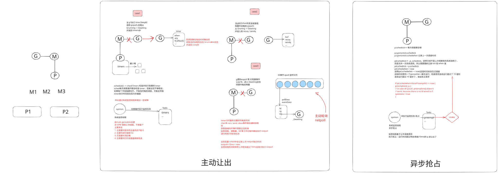

### [监控任务做了啥？](https://golang.design/go-questions/sched/sysmon/)

监控进程是由系统创建的独立于 GPM 模型的线程，主要负责如 timers task 统计计算是否大于抢占时间(10ms)。

不仅负责 g 的抢占调度，也负责 P，当 G 处于系统调用时，M 和 G 是锁定状态，此时的 b 本地 P 就空闲了，所以当前 M 会让出 P

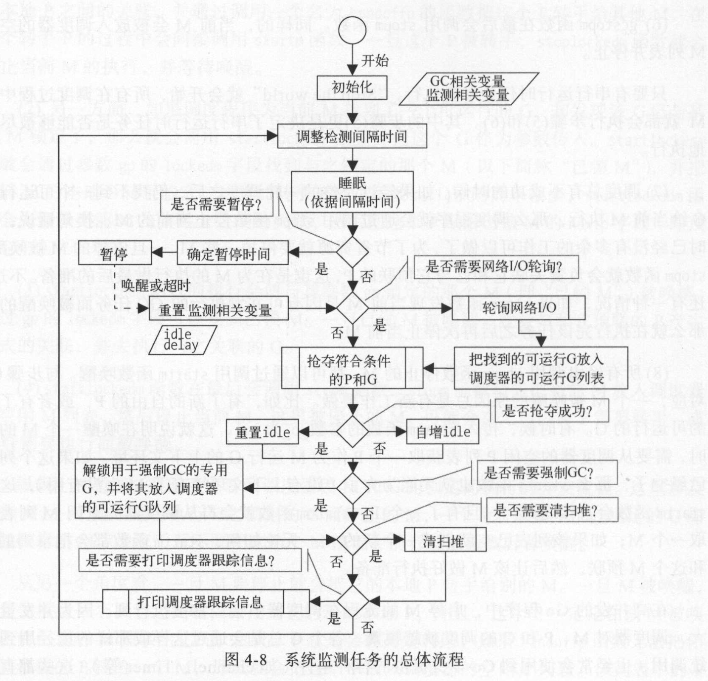

<p align='center'> 《go并发编程实战-第 4 章-4.1.4-郝林》</>

```go
// runtime/runtime2.go
func sysmon() {
	// ...
	// 无限循环，一开始每次循环休眠 20us，之后（1 ms 后）每次休眠时间倍增，最终每一轮都会休眠 10ms
	// sysmon 中会进行 netpool（获取 fd 事件）、retake（抢占）、forcegc（按时间强制执行 gc），scavenge heap（释放自由列表中多余的项减少内存占用）等处理
	for {
		// ...

		now := nanotime()
		// ...
		// retake P's blocked in syscalls
		// and preempt long running G's
		if retake(now) != 0 {
			idle = 0
		} else {
			idle++
		}

		// ...
	}

}

// runtime/proc.go
// forcePreemptNS is the time slice given to a G before it is
// preempted.
const forcePreemptNS = 10 * 1000 * 1000 // 10ms

func retake(now int64) uint32 {
	n := 0
	// Prevent allp slice changes. This lock will be completely
	// uncontended unless we're already stopping the world.
	lock(&allpLock)
	// We can't use a range loop over allp because we may
	// temporarily drop the allpLock. Hence, we need to re-fetch
	// allp each time around the loop.
	// We can't use a range loop over allp because we may
	// temporarily drop the allpLock. Hence, we need to re-fetch
	// allp each time around the loop.
	// 遍历全局变量 allp
	for i := 0; i < len(allp); i++ {
		_p_ := allp[i]
		if _p_ == nil {
			// This can happen if procresize has grown
			// allp but not yet created new Ps.
			continue
		}
		// 用于 sysmon 线程记录被监控 p 的系统调用时间和运行时间
		pd := &_p_.sysmontick
		s := _p_.status
		sysretake := false
		if s == _Prunning || s == _Psyscall {
			// Preempt G if it's running for too long.
			// 每发生一次调度，调度器 ++ 该值
			t := int64(_p_.schedtick)
			if int64(pd.schedtick) != t {
				// pd.schedtick!= _p_.schedtick，说明已经不是上次观察到的系统调用了，
				// 而是另外一次系统调用，所以需要重新记录 tick 和 when 值
				pd.schedtick = uint32(t)
				pd.schedwhen = now
			} else if pd.schedwhen+forcePreemptNS <= now {
				//pd.schedtick == t 说明(pd.schedwhen ～ now)这段时间未发生过调度
				// 这段时间是同一个goroutine一直在运行，检查是否连续运行超过了 10 毫秒
				// 连续运行超过 10 毫秒了，发起抢占请求
				preemptone(_p_)
				// In case of syscall, preemptone() doesn't
				// work, because there is no M wired to P.
				sysretake = true
			}
		}
		if s == _Psyscall {
			// Retake P from syscall if it's there for more than 1 sysmon tick (at least 20us).
			t := int64(_p_.syscalltick)
			if !sysretake && int64(pd.syscalltick) != t {
				pd.syscalltick = uint32(t)
				pd.syscallwhen = now
				continue
			}
			// On the one hand we don't want to retake Ps if there is no other work to do,
			// but on the other hand we want to retake them eventually
			// because they can prevent the sysmon thread from deep sleep.
			// 只要满足下面三个条件中的任意一个，则抢占该 p，否则不抢占
			// 1. p 的运行队列里面有等待运行的 goroutine
			// 2. 没有无所事事的 p
			// 3. 从上一次监控线程观察到 p 对应的 m 处于系统调用之中到现在已经超过 10 毫秒
			if runqempty(_p_) && atomic.Load(&sched.nmspinning)+atomic.Load(&sched.npidle) > 0 && pd.syscallwhen+10*1000*1000 > now {
				continue
			}
			// Drop allpLock so we can take sched.lock.
			unlock(&allpLock)
			// Need to decrement number of idle locked M's
			// (pretending that one more is running) before the CAS.
			// Otherwise the M from which we retake can exit the syscall,
			// increment nmidle and report deadlock.
			incidlelocked(-1)
			if atomic.Cas(&_p_.status, s, _Pidle) {
				if trace.enabled {
					traceGoSysBlock(_p_)
					traceProcStop(_p_)
				}
				n++
				_p_.syscalltick++
				// 寻找一新的 m 接管 p
				handoffp(_p_)
			}
			incidlelocked(1)
			lock(&allpLock)
		}
	}
	unlock(&allpLock)
	return uint32(n)

}
```

#### 抢占系统调用的 P-handoff

当 P 处于 `_Psyscall` 状态时，表明对应的 goroutine 正在进行系统调用。抢占 P，需满足一下几个条件

1. p 的本地运行队列里面有等待运行的 goroutine。这时 p 绑定的 g 正在进行系统调用，无法去执行其他的 g，因此需要接管 p 来执行其他的 g
2. 没有“无所事事”的 p。`sched.nmspinning` 和 `sched.npidle` 都为 0，这就意味着没有“找工作”的 m，也没有空闲的 p，大家都在“忙”，可能有很多工作要做。因此要抢占当前的 p，让它来承担一部分工作
3. 从上一次监控线程观察到 p 对应的 m 处于系统调用之中到现在已经超过 10 毫秒。这说明系统调用所花费的时间较长，需要对其进行抢占，以此来使得 `retake` 函数返回值不为 0，这样，会保持 sysmon 线程 20 us 的检查周期，提高 sysmon 监控的实时性

注意，原代码是用的三个与条件，三者都要满足才会执行下面的 continue，也就是不进行抢占。因此要想进行抢占的话，只需要三个条件有一个不满足就行了。于是就有了上述三种情况

确定要抢占当前 p 后，先使用原子操作将 p 的状态修改为 `_Pidle`，最后调用 `handoffp` 进行抢占, 找一个空闲的 M 如果没有就新建一个 M , 二则都会将 m.nextp.set(_p_)，然后通过 notewakeup 唤醒 m 进行工作 (被唤醒的工作线程则由内核负责在适当的时候调度到 CPU 上运行)。

#### 抢占长时间运行的 P

Go scheduler 采用的是一种称为协作式的抢占式调度，就是说并不强制调度，大家保持协作关系，互相信任。对于长时间运行的 P，或者说绑定在 P 上的长时间运行的 goroutine，sysmon 会检测到这种情况，然后设置一些标志，表示 goroutine 自己让出 CPU 的执行权，给其他 goroutine 一些机会。

在监控扫描时，对比 sysmon 记录下的 p 的调度次数和时间，与当前 p 自己记录下的调度次数和时间对比，如果一致。说明 P 在这一段时间内一直在运行同一个 goroutine。那就来计算一下运行时间是否太长了。

如果发现运行时间超过了 10 ms，则要调用 `preemptone(_p_)` 发起抢占的请求

```go
func preemptone(_p_ *p) bool {
	mp := _p_.m.ptr()
	if mp == nil || mp == getg().m {
		return false
	}
	// 被抢占的 goroutine
	gp := mp.curg
	if gp == nil || gp == mp.g0 {
		return false
	}

	// 设置抢占标志
	gp.preempt = true

	// 在 goroutine 内部的每次调用都会比较栈顶指针和 g.stackguard0，
	// 来判断是否发生了栈溢出。stackPreempt 非常大的一个数，比任何栈都大
	// stackPreempt = 0xfffffade
	gp.stackguard0 = stackPreempt
	return true
}
```

关于抢占 P 的流程可以看接下去的分析，信号量抢占机制。

#### 小结

关于 sysmon 线程在关于调度这块到底做了啥

1. 抢占处于系统调用的 P，当前处于系统调用的 g 与 M 绑定，抢占 P 让其他 M 接管，以运行其他的 gooroutine
2. 将运行时间过长的 goroutine 调度出去，给其他 goroutine 运行的机会

### 抢占式调度

```go
func main() {
	go func(n int) {
		for {
			n++
			fmt.Println(n)
		}
	}(0)

	for {

	}
}
```

以上代码，按逻辑来说应该是不断的输出自增数字。

#### 栈扫描抢占机制

在 go1.14 之前的版本。这个代码会阻塞，阻塞的原因是 stw 跟 for {} 冲突了。

当执行 gc 任务时，会"stop the world"，暂停所有的工作线程，gc 会检查当前所有 P，确认要等多个 p 让出 stopwait=gomaxprocs

对于当前 P, 空闲 P，以及在执行系统调用(\_Psyscall)的 P，直接置为\_Pgcstop 状态即可，对于还有 G 在执行的 P 会将 `g.stackguard0=stackPreempt` 告诉它 gc 正在等待让出，并给调度器的 gcwaiting = 1

`stackPreempt` 是一个特殊的标识，g 的栈初始化，栈大小是固定的，编译器为了防止栈溢出，会在有明显栈消耗的函数头部插入一些检测代码，通过 g.stackguard0 来判断是否进行栈增长。当 g.stackguard0==stackPreempt 时，会执行调度，调度的逻辑中，首先就会判断 gcwaiting 是否等于 1 ，如果是，则会将当前协程让出。

```go
if sched.gcwaiting != 0 {
	gcstopm()
	goto top
}
```

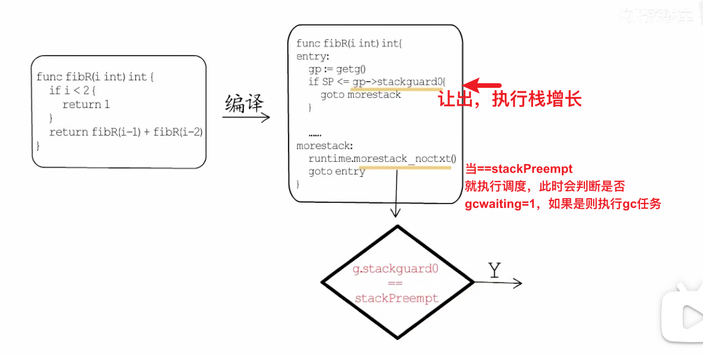

目前看阻塞住的原因就是空的 for 循环没有执行任何函数，就没机会执行栈增长检测代码，所以不知道 gc 在等待让出，一直在空转

```go
// runtime/stack.go
func newstack() {
    gp := getg()
    if gp.stackguard0 == stackPreempt {
        if !gp.preempt { // 双重检查
            throw("bad stackguard")
        }
        // 触发抢占调度
        gopreempt_m(gp)
    }
    // ... 其他栈处理逻辑
}
```

#### 信号量抢占机制

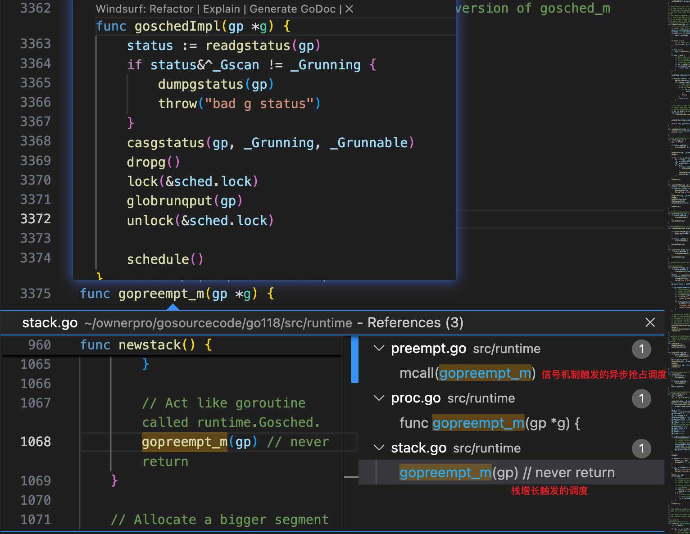

```go
func goschedImpl(gp *g) {
	status := readgstatus(gp)
	if status&^_Gscan != _Grunning {
		dumpgstatus(gp)
		throw("bad g status")
	}
	casgstatus(gp, _Grunning, _Grunnable)
	dropg()
	lock(&sched.lock)
	globrunqput(gp)
	unlock(&sched.lock)

	schedule()
}
```

关键步骤

1. 将 G 的状态从 `_Grunning` 改为 `_Grunnable`。
2. 解除 M 和 G 的绑定（`dropg()`）。
3. 将 G 放回全局运行队列（`globrunqput`）。
4. 调用 `schedule()` 选择下一个 G 执行

如果 G 长时间不执行函数调用（如纯计算循环），`stackPreempt` 无法触发，Go 1.14+ 引入了 **基于信号的抢占** （SIGURG），发送信号和信号处理流程如下

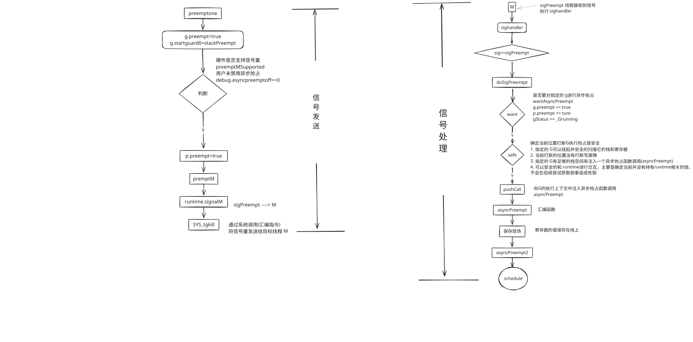

```go
func asyncPreempt2() {
    gp := getg()
    gp.asyncSafePoint = true
    if gp.preemptStop {
        mcall(preemptPark)  // 路径1：完全停止当前 G
    } else {
        mcall(gopreempt_m)  // 路径2：将 G 放回可运行队列
    }
    gp.asyncSafePoint = false
}
```

#### **路径 1：`preemptPark`**

- **触发条件** ：`gp.preemptStop == true`
- **行为** ：

1. 将 G 的状态从 `_Grunning` 改为 `_Gscan|_Gpreempted`（扫描中的抢占状态）。
2. 解除 G 与 M 的绑定（`dropg`）。
3. 将状态最终改为 `_Gpreempted`。
4. 调用 `schedule()` 重新调度。

- **用途** ：完全停止当前 G，通常用于 STW（Stop-The-World）或调试场景。

#### **路径 2：`gopreempt_m` -> `goschedImpl`**

- **触发条件** ：`gp.preemptStop == false`（默认情况）
- **行为** ：

1. 将 G 的状态从 `_Grunning` 改为 `_Grunnable`。
2. 解除 G 与 M 的绑定（`dropg`）。
3. 将 G 放回全局运行队列（`globrunqput`）。
4. 调用 `schedule()` 重新调度。

- **用途** ：普通异步抢占，让 G 重新参与调度。

| **特性**             | `preemptPark`             | `goschedImpl`              |
| -------------------- | ------------------------- | -------------------------- |
| **目标状态**         | `_Gpreempted`（不可运行） | `_Grunnable`（可重新调度） |
| **是否放回运行队列** | 否                        | 是（通过 `globrunqput`）   |
| **典型场景**         | STW、调试、GC 标记阶段    | 普通 Goroutine 的异步抢占  |
| **后续唤醒方式**     | 需显式唤醒（如 `ready`）  | 通过调度器自动选择执行     |

### 小结

1. **同步抢占** ：通过 `stackPreempt` 在函数调用时触发，依赖编译器插入的栈检查。
2. **异步抢占** ：通过信号（SIGURG）强制中断长时间运行的 G

```bash

sysmon 检测到 G 运行超时
    │
    ↓
preemptone() 设置 gp.preempt=true 和 stackguard0=stackPreempt
    │
    ↓
G 执行函数调用时检查 stackguard0 → 触发 morestack → newstack()
    │
    ↓
gopreempt_m() → goschedImpl() → 将 G 放回全局队列 → schedule()
    │
    ↓
（若未触发栈检查）sysmon 发送 SIGURG → M 执行 asyncPreempt → 强制调度
```

- **默认情况** （普通抢占）：`asyncPreempt2` → `gopreempt_m` → `goschedImpl` → 放回全局队列 -> 重新调度 -> 执行其他 g。
- **特殊场景** （完全停止）：`asyncPreempt2` → `preemptPark` → 标记为 `_Gpreempted` + 重新调度 -> 执行 gc 等。

## 5. 从一个案例解释排队和调度

以下代码会输出什么，这么问的话肯定不是正常的 1,2,3 了。实际输出是 3,1,2

```go
func Test_go_schedule_queue(t *testing.T) {
	runtime.GOMAXPROCS(1)

	var wg sync.WaitGroup
	wg.Add(3)
	go func(n int) {
		fmt.Println(n)
		wg.Done()
	}(1)

	go func(n int) {
		fmt.Println(n)
		wg.Done()
	}(2)

	go func(n int) {
		fmt.Println(n)
		wg.Done()
	}(3)

	wg.Wait()
}
```

首先一个前提条件，runtime.GOMAXPOCS 设置为 1，说明只有一个 P 在处理 G，只有一个 m 线程在工作。

然后按序创建了的三个协程，正常入队顺序就是 1,2,3，然后根据 FIFO 的特性就是先执行 1。但是在 P 的属性中，除了 `runq 本地队列` 外还有一个 `runnext字段，记录着下一个要执行的 G `

**这是调度器的一个优化策略** ：Go 调度器会优先执行最近创建的 G（通过 `runnext`），以减少调度延迟。runnext 用于存储一个高优先级的 goroutine（例如，刚解除阻塞的 G 或新创建的 G）

所以入队的顺序如下

```gi
go func(n int) { ... }(1)  // 子协程 G1 被创建，放入runnext
go func(n int) { ... }(2)  // 子协程 G2 被创建，覆盖 runnext G1, G1入队
go func(n int) { ... }(3)  // 子协程 G3 被创建，覆盖 runnext G2, G2入队 最终占据 runnext就是 G3
```

所以消费顺序就是 3,1,2。

### Q1：为什么是等所有 g 入队了才开始消费？

1. runtime.GOMAXPOCS(1) 表示只有一个工作线程 m，所以没有其他 m 来 steal。
2. 每个 m 会有一个 g0 来执行协程，当前执行是主线程的语句，在没有遇到让出 cpu 的情况下，主线程会一占用 CPU

什么情况下会让出 cpu

**主动让出**

- 遇到阻塞性事件
  - time.Sleep
  - I/O
  - wg.Wait
  - channel
- 系统调用
- 显示调用 runtime.Gosched()

**被动让出**

抢占式调度，避免一个协程占用 cpu 太久，go 中预定每个协程跑 10ms，就会被抢占，由系统监控线程控制

### Q2：顺序一直是这样的吗？

上面解释了排队的逻辑，当队列满了呢？

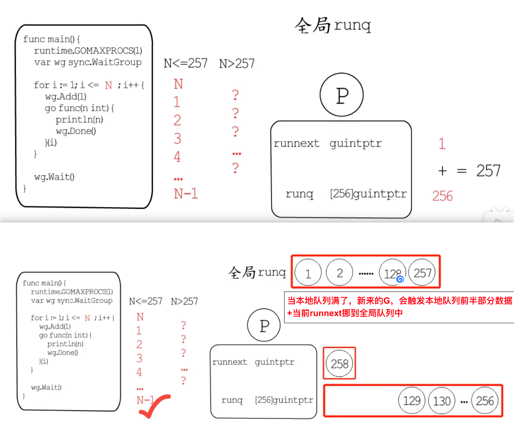

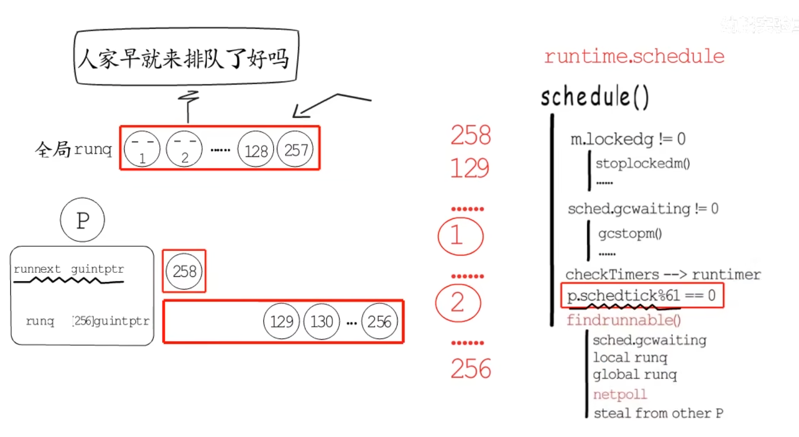

当队列满了之后，新来的 G 会触发本地队列前半部分的数据+当前 runnext 挪到全局队列，然后就要结合调度器的调度逻辑来看了。

调度器会在每计数 61 时从全局队列中拿一次 G 执行，然后在根据 findrunnable()的逻辑来获取待执行的 G

# 6. 案例 2-[一个调度相关的陷阱](https://golang.design/go-questions/sched/sched-trap/)

```go
func main() {
    var x int
    threads := runtime.GOMAXPROCS(0)
    for i := 0; i < threads; i++ {
        go func() {
            for { x++ }
        }()
    }
    time.Sleep(time.Second)
    fmt.Println("x =", x)
}
```

运行结果是：在死循环里出不来，不会输出最后的那条打印语句。

为什么？上面的例子会启动和**机器的 CPU 核心数相等的工作线程**消费 goroutine，每个 goroutine 都会执行一个无限循环。

创建完这些 goroutines 后，main 函数里执行一条 `time.Sleep(time.Second)` 语句。Go scheduler 看到这条语句后，简直高兴坏了，要来活了。

这是调度的好时机啊，于是主 goroutine 被调度走，进入 Gwaiting。先前创建的 `threads` 个 goroutines，刚好“一个萝卜一个坑”，把 M 和 P 都占满了。

在这些 goroutine 内部，又没有调用一些诸如 `channel`，`time.sleep`，函数调用，系统调用，垃圾回收等**调度点**。

这个案例根抢占式调度部分的案例一样，由于是通过栈扫描检测调度机制导致，在 Go 1.14+ 基于信号实现的强制抢占机制已经解决

# [垃圾回收器](https://draven.co/golang/docs/part3-runtime/ch07-memory/golang-garbage-collector/#%E8%A7%A6%E5%8F%91%E6%97%B6%E6%9C%BA)

垃圾回收的实现手段

- 引用计数
- 标记清除
- 隔代回收

## Python 的实现机制

[Python 的垃圾回收](https://www.cnblogs.com/panlq/p/13096942.html)（Garbage Collection, GC）机制是通过 **引用计数为主，** 标记清除-**分代垃圾回收为辅的机制实现的。**

为什么这么麻烦？由于引用计数无法处理循环引用的问题，所以需要标记-清除的机制来处理，并在隔代回收中通过不同频率来区分变量的存活扫描周期(弱代假说)，减小 gc 对程序的影响。

引用计数虽然是最简单的，但是也是有代价的，

1. python 因此引入了 GIL 锁，因为每个 PyObject 都有一个 `ob_refcnt` 字段，为了解决并发更新问题，引入了全局解释器锁，导致 python 相当于就是单线程了。
2. 引用计数机制所带来的维护引用计数的额外操作，与 python 运行中所进行的内存分配、释放、引用赋值的次数是成正比的，这一点，相对于主流的垃圾回收技术，比如标记--清除 `(mark--sweep)`、停止--复制 `(stop--copy)`等方法相比是一个弱点，因为它们带来额外操作只和内存数量有关，至于多少人引用了这块内存则不关心。因此为了与引用计数搭配、在内存的分配和释放上获得最高的效率，python 设计了大量的内存池机制，比如**小整数对象池、字符串的 intern 机制，列表的 freelist 缓冲池**等等，这些大量使用的面向特定对象的内存池机制正是为了弥补引用计数的软肋。

### **隔代回收有什么好处？**

> 通过 **对象存活时间分层管理** ，显著提升了垃圾回收效率。

#### **1. 提升回收效率：基于“弱代假说”优化**

- **弱代假说（Weak Generational Hypothesis）** ：

> **绝大多数对象的生命周期非常短暂** ，只有少数对象会长期存活。

- **统计支持** ：90% 的新建对象会在短时间内变成垃圾（如函数内的临时变量）。
- **分代策略** ：
  - **频繁检查新对象** （Generation 0）：快速回收短期垃圾。
  - **减少检查老对象** （Generation 1/2）：降低长期存活对象的扫描开销。

#### 2. 缩短 STW 时间

分代回收优先扫描更可能存活的年轻代（Generation 0），避免每次全堆扫描。

#### 3. 针对性处理循环引用

- **分代聚焦** ：
  循环引用多由长期存活对象（如全局缓存）引起，分代回收能高效定位到 Generation 1/2。
- **避免无谓扫描** ：
  短期临时对象（如函数内循环引用）会在 Generation 0 被快速回收。

```python
from flask import Flask

app = Flask(__name__)

@app.route("/")
def home():
    data = [i for i in range(1000)]  # 临时对象（Generation 0）
    return "OK"

# 分代回收优势：
# 1. 快速回收 data 等临时变量。
# 2. 路由函数等长期对象（Generation 2）极少被扫描。
```

## 相关概念

赋值器：简言之就是你写的程序代码，在程序的执行过程中，可能会改变对象的引用关系，或者创建新对象，新引用

回收器：垃圾回收器的职责就是干掉程序中不在被引用的对象

STW：stop the world。在 GC 期间某个阶段会停止所有的用户协程，来去确定引用关系。

举个栗子，有一个大院，孩子特别多，老师希望他们以班长为起点手牵手在一起，但总有几个不听话的孩子，没有牵手，你为了找出这些不听话的孩子，你会以班长为起点，一个一个的往后捋。但是如果有一个名叫张三的孩子，之前在队尾，后来在你数到队伍中间的时候，又跑到了队头和班长牵手去了，当你数完后，因为没有统计到张三，你就认为张三没有听话，没有奖励小红花，岂不让孩子比窦娥还冤…，所以这种情况下，你需要先让孩子们不动【映射到程序的概念，即 STW 停止程序运行】，然后再统计。

root 根对象：根对象是指赋值器可以直接访问到的对象，可以追踪到其他存活的对象，常见的根对象如下

- 全局变量：程序在编译期就能确定的那些存在于程序整个声明周期的变量
- 执行栈：每个 goroutine(包括 main 函数)都拥自自己的函授栈，这些执行栈上包含的变量及堆内存指针

## go 语言的垃圾回收实现-并发三色标清除

> 具体变化过程可参考 [一文弄懂 Golang GC、三色标记、混合写屏障机制【图文解析 GC】](https://blog.csdn.net/xiaodaoge_it/article/details/121890145)

黑色：可达对象，确定后不会在扫描

灰色：中间态，待扫描对象

白色：不可达对象，要清理的对象

在并发三色标记的过程中，由于黑色对象确定后就不会在扫描，如果程序修改了引用，黑色对象直接引用白色对象，垃圾回收白色对象后，导致内存对象访问错误。而黑色对象能引用到白色对象的前提是存在灰色对线指向白色对象，即要先有迹可循，才能引用。

在三色标记法的过程中对象丢失，需要同时满足下面两个条件：

- 条件一：**白色对象被黑色对象引用**
- 条件二：**灰色对象与白色对象之间的可达关系遭到破坏**

看来只要把上面两个条件破坏掉一个，就可以保证对象不丢失，所以我们的 golang 团队就提出了两种破坏条件的方式：**强三色不变式**和 **弱三色不变式** 。

#### 强三色不变式

规则：不允许黑色对象直接引用白色对象

如果一个黑色对象，不直接引用白色对象，那么就不会出现白色对象扫描不到，从而被当做垃圾回收掉的尴尬

#### 弱三色不变式

规则：黑色对象间接引用白色对象，但是白色对象的上游必须存在灰色对象

针对两种不变式，提出了两种实现机制，插入写屏障和删除写屏障

#### 插入写屏障

规则：当一个对象引用另一个对象时，将被引用对象标记为灰色

满足强三色不变式，不会存在黑色对象直接引用白色对象

需要注意一点，插入屏障仅会在堆内生效，不对栈内存空间生效，因为 go 并发运行时，大部分的操作都发生在栈上，函数调用非常频繁，如果都进行屏障保护有会性能问题。

#### 删除写屏障

规则：在删除引用时，如果被删除引用对象自身为灰色或白色，那么标记为灰色

满足弱三色不变式，灰色对象到白色对象的路径不会断

冗余数据现象


引入删除写屏障，有一个弊端，就是一个对象的引用被删除后，即使没有其他存活的对象引用它，它仍然会活到下一轮。如此一来，会产生很多的冗余扫描成本，且降低了回收精度

> ⚠️：在下一轮垃圾回收时会对所有数据进行重判，冗余的数据就可以被回收了！

对比插入写屏障和删除写屏障：

- 插入写屏障：
  插入写屏障哪里都好，就是栈上的操作管不到，所以最后需要对栈空间进行 stw 保护，然后 rescan 保证引用的白色对象存活。
- 删除写屏障：
  在 GC 开始时，会扫描记录整个栈做快照，从而在删除操作时，可以拦截操作，将白色对象置为灰色对象。回收精度低

## 混合写屏障机制

- gc 刚开始的时候，会将栈上的可达对象全部标记为黑色
- gc 期间，任何在栈上新创建的对象，均为黑色
  > 上面两点只有一个目的，将栈上的可达对象全部标黑，最后无需对栈进行 STW，就可以保证栈上的对象不会丢失。有人说，一直是黑色的对象，那么不就永远清除不掉了么，这里强调一下，标记为黑色的是可达对象，不可达的对象一直会是白色，直到最后被回收
- 堆上被删除的对象标记为灰色
- 堆上新添加的对象标记为灰色

混合写屏障的目的是在程序修改指针时，确保垃圾回收器能够正确跟踪对象引用关系，避免**漏标** **误标**问题

- **漏标（Missing）** ：黑色对象新增引用白色对象时，若未被重新标记，白色对象可能被错误回收。
- **误标（Floating Garbage )** ：灰色对象删除对某个对象的引用时，若该对象未被重新扫描，可能导致残留垃圾。

原理如下

```go
func HybridWritePointerSimple(slot *unsafe.Pointer, ptr unsafe.Pointer) {
    shade(*slot)  // 对原值（*slot）进行标记
    shade(ptr)    // 对新值（ptr）进行标记
    *slot = ptr   // 更新指针值
}
```

#### **(1) `shade(*slot)`**

- **含义** ：对当前指针 `*slot`指向的对象进行标记。
- **作用** ：如果 `*slot`指向的是一个白色对象，将其标记为灰色，防止其被误删（删除写屏障规则）。
  换句话说，这一步确保了“删除引用时保留目标对象”。

#### **(2) `shade(ptr)`**

- **含义** ：对新指针 `ptr`指向的对象进行标记。
- **作用** ：如果 `ptr`指向的是一个白色对象，将其标记为灰色，防止其被漏标（插入写屏障规则）。
  这一步确保了“新增引用时重新标记目标对象”。

#### **(3) `*slot = ptr`**

- **含义** ：将 `*slot`指向的新值更新为 `ptr`。
- **作用** ：完成指针的实际更新操作。

## 小结

1. Golang v1.3 之前采用传统采取标记-清除法，需要 STW，暂停整个程序的运行。
2. 在 v1.5 版本中，引入了三色标记法和插入写屏障机制，其中插入写屏障机制只在堆内存中生效。但在标记过程中，最后需要对栈进行 STW 扫描。
3. 在 v1.8 版本中结合删除写屏障机制，推出了混合屏障机制，屏障限制只在堆内存中生效。避免了最后节点对栈进行 STW 的问题，提升了 GC 效率

## faq

### 1. 垃圾回收回收的是哪里的内存？

在 Go 语言里，垃圾回收（GC）主要回收的是堆内存。下面为你详细介绍栈内存和堆内存，以及垃圾回收为何主要针对堆内存。

### 2. 什么时候触发 gc, 如何避免频繁 gc

触发时机：

1. 堆内存分配达到上一次 GC 的 2 倍
2. 系统每 2 分钟强制触发一次
3. 手动调用 runtime.GC()

缺点分析

- **STW（Stop The World）** ：标记阶段会短暂暂停所有协程
- **CPU 消耗** ：标记和清除过程会占用约 25% 的 CPU 资源
- **内存碎片化** ：对象移动可能导致内存空洞

优化建议

- 对象复用：使用内存池 sync.Pool 缓存临时对象(复用对象)，高频创建/销毁的小对象最适合用 Pool，别什么都往池里丢
- 减少逃逸：避免闭包捕获大对象
- 批量操作：合并小对象分配减少 GC 压力

### 栈内存

栈内存由操作系统自动管理。在函数调用时，会为函数的局部变量、参数、返回地址等在栈上分配内存，当函数返回时，这些内存会被自动释放。栈内存的分配与释放非常迅速，因为它遵循后进先出（LIFO）的原则，只需移动栈指针就可以完成。由于栈内存的分配和释放是由编译器和操作系统管理的，所以垃圾回收机制不会对其进行处理。

### 堆内存

堆内存用于存储那些生命周期不确定的对象。在 Go 语言里，当你使用 `new`或者 `make`关键字创建对象时，对象的内存会被分配在堆上。因为这些对象的生命周期无法在编译时确定，可能会被多个函数或者 goroutine 引用，所以需要垃圾回收机制来判断对象是否还有引用，若没有引用，就将其占用的内存回收。

```golang
package main

func main() {
    // 栈上分配的变量
    var stackVar int = 10

    // 堆上分配的变量
    heapVar := new(int)
    *heapVar = 20

    // 这里栈变量 stackVar 在 main 函数结束时会自动释放
    // 堆变量 heapVar 需要垃圾回收机制来回收
}
```

### 2. 内存屏障的作用是什么？

先说屏障的本质：

- 内存屏障只是对应一段特殊的代码
- 内存屏障这段代码在编译期间生成
- 内存屏障本质上在运行期间拦截内存写操作，相当于一个 hook 调用
  通过 hook 内存的写操作时机，阻止一些事情的发生，或者说做好一些标记工作，从而保证垃圾回收的正确性

## 参考

1. [一文弄懂 Golang GC、三色标记、混合写屏障机制【图文解析 GC】](https://blog.csdn.net/xiaodaoge_it/article/details/121890145)
2. [Golang 三色标记混合写屏障 GC 模式全分析](https://www.yuque.com/aceld/golang/zhzanb#2ac0bdfc)
3. [幼林实验室-GC](https://www.bilibili.com/video/BV1hv411x7we?spm_id_from=333.788.videopod.episodes&vd_source=722eadbf11e353b18b8a8a766e376803&p=20)
4. [《Go GC 20 问》](https://mp.weixin.qq.com/s/o2oMMh0PF5ZSoYD0XOBY2Q)

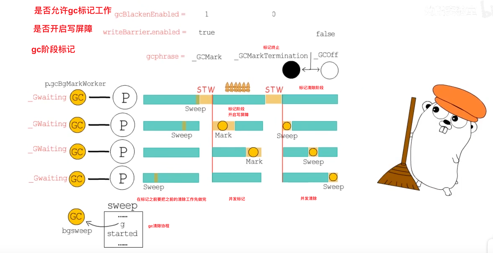

**1. 准备阶段**

创建 0.25\*len(p)数量的协程 gcMarkworker 并处于 Gwaiting 休眠状态，等待到标记阶段得到调度执行

**2. 标记阶段**

**如何标记，怎么确定是 gc 感兴趣的指针？**

在创建对象的时候，对象会被放入两个不同的内存管理单元，一个叫 `gc-no-scan`, 一个叫 `gc-scan` 指针类型的变量会被分配 gc-scan 类型的内存 span 中。这类数据会被 gc 标记扫描。

**3. 标记终止阶段**

**4. 执行清除**

# 泛型

案例分析泛型

```go
package utils

import (
	"fmt"
)

// 类型约束：定义一个接口，限制 K 必须是 comparable（可比较），V 可以是任何类型
type Cacheable interface {
	comparable // 类型约束：K 必须支持 == 和 !=
}

// 泛型类型：定义一个泛型结构体 Cache，K 和 V 是类型形参
type Cache[K Cacheable, V any] struct {
	data map[K]V
}

// 泛型接收器：方法 Set 的接收器是泛型类型 Cache[K, V]
func (c *Cache[K, V]) Set(key K, value V) {
	c.data[key] = value
}

// 泛型接收器：方法 Get 的接收器是泛型类型 Cache[K, V]
func (c *Cache[K, V]) Get(key K) (V, bool) {
	val, ok := c.data[key]
	return val, ok
}

// 泛型函数：NewCache 是一个泛型函数，返回泛型类型 Cache[K, V]
func NewCache[K Cacheable, V any]() *Cache[K, V] {
	return &Cache[K, V]{
		data: make(map[K]V),
	}
}

type Number interface {
	~int | ~float64 // 底层是 int 或 float64 的所有类型
}

func Add[T Number](a, b T) T {
	return a + b
}

type MyInt int

func main() {
	// 实例化：Cache[string, int]，string 和 int 是类型实参
	stringIntCache := NewCache[string, int]()
	stringIntCache.Set("age", 30)
	age, ok := stringIntCache.Get("age")
	fmt.Println(age, ok) // 输出：30 true

	// 实例化：Cache[int, string]，int 和 string 是类型实参
	intStringCache := NewCache[int, string]()
	intStringCache.Set(1, "one")
	one, ok := intStringCache.Get(1)
	fmt.Println(one, ok) // 输出：one true

	// 联合元素
	Add(1, 2)               // OK: int 满足 ~int
	Add(1.5, 2.5)           // OK: float64 满足 ~float64
	Add(MyInt(1), MyInt(2)) // OK: MyInt 的底层是 int
}

```

## 1. 解决的问题

虽然 Go 中的空接口 interface{} 允许存储任何类型的值，但它是一种动态类型的机制，并且在使用时需要进行类型断言。相比之下，泛型（Generics）提供了一种静态类型的通用解决方案，使得代码可以在不失去类型安全性的前提下处理多种数据类型

## 2. 概念

- 类型形参 (Type parameter)
- 类型实参(Type argument)
- 类型形参列表( Type parameter list)
- union element（联合元素）
- 近似元素
- 嵌入约束
- 类型约束(Type constraint)
- 实例化(Instantiations)
- 泛型类型(Generic type)
- 泛型接收器(Generic receiver)
- 泛型函数(Generic function)

| 概念           | 作用                      | 示例                                 |
| -------------- | ------------------------- | ------------------------------------ |
| **类型形参**   | 泛型代码中的占位类型      | `[K Cacheable, V any]`               |
| **类型实参**   | 实例化时传入的具体类型    | `Cache[string, int]`                 |
| **类型约束**   | 限制类型形参的范围        | `K comparable`                       |
| **联合元素**   | 用 ｜                     | 表示“或”关系                         |
| **近似元素**   | `~T` 表示“底层类型是 `T`” | `~int`（包括 `type MyInt int`）      |
| **泛型类型**   | 带类型形参的结构体/接口   | `type Cache[K, V] struct { ... }`    |
| **泛型函数**   | 带类型形参的函数          | `func NewCache[K, V]() *Cache[K, V]` |
| **泛型接收器** | 方法绑定到泛型类型        | `func (c *Cache[K, V]) Set(...)`     |
| **实例化**     | 用具体类型替换泛型形参    | `NewCache[string, int]()`            |

## Go 语言如何实现类型参数的约束条件？答案是通过扩展后的接口。

```go
type Constraints interfact {
	Method1()
	Method2()       方法集

	int32 | int64   类型集
}

```

通过类型集来表示接口支持的类型，即联合类型+近似类型

```go
type MyInt int

type Integer interface {
	int | MyInt
}

// 上面的两个可以用如下表示
type Integer2 interface {
	~int
	// 支持 int 以及基于 int 的自定义类型
}
```

## 2. 底层实现-GC Shape Stenciling

```go
package main

import (
	"fmt"
)

// gcshape.go
func f[T any](t T) {
	fmt.Printf("%T: %v\n", t, t)
}

type MyInt int

func main() {
	f[int](5)
	f[MyInt](5)
	f(1)
}
```

```bash
go tool nm gcshape | grep ' main\.'
1000c87a8 R main..dict.f[int]
1000c87b0 R main..dict.f[main.MyInt]
100129120 D main..inittask
10008b600 T main.f[go.shape.int_0]
10008b5a0 T main.main
```

```
// 相同形状的类型，只需 1 个机器码版本，但每个都有自己的 metadata dict。
           ┌────────────────────┐
           │ f[go.shape.int_0]  │
           └────────────────────┘
             ▲              ▲
             │              │
    ┌────────────────┐ ┌────────────────────┐
    │ dict.f[int]    │ │ dict.f[main.MyInt] │
    └────────────────┘ └────────────────────┘
```

编译器生成的内容(伪代码)

```go
// 原始泛型函数（伪模板）
func f[T any](dict *Dict_f_T, t T) {
	// 使用 dict 中的方法或信息（如果有需要，如比较、赋值等）
	fmt.Printf("%T: %v\n", t, t)
}

// 针对 shape=int 的 monomorphized 版本（共享机器码）
// 实际生成的机器码函数，T 被 shape 替换，比如 int_0
func f_shape_int_0(dict *Dict_f_T, t uintptr) {
	typeInfo := dict.TypeInfo
	// 这里我们只用到 reflect.Type (for %T)
	fmt.Printf("%s: %v\n", typeInfo.Name(), t) // 模拟 fmt.Printf("%T", t)
}


// 编译器生成的字典
var dict_f_int = Dict_f_T{
	TypeInfo: runtimeTypeInfo(int),
	// 可能还有方法实现的函数指针（如比较器、哈希器）
}

// 编译器生成的字典
var dict_f_myint = Dict_f_T{
	TypeInfo: runtimeTypeInfo(MyInt),
	// 可能还有方法实现的函数指针（如比较器、哈希器）
}

// main 函数中调用（编译器转换）
func main() {
	f_shape_int_0(&dict_f_int, 5)
        f_shape_int_0(&dict_f_myint, 5)
}

```

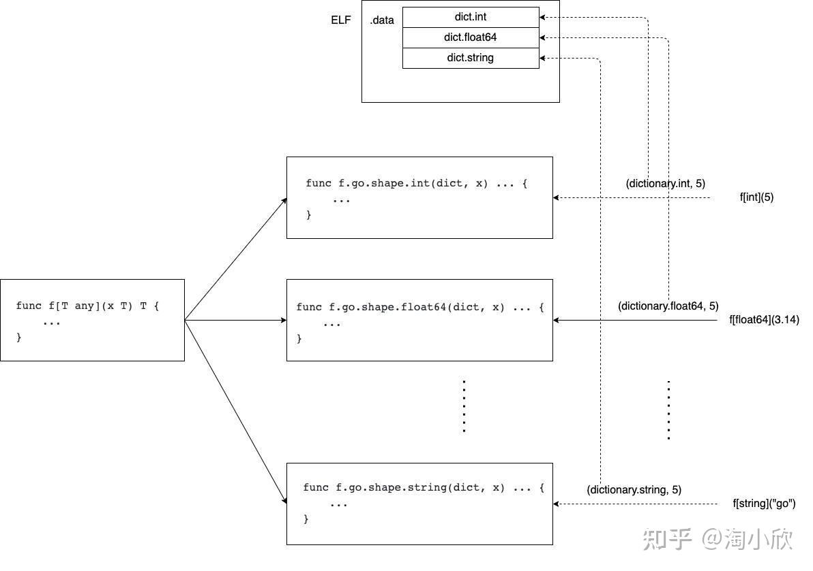

**GC Shape Stenciling** 的核心思想：**按内存布局分类，同一类共享代码**

对于有相同 gcshape 的类型，共用一套代码。
什么是 gcshape? 简单理解就是两个类型

- 相同的底层类型
- 都是指针类型

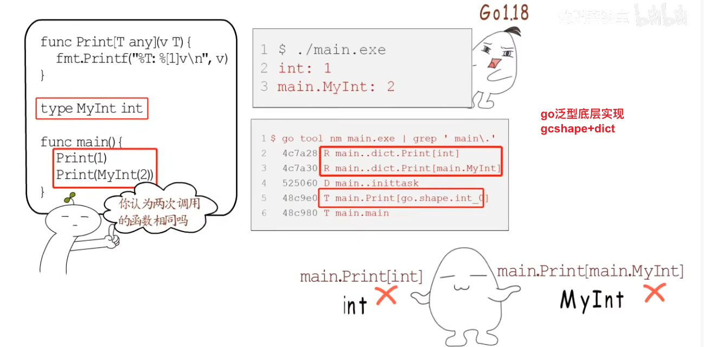

所有底层共用一份代码，那怎么区分类型？答案就是字段，在每个实例的代码函数中增加一个 dict 参数，用于区分 gcshape 相同的不同类型，记录类型元数据

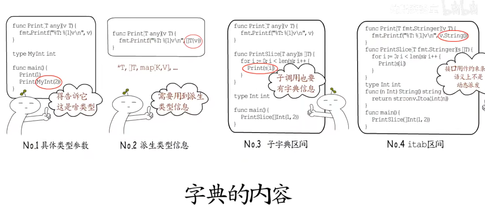

字典记录的信息：

- 类型元数据
- 派生类型信息
- 字字典信息(调用其他泛型函数)
- 接口的 itab 区间

### 小结

Go 使用 `Monomorphization （单态化： 为每个被调用的数据类型生成一个泛型函数副本) `，但试图减少需要生成的函数副本的数量。它不是为每个类型创建一个副本，而是为内存中的每个布局生成一个副本：`int`、`float64`、`Node` 和其他所谓的 `"值类型"` 在内存中看起来都不一样，因此泛型函数将为所有这些类型复制副本。

与值类型相反，指针和接口在内存中总是有相同的布局。编译器将为指针和接口的调用生成一个泛型函数的副本。就像 `Virtual Method Table` 一样，泛型函数接收指针，因此需要一个表来动态地查找方法地址。在 Go 实现中的字典与虚拟方法表的性能特点相同

[简单易懂的 Go 泛型使用和实现原理介绍- 万俊峰 Kevin](https://www.cnblogs.com/kevinwan/p/16223984.html)

[泛型设计 - | Go 语言设计哲学- 煎鱼](https://golang3.eddycjy.com/posts/generics/)

[Go 泛型是怎么实现的? - 鸟窝](https://colobu.com/2021/08/30/how-is-go-generic-implemented/)

[Golang 泛型实现原理](https://blog.csdn.net/K346K346/article/details/135171708)

[Go 泛型之明确使用时机与泛型实现原理](https://zhuanlan.zhihu.com/p/675068902)

# channel

[Go 语言基础之并发 - 李文周的博客](https://www.liwenzhou.com/posts/Go/concurrence/)

> **Do not communicate by sharing memory; instead, share memory by communicate.**
>
> Go 语言采用的并发模型是 `CSP（Communicating Sequential Processes）`，提倡**通过通信共享内存**而不是 **通过共享内存而实现通信** 。

Go 内建的函数 close、cap、len 都可以操作 chan 类型：close 会把 chan 关闭掉，cap 返回 chan 的容量，len 返回 chan 中缓存的还未被取走的元素数量

## 原理

```go
type hchan struct {
	// chan 里元素数量
	qcount   uint
	// chan 底层环形数组的长度
	dataqsiz uint
	// 指向底层循环形组的指针
	// 只针对有缓冲的 channel
	buf      unsafe.Pointer
	// chan 中元素大小
	elemsize uint16
	// chan 是否被关闭的标志
	closed   uint32
	// chan 中元素类型
	elemtype *_type // element type
	// 已发送元素在环形数组中的索引
	sendx    uint   // send index
	// 已接收元素在环形数组中的索引
	recvx    uint   // receive index
	// 等待接收的 goroutine 队列,  waitq是一个双向链表
	recvq    waitq  // list of recv waiters
	// 等待发送的 goroutine 队列
	sendq    waitq  // list of send waiters

	// 保护 hchan 中所有字段
	lock mutex
}
```

`buf` 指向底层环形数组，只有缓冲型的 channel 才有。

`sendx`，`recvx` 均指向底层环形数组，表示当前可以发送和接收的元素位置索引值（相对于底层数组）。

`sendq`，`recvq` 分别表示被阻塞的 goroutine，这些 goroutine 由于尝试读取 channel 或向 channel 发送数据而被阻塞。

`waitq` 是 `sudog` 的一个双向链表，而 `sudog` 实际上是对 goroutine 的一个封装：

```golang
type waitq struct {
	first *sudog
	last  *sudog
}
```

`lock` 用来保证每个读 channel 或写 channel 的操作都是原子的

nil 是 chan 的零值，是一种特殊的 chan，对值是 nil 的 chan 的发送接收调用者总是会阻塞

只要一个 chan 还有未读的数据，即使把它 close 掉，你还是可以继续把这些未读的数据消费完，之后才是读取零值数据。

创建一个容量为 6 的，元素为 int 型的 channel 数据结构如下


### [发送](https://golang.design/go-questions/channel/send/)

### [接收](https://golang.design/go-questions/channel/recv/)

### [关闭](https://golang.design/go-questions/channel/close/)

close 逻辑比较简单，对于一个 channel，recvq 和 sendq 中分别保存了阻塞的发送者和接收者。关闭 channel 后，对于等待接收者而言，会收到一个相应类型的零值。对于等待发送者，会直接 panic。所以，在不了解 channel 还有没有接收者的情况下，不能贸然关闭 channel。

close 函数先上一把大锁，接着把所有挂在这个 channel 上的 sender 和 receiver 全都连成一个 sudog 链表，再解锁。最后，再将所有的 sudog 全都唤醒。

唤醒之后，该干嘛干嘛。sender 会继续执行 chansend 函数里 goparkunlock 函数之后的代码，很不幸，检测到 channel 已经关闭了，panic。receiver 则比较幸运，进行一些扫尾工作后，返回。

关闭后的通道有以下特点：

1. 对一个关闭的通道再发送值就会导致 panic。
2. 对一个关闭的通道进行接收会一直获取值直到通道为空。
3. 对一个关闭的并且没有值的通道执行接收操作会得到对应类型的零值。
4. 关闭一个已经关闭的通道会导致 panic。

## 案例分析

### 1. channel 的发送和接收操作本质上是 "copy value"

```go
type user struct {
	name string
	age int8
}

var u = user{name: "Ankur", age: 25}
var g = &u

func modifyUser(pu *user) {
	fmt.Println("modifyUser Received Vaule", pu)
	pu.name = "Anand"
}

func printUser(u <-chan *user) {
	time.Sleep(2 * time.Second)
	fmt.Println("printUser goRoutine called", <-u)
}

func main() {
	c := make(chan *user, 5)
	c <- g
	fmt.Println(g)
	// modify g
	g = &user{name: "Ankur Anand", age: 100}
	go printUser(c)
	go modifyUser(g)
	time.Sleep(5 * time.Second)
	fmt.Println(g)
}
```

执行结果

```bash
&{Ankur 25}
modifyUser Received Vaule &{Ankur Anand 100}
printUser goRoutine called &{Ankur 25}
&{Anand 100}
```


一开始构造一个结构体 u，地址是 0x56420，图中地址上方就是它的内容。接着把 `&u` 赋值给指针 `g`，g 的地址是 0x565bb0，它的内容就是一个地址，指向 u。

main 程序里，先把 g 发送到 c，根据 `copy value` 的本质，进入到 chan buf 里的就是 `0x56420`，它是指针 g 的值（不是它指向的内容），所以打印从 channel 接收到的元素时，它就是 `&{Ankur 25}`。因此，这里并不是将指针 g “发送” 到了 channel 里，只是拷贝它的值而已

### 2. 发送和接收的调度例子

```go

func goroutineA(a <-chan int) {
	fmt.Println("goroutine A started")
	val := <-a
	fmt.Println("goroutine A received data: ", val)
	return
}

func goroutineB(b <-chan int) {
	fmt.Println("goroutine B started")
	val := <-b
	fmt.Println("goroutine B received data: ", val)
	return
}

func main(t *testing.T) {
	ch := make(chan int)
	go goroutineA(ch)
	go goroutineB(ch)
	fmt.Println("send chan start")
	ch <- 3
	fmt.Println("send chan end")
	time.Sleep(time.Second)
	fmt.Println("main end")
}
```

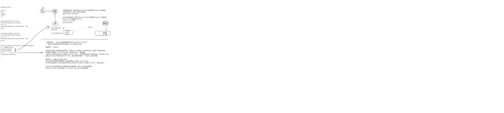

### 3. **使用无缓冲 chan 实现无锁计数**

```go
// 抽象一个栅栏
type Barrier interface{
	Wait()
}

// 创建栅栏对象
func NewBarrier (n int) Barrier {}


// 栅栏的实现类
type barrier struct {
}


func main() {
	b := NewBarrier(10)
    // 达到效果：前9个协程调用Wait()阻塞，第10个调用后10个协程全部唤醒
	for i:=0; i <10; i++ {
		go b.Wait()
	}
}


```

**需要对上面的 NewBarrier()函数和 barrier 这个类进行修改，达到预期的效果。而且还要有条件约束，就是不能用任何同步相关的操作，但可以用 chan，前提是无缓冲模式的。**

**我们知道无缓冲的 chan 本身就是阻塞的，但是要在不可使用同步原语的情况下，**

1. **如何做到并发安全的数据统计** **？只能从 chan 中逐个读取，进行计数**
2. **Wait 方法写入 chan， 实现另外一个方法从 chan 读数据并计数，但这样的话，每次 chan 读取后，Wait 就会被唤醒不会阻塞？\*\***有什么方法能让发送协程不被激活么，如果是当前状态的 chan 是无解的。\*\*

**本身到统计到第 10 个数据后，也要做一些动作来唤醒前面所有的 Wait，而上面第二点又需要重新进入阻塞状态，这种情况下，就在加一个无缓冲 chan，就可以完美解决了。**

```go
// 抽象一个栅栏
type Barrier interface {
	Wait()
}

// 创建栅栏对象
func NewBarrier(n int) Barrier {
	b := barrier{chCount: make(chan struct{}), n: n, chSync: make(chan struct{})}
	go b.Sync()
	return b
}

// 栅栏的实现类
type barrier struct {
	chCount chan struct{}
	chSync  chan struct{}
	n       int
}

// 测试代码
func (b barrier) Sync() {
	count := 0
	for range b.chCount {
		count++
		if count >= b.n {
			fmt.Println("统计结束")
			close(b.chSync)
			break
		}
	}
}

func (b barrier) Wait() {
	b.chCount <- struct{}{}
	<-b.chSync // 阻塞同步器
}

func main() {
	b := NewBarrier(10)
	fmt.Println("开始")
	for i := 0; i < 10; i++ {
		go b.Wait()
	}

	// 模拟常驻
	time.Sleep(time.Second)
}
```

### 4. 击鼓传花

**“击鼓传花”，类似流水线模式，这个节点处理完后给下一个节点，流水线模式就表示 顺序执行了。如下例子：**

**有 4 个 goroutine，编号为 1、2、3、4。每秒钟会有一个 goroutine 打印出它自己的编号，要求你编写程序，让输出的编号总是按照 1、2、3、4、1、2、3、4……这个顺序**

**打印出来。**

```go
/*

*/

type Token struct{}

func TestCase(t *testing.T) {
	chs := []chan Token{
		make(chan Token),
		make(chan Token),
		make(chan Token),
		make(chan Token),
	}

	for i := 0; i < 4; i++ {
		go newWorker(i, chs[i], chs[(i+1)%4])
	}

	chs[0] <- Token{}

	select {}
}

func newWorker(id int, ch chan Token, nextCh chan Token) {
	for {
		token := <-ch
		fmt.Println(id + 1)
		time.Sleep(time.Second)
		nextCh <- token
	}
}

```

### 5. 初始化一个空 chan, 读这个 chan 会怎么样？

```go
func main() {
	var ch chan int
	val, ok := <-ch
	if ok {
		fmt.Println("ok", val)
	} else {
		fmt.Println("not ok", val)
	}
}
```

> [The value of a receive operation on a nil channel is the zero value of the channel&#39;s element type. The operation blocks forever.](https://go.dev/ref/spec?spm=a2ty_o01.29997173.0.0.7d8a5171IeO7lL#Receive_operator)

1. ⚠️ 如果是主 goroutine 被阻塞，并且没有其他活跃的 goroutine，运行时会报 `deadlock` 错误。

```bash
fatal error: all goroutines are asleep - deadlock!

goroutine 1 [chan receive (nil chan)]:
main.main()
        /Users/jonpan/ownerpro/panlq-github/xbook/golang/test/channel/nil_chan.go:7 +0x24
exit status 2
```

2. 如果主进程还有其他协程再跑，则初始化这个 ch ， 并读取的协程函数会永远阻塞

## 什么适用什么场景

1. 生产者消费者模型
2. 任务分发与结果收集
3. 控制并发数量
4. 优雅退出

注意事项

1. **channel 常见的错误 panic**
   1. **close 为 nil 的 chan**
   2. **send 已经 close 的 chan**
   3. **close 已经 close 的 chan**
2. 避免内存泄露
   1. 未及时关闭 chan 导致资源无法释放
3. 防止死锁

## 参考与延伸阅读

1. [Kavya 在 Gopher Con 上关于 channel 的设计，非常好](https://speakerd.s3.amazonaws.com/presentations/10ac0b1d76a6463aa98ad6a9dec917a7/GopherCon_v10.0.pdf)
2. [Go 程序员面试笔试宝典-channel](https://golang.design/go-questions/channel/principal/)
3. [Channel：透过代码看典型的应用模式](https://time.geekbang.org/column/article/306614)

# 内存模型

Go 官方文档里专门介绍了 Go 的内存模型，你不要误解这里的内存模型的含义，它并不是指 Go 对象的内存分配、内存回收和内存整理的规范，它描述的是并发环境中多 goroutine 读相同变量的时候，变量的可见性条件。具体点说，就是指，在什么条件下，goroutine 在读取一个变量的值的时候，能够看到其它 goroutine 对这个变量进行的写的结果。

**内存模型的作用：**

- 向广大的程序员提供一种保证，以便他们在做设计和开发程序时，面对同一个数据同时被多个 goroutine 访问的情况，可以做一些串行化访问的控制，比如使用 Channel 或者 sync 包和 sync/atomic 包中的并发原语。
- 允许编译器和硬件对程序做一些优化。这一点其实主要是为编译器开发者提供的保证，这样可以方便他们对 Go 的编译器做优化。

简而言之：

- 减少读写等待导致的性能降低
- 最大化提高 CPU 利用率。

## 内存重排

[(鸟窝-晁岳攀)内存模型：Go 如何保证并发读写的顺序？](https://time.geekbang.org/column/article/307469)

[曹大谈内存重排](https://qcrao.com/post/cch-says-memory-reorder/)

[曹大-从 Memory Reordering 说起](https://cch123.github.io/ooo/)

由于指令重排，代码并不一定会按照你写的顺序执行。

### 编译器重排

```go
X = 0
for i in range(100):
    X = 1
    print X
```

上面这段代码，打印 100 个 1， 编译器分析后会改造成如下

```go
X = 1
for i in range(100):
    print X
```

循环里堆 X 的赋值是多余的 ，优化后运行结果完全一样！

但是，如果这时有另外一个线程同时干了这么一件事：

```python
1X = 0
```

由于这两个线程并行执行，优化前的代码运行的结果可能是这样的：`11101111...`。出现了 1 个 0，但在下次循环中，又会被重新赋值为 1，而且之后一直都是 1。

但是优化后的代码呢：`11100000...`。由于把 `X = 1` 这一条赋值语句给优化掉了，某个时刻 X 变成 `0` 之后，再也没机会变回原来的 `1` 了

> 在多核心场景下,没有办法轻易地判断两段程序是“等价”的。

可见编译器的重排也是基于运行效率考虑的，但以多线程运行时，就会出各种问题。

程序在运行的时候，两个操作的顺序可能不会得到保证，那该怎么办呢？Go 内存模型中很重要的一个概念：happens-before，这是用来描述两个时间的顺序关系的。如果某些操作能提供 happens-before 关系，那么，我们就可以 100% 保证它们之间的顺序。

## go 语言如何保证 happens-before 关系

### init 函数

应用程序的初始化是在单一的 goroutine 执行的。如果包 p 导入了包 q，那么，q 的 init 函数的执行一定 happens before p 的任何初始化代码。

包级别的变量在同一个文件中是按照声明顺序逐个初始化的，除非初始化它的时候依赖其它的变量。同一个包下的多个文件，会按照文件名的排列顺序进行初始化。这个顺序被定义在 Go 语言规范中，而不是 Go 的内存模型规范中

这里有一个特殊情况需要你记住：**main 函数一定在导入的包的 init 函数之后执行。**

看 当前目录 `./initpkg` 包代码，输出如下

```bash
// 包p3的变量初始化
init v1_p3 : 3
init v2_p3 : 3
// p3的init函数
init func in p3
// p3的另一个init函数
another init func in p3

// 包p2的变量初始化
init v1_p2 : 2
init v2_p2 : 300
// 包p2的init函数
init func in p2

// 包p1的变量初始化
init v1_p1 : 200
init v2_p1 : 300
// 包p1的init函数
init func in p1

// 包main的init函数
init func in main
// main函数
V1_p1: 200
V2_p1: 300
```

### goroutiine

启动 goroutine 的 go 语句的执行，一定 happens before 此 goroutine 内的代码执行

### channel

Channel 是 goroutine 同步交流的主要方法。往一个 Channel 中发送一条数据，通常对应着另一个 goroutine 从这个 Channel 中接收一条数据

通用的 Channel happens-before 关系保证有 4 条规则

#### 1. the same data send must happens before receive

```go
func Test_HappensBefore_case1(t *testing.T) {
	var ch = make(chan struct{}, 1)
	var s string

	f := func() {
		s = "hello world"
		ch <- struct{}{}
	}

	go f()
	<-ch
	fmt.Println(s)
}
```

#### 2. close 一个 Channel ，肯定 happens before 从关闭的 Channel 中读取出一个零值

```go
func Test_HappensBefore_case2(t *testing.T) {
	var ch = make(chan struct{}, 1)
	var s string

	f := func() {
		s = "hello world"
		close(ch)
	}

	go f()
	<-ch
	fmt.Println(s)
}
```

#### 3. 对于 unbuffered 的 Channel，也就是容量是 0 的 Channel，从此 Channel 中读取数据的调用一定 happens before 往此 Channel 发送数据的调用完成

```go
func Test_HappensBefore_case3(t *testing.T) {
	var ch = make(chan struct{})
	var s string

	f := func() {
		s = "hello world"
		<-ch
	}

	go f()
	ch <- struct{}{}
	fmt.Println(s)
}

```

#### 4. 如果 Channel 的容量是 m（m>0），那么，第 n 个 receive 一定 happens before 第 n+m 个 send 的完成

channel 是一个 fifo 的队列 接收的数据和发送的数据的顺序是一致的

### Mutex/RWMutex

1. 第 n 次的 m.Unlock 一定 happens before 第 n+1 m.Lock 方法的返回
2. 读写锁的 Lock 必须等待既有的读锁释放后才能获取到

```go
func Test_HappensBefore_case4(t *testing.T) {
	var mu sync.Mutex
	var s string

	f := func() {
		s = "hello world"
		mu.Unlock()
	}

	mu.Lock()
	go f()
	mu.Lock()
	fmt.Println(s)
}
```

### waitgroup

### once

对于 once.Do(f) 调用，f 函数的那个单次调用一定 happens before 任何 once.Do(f) 调用的返回。

函数 f 一定会在 Do 方法返回之前执行

```

func Test_HappensBefore_case5(t *testing.T) {
	var s string
	var once sync.Once

	f := func() {
		s = "hello world"
	}
	once.Do(f)
	fmt.Println(s)
}


```

# 内存逃逸

go 语言编译器会自动决定把一个变量放在栈还是放在堆，编译器会做逃逸分析(escape analysis)，当发现变量的作用域没有跑出函数范围，就可以在栈上，反之则必须分配在堆。
go 语言声称这样可以释放程序员关于内存的使用限制，更多的让程序员关注于程序功能逻辑本身。

Go 语言的逃逸分析是编译器在编译阶段执行的一种静态分析技术，用于确定变量应该分配在**栈**上还是**堆**上

Go 编译器使用 **逃逸分析(escape analysis)** 来决定变量应该分配在栈还是堆上：

1. **栈分配** （优先选择）：

- 局部变量
- 生命周期不超过函数范围
- 没有被外部引用

2. **堆分配** （当变量逃逸时）：

- 变量被函数返回后仍然需要访问
- 变量被赋值给包级别的变量
- 变量被发送到 channel 或存入全局 map
- 变量大小超过栈帧可用空间
- 变量大小在编译时未知（如可变长度的数组）

```go

func stackAllocated() int {

x := 42// 通常在栈上分配

returnx

}


func heapAllocated() *int {

x := 42// 逃逸到堆，因为返回了指针

return &x

}

```

# 堆内存管理

tcmalloc: 对抗内存碎片化的优秀内存分配器

按照预置的大小规则把内存页划分成内存块，然后把不同规则的内存块放入对应的空闲链表中，程序申请内存时，分配器匹配合适的规则进行分配

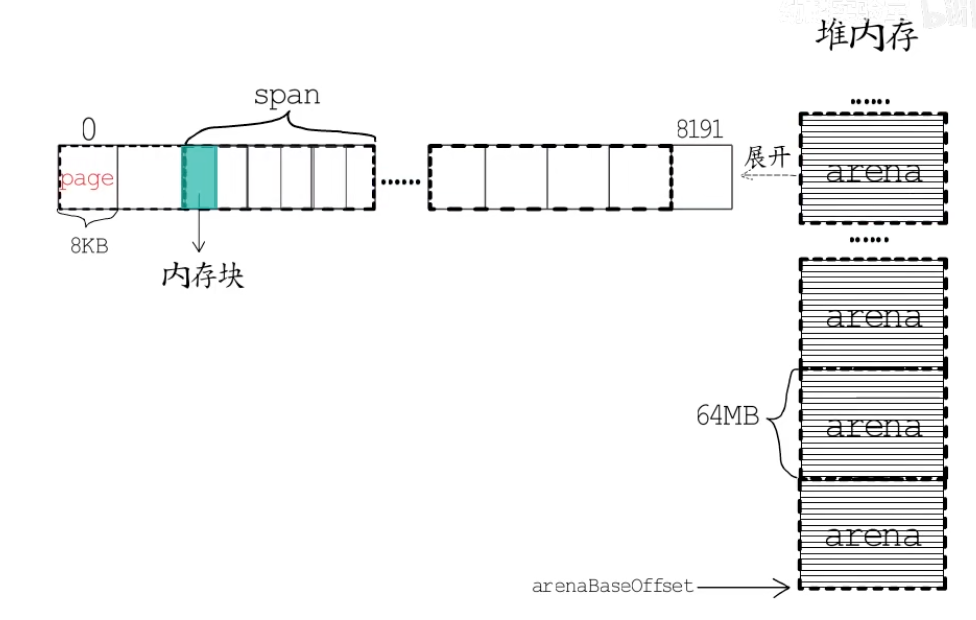

arena -> span -> page -> 内存块

# 栈内存管理-动态栈

Go 语言中的 goroutine 栈管理采用了一种独特的动态策略，不同于传统线程固定大小的栈。以下是 Go 栈扩容和缩容的核心原理

## 栈增长

如果要分配<32KB 的栈空间

p.mcache 本地栈缓存，2KB/4KB/8KB/16KB

栈分配或者扩容的时候，如果本地栈缓存有可用的，则直接从本地分配，没有则从全局栈缓存中获取一部分写入本地栈缓存在分配，如果全局栈缓存中 stackpoll 也没有就从 堆中分配一定大小的内存块，分配到全局 stackpool 中，在分配到本地栈缓存中

如果要分配 ≥32KB 的栈空间，则计算需要的 page 数量，以 2 为底求对数 获取 stacklarge 中的索引，找到对应的 mspan 空闲链表，若链表不为空，就哪一个过来用，如果链表为空，则直接从堆内存分配一块对应大小的内存页来使用

go 协程栈大小初始为 2KB，运行时肯定会出现栈空间不够用的情况，所以要实现一种栈增长的机制

go 语言中，通过在编译阶段注入栈增长检查代码，在 runtime 运行过程中检查栈是否够用，如果不够用，就调用 runtime.morestack_noctxt() 来扩容，栈空间是成倍增加的，即原来大小 x 2

并将协程置为 \_Gcopystack 状态，让出 cpu, 当扩容完后将状态改成 \_Grunable 放入 runq 重新调度

## 栈收缩

1. **触发条件** ：

- 垃圾回收(GC)时检测到栈空间利用率过低
- 当前栈使用量不足当前大小的 1/4 时

1. **缩容机制** ：

- 同样采用连续栈策略
- 新栈大小通常是原栈的 1/2
- 复制活动数据到新栈
- 修正指针引用

## 栈释放

当协程执行结束后，栈的回收策略，也是根据栈大小来看的

<32KB 的，先放回本地栈缓存，如果本地缓存满了，就把一部分放回全局 stackpool 中，如果本地缓存不可用，直接放回 stackpool，如果这个 stackpool 中的 stackList 已经被释放了，那就归还会堆内存

≥32KB 的，如果当前处于 gc 阶段，直接放回堆内存，否则放回 stacklarge 中

# go 性能优化手段

### **1. Ballast 技术**：**用“假装有很多内存”来拖住 GC**

**Ballast 技术的思路很简单：提前搞一大块不回收的内存，让堆看起来很“肥”，这样 GC 就不容易被触发了。**

**这是因为 Go 的 GC 机制并不是看“用得多不多”，而是看“增长得快不快”。堆涨得快，就会触发回收；但如果堆本来就很大，GC 就会觉得：“嗯……还能忍会儿”。**

```go
// 分配 512MB 的 ballast 内存
var ballast = make([]byte, 512<<20)

func init() {
    for i := range ballast {
        ballast[i] = 1 // 强制触发实际内存分配
    }
}
```

**✅** **优点** **：**

- **实现简单粗暴**
- **能显著延迟 GC，提升吞吐率**

**❌** **缺点** **：**

- **实际占用很多内存，可能被操作系统真的分配出来**
- **容器环境下容易触发 OOM**
- **不太适合内存吃紧的场景**

**📌** ** 适用场景** **：跑在物理机、内存充足、对吞吐要求高的服务；不推荐在 K8s、Docker 这种资源受限的地方使用**

**Sonic** ：**摆脱反射的高性能 JSON 解析器**

**Go 标准库里的**encoding/json **很好用，但也很慢。为什么慢？反射是罪魁祸首。**

**每次调用**json.Unmarsha**l**，底层都要用**reflect**动态判断字段类型、设置值，这种方式虽然通用，但：

- **不能做编译时优化**
- **每次都要做类型断言，代价不小**
- **内存分配多，GC 压力也大**

**为了解决这些问题，字节跳动开源了一个 JSON 库 —— Sonic。**

**起初用了 JIT，后来转向解释器**

**Sonic 早期是 JIT（即时编译）模式，运行时为结构体生成机器码，性能极强。但 JIT 的问题也不少：**

更高效的算法和数据结构 ：_从根源减少“废指令”_

- **用 map[string]bool 查重，秒杀 O(n) 的 slice 扫描**
- **排序用堆/跳表/AVL 树，比链表和数组快得多**
- **字符串拼接用**
  **strings.Builder 或 bytes.Buffer，省内存还少拷贝**
- **避免在循环里频繁分配临时对象，GC 会感谢你**

**写一个函数，频繁被高并发调用，但内部用了 reflect.Value**、或者每次都分配新对象——这种就是典型的“反模式”。换成内联 + 池化对象，性能能翻几倍不止

[深入浅出 Go 性能优化：从原理到实践](https://mp.weixin.qq.com/s/BSWtifFJTIvaW4HNe603uw)

# 参考与延伸阅读

1. [[长文]从《100 Go Mistakes》我总结了什么？](https://www.luozhiyun.com/archives/797)
