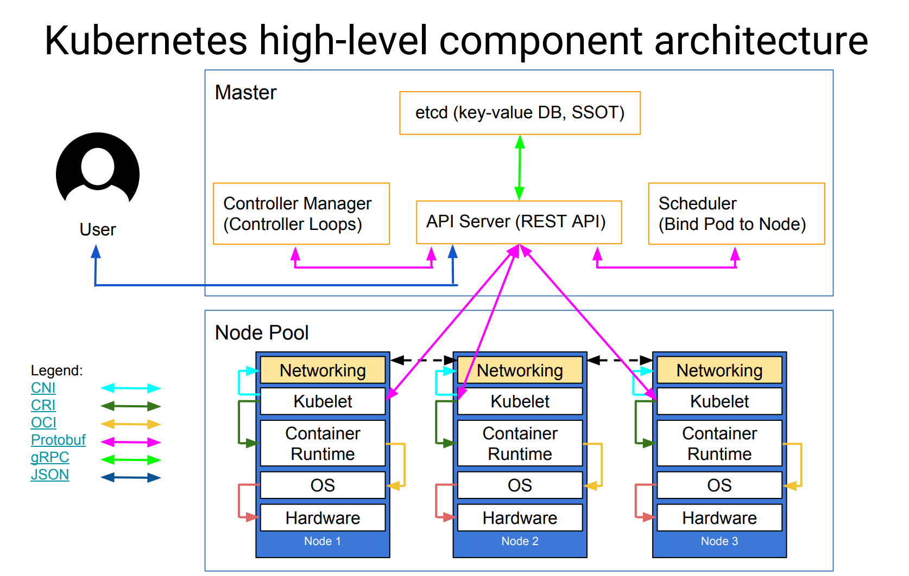

k8s 源码阅读以及其他相关内容的存档记录

# K8s 组件架构

控制面

- kube-apiserver
- etcd
- kube-scheduler
- kube-controller-manager

节点

- kubelete
- kube-proxy
- container runtime

插件

- dns
- dashboard
- container resource monitoring
- cluster-level-logging

# 相关术语

| Term              | Definition                                                                                                           |
| ----------------- | -------------------------------------------------------------------------------------------------------------------- |
| CSI               | Container Storage Interface.                                                                                         |
| CNI               | Container Network Interface.                                                                                         |
| CRI               | Container Runtime Interface.                                                                                         |
| PV                | Persistent Volume.                                                                                                   |
| PVC               | Persistent Volume Claim.                                                                                             |
| StorageClass      | Defined by provisioner(i.e. Storage Provider), to assemble Volume parameters as a resource object.                   |
| Volume            | A unit of storage that will be made available inside of a CO-managed container, via the CSI.                         |
| Block Volume      | A volume that will appear as a block device inside the container.                                                    |
| Mounted Volume    | A volume that will be mounted using the specified file system and appear as a directory inside the container.        |
| CO                | Container Orchestration system, communicates with Plugins using CSI service RPCs.                                    |
| SP                | Storage Provider, the vendor of a CSI plugin implementation.                                                         |
| RPC               | [Remote Procedure Call](https://en.wikipedia.org/wiki/Remote_procedure_call "Remote Procedure Call").                |
| Node              | A host where the user workload will be running, uniquely identifiable from the perspective of a Plugin by a node ID. |
| Plugin            | Aka “plugin implementation”, a gRPC endpoint that implements the CSI Services.                                       |
| Plugin Supervisor | Process that governs the lifecycle of a Plugin, MAY be the CO.                                                       |
| Workload          | The atomic unit of "work" scheduled by a CO. This MAY be a container or a collection of containers.                  |

# 参考与延伸阅读

1. 田飞雨-阅读：[https://blog.tianfeiyu.com/source-code-reading-notes/](https://blog.tianfeiyu.com/source-code-reading-notes/)
2. [Kubernetes&#39; Architecture Fundamentals](https://speakerdeck.com/luxas/kubernetes-architecture-fundamentals?slide=10)
