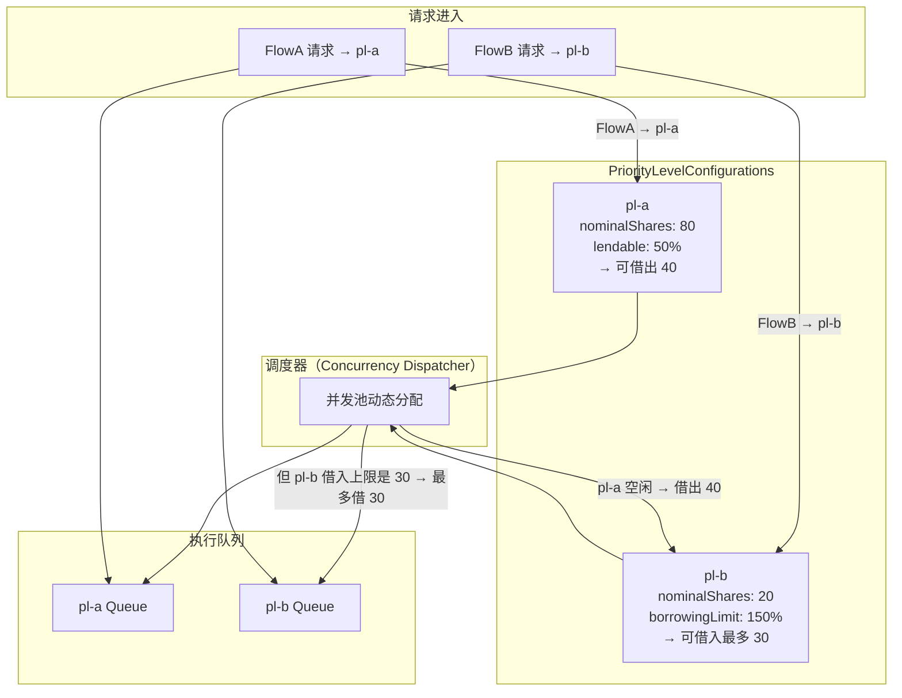
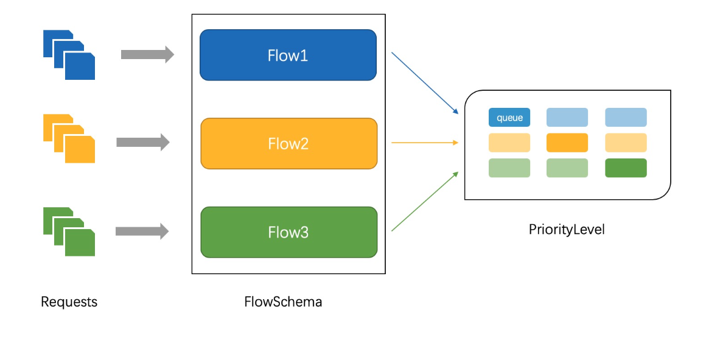

# 1. 背景

apiserver 是 kubernetes 中最重要的组件，一旦遇到恶意刷接口或请求量超过承载范围，apiserver 服务可能会崩溃，导致整个 kubernetes 集群不可用。所以我们需要对 apiserver 做限流处理来提升 kubernetes 的健壮性。

APF 是 `API Priority And Fairness`【API 优先级和公平性】 的缩写。API 优先级和公平性允许集群管理员将控制平面的并发性划分为不同的加权优先级，到达 kube-apiserver 的每个请求将被归类到一个优先级，并获得其在控制平面的吞吐量中的公平份额.

# 2. 发展历程

apiserver 限流能力的发展分为两个阶段：

1. kubernetes 1.18 版本之前 kube-apiserver 只是将请求分成了变更类型(create、update、delete、patch)和非变更类型(get、list、watch)，并通过启动参数设置了两种类型的最大并发数。

   ```javascript
   --max-requests-inflight　 　　　　    ## 限制同时运行的非变更类型请求的个数上限，0表示无限制。
   --max-mutating-requests-inflight　  ## 限制同时运行的变更类型请求的个数上限。0 表示无限制。
   ```

   此时的 apiserver 限流能力较弱，若某个客户端错误的向 kube-apiserver 发起大量的请求时，必然会阻塞 kube-apiserver，影响其他客户端的请求，因此高阶的限流 APF 就诞生了。

2. kubernetes1.18 版本之后 APF（ APIPriorityAndFairness ）成为 kubernetes 的默认限流方式。 APF 以更细粒度的方式对请求进行分类和隔离，根据优先级和公平性进行处理。

   ```javascript
   --enable-priority-and-fairness   ##  该值作为APF特性开关，默认为true
   --max-requests-inflight、--max-mutating-requests-inflight    ## 当开启APF时，俩值相加确定kube-apiserver的总并发上限
   ```

## 传统限流方法的局限性

- 粒度粗
  - 无法为不同用户，不同场景设置不同的限流
- 单队列
  - 共享限流窗口 / 桶，一个坏用户可能会将整个系统堵塞，其他正常用户的请求无法被及时处理
- 不公平
  - 正常用户的请求会被排到队尾，无法及时处理而饿死
- 无优先级
  - 重要的系统指令一并被限流，系统故障难以恢复

两个阶段限流能力对比

| 限流能力 | 1.18 版本前                | 1.18 版本后(APF)                               |
| -------- | -------------------------- | ---------------------------------------------- |
| 颗粒度   | 仅根据是否变更做分类       | 可以根据请求对象、请求者身份、命名空间等做分类 |
| 隔离性   | 一个坏用户可能堵塞整个系统 | 为请求分配固定队列，坏请求只能撑爆其使用的队列 |
| 公平性   | 会出现饿死                 | 用公平性算法从队列中取出请求                   |
| 优先级   | 无                         | 有特权级别，可让重要请求不被限制               |

# 3. APF 是如何解决问题的？

新的特性“API 优先级和公平性”是关于在每个 apiserver 中泛化现有的 max-in-flight 请求处理程序，以使行为更加智能和可配置。总体方法如下。

- 每个请求都由一个流模式（Flow Schema）匹配。流模式声明与之匹配的请求的优先级，并为这些请求分配一个“流标识符（flow identifier）”。流标识符是系统如何确定请求是否来自相同的源。
- 可以将优先级配置为以多种方式运行。每个优先级都有自己的独立并发池。优先级还引入了对不能立即得到服务的请求进行排队的概念。
- 为了防止任何一个用户或命名空间独占一个优先级级别，可以将它们配置为具有多个队列。“洗牌分片（Shuffle Sharding）”用于将每个请求流分配给队列的一个子集。
- 最后，当有处理请求的能力时，使用“公平排队（Fair Queuing）”算法来选择下一个请求。在每个优先级内，队列以公平性进行竞争。

## 关键资源介绍

APF 通过 FlowSchema 和 PriorityLevelConfiguration 两个资源配置限流策略。

### [FlowSchema](https://kubernetes.io/docs/reference/generated/kubernetes-api/v1.28/#flowschemaspec-v1beta3-flowcontrol-apiserver-k8s-io)

```yaml
apiVersion: flowcontrol.apiserver.k8s.io/v1beta3
kind: FlowSchema # 一个kubernetes集群中可以定义多个FlowSchema
metadata:
  name: myfl
spec:
  distinguisherMethod: # 可选值为：ByNamespace或ByUser，与 flowschema.name结合用于把请求分组。属于同组的请求会分配到固定的queue中，如果省略该参数，则该FlowSchema匹配的所有请求都将视为同一个分组。
    type: ByUser
  matchingPrecedence: 90 # 数字越小代表FlowSchema的匹配顺序越在前，取值范围：1~10000。
  priorityLevelConfiguration: # FlowSchema关联的priorityLevelConfiguration 队列优先级
    name: mypl
  rules:
    - nonResourceRules: # 匹配非资源型：匹配接口URL
        - nonResourceURLs:
            - "*"
      resourceRules: # 匹配资源型：匹配apigroup、namespace、resources、verbs
        - apiGroups:
            - "*"
          namespaces:
            - "*"
          resources:
            - "*"
          verbs:
            - get
            - create
            - list
            - update
      subjects: # 匹配请求者主体：可选Group、User、ServiceAccount
        - group:
            name: "*"
          kind: Group
        - kind: User
          user:
            name: "*"
        - kind: ServiceAccount
          serviceAccount:
            name: myserviceaccount
            namespace: demo
```

FlowSchema 解决老版本分类颗粒度粗的问题。根据 rules 字段匹配请求，匹配规则包含：请求对象、执行操作、请求者身份和命名空间。

匹配一些入站请求，并将它们分配给优先级。每个入站请求都会对所有 FlowSchema 测试是否匹配，首先从 matchingPrecedence 数值最低的匹配开始（我们认为这是逻辑上匹配度最高），然后依次进行，直到首个匹配出现。

```bash
k get flowschema                                   ⎈ local-context
Warning: flowcontrol.apiserver.k8s.io/v1beta3 FlowSchema is deprecated in v1.29+, unavailable in v1.32+
NAME                           PRIORITYLEVEL     MATCHINGPRECEDENCE   DISTINGUISHERMETHOD   AGE   MISSINGPL
exempt                         exempt            1                    <none>                24d   False
probes                         exempt            2                    <none>                24d   False
system-leader-election         leader-election   100                  ByUser                24d   False
endpoint-controller            workload-high     150                  ByUser                24d   False
workload-leader-election       leader-election   200                  ByUser                24d   False
system-node-high               node-high         400                  ByUser                24d   False
system-nodes                   system            500                  ByUser                24d   False
kube-controller-manager        workload-high     800                  ByNamespace           24d   False
kube-scheduler                 workload-high     800                  ByNamespace           24d   False
kube-system-service-accounts   workload-high     900                  ByNamespace           24d   False
service-accounts               workload-low      9000                 ByUser                24d   False
global-default                 global-default    9900                 ByUser                24d   False
catch-all                      catch-all         10000                ByUser                24d   False
```

### [PriorityLevelConfiguration](https://kubernetes.io/docs/reference/generated/kubernetes-api/v1.28/#limitedprioritylevelconfiguration-v1beta3-flowcontrol-apiserver-k8s-io)

**一个 FlowSchema 只能关联一个 priorityLevelConfiguration，多个 FlowSchema 可以关联同一个 priorityLevelConfiguration** \*_PriorityLevelConfiguration 并发上限 = （assuredConcurrencyShares / 所有 assuredConcurrencyShares 之和 ）_ apiserver 总并发数\*

```yaml
apiVersion: flowcontrol.apiserver.k8s.io/v1beta2
kind: PriorityLevelConfiguration ## 每个PriorityLevelConfiguration有自己独立的限流配置， PriorityLevelConfiguration之间是完全隔离的。
metadata:
  name: mypl
spec:
  type: Limited # 设置是否为特权级别，如果为Exempt则不进行限流，如果为Limited则进行限流
  limited:
    assuredConcurrencyShares: 2 # 值越大，PriorityLevelConfiguration的并发上限越高。若当前并发执行数未达到并发上限，则PL处于空闲状态。
    limitResponse: # 定义如何处理当前无法被处理的请求
      type: Queue # 类型，Queue或者Reject，Reject直接返回429并拒绝，Queue将请求加入队列
      queuing:
        handSize: 1 # 根据ByNamespace或ByUser对请求分组，每个分组对应queues的数量，
        queueLengthLimit: 20 # 此PriorityLevelConfiguration中每个队列的长度
        queues: 2 # 此PriorityLevelConfiguration中的队列数
```

v1beta2 会存在一个问题，apiserver 会按照比例将并发执行权分配给不同 PL，假设 apiserver 流量池子总额 100， mypl1 assuredConcurrencyShares=60，但是没有任何 flowschema 关联 mypl1，这样 mypl1 就占了 60%的份额在空转。

**所以在 v1beta3 中，引入了“借贷模型"**

```yaml
apiVersion: flowcontrol.apiserver.k8s.io/v1beta3
kind: PriorityLevelConfiguration
metadata:
  name: workload-high
spec:
  limited:
    lendablePercent: 50
    limitResponse:
      queuing:
        handSize: 6
        queueLengthLimit: 50
        queues: 128
      type: Queue
    nominalConcurrencyShares: 40
  type: Limited
```

#### 字段解析

`type: Limited`

- 表示此 PriorityLevelConfiguration 会进行限流
- 与 `Exempt` 相对，`Exempt` 表示不参与限流（直接通过）

`nominalConcurrencyShares: 40`

- 表示该 PL 占有的**并发配额份额**
- 所有 `Limited` 类型的 PL 会一起构成总份额池
- apiserver 会按照比例将并发执行权分配给不同 PL
- 举例：假设总份额为 100（累加），则该 PL 拥有 40% 的并发处理能力

`lendablePercent: 50`

- 允许该 PL 在空闲时，将最多 50% 的额度“借出”给 **其他高优先级** 且 **不够用** 的 PL
- 有助于资源利用率最大化（避免空转）
- ⚠️：作用于 **并发额度调度阶段（concurrency dispatch）** ，而不是队列调度（queue 仍然隔离）

`borrowingLimitPercent: 150`

- 最多允许接入的量，假设当前 `nominalConcurrencyShares`是 40，则最多的可接入量是 40\*1.5=60

`limitResponse.type: Queue`

- 超出并发限制时，选择将请求排队（不是直接拒绝）
- 对应的配置是在 `queuing` 字段里设置

`queues: 128`

- 为该 PL 设置 128 个独立的队列
- 每个请求会通过分片算法被分配到这些队列之一

`handSize: 6`

- 这是 Shuffle Sharding 的核心参数
- 表示：每个请求从 128 个队列中“抽 6 个随机候选队列”
- 然后 apiserver 会**选择这 6 个中负载最小的那一个**进行排队
- 目的是：即便不同请求同属于一个 PL，也不会在队列层面争抢资源，增加“隔离性”

`queueLengthLimit: 50`

- 每个队列最多只能有 50 个请求排队（不含正在处理的）
- 超过这个长度，**新请求将被拒绝并返回 HTTP 429**



# 4. APF 详解



不同的等级划分为不同的 Flow，当某个请求阻塞，不影响其他的 Flow。

- APF 的实现依赖两个非常重要的资源 FlowSchema, PriorityLevelConfiguration
- APF 对请求进行更细粒度的分类，每一个请求分类对应一个 FlowSchema（FS）
- FS 内的请求又会根据 `distinguisher` 进一步划分为不同的 Flow
- FS 会设置一个优先级（Priority Level，PL），不同优先级的并发资源是隔离的。所以不同优先级的资源不会被互相排挤。特定优先级的请求可以被高优处理。
- 一个 PL 可以对应多个 FS，PL 中维护了一个 QueueSet，用于缓存不能及时处理的请求，请求不会因为超出 PL 的并发限制而被丢弃。
- FS 中的每个 Flow 通过 [shuffle sharding](https://github.com/kubernetes/kubernetes/blob/release-1.28/staging/src/k8s.io/apiserver/pkg/util/shufflesharding/shufflesharding.go) 算法从 QueueSet 选取特定的 `queues` 缓存请求 (分片处理)
- 每次从 QueueSet 中取请求执行时，会先应用 `fair queuing` 算法从 QueueSet 中选中一个 queue，然后从这个 queue 中取出 `oldest` 请求执行。所以即使是同一个 PL 内的请求，也不会出现一个 Flow 内的请求一直占用资源的不公平现象。

## 优先级

- 如果未启用 APF，API 服务器中的整体并发量将受到 `kube-apiserver` 的参数 `--max-requests-inflight` 和 `--max-mutating-requests-inflight` 的限制
- 启用 APF 后，将对这些参数定义的并发限制进行求和，然后将总和分配到一组可配置的优先级中。每个传入的请求都会分配一个优先级；
- 每个优先级都有各自的配置，设定允许分发的并发请求数；
- 例如，默认配置包括针对领导者选举请求、内置控制器请求和 Pod 请求都单独设置优先级。这表示即使异常的 Pod 向 API 服务器发送大量请求，也无法阻止领导者选举或内置控制器的操作执行成功；

## 排队

- 即使在同一优先级内，也可能存在大量不同的流量源
- 在过载的情况下，防止一个请求流饿死其他流是非常有价值的（尤其是在一个较为常见的场景中，一个有故障的客户端会疯狂地向 `kube-apiserver` 发送请求，理想情况下，这个有故障的客户端不应对其他客户端产生太大的影响）
- 公平排队算法在处理具有相同优先级的请求时，实现了上述场景
- 每个请求都被分配到某个 流（`Flow`） 中，该流由对应的 `FlowSchema` 的名字加上一个 流区分项（`FlowDistinguisher`）来生成一个字符串流标识 (flow identifier)
- 这里的流区分项可以是发出请求的用户、目标资源的名称空间或什么都不是
- 系统尝试为不同流中具有相同优先级的请求赋予近似相等的权重
- 将请求划分到流中之后，API 功能将请求分配到队列中
- 分配时使用一种称为 混洗分片（[Shuffle-Sharding](https://github.com/kubernetes/kubernetes/blob/release-1.28/staging/src/k8s.io/apiserver/pkg/util/shufflesharding/shufflesharding.go)）的技术。该技术可以相对有效地利用队列隔离低强度流于高强度流
- 排队算法的细节可针对每个优先等级进行调整，并允许管理员在内存占用、公平性（当总流量超标时，各个独立的流将都会取得进展）、突发流量的容忍度以及排队引发的额外延迟之间进行权衡

## 豁免请求

某些特别重要的请求不受制于此特性施加的任何限制。

这些豁免可防止不当的流控配置完全禁用 API 服务器。

比如 `system:master `

```
 k get flowschema                                   ⎈ local-context
Warning: flowcontrol.apiserver.k8s.io/v1beta3 FlowSchema is deprecated in v1.29+, unavailable in v1.32+
NAME                           PRIORITYLEVEL     MATCHINGPRECEDENCE   DISTINGUISHERMETHOD   AGE   MISSINGPL
exempt                         exempt            1                    <none>                25d   False
probes                         exempt            2                    <none>                25d   False
```

`Long-running` 运行的 API 请求（例如，在 pod 中查看日志或执行命令）不受 APF 限制，`WATCH` 请求也不受限制

> #### [Caution:](https://kubernetes.io/docs/concepts/cluster-administration/flow-control/)
>
> Some requests classified as "long-running"—such as remote command execution or log tailing—are not subject to the API Priority and Fairness filter. This is also true for the `--max-requests-inflight` flag without the API Priority and Fairness feature enabled. API Priority and Fairness _does_ apply to **watch** requests. When API Priority and Fairness is disabled, **watch** requests are not subject to the `--max-requests-inflight` limit.

## 系统内置策略

- `system`
  - 用于 `system:nodes` 组（即 `kubelets` ）的请求；`kuberlets` 必须能连上 API 服务器，以便工作负载能够调度到其上
- `leader-election`
  - 用于内置控制器的领导选举的请求（特别是来自 `kube-system` 名称空间中 `system:kube-controller-manager` 和 `system:kube-scheduler` 用户和服务账号，针对 `endpoints`、`configmaps` 或 `leases` 的请求）。
  - 将这些请求与其他流量相隔离非常重要，因为领导者选举失败会导致控制器发生故障并重新启动，这反过来会导致新启动的控制器在同步信息时，流量开销更大
- `workload-high`
  - 优先级用于内置控制器的请求
- `workload-low`
  - 优先级适用于来自任何服务账号的请求，通常包括来自 Pods 中运行的控制器的所有请求
- `global-default`
  - 优先级可处理所有其他流量，例如：非特权用户运行的交互式 `kubectl` 命令
- `exempt`
  - 优先级的请求完全不受流控限制：它们总是立刻被分发。特殊的 `exempt FlowSchema` 把 `system:masters` 组的所有请求都归入该优先级组
- `catch-all`
  - 优先级与特殊的 `catch-all FlowSchema` 结合使用，以确保每个请求都分类
  - 一般不应依赖于 `catch-all` 的配置，而应适当地创建自己的 `catch-all FlowSchema` 和 `PriorityLevelConfigurations`（或使用默认安装的 `global-default` 配置）
  - 为了帮助捕获部分请求未分类的配置错误，强制要求 `catch-all` 优先级仅允许 5 个并发份额，并且不对请求进行排队，使得仅与 `catch-all FlowSchema` 匹配的流量被拒绝的可能性更高，并显示 `HTTP 429` 错误。

# 5. 案例


1. 请求与集群中的 FlowSchema 列表按照顺序依次匹配，每个 FlowSchema 的 matchingPrecedence 字段决定其在列表中的顺序，matchingPrecedence 字段值越小，越靠前，越先进行匹配请求。
2. 根据 FlowSchema 资源中的 rules 规则进行匹配，匹配方式可以是 “请求的资源类型”、“请求的动作类型”、“请求者的身份”、“请求的命名空间” 等多个维度。
3. 若请求与某个 FlowSchema 成功匹配，匹配就会结束。FlowSchema 关联着一个 PriorityLevelConfiguration，每个 PriorityLevelConfiguration 中包含许多 queue，根据 FlowSchema.spec.Distinguisher 字段将请求进行"分组"，根据分组来分配 queue，分配 queue 数量由 PriorityLevelConfiguration 资源的 handSize 字段决定，如果省略该参数，则该 FlowSchema 匹配的所有请求都将视为同一个"分组"。
4. 每个 PriorityLevelConfiguration 资源都有独立的并发上限，assuredConcurrencyShares 字段为 apiserver 总并发数的权重占比，值越大分配的并发上限就越高，当 PriorityLevelConfiguration 达到并发上限后，请求会根据所属的"分组"写入固定的 queue 中，请求被阻塞等待。请求与 queue 的固定关联可以让恶意用户只影响其使用的 queue，而不会影响同 PriorityLevelConfiguration 中的其他 queue。
5. 当 PriorityLevelConfiguration 未达到并发上限时，fair queuing 算法从所有 queue 中选择一个合适的 queue 取出请求，解除请求的阻塞，执行这个请求。fair queuing 算法能保证同一个 PriorityLevelConfiguration 中的所有 queue 被处理机会平等。

根据上面的分组规则，图例中，有如下情况

```plaintext
use1 : list pod in ns1， list svc in ns1;
use2 : delete pod in ns2，list svc in ns2;


flow1: distinguisherMethod ByNamespace，rules: 监听 pod 的所有操作

flow2: distinguisherMethod ByUser, rules: 监听 service 的 list 操作

pl: 队列总是 4，shuffle sharding = 2
```

根据洗牌分片源码

```go

// https://github.com/kubernetes/kubernetes/blob/release-1.28/staging/src/k8s.io/apiserver/pkg/util/shufflesharding/shufflesharding.go
func (d *Dealer) Deal(hashValue uint64, pick func(int)) {
    var remainders [15]int

    // 生成余数
    for i := 0; i < d.handSize; i++ {
        hashValueNext := hashValue / uint64(d.deckSize-i)
        remainders[i] = int(hashValue - uint64(d.deckSize-i)*hashValueNext)
        hashValue = hashValueNext
    }

    // 调整重复
    for i := 0; i < d.handSize; i++ {
        card := remainders[i]
        for j := i; j > 0; j-- {
            if card >= remainders[j-1] {
                card++
            }
        }
        pick(card)
    }
}

```

四个请求最终的划分如下，假设分组 hashValue 如下

**哈希算法生成 **hashValue**，我们为每个分组指定一个示例值：**

- **Hash(flow1:ns1) = 10**
- **Hash(flow2:use1) = 15**
- **Hash(flow1:ns2) = 6**
- **Hash(flow2:use2) = 20**

## 洗牌过程

**1. **flow1:ns1** (**hashValue = 10**)**

- **生成余数**：
  - **i=0**：**10 / 4 = 2**，**10 - 4\*2 = 2**，**remainders[0] = 2**，**hashValue = 2**
  - **i=1**：**2 / 3 = 0**，**2 - 3\*0 = 2**，**remainders[1] = 2**
  - **remainders = [2, 2]**
- **调整重复**：
  - **i=0**：**card = 2**，无前值，**pick(2)**
  - **i=1**：**card = 2**，**2 >= 2**，**card++** → **3**，**pick(3)**
- **结果**：队列 **[2, 3]**

**2. **flow2:use1** (**hashValue = 15**)**

- **生成余数**：
  - **i=0**：**15 / 4 = 3**，**15 - 4\*3 = 3**，**remainders[0] = 3**，**hashValue = 3**
  - **i=1**：**3 / 3 = 1**，**3 - 3\*1 = 0**，**remainders[1] = 0**
  - **remainders = [3, 0]**
- **调整重复**：
  - **i=0**：**card = 3**，**pick(3)**
  - **i=1**：**card = 0**，**0 < 3**，**pick(0)**
- **结果**：队列 **[3, 0]**

**3. **flow1:ns2** (**hashValue = 6**)**

- **生成余数**：
  - **i=0**：**6 / 4 = 1**，**6 - 4\*1 = 2**，**remainders[0] = 2**，**hashValue = 1**
  - **i=1**：**1 / 3 = 0**，**1 - 3\*0 = 1**，**remainders[1] = 1**
  - **remainders = [2, 1]**
- **调整重复**：
  - **i=0**：**card = 2**，**pick(2)**
  - **i=1**：**card = 1**，**1 < 2**，**pick(1)**
- **结果**：队列 **[2, 1]**

**4. **flow2:use2** (**hashValue = 20**)**

- **生成余数**：
  - **i=0**：**20 / 4 = 5**，**20 - 4\*5 = 0**，**remainders[0] = 0**，**hashValue = 5**
  - **i=1**：**5 / 3 = 1**，**5 - 3\*1 = 2**，**remainders[1] = 2**
  - **remainders = [0, 2]**
- **调整重复**：
  - **i=0**：**card = 0**，**pick(0)**
  - **i=1**：**card = 2**，**2 > 0**，无调整，**pick(2)**
- **结果**：队列 **[0, 2]**

最终分片结果如下

| **请求编号** | **请求内容**               | **分组键**     | **hashValue<br />(hash(key)))** | **初始余数** | **调整后队列** | **可能分配队列** |
| ------------ | -------------------------- | -------------- | ------------------------------- | ------------ | -------------- | ---------------- |
| **1**        | **use1 list pod in ns1**   | **flow1:ns1**  | **10**                          | **[2, 2]**   | **[2, 3]**     | **2 或 3**       |
| **2**        | **use1 list svc in ns1**   | **flow2:use1** | **15**                          | **[3, 0]**   | **[3, 0]**     | **3 或 0**       |
| **3**        | **use2 delete pod in ns2** | **flow1:ns2**  | **6**                           | **[2, 1]**   | **[2, 1]**     | **2 或 1**       |
| **4**        | **use2 list svc in ns2**   | **flow2:use2** | **20**                          | **[0, 2]**   | **[0, 2]**     | **0 或 2**       |

## 请求限流规则

> 当请求在超过并发上线时，如 apiserver 总并发池 10，pl-a 可分配额度是 5，此时进来 20 个请求，其中 10 个被匹配到 pl-a 中，那么其中 5 个会立即请求，剩下 5 个分组分片入队，待有请求完成后，就按公平算法从队列中取出消费。

1. **分组键哈希**：每个请求根据其分组键（**flow1:ns1** 等）计算 **hashValue**。
2. **余数生成**：通过 **hashValue** 除以逐步缩小的范围（**deckSize-i**），生成 **handSize** 个余数。
3. **去重调整**：若余数重复，自增至不重复，确保分配到 **handSize=2** 个唯一队列。
4. **队列选择**：每个请求从其分组的 2 个队列中选择一个**负载最小的(即队列长度最小的)入队**

# 6. 参考与延伸阅读

1. 水电费
2. [API Priority and Fairness](https://kubernetes.io/docs/concepts/cluster-administration/flow-control/)
3. [Kubernetes 引入 API 优先级和公平性的 Alpha 支持](https://cloud.tencent.com/developer/article/1613890)
4. [kubernetes APF 分析](https://alexstocks.github.io/html/k8s-apf.html)
5. [kube-apiserver 限流机制原理](https://bbs.huaweicloud.com/blogs/425043)
6. [Kubernetes APIServer 崩溃引出的流量控制使用](https://cloud.tencent.com/developer/article/2314655?policyId=1003)
7. [Kubernetes: API Priority and Fairness](https://speakerdeck.com/ladicle/kubernetes-api-priority-and-fairness?slide=6)
8. [AWS-Kubernetes 控制平面-APF](https://docs.aws.amazon.com/zh_cn/eks/latest/best-practices/scale-control-plane.html#_api_priority_and_fairness)
9. [【深度】阿里巴巴万级规模 K8s 集群全局高可用体系之美](https://developer.aliyun.com/article/784105)
