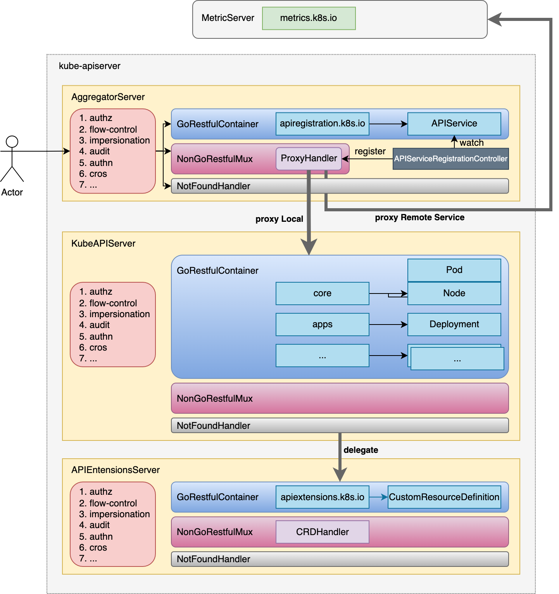

# 1. 背景

## 为什么需要 aggregator service?

有特殊需求的场景很多，举一个更具体的例子： 假设我们想加一个类似于 /api/v1/pods/namespaces/{ns}/{pod}/hotspots 的 API， 用于查询指定 pod 的某些热点指标（用户自己采集和维护）。针对这个需求有两种常见的解决思路：

1. 直接改 k8s 代码，增加用户需要的 API 和一些处理逻辑；
2. 为 k8s 引入某种通用的扩展机制，能让用户在不修改 k8s 代码的情况下， 也能实现新增 API 的功能

随着 Kubernetes 的使用场景越来越多样化，用户需要扩展 API 来支持自定义功能（如机器学习、数据库管理等）。如果所有扩展都直接集成到核心 API Server 中，会导致代码复杂度增加，维护成本上升。

`aggregatorServer` 通过支持 **Aggregated APIServer ** （AA），允许用户部署独立的 APIServer 来扩展 Kubernetes API。

这些独立的 APIServer 可以专注于特定领域，而无需修改核心代码。

这种设计就符合设计原则中的“开闭原则(Open Closed Principle)"，对扩展开放、对修改关闭！！！

将外部服务（如 Metrics Server、Service Mesh 控制面）的 API **透明聚合**到 kube-apiserver 的 URL 路径下

1. 增加了 api 的扩展性，这样 k8s 的开发人员就可以编写自己的 API 服务器来公开他们想要的 API。集群管理员应该能够使用这些服务，而不需要对核心库存储库进行任何更改。
2. 丰富了 APIs，核心 kubernetes 团队阻止了很多新的 API 提案。通过允许开发人员将他们的 API 作为单独的服务器公开，并使集群管理员能够在不对核心库存储库进行任何更改的情况下使用它们，这样就无须社区繁杂的审查了
3. 开发分阶段实验性 API 的地方，新的 API 可以在单独的聚集服务器中开发，当它稳定之后，那么把它们封装起来安装到其他集群就很容易了。
4. 确保新 API 遵循 kubernetes 约定：如果没有这里提出的机制，社区成员可能会被迫推出自己的东西，这可能会或可能不遵循 kubernetes 约定

## 概述

# 2. 实现

# 参考与延伸阅读

1. [搞懂 K8s apiserver aggregation](https://www.zeng.dev/post/2023-k8s-apiserver-aggregation-internals/)
2. [K8s 的核心是 API 而非容器（二）：从开源项目看 k8s 的几种 API 扩展机制（2023）](https://arthurchiao.art/blog/k8s-is-about-apis-2-zh/)
