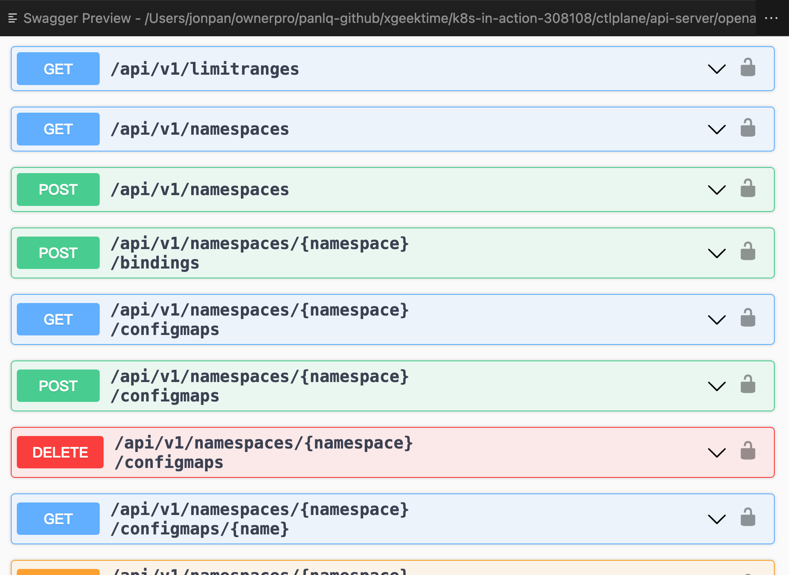
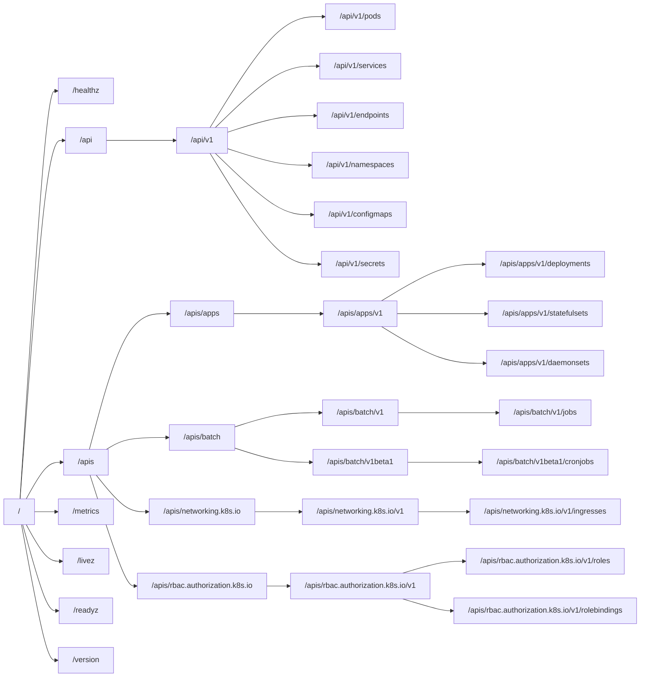
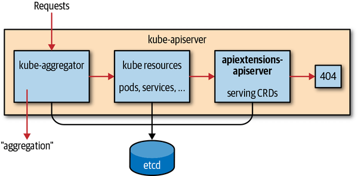
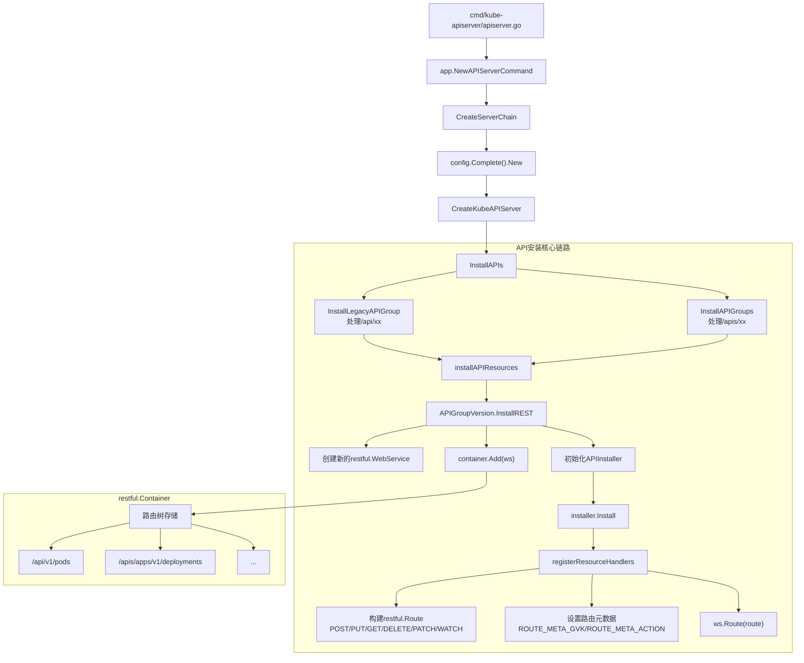
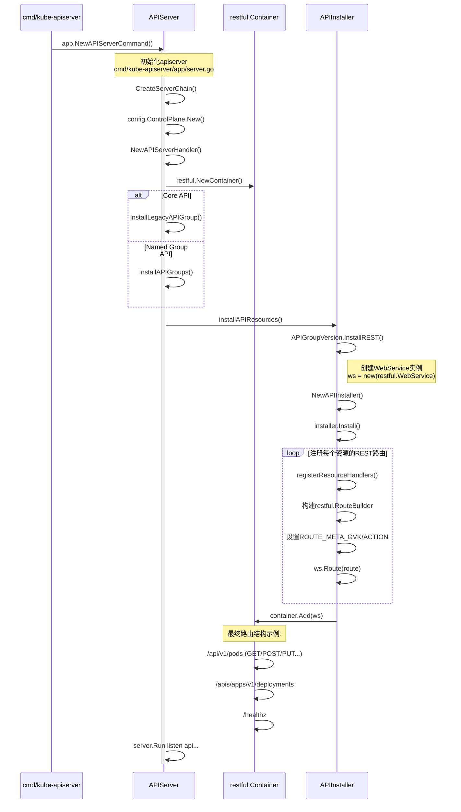
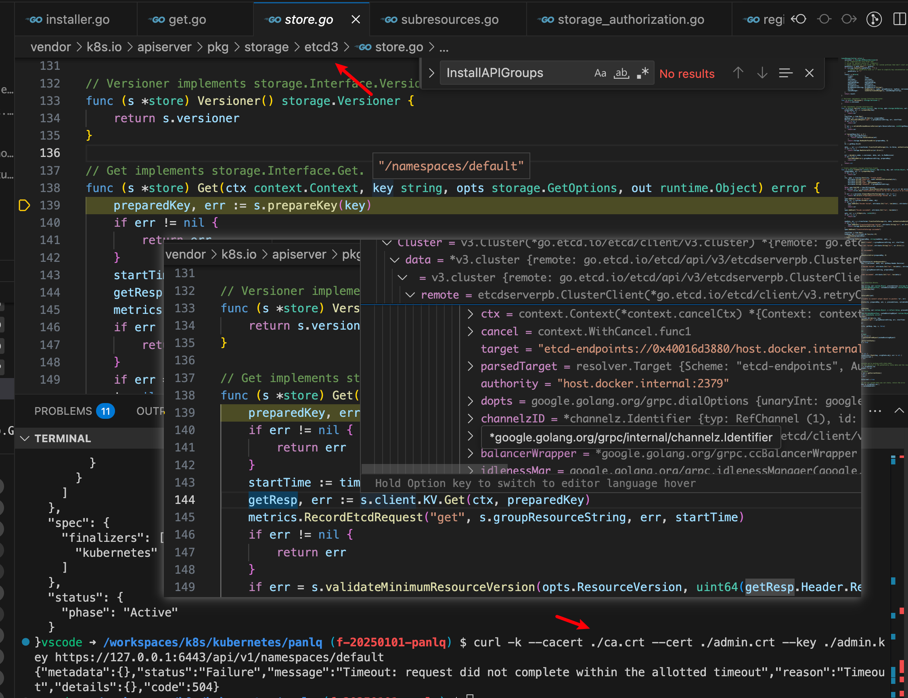

# 概述

本文关注的是本地启动 apiserver 的链路和配置，然后发送一个请求->响应的源码解析，关于认证，鉴权，准入控制，限流请移步》

# 1. 环境准备

> k8s 版本：kubernetes 1.28 release-1.28

## 1.1 run a local-etcd-cluster

api-server 需要 etcd 后端服务

```bash
# 1. install etcd

go get go.etcd.io/etcd/client/v3

# 2. install goreman
go install github.com/mattn/goreman@latest

# 3. clone etcd
git clone https://github.com/etcd-io/etcd.git

# 4. run etch
 goreman -f Procfile start

# 注意Procfile 中 etcd 可执行文件的路径
```

## 1.2 证书文件

### 生成服务端证书

在 Kubernetes 1.28 中，需要通过 HTTPS 启动 API Server，并配置相应的认证和授权机制。以下是具体步骤

API Server 需要以下服务端证书文件：

- CA 证书 （ca.crt）：用于签发其他证书。
- 服务器证书 （server.crt）：API Server 的公钥证书。
- 服务器私钥 （server.key）：API Server 的私钥。

可以使用 OpenSSL 或其他工具生成这些证书。以下是一个简单的示例命令：

```bash
# 生成 CA 私钥
openssl genrsa -out ca.key 2048

# 生成 CA 证书
openssl req -x509 -new -nodes -key ca.key -subj "/CN=KUBERNETES-CA" -days 365 -out ca.crt

# 生成服务器私钥
openssl genrsa -out server.key 2048

# 生成服务器证书签名请求 (CSR)
openssl req -new -key server.key -subj "/CN=apiserver" -out server.csr

# 使用 CA 签发服务器证书
openssl x509 -req -in server.csr -CA ca.crt -CAkey ca.key -CAcreateserial -out server.crt -days 365
```

用以上方式生成后，启动后会报错

```bash
curl --cacert ./ca.crt https://127.0.0.1:6443/api/v1/namespaces
curl: (60) SSL: certificate subject name 'apiserver' does not match target host name '127.0.0.1'
More details here: https://curl.se/docs/sslcerts.html

curl failed to verify the legitimacy of the server and therefore could not
establish a secure connection to it. To learn more about this situation and
how to fix it, please visit the web page mentioned above.
```

需要在本地 `etc/hosts` 配置对应的 dns 解析主机名 `127.0.0.1   apiserver ` 或使用 `-k` 参数跳过 tls 校验

> curl -k --cacert ./ca.crt https://127.0.0.1:6443/api/v1/namespaces

或者重新生成包含 `127.0.0.1` 的 IP SANs （IP 地址作为 Subject Alternative Name）

步骤 1：创建 OpenSSL 配置文件

创建一个配置文件（如 `openssl.cnf`），用于指定证书的 SANs 字段：

```bash
[req]
distinguished_name = req_distinguished_name
req_extensions = v3_req
prompt = no

[req_distinguished_name]
CN = apiserver

[v3_req]
subjectAltName = @alt_names

[alt_names]
DNS.1 = apiserver
IP.1 = 127.0.0.1

```

- `CN = apiserver`：表示服务器的通用名称。
- `IP.1 = 127.0.0.1`：将 `127.0.0.1` 添加为证书的有效 IP 地址。

使用上述配置文件生成新的私钥和 CSR

```bash
openssl genrsa -out server.key 2048
openssl req -new -key server.key -out server.csr -config openssl.cnf
```

使用 CA 签发新的服务器证书：

```bash
openssl x509 -req -in server.csr -CA ca.crt -CAkey ca.key -CAcreateserial -out server.crt -days 365 -extensions v3_req -extfile openssl.cnf
```

### 生成 admin 用户的私钥和证书

```bash
# 生成 admin 用户的私钥
openssl genrsa -out admin.key 2048

# 生成 CSR
openssl req -new -key admin.key -out admin.csr -subj "/CN=admin/O=system:masters"
```

- `CN=admin`：表示用户名为 `admin`。
- `O=system:masters`：表示该用户属于 `system:masters` 组。`system:masters` 是 Kubernetes 的内置组，拥有最高权限。

```bash
# 使用 CA 证书签署 CSR，生成 admin.crt
openssl x509 -req -in admin.csr -CA ca.crt -CAkey ca.key -CAcreateserial -out admin.crt -days 365
```

### 配置 admin 对应的 kube-config

```bash
apiVersion: v1
clusters:
- cluster:
    server: https://127.0.0.1:6443
    insecure-skip-tls-verify: true
    # certificate-authority: /workspaces/k8s/kubernetes/panlq/ca.crt
  name: local-cluster
contexts:
- context:
    cluster: local-cluster
    user: admin
  name: local-context
current-context: local-context
users:
- name: admin
  user:
    client-certificate: /workspaces/k8s/kubernetes/panlq/admin.crt
    client-key: /workspaces/k8s/kubernetes/panlq/admin.key
```

如果没有生成支持 `127.0.0.1` ip 的证书，则 cluster 要加上 `insecure-skip-tls-verify: true` 配置跳过 tls 校验

### 生成 service account 签名密钥

Kubernetes 1.28 强制要求配置 Service Account 的签发者（issuer）和签名密钥文件。这些参数用于支持 Service Account Token 的动态生成和验证

需要生成一个私钥文件，并指定签发者的 URL。以下是具体步骤：

使用 OpenSSL 生成一个 RSA 私钥：

```bash
openssl genrsa -out sa.key 2048
```

## 1.3 启动 apiserver

```json
{
  // Use IntelliSense to learn about possible attributes.
  // Hover to view descriptions of existing attributes.
  // For more information, visit: https://go.microsoft.com/fwlink/?linkid=830387
  "version": "0.2.0",
  "configurations": [
    {
      "name": "kube api-server",
      "type": "go",
      "request": "launch",
      "mode": "auto",
      "program": "${workspaceFolder}/cmd/kube-apiserver",
      "args": [
        "--etcd-servers=http://host.docker.internal:2379",
        "--secure-port=6443",
        "--service-cluster-ip-range=10.96.0.0/12",
        "--tls-cert-file=/workspaces/k8s/kubernetes/panlq/server.crt",
        "--tls-private-key-file=/workspaces/k8s/kubernetes/panlq/server.key",
        "--client-ca-file=/workspaces/k8s/kubernetes/panlq/ca.crt",
        "--authorization-mode=RBAC",
        "--anonymous-auth=true",
        "--service-account-key-file=/workspaces/k8s/kubernetes/panlq/sa.key",
        "--service-account-signing-key-file=/workspaces/k8s/kubernetes/panlq/sa.key",
        "--service-account-issuer=https://kubernetes.default.svc.cluster.local",
        "--allow-privileged=true"
      ]
    }
  ]
}
```

### 启动参数及其解释：

---

| 参数名称                                                                     | 作用                                         | 说明                                                                                 |
| ---------------------------------------------------------------------------- | -------------------------------------------- | ------------------------------------------------------------------------------------ |
| `--etcd-servers=http://host.docker.internal:2379`                            | 指定 etcd 集群的地址                         | API Server 使用 etcd 存储集群数据。这里指定了单个 etcd 实例的地址。                  |
| `--secure-port=6443`                                                         | 指定 API Server 监听的安全端口               | 默认通过 HTTPS 提供服务，安全端口通常为 `6443`，客户端通过该端口与 API Server 通信。 |
| `--service-cluster-ip-range=10.96.0.0/12`                                    | 指定 Service 的 Cluster IP 范围              | Kubernetes 使用虚拟 IP 地址为 Service 提供网络访问，IP 地址从该范围内分配。          |
| `--tls-cert-file=/workspaces/k8s/kubernetes/panlq/server.crt`                | 指定 API Server 的服务器证书文件             | 用于标识 API Server 的身份，并加密客户端与 API Server 之间的通信。                   |
| `--tls-private-key-file=/workspaces/k8s/kubernetes/panlq/server.key`         | 指定 API Server 的私钥文件                   | 私钥与证书配对使用，用于解密客户端发送的加密数据。                                   |
| `--client-ca-file=/workspaces/k8s/kubernetes/panlq/ca.crt`                   | 指定用于验证客户端证书的 CA 文件             | API Server 使用该 CA 文件验证客户端证书的有效性。                                    |
| `--authorization-mode=RBAC`                                                  | 指定授权模式                                 | 使用基于角色的访问控制（RBAC）机制，允许管理员定义细粒度的权限。                     |
| `--anonymous-auth=true`                                                      | 启用匿名认证                                 | 未认证的用户会被识别为 `system:anonymous`用户，需显式配置其权限。                    |
| `--service-account-key-file=/workspaces/k8s/kubernetes/panlq/sa.key`         | 指定用于验证 ServiceAccount Token 的公钥文件 | 用于验证 ServiceAccount Token 的有效性。                                             |
| `--service-account-signing-key-file=/workspaces/k8s/kubernetes/panlq/sa.key` | 指定用于签署 ServiceAccount Token 的私钥文件 | API Server 使用该私钥生成动态的 ServiceAccount Token。                               |
| `--service-account-issuer=https://kubernetes.default.svc.cluster.local`      | 指定 ServiceAccount Token 的签发者           | Token 中包含签发者的 URL，客户端可以使用该 URL 验证 Token 的来源。                   |
| `--allow-privileged=true`                                                    | 允许运行特权容器                             | 特权容器具有更高的权限，可以直接访问宿主机的设备和内核功能，生产环境中应谨慎使用。   |

启动后验证如下

```bash
export KUBECONFIG=./config

kubectl get ns
NAME              STATUS   AGE
default           Active   22d
kube-node-lease   Active   22d
kube-public       Active   22d
kube-system       Active   22d
```

使用 curl 访问 api server (带管理员证书)

```bash
curl -k --cacert ./ca.crt --cert ./admin.crt --key ./admin.key ht
tps://127.0.0.1:6443/api/v1/namespaces/default

{
  "kind": "Namespace",
  "apiVersion": "v1",
  "metadata": {
    "name": "default",
    "uid": "fca05ac7-3ac7-4b8d-8039-6a29fdda3214",
    "resourceVersion": "46",
    "creationTimestamp": "2025-03-16T06:21:54Z",
    "labels": {
      "kubernetes.io/metadata.name": "default"
    },
    "managedFields": [
      {
        "manager": "__debug_bin4214562624",
        "operation": "Update",
        "apiVersion": "v1",
        "time": "2025-03-16T06:21:54Z",
        "fieldsType": "FieldsV1",
        "fieldsV1": {
          "f:metadata": {
            "f:labels": {
              ".": {},
              "f:kubernetes.io/metadata.name": {}
            }
          }
        }
      }
    ]
  },
  "spec": {
    "finalizers": [
      "kubernetes"
    ]
  },
  "status": {
    "phase": "Active"
}
```

查看 etcd 中初始化的目录树，Kubernetes API Server 将数据存储在 `etcd` 的 `/registry` 目录下，每个资源类型都有对应的子目录。例如：

- `/registry/pods`：存储所有的 Pod 数据。
- `/registry/namespaces`：存储命名空间数据。
- `/registry/services`：存储 Service 数据

```bash
etcdctl --endpoints=http://127.0.0.1:2379 get --prefix / --keys-only
```

输出实例：

```bash
/registry/apiextensions.k8s.io/customresourcedefinitions
/registry/apiregistration.k8s.io/apiservices/v1.
/registry/namespaces/default
/registry/pods/default/my-pod
/registry/services/specs/default/kubernetes
```

# 2. 路由分析

## api 路由详解

通过以下命令可以导出 swagger api json, 在通过 swagger viewer 可以查看到 apiserver 的所有接口

> curl -k --cacert ./ca.crt --cert ./admin.crt --key ./admin.key https://127.0.0.1:6443/openapi/v2 > openapi.json



kuberAPIServer 提供三类 API Resource 接口：

- core group: 路径为 `/api/v1`
- named group: 路径为 `/apis/$GROUP/$VERSION`
- 系统状态的一些 API: 如 `/metrics` 、 `/version` 、 `/healthz`

工作负载相关的 API URL 大致以 如下格式组成

> /apis/{group}/{version}/namespaces/{namespace}/resource/{name} 组成

层级结构如下



#### 根路径 `"/"`

- `"/"` 是 Kubernetes API Server 的根路径。
- 常见的子路径包括：
  - `"/healthz"`：健康检查接口。
  - `"/api"`：核心 API（如 Pods、Services 等）。
  - `"/apis"`：扩展 API（如 Apps、Batch、Networking 等）。
  - `"/metrics"`：监控指标接口。
  - `"/version"`：返回 Kubernetes 集群的版本信息。

#### 核心 API (`"/api"`)

- `"/api/v1"` 是 Kubernetes 的核心 API 版本。
- 包含常见的资源类型：
  - `"/api/v1/pods"`：Pod 资源。
  - `"/api/v1/services"`：Service 资源。
  - `"/api/v1/namespaces"`：命名空间资源。
  - `"/api/v1/configmaps"`：ConfigMap 资源。
  - `"/api/v1/secrets"`：Secret 资源。

#### 扩展 API (`"/apis"`)

- `"/apis"` 下包含各种扩展 API 组。
- 常见的 API 组包括：
  - `"apps"`：应用相关的资源（如 Deployments、DaemonSets 等）。
  - `"batch"`：批处理任务相关的资源（如 Jobs、CronJobs）。
  - `"networking.k8s.io"`：网络相关的资源（如 Ingress）。
  - `"rbac.authorization.k8s.io"`：基于角色的访问控制（RBAC）相关资源。

# 3. 源码解读

## apiserver 启动路径

```plaintext
cmd/kube-apiserver/apiserver.go
└── app.NewAPIServerCommand()
    └── CreateServerChain()
        └── config.ControlPlane.New(xxx)
            └── InstallAPIs()
                ├── InstallLegacyAPIGroup()
                │   └── k8s.io/apiserver/pkg/server/installAPIResources()
                │       └── ApiGroupVersion.InstallREST()
                │           └── APIInstaller{} 实例化
                │               └── installer.Install()
                │                   └── registerResourceHandlers()
                └── InstallAPIGroups()
                    └── k8s.io/apiserver/pkg/server/installAPIResources()
                        └── ApiGroupVersion.InstallREST()
                            └── APIInstaller{} 实例化
                                └── installer.Install()
                                    └── registerResourceHandlers()
```

## 三种 APIServer



Fig. kube-apiserver internal flows when processing a request. Image source [Programming Kubernetes, O&#39;Reilly](https://www.oreilly.com/library/view/programming-kubernetes/9781492047094/ch04.html)

```go

// CreateServerChain creates the apiservers connected via delegation.
func CreateServerChain(config CompletedConfig) (*aggregatorapiserver.APIAggregator, error) {
	notFoundHandler := notfoundhandler.New(config.ControlPlane.GenericConfig.Serializer, genericapifilters.NoMuxAndDiscoveryIncompleteKey)
	apiExtensionsServer, err := config.ApiExtensions.New(genericapiserver.NewEmptyDelegateWithCustomHandler(notFoundHandler))
	if err != nil {
		return nil, err
	}
	crdAPIEnabled := config.ApiExtensions.GenericConfig.MergedResourceConfig.ResourceEnabled(apiextensionsv1.SchemeGroupVersion.WithResource("customresourcedefinitions"))

	kubeAPIServer, err := config.ControlPlane.New(apiExtensionsServer.GenericAPIServer)
	if err != nil {
		return nil, err
	}

	// aggregator comes last in the chain
	aggregatorServer, err := createAggregatorServer(config.Aggregator, kubeAPIServer.GenericAPIServer, apiExtensionsServer.Informers, crdAPIEnabled)
	if err != nil {
		// we don't need special handling for innerStopCh because the aggregator server doesn't create any go routines
		return nil, err
	}

	return aggregatorServer, nil
}
```

- apiExtensiionServer: 负责 CustomResourceDefinition (CRD) apiResources 以及 apiVersions 的注册。同时处理 CRD 以及响应的 CustomResource (CR) 的 CURD rest 请求。是 apiserver Delegation 的最后一环
- kuberAPIServer: 负责对请求的一些通用处理，包括：认证、鉴权以及各个内建资源(pod, deployment，service and etc)的 REST 服务
- aggregatorServer: 负责处理 `apiregistration.k8s.io` 组下的 APIService 资源请求，同时将来自用户的请求拦截转发给 aggregated server(AA)。将外部服务（如 Metrics Server、Service Mesh 控制面）的 API **透明聚合**到 kube-apiserver 的 URL 路径下。

## kubeAPIServer

KubeAPIServer 主要提供对内建 API Resources 的操作请求，为 Kubernetes 中各 API Resources 注册路由信息，同时暴露 RESTful API，使集群中以及集群外的服务都可以通过 RESTful API 操作 Kubernetes 中的资源

kubeAPIServer 最核心的功能是为 Kubernetes 内置资源添加路由，如下：

- 调用 `m.GenericAPIServ.erInstallLegacyAPIGroup` 将核心 API Resources 添加到路由中，在 apiserver 中即是以 `/api` 开头的 resource；
- 调用 `m.GenericAPIServ.erInstallAPIGroups` 将扩展的 API Resources 添加到路由中，在 apiserver 中即是以 `/apis` 开头的 resource；

```go
// InstallAPIs will install the APIs for the restStorageProviders if they are enabled.
func (m *Instance) InstallAPIs(apiResourceConfigSource serverstorage.APIResourceConfigSource, restOptionsGetter generic.RESTOptionsGetter, restStorageProviders ...RESTStorageProvider) error {
	nonLegacy := []*genericapiserver.APIGroupInfo{}

	// used later in the loop to filter the served resource by those that have expired.
	resourceExpirationEvaluator, err := genericapiserver.NewResourceExpirationEvaluator(*m.GenericAPIServer.Version)
	if err != nil {
		return err
	}

	for _, restStorageBuilder := range restStorageProviders {
		groupName := restStorageBuilder.GroupName()
		apiGroupInfo, err := restStorageBuilder.NewRESTStorage(apiResourceConfigSource, restOptionsGetter)
		if err != nil {
			return fmt.Errorf("problem initializing API group %q : %v", groupName, err)
		}

		// ..... 省略

		if len(groupName) == 0 {
			// the legacy group for core APIs is special that it is installed into /api via this special install method.
			if err := m.GenericAPIServer.InstallLegacyAPIGroup(genericapiserver.DefaultLegacyAPIPrefix, &apiGroupInfo); err != nil {
				return fmt.Errorf("error in registering legacy API: %w", err)
			}
		} else {
			// everything else goes to /apis
			nonLegacy = append(nonLegacy, &apiGroupInfo)
		}
	}

	if err := m.GenericAPIServer.InstallAPIGroups(nonLegacy...); err != nil {
		return fmt.Errorf("error in registering group versions: %v", err)
	}
	return nil
}
```

### 启动调用链路情况





### 路由注册部分源码

kubeAPIServer 会为每种 API 资源创建对应的 RESTStorage，RESTStorage 的目的是将每种资源的访问路径及其后端存储的操作对应起来：通过构造的 REST Storage 实现的接口判断该资源可以执行哪些操作（如：create、update 等），将其对应的操作存入到 action 中，每一个操作对应一个标准的 REST method，如 create 对应 REST method 为 POST，而 update 对应 REST method 为 PUT。最终根据 actions 数组依次遍历，对每一个操作添加一个 handler(handler 对应 REST Storage 实现的相关接口)，并注册到 route，最终对外提供 RESTful API

```go
// m.GenericAPIServer.InstallLegacyAPIGroup --> s.installAPIResources --> apiGroupVersion.InstallREST --> installer.Install --> a.registerResourceHandlers
// k8s.io/kubernetes/staging/src/k8s.io/apiserver/pkg/endpoints/installer.go:181
func (a *APIInstaller) registerResourceHandlers(path string, storage rest.Storage, ws *restful.WebService) (*metav1.APIResource, error) {
    ...
    // 1、判断该 resource 实现了哪些 REST 操作接口，以此来判断其支持的 verbs 以便为其添加路由
    // what verbs are supported by the storage, used to know what verbs we support per path
    getter, isGetter := storage.(rest.Getter)
    creater, isCreater := storage.(rest.Creater)
    namedCreater, isNamedCreater := storage.(rest.NamedCreater)
    lister, isLister := storage.(rest.Lister)
    getter, isGetter := storage.(rest.Getter)
    ...
    // 2、为 resource 添加对应的 actions(+根据是否支持 namespace)
    // Get the list of actions for the given scope.
    switch {
	case !namespaceScoped:
		// Handle non-namespace scoped resources like nodes.

		// Handler for standard REST verbs (GET, PUT, POST and DELETE).
		// Add actions at the resource path: /api/apiVersion/resource
		actions = appendIf(actions, action{"PUT", itemPath, nameParams, namer, false}, isUpdater)
	default:
		namespaceParamName := "namespaces"
		// Handler for standard REST verbs (GET, PUT, POST and DELETE).

		actions = appendIf(actions, action{"GET", itemPath, nameParams, namer, false}, isGetter)
		if getSubpath {
			actions = appendIf(actions, action{"GET", itemPath + "/{path:*}", proxyParams, namer, false}, isGetter)
		}
		actions = appendIf(actions, action{"PUT", itemPath, nameParams, namer, false}, isUpdater)
	}
    ...
    // 3、从 rest.Storage 到 restful.Route 映射
    // 为每个操作添加对应的 handler
    for _, action := range actions {
        ...
        switch action.Verb {
        case "GET": // Get a resource.
			var handler restful.RouteFunction
			if isGetterWithOptions {
				handler = restfulGetResourceWithOptions(getterWithOptions, reqScope, isSubresource)
			} else {
				handler = restfulGetResource(getter, reqScope)
			}

			...

			handler = utilwarning.AddWarningsHandler(handler, warnings)

			doc := "read the specified " + kind
			if isSubresource {
				doc = "read " + subresource + " of the specified " + kind
			}
			route := ws.GET(action.Path).To(handler).
				Doc(doc).
				Param(ws.QueryParameter("pretty", "If 'true', then the output is pretty printed.")).
				Operation("read"+namespaced+kind+strings.Title(subresource)+operationSuffix).
				Produces(append(storageMeta.ProducesMIMETypes(action.Verb), mediaTypes...)...).
				Returns(http.StatusOK, "OK", producedObject).
				Writes(producedObject)
			if isGetterWithOptions {
				if err := AddObjectParams(ws, route, versionedGetOptions); err != nil {
					return nil, nil, err
				}
			}
			addParams(route, action.Params)
			routes = append(routes, route)
        case "POST": // Create a resource.
            var handler restful.RouteFunction
            // 4、初始化 handler
            if isNamedCreater {
                handler = restfulCreateNamedResource(namedCreater, reqScope, admit)
            } else {
                handler = restfulCreateResource(creater, reqScope, admit)
            }
            handler = metrics.InstrumentRouteFunc(action.Verb, group, version, resource, subresource, requestScope, metrics.APIServerComponent, handler)
            ...
            // 5、route 与 handler 进行绑定
            route := ws.POST(action.Path).To(handler).
                Doc(doc).
                Param(ws.QueryParameter("pretty", "If 'true', then the output is pretty printed.")).
                Operation("create"+namespaced+kind+strings.Title(subresource)+operationSuffix).
                Produces(append(storageMeta.ProducesMIMETypes(action.Verb), mediaTypes...)...).
                Returns(http.StatusOK, "OK", producedObject).
                // TODO: in some cases, the API may return a v1.Status instead of the versioned object
                // but currently go-restful can't handle multiple different objects being returned.
                Returns(http.StatusCreated, "Created", producedObject).
                Returns(http.StatusAccepted, "Accepted", producedObject).
                Reads(defaultVersionedObject).
                Writes(producedObject)
            if err := AddObjectParams(ws, route, versionedCreateOptions); err != nil {
                return nil, err
            }
            addParams(route, action.Params)
            // 6、添加到路由中
            routes = append(routes, route)
        case "DELETE": // Delete a resource.
        ...
        default:
            return nil, fmt.Errorf("unrecognized action verb: %s", action.Verb)
        }
        for _, route := range routes {
            route.Metadata(ROUTE_META_GVK, metav1.GroupVersionKind{
                Group:   reqScope.Kind.Group,
                Version: reqScope.Kind.Version,
                Kind:    reqScope.Kind.Kind,
            })
            route.Metadata(ROUTE_META_ACTION, strings.ToLower(action.Verb))
            ws.Route(route)
        }
        // Note: update GetAuthorizerAttributes() when adding a custom handler.
    }
    ...
}


```

### 路由 handler

从上面 registerResourceHandlers 中可以看到每个 path 都会绑定到对应的 handler, handler 对应的就是后端存储 etcd

```go

// vendor/k8s.io/apiserver/pkg/endpoints/installer.go
func restfulGetResource(r rest.Getter, scope handlers.RequestScope) restful.RouteFunction {
	return func(req *restful.Request, res *restful.Response) {
		handlers.GetResource(r, &scope)(res.ResponseWriter, req.Request)
	}
}

// vendor/k8s.io/apiserver/pkg/endpoints/handlers/get.go
// GetResource returns a function that handles retrieving a single resource from a rest.Storage object.
func GetResource(r rest.Getter, scope *RequestScope) http.HandlerFunc {
	return getResourceHandler(scope,
		func(ctx context.Context, name string, req *http.Request) (runtime.Object, error) {
			// check for export
			options := metav1.GetOptions{}
			if values := req.URL.Query(); len(values) > 0 {
				if len(values["export"]) > 0 {
					exportBool := true
					exportStrings := values["export"]
					err := runtime.Convert_Slice_string_To_bool(&exportStrings, &exportBool, nil)
					if err != nil {
						return nil, errors.NewBadRequest(fmt.Sprintf("the export parameter cannot be parsed: %v", err))
					}
					if exportBool {
						return nil, errors.NewBadRequest("the export parameter, deprecated since v1.14, is no longer supported")
					}
				}
				if err := metainternalversionscheme.ParameterCodec.DecodeParameters(values, scope.MetaGroupVersion, &options); err != nil {
					err = errors.NewBadRequest(err.Error())
					return nil, err
				}
			}
			tracing.SpanFromContext(ctx).AddEvent("About to Get from storage")
			return r.Get(ctx, name, &options)
		})
}


// getResourceHandler is an HTTP handler function for get requests. It delegates to the
// passed-in getterFunc to perform the actual get.
func getResourceHandler(scope *RequestScope, getter getterFunc) http.HandlerFunc {
	return func(w http.ResponseWriter, req *http.Request) {
		ctx := req.Context()
		ctx, span := tracing.Start(ctx, "Get", traceFields(req)...)
		defer span.End(500 * time.Millisecond)

		namespace, name, err := scope.Namer.Name(req)
		if err != nil {
			scope.err(err, w, req)
			return
		}
		ctx = request.WithNamespace(ctx, namespace)

		outputMediaType, _, err := negotiation.NegotiateOutputMediaType(req, scope.Serializer, scope)
		if err != nil {
			scope.err(err, w, req)
			return
		}

		result, err := getter(ctx, name, req)
		if err != nil {
			scope.err(err, w, req)
			return
		}

		span.AddEvent("About to write a response")
		defer span.AddEvent("Writing http response done")
		transformResponseObject(ctx, scope, req, w, http.StatusOK, outputMediaType, result)
	}
}
```

调用下面 api , 最终请求到的是 etcd 获取 default ns 数据

> curl -k --cacert ./ca.crt --cert ./admin.crt --key ./admin.key https://127.0.0.1:6443/api/v1/namespaces/default



# 4. 参考及延伸阅读

[1. 一文读懂 Kubernetes APIServer 原理](https://www.cnblogs.com/tencent-cloud-native/p/14301277.html "发布于 2021-01-20 09:46")
