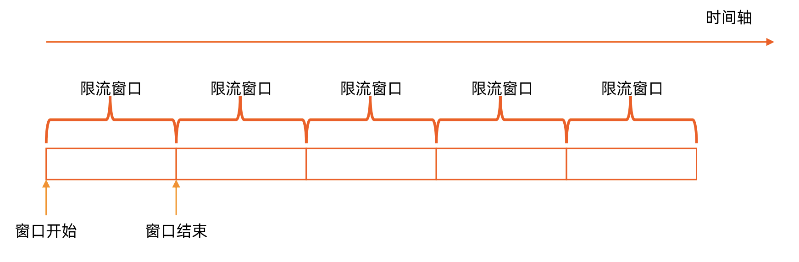
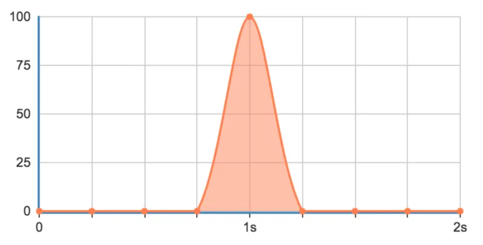
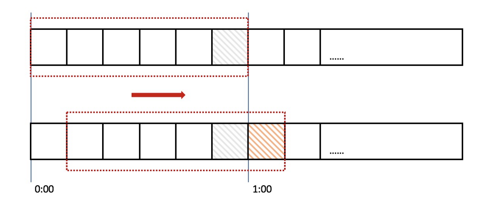
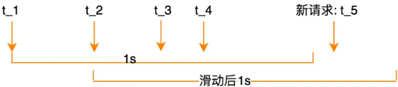
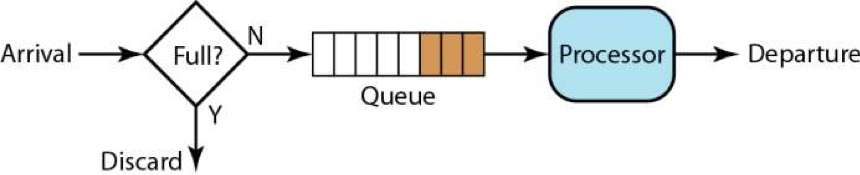
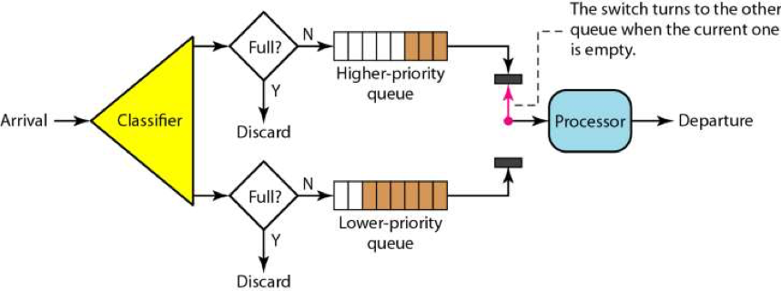
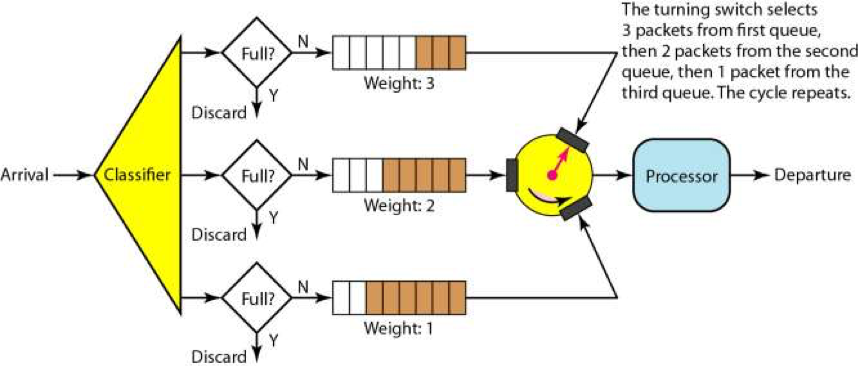
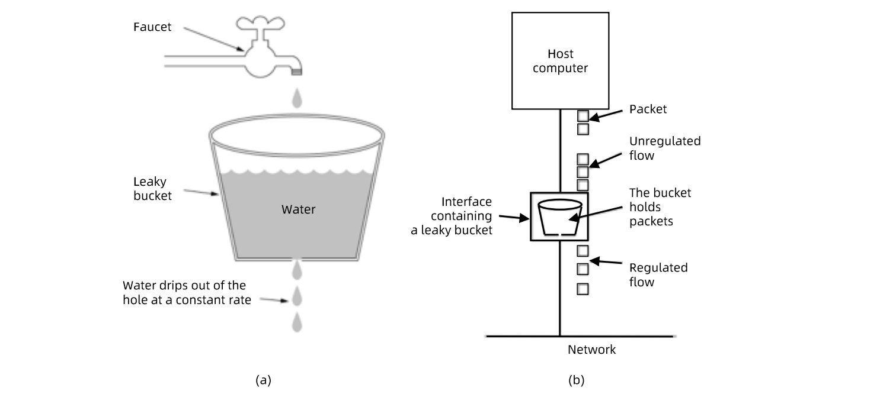
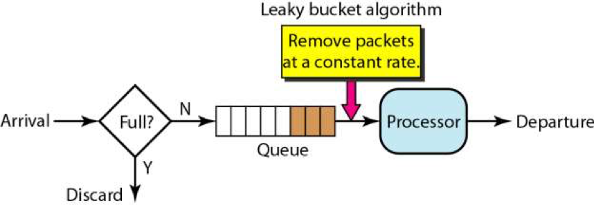
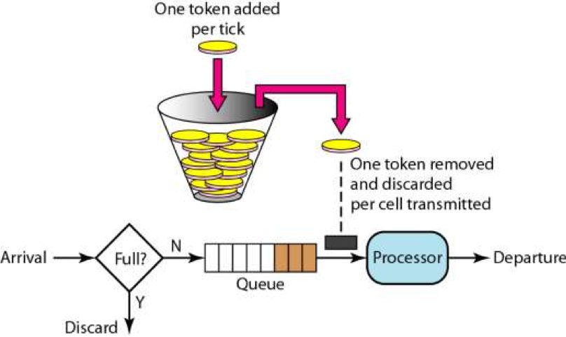

# 1. 概念

限流，也叫速率限制（Rate Limiting），是一种限制请求速率的技术。通常用于保护服务自身，或在下游服务已知无法保护自身的情况下，保护下游服务

# 2. 为什么要限流？

服务需要保护自己，以免被太多的请求淹没（无论是恶意或无意的），从而保持可用性。

举个生活中的例子，某个景区，平时可能根本没什么人前往，但是一旦到了国庆假日就人满为患，这时景区管理人员就会实施一系列的限流举措，来限制进入的人流量。为什么要这么做呢？假设景区能容纳 1 万人，现在进去了 3 万人，势必摩肩接踵，搞不好还会有踩踏事故发生。这样的结果就是 **所有人的体验都不好** ，如果发生了事故，景区可能还要关闭，导致 **对外不可用** 。

互联网场景中，这样的例子也随处可见。比如秒杀抢购，通过限流来限制并发和请求量，从而保护自身或下游系统不被巨型流量冲垮。

### 2.1 防止资源枯竭

限流最常见的一个原因是，通过避免资源枯竭，来提高服务的可用性。常见的导致资源枯竭的原因有：

1. 遭受恶意的攻击（如**DDoS 攻击**、暴力密码猜测攻击等），这些攻击看起来像是来自真实用户，但通常是由僵尸程序或某种脚本机器人生成，往往会在短时间内发起大量的服务请求，导致合法用户无法使用该系统。
2. 非恶意的（friendly-fire）资源消耗，这可能由于一些错误的配置，或者人为的误用导致。比如：上游调用方在应该发起批量请求的地方，发起了多次简单请求。

### 2.2 管理配额

许多公共资源（如开放**API**，服务容量等），可能由多个租户共享。如果没有限流，每个用户都随心所欲的发出请求，消耗资源，将导致[嘈杂邻居效应（noisy neighbor）](https://cloud.tencent.com/developer/tools/blog-entry?target=https%3A%2F%2Fwww.techtarget.com%2Fsearchcloudcomputing%2Fdefinition%2Fnoisy-neighbor-cloud-computing-performance&objectId=2064674&objectType=1&isNewArticle=undefined)，使其他用户的服务质量变差，甚至得不到服务。

对每个用户使用限流，从而为每个用户提供公平的服务，而不影响其他用户。

### 2.3 费用控制

在按使用付费模式中，底层资源能够自动伸缩以满足需求，限流通过对资源扩展设置虚拟上限来帮助控制运营成本。如果没有限流，资源可能会不成比例地扩展（比如配置错误，或者实验失控），从而导致指数级的账单

# 3. 计数器限流算法

## 3.1 计数器固定窗口限流

### 特性

对一段固定时间窗口内的请求进行计数，如果请求数超过了阈值，则舍弃该请求；

如果没有达到设定的阈值，则接受该请求，并计数+1

当时间窗口结束时，重置计数器为 0

### 缺点

限流策略过于粗略，无法应对两个时间窗口临界时间内的突发流量。我们举一个例子：假设我们限流规则为每秒钟不超过 100 次接口请求，第一个 1s 时间窗口内，100 次接口请求都集中在最后的 10ms 内，在第二个 1s 的时间窗口内，100 次接口请求都集中在最开始的 10ms 内，虽然两个时间窗口内流量都符合限流要求 (<=100 个请求)，但在两个时间窗口临界的 20ms 内会集中有 200 次接口请求，如果不做限流，集中在这 20ms 内的 200 次请求就有可能压垮系统。

### 3.2 计数器滑动窗口限流

### 特性

滑动时间窗口算法是对固定时间窗口算法的一种改进，流量经过滑动时间窗口算法整形之后，可以保证任意时间窗口内，都不会超过最大允许的限流值，从流量曲线上来看会更加平滑，可以部分解决上面提到的临界突发流量问题。缓解突刺问题，但计算开销较大。

滑动时间窗口的算法模型如下：

滑动窗口记录的时间点 list = (t_1, t_2, …t_k)，时间窗口大小为 1 秒，起点是 list 中最小的时间点。当 t_m 时刻新的请求到来时，我们通过以下步骤来更新滑动时间窗口并判断是否限流熔断：

STEP 1: 检查接口请求的时间 t_m 是否在当前的时间窗口 [t_start, t_start+1 秒) 内。如果是，则跳转到 STEP 3，否则跳转到 STEP 2.

STEP 2: 向后滑动时间窗口，将时间窗口的起点 t_start 更新为 list 中的第二小时间点，并将最小的时间点从 list 中删除。然后，跳转到 STEP 1。

STEP 3: 判断当前时间窗口内的接口请求数是否小于最大允许的接口请求限流值，即判断: list.size < max_hits_limit，如果小于，则说明没有超过限流值，允许接口请求，并将此接口请求的访问时间放入到时间窗口内，否则直接执行限流熔断

### 缺点

即便滑动时间窗口限流算法可以保证任意时间窗口内接口请求次数都不会超过最大限流值，但是仍然不能防止在细时间粒度上面访问过于集中的问题，比如上面举的例子，第一个 1s 的时间窗口内 100 次请求都集中在最后 10ms 中。

**也就是说，基于时间窗口的限流算法，不管是固定时间窗口还是滑动时间窗口，只能在选定的时间粒度上限流，对选定时间粒度内的更加细粒度的访问频率不做限制**。

# 4. 队列式

## 4.1 队列式基本算法实现

在这个算法下，请求的速度可以是波动的，而处理的速度则是非常均速的。这个算法其实有点像一个 FIFO 的算法。

在上面这个 FIFO 的队列上，我们可以扩展出一些别的玩法。

一个是有优先级的队列，处理时先处理高优先级的队列，然后再处理低优先级的队列。 如下图所示，只有高优先级的队列被处理完成后，才会处理低优先级的队列。

有优先级的队列可能会导致低优先级队列长时间得不到处理。为了避免低优先级的队列被饿死，一般来说是分配不同的比例的处理时间到不同的队列上，于是我们有了带权重的队列。

如下图所示。有三个队列的权重分布是 3:2:1，这意味着我们需要在权重为 3 的这个队列上处理 3 个请求后，再去权重为 2 的队列上处理 2 个请求，最后再去权重为 1 的队列上处理 1 个请求，如此返复。

队列流控是以队列的的方式来处理请求。如果处理过慢，那么就会导致队列满，而开始触发限流。

## 4.2 漏斗（Leaky Bucke）

### 特性

请求来了后会首先进到漏斗里，然后漏斗以恒定的速率将请求流出进行处理，从而起到平滑流量的作用

当请求的流量过大时，漏斗达到最大容量时会溢出，此时请求被丢弃

在系统看来，请求永远是以平滑的传输速率过来，从而起到了保护系统的作用

**优点**

能够平滑突发流量，这使得漏桶特别适合需要削峰填谷的瞬时高并发场景（如：整点签到、秒杀等）

### 实现

一般来说，这个“漏斗”是用一个队列来实现的，当请求过多时，队列就会开始积压请求，如果队列满了，就会开拒绝请求。很多系统都有这样的设计，比如 TCP。当请求的数量过多时，就会有一个 sync backlog 的队列来缓冲请求，或是 TCP 的滑动窗口也是用于流控的队列

### 缺点

1. 资源利用率低：漏桶并不能高效地利用可用的资源。因为它只在固定的时间间隔放行请求，所以在很多情况下，流量非常低，即使不存在资源争用，也无法有效地消耗资源。
2. 饥饿问题：当短时间内有大量突发请求，即使**服务器**没有任何负载，每个请求也需要在队列中等待一段时间才能响应。

举个例子：平时访问某个网站，如果有多个用户同时访问，这时虽然服务器没有什么负载，但排在后面的客户请求无法被立即响应，这样网站看起来就很慢，用户体验就很差。

## 4.3 令牌桶（Token Bucket）

### 特性

令牌桶的策略，简单来说就是"广积粮"：平时存粮，以备灾年之用（应对突发）

令牌桶算法很容易和漏桶算法错误地混淆在一起。和漏桶一样，令牌桶也被用于流量整形和速率限制。但实际上，这两种算法具有截然不同的特性，它们之间最主要的差别在于：漏桶通过平滑流量强行限流（不允许突发通过），而令牌桶在限流的同时还允许某种程度的突发传输（允许突发通过）

**算法过程**

1. 算法使用一个固定容量的桶
2. 只要桶不满，系统就以一个恒定的速率（比如每秒）向桶中添加令牌
3. 当请求到来时，就从桶中拿走 1 个或多个令牌，若没有可用令牌，就拒绝该请求

**优点**

允许突发流量。应用程序在本质上往往是突发性的，当有突发流量时，只要桶里的令牌足够，就能处理，因此能够更高效的利用底层资源。

举个例子：

1. 假设令牌桶的容量为 20，令牌恢复速度为 5 个/秒。正常情况下，系统可以处理持续的每秒 5 个请求，也可以处理每隔 4 秒一次性 20 个请求的突发情况
2. 开放平台 API（如 GitHub API 允许短时突发，但长期限制 5000 次/小时）

# 5. 自适应限流

// TODO

# 6. 分布式限流

// TODO

# 7. 参考&延伸阅读

1. [分布式限流方案的探索与实践](https://mp.weixin.qq.com/s/MJbEQROGlThrHSwCjYB_4Q)
2. [Go 中实现用户的每日限额（比如一天只能领三次福利）](https://mp.weixin.qq.com/s/s8T1430LS-l3ks9cL7sZyw)
3. [一文讲透自适应熔断的原理和实现](https://mp.weixin.qq.com/s/DDtFvFuJ1DMTBW-ViD7XTw)
4. [熔断原理分析与源码解读](https://mp.weixin.qq.com/s/4JLDjEVoYnceKcbBH4zm5w)
5. [TCP 的那些事儿（下）- 拥塞控制](https://coolshell.cn/articles/11609.html)
6. [看完这篇，轻松 get 限流！](https://cloud.tencent.com/developer/article/2064674)
