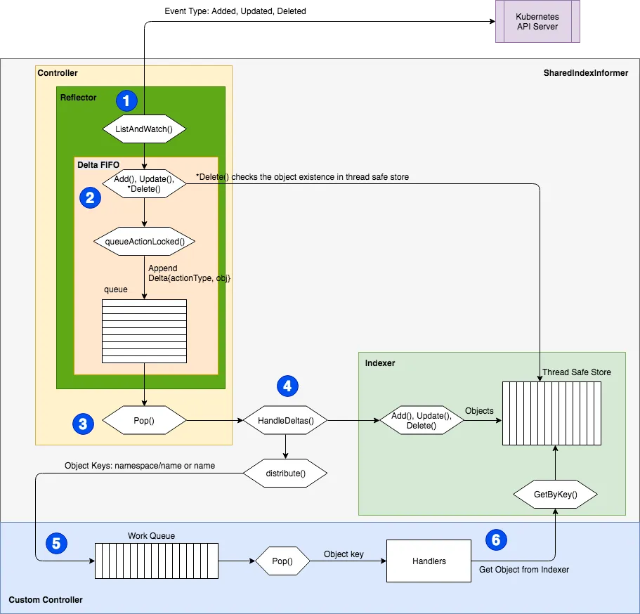

# 什么是 controller?

controller 就是管理资源的组件，我们自定义资源后，执行 kubectl create / apply -f crd.yaml 只是把资源清单数据写入到 etcd 中而已，并没有什么用处。最终让这个 crd 跑起来的是 crd 对应的 controller。

官方提供了一个自定义 Controller 的示例：[https://github.com/kubernetes/sample-controller](https://github.com/kubernetes/sample-controller)，实现了：

- 如何注册资源 Foo
- 如何创建、删除和查询 Foo 对象
- 如何监听 Foo 资源对象的变化情况

要想了解 Controller 的实现原理和方式，我们就需要了解下 [client-go](https://github.com/kubernetes/client-go/) 这个库的实现，Kubernetes 部分代码也是基于这个库实现的，也包含了开发自定义控制器时可以使用的各种机制，这些机制在 client-go 源码的 [tools/cache](https://github.com/kubernetes/client-go/tree/master/tools/cache) 目录下面有定义。

下图显示了 client-go 中的各个组件是如何公众的以及与我们要编写的自定义控制器代码的交互入口：

> Interaction between client-go and Kubernetes operator. Image from [sample-controller](https://github.com/kubernetes/sample-controller/blob/master/docs/images/client-go-controller-interaction.jpeg)

## client-go 组件简介

- Reflector: 通过 k8s api 监控 k8s 资源，采用 List/Watch 机制，可以 watch 任何资源，包括 CRD 的创建、删除、更新事件。并将这些事件推入到 FIFO 队列中
- Informer: controller 机制的基础，循环处理 object 对象，从 fifo 队列中取出数据，然后将数据缓存到 Indexer，提供对象事件的 handler 接口，只要给 Informer 注册对应的 `ResourceEventHandler` 实例的回调 hander 函数，实现 `OnAdd(obj interface{})`、 `OnUpdate(oldObj, newObj interface{})` 和 `OnDelete(obj interface{})` 这三个方法，就可以处理好资源的创建、更新和删除操作了
- Indexer: 提供 object 对象缓存和高效索引，是线程安全的。

# 工作流程

`client-go/tool/cache/` 和自定义 Controller 的控制流([图片来源](https://itnext.io/how-to-create-a-kubernetes-custom-controller-using-client-go-f36a7a7536cc))：

> client-go/tool/cache/ and custom controller flow

# 参考与延伸阅读

1. [How to Write a Kubernetes Operator Using client-go](https://chishengliu.com/posts/kubernetes-operator-sample-controller/)
2. https://github.com/kubernetes/sample-controller
3. [How to Create a Kubernetes Custom Controller Using client-go](https://itnext.io/how-to-create-a-kubernetes-custom-controller-using-client-go-f36a7a7536cc)
