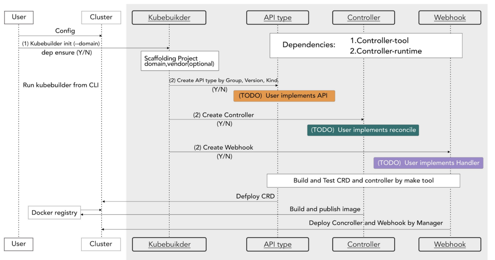

# 什么是[Operator 模式？](https://kubernetes.io/zh-cn/docs/concepts/extend-kubernetes/operator/)

Kubernetes 提供了众多的扩展功能，比如 CRD、CRI、CSI 等等，强大的扩展功能让 k8s 迅速占领市场。[Operator](https://kubernetes.io/zh/docs/concepts/extend-kubernetes/operator/)模式可以实现 CRD 并管理自定义资源的生命周期。

`Operator` 就可以看成是 CRD 和 Controller 的一种组合特例，Operator 是一种思想，它结合了特定领域知识并通过 CRD 机制扩展了 Kubernetes API 资源，使用户管理 Kubernetes 的内置资源（Pod、Deployment 等）一样创建、配置和管理应用程序，Operator 是一个特定的应用程序的控制器，通过扩展 Kubernetes API 资源以代表 Kubernetes 用户创建、配置和管理复杂应用程序的实例，通常包含资源模型定义和控制器，通过 `Operator` 通常是为了实现某种特定软件（通常是有状态服务）的自动化运维。

我们完全可以通过编写一个 CRD 对象，然后去手动实现一个对应的 Controller 就可以实现一个 Operator，但是我们也发现从头开始去构建一个 CRD 控制器并不容易，需要对 Kubernetes 的 API 有深入了解，并且 RBAC 集成、镜像构建、持续集成和部署等都需要很大工作量。为了解决这个问题，社区就推出了对应的简单易用的 Operator 框架，比较主流的是 [kubebuilder](https://github.com/kubernetes-sigs/kubebuilder) 和 [Operator Framework](https://coreos.com/operators)。

# kuberbuider

`kubebuilder`是一个官方提供快速实现 Operator 的工具包，可快速生成 k8s 的 CRD、Controller、Webhook，用户只需要实现业务逻辑。

# 参考与延伸阅读

1. [阳明-k8s 训练营-operator](https://www.qikqiak.com/k8strain2/operator/operator/)
2. [Kubebuilder 中文文档](https://xuejipeng.github.io/kubebuilder-doc-cn/introduction.html)
3. [Intro To Kubebuilder and Deep Dive](https://cloudyuga.guru/blogs/kubebuilder-intro/)
4. [深入了解 kubebuilder](https://qingwave.github.io/k8s-kubebuilder-deep-dive/)
5. [使用 kubebuilder 开发简单的 Operator](https://cloud.tencent.cn/developer/article/1839414)
6. [Kubernetes Operator 开发教程](https://cloud.tencent.cn/developer/article/2501220?policyId=1003)
