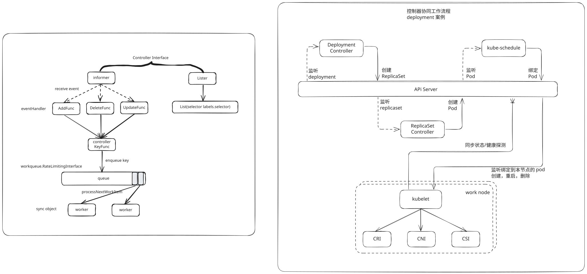
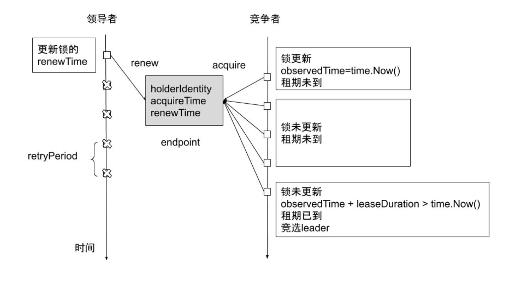

# 1. 简介

Kubernetes 控制器管理器是一个守护进程，内嵌随 Kubernetes 一起发布的核心控制回路。controller-manager 就是一个中央控制器，负责运行[控制器](https://kubernetes.io/zh-cn/docs/concepts/architecture/controller/)进程。

## 控制器

在机器人和自动化的应用中，控制回路是一个永不休止的循环，用于调节系统状态。

在 Kubernetes 中，每个控制器是一个控制回路，通过 API 服务器监视集群的共享状态， 并尝试进行更改以将当前状态转为期望状态。目前，Kubernetes 自带的控制器例子包括副本控制器、节点控制器、命名空间控制器和服务账号控制器等。

> 这是一个控制环的例子：房间里的温度自动调节器。
>
> 当你设置了温度，告诉了温度自动调节器你的 **期望状态（Desired State）** 。 房间的实际温度是 **当前状态（Current State）** 。 通过对设备的开关控制，温度自动调节器让其当前状态接近期望状态。

## 设计原则

一个控制器至少追踪一种类型的 k8s 资源，这些 对象有一个代表期望状态的 `spec` 字段，控制器负责确保让资源达到期望状态。每个控制器都是一个 syncLoop，轮询检查自己负责的资源的状态，调协资源状态达到预期。

# 2. 常见控制器

- `Job Controller`：处理 `job`，用于批处理作业

  ```yaml
  apiVersion: batch/v1
  kind: Job
  metadata:
    name: pi
  spec:
    parallelism: 2 # 并发个数，每次创建 2 个 Pod
    completions: 5 # 执行次数，总共创建 5 个 Pod
    template:
      spec:
        containers:
          - name: pi
            image: perl
            command: ["perl", "-Mbignum=bpi", "-wle", "print bpi(2000)"] # 例如计算 Pi 的两千位
        restartPolicy: OnFailure
  ```

  执行完之后，会以 `Completed` 状态保留住 `Pod`，并且可以查看日志。清理时，直接删除 `Job` 即可。
- `Pod AutoScaler`：处理 `pod` 的自动缩容、扩容，当处理请求负载高的时候，自动扩容，当负载降低时，自动缩容
- `ReplicaSet`：依据 `Replicaset Sepc` 创建 `Pod`，**保证一定数量的 pod 正常运行**，它会持续监听这些 Pod 的运行状态，一旦 Pod 发生故障，就会重启或重建。同时它还支持对 pod 数量的扩缩容和镜像版本的升降级

* `Service Controller`：为 `LoadBalancer type` 的 `service<span> </span>`创建 `LB VIP`
* `ServiceAccount Controller`：确保 `serviceaccount` 在当前 `namespace` 存在
* `StatefulSet Controller`：处理 `statefulset` 中的 `pod`
* `Volume Controller`：依据 `PV spec` 创建 `volume`
* `Resource quota Controller`：在用户使用资源之后，更新状态
* `Namespace Controller`：保证 `namespace` 删除时，该 `namespace` 下的所有资源都先被删除
  `pkg/controller/namespace/namespace_controller.go`
* `Replication Controller`：创建 `RC` 后，负责创建 `Pod`（基本不用）
* `Node Controller`：维护 `node` 状态，处理 `evict` 请求等
  处理节点上的 `Taints` 和对应 `Pod` 的管理
* `Daemon Controller`：依据 `daemonset` 创建 `pod`
* `Deployment Controller`：依据 `deployment spec` 创建 `replicaset`
* `Endpoint Controller`：依据 `service spec` 创建 `endpoint`，依据 `podip` 更新 `endpoint`
* `Garbage Collector`：处理级联删除，比如删除 `deployment` 的同时删除 `replicaset` 以及 `pod`
  例如只删除 `deployment`，但是不删除 `rs` 和 `pod`

  ```bash
  kubectl delete deployments.apps nginx --cascade=orphan
  ```
* `CronJob Controller`：处理 `cronjob`

# 3. 控制器工作流程



`Informer`：监听对象，例如 `pod informer`，监听 `pod` 对象变更，作为生产者，将对象的 `key` 放到 `queue` 中

`Lister`：保留 `apiserver` 的缓存，减少 `controller` 对 `apiserver` 调度

`worker`：消费者，获取变更的对象

eventHandler 发送过来的是一个完整的对象，大部分控制器会拿这个对象的 keyFunc(namespace + name)放入一个 queue 中，再由 worker 从这个队列中取出 key，因为没有对象的完整信息，所以会通过 Lister 接口去取对象的完整信息

❓ 为什么把 key 放入队列中而不是直接放入一个完整对象?

假设一个对象频繁变更，一方面会导致这个队列占用的内存空间增大，二是每次都将变成一个事件交由 worker 去处理。只存入 key，就能保证 worker 处理这个 key 的时候只需要关注最终状态，而无需关注中间频繁变更的状态

**[pod-template-hash]([Kubernetes 容器重启原理-Kubelet Hash 计算](https://mp.weixin.qq.com/s/dcEFXE7VasUAvYG7HbgqgA))**

Deployment 控制器将 `pod-template-hash` 标签添加到 Deployment 所创建或收留的每个 ReplicaSet 。此标签可确保 Deployment 的子 ReplicaSets 不重叠。 标签是通过对 ReplicaSet 的 PodTemplate 进行哈希处理。 所生成的哈希值被添加到 ReplicaSet 选择算符、Pod 模板标签，并存在于在 ReplicaSet 可能拥有的任何现有 Pod 中

```bash
k describe rs -n kube-ops jenkins-db94684c6                     ⎈ k3d-dev-cluster
Name:           jenkins-db94684c6
Namespace:      kube-ops
Selector:       app=jenkins,pod-template-hash=db94684c6
Labels:         app=jenkins
                pod-template-hash=db94684c6
Annotations:    deployment.kubernetes.io/desired-replicas: 1
                deployment.kubernetes.io/max-replicas: 2
                deployment.kubernetes.io/revision: 2
...
```

# 4. 控制器高可用-[Leader-election](https://kubernetes.io/zh-cn/docs/concepts/architecture/leases/#leader-election)

kubernetes使用了Leader Election来保证同一时刻只存在一个活跃的scheduler或者controller。

早起版本k8s提供基于configmap和endpoint对象的 leader election 类库(最新版本是基于[lease对象](https://kubernetes.io/zh-cn/docs/concepts/architecture/leases/)的 Leader election)

## 旧模式

采用 `leader election` 模式启动 `component` 后，会创建对应 `endpoint`，并把当前的 `leader` 信息 `annotate` 到 `endpoint` 上

```yaml
apiVersion: v1
kind: Endpoints
metadata:
  annotations:
    control-plane.alpha.kubernetes.io/leader: '{"holderldentity":"minikube", "leaseDurationSeconds":15", acquireTime":"2018-04-05T17:31:29Z", "renewTime:": "2018-04-07T07:18:39Z", "leaderTransitions": 0}'
  creationTimestamp: 2018-04-05T17:31:29Z
  name: kube-scheduler
  namespace: kube-System
  resourceVersion: '138930'
  selfLink: /api/v1/namespaces/kube-system/endpoints /kube-scheduler
  uid: 2d12578d-38f7-11e8-8df0-0800275259e5
subsets: null
```

`holderIdentity`：当前获得锁的对象

`leaseDurationSeconds`：持有锁的时间

`acquireTime`：获取锁的时间

`renewTime`：锁更新时间

`leaderTransition`：任期

`Follower` 通过 `leaseDurationSeconds` 和 `renewTime` 判断锁是否有效，无效的话则开始抢锁

## 新模式-lease

```yaml
apiVersion: coordination.k8s.io/v1
kind: Lease
metadata:
  creationTimestamp: "2024-01-18T05:45:55Z"
  name: kube-controller-manager
  namespace: kube-system
  resourceVersion: "128645"
  uid: c812532b-a029-4e66-a94a-36016e248200
spec:
  acquireTime: "2024-01-22T03:37:31.329151Z"
  holderIdentity: master_fd21a18e-37db-486b-b8ed-5495b00bfe32
  leaseDurationSeconds: 15
  leaseTransitions: 4
  renewTime: "2024-01-22T10:05:50.788158Z"

```

controller 高可用，是通过 leader election ，相当与启动多个进程，但一次只有一个在工作，其他的副本待机，且副本数并不像 etcd 一样需要单数的节点数限制。类似文件锁的机制，控制当前工作的节点，lease 资源会不间断的自动续期，维护心跳，保证 controller 正常工作，如果过期就会被其他待机的副本抢占，

`<font color="red">`controller 的这种机制是为了保证能够秒级切换，而不需要等待新的 controller 慢启动 `</font>`

## 竞选流程



# 5. 扩展知识

## 1. deployment 用 rs 来做版本控制支持回滚，为什么 statefulset, daemonset 没有通过 s？

1. daemonset 不需要 rs 的副本数管控能力，固定一个副本
2. statefuleset 的副本数管理逻辑跟无状态服务也大不相同

二者都需要版本控制，k8s抽象了一个对象 [ControllerRevision](https://kubernetes.io/zh-cn/docs/reference/kubernetes-api/workload-resources/controller-revision-v1/)支持记录不同类型工作负载的历史版本

以下是简单的 daemonset ，执行如下命令

>  kubectl create ns dev
>
> kubectl apply -f daemonset-demo.yaml

```yaml
apiVersion: apps/v1
kind: DaemonSet
metadata:
  name: pc-daemonset
  namespace: dev
spec:
  selector:
    matchLabels:
      app: nginx-pod
  template:
    metadata:
      labels:
        app: nginx-pod
    spec:
      containers:
        - name: nginx
          image: nginx:1.17.1
```

```bash
 k get pod -n dev                                                ⎈ k3d-dev-cluster
kNAME                 READY   STATUS    RESTARTS   AGE
pc-daemonset-qb5qm   1/1     Running   0          7m59s
pc-daemonset-g2hmv   1/1     Running   0          7m59s
pc-daemonset-p5hvl   1/1     Running   0          7m59s
pc-daemonset-mrtpz   1/1     Running   0          7m59s
pc-daemonset-nkpf9   1/1     Running   0          7m59s
  ~/ownerpro/learning/xk8s ❯ k get rs -n dev                                                 ⎈ k3d-dev-cluster
No resources found in dev namespace.
  ~/ownerpro/learning/xk8s ❯ k get daemonset -n dev                                          ⎈ k3d-dev-cluster
NAME           DESIRED   CURRENT   READY   UP-TO-DATE   AVAILABLE   NODE SELECTOR   AGE
pc-daemonset   5         5         5       5            5           <none>          8m14s
```

查看 controllerrevision 资源

```base
 k get controllerrevision -n dev                                 ⎈ k3d-dev-cluster
NAME                      CONTROLLER                    REVISION   AGE
pc-daemonset-6cb555c765   daemonset.apps/pc-daemonset   1          9m39s
```

```yaml

apiVersion: apps/v1
data:
  spec:
    template:
      $patch: replace
      metadata:
        creationTimestamp: null
        labels:
          app: nginx-pod
      spec:
        containers:
        - image: nginx:1.17.1
          imagePullPolicy: IfNotPresent
          name: nginx
          resources: {}
          terminationMessagePath: /dev/termination-log
          terminationMessagePolicy: File
        dnsPolicy: ClusterFirst
        restartPolicy: Always
        schedulerName: default-scheduler
        securityContext: {}
        terminationGracePeriodSeconds: 30
kind: ControllerRevision
metadata:
  annotations:
    deprecated.daemonset.template.generation: "1"
  creationTimestamp: "2025-04-14T08:27:20Z"
  labels:
    app: nginx-pod
    controller-revision-hash: 6cb555c765
  name: pc-daemonset-6cb555c765
  namespace: dev
  ownerReferences:
  - apiVersion: apps/v1
    blockOwnerDeletion: true
    controller: true
    kind: DaemonSet
    name: pc-daemonset
    uid: a01498a7-ce27-484e-958e-68615fa24d02
  resourceVersion: "394140"
  uid: b3fdc865-4fd0-4d8a-a2c0-42629a27ddcc
revision: 1
```

- metadata.name: daemonset-name-controller-revision-hash
- metadata.labels:  app: `nginx-pod`, controller-revision-hash: `6cb555c765` ，与上文提到的pod-template-hash类似
- data: 存储了 **DaemonSet 模板的历史版本**
- revision: 版本号，表示这是 DaemonSet 的第 1 个修订版本。每次模板更新会生成新版本
- ownerReferences: `ownerReferences` 明确归属哪个 DaemonSet，由控制器自动管理生命周期


修改 container.imagePullPolicy -> Always，可以观察到 controllerrevision 多了一个

```bash
k get controllerrevision -n dev                                 ⎈ k3d-dev-cluster
NAME                      CONTROLLER                    REVISION   AGE
pc-daemonset-6cb555c765   daemonset.apps/pc-daemonset   1          25m
pc-daemonset-bbb6465f     daemonset.apps/pc-daemonset   2          11s
```


# 6. 参考与延伸阅读

1. [Kubernetes 文档](https://kubernetes.io/zh-cn/docs/)/[概念](https://kubernetes.io/zh-cn/docs/concepts/)/[Kubernetes 架构](https://kubernetes.io/zh-cn/docs/concepts/architecture/)/[控制器](https://kubernetes.io/zh-cn/docs/concepts/architecture/controller/)
2. [云原生训练营-控制器](https://www.xiaoyeshiyu.com/post/ea1d.html#Leader-Election)
