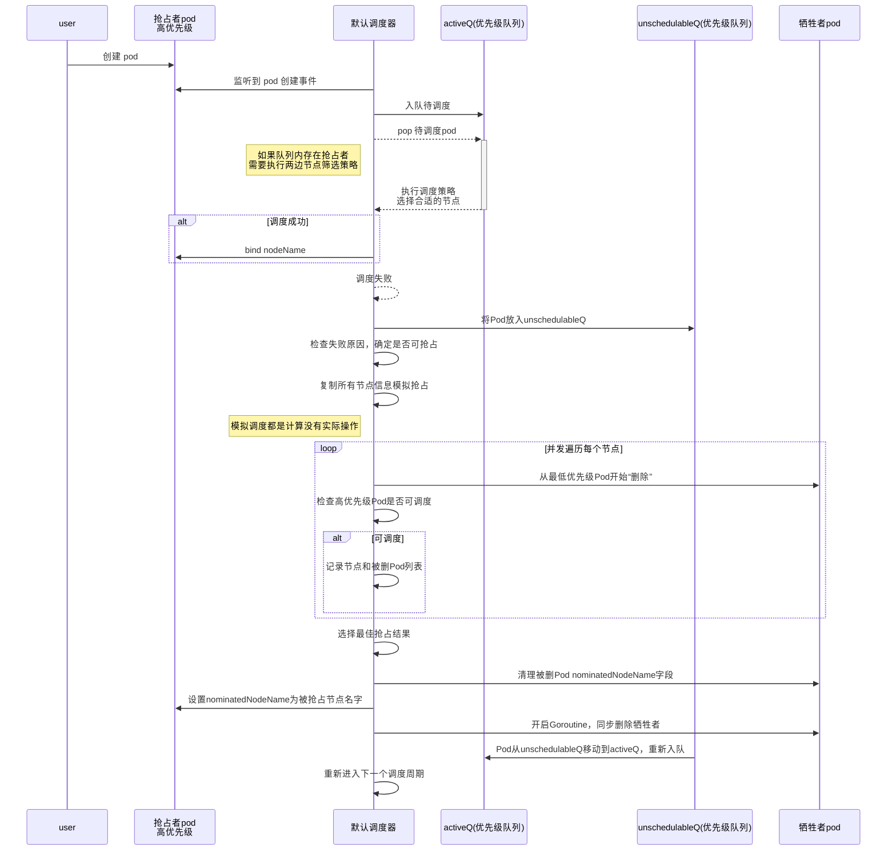

# 1. 背景

优先级和抢占机制，解决的是 Pod 调度失败时该怎么办的问题。

正常情况下，当一个 Pod 调度失败后，它就会被暂时“搁置”起来，直到 Pod 被更新，或者集群状态发生变化，调度器才会对这个 Pod 进行重新调度。

但在有时候，我们希望的是这样一个场景。当一个高优先级的 Pod 调度失败后，该 Pod 并不会被“搁置”，而是会“挤走”某个 Node 上的一些低优先级的 Pod 。这样就可以保证这个高优先级 Pod 的调度成功。这个特性，其实也是一直以来就存在于 Borg 以及 Mesos 等项目里的一个基本功能。

而在 Kubernetes 里，优先级和抢占机制是在 1.10 版本后才逐步可用的。其资源类型就是 PriorityClass

```
apiVersion: scheduling.k8s.io/v1beta1
kind: PriorityClass
metadata:
  name: high-priority
value: 1000000
globalDefault: false
description: "This priority class should be used for high priority service pods only."

```

上面这个 YAML 文件，定义的是一个名叫 high-priority 的 PriorityClass，其中 value 的值是 1000000 （一百万）。

**Kubernetes 规定，优先级是一个 32 bit 的整数，最大值不超过 1000000000（10 亿，1 billion），并且值越大代表优先级越高。** 而超出 10 亿的值，其实是被 Kubernetes 保留下来分配给系统 Pod 使用的。显然，这样做的目的，就是保证系统 Pod 不会被用户抢占掉

调度器里维护着一个调度队列。所以，当 Pod 拥有了优先级之后，高优先级的 Pod 就可能会比低优先级的 Pod 提前出队，从而尽早完成调度过程。**这个过程，就是“优先级”这个概念在 Kubernetes 里的主要体现**

当一个高优先级的 Pod 调度失败的时候，调度器的抢占能力就会被触发。这时，调度器就会试图从当前集群里寻找一个节点，使得当这个节点上的一个或者多个低优先级 Pod 被删除后，待调度的高优先级 Pod 就可以被调度到这个节点上。**这个过程，就是“抢占”这个概念在 Kubernetes 里的主要体现**

# 2. 调度流程

而 Kubernetes 调度器实现抢占算法的一个最重要的设计，就是在调度队列的实现里，使用了两个不同的队列。

**第一个队列，叫作 activeQ。** 凡是在 activeQ 里的 Pod，都是下一个调度周期需要调度的对象。所以，当你在 Kubernetes 集群里新创建一个 Pod 的时候，调度器会将这个 Pod 入队到 activeQ 里面。而我在前面提到过的、调度器不断从队列里出队（Pop）一个 Pod 进行调度，实际上都是从 activeQ 里出队的。

**第二个队列，叫作 unschedulableQ** ，专门用来存放调度失败的 Pod

当一个 unschedulableQ 里的 Pod 被更新之后，调度器会自动把这个 Pod 移动到 activeQ 里，从而给这些调度失败的 Pod “重新做人”的机会

## 时序图



## 详解

调度失败之后，抢占者就会被放进 unschedulableQ 里面。

然后，这次失败事件就会触发**调度器为抢占者寻找牺牲者的流程。**

**第一步** ，调度器会检查这次失败事件的原因，来确认抢占是不是可以帮助抢占者找到一个新节点。这是因为有很多 Predicates 的失败是不能通过抢占来解决的。比如，PodFitsHost 算法（负责的是，检查 Pod 的 nodeSelector 与 Node 的名字是否匹配），这种情况下，除非 Node 的名字发生变化，否则你即使删除再多的 Pod，抢占者也不可能调度成功。

**第二步** ，如果确定抢占可以发生，那么调度器就会把自己缓存的所有节点信息复制一份，然后使用这个副本来模拟抢占过程。

这里的抢占过程很容易理解。调度器会检查缓存副本里的每一个节点，然后从该节点上最低优先级的 Pod 开始，逐一“删除”这些 Pod。而每删除一个低优先级 Pod，调度器都会检查一下抢占者是否能够运行在该 Node 上。一旦可以运行，调度器就记录下这个 Node 的名字和被删除 Pod 的列表，这就是一次抢占过程的结果了。

当遍历完所有的节点之后，调度器会在上述模拟产生的所有抢占结果里做一个选择，找出最佳结果。而这一步的 **判断原则，就是尽量减少抢占对整个系统的影响** 。比如，需要抢占的 Pod 越少越好，需要抢占的 Pod 的优先级越低越好，等等。

在得到了最佳的抢占结果之后，这个结果里的 Node，就是即将被抢占的 Node；被删除的 Pod 列表，就是牺牲者。所以接下来，**调度器就可以真正开始抢占的操作**了，这个过程，可以分为三步。

**第一步** ，调度器会检查牺牲者列表，清理这些 Pod 所携带的 nominatedNodeName 字段。

**第二步** ，调度器会把抢占者的 nominatedNodeName，设置为被抢占的 Node 的名字。

**第三步** ，调度器会开启一个 Goroutine，同步地删除牺牲者。

而第二步对抢占者 Pod 的更新操作，就会触发到我前面提到的“重新做人”的流程，从而让抢占者在下一个调度周期重新进入调度流程。

所以 **接下来，调度器就会通过正常的调度流程把抢占者调度成功** 。这也是为什么，我前面会说调度器并不保证抢占的结果：在这个正常的调度流程里，是一切皆有可能的。

不过，对于任意一个待调度 Pod 来说，因为有上述抢占者的存在，它的调度过程，其实是有一些特殊情况需要特殊处理的。

具体来说，在为某一对 Pod 和 Node 执行 Predicates 算法的时候，如果待检查的 Node 是一个即将被抢占的节点，即：调度队列里有 nominatedNodeName 字段值是该 Node 名字的 Pod 存在（可以称之为：“潜在的抢占者”）。那么，**调度器就会对这个 Node ，将同样的 Predicates 算法运行两遍。**

**第一遍** ， 调度器会假设上述“潜在的抢占者”已经运行在这个节点上，然后执行 Predicates 算法；

**第二遍** ， 调度器会正常执行 Predicates 算法，即：不考虑任何“潜在的抢占者”。

而只有这两遍 Predicates 算法都能通过时，这个 Pod 和 Node 才会被认为是可以绑定（bind）的。

不难想到，这里需要执行第一遍 Predicates 算法的原因，是由于 InterPodAntiAffinity 规则的存在。

由于 InterPodAntiAffinity 规则关心待考察节点上所有 Pod 之间的互斥关系，所以我们在执行调度算法时必须考虑，如果抢占者已经存在于待考察 Node 上时，待调度 Pod 还能不能调度成功。

当然，这也就意味着，我们在这一步只需要考虑那些优先级等于或者大于待调度 Pod 的抢占者。毕竟对于其他较低优先级 Pod 来说，待调度 Pod 总是可以通过抢占运行在待考察 Node 上。

而我们需要执行第二遍 Predicates 算法的原因，则是因为“潜在的抢占者”最后不一定会运行在待考察的 Node 上。关于这一点，我在前面已经讲解过了：Kubernetes 调度器并不保证抢占者一定会运行在当初选定的被抢占的 Node 上。

# 3. 问题

## 1. MoveAllToActiveQueue

当整个集群发生可能会影响调度结果的变化（比如，添加或者更新 Node，添加和更新 PV、Service 等）时，调度器会执行一个被称为 MoveAllToActiveQueue 的操作，把所调度失败的 Pod 从 unscheduelableQ 移动到 activeQ 里面。请问这是为什么？

集群状态改变后，原本导致 Pod 调度失败的条件可能已消除。例如添加新 Node 后，可能为调度失败的 Pod 提供了新的可用节点；更新 Node 资源配置，可能使原本资源不足导致调度失败的 Pod 现在可以成功调度；添加或更新 PV、Service 等，也可能改变了网络或存储等相关条件，使 Pod 满足调度要求。所以将这些 Pod 移到 activeQ，能让调度器重新评估调度，提高 Pod 调度成功的机会，更好地利用集群资源。

## 2. 更新 pod 时，与 pod affinity 有关的会重新入队？

当一个已经调度成功的 Pod 被更新时，调度器则会将 unschedulableQ 里所有跟这个 Pod 有 Affinity/Anti-affinity 关系的 Pod，移动到 activeQ 里面。请问这又是为什么呢？

1. 当创建/更新一个 pod 时，调度失败的 pod 可能就是跟这个新 pod 有亲和性的，所以要重新入队
2. 当更新/删除一个 pod 时，调度失败的 pod 可能是因为反亲和造成了，所以要重新入队

# 4. 参考与延伸阅读

1. [深入剖析 kubernetes-Kubernetes 默认调度器的优先级与抢占机制-张磊](https://learn.lianglianglee.com/%e4%b8%93%e6%a0%8f/%e6%b7%b1%e5%85%a5%e5%89%96%e6%9e%90Kubernetes/43%20Kubernetes%e9%bb%98%e8%ae%a4%e8%b0%83%e5%ba%a6%e5%99%a8%e7%9a%84%e4%bc%98%e5%85%88%e7%ba%a7%e4%b8%8e%e6%8a%a2%e5%8d%a0%e6%9c%ba%e5%88%b6.md)
