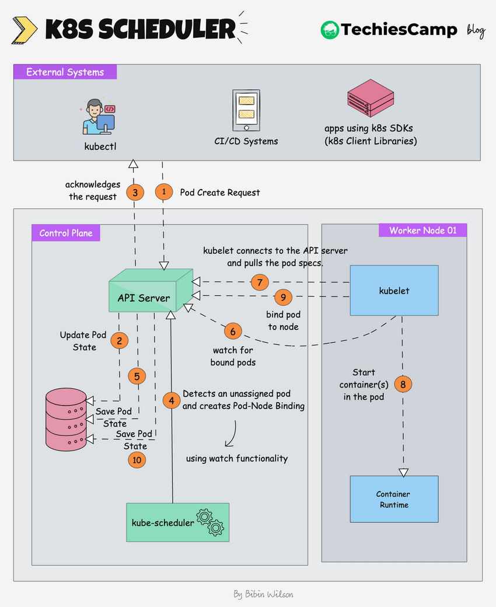
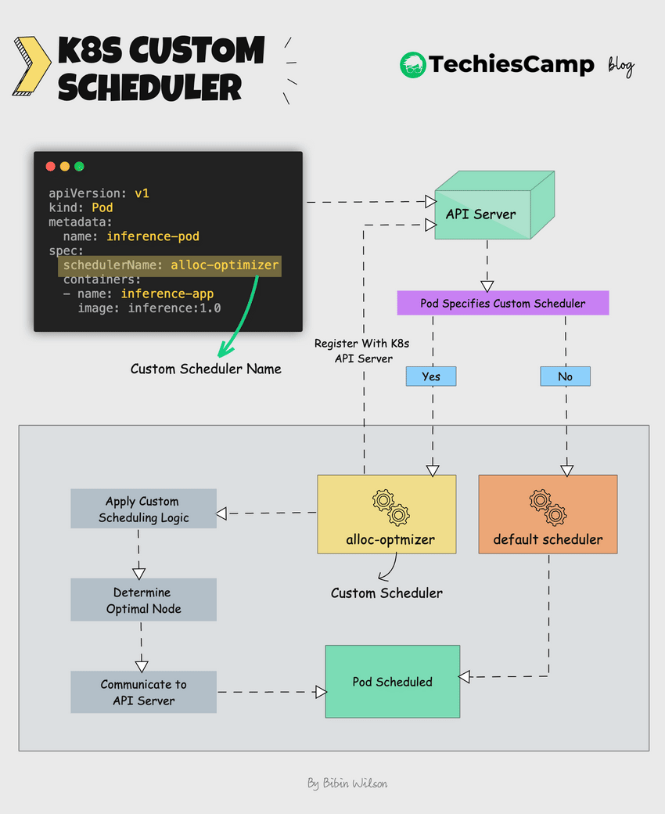

# 1. 概述

在 Kubernetes 中，**调度**是指将 [Pod](https://kubernetes.io/zh-cn/docs/concepts/workloads/pods/) 放置到合适的[节点](https://kubernetes.io/zh-cn/docs/concepts/architecture/nodes/)上，以便对应节点上的 [Kubelet](https://kubernetes.io/zh-cn/docs/reference/generated/kubelet) 能够运行这些 Pod。

调度器通过 Kubernetes 的监测（Watch）机制来发现集群中新创建且尚未被调度到节点上的 Pod。 调度器会将所发现的每一个未调度的 Pod 调度到一个合适的节点上来运行。 调度器会依据下文的调度原则来做出调度选择。

# 2. 调度框架

整个调度过程整体上可以分为 `调度周期` 和 `绑定周期` 两个大的阶段：前者包含：PreFilter、Filter、PostFilter、PreScore、Score、Normalize Score、Reserve、Permit，后者包括 WaitOnPermit、Prebind、Bind 和 PostBind。

在 `调度周期` 会筛选出一个合适的节点作为当前 Pod 的目标节点，然后在 `绑定周期` 会将当前 Pod 与选出的节点进行绑定。

绑定周期和调度周期是相互独立的，并且是异步的，在代码中表现为整个绑定周期的操作都是在一个单独的 goroutine 中执行的。

下面是这些过程的简单说明。

| 扩展点名称      | 说明                                                                                                                                                                                                                                                                                                                                                                                       |
| --------------- | ------------------------------------------------------------------------------------------------------------------------------------------------------------------------------------------------------------------------------------------------------------------------------------------------------------------------------------------------------------------------------------------ |
| PreEnqueue      | 在将 Pod 被添加到内部活动队列之前被调用，在此队列中 Pod 被标记为准备好进行调度。 只有当所有 [PreEnqueue](https://github.com/kubernetes/community/blob/f03b6d5692bd979f07dd472e7b6836b2dad0fd9b/contributors/devel/sig-scheduling/scheduler_queues.md) 插件返回 Success 时，Pod 才允许进入活动队列。  否则，它将被放置在内部无法调度的 Pod 列表中，并且不会获得 Unschedulable 状态。 |
| Sort            | 对队列中的 Pod 进行排序，同时只能启用一个 Sort 扩展点的插件                                                                                                                                                                                                                                                                                                                                |
| PreFilter       | 对 Filter 扩展点的数据做一些预处理操作，然后将其存入缓存中待 Filter 扩展点执行的时候使用                                                                                                                                                                                                                                                                                                   |
| Filter          | 针对当前 Pod，对所有节点进行过滤，在这个扩展点会过滤掉那些不适合的节点                                                                                                                                                                                                                                                                                                                     |
| PostFilter      | 如果在 Filter 扩展点全部节点都被过滤掉了，没有合适的节点进行调度，才会执行 PostFilter 扩展点，如果启用了 Pod 抢占特性，那么会在这个扩展点进行抢占操作                                                                                                                                                                                                                                      |
| PreScore        | 对 Score 扩展点的数据做一些预处理操作，然后将其存入缓存中待 Score 扩展点执行的时候使用                                                                                                                                                                                                                                                                                                     |
| Score           | 针对当前 Pod，对所有的节点进行打分                                                                                                                                                                                                                                                                                                                                                         |
| Normalize Score | 针对 Score 扩展点的打分结果进行修正                                                                                                                                                                                                                                                                                                                                                        |
| Reserve         | 预留 PVC 等资源                                                                                                                                                                                                                                                                                                                                                                            |
| Permit          | 在执行绑定操作之前对当前 Pod 的调度进行最后的决策，包括：批准、拒绝或者延时调度                                                                                                                                                                                                                                                                                                            |
| WaitOnPermit    | 与 Permit 扩展点配合使用实现延时调度功能                                                                                                                                                                                                                                                                                                                                                   |
| PreBind         | 预绑定操作，可以为 Bind 扩展点做一些准备工作，也可以对附属资源进行绑定，例如 PVC 和 PV                                                                                                                                                                                                                                                                                                     |
| Bind            | 将当前 Pod 与选出的节点进行绑定                                                                                                                                                                                                                                                                                                                                                            |
| PostBind        | 绑定的后置动作，可以执行通知操作，或者做一些资源清理工作                                                                                                                                                                                                                                                                                                                                   |

在整个调度过程中，除了考虑 Pod 是否可以调度到特定的节点上，还需要考虑相关资源，例如 Pod 所使用的的 PVC 是否与目标节点匹配等

# 3. 调度流程

当部署一个 Pod 时，会指定 Pod 的需求，例如 CPU、内存、亲和性、污点或容忍度、优先级、持久卷（PV）等。调度器的主要任务就是识别 pod spec 的要求，并为 Pod 选择满足需求的最佳节点。

<a href="https://blog.techiescamp.com/docs/scheduler-in-kubernetes/">Scheduler in Kubernetes Documentation</a>

# 4. 如何选择节点

1. 根据 pod 配置的条件，比如**Node Affinity**，**Taints**等过滤出可以运行该 pod的节点
2. 根据优先级等策略给节点打分，挑选一个最符合条件的节点
3. 选择最合适的节点绑定

<a href="https://blog.techiescamp.com/docs/kubernetes-scheduler-chooses-a-node/">How the scheduler chooses a node</a>

# 5. 自定义调度器

为什需要自定义调度器？

Kubernetes 默认调度器(kube-scheduler)能够满足大多数基本需求，但在复杂场景下，自定义调度器变得必要，以下是一些案例

- **GPU/TPU 等异构计算** ：需要特殊算法分配加速器资源
- **高性能计算** ：对 CPU 亲和性、NUMA 拓扑有严格要求
- **大数据工作负载** ：需要感知数据本地性(data locality)的调度
- **AI/ML 训练** ：需要 gang scheduling(全有或全无调度)
- **边缘计算** ：考虑网络延迟、地理位置和边缘节点特性
- **混合云** ：跨云调度策略，考虑成本、性能等因素

常见的调度器

[volcano.sh](https://volcano.sh/ "https://volcano.sh")

[gocrane.io](https://gocrane.io/ "https://gocrane.io")

[kubeadmiral.io](https://kubeadmiral.io/ "https://kubeadmiral.io")

<a href="https://blog.techiescamp.com/docs/kubernetes-custom-schedulers/">Kubernetes Custom Schedulers</a>

# 参考与阅读延伸

1. [kubernetes-调度、抢占和驱逐](https://kubernetes.io/zh-cn/docs/concepts/scheduling-eviction/)
2. [Scheduler in Kubernetes: A Quick Guide](https://blog.techiescamp.com/docs/scheduler-in-kubernetes/)
3. [understanding-kubernetes](https://github.com/derekguo001/understanding-kubernetes)
4. [K8s 调度框架设计与 scheduler plugins 开发部署示例](https://arthurchiao.art/blog/k8s-scheduling-plugins-zh/)
5. [云计算 K8s 组件系列（二）---- K8s scheduler 详解](https://kingjcy.github.io/post/cloud/paas/base/kubernetes/k8s-scheduler/#%E6%A0%B8%E5%BF%83%E5%8E%9F%E7%90%86)
