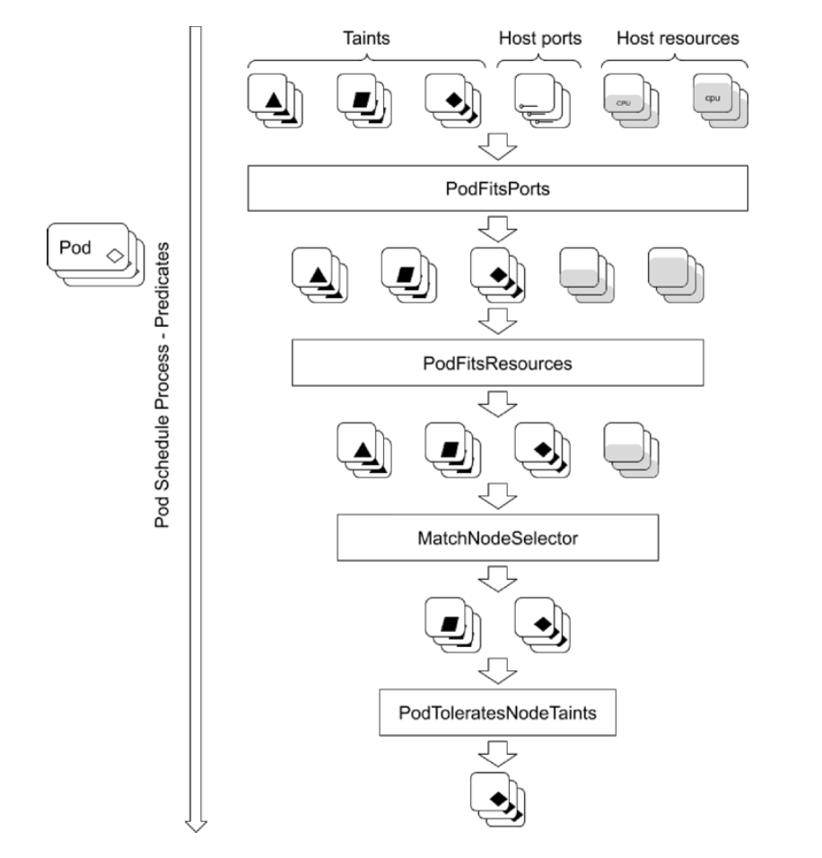

# 1. 概述

kube-shceudle 的调度策略有两种

- predicate: 过滤不符合条件的节点
- priority: 优先级排序, 选择优先级最高的节点

这篇文章会专注介绍这两个调度策略的工作原理，发生作用的阶段及源码解析。

# 2. predicates 策略

predicates 算法主要是对集群中的 node 进行过滤，选出符合当前 pod 运行的 nodes。

## 策略介绍

一个一个插件运行，任何一个插件过滤掉，这个节点就被过滤。

### 1. GeneralPredicates

负责最基础的调度策略

- `PodFitHostPorts`：检查是否有 `Host Ports` 冲突（当 Pod 直接使用主机的 `Port`）
- `PodFitsPorts`：同 `PodFitsHostPorts`
- `PodFitsResources`：检查 `Node` 的资源是否充足，包括允许的 `Pod` 数量、`CPU`、内存、`GPU` 个数以及其他的 `OpaqueIntResources`。
- `HostName`：检查 `pod.Spec.NodeName` 是否与候选节点一致（当指定 Pod 的运行节点）
- `MatchNodeSelector`：检查候选节点的 `pod.Spec.NodeSelector` 是否匹配

Kubernetes 的调度器并没有为 GPU 等硬件资源定义具体的资源类型，而是统一用一种名叫 Extended Resource的、Key-Value 格式的扩展字段来描述的

```yaml
apiVersion: v1
kind: Pod
metadata:
  name: extended-resource-demo
spec:
  containers:
  - name: extended-resource-demo-ctr
    image: nginx
    resources:
      requests:
        alpha.kubernetes.io/nvidia-gpu: 2
      limits:
        alpha.kubernetes.io/nvidia-gpu: 2
```

可以看到，这个 Pod 通过 `alpha.kubernetes.io/nvidia-gpu=2`这样的定义方式，声明使用了两个 NVIDIA 类型的 GPU

而在PodFitsResources里面，调度器其实并不知道这个字段 Key 的含义是 GPU，而是直接使用后面的 Value 进行计算。当然，在 Node 的Capacity字段里，你也得相应地加上这台宿主机上 GPU的总数，比如：`alpha.kubernetes.io/nvidia-gpu=4`

### 2. Volume相关的过滤规则

负责跟容器持久化Volume相关的调度策略

- VolumeZonePredicate: 检查持久化Volume的Zone（高可用域）标签，是否与待考察节点的Zone标签相匹配
- MaxPDVolumeCountPredicate: 检查一个节点上某种类型的持久化Volume是不是已经超过了一定数目，如果是的话，那么声明使用该类型持久化Volume的Pod就不能再调度到这个节点了
- `NoVolumeZoneConflict`：检查 `volume zone` 是否冲突
- `NoDiskConflict`：检查是否存在 `Volume` 冲突，仅限于 GCE PD、AWS EBS、Ceph RBD 以及 iSCSI，eg: 多个Pod声明挂载的持久化Volume是否有冲突。比如，AWS EBS类型的Volume，是不允许被两个Pod同时使用的。所以，当一个名叫A的EBS Volume已经被挂载在了某个节点上时，另一个同样声明使用这个A Volume的Pod，就不能被调度到这个节点上了
- `NoVolumeNodeConflict`：检查节点是否满足 `Pod` 所引用的 `Volume` 的条件
- VolumeBindingPredicate：检查该Pod对应的PV的nodeAffinity字段，是否跟某个节点的标签相匹配（定义local pv 本地持久化卷时，必须使用nodeAffinity来跟某个具体的节点绑定)

### 3. 跟宿主机相关的过滤规则

- `PodToleratesNodeTaints`：检查 `Pod` 是否容忍 `Node Taints`
- `CheckNodeMemoryPressure`：检查 `Pod` 是否可以调度到 `MemoryPressure` 的节点上
- NodeMemoryPressurePredicate：检查当前节点的内存是不是已经不够充足，如果是的话，那么待调度 Pod 就不能被调度到该节点上

### 4. 与 pod相关的过滤规则

- PodAffinityPredicate(`MatchInterPodAffinity`): 检查待调度 Pod 与 Node 上的已有Pod 之间的亲密（affinity）和反亲密（anti-affinity）关系

还有很多其他策略，也可以编写自己的策略，用来过滤节点。

调度器会启动多个Goroutine以节点为粒度并发执行Predicates算法，从而提高这一阶段的执行效率

## predicates plugin 工作原理



在经过插件的层层过滤，剩下符合条件的 Node list

在为每个 Node 执行 Predicates 时，调度器会按照固定的顺序来进行检查。这个顺序，是按照 Predicates 本身的含义来确定的。比如，宿主机相关的Predicates 会被放在相对靠前的位置进行检查。要不然的话，在一台资源已经严重不足的宿主机上，上来就开始计算 PodAffinityPredicate，是没有实际意义的

# 3. Priorities 策略

priorities 调度算法是在 pridicates 算法后执行的，主要功能是对已经过滤出的 nodes 进行打分并选出最佳的一个 node。Priorities算法也会以MapReduce的方式并行计算然后再进行汇总

打分的范围是0-10分，得分最高的节点就是最后被 Pod 绑定的最佳节点

## 策略介绍

不同的 `plugin` 都会有打分，最终会结合 `plugin` 的权重选择 node

- `SelectorSpreadPriority`：优先减少节点上属于同一个 `Service` 或 `Replication Controller` 的 `Pod` 数量
- `InterPodAffinityPriority`：优先将 `Pod` 调度到相同的拓扑上（如同一个节点、Rack、Zone 等）（亲和性）
- `LeastRequestedPriority`：优先调度到请求资源少的节点上即空闲资源最多的节点
- `BalanceResourceAllocation`：优先平衡各节点的资源使用，所有节点里各种资源分配最均衡的那个节点，从而避免一个节点上 CPU 被大量分配、而 Memory 大量剩余的情况
- `NodePreferAvoidPodsPriority`：`alpha.kubernetes.io/preferAvoidPods` 字段判断，权重为 10000，避免其他优先级策略的影响
- `NodeAffinityPriority`：优先调度到匹配 `NodeAffinity` 的节点上
- `TaintTolerationPriority`：优先调度到匹配 `TaintToleration` 的节点上
- `ServiceSpreadPriority`：尽量将同一个 `service` 的 `Pod` 分布到不同节点上，已经被 `SelectorSpreadPriority` 替代（默认未使用）
- `EqualPriority`：将所有节点的优先级设置为 1 （默认未使用）
- `ImageLocalityPriority`：尽量将使用大镜像的容器调度到已经下拉了该镜像的节点上（默认未使用）
- `MostRequestPriority`：尽量调度到已经使用过的 `Node` 上，特别适用于 `cluster-autoscaler` （默认未使用）

# 4. 计算优化

**在实际的执行过程中，调度器里关于集群和 Pod 的信息都已经缓存化，所以这些算法的执行过程还是比较快的。**

此外，对于比较复杂的调度算法来说，比如PodAffinityPredicate，它们在计算的时候不只关注待调度 Pod 和待考察 Node，还需要关注整个集群的信息，比如，遍历所有节点，读取它们的 Labels。这时候，Kubernetes 调度器会在为每个待调度 Pod 执行该调度算法之前，先将算法需要的集群信息初步计算一遍，然后缓存起来。这样，在真正执行该算法的时候，调度器只需要读取缓存信息进行计算即可，从而避免了为每个 Node 计算 Predicates 的时候反复获取和计算整个集群的信息

# 5. 参考与延伸阅读

1. [kube_scheduler_algorithm--田飞雨](https://blog.tianfeiyu.com/source-code-reading-notes/kubernetes/kube_scheduler_algorithm.html)
