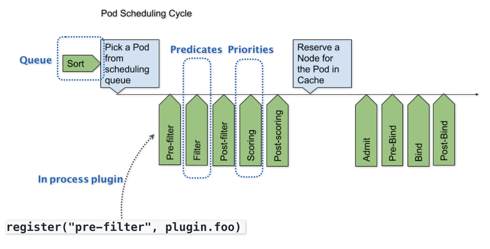

# 背景

随着Kubernetes项目逐步趋于稳定，越来越多的用户开始把Kubernetes用在规模更大、业务更加复杂的私有集群当中。很多以前的Mesos用户，也开始尝试使用Kubernetes来替代其原有架构。在这些场景下，对默认调度器进行扩展和重新实现，就成了社区对Kubernetes项目最主要的一个诉求

## 架构实现

默认调度器的可扩展机制，在Kubernetes里面叫作Scheduler Framework。顾名思义，这个设计的主要目的，就是在调度器生命周期的各个关键点上，为用户暴露出可以进行扩展和实现的接口，从而实现由用户自定义调度器的能力。

上图中，每一个绿色的箭头都是一个可以插入自定义逻辑的接口。比如，上面的Queue部分，就意味着你可以在这一部分提供一个自己的调度队列的实现，从而控制每个Pod开始被调度（出队）的时机。

而Predicates部分，则意味着你可以提供自己的过滤算法实现，根据自己的需求，来决定选择哪些机器。

 **需要注意的是，上述这些可插拔式逻辑，都是标准的Go语言插件机制（Go plugin 机制）** ，也就是说，你需要在编译的时候选择把哪些插件编译进去

# 参考与阅读延伸

1. [字节跳动开源 KubeAdmiral：基于 K8s 的新一代多集群编排调度引擎](https://www.infoq.cn/article/rf8gzjsib9gvhupkdwj5)
2. [crane 使用实践](https://www.qikqiak.com/k3s/skill/crane/)
