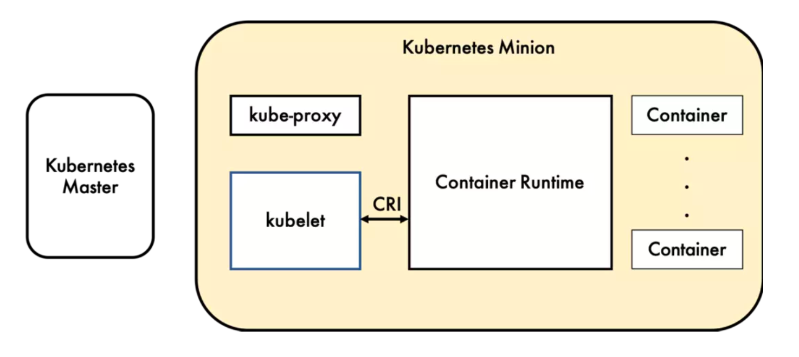
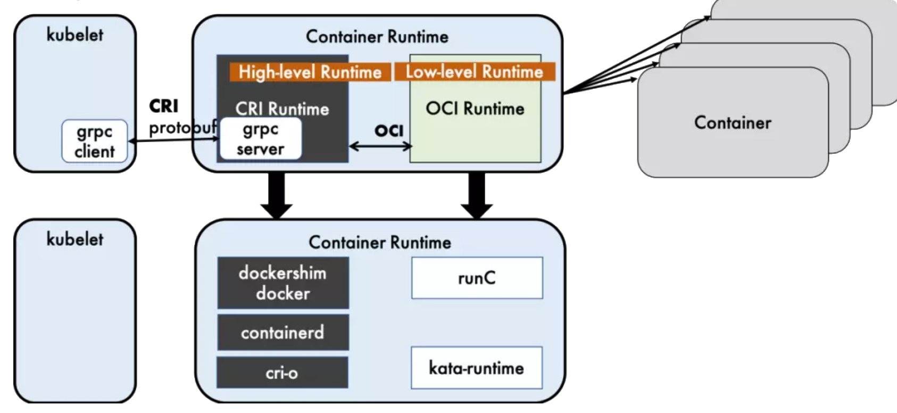
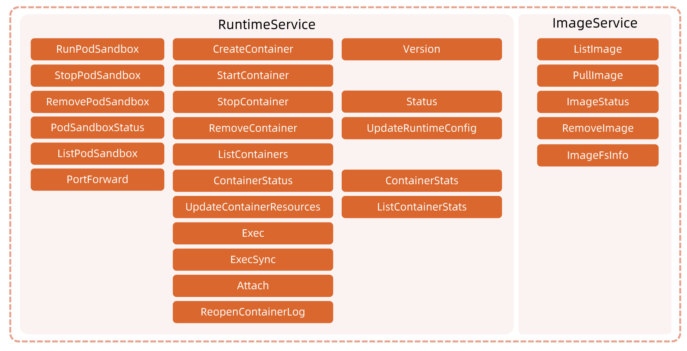
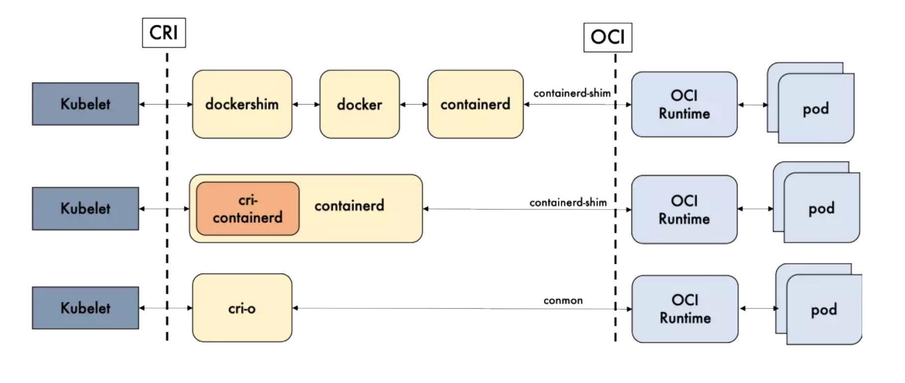
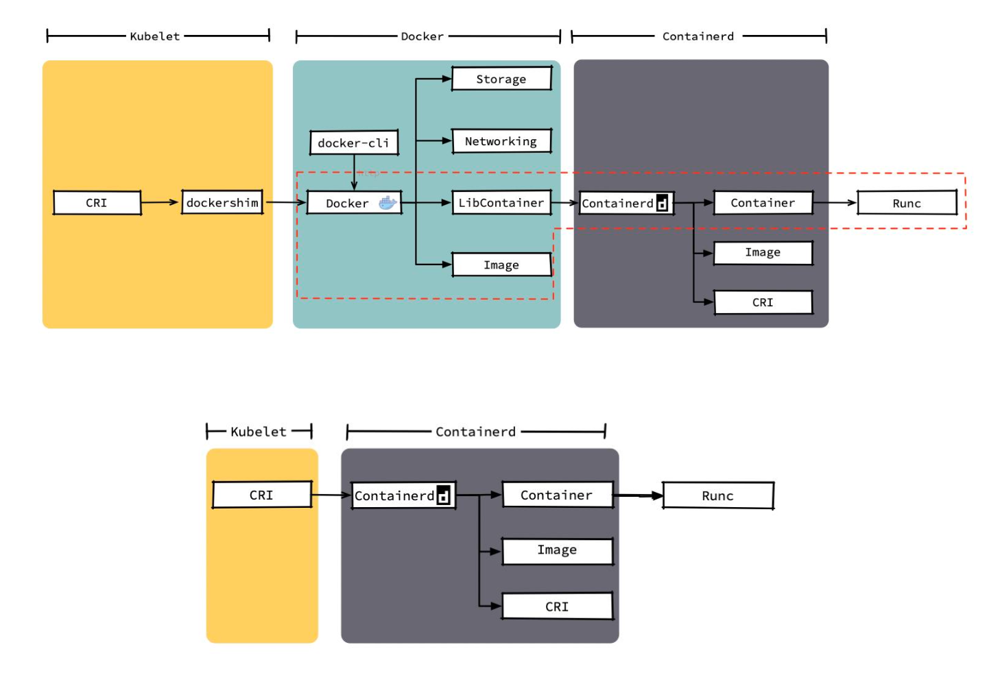
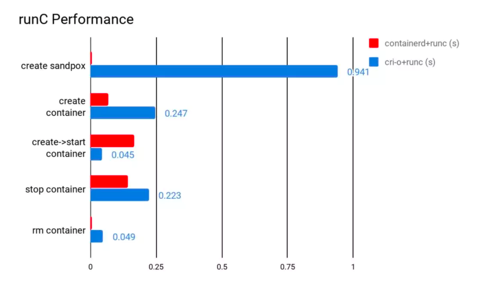

# 1. 简介

容器运行时 （`Container Runtime`），运行于 Kubernetes（`k8s`）集群的每个节点中，负责容器的整个生命周期。其中 `Docker` 是目前应用最广的。随着容器云的发展，越来越多的容器运行时涌现。为了解决这些容器运行时和 Kubernetes 的集成问题，在 Kubernetes 1.5 版本中，社区推出了 `CRI`（Container Runtime Interface，容器运行时接口）以支持更多的容器运行时。

# 2. CRI 实现标准

CRI 是 Kubernetes 定义的一组 `gRPC` 服务（`HTTP/2` 协议 + `protocbuf` 数据结构）。`kubelet` 作为客户端，基于 `gRPC` 框架，通过 `Socket` 和容器运行时通信。

它包括两类服务：镜像服务（`Image Service`）和运行时服务（`Runtime Service`）。

- 镜像服务提供下载、检查和删除镜像的远程程序调用。
- 运行时服务包含用于管理容器生命周期，以及与容器交互的调用（`exec/attach/port-forward`）的远程程序调用。

container runtime 分为 High Level Runtime 和 Low Level Runtime.

- High-level Runtime: `Dockershim`，`containerd` 和 `CRI-O` 都是遵循 CRI 接口标准的 的容器运行时实现，我们称他们为 **高层级运行时** （可以理解为高层级运行时对外提供服务）
- Low-level Runtime: runC, kata-runtime, gVisor (后两者都还处于小规模落地/实验阶段，生态成熟度和使用案例都比较欠缺) （可以理解为低层级运行时就是真正管理容器创建，启动，删除，ns 隔离等底层操作的组件)

> `OCI`（`Open Container Initiative`，开放容器计划）定义了创建容器的格式和运行时的开源行业标准，包括镜像规范（`Image Specification`）和运行时规范（`Runtime Specification`）

> 镜像规范定义了 `OCI` 镜像的标准。高层级运行时将会下载一个 `OCI` 镜像，并把他解压成 `OCI` 运行时文件系统包（`filesystem bundle : /var/lib/docker/overlay2`）
>
> 运行时规范则描述了如何从 `OCI` 运行时文件系统包运行容器程序，并且定义它的配置、运行环境和生命周期。如何为新容器设置命名空间（`namespace`）和控制组（`cgroups`），以及挂载根文件系统等等操作，都是在这里定义的。它的一个参考实现就是 runC

## CRI 实现细节

# 3. 开源 CRI 方案比较

`Docker` 的多层封装和调用，导致其在可维护性上略逊一筹，增加了线上问题的定位难度；几乎除了重启 `Docker`，我们就毫无他法了。

`containerd` 和 `CRI-O` 的方案比起 `Docker` 简洁很多。

## docker vs containerd

## 性能比较

containerd 在各个方面都表现良好，除了启动容器这项。

从总用时来看，containerd 的用时还是要比 CRI-O 要短的。

功能性来将，`containerd` 和 `CRI-O` 都符合 `CRI` 和 `OCI` 的标准；

在稳定性上，`containerd` 略胜一筹

从性能上讲，`containerd` 胜出。

|        | containerd | CRI-O | 备注            |
| ------ | ---------- | ----- | --------------- |
| 性能   | 更优       | 优    |                 |
| 功能   | 优         | 优    | CRI 与 OCI 兼容 |
| 稳定性 | 稳定       | 未知  |                 |

相比三种方案，`containerd` 的方案更优。

# 4. 参考与延伸阅读

1. [云原生训练营-CRI](https://www.xiaoyeshiyu.com/post/ea1d.html#CRI-%E4%BB%8B%E7%BB%8D)
2. [容器运行时分析](./容器运行时分析.md)
