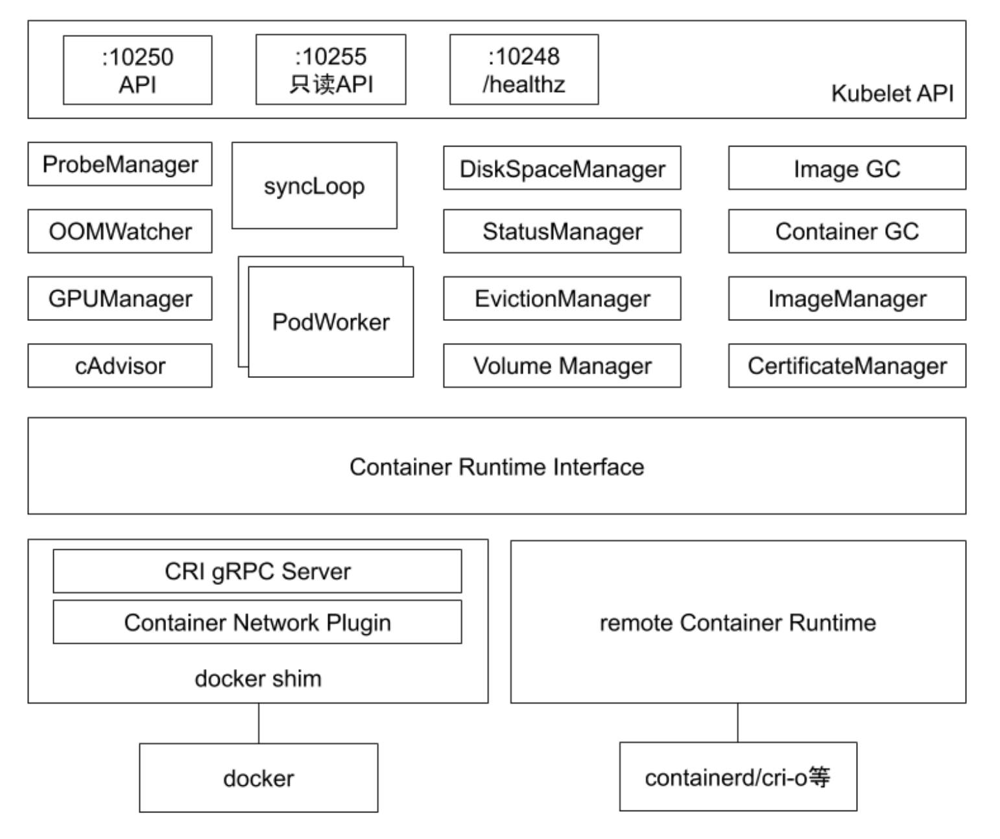
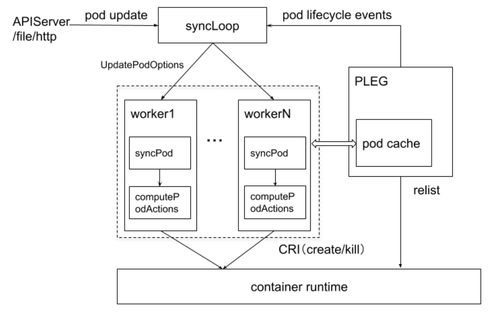
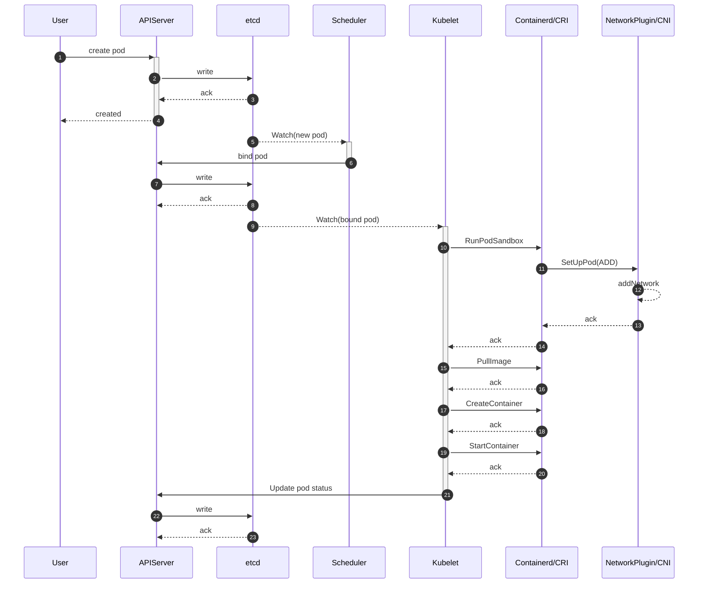
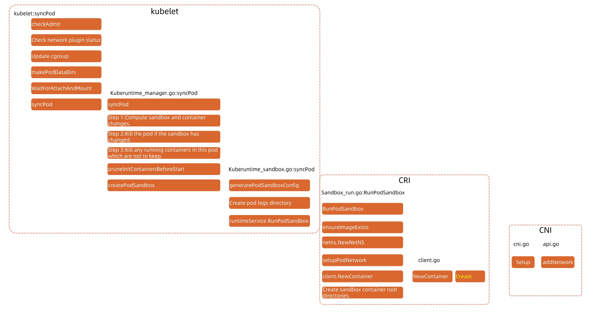
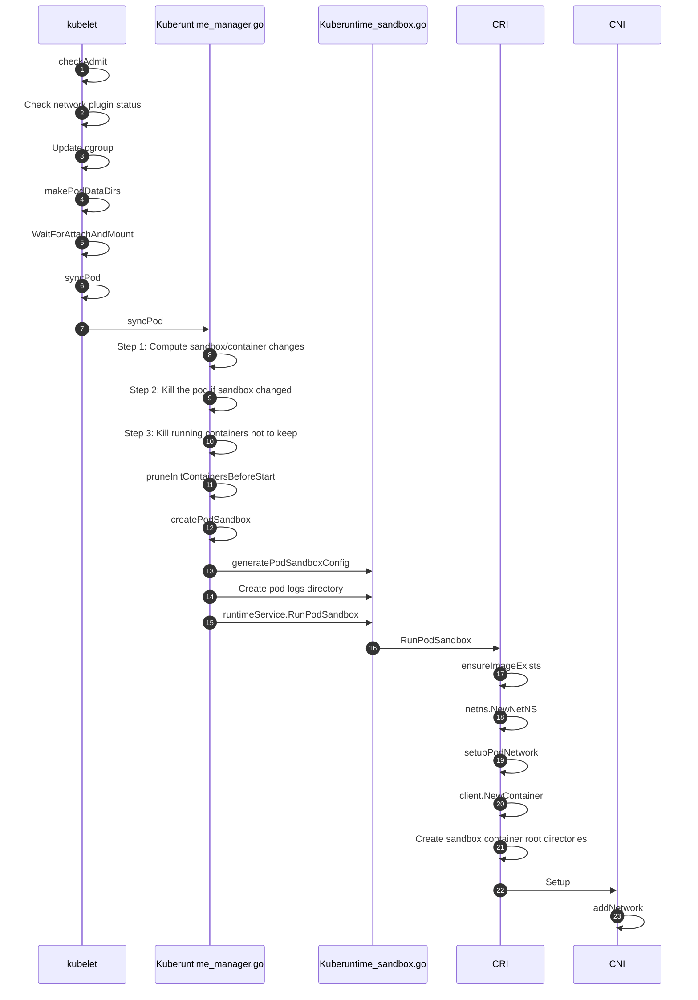
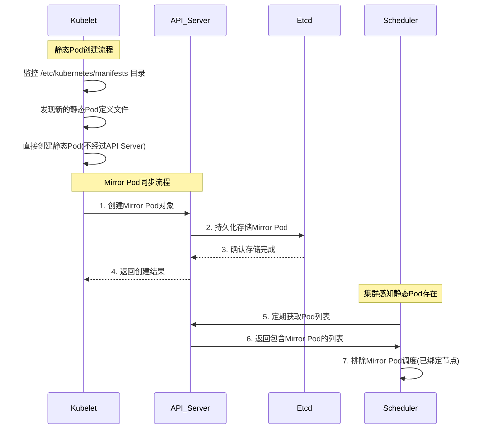

# 1. 概述

**Kubelet 作为 Kubernetes 集群中的 node agent** 。

一方面，kubelet 扮演的是集群控制器的角色，它定期从 API Server 获取 Pod 等相关资源的信息，并依照这些信息，控制运行在节点上 Pod 的执行(创建/更新/删除);

另外一方面， kubelet 作为节点状况的监视器，它获取节点信息，并以集群客户端的角色，把这些 状况同步到 API Server。

# 2. 整体架构

kubelet 也是一个控制器模式，也是扩展插件模式。



- ProbeManager: 为节点上的 Pod 做探活的管理器
- OOMWatcher: 监听那些进程出现 OOM 问题，并上报给 kubelet
- GPUManager: 管理 GPU 等扩展设备
- cAdvisor: 基于 cgroup 技术，获取节点上运行的应用的资源状态
- DiskSpaceManager: 管理节点的磁盘空间大小，容器临时空间
- StatusManager: 管理节点状态
- EvictionManager: 监听当前节点的内存等资源使用情况，如：内存如果已经达到监听的水位，会按照既定策略把低优先级且占用内存量超过预设值的业务容器驱逐
- VolumeManager: 挂载磁盘，存储卷
- Image GC: 清理节点的不活跃 image
- Container GC: 清除已经退出的容器
- ImageManger: 镜像管理
- CertificateManager: 管理证书

kubelet 默认监听四个端口，分别为 10250 、10255、10248、4194。

```
LISTEN     0      128          *:10250                    *:*                   users:(("kubelet",pid=48500,fd=28))
LISTEN     0      128          *:10255                    *:*                   users:(("kubelet",pid=48500,fd=26))
LISTEN     0      128          *:4194                     *:*                   users:(("kubelet",pid=48500,fd=13))
LISTEN     0      128    127.0.0.1:10248                    *:*                   users:(("kubelet",pid=48500,fd=23))
```

- 10250（kubelet API）：kubelet server 与 apiserver 通信的端口，定期请求 apiserver 获取自己所应当处理的任务，通过该端口可以访问获取 node 资源以及状态。
- 10248（健康检查端口）：通过访问该端口可以判断 kubelet 是否正常工作, 通过 kubelet 的启动参数 `--healthz-port` 和 `--healthz-bind-address` 来指定监听的地址和端口。
  ```bash
  $ curl http://127.0.0.1:10248/healthz
  ok
  ```
- 4194（cAdvisor 监听）：kublet 通过该端口可以获取到该节点的环境信息以及 node 上运行的容器状态等内容，访问 [http://localhost:4194](http://localhost:4194/) 可以看到 cAdvisor 的管理界面,通过 kubelet 的启动参数 `--cadvisor-port` 可以指定启动的端口。

```bash
  $ curl  http://127.0.0.1:4194/metrics
```

- 10255 （readonly API）：提供了 pod 和 node 的信息，接口以只读形式暴露出去，访问该端口不需要认证和鉴权。

  ```bash
  //  获取 pod 的接口，与 apiserver 的
  // http://127.0.0.1:8080/api/v1/pods?fieldSelector=spec.nodeName=  接口类似
  $ curl  http://127.0.0.1:10255/pods

  // 节点信息接口,提供磁盘、网络、CPU、内存等信息
  $ curl http://127.0.0.1:10255/spec/
  ```

## 管理 pod 的核心流程



整体设计也是一个生产者消费者模型

- 通过三个源监听 Pod 状态变更，分别是 APIServer，file, http

  - APIServer: kubelet watch apiserver pod 变更事件
  - file: 静态 pod ([static pod](https://kubernetes.io/zh-cn/docs/tasks/configure-pod-container/static-pod/))，如 `/etc/kubernetes/manifests/xx.yaml` 下的静态文件
  - http: 自建 http 服务，调用 kube

- syncLoop 负责监听 Pod 的状态变更，推送事件到队列，worker 监听消费事件，针对每个 pod 做 syncPod。
- PLEG：主要负责 Pod 状态的上报，PLEG 内部维护了 `pod cache`, PLEG 会定期往 `container runtime`内部去发送一个 `list`的操作，来获取当前节点上的 Pod 清单，在内部做汇聚，最终通过 `pod lifeccle events`发回上报给 api-server

> 为什 k8s 要求每个节点设置上限。拿这个 relist 来看，relist 是有开销的，每秒给 CRI 发送一个 list 请求。
>
> 1. 如果 container runtime 不响应，relist 会失败，最终就会导致状态无法上报，k8s 会认为这个节点 no-ready
> 2. 如果节点上的 exit container 非常多，可能会导致 relist 超时，最终也会导致状态无法上报，k8s 会认为这个节点 no-ready

# 3. kubelet 职责

每个节点上都运行一个 `kubelet` 服务进程，默认监听 `10250` 端口

- 接收并执行 apiserver 发来的指令
- 管理 `Pod` 及 `Pod` 中的容器
- 每个 `kubelet` 进程会在 `APIServer` 上注册节点自身信息，定期向 `master` 节点汇报节点的资源使用情况，并通过 `cAdvisor` 监控节点和容器的资源

## 节点管理

节点管理主要是节点自注册和节点状态更新：

- `kubelet` 可以通过设置启动参数 `--register-node` 来确定是否向 `API Server` 注册自己
- 如果 `kubelet` 没有选择自注册模式，则需要用户自己配置 `Node` 资源信息，同时需要告知 `kubelet` 集群上的 `API Server` 的位置
- `kubelet` 在启动时通过 `API Server` 注册节点信息，并定时向 `API Server` 发送节点新信息，`API Server` 在接收到新消息后，将信息写入 `etcd`

## pod 管理

获取 `Pod` 清单：

- 文件：启动参数 `--config` 指定的配置目录下的文件（默认 `/etc/kubernetes/manifests/`）。该文件每 20 秒重新检查一次（可配置）
- `HTTP endpoint`（`URL`）：启动参数 `--manifest-url` 设置。每 20 秒检查一次这个端点（可配置）
- `API Server`：通过 `API Server` 监听 `etcd` 目录，同步 `Pod` 清单
- `HTTP server`：`kubelet` 侦听 `HTTP` 请求，并响应简单的 `API` 以提交新的 `Pod` 清单

# 4. Pod 启动流程分析



sanBoxContainer: pause 容器存在的意义「**Pause 容器就是为解决 Pod 中的网络问题而生的**」

- 如果将容器进程直接加入到网络 namespace，可能因为容器进程本身的不稳定，而导致需要频繁配置网络，加重操作系统负担
- 容器进程的启动有时依赖网络资源的就绪，sandBoxContainer 负责提供这个底座

详细可了解另外一篇文章》[Pause 容器存在的意义 ](https://www.cnblogs.com/panlq/p/17673544.html "发布于 2023-09-02 12:13")「这也是为什么在 Kubernetes 里面，它是允许去单独更新 Pod 里的某一个镜像的，即：做这个操作，整个 Pod 不会重建，也不会重启，这是非常重要的一个设计。」

## 源码调用链路





> 衍生面试题: Pod 启动的时候，CRI、CNI、CSI 的启动顺序是怎么样的? 谁先谁后

> answer: CSI(在 pod shcedule 阶段等待存储 attach 到 node，用于启动容器挂载) -> CRI(run sandBoxContainer) -> CNI(setup pod network) -> 用户容器启动

# 5. 扩展学习

## static-[pod](https://kubernetes.io/zh-cn/docs/tasks/configure-pod-container/static-pod/)

**静态 Pod** 在指定的节点上由 kubelet 守护进程直接管理，不需要 [API 服务器](https://kubernetes.io/zh-cn/docs/concepts/architecture/#kube-apiserver)监管。 与由控制面管理的 Pod（例如，[Deployment](https://kubernetes.io/zh-cn/docs/concepts/workloads/controllers/deployment/)） 不同；kubelet 监视每个静态 Pod（在它失败之后重新启动）。静态 Pod 始终都会绑定到特定节点的 [Kubelet](https://kubernetes.io/zh-cn/docs/reference/generated/kubelet) 上。

kubelet 会尝试通过 Kubernetes API 服务器为每个静态 Pod 自动创建一个[镜像 Pod](https://kubernetes.io/zh-cn/docs/reference/glossary/?all=true#term-mirror-pod)。 这意味着节点上运行的静态 Pod 对 API 服务来说是可见的，但是不能通过 API 服务器来控制。 Pod 名称将把以连字符开头的节点主机名作为后缀。

当 kubelet 从本地文件或 HTTP 源获取到 Static Pod 的定义后，除了在本地节点上启动该 Static Pod，还会向 API 服务器创建一个对应的 Mirror Pod。Kubelet 通过与 API 服务器的交互，将 Static Pod 的状态信息同步到 Mirror Pod 上，使得集群的控制平面能够了解 Static Pod 的状态。

运行中的 kubelet 会定期扫描配置的目录（比如例子中的 `/etc/kubernetes/manifests` 目录）中的变化， 并且根据文件中出现/消失的 Pod 来添加/删除 Pod。



### **为什么需要静态 Pod？**

静态 Pod 的存在主要是为了支持 Kubernetes 集群的启动和运行，特别是控制平面组件的初始化和管理。以下是静态 Pod 的主要优点和用途：

- **无需依赖 API Server**
  静态 Pod 不通过 Kubernetes API Server 管理，而是由 kubelet 直接管理。这种特性使得它们非常适合用来启动和管理控制平面组件，因为这些组件本身是 API Server 的基础。
- **高可用性**
  静态 Pod 的生命周期完全由 kubelet 管理，即使 API Server 出现问题，这些 Pod 仍然可以正常运行。这对于控制平面组件来说至关重要。
- **简化部署**
  使用静态 Pod 可以避免复杂的控制器（如 Deployment 或 DaemonSet）来管理核心组件，从而简化了集群的初始化过程。
- **快速启动**
  静态 Pod 在 kubelet 启动时会被自动加载，因此它们非常适合用来启动集群的关键组件。

### 为什么需要 Mirror Pod？

Mirror Pod 的存在使得 Kubernetes 控制平面能够统一管理和监控所有的 Pod 资源，包括 Static Pod。管理员可以通过 API 服务器提供的接口，方便地查看 Static Pod 的状态、日志，资源占用等信息，就像管理其他通过 API 创建的 Pod 一样，有助于实现的一致性和协同工作。

### 案例

当用 kubeadm 创建集群时，会使用 [`kubeadm init phase control-plane all`](https://kubernetes.io/zh-cn/docs/reference/setup-tools/kubeadm/kubeadm-init-phase/#cmd-phase-control-plane) 命令分别生成主控组件的静态 Pod 清单

kubeadm 将用[于控制平面组件的静态 Pod 清单文件](https://kubernetes.io/zh-cn/docs/reference/setup-tools/kubeadm/implementation-details/#generate-static-pod-manifests-for-control-plane-components)写入 `/etc/kubernetes/manifests` 目录。 kubelet 启动后会监视这个目录以便创建 Pod。

静态 Pod 清单有一些共同的属性：

- 所有静态 Pod 都部署在 `kube-system` 名字空间
- 所有静态 Pod 都打上 `tier:control-plane` 和 `component:{组件名称}` 标签
- 所有静态 Pod 均使用 `system-node-critical` 优先级
- 所有静态 Pod 都设置了 `hostNetwork:true`，使得控制平面在配置网络之前启动；结果导致：

  - 控制器管理器和调度器用来调用 API 服务器的地址为 `127.0.0.1`
  - 如果在本地设置 etcd 服务器，`etcd-servers` 地址将被设置为 `127.0.0.1:2379`

- 同时为控制器管理器和调度器启用了领导者选举
- 控制器管理器和调度器将引用 kubeconfig 文件及其各自的唯一标识
- 如[将自定义参数传递给控制平面组件](https://kubernetes.io/zh-cn/docs/setup/production-environment/tools/kubeadm/control-plane-flags/) 中所述，所有静态 Pod 都会获得用户指定的额外标志或补丁
- 所有静态 Pod 都会获得用户指定的额外卷（主机路径）

# 6. 参考与延伸阅读

1. [kubernetes-scheduler-controller](https://heroyf.com/posts/kubernetes-scheduler-controller#kubelet)
2. [kubectl 创建 Pod 背后到底发生了什么？](https://mp.weixin.qq.com/s/ctdvbasKE-vpLRxDJjwVMw)
3. [Kubelet 中的 “PLEG is not healthy” 到底是个什么鬼？](https://cloud.tencent.com/developer/article/1550038?policyId=1003)
4. [Kubelet 组件解析](https://blog.csdn.net/jettery/article/details/78891733)
5. [微软资深工程师详解 K8S 容器运行时](https://mp.weixin.qq.com/s/Zpvp_or3k23vSMRCLmYNFg)
6. [Kubelet Deep Dive--techiescamp ](https://blog.techiescamp.com/docs/kubelet-deep-dive/)
7. [The Almighty Pause Container](https://www.ianlewis.org/en/almighty-pause-container)
8. [Pod Lifecycle Event Generator: Understanding the &#34;PLEG is not healthy&#34; issue in Kubernetes](https://developers.redhat.com/blog/2019/11/13/pod-lifecycle-event-generator-understanding-the-pleg-is-not-healthy-issue-in-kubernetes#)
