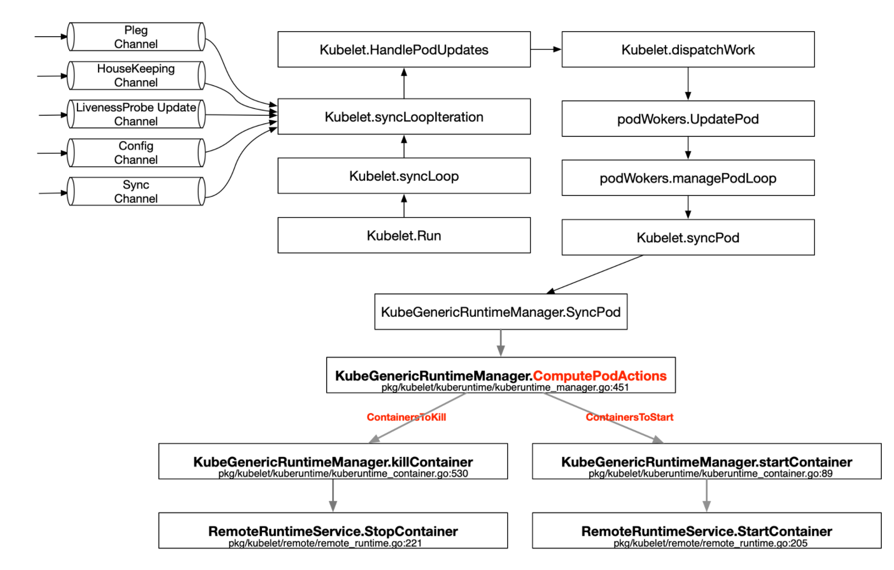

# SyncPod



主要逻辑在 [kuberuntime_manager.go:SyncPod](https://github.com/kubernetes/kubernetes/blob/master/pkg/kubelet/kuberuntime/kuberuntime_manager.go) 方法

```go
// SyncPod syncs the running pod into the desired pod by executing following steps:
//
//  1. Compute sandbox and container changes.
//  2. Kill pod sandbox if necessary.
//  3. Kill any containers that should not be running.
//  4. Create sandbox if necessary.
//  5. Create ephemeral containers.
//  6. Create init containers.
//  7. Resize running containers (if InPlacePodVerticalScaling==true)
//  8. Create normal containers.
func (m *kubeGenericRuntimeManager) SyncPod(ctx context.Context, pod *v1.Pod, podStatus *kubecontainer.PodStatus, pullSecrets []v1.Secret, backOff *flowcontrol.Backoff) (result kubecontainer.PodSyncResult) {
	// Step 1: Compute sandbox and container changes.
	podContainerChanges := m.computePodActions(ctx, pod, podStatus)
	klog.V(3).InfoS("computePodActions got for pod", "podActions", podContainerChanges, "pod", klog.KObj(pod))
	if podContainerChanges.CreateSandbox {
		ref, err := ref.GetReference(legacyscheme.Scheme, pod)
		if err != nil {
			klog.ErrorS(err, "Couldn't make a ref to pod", "pod", klog.KObj(pod))
		}
		if podContainerChanges.SandboxID != "" {
			m.recorder.Eventf(ref, v1.EventTypeNormal, events.SandboxChanged, "Pod sandbox changed, it will be killed and re-created.")
		} else {
			klog.V(4).InfoS("SyncPod received new pod, will create a sandbox for it", "pod", klog.KObj(pod))
		}
	}

	// Step 2: Kill the pod if the sandbox has changed.
	// 如果 sanbox 发生变化，或者容器探针都失败了，直接杀死 pod
	if podContainerChanges.KillPod {
		if podContainerChanges.CreateSandbox {
			klog.V(4).InfoS("Stopping PodSandbox for pod, will start new one", "pod", klog.KObj(pod))
		} else {
			klog.V(4).InfoS("Stopping PodSandbox for pod, because all other containers are dead", "pod", klog.KObj(pod))
		}

		killResult := m.killPodWithSyncResult(ctx, pod, kubecontainer.ConvertPodStatusToRunningPod(m.runtimeName, podStatus), nil)
		result.AddPodSyncResult(killResult)
		if killResult.Error() != nil {
			klog.ErrorS(killResult.Error(), "killPodWithSyncResult failed")
			return
		}

		if podContainerChanges.CreateSandbox {
			m.purgeInitContainers(ctx, pod, podStatus)
		}
	} else {
		// Step 3: kill any running containers in this pod which are not to keep.
		// 删除经过计算法需要删除的正在运行的容器，(例如：容器的image/name发生变化，或者容器的探针失败了，资源变化(配置资源resize的ResourceResizeRestartPolicy))
		for containerID, containerInfo := range podContainerChanges.ContainersToKill {
			klog.V(3).InfoS("Killing unwanted container for pod", "containerName", containerInfo.name, "containerID", containerID, "pod", klog.KObj(pod))
			killContainerResult := kubecontainer.NewSyncResult(kubecontainer.KillContainer, containerInfo.name)
			result.AddSyncResult(killContainerResult)
			if err := m.killContainer(ctx, pod, containerID, containerInfo.name, containerInfo.message, containerInfo.reason, nil, nil); err != nil {
				killContainerResult.Fail(kubecontainer.ErrKillContainer, err.Error())
				klog.ErrorS(err, "killContainer for pod failed", "containerName", containerInfo.name, "containerID", containerID, "pod", klog.KObj(pod))
				return
			}
		}
	}

	// Keep terminated init containers fairly aggressively controlled
	// This is an optimization because container removals are typically handled
	// by container garbage collector.
	m.pruneInitContainersBeforeStart(ctx, pod, podStatus)

	// We pass the value of the PRIMARY podIP and list of podIPs down to
	// generatePodSandboxConfig and generateContainerConfig, which in turn
	// passes it to various other functions, in order to facilitate functionality
	// that requires this value (hosts file and downward API) and avoid races determining
	// the pod IP in cases where a container requires restart but the
	// podIP isn't in the status manager yet. The list of podIPs is used to
	// generate the hosts file.
	//
	// We default to the IPs in the passed-in pod status, and overwrite them if the
	// sandbox needs to be (re)started.
	var podIPs []string
	if podStatus != nil {
		podIPs = podStatus.IPs
	}

	// Step 4: Create a sandbox for the pod if necessary.
	podSandboxID := podContainerChanges.SandboxID
	if podContainerChanges.CreateSandbox {
		// ... 省略
	}

	// the start containers routines depend on pod ip(as in primary pod ip)
	// instead of trying to figure out if we have 0 < len(podIPs)
	// everytime, we short circuit it here
	podIP := ""
	if len(podIPs) != 0 {
		podIP = podIPs[0]
	}

	// Get podSandboxConfig for containers to start.
	configPodSandboxResult := kubecontainer.NewSyncResult(kubecontainer.ConfigPodSandbox, podSandboxID)
	result.AddSyncResult(configPodSandboxResult)
	podSandboxConfig, err := m.generatePodSandboxConfig(pod, podContainerChanges.Attempt)
	if err != nil {
		message := fmt.Sprintf("GeneratePodSandboxConfig for pod %q failed: %v", format.Pod(pod), err)
		klog.ErrorS(err, "GeneratePodSandboxConfig for pod failed", "pod", klog.KObj(pod))
		configPodSandboxResult.Fail(kubecontainer.ErrConfigPodSandbox, message)
		return
	}

	// Helper containing boilerplate common to starting all types of containers.
	// typeName is a description used to describe this type of container in log messages,
	// currently: "container", "init container" or "ephemeral container"
	// metricLabel is the label used to describe this type of container in monitoring metrics.
	// currently: "container", "init_container" or "ephemeral_container"
	start := func(ctx context.Context, typeName, metricLabel string, spec *startSpec) error {
		// ... 省略

		return nil
	}

	// Step 5: start ephemeral containers
	// These are started "prior" to init containers to allow running ephemeral containers even when there
	// are errors starting an init container. In practice init containers will start first since ephemeral
	// containers cannot be specified on pod creation.
	for _, idx := range podContainerChanges.EphemeralContainersToStart {
		start(ctx, "ephemeral container", metrics.EphemeralContainer, ephemeralContainerStartSpec(&pod.Spec.EphemeralContainers[idx]))
	}

	if !utilfeature.DefaultFeatureGate.Enabled(features.SidecarContainers) {
		// Step 6: start the init container.
		if container := podContainerChanges.NextInitContainerToStart; container != nil {
			// Start the next init container.
			if err := start(ctx, "init container", metrics.InitContainer, containerStartSpec(container)); err != nil {
				return
			}

			// Successfully started the container; clear the entry in the failure
			klog.V(4).InfoS("Completed init container for pod", "containerName", container.Name, "pod", klog.KObj(pod))
		}
	} else {
		// 逐个创建初始化容器
		// Step 6: start init containers.
		for _, idx := range podContainerChanges.InitContainersToStart {
			container := &pod.Spec.InitContainers[idx]
			// Start the next init container.
			if err := start(ctx, "init container", metrics.InitContainer, containerStartSpec(container)); err != nil {
				if types.IsRestartableInitContainer(container) {
					klog.V(4).InfoS("Failed to start the restartable init container for the pod, skipping", "initContainerName", container.Name, "pod", klog.KObj(pod))
					continue
				}
				klog.V(4).InfoS("Failed to initialize the pod, as the init container failed to start, aborting", "initContainerName", container.Name, "pod", klog.KObj(pod))
				return
			}

			// Successfully started the container; clear the entry in the failure
			klog.V(4).InfoS("Completed init container for pod", "containerName", container.Name, "pod", klog.KObj(pod))
		}
	}

	// 重新分配容器资源
	// Step 7: For containers in podContainerChanges.ContainersToUpdate[CPU,Memory] list, invoke UpdateContainerResources
	if isInPlacePodVerticalScalingAllowed(pod) {
		if len(podContainerChanges.ContainersToUpdate) > 0 || podContainerChanges.UpdatePodResources {
			m.doPodResizeAction(pod, podStatus, podContainerChanges, result)
		}
	}

	// 创建容器
	// Step 8: start containers in podContainerChanges.ContainersToStart.
	for _, idx := range podContainerChanges.ContainersToStart {
		start(ctx, "container", metrics.Container, containerStartSpec(&pod.Spec.Containers[idx]))
	}

	return
}
```

根据函数注释可以看出主要有一下几个逻辑：

1. 计算 sanbox (pause) 和 容器的变更(包括 init continers, 业务的 contianers)
2. 根据上面的计算结果，删除 ContainersToKill 中记录的容器 (包括 init continers, 业务的 contianers)
3. 在需要时，创建 pause 容器
4. 创建临时容器(用于调试的容器)
5. 逐个创建初始化容器
6. 在需要时，重新分配容器资源
7. 创建业务容器

计算结果存储在下面这个结构体中

```go

// podActions keeps information what to do for a pod.
type podActions struct {
	// Stop all running (regular, init and ephemeral) containers and the sandbox for the pod.
	KillPod bool
	// Whether need to create a new sandbox. If needed to kill pod and create
	// a new pod sandbox, all init containers need to be purged (i.e., removed).
	CreateSandbox bool
	// The id of existing sandbox. It is used for starting containers in ContainersToStart.
	SandboxID string
	// The attempt number of creating sandboxes for the pod.
	Attempt uint32

	// The next init container to start.
	NextInitContainerToStart *v1.Container
	// InitContainersToStart keeps a list of indexes for the init containers to
	// start, where the index is the index of the specific init container in the
	// pod spec (pod.Spec.InitContainers).
	// NOTE: This is a field for SidecarContainers feature. Either this or
	// NextInitContainerToStart will be set.
	InitContainersToStart []int
	// ContainersToStart keeps a list of indexes for the containers to start,
	// where the index is the index of the specific container in the pod spec (
	// pod.Spec.Containers).
	ContainersToStart []int
	// ContainersToKill keeps a map of containers that need to be killed, note that
	// the key is the container ID of the container, while
	// the value contains necessary information to kill a container.
	ContainersToKill map[kubecontainer.ContainerID]containerToKillInfo
	// EphemeralContainersToStart is a list of indexes for the ephemeral containers to start,
	// where the index is the index of the specific container in pod.Spec.EphemeralContainers.
	EphemeralContainersToStart []int
	// ContainersToUpdate keeps a list of containers needing resource update.
	// Container resource update is applicable only for CPU and memory.
	ContainersToUpdate map[v1.ResourceName][]containerToUpdateInfo
	// UpdatePodResources is true if container(s) need resource update with restart
	UpdatePodResources bool
}
```

# 重点关注

## 1. containerChanged-hash

在之前的版本中，hash 是针对整个 `v1.Container` 对象的内容，在 1.27+的版本已经改成只依赖 container.name 和 container.image

这样改解决的问题》[[kubelet]: fixed container restart due to pod spec field changes](https://github.com/kubernetes/kubernetes/pull/124220)

[Kubernetes 1.27: 原地调整 Pod 资源 (alpha)](https://kubernetes.io/zh-cn/blog/2023/05/12/in-place-pod-resize-alpha/) 在原地升级的场景下，支持仅修改资源配额，不重启 pod 和容器。所以 hash 计算的值将其他资源相关的都删除了，在额外的地方进行变更判断

```go
// HashContainer returns the hash of the container. It is used to compare
// the running container with its desired spec.
// Note: remember to update hashValues in container_hash_test.go as well.
func HashContainer(container *v1.Container) uint64 {
	hash := fnv.New32a()
	containerJSON, _ := json.Marshal(pickFieldsToHash(container))
	hashutil.DeepHashObject(hash, containerJSON)
	return uint64(hash.Sum32())
}

// pickFieldsToHash pick fields that will affect the running status of the container for hash,
// currently this field range only contains `image` and `name`.
// Note: this list must be updated if ever kubelet wants to allow mutations to other fields.
func pickFieldsToHash(container *v1.Container) map[string]string {
	retval := map[string]string{
		"name":  container.Name,
		"image": container.Image,
	}
	return retval
}
```

## 2. computePodResizeAction

计算是否需要变更资源配额

```go


func (m *kubeGenericRuntimeManager) computePodResizeAction(pod *v1.Pod, containerIdx int, kubeContainerStatus *kubecontainer.Status, changes *podActions) bool {
	container := pod.Spec.Containers[containerIdx]
	if container.Resources.Limits == nil || len(pod.Status.ContainerStatuses) == 0 {
		return true
	}

	// Determine if the *running* container needs resource update by comparing v1.Spec.Resources (desired)
	// with v1.Status.Resources / runtime.Status.Resources (last known actual).
	// Proceed only when kubelet has accepted the resize a.k.a v1.Spec.Resources.Requests == v1.Status.AllocatedResources.
	// Skip if runtime containerID doesn't match pod.Status containerID (container is restarting)
	apiContainerStatus, exists := podutil.GetContainerStatus(pod.Status.ContainerStatuses, container.Name)
	if !exists || apiContainerStatus.State.Running == nil || apiContainerStatus.Resources == nil ||
		kubeContainerStatus.State != kubecontainer.ContainerStateRunning ||
		kubeContainerStatus.ID.String() != apiContainerStatus.ContainerID ||
		!cmp.Equal(container.Resources.Requests, apiContainerStatus.AllocatedResources) {
		return true
	}

	desiredMemoryLimit := container.Resources.Limits.Memory().Value()
	desiredCPULimit := container.Resources.Limits.Cpu().MilliValue()
	desiredCPURequest := container.Resources.Requests.Cpu().MilliValue()
	currentMemoryLimit := apiContainerStatus.Resources.Limits.Memory().Value()
	currentCPULimit := apiContainerStatus.Resources.Limits.Cpu().MilliValue()
	currentCPURequest := apiContainerStatus.Resources.Requests.Cpu().MilliValue()
	// Runtime container status resources (from CRI), if set, supercedes v1(api) container status resrouces.
	if kubeContainerStatus.Resources != nil {
		if kubeContainerStatus.Resources.MemoryLimit != nil {
			currentMemoryLimit = kubeContainerStatus.Resources.MemoryLimit.Value()
		}
		if kubeContainerStatus.Resources.CPULimit != nil {
			currentCPULimit = kubeContainerStatus.Resources.CPULimit.MilliValue()
		}
		if kubeContainerStatus.Resources.CPURequest != nil {
			currentCPURequest = kubeContainerStatus.Resources.CPURequest.MilliValue()
		}
	}

	// Note: cgroup doesn't support memory request today, so we don't compare that. If canAdmitPod called  during
	// handlePodResourcesResize finds 'fit', then desiredMemoryRequest == currentMemoryRequest.
	if desiredMemoryLimit == currentMemoryLimit && desiredCPULimit == currentCPULimit && desiredCPURequest == currentCPURequest {
		return true
	}

	desiredResources := containerResources{
		memoryLimit:   desiredMemoryLimit,
		memoryRequest: apiContainerStatus.AllocatedResources.Memory().Value(),
		cpuLimit:      desiredCPULimit,
		cpuRequest:    desiredCPURequest,
	}
	currentResources := containerResources{
		memoryLimit:   currentMemoryLimit,
		memoryRequest: apiContainerStatus.Resources.Requests.Memory().Value(),
		cpuLimit:      currentCPULimit,
		cpuRequest:    currentCPURequest,
	}

	resizePolicy := make(map[v1.ResourceName]v1.ResourceResizeRestartPolicy)
	for _, pol := range container.ResizePolicy {
		resizePolicy[pol.ResourceName] = pol.RestartPolicy
	}
	determineContainerResize := func(rName v1.ResourceName, specValue, statusValue int64) (resize, restart bool) {
		if specValue == statusValue {
			return false, false
		}
		if resizePolicy[rName] == v1.RestartContainer {
			return true, true
		}
		return true, false
	}
	markContainerForUpdate := func(rName v1.ResourceName, specValue, statusValue int64) {
		cUpdateInfo := containerToUpdateInfo{
			apiContainerIdx:           containerIdx,
			kubeContainerID:           kubeContainerStatus.ID,
			desiredContainerResources: desiredResources,
			currentContainerResources: &currentResources,
		}
		// 确保资源减少操作（比如减少内存请求）优先于资源增加操作被执行。
		// 因为在调度和资源管理中，减少资源不会导致新的调度问题 ，而增加资源可能需要重新调度或检查节点是否有足够资源
		// Order the container updates such that resource decreases are applied before increases
		switch {
		case specValue > statusValue: // append
			changes.ContainersToUpdate[rName] = append(changes.ContainersToUpdate[rName], cUpdateInfo)
		case specValue < statusValue: // prepend
			changes.ContainersToUpdate[rName] = append(changes.ContainersToUpdate[rName], containerToUpdateInfo{})
			copy(changes.ContainersToUpdate[rName][1:], changes.ContainersToUpdate[rName])
			changes.ContainersToUpdate[rName][0] = cUpdateInfo
		}
	}
	resizeMemLim, restartMemLim := determineContainerResize(v1.ResourceMemory, desiredMemoryLimit, currentMemoryLimit)
	resizeCPULim, restartCPULim := determineContainerResize(v1.ResourceCPU, desiredCPULimit, currentCPULimit)
	resizeCPUReq, restartCPUReq := determineContainerResize(v1.ResourceCPU, desiredCPURequest, currentCPURequest)
	if restartCPULim || restartCPUReq || restartMemLim {
		// resize policy requires this container to restart
		changes.ContainersToKill[kubeContainerStatus.ID] = containerToKillInfo{
			name:      kubeContainerStatus.Name,
			container: &pod.Spec.Containers[containerIdx],
			message:   fmt.Sprintf("Container %s resize requires restart", container.Name),
		}
		changes.ContainersToStart = append(changes.ContainersToStart, containerIdx)
		changes.UpdatePodResources = true
		return false
	} else {
		if resizeMemLim {
			markContainerForUpdate(v1.ResourceMemory, desiredMemoryLimit, currentMemoryLimit)
		}
		if resizeCPULim {
			markContainerForUpdate(v1.ResourceCPU, desiredCPULimit, currentCPULimit)
		} else if resizeCPUReq {
			markContainerForUpdate(v1.ResourceCPU, desiredCPURequest, currentCPURequest)
		}
	}
	return true
}
```

## 3. kill container

## 4. start container

# 小结

基于上面的分析，其实 kubelet 底层对 pod 的升级或更新，是增量式的，但是 k8s 提供的工作负载，Deployment， StatefulSet 都是删除在重建的操作，删除重建在某些情况下是比较消耗资源和耗费时间的，所以要实现原地升级，就要重写工作负载。

原地升级的本质原理就是利用 kubelet 增量更新的逻辑，只修改容器的镜像地址就会触发容器重启，而不会重启整个 pod。

# 参考与延伸阅读

1. [Kubelet 组件解析](https://blog.csdn.net/jettery/article/details/78891733)
2. [Kubernetes 源码分析——kubelet](https://qiankunli.github.io/2018/12/31/kubernetes_source_kubelet.html)
3. [11.深入 k8s：kubelet 工作原理及其初始化源码分析](https://cloud.tencent.com/developer/article/1701500?policyId=1003)
4. [kubelet 启动流程分析](https://cloud.tencent.com/developer/article/1553942?policyId=1003)
5. [Kubernetes 源代码解析](https://github.com/derekguo001/understanding-kubernetes)
