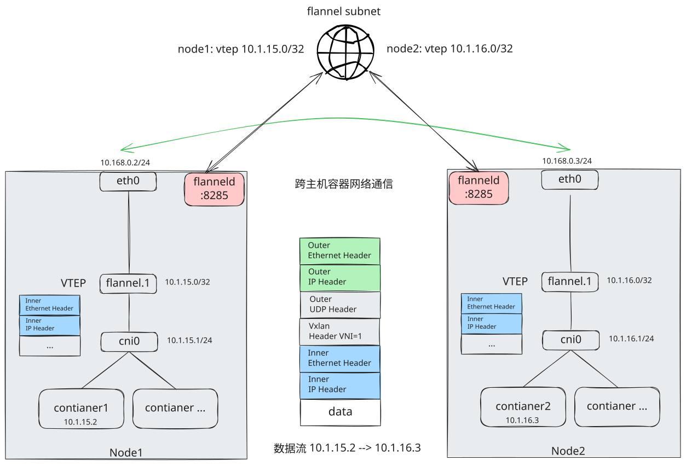
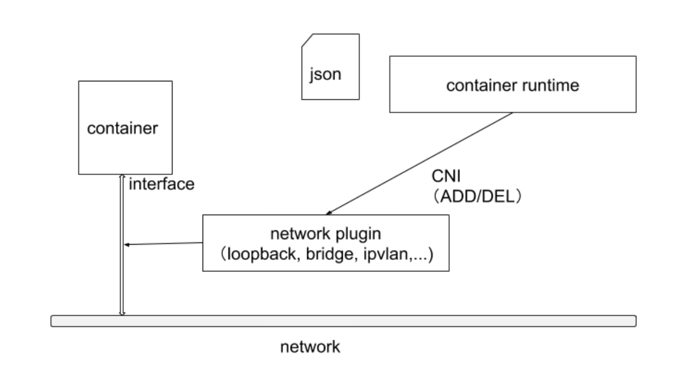
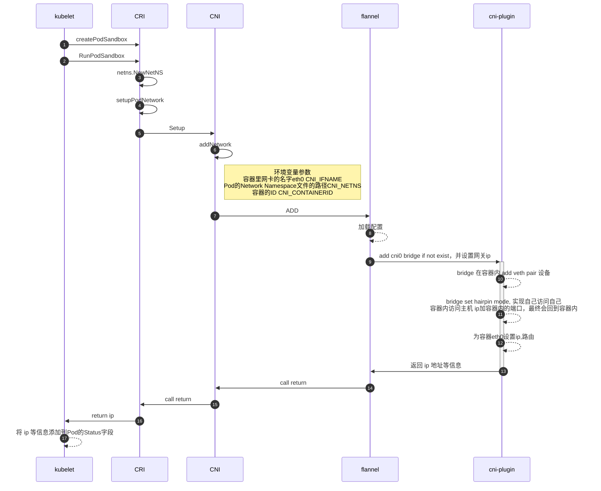

# 1. 简介

Kubernetes 网络模型设计的基础原则是：

- 所有的 `Pod` 能够不通过 `NAT` 就能相互访问
- 所有的节点能够不通过 `NAT` 就能相互访问
- 容器内看见的 `IP` 地址和外部组件看到的容器 `IP` 是一样的

Kubernetes 的集群里，`IP` 地址是以 `Pod` 为单位进行分配的，每个 `Pod` 都拥有一个独立的 `IP` 地址。

一个 `Pod` 内部的所有容器共享一个网络栈，即主机上的一个网络命名空间，包括它们的 `IP` 地址、网络设备、配置等都是共享的。也就是说，`Pod` 里面的所有容器能通过 `localhost:port` 来连接对方。在 Kubernetes 中，提供了一个轻量的通用容器网络接口 `CNI`（`Container Network Interface`），专门用于设置和删除容器的网络连通性。

**Kubernetes里的Pod默认都是“允许所有”（Accept All）网络通信的** ，即：Pod可以接收来自任何发送方的请求；或者，向任何接收方发送请求。而如果你要对这个情况作出限制，就必须通过NetworkPolicy对象来指定

容器运行时通过 `CNI` 调用网络插件来完成容器的网络设置。



## CNI 插件设计考量

- 容器运行时必须在调用任何插件之前为容器创建一个新的网络命名空间
- 容器运行时必须决定这个容器属于哪些网络，针对每个网络，哪些插件必须要执行
- 容器运行时必须加载配置文件，并确定设置网络时哪些插件必须被执行
- 网络配置采用 `JSON` 格式，可以很容易地存储在文件中
- 容器运行时必须按顺序执行配置文件里相应的插件（配置文件中多个 `plugins` 时，链式调用）
- 在完成容器生命周期后，容器运行时必须按照与执行添加容器相反的顺序执行插件，以便将容器与网络断开连接
- 容器运行时被同一容器调用时不能并行操作，但被不同的容器调用时，允许并行操作
- 容器运行时针对一个容器必须按顺序执行 `ADD` 和 `DEL` 操作，`ADD` 后面总是跟着相应的 `DEL`。`DEL` 可能跟着额外的 `DEL`，插件应该允许处理多个 `DEL`
- 容器必须由 `ContainerID` 来唯一标识，需要存储状态的插件需要使用网络名称、容器 `ID` 和网络接口组成的主 `key` 用于索引
- 容器运行时针对同一个网络、同一个容器、同一个网络接口，不能连续调用两次 `ADD` 命令

# CNI 插件的运行机制

在集群初始化时，默认会按照 kubernetes-cni， 目的就是在宿主机上安装 CNI插件所需的基础可执行文件。

默认可执行文件位置：`/opt/cni/bin/`

```bash
# ls /opt/cni/bin/
bandwidth  bridge  calico  calico-ipam  dhcp  dummy  firewall  flannel  host-device  host-local  ipvlan  loopback  macvlan  portmap  ptp  sbr  static  tap  tuning  vlan  vrf

```

按照功能分为三类：

- 第一类：Main插件，用来创建具体网络设备的二进制文件，比如
  - bridge 网桥设备
  - ipvlan
  - lookback 回环设备
  - macvlan
  - ptp veth pair 设备
  - vlan
- 第二类：IPAM (IP Address Management) 插件，负责分配 IP地址的二进制文件，比如
  - dncp 这个文件会向DHCP服务器发起请求
  - host-local   使用预先配置的 IP地址端来进行分配，更高效
- 第三类：由 CNI社区维护的内置 CNI插件，比如
  - flannel  专门为 flannel项目提供的 cni插件
  - tuning  通过 sysctl 调整网络设备
  - portmap 通过 iptables配置端口映射的二进制文件
  - bandwidth. 使用 token bucket filter 来进行限流的二进制文件

如果要实现一个 k8s的容器网络方案，需要做两部分工具，以 flannel项目为例：

- 首先，实现这个网络方案本身，这一部分需要编写，其实就是 flanneld进程里的主要逻辑，如：创建和配置 flannel.1网桥设备，设置宿主机路由，配置 ARP和 FDB表里的信息等
- 其次，实现该网络方案对应的 CNI插件，这一部分主要需要做的，就是配置Infra容器里面的网络栈，并把它连接在CNI网桥上

由于Flannel项目对应的CNI插件已经被内置了，所以它无需再单独安装。而对于Weave、Calico等其他项目来说，我们就必须在安装插件的时候，把对应的CNI插件的可执行文件放在/opt/cni/bin/目录下。

> 对于Weave、Calico，他们的 DaemonSet只需要挂载宿主机的/opt/cni/bin，然后在启动容器时将自身的插件 cp到/opt/cni/bin目录下即可

## 加载配置

容器运行时在启动时会从 `CNI` 的配置目录（默认目录 `/etc/cni/net.d/` ）中读取 `JSON` 格式的配置文件，文件后缀为 `.conf`、`.conflist`、`.json`。如果配置目录中包含多个文件，一般情况下，会以名字排序选用第一个配置文件作为默认的网络配置，并加载获取其中指定的 `CNI` 插件名称和配置参数，执行相关的动作 ADD/DEL

```json

```



$ cat /etc/cni/net.d/10-flannel.conflist
{
  "name": "cbr0",
  "plugins": [
    {
      "type": "flannel",
      "delegate": {
        "hairpinMode": true,
        "isDefaultGateway": true
      }
    },
    {
      "type": "portmap",
      "capabilities": {
        "portMappings": true
      }
    }
  ]
}

以上面配置为例

**CRI会把这个CNI配置文件加载起来，并且把列表里的第一个插件、也就是flannel插件，设置为默认插件** 。而在后面的执行过程中，flannel和portmap插件会按照定义顺序被调用，从而依次完成“配置容器网络”和“配置端口映射”这两步操作

## CNI插件工作原理



CNI的ADD操作需要的环境变量参数包括：容器里网卡的名字eth0（CNI_IFNAME）、Pod的Network Namespace文件的路径（CNI_NETNS）、容器的ID（CNI_CONTAINERID）等

Pod（Infra容器）的Network Namespace文件的路径：/proc/容器进程 PID/ns/net

除此之外，在 CNI 环境变量里，还有一个叫作CNI_ARGS的参数。通过这个参数，CRI实现（比如calico）就可以以Key-Value的格式，传递自定义信息给网络插件。这是用户将来自定义CNI协议的一个重要方法。

# 3. CNI plugin 的对比

| 解决方案  | 是否支持网络策略 | 是否支持 ipv6 | 基于网络层级          | 部署方式  | 命令行    |
| --------- | ---------------- | ------------- | --------------------- | --------- | --------- |
| Calico    | 是               | 是            | L3(IPinIP, BGP)       | DaemonSet | calicoctl |
| Cilium    | 是               | 是            | L3/L4 + L7(filtering) | DaemonSet | cilium    |
| Contiv    | 否               | 是            | L2(VxLan) / L3(BGP)   | DaemonSet | 无        |
| Flannel   | 否               | 否            | L2(VxLan)             | DaemonSet | 无        |
| Weave net | 是               | 是            | L2(VxLan)             | DaemonSet | 无        |

# 4. 参考与延伸阅读

1. [云原生训练营-cni](https://www.xiaoyeshiyu.com/post/ea1d.html#CNI)
2. [深入剖析Kubernetes-Kubernetes网络模型与CNI网络插件--张磊](https://learn.lianglianglee.com/%e4%b8%93%e6%a0%8f/%e6%b7%b1%e5%85%a5%e5%89%96%e6%9e%90Kubernetes/34%20Kubernetes%e7%bd%91%e7%bb%9c%e6%a8%a1%e5%9e%8b%e4%b8%8eCNI%e7%bd%91%e7%bb%9c%e6%8f%92%e4%bb%b6.md)
