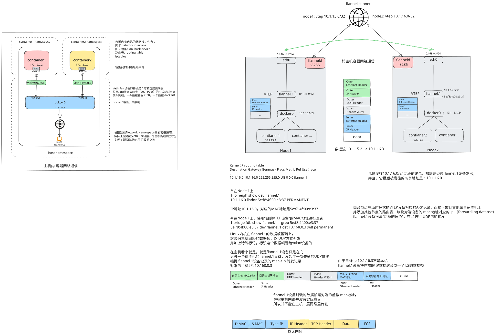

# 容器内网络通信

# 跨主机容器网络通信

> “10.1.23.1/24” 中，“/24” 表示的是子网掩码的一种简洁表示方法，也称为无类别域间路由（CIDR）表示法
>
> 在 IPv4 地址中，IP 地址由 32 位二进制数组成。子网掩码用于划分网络地址和主机地址。“/24” 表示子网掩码的前 24 位为网络位，后 8 位为主机位。
> 将子网掩码用点分十进制表示时，24 位网络位换算后就是 255.255.255.0 。因为 8 位全为 1 时对应的十进制数是 255，24 位网络位即前面三个字节（8 位 / 字节）全为 1，最后一个字节 8 位全为 0（主机位），所以子网掩码是 255.255.255.0

# 参考与延伸阅读

1. [docker网络和iptables规则](https://www.zsythink.net/archives/4409)
2. [聊聊几种主流Docker网络的实现原理](https://zhuanlan.zhihu.com/p/81010026)
3. [Deep dive into Docker Overlay Networks : Part 1](https://rebirth.devoteam.com/2017/04/25/deep-dive-into-docker-overlay-networks-part-1/)
4. [DEEP DIVE INTO DOCKER OVERLAY NETWORKS : PART 1（深入理解Docker的Overlay网络 1）](https://www.jianshu.com/p/3b9389084701)
5. [deep-dive-in-docker-overlay-networks](https://www.slideshare.net/slideshow/deep-dive-in-docker-overlay-networks/75197114)
