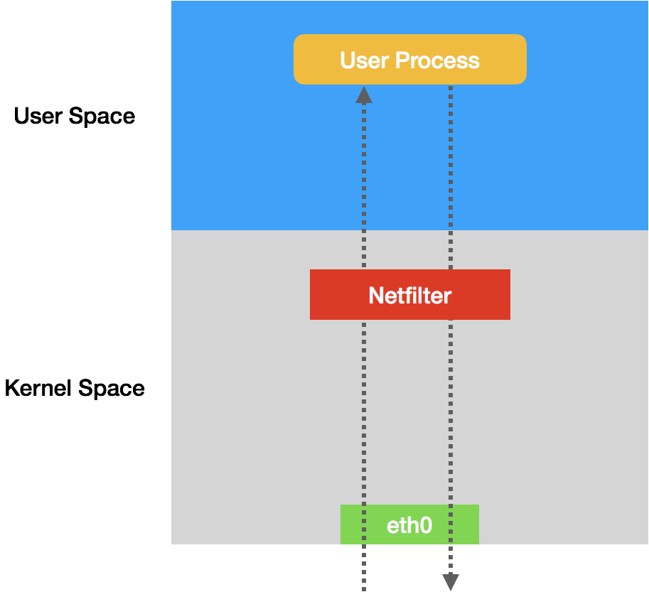
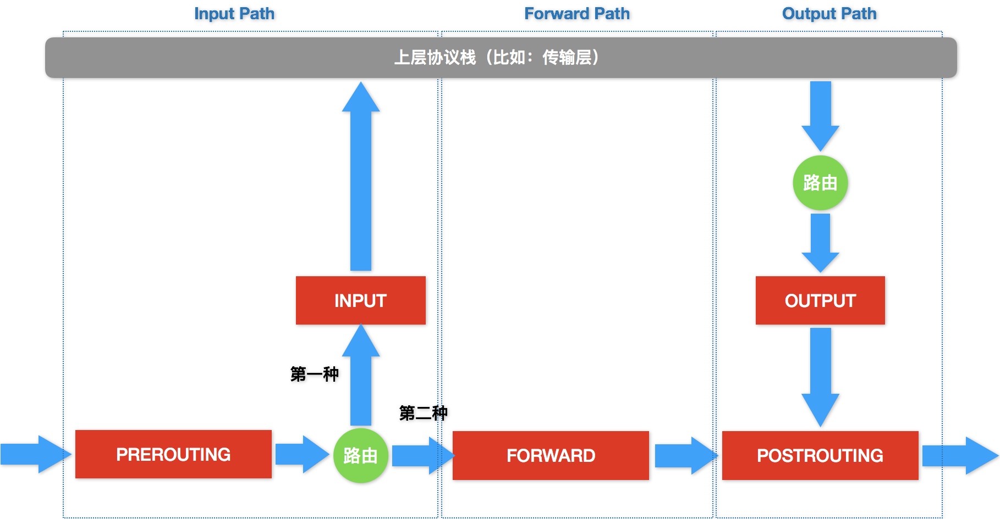

iptables只是一个操作Linux内核Netfilter子系统的“界面”

Netfilter子系统的作用，就是Linux内核里挡在“网卡”和“用户态进程”之间的一道“防火墙”。它们的关系，可以用如下的示意图来表示：

这幅示意图中，IP包“一进一出”的两条路径上，有几个关键的“检查点”，它们正是Netfilter设置“防火墙”的地方。 **在iptables中，这些“检查点”被称为：链（Chain）** 。这是因为这些“检查点”对应的iptables规则，是按照定义顺序依次进行匹配的。这些“检查点”的具体工作原理，可以用如下所示的示意图进行描述

[Netfilter官方的原理图](https://en.wikipedia.org/wiki/Iptables#/media/File:Netfilter-packet-flow.svg)
