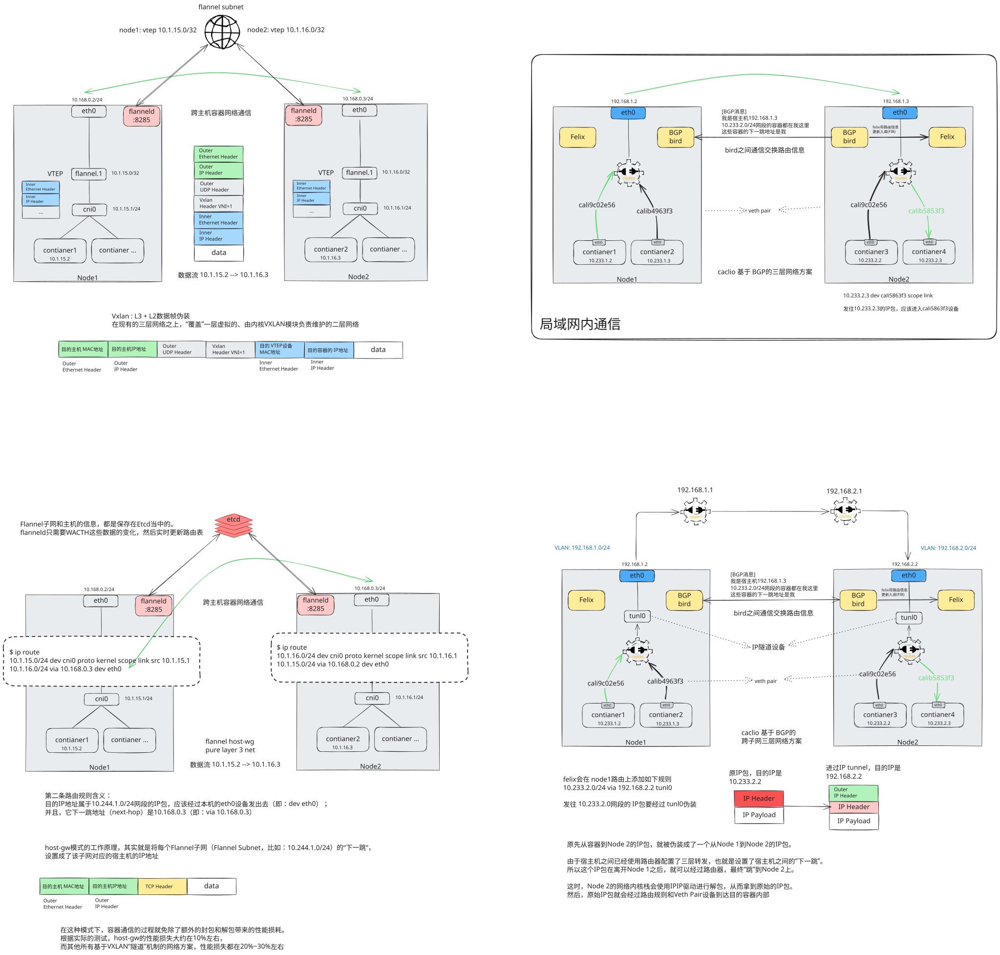
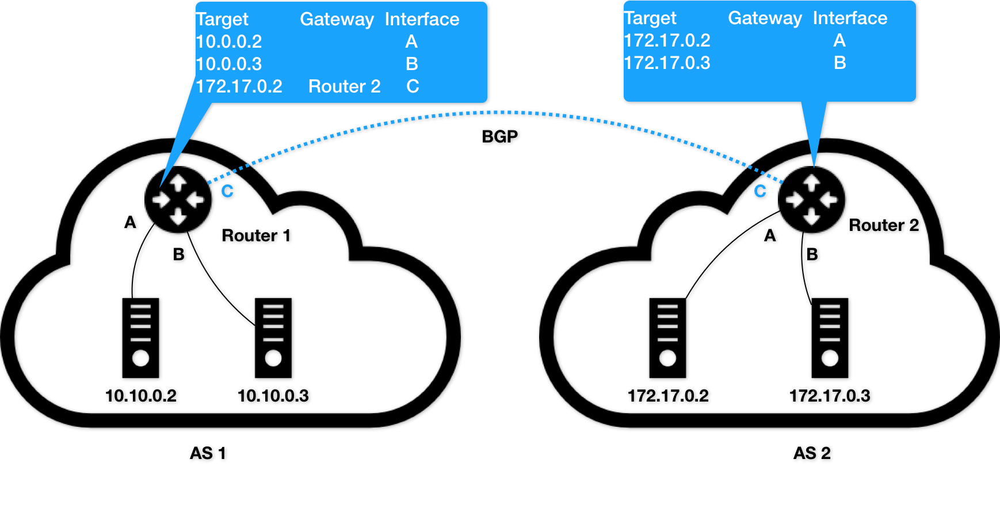
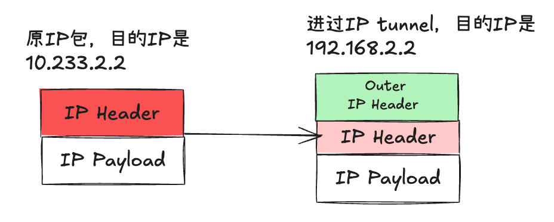

# kubernetes 三层网络方案



# Calico

Calico项目提供的网络解决方案，与Flannel的host-gw模式，几乎是完全一样的。也就是说，Calico也会在每台宿主机上，添加一个格式如下所示的路由规则:

> <目的容器IP地址段> via <网关的IP地址> dev eth0

其中网关IP地址，就是目的容器所在宿主机的 IP地址

三层网络方案得以正常工作的核心，是为每个容器的IP地址，找到它所对应的、“下一跳”的**网关**

**不同于Flannel通过Etcd和宿主机上的flanneld来维护路由信息的做法，Calico项目使用了一个“重型武器”来自动地在整个集群中分发路由信息。**

## BGP

Border Gateway Protocol，边界网关协议，它是一个 Linux内核原生就支持的，专门用在大规模数据中心维护不同‘自治系统’之间路由信息的，无中心路由协议。



这样两个自治系统里的主机，要通过IP地址直接进行通信，我们就必须使用路由器把这两个自治系统连接起来

比如，AS 1里面的主机10.10.0.2，要访问AS 2里面的主机172.17.0.3的话。它发出的IP包，就会先到达自治系统AS 1上的路由器 Router 1。

而在此时，Router 1的路由表里，有这样一条规则，即：目的地址是172.17.0.2包，应该经过Router 1的C接口，发往网关Router 2（即：自治系统AS 2上的路由器）。

所以IP包就会到达Router 2上，然后经过Router 2的路由表，从B接口出来到达目的主机172.17.0.3

你可以想象一下，假设我们现在的网络拓扑结构非常复杂，每个自治系统都有成千上万个主机、无数个路由器，甚至是由多个公司、多个网络提供商、多个自治系统组成的复合自治系统呢？

这时候，如果还要依靠人工来对边界网关的路由表进行配置和维护，那是绝对不现实的。

在使用了BGP之后，你可以认为，在每个边界网关上都会运行着一个小程序，它们会将各自的路由表信息，通过TCP传输给其他的边界网关。而其他边界网关上的这个小程序，则会对收到的这些数据进行分析，然后将需要的信息添加到自己的路由表里

> **所谓BGP，就是在大规模网络中实现节点路由信息共享的一种协议。**

而BGP的这个能力，正好可以取代Flannel维护主机上路由表的功能。而且，BGP这种原生就是为大规模网络环境而实现的协议，其可靠性和可扩展性，远非Flannel自己的方案可比。

## calico 组件构成

1. calico cni插件
2. felix，是一个 daemonset，负责在宿主机上插入路由规则，即写入 Linux内核的 FIB 转发信息库，以及维护 calico所需的网络设备等
3. birt，BGP客户端，专门负责在集群里分发路由规则信息

**除了对路由信息的维护方式之外，Calico项目与Flannel的host-gw模式的另一个不同之处，就是它不会在宿主机上创建任何网桥设备** 。

上图其中的绿色实线标出的路径，就是一个IP包从Node 1上的Container 1，到达Node 2上的Container 4的完整路径。

可以看到，Calico的CNI插件会为每个容器设置一个Veth Pair设备，然后把其中的一端放置在宿主机上（它的名字以cali前缀开头）。

此外，由于Calico没有使用CNI的网桥模式，Calico的CNI插件还需要在宿主机上为每个容器的Veth Pair设备配置一条路由规则，用于接收传入的IP包。比如，宿主机Node 2上的Container 4对应的路由规则，如下所示：

```bash
10.233.2.3 dev cali5863f3 scope link
```

即：发往10.233.2.3的IP包，应该进入cali5863f3设备

有了这样的Veth Pair设备之后，容器发出的IP包就会经过Veth Pair设备出现在宿主机上。然后，宿主机网络栈就会根据路由规则的下一跳IP地址，把它们转发给正确的网关。接下来的流程就跟Flannel host-gw模式完全一致了。

这里的“下一跳"路由规则，就是由Felix进程负责维护，通过 brid组件使用 BGP协议传承。

> Calico项目实际上将集群里的所有节点，都当作是边界路由器来处理，它们一起组成了一个全连通的网络，互相之间通过BGP协议交换路由规则。这些节点，我们称为BGP Peer

## 问题

### BGP peer 链接数量庞大

需要注意的是， **Calico维护的网络在默认配置下，是一个被称为“Node-to-Node Mesh”的模式** 。这时候，每台宿主机上的BGP Client都需要跟其他所有节点的BGP Client进行通信以便交换路由信息。但是，随着节点数量N的增加，这些连接的数量就会以N²的规模快速增长，从而给集群本身的网络带来巨大的压力

所以，Node-to-Node Mesh模式一般推荐用在少于100个节点的集群里。而在更大规模的集群中，你需要用到的是一个叫作Route Reflector的模式

在这种模式下，Calico会指定一个或者几个专门的节点，来负责跟所有节点建立BGP连接从而学习到全局的路由规则。而其他节点，只需要跟这几个专门的节点交换路由信息，就可以获得整个集群的路由规则信息了

这些专门的节点，就是所谓的Route Reflector节点，它们实际上扮演了“中间代理”的角色，从而把BGP连接的规模控制在N的数量级上

### 只能局域网子网内通信

> 子网概念：子网掩码用于区分 IP 地址中的网络位和主机位。将 IP 地址与子网掩码进行按位逻辑与运算，得到的结果就是网络地址。如果两个 IP 地址与同一个子网掩码进行与运算后得到的网络地址相同，那么它们就在同一个子网，否则不在同一个子网。
>
> 假设子网掩码是常见的 255.255.255.0，将 192.168.1.2 与 255.255.255.0 进行与运算，得到 192.168.1.0；将 192.168.2.2 与 255.255.255.0 进行与运算，得到 192.168.2.0。可见，它们的网络地址不同，不在同一个子网

如图 ④，如果现在Container 1要访问Container 4，calico 会在 node1上添加如下路由规则

> 10.233.2.0/16 via 192.168.2.2 eth0

上面这条规则里的下一跳地址是192.168.2.2，可是它对应的Node 2跟Node 1却根本不在一个子网里，没办法通过二层网络把IP包发送到下一跳地址

#### 为什么不在同一个子网无法通信

因为下一跳直接到 192.168.2.2，在不经过route1网关的情况下，是没办法直接访问 192.168.2.2的。不知道对应的 mac地址，二层数据帧无法组装。所以要通过 IPIP伪装成 node1的 ip 来发出去，到目标端点在解包。

如果要跨子网通信，则需要通过 IPIP模式，Calico使用的这个tunl0设备，是一个IP隧道（IP tunnel）设备。IP包进入IP隧道设备之后，就会被Linux内核的IPIP驱动接管。IPIP驱动会将这个IP包直接封装在一个宿主机网络的IP包中



其中，经过封装后的新的IP包的目的地址（图5中的Outer IP Header部分），正是原IP包的下一跳地址，即Node 2的IP地址：192.168.2.2。

而原IP包本身，则会被直接封装成新IP包的Payload。

这样，原先从容器到Node 2的IP包，就被伪装成了一个从Node 1到Node 2的IP包。

由于宿主机之间已经使用路由器配置了三层转发，也就是设置了宿主机之间的“下一跳”。所以这个IP包在离开Node 1之后，就可以经过路由器，最终“跳”到Node 2上。

这时，Node 2的网络内核栈会使用IPIP驱动进行解包，从而拿到原始的IP包。然后，原始IP包就会经过路由规则和Veth Pair设备到达目的容器内部

## 私有化环境方案

不难看到，当Calico使用IPIP模式的时候，集群的网络性能会因为额外的封包和解包工作而下降。在实际测试中，Calico IPIP模式与Flannel VXLAN模式的性能大致相当。所以，在实际使用时，如非硬性需求，我建议你将所有宿主机节点放在一个子网里，避免使用IPIP。

基于上面 calico局域网通信的原理，是不是也能在宿主机的路由设备之前也加上 BGP协议，学习路由规则配置。


只要在图④中的 Node1上添加如下路由规则：

> 10.233.2.0/24 via 192.168.1.1 eth0

然后在 route1 (192.168.1.1) 上添加如下路由规则：

> 10.233.2.0/24 via 192.168.2.1 eth0

那么Container 1发出的IP包，就可以通过两次“下一跳”，到达Router 2（192.168.2.1）了。以此类推，我们可以继续在Router 2上添加“下一条”路由，最终把IP包转发到Node 2上

但是在公有云环境下，宿主机之间的网关是不允许用户进行干预和设置的。正常大多数公有云环境下，宿主机之间都是二层连通的。

在私有部署的环境下，宿主机属于不同子网（VLAN）反而是更加常见的部署状态。这时候，想办法将宿主机网关也加入到BGP Mesh里从而避免使用IPIP，就成了一个非常迫切的需求

### 方案1 所有宿主机都跟宿主机网关建立BGP Peer关系


这种方案下，Node 1和Node 2就需要主动跟宿主机网关Router 1和Router 2建立BGP连接。从而将类似于10.233.2.0/24这样的路由信息同步到网关上去。

需要注意的是，这种方式下，Calico要求宿主机网关必须支持一种叫作Dynamic Neighbors的BGP配置方式。这是因为，在常规的路由器BGP配置里，运维人员必须明确给出所有BGP Peer的IP地址。考虑到Kubernetes集群可能会有成百上千个宿主机，而且还会动态地添加和删除节点，这时候再手动管理路由器的BGP配置就非常麻烦了。而Dynamic Neighbors则允许你给路由器配置一个网段，然后路由器就会自动跟该网段里的主机建立起BGP Peer关系

### 方案 2 使用 Route Reflector的模式

使用一个或多个独立组件负责搜集整个集群里的所有路由信息，然后通过BGP协议同步给网关。而我们前面提到，在大规模集群中，Calico本身就推荐使用Route Reflector节点的方式进行组网。所以，这里负责跟宿主机网关进行沟通的独立组件，直接由Route Reflector兼任即可。

更重要的是，这种情况下网关的BGP Peer个数是有限并且固定的。所以我们就可以直接把这些独立组件配置成路由器的BGP Peer，而无需Dynamic Neighbors的支持。

当然，这些独立组件的工作原理也很简单：它们只需要WATCH Etcd里的宿主机和对应网段的变化信息，然后把这些信息通过BGP协议分发给网关即可

# 参考与延伸阅读

1. [BGP是什么，BGP是如何工作的](https://info.support.huawei.com/info-finder/encyclopedia/zh/BGP.html)
2. [深入解析kubernetes-解读Kubernetes三层网络方案-张磊](https://learn.lianglianglee.com/%e4%b8%93%e6%a0%8f/%e6%b7%b1%e5%85%a5%e5%89%96%e6%9e%90Kubernetes/35%20%e8%a7%a3%e8%af%bbKubernetes%e4%b8%89%e5%b1%82%e7%bd%91%e7%bb%9c%e6%96%b9%e6%a1%88.md)
