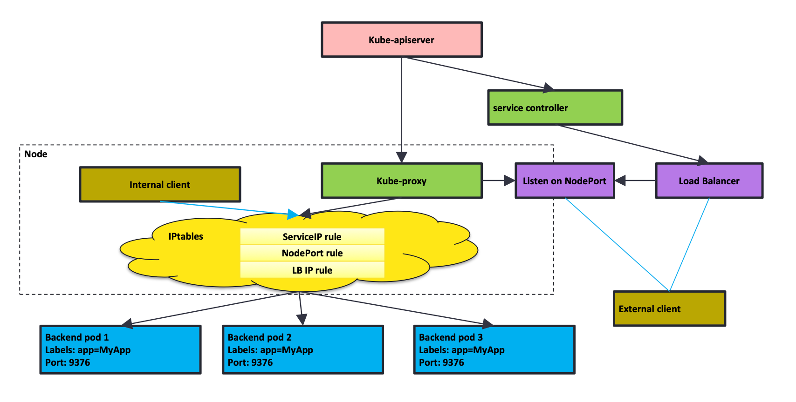
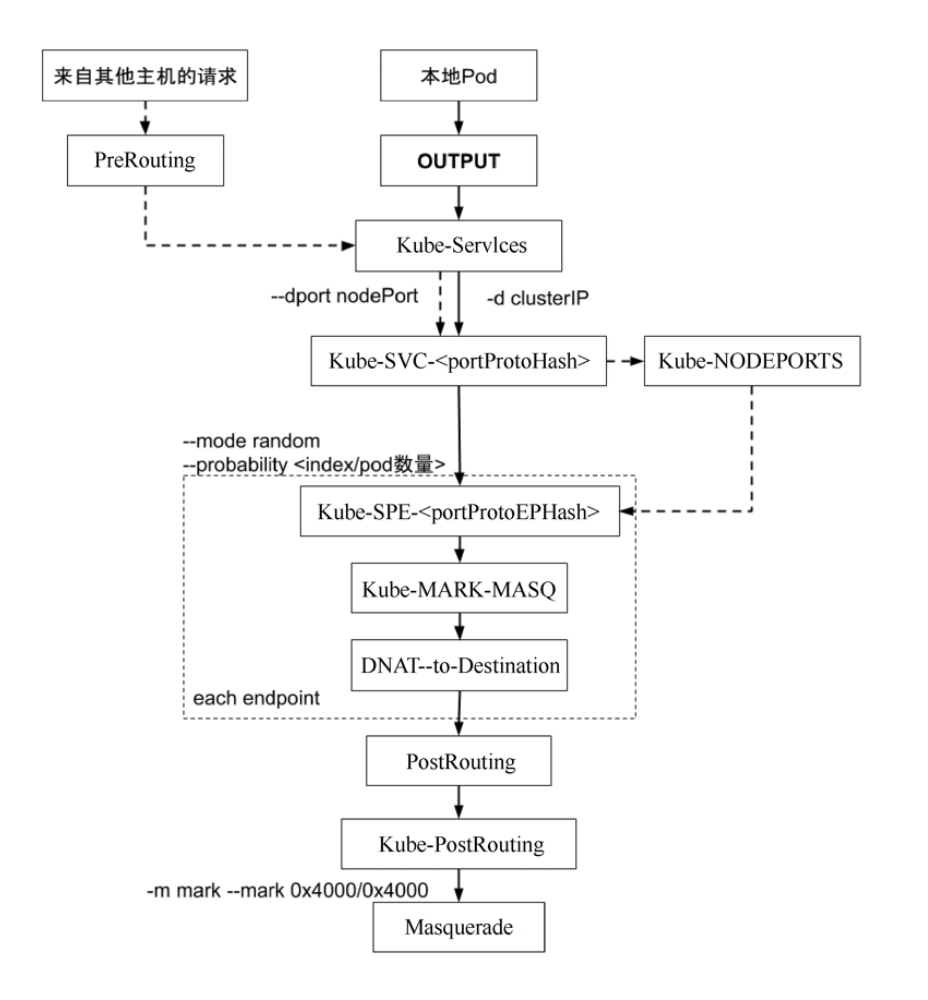
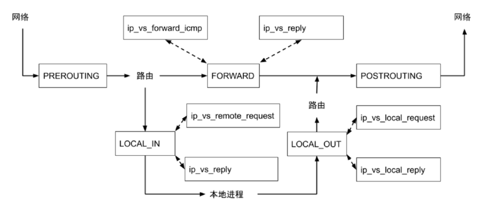

# 1. 概述

每台机器上都运行一个 `kube-proxy` 服务，它监听 `API Server` 中 `service` （负载均衡 IP 和对应 `endpoint` ）和 `endpoint` （ Pod 信息）的变化情况，并通过 `iptables` 等来为服务配置负载均衡（仅支持 `TCP` 和 `UDP`）

`kube-proxy` 可以直接运行在物理机上，也可以以 `static pod` 或者 `DaemonSet` 的方式运行



# 2. 工作模式

## userspace

`winuserspace`：同 `userspace`，但仅工作在 `windows` 上

**这种模式下kube-proxy进程在用户空间监听一个本地端口，iptables规则将流量转发到这个本地端口，然后kube-proxy在其内部应用层建立到具体后端的连接，即在其内部负载均衡进行转发，这是在用户空间的转发，虽然比较稳定，但效率不高。userspace模式是kube-proxy早期(Kubernetes 1.0)的模式，早就不推荐使用，也不会被我们使用。**

有明显的性能瓶颈（内核态 网卡处理 -> 用户态 kube-proxy -> 内核态 转发到对应网口）


## iptables

**这种模式是从Kubernetes 1.2开始并在Kubernetes 1.12之前的默认方式。在这种模式下kube-proxy监控Kubernetes对Service、Endpoint对象的增删改操作。监控到Service对象的增删改，将配置iptables规则，截获到Service的ClusterIp和端口的流量并将其重定向到服务的某个后端；监控到Endpoint对象的增删改，将更新具体到某个后端的iptables规则。iptables模式基于netfilter，但因为流量的转发都是在Kernel Space，所以性能更高且更加可靠。 这种模式的缺点是，对于超大规模集群，当集群中服务数量达到一定量级时，iptables规则的添加将会出现很大延迟，因为规则的更新要全量刷新 iptables规则文件，所以此时将会出现性能问题，据这篇文章中**[《华为云在 K8S 大规模场景下的 Service 性能优化实践》](https://zhuanlan.zhihu.com/p/37230013)介绍当Service数量达到5000个，iptables规则基数为40000，增加一条规则的时间将达到11分钟。


## ipvs

**这种模式从Kubernetes 1.11进入GA，并在Kubernetes 1.12成为kube-proxy的默认代理模式。ipvs模式也是基于netfilter，对比iptables模式在大规模Kubernetes集群有更好的扩展性和性能，支持更加复杂的负载均衡算法(如：最小负载、最少连接、加权等)，支持Server的健康检查和连接重试等功能。ipvs依赖于iptables，使用iptables进行包过滤、SNAT、masquared。ipvs将使用** `ipset`需要被DROP或MASQUARED的源地址或目标地址，这样就能保证iptables规则数量的固定，我们不需要关心集群中有多少个Service了。

采用增量式更新，解决了 `iptables` 模式的性能问题


# 3. 案例yaml

service

```yaml
apiVersion: v1
kind: Service
metadata:
  name: hostnames
spec:
  selector:
    app: hostnames
  ports:
  - name: default
    protocol: TCP
    port: 80
    targetPort: 9376
```

deployment

```yaml
apiVersion: apps/v1
kind: Deployment
metadata:
  name: hostnames
spec:
  selector:
    matchLabels:
      app: hostnames
  replicas: 3
  template:
    metadata:
      labels:
        app: hostnames
    spec:
      containers:
      - name: hostnames
        image: k8s.gcr.io/serve_hostname
        ports:
        - containerPort: 9376
          protocol: TCP
```

```bash
$ kubectl get endpoints hostnames
NAME        ENDPOINTS
hostnames   10.244.0.5:9376,10.244.0.6:9376,10.244.0.7:9376
```

# 4. iptables 模式



## 工作链

```bash
# iptables模式下 kube-proxy作用于PREROUTING和OUTPUT链

-A PREROUTING -m comment --comment "kubernetes service portals" -j KUBE-SERVICES
-A OUTPUT -m comment --comment "kubernetes service portals" -j KUBE-SERVICES

# cluster ip
-A KUBE-SERVICES -d 10.0.1.175/32 -p tcp -m comment --comment "default/hostnames: cluster IP" -m tcp --dport 80 -j KUBE-SVC-NWV5X2332I4OT4T3

# nodeport
-A KUBE-NODEPORT -p tcp -m comment --comment "default/hostnames: nodeport" -m tcp --dport 30207 -j KUBE-SVC-NWV5X2332I4OT4T3


-A KUBE-SVC-NWV5X2332I4OT4T3 -m comment --comment "default/hostnames:" -m statistic --mode random --probability 0.33332999982 -j KUBE-SEP-WNBA2IHDGP2BOBGZ
-A KUBE-SVC-NWV5X2332I4OT4T3 -m comment --comment "default/hostnames:" -m statistic --mode random --probability 0.50000000000 -j KUBE-SEP-X3P2623AGDH6CDF3
-A KUBE-SVC-NWV5X2332I4OT4T3 -m comment --comment "default/hostnames:" -j KUBE-SEP-57KPRZ3JQVENLNBR


-A KUBE-SEP-57KPRZ3JQVENLNBR -s 10.244.3.6/32 -m comment --comment "default/hostnames:" -j MARK --set-xmark 0x00004000/0x00004000
-A KUBE-SEP-57KPRZ3JQVENLNBR -p tcp -m comment --comment "default/hostnames:" -m tcp -j DNAT --to-destination 10.244.3.6:9376

-A KUBE-SEP-WNBA2IHDGP2BOBGZ -s 10.244.1.7/32 -m comment --comment "default/hostnames:" -j MARK --set-xmark 0x00004000/0x00004000
-A KUBE-SEP-WNBA2IHDGP2BOBGZ -p tcp -m comment --comment "default/hostnames:" -m tcp -j DNAT --to-destination 10.244.1.7:9376

-A KUBE-SEP-X3P2623AGDH6CDF3 -s 10.244.2.3/32 -m comment --comment "default/hostnames:" -j MARK --set-xmark 0x00004000/0x00004000
-A KUBE-SEP-X3P2623AGDH6CDF3 -p tcp -m comment --comment "default/hostnames:" -m tcp -j DNAT --to-destination 10.244.2.3:9376

```

```bash
# cluster ip
-A KUBE-SERVICES -d 10.0.1.175/32 -p tcp -m comment --comment "default/hostnames: cluster IP" -m tcp --dport 80 -j KUBE-SVC-NWV5X2332I4OT4T3

```

这条iptables规则的含义是：凡是目的地址是10.0.1.175、目的端口是80的IP包，都应该跳转到另外一条名叫KUBE-SVC-NWV5X2332I4OT4T3的iptables链进行处理。由于10.0.1.175只是一条iptables规则上的配置，并没有真正的网络设备，所以你ping这个地址，是不会有任何响应的

跳到到KUBE-SVC-NWV5X2332I4OT4T3规则

```bash
-A KUBE-SVC-NWV5X2332I4OT4T3 -m comment --comment "default/hostnames:" -m statistic --mode random --probability 0.33332999982 -j KUBE-SEP-WNBA2IHDGP2BOBGZ
-A KUBE-SVC-NWV5X2332I4OT4T3 -m comment --comment "default/hostnames:" -m statistic --mode random --probability 0.50000000000 -j KUBE-SEP-X3P2623AGDH6CDF3
-A KUBE-SVC-NWV5X2332I4OT4T3 -m comment --comment "default/hostnames:" -j KUBE-SEP-57KPRZ3JQVENLNBR

```


这一组规则，实际上是一组随机模式（–mode random）的iptables链。

而随机转发的目的地，分别是KUBE-SEP-WNBA2IHDGP2BOBGZ、KUBE-SEP-X3P2623AGDH6CDF3和KUBE-SEP-57KPRZ3JQVENLNBR。

而这三条链指向的最终目的地，其实就是这个Service代理的三个Pod。所以这一组规则，就是Service实现负载均衡的位置。

需要注意的是，iptables规则的匹配是从上到下逐条进行的，所以为了保证上述三条规则每条被选中的概率都相同，我们应该将它们的probability字段的值分别设置为1/3（0.333…）、1/2和1。

这么设置的原理很简单：第一条规则被选中的概率就是1/3；而如果第一条规则没有被选中，那么这时候就只剩下两条规则了，所以第二条规则的probability就必须设置为1/2；类似地，最后一条就必须设置为1

通过 RR 最终跳到的链路如下

```bash
-A KUBE-SEP-57KPRZ3JQVENLNBR -s 10.244.3.6/32 -m comment --comment "default/hostnames:" -j MARK --set-xmark 0x00004000/0x00004000
-A KUBE-SEP-57KPRZ3JQVENLNBR -p tcp -m comment --comment "default/hostnames:" -m tcp -j DNAT --to-destination 10.244.3.6:9376

-A KUBE-SEP-WNBA2IHDGP2BOBGZ -s 10.244.1.7/32 -m comment --comment "default/hostnames:" -j MARK --set-xmark 0x00004000/0x00004000
-A KUBE-SEP-WNBA2IHDGP2BOBGZ -p tcp -m comment --comment "default/hostnames:" -m tcp -j DNAT --to-destination 10.244.1.7:9376

-A KUBE-SEP-X3P2623AGDH6CDF3 -s 10.244.2.3/32 -m comment --comment "default/hostnames:" -j MARK --set-xmark 0x00004000/0x00004000
-A KUBE-SEP-X3P2623AGDH6CDF3 -p tcp -m comment --comment "default/hostnames:" -m tcp -j DNAT --to-destination 10.244.2.3:9376

```

这三条链，其实是三条DNAT规则。但在DNAT规则之前，iptables对流入的IP包还设置了一个“标志”（–set-xmark）

而DNAT规则的作用，就是在PREROUTING检查点之前，也就是在路由之前，将流入IP包的目的地址和端口，改成–to-destination所指定的新的目的地址和端口。可以看到，这个目的地址和端口，正是被代理Pod的IP地址和端口。

### 小结

1. KUBE-SERVICES或者KUBE-NODEPORTS规则对应的Service的入口链，这个规则应该与VIP和Service端口一一对应；
2. KUBE-SEP-(hash)规则对应的DNAT链，这些规则应该与Endpoints一一对应；
3. KUBE-SVC-(hash)规则对应的负载均衡链，这些规则的数目应该与 Endpoints 数目一致；
4. 如果是NodePort模式的话，还有POSTROUTING处的SNAT链

### clusterip

ClusterIP 模式主要用于集群内部的 Pod 之间通过 Service 进行通信。在这种模式下，流量仅在集群内部流转，所有的 Pod 都在集群网络范围内，并且它们的 IP 地址是集群内部的私有地址。

其底层规则就是上面的工作链

### nodeport

在NodePort方式下，Kubernetes会在IP包离开宿主机发往目的Pod时，对这个IP包做一次SNAT操作，如下所示：

```bash
-A KUBE-POSTROUTING -m comment --comment "kubernetes service traffic requiring SNAT" -m mark --mark 0x4000/0x4000 -j MASQUERADE
```

可以看到，这条规则设置在POSTROUTING检查点，也就是说，它给即将离开这台主机的IP包，进行了一次SNAT操作，将这个IP包的源地址替换成了这台宿主机上的CNI网桥地址，或者宿主机本身的IP地址（如果CNI网桥不存在的话）。

当然，这个SNAT操作只需要对Service转发出来的IP包进行（否则普通的IP包就被影响了）。而iptables做这个判断的依据，就是查看该IP包是否有一个“0x4000”的“标志”。你应该还记得，这个标志正是在IP包被执行DNAT操作之前被打上去的

**为什么一定要对流出的包做SNAT**操作**呢？**

这里的原理其实很简单，如下所示：

```lua
           client
             \ ^
              \ \
               v \
   node 1 <--- node 2
    | ^   SNAT
    | |   --->
    v |
 endpoint
```

当一个外部的client通过node 2的地址访问一个Service的时候，node 2上的负载均衡规则，就可能把这个IP包转发给一个在node 1上的Pod。这里没有任何问题。

而当node 1上的这个Pod处理完请求之后，它就会按照这个IP包的源地址发出回复。

可是，如果没有做SNAT操作的话，这时候，被转发来的IP包的源地址就是client的IP地址。**所以此时，Pod就会直接将回复发**给 **client。** 对于client来说，它的请求明明发给了node 2，收到的回复却来自node 1，这个client很可能会报错。

所以，在上图中，当IP包离开node 2之后，它的源IP地址就会被SNAT改成node 2的CNI网桥地址或者node 2自己的地址。这样，Pod在处理完成之后就会先回复给node 2（而不是client），然后再由node 2发送给client。

当然，这也就意味着这个Pod只知道该IP包来自于node 2，而不是外部的client。对于Pod需要明确知道所有请求来源的场景来说，这是不可以的。

所以这时候，你就可以将Service的spec.externalTrafficPolicy字段设置为local，这就保证了所有Pod通过Service收到请求之后，一定可以看到真正的、外部client的源地址。

而这个机制的实现原理也非常简单： **这时候，一台宿主机上的iptables规则，会设置为只将IP包转发给运行在这台宿主机上的Pod** 。所以这时候，Pod就可以直接使用源地址将回复包发出，不需要事先进行SNAT了。这个流程，如下所示：

```markdown
       client
       ^ /   \
      / /     \
     / v       X
   node 1     node 2
    ^ |
    | |
    | v
 endpoint
```

当然，这也就意味着如果在一台宿主机上，没有任何一个被代理的Pod存在，比如上图中的node 2，那么你使用node 2的IP地址访问这个Service，就是无效的。此时，你的请求会直接被DROP掉

# 4. ipvs模式



**简单来说kube-proxy主要在所有的Node节点做如下三件事:**

1. **如果没有dummy类型虚拟网卡，则创建一个，默认名称为** `kube-ipvs0`;
2. **把Kubernetes ClusterIP地址添加到** `kube-ipvs0`，同时添加到ipset中。
3. **创建ipvs service，ipvs service地址为ClusterIP以及Cluster Port，ipvs server为所有的Endpoint地址，即Pod IP及端口。**

**使用ipvs作为kube-proxy后端，不仅提高了转发性能，结合**[ipset](https://zhida.zhihu.com/search?content_id=109111528&content_type=Article&match_order=3&q=ipset&zhida_source=entity)还使iptables规则变得更“干净”清楚，从此再也不怕iptables。

```bash
10: kube-ipvs0: <BROADCAST,NOARP> mtu 1500 qdisc noop state DOWN group default
    link/ether 3e:1d:c5:7e:b9:52 brd ff:ff:ff:ff:ff:ff
    inet 10.1.62.215/32 scope global kube-ipvs0
       valid_lft forever preferred_lft forever
    inet 10.1.203.17/32 scope global kube-ipvs0
       valid_lft forever preferred_lft forever
    inet 10.1.0.1/32 scope global kube-ipvs0
       valid_lft forever preferred_lft forever

```

查看 ipvs service 以及对应的后端服务

```bash
# ipvsadm -L -n
IP Virtual Server version 1.2.1 (size=4096)
Prot LocalAddress:Port Scheduler Flags
  -> RemoteAddress:Port           Forward Weight ActiveConn InActConn
TCP  10.1.0.1:443 rr
  -> 192.168.239.128:6443         Masq    1      0          0
TCP  10.1.62.215:443 rr
  -> 10.244.34.67:5443            Masq    1      0          0
  -> 10.244.57.198:5443           Masq    1      0          0
TCP  10.1.203.17:5473 rr
  -> 192.168.239.129:5473         Masq    1      0          0
  -> 192.168.239.130:5473         Masq    1      0          0

# nodeport 模式
TCP  192.168.1.100:8080 rr
  -> 10.244.0.5:80               Masq    1      0          0
  -> 10.244.0.6:80               Masq    1      0 

```

相比于iptables，IPVS在内核中的实现其实也是基于Netfilter的NAT模式，所以在转发这一层上，理论上IPVS并没有显著的性能提升。但是，IPVS并不需要在宿主机上为每个Pod设置iptables规则，而是把对这些“规则”的处理放到了内核态，从而极大地降低了维护这些规则的代价。所以“将重要操作放入内核态”是提高性能的重要手段。

不过需要注意的是，IPVS模块只负责上述的负载均衡和代理功能。而一个完整的Service流程正常工作所需要的包过滤、SNAT等操作，还是要靠iptables来实现。只不过，这些辅助性的iptables规则数量有限，也不会随着Pod数量的增加而增加。

由于 `ipvs` 在 `POSROUTING` 中没有锚点，在 Pod 跨主机通信时，为了让接收者能够回包（也就是接收端有回来的路由），依然需要包伪装，因此需要 `iptables` 配合使用，通过 `ipset` 封装数据包。

```bash
# ipset -L

Name: KUBE-IPVS-IPS
Type: hash:ip
Revision: 4
Header: family inet hashsize 1024 maxelem 65536
Size in memory: 488
References: 1
Number of entries: 3
Members:
10.1.203.17
10.1.0.1
10.1.62.215

Name: KUBE-CLUSTER-IP
Type: hash:ip,port
Revision: 5
Header: family inet hashsize 1024 maxelem 65536
Size in memory: 704
References: 3
Number of entries: 3
Members:
10.1.62.215,tcp:443
10.1.0.1,tcp:443
10.1.203.17,tcp:5473

```

# 问题点

## 1. nodeport 无法用 127.0.0.1:port访问

和应用层负载均衡如haproxy、nginx不一样的是，haproxy、nginx进程是运行在用户态，因此会创建socket，本地会监听端口，而**ipvs的负载是直接运行在内核态的，因此不会出现监听端口**。这也是为什么 nodeport类型的 svc ，能用 ip:port访问，而不能用 127.0.0.1:port访问，因为负载记录是在内核路由的，并没有实际的的端口监听。

## 2. **Pod没办法通过Service访问到自己**

这往往就是因为kubelet的hairpin-mode没有被正确设置。关于Hairpin的原理我在前面已经介绍过，这里就不再赘述了。你只需要确保将kubelet的hairpin-mode设置为hairpin-veth或者promiscuous-bridge即可

其中，在hairpin-veth模式下，你应该能看到CNI 网桥对应的各个VETH设备，都将Hairpin模式设置为了1，如下所示：

```bash
$ for d in /sys/devices/virtual/net/cni0/brif/veth*/hairpin_mode; do echo "$d = $(cat $d)"; done
/sys/devices/virtual/net/cni0/brif/veth4bfbfe74/hairpin_mode = 1
/sys/devices/virtual/net/cni0/brif/vethfc2a18c5/hairpin_mode = 1
```

而如果是promiscuous-bridge模式的话，你应该看到CNI网桥的混杂模式（PROMISC）被开启，如下所示：

```perl
$ ifconfig cni0 |grep PROMISC
UP BROADCAST RUNNING PROMISC MULTICAST  MTU:1460  Metric:1
```

查看端口被那个进程占用

nestat -nap | grep 30207

# 参考与延伸阅读

1. [Life of a Packet in Kubernetes — Part 1](https://dramasamy.medium.com/life-of-a-packet-in-kubernetes-part-1-f9bc0909e051)
2. [Kubernetes 文档](https://kubernetes.io/zh-cn/docs/)/[参考](https://kubernetes.io/zh-cn/docs/reference/)/[网络参考](https://kubernetes.io/zh-cn/docs/reference/networking/)/[虚拟 IP 和服务代理](https://kubernetes.io/zh-cn/docs/reference/networking/virtual-ips/)
3. [IPVS-Based In-Cluster Load Balancing Deep Dive](https://kubernetes.io/blog/2018/07/09/ipvs-based-in-cluster-load-balancing-deep-dive/)
4. [IPVS-详解-超级详细](https://zhuanlan.zhihu.com/p/627514565) 强烈推荐👍👍👍👍 精读易懂
5. [IPVS从入门到精通kube-proxy实现原理](https://zhuanlan.zhihu.com/p/94418251) 强烈推荐👍👍👍👍
6. [使用LVS实现负载均衡原理及安装配置详解 - 肖邦linux - 博客园](https://www.cnblogs.com/liwei0526vip/p/6370103.html)
7. [Kubernetes 从1.10到1.11升级记录(续)：Kubernetes kube-proxy开启IPVS模式](https://blog.frognew.com/2018/10/kubernetes-kube-proxy-enable-ipvs.html)
8. [Understanding networking in Kubernetes](https://learncloudnative.com/blog/2023-05-31-kubeproxy-iptables)
9. [IPVS从入门到精通kube-proxy实现原理 - llussy Blog](https://llussy.github.io/2019/12/12/kube-proxy-IPVS/)
10. [章文嵩（正明）博士和他背后的负载均衡(LOAD BANLANCER)帝国-阿里云开发者社区](https://developer.aliyun.com/article/52752)
11. [completedblog/ipvs负载均衡（一）基本概念.md at master · Miss-you/completedblog](https://github.com/Miss-you/completedblog/blob/master/ipvs%E8%B4%9F%E8%BD%BD%E5%9D%87%E8%A1%A1%EF%BC%88%E4%B8%80%EF%BC%89%E5%9F%BA%E6%9C%AC%E6%A6%82%E5%BF%B5.md)
12. [深入理解 Kubernetes 网络模型：自己实现 kube-proxy 的功能 | 云原生社区（中国）](https://cloudnative.to/blog/k8s-node-proxy/#%E5%AE%9E%E7%8E%B0%E9%80%9A%E8%BF%87-bpf-%E5%AE%9E%E7%8E%B0-proxy)
