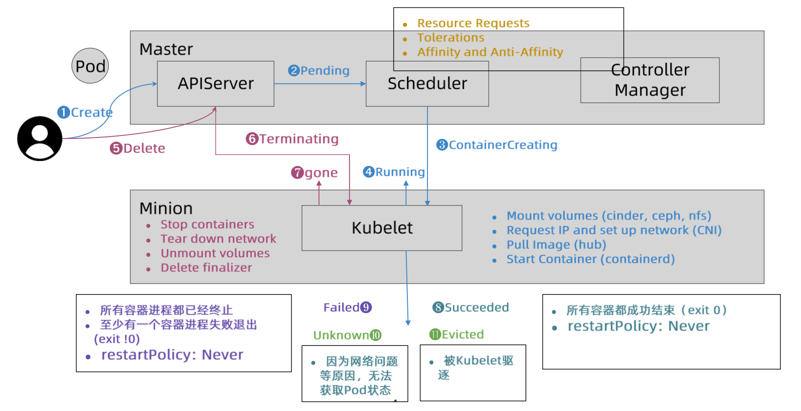
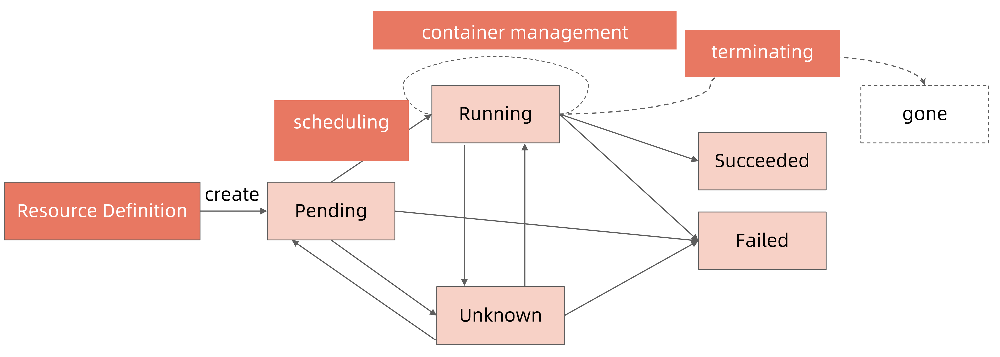
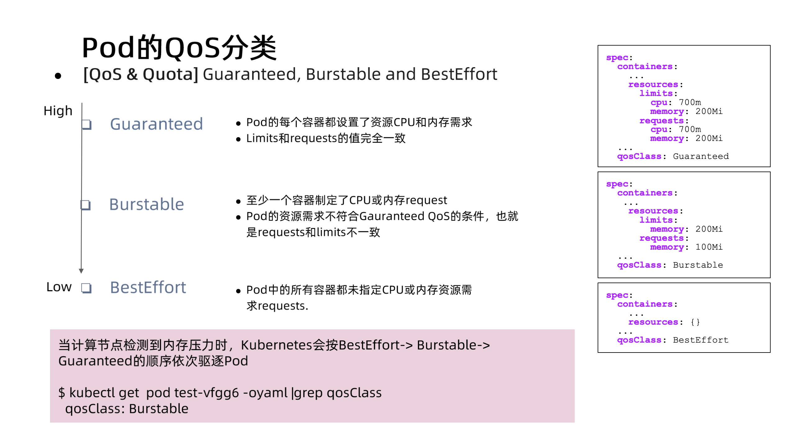

1. 优雅启动
2. 优雅终止
3. 状态机
4. qos class
5. 集群内容器日志存储

qos 决定怎么死，priority 决定怎么生

# Pod完整声明周期



# pod 阶段状态-phase

Pod 的阶段（Phase）是 Pod 在其生命周期中所处位置的简单宏观概述。 该阶段并不是对容器或 Pod 状态的综合汇总，也不是为了成为完整的状态机

| 取值                  | 描述                                                                                                                                                              |
| --------------------- | ----------------------------------------------------------------------------------------------------------------------------------------------------------------- |
| `Pending`（待调度） | Pod 已被 Kubernetes 系统接受，但有一个或者多个容器尚未创建亦未运行。此阶段包括等待 Pod 被调度的时间和通过网络下载镜像的时间。                                     |
| `Running`（运行中） | Pod 已经绑定到了某个节点，Pod 中所有的容器都已被创建。至少有一个容器仍在运行，或者正处于启动或重启状态。                                                          |
| `Succeeded`（成功） | Pod 中的所有容器都已成功结束，并且不会再重启。                                                                                                                    |
| `Failed`（失败）    | Pod 中的所有容器都已终止，并且至少有一个容器是因为失败终止。也就是说，容器以非 0 状态退出或者被系统终止，且未被设置为自动重启。                                   |
| `Unknown`（未知）   | 因为某些原因无法取得 Pod 的状态。这种情况通常是因为与 Pod 所在主机通信失败<br />或例如当 `csi` 插件被卸载，原先使用这个 `csi` 插件的 Pod 就会出现 `Unknown` |

## 状态机



## 容器状态

一旦[调度器](https://kubernetes.io/zh-cn/docs/reference/command-line-tools-reference/kube-scheduler/)将 Pod 分派给某个节点，`kubelet` 就通过[容器运行时](https://kubernetes.io/zh-cn/docs/setup/production-environment/container-runtimes)开始为 Pod 创建容器。容器的状态有三种：`Waiting`（等待）、`Running`（运行中）和 `Terminated`（已终止）

# Pod 状态计算细节

| kubectl get pod 返回的状态                                               | Pod Phase | Conditions                                                                                       |
| ------------------------------------------------------------------------ | --------- | ------------------------------------------------------------------------------------------------ |
| Completed                                                                | Succeeded |                                                                                                  |
| ContainerCreating                                                        | Pending   |                                                                                                  |
| CrashLoopBackOff                                                         | Running   | Container exits（一般是由于业务异常）                                                            |
| CreateContainerConfigError                                               | Pending   | Configmap “test” not found``secret “my-secret” not found                                     |
| ErrImagePull ``ImagePullBackOff``Init:ImagePullBackOff``InvalidImageName | Pending   | Back-off pulling image                                                                           |
| Error                                                                    | Failed    | restartPolicy: Never``container exits with Error(not 0)                                          |
| Evicted                                                                  | Failed    | Message: ‘Usage of EmptyDir volume “myworkdir” exceeds the limit “40Gi”.’``reason: Evicted |
| Init: 0/1                                                                | Pending   | Init containers don’t exit                                                                      |
| Init: CrashLoopBackOff/``Init: Error                                     | Pending   | Init container crashed (exit with not 1)                                                         |
| OOMKilled                                                                | Running   | Containers are OOMKilled                                                                         |
| StartError                                                               | Running   | Containers cannot be started                                                                     |
| Unknown                                                                  | Running   | Node NotReady                                                                                    |
| OutOfCpu``OutOfMemory                                                    | Failed    | Scheduled, but it cannot pass kubelet admit                                                      |

# Pod 服务质量（**[Quality of Service，QoS](https://kubernetes.io/zh-cn/docs/concepts/workloads/pods/pod-qos/)）**

Kubernetes 基于 Pod 中[容器](https://kubernetes.io/zh-cn/docs/concepts/containers/)的[资源请求](https://kubernetes.io/zh-cn/docs/concepts/configuration/manage-resources-containers/)进行分类， 同时确定这些请求如何与资源限制相关

依赖这种分类来决定当 Node 上没有足够可用资源时要驱逐哪些 Pod



## Guaranteed

`Guaranteed` Pod 具有最严格的资源限制，并且最不可能面临驱逐。 在这些 Pod 超过其自身的限制或者没有可以从 Node 抢占的低优先级 Pod 之前， 这些 Pod 保证不会被杀死。这些 Pod 不可以获得超出其指定 limit 的资源。这些 Pod 也可以使用 [`static`](https://kubernetes.io/zh-cn/docs/tasks/administer-cluster/cpu-management-policies/#static-policy) CPU 管理策略来使用独占的 CPU

当Pod仅设置了limits没有设置requests的时候，Kubernetes会自动为它设置与limits相同的requests值，所以，这也属于Guaranteed情况

判断依据

- **当Pod里的每一个Container都同时设置了requests和limits，并且requests和limits值相等的时候，这个Pod就属于Guaranteed类别**

guaranteed模式和cpuset的能力一致，独占 cpu，不是像cpushare那样共享CPU的计算能力，操作系统在CPU之间进行上下文切换的次数大大减少，容器里应用的性能会得到大幅提升。

在实际的使用中，强烈建议将DaemonSet的Pod都设置为Guaranteed的QoS类型。否则，一旦DaemonSet的Pod被回收，它又会立即在原宿主机上被重建出来，这就使得前面资源回收的动作，完全没有意义了

## Burstable

`Burstable` Pod 有一些基于 request 的资源下限保证，但不需要特定的 limit。 如果未指定 limit，则默认为其 limit 等于 Node 容量，这允许 Pod 在资源可用时灵活地增加其资源。 在由于 Node 资源压力导致 Pod 被驱逐的情况下，只有在所有 `BestEffort` Pod 被驱逐后 这些 Pod 才会被驱逐。因为 `Burstable` Pod 可以包括没有资源 limit 或资源 request 的容器， 所以 `Burstable` Pod 可以尝试使用任意数量的节点资源

判断依据

- 当Pod不满足Guaranteed的条件，但至少有一个Container设置了requests。那么这个Pod就会被划分到Burstable类别

## BestEffort

`BestEffort` QoS 类中的 Pod 可以使用未专门分配给其他 QoS 类中的 Pod 的节点资源。 例如若你有一个节点有 16 核 CPU 可供 kubelet 使用，并且你将 4 核 CPU 分配给一个 `Guaranteed` Pod， 那么 `BestEffort` QoS 类中的 Pod 可以尝试任意使用剩余的 12 核 CPU。

判断依据

- **如果一个Pod既没有设置requests，也没有设置limits，那么它的QoS类别就是BestEffort**

## 作用

如果节点遇到资源压力，kubelet 将优先驱逐 `BestEffort` Pod

**QoS划分的主要应用场景，是当宿主机资源紧张的时候，kubelet对Pod进行Eviction（即资源回收）时需要用到的**

具体地说，当Kubernetes所管理的宿主机上不可压缩资源短缺时，就有可能触发Eviction。比如，可用内存（memory.available）、可用的宿主机磁盘空间（nodefs.available），以及容器运行时镜像存储空间（imagefs.available）

目前，Kubernetes为你设置的Eviction的默认阈值如下所示：

```undefined
memory.available<100Mi
nodefs.available<10%
nodefs.inodesFree<5%
imagefs.available<15%
```

当然，上述各个触发条件在kubelet里都是可配置的。比如下面这个例子：

```lua
kubelet --eviction-hard=imagefs.available<10%,memory.available<500Mi,nodefs.available<5%,nodefs.inodesFree<5% --eviction-soft=imagefs.available<30%,nodefs.available<10% --eviction-soft-grace-period=imagefs.available=2m,nodefs.available=2m --eviction-max-pod-grace-period=600
```

在这个配置中，你可以看到 **Eviction在Kubernetes里其实分为Soft和Hard两种模式** 。

其中，Soft Eviction允许你为Eviction过程设置一段“优雅时间”，比如上面例子里的imagefs.available=2m，就意味着当imagefs不足的阈值达到2分钟之后，kubelet才会开始Eviction的过程。

而Hard Eviction模式下，Eviction过程就会在阈值达到之后立刻开始。

> Kubernetes计算Eviction阈值的数据来源，主要依赖于从Cgroups读取到的值，以及使用cAdvisor监控到的数据。

当宿主机的Eviction阈值达到后，就会进入MemoryPressure或者DiskPressure状态，从而避免新的Pod被调度到这台宿主机上。

当 eviction发生的时候，kubelet 就是根据 Qos类别来执行一下删除顺序

* 首当其冲的，自然是BestEffort类别的Pod。
* 其次，是属于Burstable类别、并且发生“饥饿”的资源使用量已经超出了requests的Pod。
* 最后，才是Guaranteed类别。并且，Kubernetes会保证只有当Guaranteed类别的Pod的资源使用量超过了其limits的限制，或者宿主机本身正处于Memory Pressure状态时，Guaranteed的Pod才可能被选中进行Eviction操作

当 Pod QoS类别一样，就根据Pod的优先级来进行进一步地排序和选择

# 参考与延伸阅读

1. [Kubernetes 文档](https://kubernetes.io/zh-cn/docs/)/[概念](https://kubernetes.io/zh-cn/docs/concepts/)/[工作负载](https://kubernetes.io/zh-cn/docs/concepts/workloads/)/[Pod](https://kubernetes.io/zh-cn/docs/concepts/workloads/pods/)/[Pod 的生命周期](https://kubernetes.io/zh-cn/docs/concepts/workloads/pods/pod-lifecycle/)
