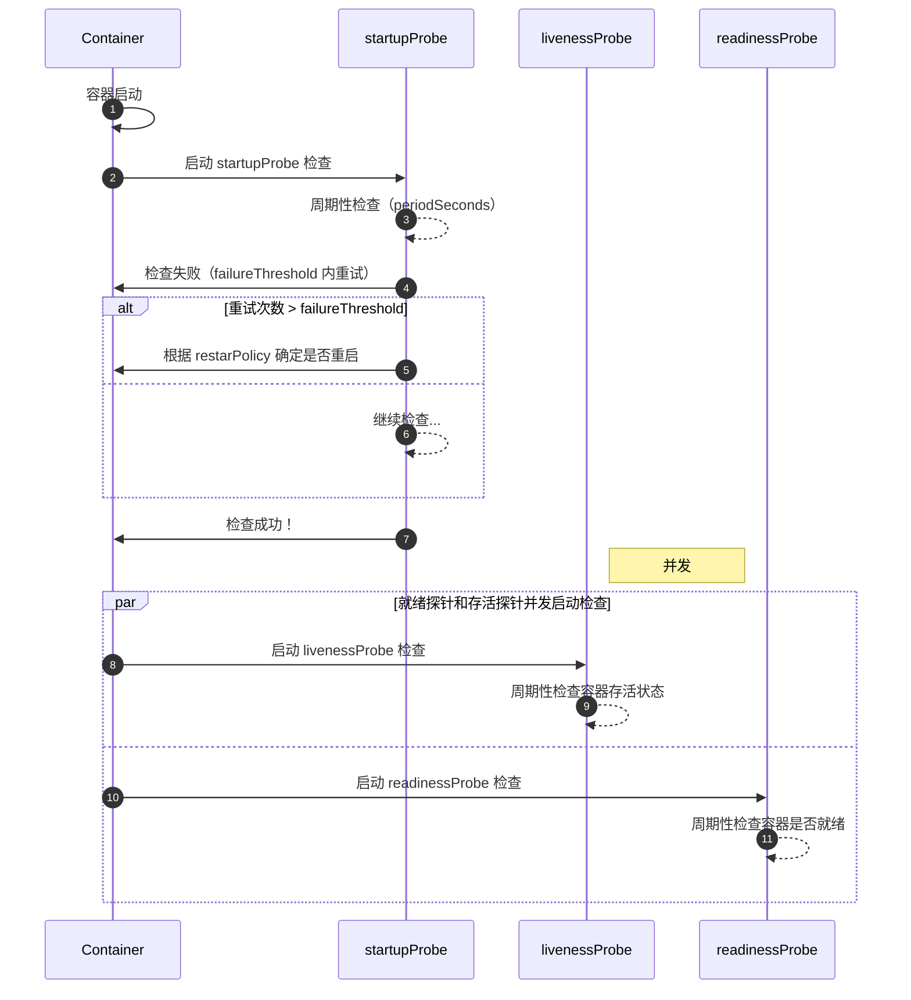

# 1. 简介

容器探测用于检测容器中的应用实例是否正常工作，是保障业务可用性的一种传统机制。如果经过探测，实例的状态不符合预期，那么 kubernetes 就会把该问题实例" 摘除 "，不承担业务流量。Kubernetes 提供了三种探针

- 存活探针-livenessProbe
- 就绪探针-readinessProbe
- 启动探针-startupProbe

## 存活探针

**kubelet 使用存活探测器来知道什么时候要重启容器。 例如，存活探测器可以捕捉到死锁（应用程序在运行，但是无法继续执行后面的步骤）。 这样的情况下重启容器有助于让应用程序在有问题的情况下更可用。**

## 就绪探针

**kubelet 使用就绪探测器可以知道容器什么时候准备好了并可以开始接受请求流量， 当一个 Pod 内的所有容器都准备好了，才能把这个 Pod 看作就绪了。 这种信号的一个用途就是控制哪个 Pod 作为 Service 的后端。 在 Pod 还没有准备好的时候，会从 Service 的负载均衡器中被剔除的。**

后续引入 readinessGates 特性，为 kubelet 提供一组额外的状况供其评估[Pod 就绪态](https://kubernetes.io/zh-cn/docs/concepts/workloads/pods/pod-lifecycle/#pod-readiness-gate)时使用。

新引入的 readinessGates condition 需要为 True， 然后加上内置的 Conditions， Pod 才可设置为就绪态

> pod status.conditions 中的状态一般由 Operator 控制器来修改 如 openkruise。

对于有额外评估条件的 Pod 而言，只有当下面的条件都满足时，该 Pod 才会被评估为就绪：

- Pod 中所有容器都已就绪；
- `readinessGates` 中的所有状况都为 `True` 值。

当 Pod 的容器都已就绪，但至少一个附加条件没有取值或者取值为 `False`， `kubelet` 将 Pod 的[状况](https://kubernetes.io/zh-cn/docs/concepts/workloads/pods/pod-lifecycle/#pod-conditions)设置为 `ContainersReady。`

```yaml
kind: Pod
---
spec:
  readinessGates:
    - conditionType: "www.example.com/feature-1"
status:
  conditions:
    - type: Ready # 内置的 Pod 状况
      status: "False"
      lastProbeTime: null
      lastTransitionTime: 2018-01-01T00:00:00Z
    - type: "www.example.com/feature-1" # 额外的 Pod 状况
      status: "False"
      lastProbeTime: null
      lastTransitionTime: 2018-01-01T00:00:00Z
  containerStatuses:
    - containerID: docker://abcd...
      ready: true
```

## 启动探针

**kubelet 使用启动探测器(startupProbe)可以知道应用程序容器什么时候启动了。 如果配置了这类探测器，就可以控制容器在启动成功后再进行存活性和就绪检查， 确保这些存活、就绪探测器不会影响应用程序的启动。 这可以用于对慢启动容器进行存活性检测，避免它们在启动运行之前就被杀掉。如果启动探测失败，`kubelet` 将杀死容器， 而容器依其[重启策略](https://kubernetes.io/zh-cn/docs/concepts/workloads/pods/pod-lifecycle/#restart-policy)进行重启。**

如果你的容器启动时间通常超出 initialDelaySeconds+failureThreshold×periodSeconds 总值，你应该设置一个启动探测，对存活态探针所使用的同一端点执行检查。 `periodSeconds` 的默认值是 10 秒。你应该将其 `failureThreshold` 设置得足够高， 以便容器有充足的时间完成启动，并且避免更改存活态探针所使用的默认值

# 2. 检测方式

[配置存活、就绪和启动探针](https://kubernetes.io/zh-cn/docs/tasks/configure-pod-container/configure-liveness-readiness-startup-probes/#define-startup-probes)

具体操作细节可以参考》[kubernetes 入门教程](../../concept/Kubernetes.md#534-容器探测)

- exec 命令：在容器内执行一次命令，如果命令执行的退出码为 0，则认为程序正常，否则不正常

  ```yaml
  ……
    livenessProbe:
      exec:
        command:
        - cat
        - /tmp/healthy
  ……
  ```
- tcpSocket：将会尝试访问一个用户容器的端口，如果能够建立这条连接，则认为程序正常，否则不正常

  ```yaml
  ……
    livenessProbe:
      tcpSocket:
        port: 8080
  ……
  ```
- httpGet：调用容器内 Web 应用的 URL，如果返回的状态码在 200 和 399 之间，则认为程序正常，否则不正常

  ```yaml
  ……
    livenessProbe:
      httpGet:
        path: / #URI地址
        port: 80 #端口号
        host: 127.0.0.1 #主机地址
        scheme: HTTP #支持的协议，http或者https
  ……
  ```
- grpc：使用 [gRPC](https://grpc.io/) 执行一个远程过程调用。 目标应该实现 [gRPC 健康检查](https://grpc.io/grpc/core/md_doc_health-checking.html)。 如果响应的状态是 "SERVING"，则认为诊断成功

  ```yaml
  ……
    livenessProbe:
      grpc:
        port: 80 #端口号
  ……
  ```

要使用 gRPC 探针，必须配置 port 属性，与 HTTP 或 TCP 探针不同，gRPC 探测不能按名称指定健康检查端口， 也不能自定义主机名。

# 3. FAQ

## livenessProbe 有 initialDelaySeconds，为什么需要 starupProbe？

### **1. `startupProbe` 的作用**

- 目的：专门用于检测容器是否已启动完成（即应用是否已初始化完毕）。
- 行为：
  - 如果 `startupProbe` 配置了，Kubernetes 会 优先运行它 ，直到它成功（返回 `Success` 状态）。
  - 只有在 `startupProbe` 成功后，才会开始运行 `livenessProbe` 和 `readinessProbe`。
  - 如果 `startupProbe` 失败超过 `failureThreshold` 次数，容器会被重启。
- 适用场景：应用启动时间较长或不稳定（例如需要加载大量数据、依赖外部服务初始化等）。

---

### **2. `livenessProbe.initialDelaySeconds` 的作用**

- 目的：为 `livenessProbe` 设置一个固定的初始延迟时间，避免在容器启动阶段误判容器为“不健康”。
- 行为：
  - 在容器启动后，等待 `initialDelaySeconds` 时间，然后开始运行 `livenessProbe`。
  - 如果应用在 `initialDelaySeconds` 后仍未启动完成，`livenessProbe` 可能会失败，导致容器被重启。
- 局限性：**_它只是一个固定延迟，无法动态适应应用启动时间的波动。无法处理启动时间的不确定性，可能导致误判和不必要的重启_**

假设有一个应用需要 60s 的启动时间

用 startupProbe，配置如下

```yaml
startupProbe:
  httpGet: { path: /healthz, port: 8080 }
  failureThreshold: 30 # 最大失败次数（默认 3）
  periodSeconds: 10 # 每 10 秒检查一次
```

- Kubernetes 会持续检查启动状态，最长等待 `30 * 10 = 300` 秒（5 分钟）。
- 如果应用在 60 秒时启动完成，`startupProbe` 立即成功，随后 `livenessProbe` 开始工作。
- 如果应用偶尔启动耗时 90 秒，`startupProbe` 仍能覆盖，无需调整配置

如果用 `initialDelaySeconds`

```yaml
livenessProbe:
  httpGet: { path: /healthz, port: 8080 }
  initialDelaySeconds: 60 # 固定等待 60 秒
  periodSeconds: 10
```

- 在 60 秒后，`livenessProbe` 开始检查。
- 如果应用实际需要 70 秒启动，`livenessProbe` 会在第 60-70 秒期间失败，导致容器被错误重启。
- 如果应用启动时间波动较大（例如有时 30 秒，有时 90 秒），无法通过固定延迟覆盖所有情况。

## 三种探针的执行顺序

- [Order of readiness probe and liveness probe](https://github.com/kubernetes/kubernetes/issues/60647)
- [LivenessProbe should start after ReadinessProbe Succeeded if ReadinessProbe is specified](https://github.com/kubernetes/kubernetes/issues/27114)


