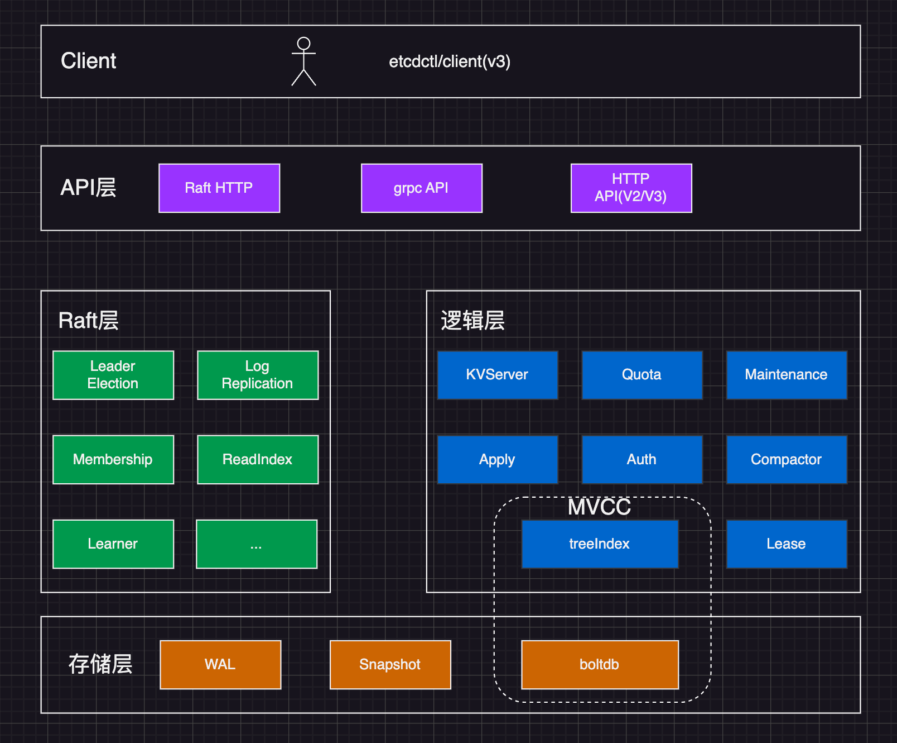
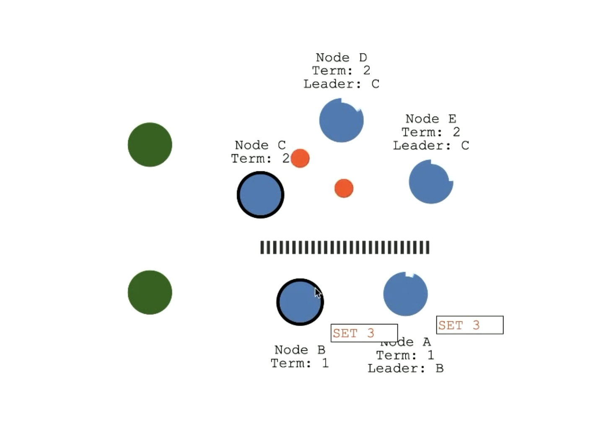

# 概念

## 角色

- Leader: 经过选举后产生的主节点
- Follower: 从节点
- Candidate: 候选人，集群初始化阶段，每个节点都是候选人状态，通过选举产生 Leader 后，候选人就变成了 Follower
- Learner: 当需要增加节点时，由于新节点与主节点之间的数据差异太大，Learner 节点相当于挂一个学习节点，只接收数据，不参与决策，当数据同步一致后(待跟踪源码确认数据一致的判断条件？))，自动转为 Follower 节点

## 相关名词

| 名词        | 说明                                       | 详细说明/使用场景                                                                                                                                                                                                                                                                                                                            |
| ----------- | ------------------------------------------ | -------------------------------------------------------------------------------------------------------------------------------------------------------------------------------------------------------------------------------------------------------------------------------------------------------------------------------------------- |
| Node/Member | 节点/成员                                  |                                                                                                                                                                                                                                                                                                                                              |
| learner     | Raft 4.2.1 引入新角色                      | 当出现一个 etcd 集群需要增加节点时，新节点与 Leader 的数据差异较大，需要画画时间数据同步才能跟上 Leader 的最新数据。 此时 Leader 的网络带宽很可能被耗尽，进而使得 leader 无法正常保持心跳，导致 follower 重新发起投票，引发集群不可用。 引入 Learner 新角色，只接收数据而不参与投票，因此增加 learner 节点时，集群的 quorum 不变。 |
| Term        | 任期                                       |                                                                                                                                                                                                                                                                                                                                              |
| Election    | 选举                                       |                                                                                                                                                                                                                                                                                                                                              |
| Lease       | 租期                                       |                                                                                                                                                                                                                                                                                                                                              |
| treeIndex   | 基于 B-tree 实现的内存索引，key 维度的索引 |                                                                                                                                                                                                                                                                                                                                              |
| blotdb      | go 语言编写的键值持久化数据库              | 是一个基于 B+ tree 实现的 key-value 键值库，支持事务，提供 Get/Put 等简易 API 为不需要完整数据库服务器（例如 Postgres 或 MySQL）的项目提供一个简单、快速且可靠的持久化数据库 boltdb 通过 bucket 来隔离集群元数据与用户数据，每个 bucket 类似 MySQL 一个表                                                                          |

> 理解 rafa 协议原理的网站：https://thesecretlivesofdata.com/raft/

## 整体架构

- Client 层： 包括 v2/v3 两个大版本 API 客户端，提供简洁易用的 API，同时支持负载均衡、节点故障自动转移
- API 层：主要包括 client 访问 server 和 server 节点之间的通信协议。
  - 一方面 client 访问 etcd server 的 API 分为 v2/v3 两大版本。v2 使用 HTTP1.x 协议，v3 使用 grpc 协议。同时 v3 通过 etcd grpc-gateway 组件也支持 HTTP1.x 协议，便于各种语言的服务调用。
  - 另一方面，server 之间的通信协议，节点间通过 raft 算法实现数据复制和 Leader 选举等功能呢时使用的 HTTP 协议
- Raft 层：Raft 算法层实现了 Leader 选举、日志复制、ReadIndex 等核心算法特性。用于保障 etcd 多个节点间的数九一致性、提升服务可用性，是 etcd 的基石和亮点。
- 功能逻辑层：etcd 核心特性实现，包括 KVServer 模块、MVCC 模块、Auth 鉴权模块、Lease 租约模块、Compactor 压缩模块等。其中 MVVC 模块主要由 treeIndex 模块和 blotdb 模块组成
- 存储层：包含 WAL 日志模块，快照(Snapshot)模块，blotdb 持久化存储库。其中 WAL 可保障 etcd crash 后数据不都是，blotdb 则保存了集群元数据和用户数据

## 问题

### 1. boltdb 怎么保证全局的 revision 呢

boltdb 的 key 是 revision，revision 本身由 etcd mvcc 模块维护全局单调递增

### 2. 当从节点收到 Propose 请求后写入 wal 日志，最终并没有一半以上节点成功响应，写入 wal 的节点是怎么处理的？

1. 在数据恢复时，这种日志会不会重复进入 raft 一致性确认？
2. 针对这种未确认的已写入日志，最终会删除吗，还是不处理，通过一致性算法来最终确认？

### 3. etcd db max size 的瓶颈在哪里，为什么要限制 <=8G？

boltdb 是基于 B+tree 实现的，本身可以支持很大的 size.

etcd 主动限制的，具体原因如下

1. 大 db 文件首先会影响 etcd 启动耗时，因为 etcd 需要打开 db 文件，初始化 db 对象，并遍历 boltdb 中的所有 key-value 以重建内存 treeIndex。
2. 较大 db 文件会导致 etcd 依赖更高配置的节点内存规格，etcd 通过 mmap 将 db 文件映射到内存中。etcd 启动后，正常情况下读 etcd 过程不涉及磁盘 IO，若节点内存不够，可能会导致缺页中断，引起延时抖动、服务性能下降。
3. 接着 treeIndex 维护了所有 key 的版本号信息，当 treeIndex 中含有百万级 key 时，在 treeIndex 中搜索指定范围的 key 的开销是不能忽略的，此开销可能高达上百毫秒。

### 4. 什么是脑裂？

当 etcd 出现网络分区导致集群划分为多个互补通信的分区时，这时会出现多个 leader 的情况，导致集群数据不一致

例如，假设一个 etcd 集群有 5 个节点，由于网络问题，其中 3 个节点相互之间能通信，另外 2 个节点相互之间能通信，但这两个子集之间无法通信。这两个子集可能都会认为自己是整个集群的合法部分，从而分别进行数据写入和更新操作，导致数据不一致。

脑裂会导致数据的不一致性和服务的不可靠性。为了避免脑裂情况的发生，etcd 通常会采用一些机制，比如选举算法、租约机制、心跳检测等，来确保只有一个合法的主节点能够进行写入操作，并且能够及时检测到节点的故障和网络分区，从而保障数据的一致性和系统的稳定性。

### 5. 什么是惊群效应？

在分布式锁场景下，当一个锁被释放时，大量等待获取该锁的客户端同时被唤醒去竞争锁，导致系统瞬间压力过大，性能下降。类似缓存雪崩

**etcd 应对方式** ：etcd 中未获取锁的 client 通过 Watch 机制各自监听 prefix 相同，revision 比自己小的 key，只有在监听的 key 释放锁时，该客户端才去竞争锁，一定程度上减轻了惊群效应。
