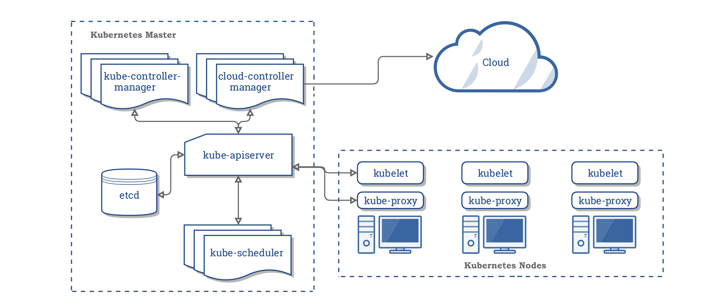
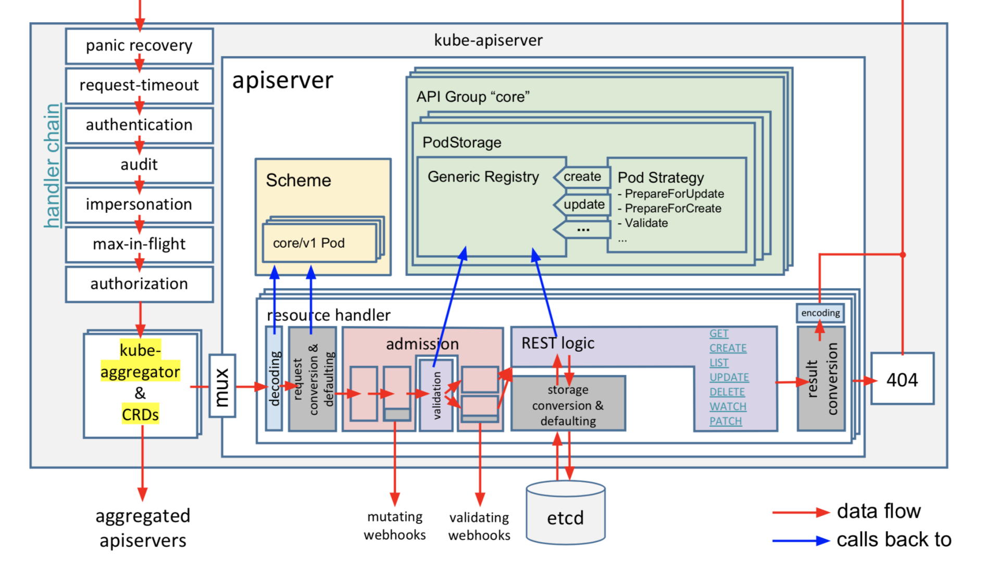
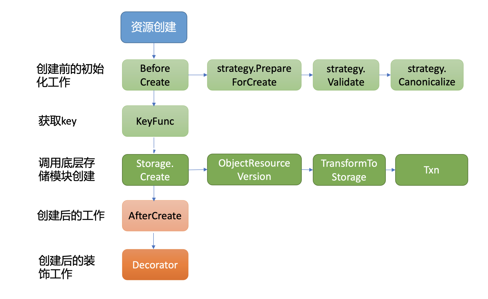
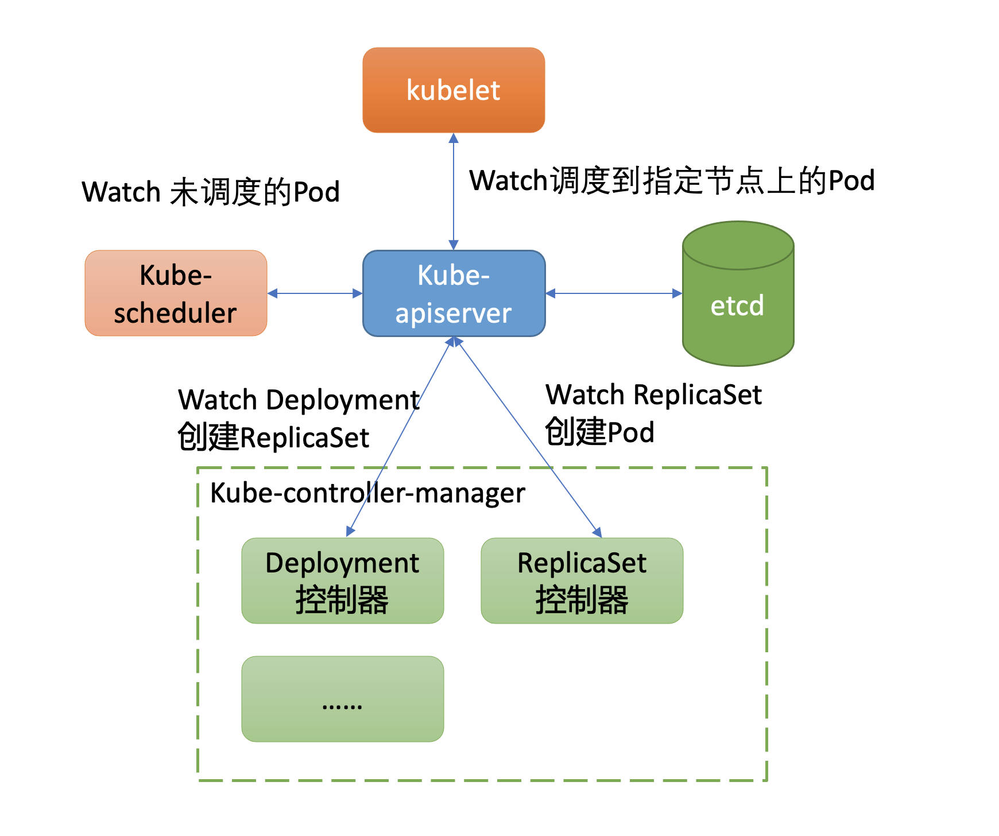
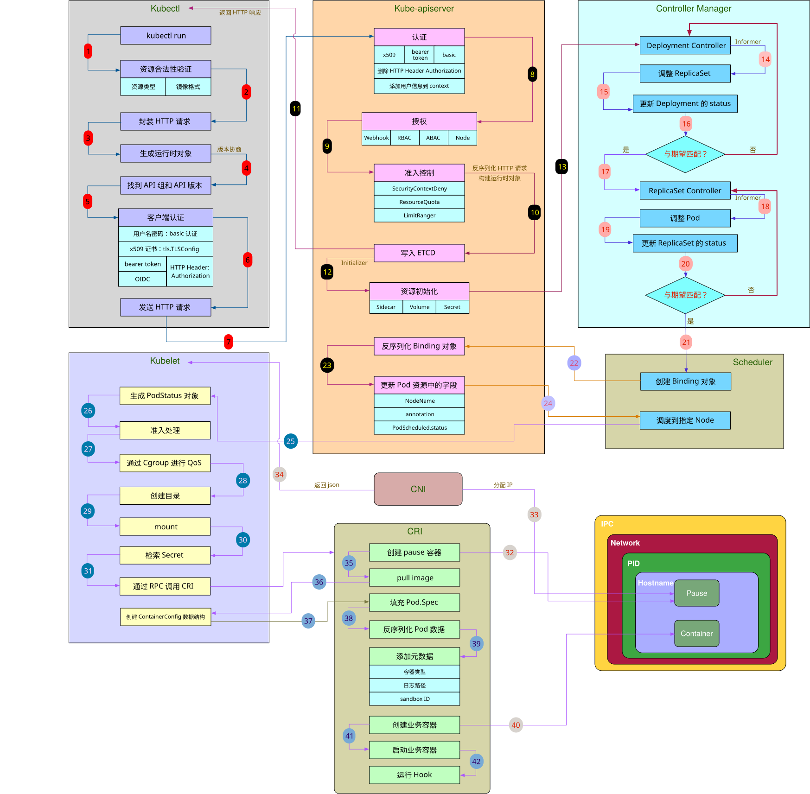

# 目标

以在 Kubernetes 集群中创建一个 nginx 服务为例，通过这个案例来详细分析 etcd 在 Kubernetes 集群创建 Pod 背后是如何工作的。

下面是创建一个 nginx 服务的 YAML 文件，Workload 是 Deployment，期望的副本数是 1。

```yaml
apiVersion: apps/v1
kind: Deployment
metadata:
  name: nginx-deployment
  labels:
    app: nginx
spec:
  replicas: 1
  selector:
    matchLabels:
      app: nginx
  template:
    metadata:
      labels:
        app: nginx
    spec:
      containers:
        - name: nginx
          image: nginx:1.14.2
          ports:
            - containerPort: 80
```

假设此 YAML 文件名为 nginx.yaml，首先我们通过如下的 kubectl create -f nginx.yml 命令创建 Deployment 资源。

> kubectl create -f nginx.yml

那么在 kubectl create 命令发出，nginx Deployment 资源成功创建的背后，

kube-apiserver 是如何与 etcd 打交道的呢？

它是通过什么接口**安全写入**资源到 etcd 的？

使用 kubectl 带标签查询 Pod 背后，kube-apiserver 是直接从**缓存读取**还是向 etcd 发出一个**线性读**或**串行读**请求呢？

若同 namespace 下存在大量的 Pod，此操作性能又是怎样的呢?

# k8s 基础架构

先简单了解下 Kubernetes 集群的整体架构，搞清楚 etcd 在 Kubernetes 集群中扮演的角色与作用。

下图是 Kubernetes 集群的架构图（[引用自 Kubernetes 官方文档](https://kubernetes.io/docs/concepts/overview/components/)），从图中你可以看到，它由 Master 节点和 Node 节点组成。



控制面 Master 节点主要包含以下组件：

- kube-apiserver，负责对外提供集群各类资源的增删改查及 Watch 接口，它是 Kubernetes 集群中各组件数据交互和通信的枢纽。kube-apiserver 在设计上可水平扩展，高可用 Kubernetes 集群中一般多副本部署。当收到一个创建 Pod 写请求时，它的基本流程是对请求进行认证、限速、授权、准入机制等检查后，写入到 etcd 即可。
- kube-scheduler 是调度器组件，负责集群 Pod 的调度。基本原理是通过监听 kube-apiserver 获取待调度的 Pod，然后基于一系列筛选和评优算法，为 Pod 分配最佳的 Node 节点。
- kube-controller-manager 包含一系列的控制器组件，比如 Deployment、StatefulSet 等控制器。控制器的核心思想是监听、比较资源实际状态与期望状态是否一致，若不一致则进行协调工作使其最终一致。
- etcd 组件，Kubernetes 的元数据存储。

Node 节点主要包含以下组件：

- kubelet，部署在每个节点上的 Agent 的组件，负责 Pod 的创建运行。基本原理是通过监听 APIServer 获取分配到其节点上的 Pod，然后根据 Pod 的规格详情，调用运行时组件创建 pause 和业务容器等。
- kube-proxy，部署在每个节点上的网络代理组件。基本原理是通过监听 APIServer 获取 Service、Endpoint 等资源，基于 Iptables、IPVS 等技术实现数据包转发等功能。

# kube-apiserver 请求执行链路

kube-apiserver 作为 Kubernetes 集群交互的枢纽、对外提供 API 供用户访问的组件，因此保障集群安全、保障本身及后端 etcd 的稳定性的等重任也是非它莫属。比如校验创建请求发起者是否合法、是否有权限操作相关资源、是否出现 Bug 产生大量写和读请求等。

[下图是 kube-apiserver 的请求执行链路](https://speakerdeck.com/sttts/kubernetes-api-codebase-tour?slide=18)（引用自 sttts 分享的 PDF），当收到一个请求后，它主要经过以下处理链路来完成以上若干职责后，才能与 etcd 交互。

核心链路如下：

- 认证模块，校验发起的请求的用户身份是否合法。支持多种方式，比如 x509 客户端证书认证、静态 token 认证、webhook 认证等。
- 限速模块，对请求进行简单的限速，默认读 400/s 写 200/s，不支持根据请求类型进行分类、按优先级限速，存在较多问题。Kubernetes 1.19 后已新增 Priority and Fairness 特性取代它，它支持将请求重要程度分类进行限速，支持多租户，可有效保障 Leader 选举之类的高优先级请求得到及时响应，能防止一个异常 client 导致整个集群被限速。
- 审计模块，可记录用户对资源的详细操作行为。
- 授权模块，检查用户是否有权限对其访问的资源进行相关操作。支持多种方式，RBAC(Role-based access control)、ABAC(Attribute-based access control)、Webhhook 等。Kubernetes 1.12 版本后，默认授权机制使用的 RBAC。
- 准入控制模块，提供在访问资源前拦截请求的静态和动态扩展能力，比如要求镜像的拉取策略始终为 AlwaysPullImages。



详细的分析可以参考 [从一个 GET 请求入手学习 k8s-apiserver](../controlplane/apiserver/从一个 GET 请求入手学习 k8s-apiserver.md)

经过上面一系列的模块检查后，这时 kube-apiserver 就开始与 etcd 打交道了。在了解 kube-apiserver 如何将我们创建的 Deployment 资源写入到 etcd 前，我先和你介绍下 Kubernetes 的资源是如何组织、存储在 etcd 中。

# Kubernetes 资源存储格式

我们知道 etcd 仅仅是个 key-value 存储，但是在 Kubernetes 中存在各种各样的资源，并提供了以下几种灵活的资源查询方式：

- 按具体资源名称查询，比如 PodName、kubectl get po/PodName。
- 按 namespace 查询，获取一个 namespace 下的所有 Pod，比如 kubectl get po -n kube-system。
- 按标签名，标签是极度灵活的一种方式，你可以为你的 Kubernetes 资源打上各种各样的标签，比如上面案例中的 kubectl get po -l app=nginx。

你知道以上这几种查询方式它们的性能优劣吗？假设你是 Kubernetes 开发者，你会如何设计存储格式来满足以上功能点？

首先是按具体资源名称查询。它本质就是个 key-value 查询，只需要写入 etcd 的 key 名称与资源 key 一致即可。

其次是按 namespace 查询。这种查询也并不难。因为我们知道 etcd 支持范围查询，若 key 名称前缀包含 namespace、资源类型，查询的时候指定 namespace 和资源类型的组合的最小开始区间、最大结束区间即可。

最后是标签名查询。这种查询方式非常灵活，业务可随时添加、删除标签，各种标签可相互组合。实现标签查询的办法主要有以下两种：

- 方案一，在 etcd 中存储标签数据，实现通过标签可快速定位（时间复杂度 O(1)）到具体资源名称。然而一个标签可能容易实现，但是在 Kubernetes 集群中，它支持按各个标签组合查询，各个标签组合后的数量相当庞大。在 etcd 中维护各种标签组合对应的资源列表，会显著增加 kube-apiserver 的实现复杂度，导致更频繁的 etcd 写入。
- 方案二，在 etcd 中不存储标签数据，而是由 kube-apiserver 通过范围遍历 etcd 获取原始数据，然后基于用户指定标签，来筛选符合条件的资源返回给 client。此方案优点是实现简单，但是大量标签查询可能会导致 etcd 大流量等异常情况发生。

那么 Kubernetes 集群选择的是哪种实现方式呢?

下面是一个 Kubernetes 集群中的 coredns 一系列资源在 etcd 中的存储格式：

```bash
/registry/clusterrolebindings/system:coredns
/registry/clusterroles/system:coredns
/registry/configmaps/kube-system/coredns
/registry/deployments/kube-system/coredns
/registry/events/kube-system/coredns-7fcc6d65dc-6njlg.1662c287aabf742b
/registry/events/kube-system/coredns-7fcc6d65dc-6njlg.1662c288232143ae
/registry/pods/kube-system/coredns-7fcc6d65dc-jvj26
/registry/pods/kube-system/coredns-7fcc6d65dc-mgvtb
/registry/pods/kube-system/coredns-7fcc6d65dc-whzq9
/registry/replicasets/kube-system/coredns-7fcc6d65dc
/registry/secrets/kube-system/coredns-token-hpqbt
/registry/serviceaccounts/kube-system/coredns
```

一方面 Kubernetes 资源在 etcd 中的存储格式由 `prefix + “/” + 资源类型 + “/” + namespace + “/” + 具体资源名`组成，基于 etcd 提供的范围查询能力，非常简单地支持了按具体资源名称查询和 namespace 查询。

kube-apiserver 提供了如下参数给你配置 etcd prefix，并支持将资源存储在多个 etcd 集群。

```bash
--etcd-prefix string     Default: "/registry"
The prefix to prepend to all resource paths in etcd.
--etcd-servers stringSlice
List of etcd servers to connect with (scheme://ip:port), comma separated.
--etcd-servers-overrides stringSlice
Per-resource etcd servers overrides, comma separated. The individual override format: group/resource#servers, where servers are URLs,
semicolon separated.
```

另一方面，我们未看到任何标签相关的 key。Kubernetes 实现标签查询的方式显然是方案二，即由 kube-apiserver 通过范围遍历 etcd 获取原始数据，然后基于用户指定标签，来筛选符合条件的资源返回给 client（资源 key 的 value 中记录了资源 YAML 文件内容等，如标签）。

也就是当你执行”kubectl get po -l app=nginx”命令，按标签查询 Pod 时，它会向 etcd 发起一个范围遍历整个 default namespace 下的 Pod 操作。

```bash
kubectl get po -l app=nginx -v 8
I0301 23:45:25.597465   32411 loader.go:359] Config loaded from file /root/.kube/config
I0301 23:45:25.603182   32411 round_trippers.go:416] GET https://ip:port/api/v1/namespaces/default/pods?
labelSelector=app%3Dnginx&limit=500
```

etcd 收到的请求日志如下，由此可见当一个 namespace 存在大量 Pod 等资源时，若频繁通过 kubectl，使用标签查询 Pod 等资源，后端 etcd 将出现较大的压力。

```json
{
    "level":"debug",
    "ts":"2021-03-01T23:45:25.609+0800",
    "caller":"v3rpc/interceptor.go:181",
    "msg":"request stats",
    "start time":"2021-03-01T23:45:25.608+0800",
    "time spent":"1.414135ms",
    "remote":"127.0.0.1:44664",
    "response type":"/etcdserverpb.KV/Range",
    "request count":0,
    "request size":61,
    "response count":11,
    "response size":81478,
    "request content":"key:"/registry/pods/default/" range_end:"/registry/pods/default0" limit:500 "
}
```

了解完 Kubernetes 资源的存储格式后，我们再看看 nginx Deployment 资源是如何由 kube-apiserver 写入 etcd 的。

# 通用存储模块

kube-apiserver 启动的时候，会将每个资源的 APIGroup、Version、Resource Handler 注册到路由上。当请求经过认证、限速、授权、准入控制模块检查后，请求就会被转发到对应的资源逻辑进行处理。

同时，kube-apiserver 实现了类似数据库 ORM 机制的通用资源存储机制，提供了对一个资源创建、更新、删除前后的 hook 能力，将其封装成策略接口。当你新增一个资源时，你只需要编写相应的创建、更新、删除等策略即可，不需要写任何 etcd 的 API。

下面是 kube-apiserver 通用存储模块的创建流程图：



从图中你可以看到，创建一个资源主要由 BeforeCreate、Storage.Create 以及 AfterCreate 三大步骤组成。

当收到创建 nginx Deployment 请求后，通用存储模块首先会回调各个资源自定义实现的 BeforeCreate 策略，为资源写入 etcd 做一些初始化工作。

下面是 Deployment 资源的创建策略实现，它会进行将 deployment.Generation 设置为 1 等操作。

```go
// PrepareForCreate clears fields that are not allowed to be set by end users on creation.
func (deploymentStrategy) PrepareForCreate(ctx context.Context, obj runtime.Object) {
   deployment := obj.(*apps.Deployment)
   deployment.Status = apps.DeploymentStatus{}
   deployment.Generation = 1

   pod.DropDisabledTemplateFields(&deployment.Spec.Template, nil)
```

执行完 BeforeCreate 策略后，它就会执行 Storage.Create 接口，也就是由它真正开始调用底层存储模块 etcd3，将 nginx Deployment 资源对象写入 etcd。

那么 Kubernetes 是使用 etcd Put 接口写入资源 key-value 的吗？

如果是，那要如何防止同名资源并发创建被覆盖的问题？

# 资源安全创建及更新

我们知道 etcd 提供了 Put 和 Txn 接口给业务添加 key-value 数据，但是 Put 接口在并发场景下若收到 key 相同的资源创建，就会导致被覆盖。

因此 Kubernetes 很显然无法直接通过 etcd Put 接口来写入数据。

etcd 事务接口 Txn，它正是为了多 key 原子更新、并发操作安全性等而诞生的，它提供了丰富的冲突检查机制

Kubernetes 集群使用的正是事务 Txn 接口来防止并发创建、更新被覆盖等问题。当执行完 BeforeCreate 策略后，这时 kube-apiserver 就会调用 Storage 的模块的 Create 接口写入资源。1.6 版本后的 Kubernete 集群默认使用的存储是 etcd3，它的创建接口简要实现如下：

```go
// Create implements storage.Interface.Create.
func (s *store) Create(ctx context.Context, key string, obj, out runtime.Object, ttl uint64) error {
   ......
   key = path.Join(s.pathPrefix, key)

   opts, err := s.ttlOpts(ctx, int64(ttl))
   if err != nil {
      return err
   }

   newData, err := s.transformer.TransformToStorage(data, authenticatedDataString(key))
   if err != nil {
      return storage.NewInternalError(err.Error())
   }

   startTime := time.Now()
   txnResp, err := s.client.KV.Txn(ctx).If(
      notFound(key),
   ).Then(
      clientv3.OpPut(key, string(newData), opts...),
   ).Commit()
```

从上面的代码片段中，我们可以得出首先它会按照我们介绍的 Kubernetes 资源存储格式拼接 key。

然后若 TTL 非 0，它会根据 TTL 从 leaseManager 获取可复用的 Lease ID。Kubernetes 集群默认若不同 key（如 Kubernetes 的 Event 资源对象）的 TTL 差异在 1 分钟内，可复用同一个 Lease ID，避免大量 Lease 影响 etcd 性能和稳定性。

其次若开启了数据加密，在写入 etcd 前数据还将按加密算法进行转换工作。

最后就是使用 etcd 的 Txn 接口，向 etcd 发起一个创建 deployment 资源的 Txn 请求。

那么 etcd 收到 kube-apiserver 的请求是长什么样子的呢？

```json
{
    "level":"debug",
    "ts":"2021-02-11T09:55:45.914+0800",
    "caller":"v3rpc/interceptor.go:181",
    "msg":"request stats",
    "start time":"2021-02-11T09:55:45.911+0800",
    "time spent":"2.697925ms",
    "remote":"127.0.0.1:44822",
    "response type":"/etcdserverpb.KV/Txn",
    "request count":1,
    "request size":479,
    "response count":0,
    "response size":44,
    "request content":"compare:<target:MOD key:"/registry/deployments/default/nginx-deployment" mod_revision:0 > success:<request_put:<key:"/registry/deployments/default/nginx-deployment" value_size:421 >> failure:<>"
```

从这个请求日志中，可以得到以下信息：

- 请求的模块和接口，KV/Txn；
- key 路径，/registry/deployments/default/nginx-deployment，由 prefix + “/” + 资源类型 + “/” + namespace + “/” + 具体资源名组成；
- 安全的并发创建检查机制，mod_revision 为 0 时，也就是此 key 不存在时，才允许执行 put 更新操作。

通过 Txn 接口成功将数据写入到 etcd 后，kubectl create -f nginx.yml 命令就执行完毕，返回给 client 了。在以上介绍中你可以看到，kube-apiserver 并没有任何逻辑去真正创建 Pod，但是为什么我们可以马上通过 kubectl get 命令查询到新建并成功运行的 Pod 呢？

这就涉及到了基础架构图中的控制器、调度器、Kubelet 等组件。下面我就为你浅析它们是如何基于 etcd 提供的 Watch 机制工作，最终实现创建 Pod、调度 Pod、运行 Pod 的。

# Watch 机制在 k8s 的应用

正如我们基础架构中所介绍的，kube-controller-manager 组件中包含一系列 WorkLoad 的控制器。Deployment 资源就由其中的 Deployment 控制器来负责的，那么它又是如何感知到新建 Deployment 资源，最终驱动 ReplicaSet 控制器创建出 Pod 的呢？

获取数据变化的方案，主要有轮询和推送两种方案组成。轮询会产生大量 expensive request，并且存在高延时。而 etcd Watch 机制提供的流式推送能力，赋予了 kube-apiserver 对外提供数据监听能力。

我们知道在 etcd 中版本号是个逻辑时钟，随着 client 对 etcd 的增、删、改操作而全局递增，它被广泛应用在 MVCC、事务、Watch 特性中。

尤其是在 Watch 特性中，版本号是数据增量同步的核心。当 client 因网络等异常出现连接闪断后，它就可以通过版本号从 etcd server 中快速获取异常后的事件，无需全量同步。

那么在 Kubernetes 集群中，它提供了什么概念来实现增量监听逻辑呢？

答案是 Resource Version。

## Resourse Version & etcd 版本号

Resource Version 是 Kubernetes API 中非常重要的一个概念，顾名思义，它是一个 Kubernetes 资源的内部版本字符串，client 可通过它来判断资源是否发生了变化。同时，你可以在 Get、List、Watch 接口中，通过指定 Resource Version 值来满足你对数据一致性、高性能等诉求。

那么 Resource Version 有哪些值呢？跟 etcd 版本号是什么关系？

下面我分别以 Get 和 Watch 接口中的 Resource Version 参数值为例，为你剖析它与 etcd 的关系。

### Get 查询场景

- 第一种是未指定 ResourceVersion，默认空字符串。kube-apiserver 收到一个此类型的读请求后，它会向 etcd 发出**_共识读/线性读_**请求获取 etcd 集群最新的数据。
- 第二种是设置 ResourceVersion=“0”，赋值字符串 0。kube-apiserver 收到此类请求时，它可能会返回任意资源版本号的数据，但是优先返回较新版本。一般情况下它直接从 kube-apiserver 缓存中获取数据返回给 client，有可能读到过期的数据，适用于对数据一致性要求不高的场景。
- 第三种是设置 ResourceVersion 为一个非 0 的字符串。kube-apiserver 收到此类请求时，它会保证 Cache 中的最新 ResourceVersion 大于等于你传入的 ResourceVersion，然后从 Cache 中查找你请求的资源对象 key，返回数据给 client。

第三种的 Cache 基本原理是 kube-apiserver 为各个核心资源（如 Pod）维护了一个 Cache，通过 etcd 的 Watch 机制来实时更新 Cache。当你的 Get 请求中携带了非 0 的 ResourceVersion，它会等待缓存中最新 ResourceVersion 大于等于你 Get 请求中的 ResoureVersion，若满足条件则从 Cache 中查询数据，返回给 client。若不满足条件，它最多等待 3 秒，若超过 3 秒，Cache 中的最新 ResourceVersion 还小于 Get 请求中的 ResourceVersion，就会返回 ResourceVersionTooLarge 错误给 client。

需要注意的是，

若使用的 Get 接口，那么 kube-apiserver 会取资源 key 的 ModRevision 字段填充 Kubernetes 资源的 ResourceVersion 字段（v1.meta/ObjectMeta.ResourceVersion）。

若你使用的是 List 接口，kube-apiserver 会在查询时，使用 etcd 当前版本号填充 ListMeta.ResourceVersion 字段（v1.meta/ListMeta.ResourceVersion）。

当我们执行 kubectl get po 查询案例时，它的 ResouceVersion 是什么取值呢? 查询的是 kube-apiserver 缓存还是 etcd 最新共识数据?

可以通过指定 kubectl 日志级别为 6，观察它向 kube-apiserver 发出的请求参数。从下面请求日志里你可以看到，默认是未指定 Resource Version，也就是会发出一个共识读/线性读请求给 etcd，获取 etcd 最新共识数据。

```bash
kubectl get po -l app=nginx -v 6
4410 loader.go:359] Config loaded from file /root/.kube/config
4410 round_trippers.go:438] GET https://*.*.*.*:*/api/v1/namespaces/default/pods?labelSelector=app%3Dnginx&limit=500 200 OK in 8 milliseconds
```

这里要提醒下你，在规模较大的集群中，尽量不要使用 kubectl 频繁查询资源。正如我们上面所分析的，它会直接查询 etcd 数据，可能会产生大量的 expensive request 请求，之前我就有见过业务这样用，然后导致了集群不稳定。

介绍完查询案例后，我们再看看 Watch 案例中，它的不同取值含义是怎样的呢?

### Watch 场景

watch 时 Resource Version 同样含有查询案例中的三种取值，官方定义的含义分别如下：

- 未指定 ResourceVersion，默认空字符串。一方面为了帮助 client 建立初始状态，它会将当前已存在的资源通过 Add 事件返回给 client。另一方面，它会从 etcd 当前版本号开始监听，后续新增写请求导致数据变化时可及时推送给 client。
- 设置 ResourceVersion=“0”，赋值字符串 0。它同样会帮助 client 建立初始状态，但是它会从任意版本号开始监听（当前 kube-apiserver 的实现指定 ResourceVersion=0 和不指定行为一致，在获取初始状态后，都会从 cache 最新的 ResourceVersion 开始监听），这种场景可能会导致集群返回陈旧的数据 cache 中可能还未同步最新数据。
- 设置 ResourceVersion 为一个非 0 的字符串。从精确的版本号开始监听数据，它只会返回大于等于精确版本号的变更事件。

Kubernetes 的控制器组件就基于以上的 Watch 特性，在快速感知到新建 Deployment 资源后，进入一致性协调逻辑，创建 ReplicaSet 控制器，整体交互流程如下所示。



Deployment 控制器创建 ReplicaSet 资源对象的日志如下所示。

```json
{
    "level":"debug",
    "ts":"2021-02-11T09:55:45.923+0800",
    "caller":"v3rpc/interceptor.go:181",
    "msg":"request stats",
    "start time":"2021-02-11T09:55:45.917+0800",
    "time spent":"5.922089ms",
    "remote":"127.0.0.1:44828",
    "response type":"/etcdserverpb.KV/Txn",
    "request count":1,
    "request size":766,
    "response count":0,
    "response size":44,
    "request content":"compare:<target:MOD key:"/registry/replicasets/default/nginx-deployment-756d9fd5f9" mod_revision:0 > success:<request_put:<key:"/registry/replicasets/default/nginx-deployment-756d9fd5f9" value_size:697 >> failure:<>"
}
```

真正创建 Pod 则是由 ReplicaSet 控制器负责，它同样基于 Watch 机制感知到新的 RS 资源创建后，发起请求创建 Pod，确保实际运行 Pod 数与期望一致。

```json
{
    "level":"debug",
    "ts":"2021-02-11T09:55:46.023+0800",
    "caller":"v3rpc/interceptor.go:181",
    "msg":"request stats",
    "start time":"2021-02-11T09:55:46.019+0800",
    "time spent":"3.519326ms",
    "remote":"127.0.0.1:44664",
    "response type":"/etcdserverpb.KV/Txn",
    "request count":1,
    "request size":822,
    "response count":0,
    "response size":44,
    "request content":"compare:<target:MOD key:"/registry/pods/default/nginx-deployment-756d9fd5f9-x6r6q" mod_revision:0 > success:<request_put:<key:"/registry/pods/default/nginx-deployment-756d9fd5f9-x6r6q" value_size:754 >> failure:<>"
}
```

在这过程中也产生了若干 Event，下面是 etcd 收到新增 Events 资源的请求，你可以看到 Event 事件 key 关联了 Lease，这个 Lease 由 LeaseManager 所负责创建。

```json
{
    "level":"debug",
    "ts":"2021-02-11T09:55:45.930+0800",
    "caller":"v3rpc/interceptor.go:181",
    "msg":"request stats",
    "start time":"2021-02-11T09:55:45.926+0800",
    "time spent":"3.259966ms",
    "remote":"127.0.0.1:44632",
    "response type":"/etcdserverpb.KV/Txn",
    "request count":1,
    "request size":449,
    "response count":0,
    "response size":44,
    "request content":"compare:<target:MOD key:"/registry/events/default/nginx-deployment.16628eb9f79e0ab0" mod_revision:0 > success:<request_put:<key:"/registry/events/default/nginx-deployment.16628eb9f79e0ab0" value_size:369 lease:5772338802590698925 >> failure:<>"
}
```

Pod 创建出来后，这时 kube-scheduler 监听到待调度的 Pod，于是为其分配 Node，通过 kube-apiserver 的 Bind 接口，将调度后的节点 IP 绑定到 Pod 资源上 详情可以查看[kube-schedule 调度原理](../controlplane/kube-schedule/readme.md)。kubelet 通过同样的 Watch 机制感知到新建的 Pod 后，发起 Pod 创建流程即可。详细分析可以查看[kubelet 与 cri cni 的交互](../core/kubelet/kubelet.md)

以上就是当我们在 Kubernetes 集群中创建一个 Pod 后，Kubernetes 和 etcd 之间交互的简要分析。

# 小结

kubectl create -f nginx-deploy.yaml 背后发生了什么

## 执行 kubectl

1. kubectl 执行前置校验(包括，是否支持的资源，使用镜像名称格式是否错误等)，快速校验失败，不发送给 apiserver，减少不必要的负载
2. kubectl 根据指定的资源类型版本 GKV 构造 HTTP 请求，并带上客户端认证信息，请求 api-server

## api-server

1. 先执行认证，校验 tls 整数/bearer token / 用户名密码
2. 校验是否限速
3. 进行 RBAC 鉴权，看用户是否有资源的操作权限
4. api-server 准入控制链，
   1. 虽然授权的重点是回答用户是否有权限，但准入控制器会拦截请求以确保它符合集群的更广泛的期望和规则
   2. 准入控制（Admission Control）在认证，授权后对请求做进一步的验证或添加默认参数。不同于授权和认证只关心请求的用户和操作，准入控制还处理请求的内容，并且**_仅对创建、更新、删除或连接（如代理）等有效，而对读操作无效(这是因为读取操作会绕过准入控制层)，具体有两种类型： mutating（修改性质), validating（校验性质)。_**
   3. 我们创建出来的资源中很多额外的字段信息都是准入控制阶段插入的，比如 tolerations 等
5. 调用 storage provider 将元数据保存到 etcd. 格式：/registry/{资源类型}/{namespace}/{资源名称}

## 控制器管理器

1. 写入 etcd 后，各种工作负载的控制器，通过调用 api-server watch 接口监听自己关注的类型的资源
   1. 比如 Deployment Controller 调用 etcd watch 监听 `/registry/deployments/` 下的所有资源的 ADD, UPDATE, DELETE 事件
2. Deployment 控制器通过 Informer 的 ADD 回调监听到创建事件后，创建 rs 资源写入 etcd
3. rs 控制器通过 Informer 的 ADD 回调监听到创建事件后，创建 pod 资源写入 etcd

## 调度阶段

1. kube-schedule 调度器监听待调度运行的 pod, 根据 pod 配置的调度策略，资源限制等，选择合适的节点与 pod 进行 Binding，并将 PodSpec 中的 `NodeName` 设置成优选出的 NodeName，将 pod.status.conditions PodScheduled Type 类型的 condition status 设置为 True。

## kubelet-初始化 pod

kubelet 也是一个中特殊的 Controller， watch api-server 获取自身 NodeName 相关的待运行的 Pod 清单。该进程用于处理 Scheduler 下发到本节点的任务，管理 Pod 的生命周期，包括挂载卷、容器日志记录、垃圾回收以及其他与 Pod 相关的事件。

1. 初始化 PodStatus 对象，它表示 Pod 当前阶段的状态。Pod 的状态(Phase) 是 Pod 在其生命周期中的最精简的概要，包括  Pending，Running，Succeeded，Failed  和  Unkown  这几个值
2. 生成 PodStatus 之后（Pod 中的  status  字段），Kubelet 就会将它发送到 Pod 的状态管理器，该管理器的任务是通过 apiserver 异步更新 etcd 中的记录。
3. 接下来运行一系列准入处理器，确保该 Pod 是否具有响应的权限
4. 为 pod 创建 cgroup 进行响应的资源限制，方便对 pod 进行服务质量 QoS 管理
5. 为 pod 创建响应的目录，包括 Pod 的目录（/var/run/kubelet/pods/`<podID>`），该 Pod 的卷目录（`<podDir>`/volumes）和该 Pod 的插件目录（`<podDir>`/plugins）。
6. 卷管理器 会挂载 Spec.Volumes 中定义的相关数据卷，然后等待挂载成功。根据挂载卷类型的不同，某些 Pod 可能需要等待更长的时间（比如 NFS 卷）。
7. 从 apiserver 中检索 Spec.ImagePullSecrets 中定义的 Secret
8. 创建容器日志目录
9. 通过容器运行时接口 CRI 创建并启动容器

## kubelet-CRI

1. 首先创建 sanbox pause 容器，Pause 容器存在的意义「**Pause 容器就是为解决 Pod 中的网络问题而生的**」

- 如果将容器进程直接加入到网络 namespace，可能因为容器进程本身的不稳定，而导致需要频繁配置网络，加重操作系统负担
- 容器进程的启动有时依赖网络资源的就绪，sandBoxContainer 负责提供这个底座

2. SanboxContainer 创建阶段 调用 CNI 插件 setUpNetwork，给容器分配 ip 等网络 namespace 相关的组件，并将信息返回给 apiserver 写入 PodStatus。参考 [k8s 网络插件 cni 工作原理](../core/network/cni/cni.md)
3. sanbox 完成初始化处于 `active`状态后，就开始拉取镜像创建其他容器
4. 先创建 init 容器，然后创建业务容器，如果 pod 配置了声明周期钩子，启动过程中会执行这些 hook



<p align="center"> <a href='https://mp.weixin.qq.com/s/ctdvbasKE-vpLRxDJjwVMw'> 图片来源-云原生实验室公众号 </p>

# 参考与延伸阅读

1. [kubectl 创建 Pod 背后到底发生了什么？](https://mp.weixin.qq.com/s/ctdvbasKE-vpLRxDJjwVMw)
2. [kubelet 流程解析](../core/kubelet/kubelet.md)
