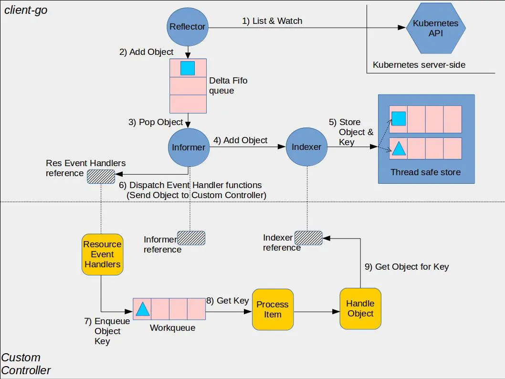
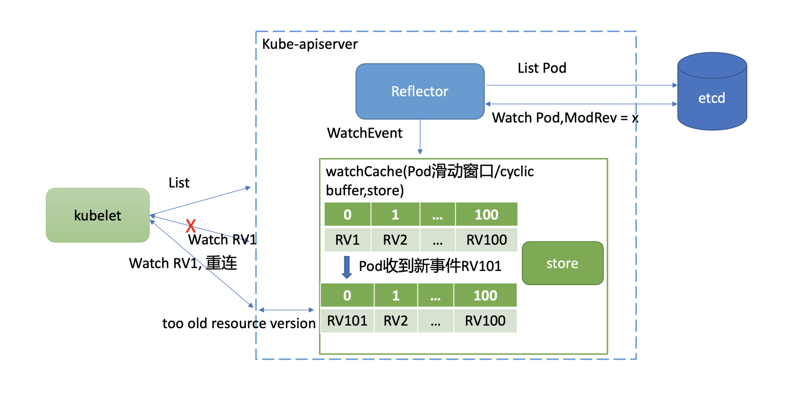

# 大集群核心问题分析

在大规模 Kubernetes 集群中会遇到哪些问题呢？

大规模 Kubernetes 集群的外在表现是节点数成千上万，资源对象数量高达几十万。本质是更频繁地查询、写入更大的资源对象。

首先是查询相关问题。在大集群中最重要的就是如何最大程度地减少 expensive request。因为对几十万级别的对象数量来说，按标签、namespace 查询 Pod，获取所有 Node 等场景时，很容易造成 etcd 和 kube-apiserver OOM 和丢包，乃至雪崩等问题发生。

其次是写入相关问题。Kubernetes 为了维持上万节点的心跳，会产生大量写请求。而按照我们基础篇介绍的 etcd MVCC、boltdb、线性读等原理，etcd 适用场景是读多写少，大量写请求可能会导致 db size 持续增长、写性能达到瓶颈被限速、影响读性能。

最后是大资源对象相关问题。etcd 适合存储较小的 key-value 数据，etcd 本身也做了一系列硬限制，比如 key 的 value 大小默认不能超过 1.5MB。

本讲我就和你重点分析下 Kubernetes 是如何优化以上问题，以实现支撑上万节点的。以及我会简单和你讲下 etcd 针对 Kubernetes 场景做了哪些优化。

# 如何减少 expensive request

首先是第一个问题，Kubernetes 如何减少 expensive request？

## 分页

首先 List 资源操作是个基本功能点。各个组件在启动的时候，都不可避免会产生 List 操作，从 etcd 获取集群资源数据，构建初始状态。因此优化的第一步就是要避免一次性读取数十万的资源操作。

解决方案是 Kubernetes List 接口支持分页特性。分页特性依赖底层存储支持，早期的 etcd v2 并未支持分页被饱受诟病，非常容易出现 kube-apiserver 大流量、高负载等问题。在 etcd v3 中，实现了指定返回 Limit 数量的范围查询，因此也赋能 kube-apiserver 对外提供了分页能力。

如下所示，在 List 接口的 ListOption 结构体中，Limit 和 Continue 参数就是为了实现分页特性而增加的。

Limit 表示一次 List 请求最多查询的对象数量，一般为 500。如果实际对象数量大于 Limit，kube-apiserver 则会更新 ListMeta 的 Continue 字段，client 发起的下一个 List 请求带上这个字段就可获取下一批对象数量。直到 kube-apiserver 返回空的 Continue 值，就获取完成了整个对象结果集。

```go
// ListOptions is the query options to a standard REST list call.
type ListOptions struct {
   ...
   Limit int64 `json:"limit,omitempty"
protobuf:"varint,7,opt,name=limit"`
   Continue string `json:"continue,omitempty"
protobuf:"bytes,8,opt,name=continue"`
}
```

了解完 kube-apiserver 的分页特性后，我们接着往下看 Continue 字段具体含义，以及它是如何影响 etcd 查询结果的。

etcd 分页是通过范围查询和 Limit 实现，ListOption 中的 Limit 对应 etcd 查询接口中的 Limit 参数。

Continue 字段是不是跟查询的范围起始 key 相关呢？

Continue 字段的确包含查询范围的起始 key，它本质上是个结构体，还包含 APIVersion 和 ResourceVersion。你之所以看到的是一个奇怪字符串，那是因为 kube-apiserver 使用 base64 库对其进行了 URL 编码，下面是它的原始结构体。

```go
type continueToken struct {
   APIVersion      string `json:"v"`
   ResourceVersion int64  `json:"rv"`
   StartKey        string `json:"start"`
}
```

当 kube-apiserver 收到带 Continue 的分页查询时，解析 Continue，获取 StartKey、ResourceVersion，etcd 查询 Range 接口指定 startKey，增加 clienv3.WithRange、clientv3.WithLimit、clientv3.WithRev 即可。

## 资源按 namespace 拆分

通过分页特性提供机制避免一次拉取大量资源对象后，接下来就是业务最佳实践上要避免同 namespace 存储大量资源，尽量将资源对象拆分到不同 namespace 下。

为什么拆分到不同 namespace 下有助于提升性能呢?

Kubernetes 资源对象存储在 etcd 中的 key 前缀包含 namespace，因此它相当于是个高效的索引字段。etcd treeIndex 模块从 B-tree 中匹配前缀时，可快速过滤出符合条件的 key-value 数据。

Kubernetes 社区承诺[SLO](https://github.com/kubernetes/community/blob/master/sig-scalability/slos/slos.md)达标的前提是，你在使用 Kubernetes 集群过程中必须合理配置集群和使用扩展特性，并遵循[一系列条件限制](https://github.com/kubernetes/community/blob/master/sig-scalability/configs-and-limits/thresholds.md)（比如同 namespace 下的 Service 数量不超过 5000 个）

## Informer 限制

各组件启动发起一轮 List 操作加载完初始状态数据后，就进入了控制器的一致性协调逻辑。在一致性协调逻辑中，Kubernetes 使用的是 Watch 特性来获取数据变化通知，而不是 List 定时轮询，这也是减少 List 操作一大核心策略。

Kubernetes 社区在 client-go 项目中提供了一个通用的 Informer 组件来负责 client 与 kube-apiserver 进行资源和事件同步，显著降低了开发者使用 Kubernetes API、开发高性能 Kubernetes 扩展组件的复杂度。

Informer 机制的 Reflector 封装了 Watch、List 操作，结合本地 Cache、Indexer，实现了控制器加载完初始状态数据后，接下来的其他操作都只需要从本地缓存读取，极大降低了 kube-apiserver 和 etcd 的压力。

下面是 Kubernetes 社区给出的一个控制器使用 Informer 机制的架构图。黄色部分是控制器相关基础组件，蓝色部分是 client-go 的 Informer 机制的组件，它由 Reflector、Queue、Informer、Indexer、Thread safe store(Local Cache)组成。



Informer 机制的基本工作流程如下：

- client 启动或与 kube-apiserver 出现连接中断再次 Watch 时，报”too old resource version”等错误后，通过 Reflector 组件的 List 操作，从 kube-apiserver 获取初始状态数据，随后通过 Watch 机制实时监听数据变化。
- 收到事件后添加到 Delta FIFO 队列，由 Informer 组件进行处理。
- Informer 将 delta FIFO 队列中的事件转发给 Indexer 组件，Indexer 组件将事件持久化存储在本地的缓存中。
- 控制器开发者可通过 Informer 组件注册 Add、Update、Delete 事件的回调函数。Informer 组件收到事件后会回调业务函数，比如典型的控制器使用场景，一般是将各个事件添加到 WorkQueue 中，控制器的各个协调 goroutine 从队列取出消息，解析 key，通过 key 从 Informer 机制维护的本地 Cache 中读取数据。

通过以上流程分析，你可以发现除了启动、连接中断等场景才会触发 List 操作，其他时候都是从本地 Cache 读取。

**那连接中断等场景为什么触发 client List 操作呢？**

## watch bookmark 机制

要搞懂这个问题，你得了解 kube-apiserver Watch 特性的原理。

Kubernetes 通过全局递增的 Resource Version 来实现增量数据同步逻辑，尽量避免连接中断等异常场景下 client 发起全量 List 同步操作。

那么在什么场景下会触发全量 List 同步操作呢？这就取决于 client 请求的 Resource Version 以及 kube-apiserver 中是否还保存了相关的历史版本数据。

实现历史版本数据存储两大核心机制，滑动窗口和 MVCC。与 etcd v3 使用 MVCC 机制不一样的是，Kubernetes 采用的是滑动窗口机制。

kube-apiserver 的滑动窗口机制是如何实现的呢?

它通过为每个类型资源（Pod,Node 等）维护一个 cyclic buffer，来存储最近的一系列变更事件实现。

下面 Kubernetes 核心的 watchCache 结构体中的 cache 数组、startIndex、endIndex 就是用来实现 cyclic buffer 的。滑动窗口中的第一个元素就是 cache[startIndex%capacity]，最后一个元素则是 cache[endIndex%capacity]。

```go
// watchCache is a "sliding window" (with a limited capacity) of objects
// observed from a watch.
type watchCache struct {
   sync.RWMutex

   // Condition on which lists are waiting for the fresh enough
   // resource version.
   cond *sync.Cond

   // Maximum size of history window.
   capacity int

   // upper bound of capacity since event cache has a dynamic size.
   upperBoundCapacity int

   // lower bound of capacity since event cache has a dynamic size.
   lowerBoundCapacity int

   // cache is used a cyclic buffer - its first element (with the smallest
   // resourceVersion) is defined by startIndex, its last element is defined
   // by endIndex (if cache is full it will be startIndex + capacity).
   // Both startIndex and endIndex can be greater than buffer capacity -
   // you should always apply modulo capacity to get an index in cache array.
   cache      []*watchCacheEvent
   startIndex int
   endIndex   int

   // store will effectively support LIST operation from the "end of cache
   // history" i.e. from the moment just after the newest cached watched event.
   // It is necessary to effectively allow clients to start watching at now.
   // NOTE: We assume that <store> is thread-safe.
   store cache.Indexer

   // ResourceVersion up to which the watchCache is propagated.
   resourceVersion uint64
}
```

下面我以 Pod 资源的历史事件滑动窗口为例，和你聊聊它在什么场景可能会触发 client 全量 List 同步操作。

如下图所示，kube-apiserver 启动后，通过 List 机制，加载初始 Pod 状态数据，随后通过 Watch 机制监听最新 Pod 数据变化。当你不断对 Pod 资源进行增加、删除、修改后，携带新 Resource Version（简称 RV）的 Pod 事件就会不断被加入到 cyclic buffer。假设 cyclic buffer 容量为 100，RV1 是最小的一个 Watch 事件的 Resource Version，RV 100 是最大的一个 Watch 事件的 Resource Version。

当版本号为 RV101 的 Pod 事件到达时，RV1 就会被淘汰，kube-apiserver 维护的 Pod 最小版本号就变成了 RV2。然而在 Kubernetes 集群中，不少组件都只关心 cyclic buffer 中与自己相关的事件。



比如图中的 kubelet 只关注运行在自己节点上的 Pod，假设只有 RV1 是它关心的 Pod 事件版本号，在未实现 Watch bookmark 特性之前，其他 RV2 到 RV101 的事件是不会推送给它的，因此它内存中维护的 Resource Version 依然是 RV1。

若此 kubelet 随后与 kube-apiserver 连接出现异常，它将使用版本号 RV1 发起 Watch 重连操作。但是 kube-apsierver cyclic buffer 中的 Pod 最小版本号已是 RV2，因此会返回”too old resource version”错误给 client，client 只能发起 List 操作，在获取到最新版本号后，才能重新进入监听逻辑。

那么我们能否定时将最新的版本号推送给各个 client 来解决以上问题呢?

是的，这就是 Kubernetes 的 Watch bookmark 机制核心思想。即使队列中无 client 关注的更新事件，Informer 机制的 Reflector 组件中 Resource Version 也需要更新。

Watch bookmark 机制通过新增一个 bookmark 类型的事件来实现的。kube-apiserver 会通过定时器将各类型资源最新的 Resource Version 推送给 kubelet 等 client，在 client 与 kube-apiserver 网络异常重连等场景，大大降低了 client 重建 Watch 的开销，减少了 relist expensive request。

## 更高效的 Watch 恢复机制

虽然 Kubernetes 社区通过 Watch bookmark 机制缓解了 client 与 kube-apiserver 重连等场景下可能导致的 relist expensive request 操作，然而在 kube-apiserver 重启、滚动更新时，它依然还是有可能导致大量的 relist 操作，这是为什么呢？ 如何进一步减少 kube-apiserver 重启场景下的 List 操作呢？

在不少场景下，client 请求重建 Watch 的 Resource Version 是可能小于 listResourceVersion 的。

比如在上面的这个案例图中，集群内 Pod 稳定运行未发生变化，kubelet 假设收到了最新的 RV100 事件。然而这个集群其他资源如 ConfigMap，被管理员不断的修改，它就会导致导致 etcd 版本号新增，ConfigMap 滑动窗口也会不断存储变更事件，从图中可以看到，它记录最大版本号为 RV200。

因此 kube-apiserver 重启后，client 请求重建 Pod Watch 的 Resource Version 是 RV100，而 Pod watchCache 中的滑动窗口最小 Resource Version 是 RV200。很显然，RV100 不在 Pod watchCache 所维护的滑动窗口中，kube-apiserver 就会返回”too old resource version”错误给 client，client 只能发起 relist expensive request 操作同步最新数据。

为了进一步降低 kube-apiserver 重启对 client Watch 中断的影响，Kubernetes 在 1.20 版本中又进一步实现了[更高效的 Watch 恢复机制](https://github.com/kubernetes/enhancements/tree/master/keps/sig-api-machinery/1904-efficient-watch-resumption)。它通过 etcd Watch 机制的 Notify 特性，实现了将 etcd 最新的版本号定时推送给 kube-apiserver。kube-apiserver 在将其转换成 ResourceVersion 后，再通过 bookmark 机制推送给 client，避免了 kube-apiserver 重启后 client 可能发起的 List 操作。

## 如何控制 db size

分析完 Kubernetes 如何减少 expensive request，我们再看看 Kubernetes 是如何控制 db size 的。

首先，我们知道 Kubernetes 的 kubelet 组件会每隔 10 秒上报一次心跳给 kube-apiserver。

其次，Node 资源对象因为包含若干个镜像、数据卷等信息，导致 Node 资源对象会较大，一次心跳消息可能高达 15KB 以上。

最后，etcd 是基于 COW(Copy-on-write)机制实现的 MVCC 数据库，每次修改都会产生新的 key-value，若大量写入会导致 db size 持续增长。

早期 Kubernetes 集群由于以上原因，当节点数成千上万时，kubelet 产生的大量写请求就较容易造成 db 大小达到配额，无法写入。

那么如何解决呢？

本质上还是 Node 资源对象大的问题。实际上我们需要更新的仅仅是 Node 资源对象的心跳状态，而在 etcd 中我们存储的是整个 Node 资源对象，并未将心跳状态拆分出来。

因此 Kuberentes 的解决方案就是将 Node 资源进行拆分，把心跳状态信息从 Node 对象中剥离出来，通过下面的 Lease 对象来描述它。

```go
// Lease defines a lease concept.
type Lease struct {
   metav1.TypeMeta `json:",inline"`
   metav1.ObjectMeta `json:"metadata,omitempty" protobuf:"bytes,1,opt,name=metadata"`
   Spec LeaseSpec `json:"spec,omitempty" protobuf:"bytes,2,opt,name=spec"`
}

// LeaseSpec is a specification of a Lease.
type LeaseSpec struct {
   HolderIdentity *string `json:"holderIdentity,omitempty" protobuf:"bytes,1,opt,name=holderIdentity"`
   LeaseDurationSeconds *int32 `json:"leaseDurationSeconds,omitempty" protobuf:"varint,2,opt,name=leaseDurationSeconds"`
   AcquireTime *metav1.MicroTime `json:"acquireTime,omitempty" protobuf:"bytes,3,opt,name=acquireTime"`
   RenewTime *metav1.MicroTime `json:"renewTime,omitempty" protobuf:"bytes,4,opt,name=renewTime"`
   LeaseTransitions *int32 `json:"leaseTransitions,omitempty" protobuf:"varint,5,opt,name=leaseTransitions"`
}
```

因为 Lease 对象非常小，更新的代价远小于 Node 对象，所以这样显著降低了 kube-apiserver 的 CPU 开销、etcd db size，Kubernetes 1.14 版本后已经默认启用 Node 心跳切换到 Lease API。

## 如何优化 key-value 大小

Kubernetes 是如何解决 etcd key-value 大小限制的。

在成千上万个节点的集群中，一个服务可能背后有上万个 Pod。而服务对应的 Endpoints 资源含有大量的独立的 endpoints 信息，这会导致 Endpoints 资源大小达到 etcd 的 value 大小限制，etcd 拒绝更新。

另外，kube-proxy 等组件会实时监听 Endpoints 资源，一个 endpoint 变化就会产生较大的流量，导致 kube-apiserver 等组件流量超大、出现一系列性能瓶颈。

如何解决以上 Endpoints 资源过大的问题呢？

答案依然是拆分、化大为小。Kubernetes 社区设计了 EndpointSlice 概念，每个 EndpointSlice 最大支持保存 100 个 endpoints，成功解决了 key-value 过大、变更同步导致流量超大等一系列瓶颈。

# etcd 优化

## 并发读特性

通过以上介绍的各种机制、策略，虽然 Kubernetes 能大大缓解 expensive read request 问题，但是它并不是从本质上来解决问题的。

为什么 etcd 无法支持大量的 read expensive request 呢？

除了我们一直强调的容易导致 OOM、大流量导致丢包外，etcd 根本性瓶颈是在 etcd 3.4 版本之前，expensive read request 会长时间持有 MVCC 模块的 buffer 读锁 RLock。而写请求执行完后，需升级锁至 Lock，expensive request 导致写事务阻塞在升级锁过程中，最终导致写请求超时。

为了解决此问题，etcd 3.4 版本实现了并发读特性。核心解决方案是去掉了读写锁，每个读事务拥有一个 buffer。在收到读请求创建读事务对象时，全量拷贝写事务维护的 buffer 到读事务 buffer 中。

通过并发读特性，显著降低了 List Pod 和 CRD 等 expensive read request 对写性能的影响，延时不再突增、抖动。

### 改善 Watch Notify 机制

为了配合 Kubernetes 社区实现更高效的 Watch 恢复机制，etcd 改善了 Watch Notify 机制，早期 Notify 消息发送间隔是固定的 10 分钟。

在 etcd 3.4.11 版本中，新增了–experimental-watch-progress-notify-interval 参数使 Notify 间隔时间可配置，最小支持为 100ms，满足了 Kubernetes 业务场景的诉求。

最后，你要注意的是，默认通过 clientv3 Watch API 创建的 watcher 是不会开启此特性的。你需要创建 Watcher 的时候，设置 clientv3.WithProgressNotify 选项，这样 etcd server 就会定时发送提醒消息给 client，消息中就会携带 etcd 当前最新的全局版本号。
