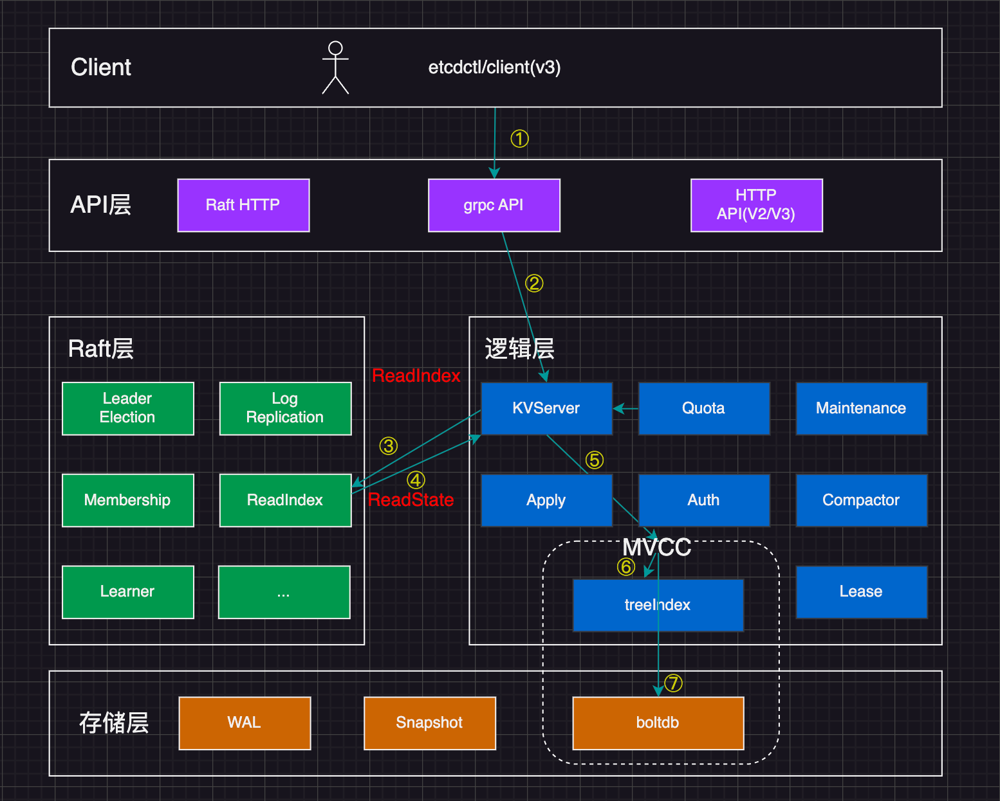
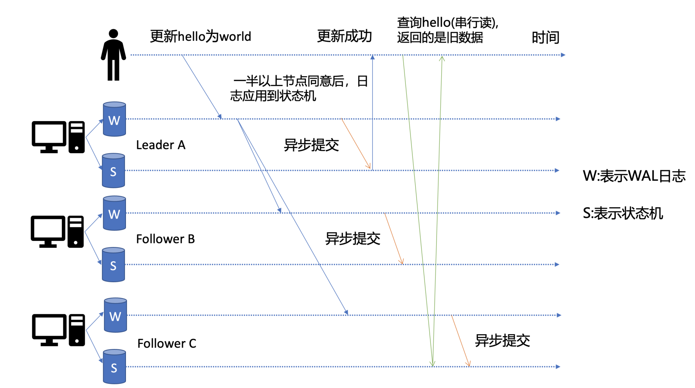
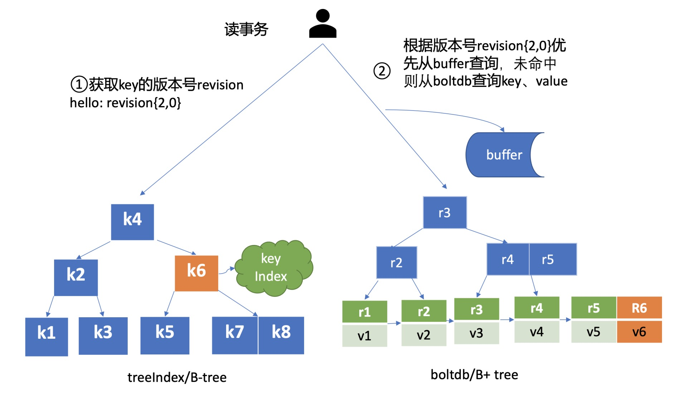

etcd 是典型的读多写少存储，在实际的业务 场景中，读一般占据 2/3 以上的请求。以下分析一个读请求是如何执行的。



# 环境准备

首先介绍一个好用的进程管理工具[goreman](https://github.com/mattn/goreman)，基于它，我们可快速创建、停止本地的多节点 etcd 集群。

你可以通过如下 `go get`命令快速安装 goreman，然后从[etcd release](https://github.com/etcd-io/etcd/releases/v3.4.9)页下载 etcd v3.4.9 二进制文件，再从[etcd 源码](https://github.com/etcd-io/etcd/blob/v3.4.9/Procfile)中下载 goreman Procfile 文件，它描述了 etcd 进程名、节点数、参数等信息。最后通过 `goreman -f Procfile start`命令就可以快速启动一个 3 节点的本地集群了。

> go get github.com/mattn/goreman

# client

启动完 etcd 集群后，当你用 etcd 的客户端工具 etcdctl 执行一个 get hello 命令（如下）时，对应到图中流程一，etcdctl 是如何工作的呢？

> etcdctl get hello --endpoints http://127.0.0.1:2379

首先，etcdctl 会对命令中的参数进行解析，上面的命令，

- get 是请求方法，是 KVServer 模块的 API
- hello 是查询的 key
- endpoints etcd 的后端地址，通常，生产环境配置多个 endpoints，当某个节点故障后，client 可以自动重连到其他正常节点

在解析完请求中的参数后，etcdctl 会创建一个 clientv3 库对象，使用 KVServer 模块的 API 来访问 etcd server。etcd clientV3 采用 Round-robin 负载均衡算法，选择一个 endpoint。

client 和 server 之间的通信，使用的是基于 HTTP/2 的 gRPC 协议。相比 etcd v2 的 HTTP/1.x，HTTP/2 是基于二进制而不是文本、支持多路复用而不再有序且阻塞、支持数据压缩以减少包大小、支持 server push 等特性。因此，基于 HTTP/2 的 gRPC 协议具有低延迟、高性能的特点

# KVServer

client 发送 Range RPC 请求到 server 后，就进入架构图中的流程 2，也就是 KVServer 模块。

etcd 提供了丰富的 metrics、日志、请求行为检查等机制，可记录所有请求的执行耗时及错误码、来源 IP 等，也可控制请求是否允许通过，比如 etcd Learner 节点只允许指定接口和参数的访问，帮助大家定位问题、提高服务可观测性等，而这些特性是怎么非侵入式的实现呢？

## 拦截器

etcd server 定义了如下的 Service KV 和 Range 方法，启动的时候它会将实现 KV 各方法的对象注册到 gRPC Server，并在其上注册对应的拦截器。

```proto3
service KV {
  // Range gets the keys in the range from the key-value store.
  rpc Range(RangeRequest) returns (RangeResponse) {
      option (google.api.http) = {
        post: "/v3/kv/range"
        body: "*"
      };
  }
  ....
}
```

拦截器提供了在执行请求前后 hook 能力，除了我们上面提到的 debug 日志、metrics 统计、对 etcd Learner 节点请求接口和参数限制等能力，etcd 还基于它实现了以下特性:

- 要求执行一个操作前集群必须有 leader
- 请求延时超过指定阈值时，打印包含来源 IP 的查询日志(3.5 版本)

server 收到 client 的 Range RPC 请求后，根据 ServiceName 和 RPC Method 将请求转发到对应的 handler 实现，handler 首先会将上面描述的一系列拦截器串联成一个执行，在拦截器逻辑中，通过调用 KVServer 模块的 Range 接口获取数据。

## 串行读与线性读

进入 KVServer 模块后，就进入了核心的读流程，对应架构图中的 ③ 和 ④。

etcd 为了保证服务高可用，生产环境一般部署多个节点，那各个节点数据在任意时间点读出来都是一致的吗？什么情况下会读到旧数据呢？

先简单提下写流程。如下图所示，当 client 发起一个更新 hello 为 world 请求后，若 Leader 收到写请求，它会将此请求持久化到 WAL 日志，并广播给各个节点，若一半以上节点持久化成功，则该请求对应的日志条目被标识为已提交，etcdserver 模块异步从 Raft 模块获取已提交的日志条目，应用到状态机(boltdb 等)。



此时若 client 发起一个读取 hello 的请求，假设此请求直接从状态机中读取， 如果连接到的是 C 节点，若 C 节点磁盘 I/O 出现波动，可能导致它应用已提交的日志条目很慢，则会出现更新 hello 为 world 的写命令，在 client 读 hello 的时候还未被提交到状态机，因此就可能读取到旧数据，如上图查询 hello 流程所示。

在多节点 etcd 集群中，各个节点的状态机数据一致性存在差异。而我们不同业务场景的读请求对数据是否最新的容忍度是不一样的，有的场景它可以容忍数据落后几秒甚至几分钟，有的场景要求必须读到反映集群共识的最新数据。

首先来看一个 **对数据敏感度较低的场景** 。

假如老板让你做一个旁路数据统计服务，希望你每分钟统计下 etcd 里的服务、配置信息等，这种场景其实对数据时效性要求并不高，读请求可直接从节点的状态机获取数据。即便数据落后一点，也不影响业务，毕竟这是一个定时统计的旁路服务而已。

这种**直接读状态机数据返回、无需通过 Raft 协议与集群进行交互的模式**，在 etcd 里叫做 **串行(** **Serializable** **)读** ，它具有低延时、高吞吐量的特点，适合对数据一致性要求不高的场景。

我们再看一个 **对数据敏感性高的场景** 。

当你发布服务，更新服务的镜像的时候，提交的时候显示更新成功，结果你一刷新页面，发现显示的镜像的还是旧的，再刷新又是新的，这就会导致混乱。再比如说一个转账场景，Alice 给 Bob 转账成功，钱被正常扣出，一刷新页面发现钱又回来了，这也是令人不可接受的。

以上的业务场景就对数据准确性要求极高了，在 etcd 里面，提供了一种**线性读**模式来解决对数据一致性要求高的场景。

### 什么是线性读

你可以理解一旦一个值更新成功，随后任何通过线性读的 client 都能及时访问到。虽然集群中有多个节点，但 client 通过线性读就如访问一个节点一样。etcd 默认读模式是线性读，因为它需要经过 Raft 协议模块，反应的是集群共识，因此在延时和吞吐量上相比串行读略差一点，适用于对数据一致性要求高的场景。

如果你的 etcd 读请求显示指定了是串行读，就不会经过架构图流程中的流程三、四。默认是线性读，因此接下来我们看看读请求进入线性读模块，它是如何工作的。

## 线性读之 ReadIndex

前面我们聊到串行读时提到，它之所以能读到旧数据，主要原因是 Follower 节点收到 Leader 节点同步的写请求后，应用日志条目到状态机是个异步过程，那么我们能否有一种机制在读取的时候，确保最新的数据已经应用到状态机中？


其实这个机制就是叫 ReadIndex，它是在 etcd 3.1 中引入的，我把简化后的原理图放在了上面。当收到一个线性读请求时，它首先会从 Leader 获取集群最新的已提交的日志索引(committed index)，如上图中的流程二所示。

Leader 收到 ReadIndex 请求时，为防止脑裂等异常场景，会向 Follower 节点发送心跳确认，一半以上节点确认 Leader 身份后才能将已提交的索引(committed index)返回给节点 C(上图中的流程三)。

C 节点则会等待，直到状态机已应用索引(applied index)大于等于 Leader 的已提交索引时(committed Index)(上图中的流程四)，然后去通知读请求，数据已赶上 Leader，你可以去状态机中访问数据了(上图中的流程五)。

以上就是线性读通过 ReadIndex 机制保证数据一致性原理， 当然还有其它机制也能实现线性读，如在早期 etcd 3.0 中读请求通过走一遍 Raft 协议保证一致性， 这种 Raft log read 机制依赖磁盘 IO， 性能相比 ReadIndex 较差。

总体而言，KVServer 模块收到线性读请求后，通过架构图中流程三向 Raft 模块发起 ReadIndex 请求，Raft 模块将 Leader 最新的已提交日志索引封装在流程四的 ReadState 结构体，通过 channel 层层返回给线性读模块，线性读模块等待本节点状态机追赶上 Leader 进度，追赶完成后，就通知 KVServer 模块，进行架构图中流程五，与状态机中的 MVCC 模块进行交互。

## MVCC

流程五中的多版本并发控制(Multiversion concurrency control)模块是为了解决 etcd v2 版本不支持存 key 的历史版本，不支持多 key 事务等问题。

核心是由内存树形索引模块(treeIndex)和嵌入式的 kv 持久化存储库 boltdb 组成。

boltdb 是基于 B+tree 实现的 key-val 键值库，支持事务，提供 get/put 等建议的 api 给 etcd 操作。

那么 etcd 如何基于 boltdb 保存一个 key 的多个历史版本呢?

比如我们现在有以下方案：方案 1 是一个 key 保存多个历史版本的值；方案 2 每次修改操作，生成一个新的版本号(revision)，以版本号为 key， value 为用户 key-value 等信息组成的结构体。

很显然方案 1 会导致 value 较大，存在明显读写放大、并发冲等问题，而方案 2 正是 etcd 所采用的。boltdb 的 key 是全局递增的版本号(revision)，value 是用户 key、value 等字段组合成的结构体，然后通过 treeIndex 模块来保存用户 key 和版本号的映射关系。

treeIndex 与 boltdb 关系如下面的读事务流程图所示，从 treeIndex 中获取 key hello 的版本号，再以版本号作为 boltdb 的 key，从 boltdb 中获取其 value 信息。



### treeIndex

treeIndex 模块是基于 Google 开源的内存版 btree 库实现的，为什么 etcd 选择上图中的 B-tree 数据结构保存用户 key 与版本号之间的映射关系，而不是哈希表、二叉树呢？

treeIndex 模块只会保存用户的 key 和相关版本号信息，用户 key 的 value 数据存储在 boltdb 里面，相比 ZooKeeper 和 etcd v2 全内存存储，etcd v3 对内存要求更低。

简单介绍了 etcd 如何保存 key 的历史版本后，架构图中流程六也就非常容易理解了， 它需要从 treeIndex 模块中获取 hello 这个 key 对应的版本号信息。treeIndex 模块基于 B-tree 快速查找此 key，返回此 key 对应的索引项 keyIndex 即可。索引项中包含版本号等信息。

### buffer

在获取到版本号信息后，就可从 boltdb 模块中获取用户的 key-value 数据了。不过有一点你要注意，并不是所有请求都一定要从 boltdb 获取数据。

etcd 出于数据一致性、性能等考虑，在访问 boltdb 前，首先会从一个内存读事务 buffer 中，二分查找你要访问 key 是否在 buffer 里面，若命中则直接返回。

### boltdb

若 buffer 未命中，此时就真正需要向 boltdb 模块查询数据了，进入了流程七。

我们知道 MySQL 通过 table 实现不同数据逻辑隔离，那么在 boltdb 是如何隔离集群元数据与用户数据的呢？答案是 bucket。boltdb 里每个 bucket 类似对应 MySQL 一个表，用户的 key 数据存放的 bucket 名字的是 key，etcd MVCC 元数据存放的 bucket 是 meta。

因 boltdb 使用 B+ tree 来组织用户的 key-value 数据，获取 bucket key 对象后，通过 boltdb 的游标 Cursor 可快速在 B+ tree 找到 key hello 对应的 value 数据，返回给 client。

到这里，一个读请求之路执行完成。

# 问题点

## 1. readIndex 需要请求 leader，那为啥不直接让 leader 返回读请求的结果，而要等待自己的进度赶上 leader？

非常好的问题，我个人认为主要还是性能因素，我记得 etcd v2 早期的时候如果你指定线性读/共识读，它就是直接转发给 leader 的。后来在 etcd v3.0 中实现了 raft log read 但是要走一遍 raft log，读涉及到磁盘 IO，v3.1 中引入了 readIndex 机制，它是非常轻量级的，开销较小，相比各个 follower 都转发给 leader 会导致 leader 负载较高，特别是 expensive request 场景，性能会急剧下降，leader 的内存、cpu、网络带宽资源都很容易耗尽，readIndex 机制的引入，使得每个 follower 节点都可以处理读请求，极大扩展提升了写性能。

比如：如果集群有上万个 pod, 一个 get pod -A 请求估计就几百 M 了，如果都是由 leader 直接返回，那所有线性读压力都在 leader 了，影响 leader 的写性能

## 2. etcd 在执行读请求过程中涉及磁盘 IO 吗？如果涉及，是什么模块在什么场景下会触发呢？如果不涉及，又是什么原因呢？

etcd 在启动的时候会通过 mmap 机制将 etcd db 文件映射到 etcd 进程地址空间，并设置了 mmap 的 MAP_POPULATE flag，它会告诉 Linux 内核预读文件，Linux 内核会将文件内容拷贝到物理内存中，此时会产生磁盘 I/O。节点内存足够的请求下，后续处理读请求过程中就不会产生磁盘 I/IO 了。若 etcd 节点内存不足，可能会导致 db 文件对应的内存页被换出，当读请求命中的页未在内存中时，就会产生缺页异常，导致读过程中产生磁盘 IO，你可以通过观察 etcd 进程的 majflt 字段来判断 etcd 是否产生了主缺页中断
