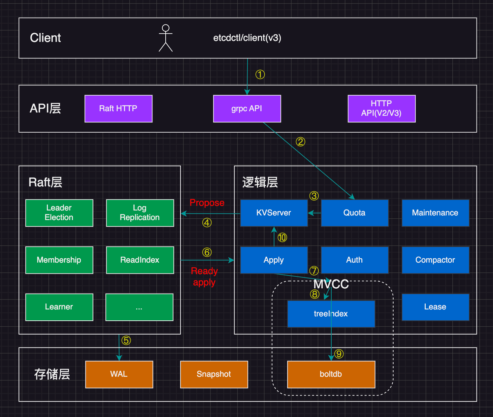
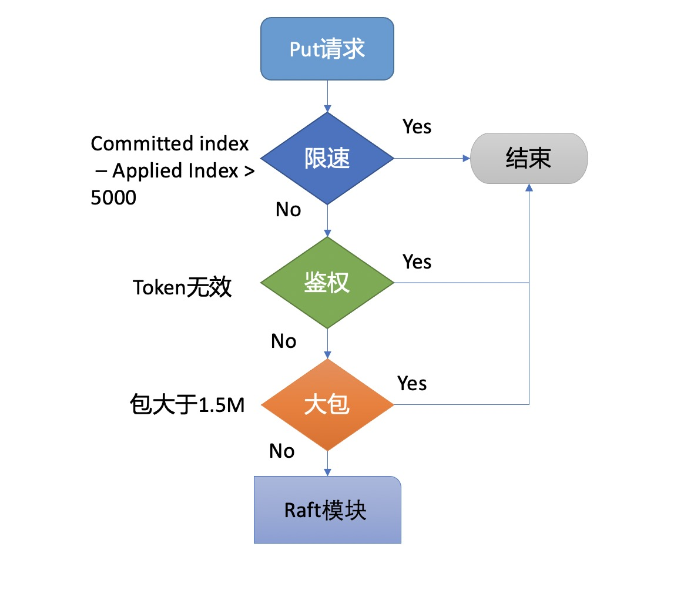
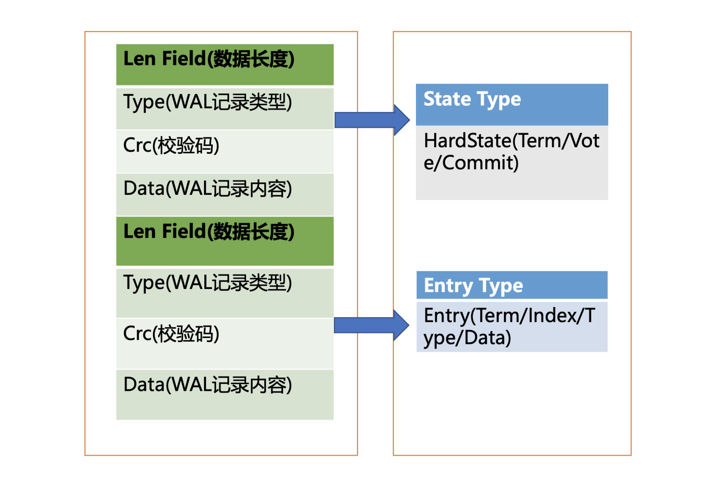
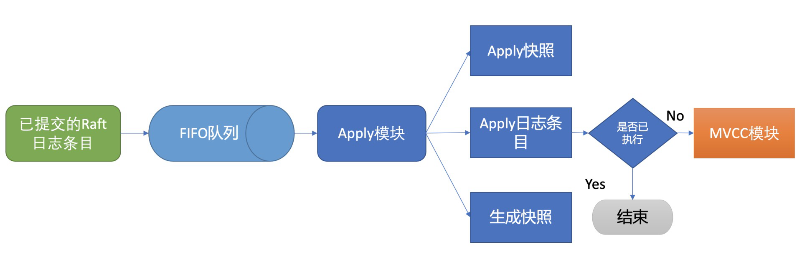
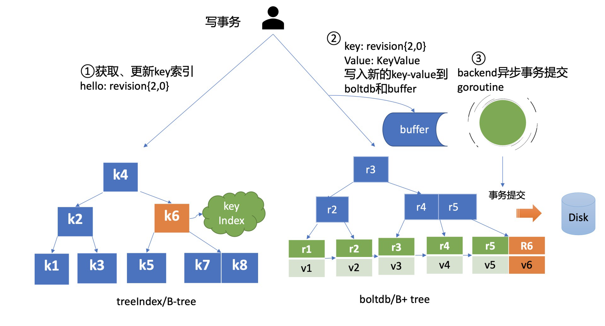

# etcd 写请求的执行流程



```shell
etcdctl put hello world --endpoints http://127.0.0.1:2379
OK

```

client 通过负载均衡算法选择一个 etcd 节点，发起 grpc 调用。节点收到请求后经过 grpc 拦截器、Quota 模块，进入 KVServer 模块，KVServer 向 Raft 模块提交一个提案，提案内容是“大家好，请使用 put 方法执行一个 keywei hello value 为 world 的命令"。

随后提案通过 RaftHTTP 网络模块转发、经过集群多数节点持久化后，状态会变成已提交，etcdserver 从 raft 模块获取已提交的日志条目，传递给 Apply 模块，Apply 模块通过 MVCC 模块执行提案内容，更新状态机。

# Quota

配额限制模块，etcd 默认 db 配额为 2G，当业务数据，写入 QPS、K8s 集群规模增大，etcd db 大小可能超过 2G。

etcd v3 是个 MVCC 数据库，保存了 key 的历史版本，当你未配置压缩策略的时候，随着数据不断写入，db 大小会不断增大，导致超限。

当超过配额后，通常会遇见 `"etcdserver: mvcc: database space exceeded" 报错，此时整个集群将不可写入，只读，对业务的影响很大。`

当 etcd server 收到 put/txn 等写请求时，会首先检查当前 etcd db 大小加上本次请求 的 key-value 大小之和是否超过了配额(quota-backend-bytes)。如果超过了配额，会产生一个告警(Alarm)，告警类型为 NO SPACe，并通过 raft 日志同步给其他节点，告知 db 无空间了，并将告警持久化到 db

最终，无论是 API 层 gRPC 模块还是负责将 Raft 侧已提交的日志条目应用到状态机的 Apply 模块，都拒绝写入，集群只读。

> 遇到这个问题该如何解决呢？

首先当然是调大配额，etcd 社区建议不超过 8G。当调整完配额后，还需要将持久化的告警消除(`etcdctl alarm disarm`)

其次，需要检查 etcd 压缩配置是否开启、配置是否合理。etcd 保存了一个 key 所有历史变更版本，如果没有一个机制去回收旧版本，那么内存和 db 大小就会一直膨胀，压缩模块就是负责回收旧版本的。

压缩模块支持按多种方式回收旧版本，比如保留最近一段时间内的历史版本。不过你要注意，它仅仅是将旧版本占用的空间打个空闲（Free）标记，后续新的数据写入的时候可复用这块空间，而无需申请新的空间。如果你需要回收空间，减少 db 大小，得使用碎片整理（defrag）， 它会遍历旧的 db 文件数据，写入到一个新的 db 文件。但是它对服务性能有较大影响，不建议你在生产集群频繁使用。

# KVServer 模块

通过流程二的配额检查后，请求就从 API 层转发到了流程三的 KVServer 模块的 put 方法，我们知道 etcd 是基于 Raft 算法实现节点间数据复制的，因此它需要将 put 写请求内容打包成一个提案消息，提交给 Raft 模块。不过 KVServer 模块在提交提案前，还有如下的一系列检查和限速。

## Preflight Check

为了保证集群稳定性，避免雪崩，任何提交到 Raft 模块的请求，都会做一些简单的限速判断。如下面的流程图所示，首先，如果 Raft 模块已提交的日志索引（committed index）比已应用到状态机的日志索引（applied index）超过了 5000，那么它就返回一个”etcdserver: too many requests”错误给 client。

然后它会尝试去获取请求中的鉴权信息，若使用了密码鉴权、请求中携带了 token，如果 token 无效，则返回”auth: invalid auth token”错误给 client。

其次它会检查你写入的包大小是否超过默认的 1.5MB， 如果超过了会返回”etcdserver: request is too large”错误给给 client。



## Propose

通过一系列检查之后，会生成一个唯一 ID，将此请求关联到一个对应的消息通知 channel，然后想 raft 模块发起(Propose)提案(Proposal)，提案内容为“”大家好，请使用 put 方法执行一个 key 为 hello, value 为 world 的命令"" 。对应整体架构图中的流程四。

向 Raft 模块发起提案后，KVServer 模块会等待此 put 请求，等待写入结果通过消息通知 channel 返回或者超时。etcd 默认超时时间是 7 秒（5 秒磁盘 IO 延时+2\*1 秒竞选超时时间），如果一个请求超时未返回结果，则可能会出现你熟悉的 etcdserver: request timed out 错误。

## WAL

Raft 模块收到提案后，如果当前节点是 Follower，它会转发给 Leader，只有 Leader 才能处理写请求。Leader 收到提案后，通过 Raft 模块输出待转发给 Follower 节点的消息和待持久化的日志条目，日志条目则封装了我们上面所说的 put hello 提案内容。

etcdserver 从 raft 模块获取到以上消息和日志后，作为 leader，它会将 put 提案消息广播给集群各个节点，同时需要把集群 leader 任期号、投票信息、已提交索引、提案内容持久化到 WAL 日志文件中，用于保证集群的一致性、可恢复性，即流程五。



上图是 wal 结构，由多种类型 wal 记录顺序追加写入，每个记录由类型、数据、循环冗余校验码组成。

WAL 记录类型目前支持 5 种，分别是文件元数据记录、日志条目记录、状态信息记录、CRC 记录、快照记录：

- 文件元数据记录包含节点 ID、集群 ID 信息，它在 WAL 文件创建的时候写入；
- 日志条目记录包含 Raft 日志信息，如 put 提案内容；
- 状态信息记录，包含集群的任期号、节点投票信息等，一个日志文件中会有多条，以最后的记录为准；
- CRC 记录包含上一个 WAL 文件的最后的 CRC（循环冗余校验码）信息， 在创建、切割 WAL 文件时，作为第一条记录写入到新的 WAL 文件， 用于校验数据文件的完整性、准确性等；
- 快照记录包含快照的任期号、日志索引信息，用于检查快照文件的准确性。

> WAL 模块又是如何持久化一个 put 提案的日志条目类型记录呢?

put 写请求对应的 raft 日志条目数据结构如下

- Term 是 Leader 任期号，随着 Leader 选举增加；
- Index 是日志条目的索引，单调递增增加；
- Type 是日志类型，比如是普通的命令日志（EntryNormal）还是集群配置变更日志（EntryConfChange）；
- Data 保存我们上面描述的 put 提案内容。

```go
type Entry struct {
   Term             uint64    `protobuf:"varint，2，opt，name=Term" json:"Term"`
   Index            uint64    `protobuf:"varint，3，opt，name=Index" json:"Index"`
   Type             EntryType `protobuf:"varint，1，opt，name=Type，enum=Raftpb.EntryType" json:"Type"`
   Data             []byte    `protobuf:"bytes，4，opt，name=Data" json:"Data，omitempty"`
}

```

了解完 Raft 日志条目数据结构后，我们再看 WAL 模块如何持久化 Raft 日志条目。它首先先将 Raft 日志条目内容（含任期号、索引、提案内容）序列化后保存到 WAL 记录的 Data 字段， 然后计算 Data 的 CRC 值，设置 Type 为 Entry Type， 以上信息就组成了一个完整的 WAL 记录。

最后计算 WAL 记录的长度，顺序先写入 WAL 长度（Len Field），然后写入记录内容，调用 fsync 持久化到磁盘，完成将日志条目保存到持久化存储中。

当一半以上节点持久化此日志条目后， Raft 模块就会通过 channel 告知 etcdserver 模块，put 提案已经被集群多数节点确认，提案状态为已提交，你可以执行此提案内容了。

于是进入流程六，etcdserver 模块从 channel 取出提案内容，添加到先进先出（FIFO）调度队列，随后通过 Apply 模块按入队顺序，异步、依次执行提案内容。

## Apply 模块

执行 put 提案对应流程七，细节图如下。



> 那么 Apply 模块是如何执行 put 请求的呢？
>
> 若 put 请求提案在执行流程七的时候 etcd 突然 crash 了， 重启恢复的时候，etcd 是如何找回异常提案，再次执行的呢？

核心就是我们上面介绍的 WAL 日志，因为提交给 Apply 模块执行的提案已获得多数节点确认、持久化，etcd 重启时，会从 WAL 中解析出 Raft 日志条目内容，追加到 Raft 日志的存储中，并重放已提交的日志提案给 Apply 模块执行。

然而这又引发了另外一个问题，如何确保幂等性，防止提案重复执行导致数据混乱呢?

我们在上一节课里讲到，etcd 是个 MVCC 数据库，每次更新都会生成新的版本号。如果没有幂等性保护，同样的命令，一部分节点执行一次，一部分节点遭遇异常故障后执行多次，则系统的各节点一致性状态无法得到保证，导致数据混乱，这是严重故障。

因此 etcd 必须要确保幂等性。怎么做呢？Apply 模块从 Raft 模块获得的日志条目信息里，是否有唯一的字段能标识这个提案？

答案就是我们上面介绍 Raft 日志条目中的索引（index）字段。日志条目索引是全局单调递增的，每个日志条目索引对应一个提案， 如果一个命令执行后，我们在 db 里面也记录下当前已经执行过的日志条目索引，是不是就可以解决幂等性问题呢？

是的。但是这还不够安全，如果执行命令的请求更新成功了，更新 index 的请求却失败了，是不是一样会导致异常？

因此我们在实现上，还需要将两个操作作为原子性事务提交，才能实现幂等。

正如我们上面的讨论的这样，etcd 通过引入一个 consistent index 的字段，来存储系统当前已经执行过的日志条目索引，实现幂等性。

Apply 模块在执行提案内容前，首先会判断当前提案是否已经执行过了，如果执行了则直接返回，若未执行同时无 db 配额满告警，则进入到 MVCC 模块，开始与持久化存储模块打交道。

可以看到，要解决幂等，一致性问题，需要有一个全局唯一的或中心化的 机制(consistent index)。

# MVCC

Apply 模块判断此提案未执行后，就会调用 MVCC 模块来执行提案内容。MVCC 主要由两部分组成，一个是内存索引模块 treeIndex，保存 key 的历史版本号信息，另一个是 boltdb 模块，用来持久化存储 key-value 数据。那么 MVCC 模块执行 put hello 为 world 命令时，它是如何构建内存索引和保存哪些数据到 db 呢？

## treeIndex

首先我们来看 MVCC 的索引模块 treeIndex，当收到更新 key hello 为 world 的时候，此 key 的索引版本号信息是怎么生成的呢？需要维护、持久化存储一个全局版本号吗？

版本号（revision）在 etcd 里面发挥着重大作用，它是 etcd 的逻辑时钟。etcd 启动的时候默认版本号是 1，随着你对 key 的增、删、改操作而全局单调递增。

因为 boltdb 中的 key 就包含此信息，所以 etcd 并不需要再去持久化一个全局版本号。我们只需要在启动的时候，从最小值 1 开始枚举到最大值，未读到数据的时候则结束，最后读出来的版本号即是当前 etcd 的最大版本号 currentRevision。

MVCC 写事务在执行 put hello 为 world 的请求时，会基于 currentRevision 自增生成新的 revision 如{2,0}，然后从 treeIndex 模块中查询 key 的创建版本号、修改次数信息。这些信息将填充到 boltdb 的 value 中，同时将用户的 hello key 和 revision 等信息存储到 B-tree，也就是下面简易写事务图的流程一，整体架构图中的流程八。



## boltdb

MVCC 写事务自增全局版本号生成的 revision{2,0}，它就是 boltdb 的 key，通过它就可以往 boltdb 写数据了，进入了整体架构图中的流程九。

boltdb 上一篇我们提过它是一个基于 B+tree 实现的 key-value 嵌入式 db，它通过提供桶（bucket）机制实现类似 MySQL 表的逻辑隔离。

在 etcd 里面你通过 put/txn 等 KV API 操作的数据，全部保存在一个名为 key 的桶里面，这个 key 桶在启动 etcd 的时候会自动创建。

除了保存用户 KV 数据的 key 桶，etcd 本身及其它功能需要持久化存储的话，都会创建对应的桶。比如上面我们提到的 etcd 为了保证日志的幂等性，保存了一个名为 consistent index 的变量在 db 里面，它实际上就存储在元数据（meta）桶里面。

> 那么写入 boltdb 的 value 含有哪些信息呢？

写入 boltdb 的 value， 并不是简单的”world”，如果只存一个用户 value，索引又是保存在易失的内存上，那重启 etcd 后，我们就丢失了用户的 key 名，无法构建 treeIndex 模块了。

因此为了构建索引和支持 Lease 等特性，etcd 会持久化以下信息:

- key 名称；
- key 创建时的版本号（create_revision）、最后一次修改时的版本号（mod_revision）、key 自身修改的次数（version）；
- value 值；
- 租约信息

boltdb value 的值就是将含以上信息的结构体序列化成的二进制数据，然后通过 boltdb 提供的 put 接口，etcd 就快速完成了将你的数据写入 boltdb，对应上面简易写事务图的流程二。

> 但是 put 调用成功，就能够代表数据已经持久化到 db 文件了吗？

这里需要注意的是，在以上流程中，etcd 并未提交事务（commit），因此数据只更新在 boltdb 所管理的内存数据结构中。

事务提交的过程，包含 B+tree 的平衡、分裂，将 boltdb 的脏数据（dirty page）、元数据信息刷新到磁盘，因此事务提交的开销是昂贵的。如果我们每次更新都提交事务，etcd 写性能就会较差。

那么解决的办法是什么呢？etcd 的解决方案是合并再合并。

首先 boltdb key 是版本号，put/delete 操作时，都会基于当前版本号递增生成新的版本号，因此属于顺序写入，可以调整 boltdb 的 bucket.FillPercent 参数，使每个 page 填充更多数据，减少 page 的分裂次数并降低 db 空间。

其次 etcd 通过合并多个写事务请求，通常情况下，是异步机制定时（默认每隔 100ms）将批量事务一次性提交（pending 事务过多才会触发同步提交）， 从而大大提高吞吐量，对应上面简易写事务图的流程三。

但是这优化又引发了另外的一个问题， 因为事务未提交，读请求可能无法从 boltdb 获取到最新数据。

为了解决这个问题，etcd 引入了一个 bucket buffer 来保存暂未提交的事务数据。在更新 boltdb 的时候，etcd 也会同步数据到 bucket buffer。因此 etcd 处理读请求的时候会优先从 bucket buffer 里面读取，其次再从 boltdb 读，通过 bucket buffer 实现读写性能提升，同时保证数据一致性。

# 问题

## 1. expensive request 是否影响写请求性能？

要搞懂这个问题，我们得回顾下 etcd 读写性能优化历史。

在 etcd 3.0 中，线性读请求需要走一遍 Raft 协议持久化到 WAL 日志中，因此读性能非常差，写请求肯定也会被影响。

在 etcd 3.1 中，引入了 ReadIndex 机制提升读性能，读请求无需再持久化到 WAL 中。

在 etcd 3.2 中, 优化思路转移到了 MVCC/boltdb 模块，boltdb 的事务锁由粗粒度的互斥锁，优化成读写锁，实现“N reads or 1 write”的并行，同时引入了 buffer 来提升吞吐量。问题就出在这个 buffer，读事务会加读锁，写事务结束时要升级锁更新 buffer，但是 expensive request 导致读事务长时间持有锁，最终导致写请求超时。

在 etcd 3.4 中，实现了全并发读，创建读事务的时候会全量拷贝 buffer, 读写事务不再因为 buffer 阻塞，大大缓解了 expensive request 对 etcd 性能的影响。尤其是 Kubernetes List Pod 等资源场景来说，etcd 稳定性显著提升
