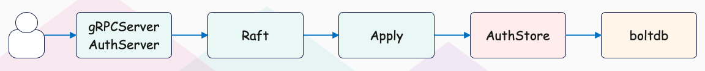
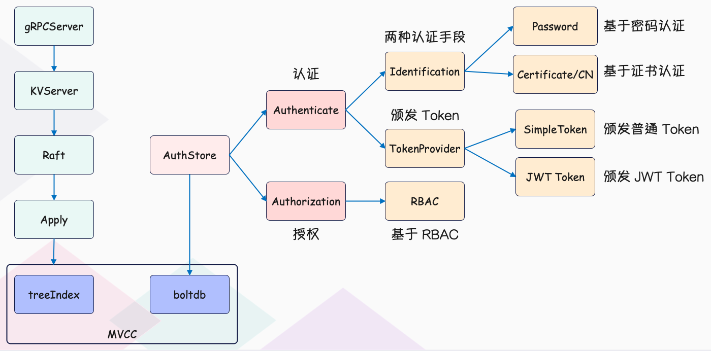
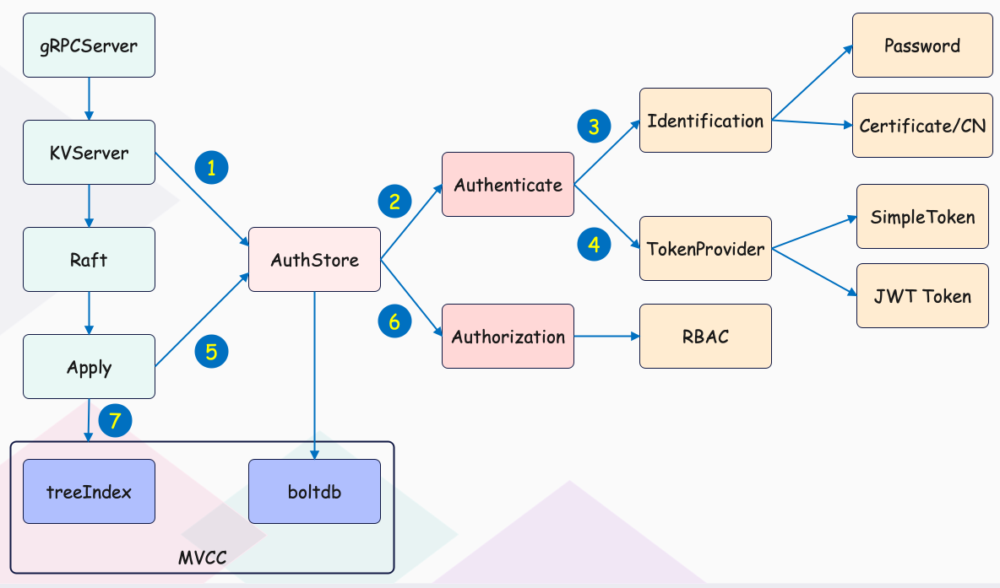
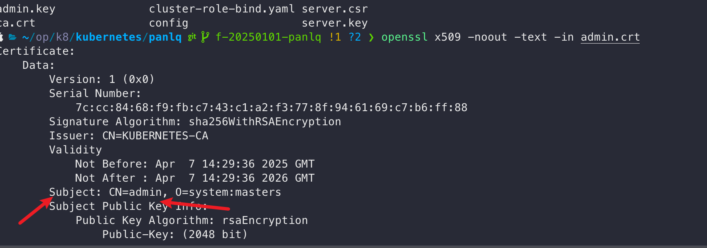
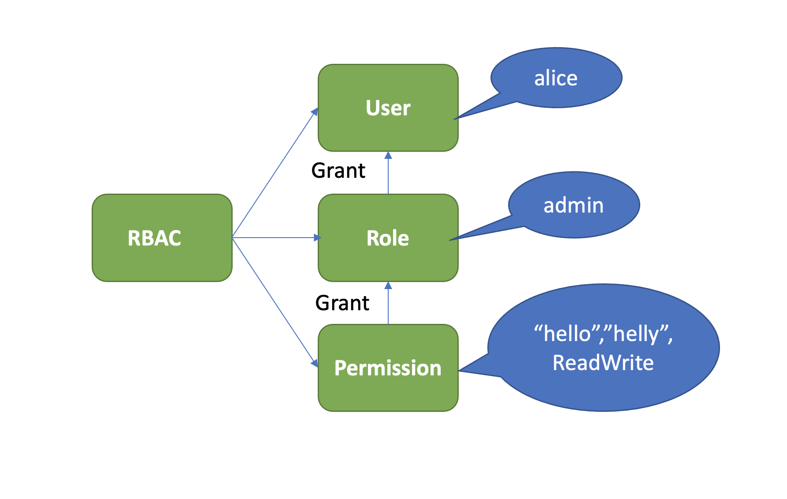

# 整体架构



上图是是 etcd 鉴权体系控制面，你可以通过客户端工具 etcdctl 和鉴权 API 动态调整认证、鉴权规则，AuthServer 收到请求后，为了确保各节点间鉴权元数据一致性，会通过 Raft 模块进行数据同步。

当对应的 Raft 日志条目被集群半数以上节点确认后，Apply 模块通过鉴权存储(AuthStore)模块，执行日志条目的内容，将规则存储到 boltdb 的一系列“鉴权表”里面。

下图是数据面鉴权流程，由认证和授权流程组成。认证的目的是检查 client 的身份是否合法、防止匿名用户访问等。目前 etcd 实现了两种认证机制，分别是密码认证和证书认证。



认证通过后，**为了提高密码认证性能**，会分配一个 Token（类似我们生活中的门票、通信证）给 client，client 后续其他请求携带此 Token，server 就可快速完成 client 的身份校验工作。

实现分配 Token 的服务也有多种，这是 TokenProvider 所负责的，目前支持 SimpleToken 和 JWT 两种。

通过认证后，在访问 MVCC 模块之前，还需要通过授权流程。授权的目的是检查 client 是否有权限操作你请求的数据路径，etcd 实现了 RBAC 机制，支持为每个用户分配一个角色，为每个角色授予最小化的权限。



# 认证

如何防止匿名用户访问你的 etcd 数据呢？--》用户身份认证，etcd 目前实现了两种机制，分别是用户密码认证和证书认证

## 密码认证

etcd 支持为每个用户分配一个账号名称、密码。密码认证在我们生活中无处不在，从银行卡取款到微信、微博 app 登录，再到核武器发射，密码认证应用及其广泛，是最基础的鉴权的方式。

但密码认证存在两大难点，它们分别是如何保障密码安全性和提升密码认证性能。

### 如何保障密码的安全性

**增强不可逆 hash 算法的破解难度**

一方面我们可以使用安全性更高的 hash 算法，比如 SHA-256，它输出位数更多、计算更加复杂且耗 CPU。

另一方面我们可以在每个用户密码 hash 值的计算过程中，引入一个随机、较长的加盐(salt)参数，它可以让相同的密码输出不同的结果，这让彩虹表破解直接失效。

彩虹表是黑客破解密码的一种方法之一，它预加载了常用密码使用 MD5/SHA-1 计算的 hash 值，可通过 hash 值匹配快速破解你的密码。

最后我们还可以增加密码 hash 值计算过程中的开销，比如循环迭代更多次，增加破解的时间成本。

### **etcd 的鉴权模块如何安全存储用户密码？**

etcd 的用户密码存储正是融合了以上讨论的高安全性 hash 函数（Blowfish encryption algorithm）、随机的加盐 salt、可自定义的 hash 值计算迭代次数 cost。

下面我将通过几个简单 etcd 鉴权 API，为你介绍密码认证的原理。

首先你可以通过如下的 auth enable 命令开启鉴权，注意 etcd 会先要求你创建一个 root 账号，它拥有集群的最高读写权限。

```shell
$ etcdctl user add root:root
User root created
$ etcdctl auth enable
Authentication Enabled
```

启用鉴权后，这时 client 发起如下 put hello 操作时， etcd server 会返回”user name is empty”错误给 client，就初步达到了防止匿名用户访问你的 etcd 数据目的。 那么 etcd server 是在哪里做的鉴权的呢?

```sql
$ etcdctl put hello world
Error: etcdserver: user name is empty
```

etcd server 收到 put hello 请求的时候，在提交到 Raft 模块前，它会从你请求的上下文中获取你的用户身份信息。如果你未通过认证，那么在状态机应用 put 命令的时候，检查身份权限的时候发现是空，就会返回此错误给 client。

下面我通过鉴权模块的 user 命令，给 etcd 增加一个 jon 账号。我们一起来看看 etcd 鉴权模块是如何基于我上面介绍的技术方案，来安全存储 jon 账号信息。

```bash
etcdctl user add jon:jon --user root:root
```

**鉴权模块收到此命令后，它会使用 bcrpt 库的 blowfish 算法，基于明文密码、随机分配的 salt、自定义的 cost、迭代多次计算得到一个 hash 值，并将加密算法版本、salt 值、cost、hash 值组成一个字符串，作为加密后的密码。**

鉴权模块将用户名 alice 作为 key，用户名、加密后的密码作为 value，存储到 boltdb 的 authUsers bucket 里面，完成一个账号创建。

当使用 jon 账号访问 etcd 的时候，你需要先调用鉴权模块的 Authenticate 接口，它会验证你的身份合法性。

那么 etcd 如何验证你密码正确性的呢？

鉴权模块首先会根据你请求的用户名 jon，从 boltdb 获取加密后的密码，因此 hash 值包含了算法版本、salt、cost 等信息，因此可以根据你请求中的明文密码，计算出最终的 hash 值，若计算结果与存储一致，那么身份校验通过。

## [如何提升密码认证的性能?](https://github.com/ahrtr/etcd-issues/blob/master/docs/token_management.md)

通过以上的鉴权安全性的深入分析，我们知道身份验证这个过程开销极其昂贵，那么问题来了，如何避免频繁、昂贵的密码计算匹配，提升密码认证的性能呢？

这就是密码认证的第二个难点，如何保证性能。

想想我们办理港澳通行证的时候，流程特别复杂，需要各种身份证明、照片、指纹信息，办理成功后，下发通信证，每次过关你只需要刷下通信证即可，高效而便捷。

那么，在软件系统领域如果身份验证通过了后，我们是否也可以返回一个类似通信证的凭据给 client，后续请求携带通信证，只要通行证合法且在有效期内，就无需再次鉴权了呢？

是的，etcd 也有类似这样的凭据。当 etcd server 验证用户密码成功后，它就会返回一个 Token 字符串给 client，用于表示用户的身份。后续请求携带此 Token，就无需再次进行密码校验，实现了通信证的效果。

etcd 目前支持两种 Token，分别为 Simple Token 和 JWT Token。

当通过账号密码认证后，etcd server 会自动为该用户生成一个 token, 至于是那种类型的 token ，就看启动 server 时[--auth-token](https://etcd.io/docs/v3.3/op-guide/configuration/#--auth-token)的配置，默认是 simple toke。

### Simple Token

Simple Token 的核心原理是当一个用户身份验证通过后，生成一个随机的字符串值 Token 返回给 client，并在内存中使用 map 存储用户和 Token 映射关系。当收到用户的请求时， etcd 会从请求中获取 Token 值，转换成对应的用户名信息，返回给下层模块使用。

Token 是你身份的象征，若此 Token 泄露了，那你的数据就可能存在泄露的风险。etcd 是如何应对这种潜在的安全风险呢？

etcd 生成的每个 Token，都有一个过期时间 TTL 属性，Token 过期后 client 需再次验证身份，因此可显著缩小数据泄露的时间窗口，在性能上、安全性上实现平衡。

在 etcd v3.4.9 版本中，Token 默认有效期是 5 分钟，etcd server 会定时检查你的 Token 是否过期，若过期则从 map 数据结构中删除此 Token。

不过你要注意的是，Simple Token 字符串本身并未含任何有价值信息，因此 client 无法及时、准确获取到 Token 过期时间。所以 client 不容易提前去规避因 Token 失效导致的请求报错。

从以上介绍中，你觉得 Simple Token 有哪些不足之处？为什么 etcd 社区仅建议在开发、测试环境中使用 Simple Token 呢？

首先它是有状态的，etcd server 需要使用内存存储 Token 和用户名的映射关系。

其次，它的可描述性很弱，client 无法通过 Token 获取到过期时间、用户名、签发者等信息。

etcd 鉴权模块实现的另外一个 Token Provider 方案 JWT，正是为了解决这些不足之处而生。

### JWT Token

JWT 是 Json Web Token 缩写， 它是一个基于 JSON 的开放标准（RFC 7519）定义的一种紧凑、独立的格式，可用于在身份提供者和服务提供者间，传递被认证的用户身份信息。它由 Header、Payload、Signature 三个对象组成， 每个对象都是一个 JSON 结构体。

第一个对象是 Header，它包含 alg 和 typ 两个字段，alg 表示签名的算法，etcd 支持 RSA、ESA、PS 系列，typ 表示类型就是 JWT。

```bash
{
"alg": "RS256"，
"typ": "JWT"
}
```

第二对象是 Payload，它表示载荷，包含用户名、过期时间等信息，可以自定义添加字段。

```css
{
"username": username，
"revision": revision，
"exp":      time.Now().Add(t.ttl).Unix()，
}
```

第三个对象是签名，首先它将 header、payload 使用 base64 url 编码，然后将编码后的

字符串用”.“连接在一起，最后用我们选择的签名算法比如 RSA 系列的私钥对其计算签名，输出结果即是 Signature。

```makefile
signature=RSA256(
base64UrlEncode(header) + "." +
base64UrlEncode(payload)，
key)

```

JWT 就是由 base64UrlEncode(header).base64UrlEncode(payload).signature 组成。

JWT Token 自带用户名、版本号、过期时间等描述信息，etcd server 不需要保存它，client 可方便、高效的获取到 Token 的过期时间、用户名等信息。它解决了 Simple Token 的若干不足之处，安全性更高，etcd 社区建议大家在生产环境若使用了密码认证，应使用 JWT Token( –auth-token ‘jwt’)，而不是默认的 Simple Token。

## 证书认证

密码认证一般使用在 client 和 server 基于 HTTP 协议通信的内网场景中。当对安全有更高要求的时候，你需要使用 HTTPS 协议加密通信数据，防止中间人攻击和数据被篡改等安全风险。

HTTPS 是利用非对称加密实现身份认证和密钥协商，因此使用 HTTPS 协议的时候，你需要使用 CA 证书给 client 生成证书才能访问。

那么一个 client 证书包含哪些信息呢？使用证书认证的时候，etcd server 如何知道你发送的请求对应的用户名称？

我们可以使用下面的 openssl 命令查看 client 证书的内容，下图是一个 x509 client 证书的内容，它含有证书版本、序列号、签名算法、签发者、有效期、主体名等信息，重点要关注的是主体名中的 CN 字段。



# 授权

当我们使用如上创建的 alice 账号执行 put hello 操作的时候，etcd 却会返回如下的”etcdserver: permission denied”无权限错误，这是为什么呢？

```javascript
$ etcdctl put hello world --user jon:jon
Error: etcdserver: permission denied
```

这是因为开启鉴权后，put 请求命令在应用到状态机前，etcd 还会对发出此请求的用户进行权限检查， 判断其是否有权限操作请求的数据。常用的权限控制方法有 ACL(Access Control List)、ABAC(Attribute-based access control)、RBAC(Role-based access control)，etcd 实现的是 RBAC 机制

## RBAC



- User: 用户，可以拥有多个角色
- Role：角色，是权限赋予的对象，
- Permission：权限明细
  - READ
  - WRITE
  - READWRITE

创建用户

> etcdctl user add user:password

创建角色

> etcdctl role add devh

授权

> etcdctl role grant-permission [options] `<role name>` `<permission type>` `<key>` [endkey] [flags]

> #创建一个 devh 角色
>
> etcdctl role add devh --user root:root
>
> #给角色分配权限
>
> etcdctl --user root:root role grant-permission devh readwrite hello helly
>
> #给用户绑定角色
>
> etcdctl user grant-role jon devh --user root:root

etcd 的 RBAC 中，对 key 的授权可以使用 Range 模式，是一个半开区间。左闭右开。

上面命令含义：分配可读写[hello, helly)范围数据的全在你给 devl 角色，并给将角色授权给 jon 用户。

这样一来 jon 就可以操作[hello,helly)范围的数据了。

### **[hello, helly) 范围表示什么？**

在 `etcd` 中，键的范围是基于字典序（也称为字典顺序或字母顺序）来定义的，**字典序就像字典中单词的排列顺序，先比较第一个字符，如果相同则比较第二个字符**，以此类推。对于键范围 `[hello, helly)`，下面详细说明其定义和具体示例：

#### 在范围内的键

- **`hello`** ：它是范围的起始键，所以在范围内。
- **`helloa`** ：从字典序看，它在 `hello` 之后（因为在 `hello` 的基础上多了字符 `a`），同时在 `helly` 之前，所以在范围内。
- **`hellob`** ：同理，它也在 `hello` 之后且在 `helly` 之前，属于范围内的键。

#### 不在范围内的键

- **`hallo`** ：按照字典序，`hallo` 在 `hello` 之前，因为比较到第三个字符时，`a` 在 `e` 之前，所以不在 `[hello, helly)` 范围内。
- **`helly`** ：作为范围的结束键，但是左闭右开。
- **`hellyz`** ：它在 `helly` 之后，因为在 `helly` 的基础上多了字符 `z`，所以不在该范围内。

```bash

etcdctl put hellx hx --user jon:jon
OK
  ~/ownerpro/panlq-github ❯ etcdctl put hey hey --user jon:jon
{"level":"warn","ts":"2025-04-29T15:17:39.871683+0800","logger":"etcd-client","caller":"v3@v3.5.15/retry_interceptor.go:63","msg":"retrying of unary invoker failed","target":"etcd-endpoints://0x140000ce000/127.0.0.1:2379","attempt":0,"error":"rpc error: code = PermissionDenied desc = etcdserver: permission denied"}
Error: etcdserver: permission denied
```

当使用 etcdctl 执行 put hello 命令时，鉴权模块会从 boltdb 查询 alice 用户对应的权限列表。

因为有可能一个用户拥有成百上千个权限列表，etcd 为了提升权限检查的性能，引入了区间树，检查用户操作的 key 是否在已授权的区间，时间复杂度仅为 O(logN)

# 参考与延伸阅读

1. [etcd 是如何通过鉴权实现数据安全的？详解 etcd 的认证、授权与权限 ](https://www.cnblogs.com/traditional/p/17444921.html "发布于 2023-05-31 00:19")
