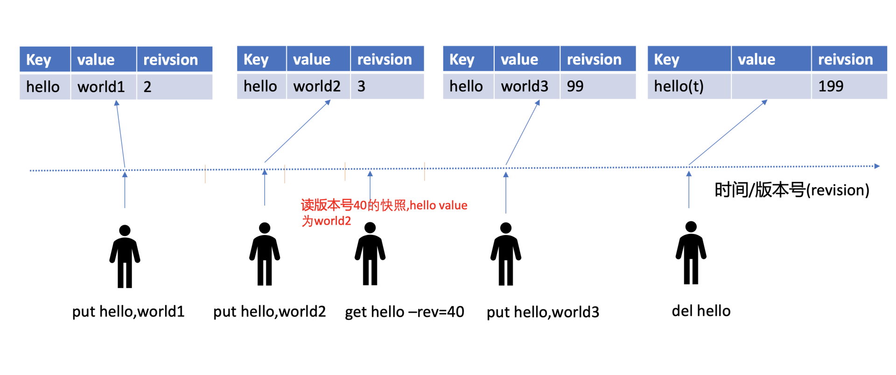
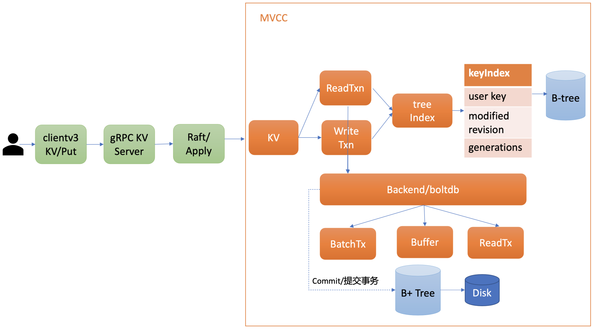
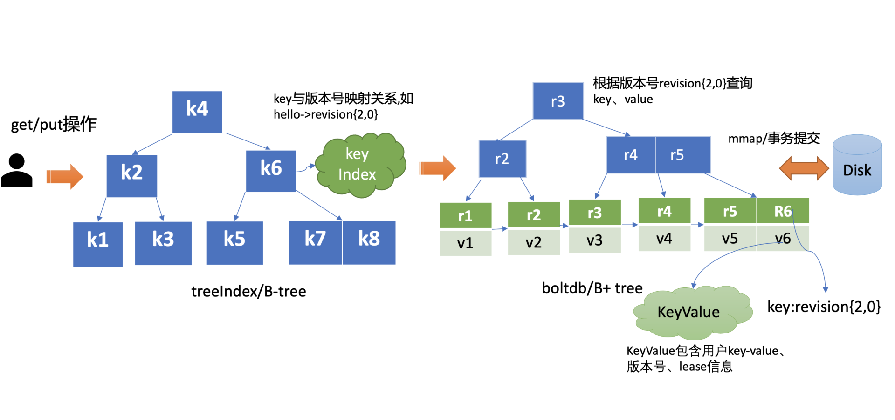
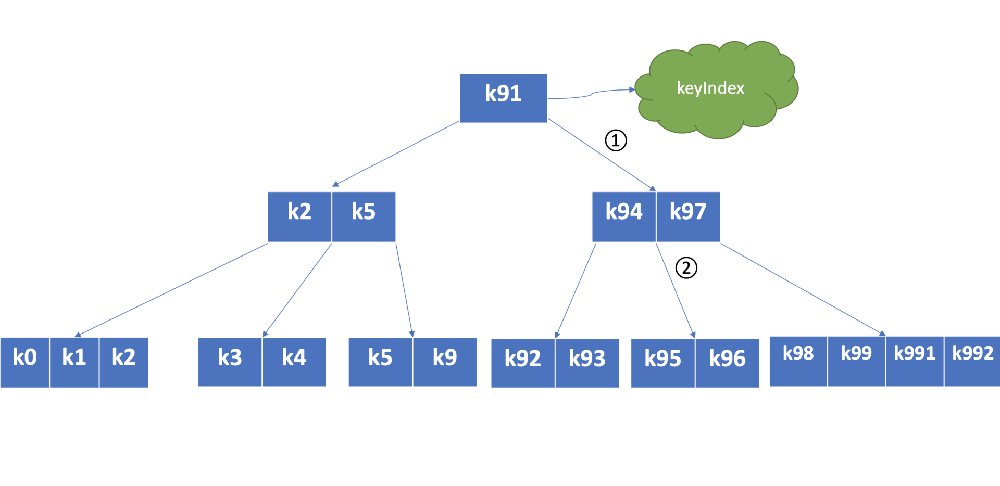
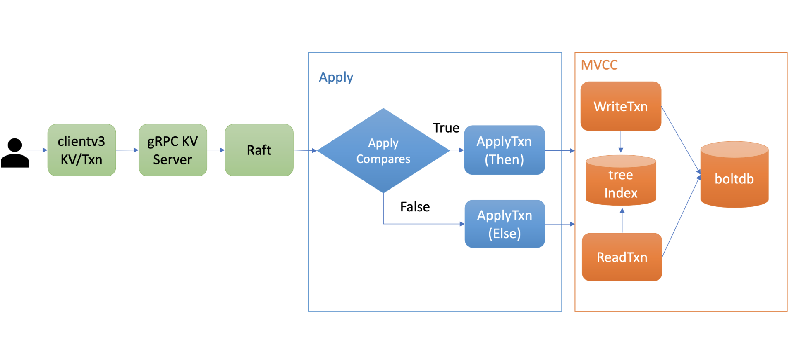
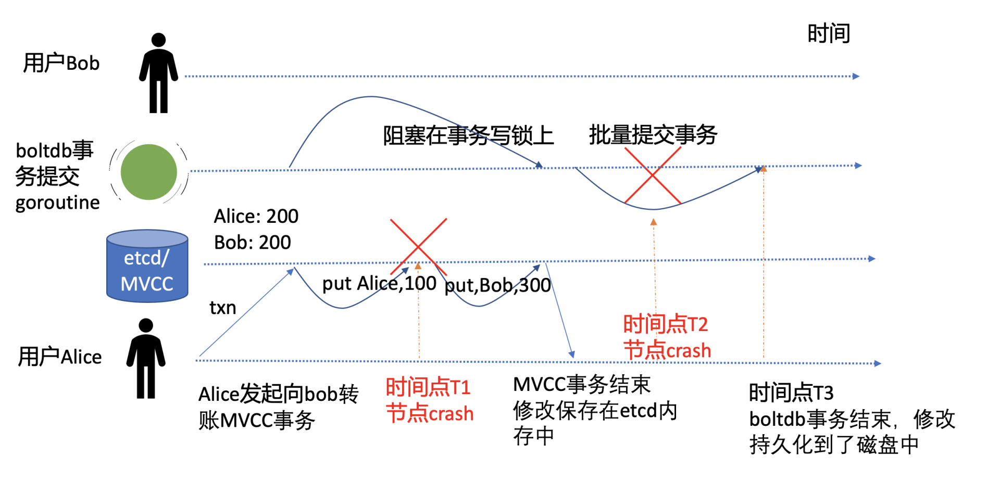
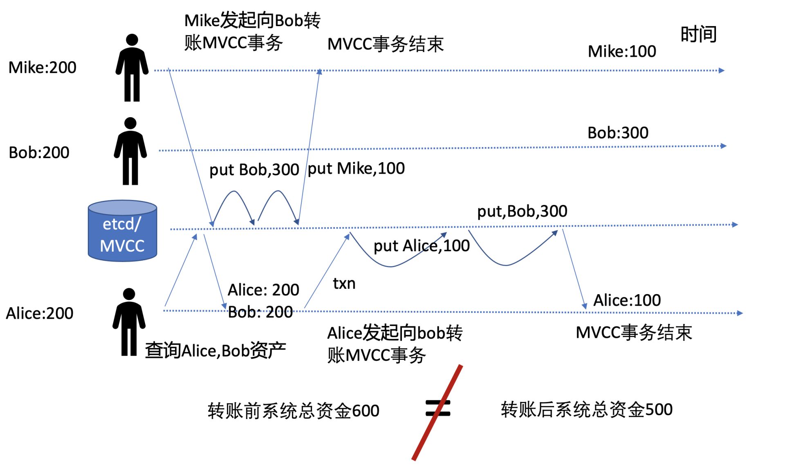
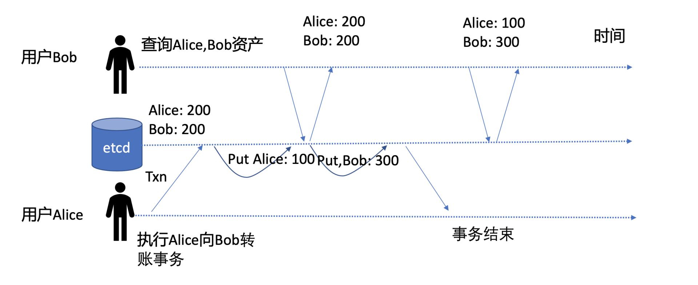
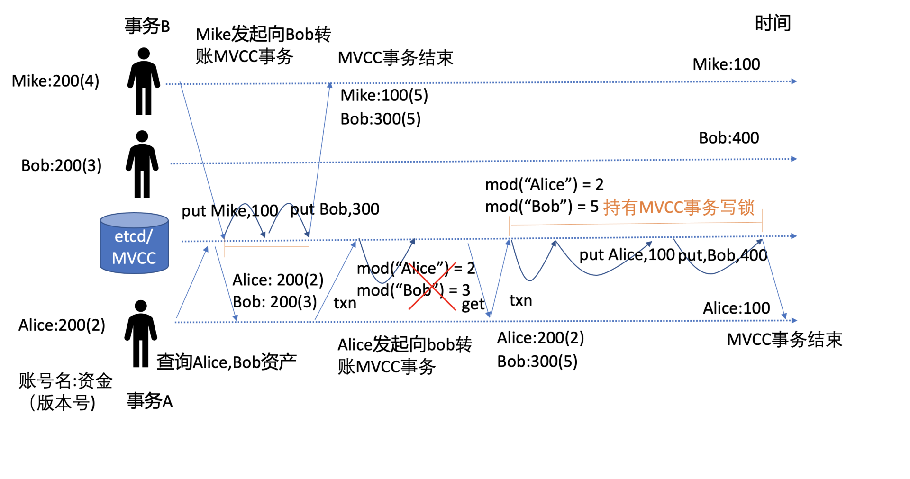

# 1. 目的

1. 解决什么问题？
2. 了解 etcd 是如何实现 mvcc 的，在 key-val 存储中怎么保证 acid
3. 如何做到事务隔离
4. 增删改查的具体实现

# 2. 背景

etcd v2 存在若干局限，如仅保留最新版本 key-value 数据、丢弃历史版本。而 etcd 核心特性 watch 又依赖历史版本，因此 etcd v2 为了缓解这个问题，会在内存中维护一个较短的全局事件滑动窗口，保留最近的 1000 条变更事件。但是在集群写请求较多等场景下，它依然无法提供可靠的 Watch 机制。

在 etcd v3 中用 MVCC（Multiversion concurrency control）机制解决上面的问题。

MVCC 机制的核心思想是保存一个 key-value 数据的多个历史版本，etcd 基于它不仅实现了可靠的 Watch 机制，避免了 client 频繁发起 List Pod 等 expensive request 操作，保障 etcd 集群稳定性。而且 MVCC 还能以较低的并发控制开销，实现各类隔离级别的事务，保障事务的安全性，是事务特性的基础。

# 3. MVCC 简述

什么是 MVCC，从名字上理解，它是一个基于多版本技术实现的一种并发控制机制。那常见的并发机制有哪些？MVCC 的优点在哪里呢？

提到并发控制机制你可能就没那么陌生了，比如数据库中的悲观锁，也就是通过锁机制确保同一时刻只能有一个事务对数据进行修改操作，常见的实现方案有读写锁、互斥锁、两阶段锁等。

悲观锁是一种事先预防机制，它悲观地认为多个并发事务可能会发生冲突，因此它要求事务必须先获得锁，才能进行修改数据操作。但是悲观锁粒度过大、高并发场景下大量事务会阻塞等，会导致服务性能较差。

**MVCC 机制正是基于多版本技术实现的一种乐观锁机制** ，它乐观地认为数据不会发生冲突，但是当事务提交时，具备检测数据是否冲突的能力。

在 MVCC 数据库中，你更新一个 key-value 数据的时候，它并不会直接覆盖原数据，而是新增一个版本来存储新的数据，每个数据都有一个版本号。版本号它是一个逻辑时间，为了方便你深入理解版本号意义，在下面我给你画了一个 etcd MVCC 版本号时间序列图。

从图中你可以看到，随着时间增长，你每次修改操作，版本号都会递增。每修改一次，生成一条新的数据记录。 **当你指定版本号读取数据时，它实际上访问的是版本号生成那个时间点的快照数据** 。当你删除数据的时候，它实际也是新增一条带删除标识的数据记录。



# mvcc 整体架构

下图是 MVCC 模块的一个整体架构图，整个 MVCC 特性由 treeIndex、Backend/boltdb 组成。

当你执行 MVCC 特性初体验中的 put 命令后，请求经过 gRPC KV Server、Raft 模块流转，对应的日志条目被提交后，Apply 模块开始执行此日志内容。



Apply 模块通过 MVCC 模块来执行 put 请求，持久化 key-value 数据。MVCC 模块将请求请划分成两个类别，分别是读事务（ReadTxn）和写事务（WriteTxn）。读事务负责处理 range 请求，写事务负责 put/delete 操作。读写事务基于 treeIndex、Backend/boltdb 提供的能力，实现对 key-value 的增删改查功能。

- treeIndex 模块基于内存版 B-tree 实现了 key 索引管理，它保存了用户 key 与版本号（revision）的映射关系等信息。
- Backend 模块负责 etcd 的 key-value 持久化存储，主要由 ReadTx、BatchTx、Buffer 组成，ReadTx 定义了抽象的读事务接口，BatchTx 在 ReadTx 之上定义了抽象的写事务接口，Buffer 是数据缓存区。

etcd 设计上支持多种 Backend 实现，目前实现的 Backend 是 boltdb。boltdb 是一个基于 B+ tree 实现的、支持事务的 key-value 嵌入式数据库。

treeIndex 与 boltdb 关系你可参考下图。当你发起一个 get hello 命令时，从 treeIndex 中获取 key 的版本号，然后再通过这个版本号，从 boltdb 获取 value 信息。boltdb 的 value 是包含用户 key-value、各种版本号、lease 信息的结构体。



## treeIndex 原理

为什么需要 treeIndex 模块呢?

对于 etcd v2 来说，当你通过 etcdctl 发起一个 put hello 操作时，etcd v2 直接更新内存树，这就导致历史版本直接被覆盖，无法支持保存 key 的历史版本。在 etcd v3 中引入 treeIndex 模块正是为了解决这个问题，支持保存 key 的历史版本，提供稳定的 Watch 机制和事务隔离等能力

> Q: 那 etcd v3 又是如何基于 treeIndex 模块，实现保存 key 的历史版本的呢?

etcd 在每次修改 key 时会生成一个全局递增的版本号（revision），然后通过数据结构 B-tree 保存用户 key 与版本号之间的关系，再以版本号作为 boltdb key，以用户的 key-value 等信息作为 boltdb value，保存到 boltdb。

etcd 保存用户 key 与版本号映射关系的数据结构 B-tree，为什么 etcd 使用它而不使用哈希表、平衡二叉树？

> 从 etcd 的功能特性上分析， 因 etcd 支持范围查询，因此保存索引的数据结构也必须支持范围查询才行。所以哈希表不适合，而 B-tree 支持范围查询。
>
> 从性能上分析，平横二叉树每个节点只能容纳一个数据、导致树的高度较高，而 B-tree 每个节点可以容纳多个数据，树的高度更低，更扁平，涉及的查找次数更少，具有优越的增、删、改、查性能。

下图是个最大度（degree > 1，简称 d）为 5 的 B-tree，度是 B-tree 中的一个核心参数，它决定了你每个节点上的数据量多少、节点的“胖”、“瘦”程度。

从图中你可以看到，节点越胖，意味着一个节点可以存储更多数据，树的高度越低。在一个度为 d 的 B-tree 中，节点保存的最大 key 数为 2d - 1，否则需要进行平衡、分裂操作。这里你要注意的是在 etcd treeIndex 模块中，创建的是最大度 32 的 B-tree，也就是一个叶子节点最多可以保存 63 个 key。



从图中你可以看到，你通过 put/txn 命令写入的一系列 key，treeIndex 模块基于 B-tree 将其组织起来，节点之间基于用户 key 比较大小。当你查找一个 key k95 时，通过 B-tree 的特性，你仅需通过图中流程 1 和 2 两次快速比较，就可快速找到 k95 所在的节点。

在 treeIndex 中，每个节点的 key 是一个 keyIndex 结构，etcd 就是通过它保存了用户的 key 与版本号的映射关系。

```go
type keyIndex struct {
   key         []byte //用户的key名称，比如我们案例中的"hello"
   modified    revision //最后一次修改key时的etcd版本号,比如我们案例中的刚写入hello为world1时的，版本号为2
   generations []generation //generation保存了一个key若干代版本号信息，每代中包含对key的多次修改的版本号列表
}
```

keyIndex 中包含用户的 key、最后一次修改 key 时的 etcd 版本号、key 的若干代（generation）版本号信息，每代中包含对 key 的多次修改的版本号列表。那我们要如何理解 generations？为什么它是个数组呢?

generations 表示一个 key 从创建到删除的过程，每代对应 key 的一个生命周期的开始与结束。当你第一次创建一个 key 时，会生成第 0 代，后续的修改操作都是在往第 0 代中追加修改版本号。当你把 key 删除后，它就会生成新的第 1 代，一个 key 不断经历创建、删除的过程，它就会生成多个代。

```go
type generation struct {
   ver     int64    //表示此key的修改次数
   created revision //表示generation结构创建时的版本号
   revs    []revision //每次修改key时的revision追加到此数组
}

```

generation 结构中包含此 key 的修改次数、generation 创建时的版本号、对此 key 的修改版本号记录列表。版本号（revision）并不是一个简单的整数，而是一个结构体。revision 结构及含义如下：

```go
type revision struct {
   main int64    // 一个全局递增的主版本号，随put/txn/delete事务递增，一个事务内的key main版本号是一致的
   sub int64    // 一个事务内的子版本号，从0开始随事务内put/delete操作递增
}
```

revision 包含 main 和 sub 两个字段，main 是全局递增的版本号，它是个 etcd 逻辑时钟，随着 put/txn/delete 等事务递增。sub 是一个事务内的子版本号，从 0 开始随事务内的 put/delete 操作递增。

# 事务的 ACID

在 etcd v2 的时候， etcd 提供了 CAS（Compare and swap），然而其只支持单 key，不支持多 key，因此无法满足类似转账场景的需求。严格意义上说 CAS 称不上事务，无法实现事务的各个隔离级别。

etcd v3 为了解决多 key 的原子操作问题，提供了全新迷你事务 API，同时基于 MVCC 版本号，它可以实现各种隔离级别的事务。它的基本结构如下：

> client.Txn(ctx).If(cmp1, cmp2, ...).Then(op1, op2, ...,).Else(op1, op2, …)

**etcd 的事务 API 由 If 语句、Then 语句、Else 语句组成**

它的基本原理是，在 If 语句中，你可以添加一系列的条件表达式，若条件表达式全部通过检查，则执行 Then 语句的 get/put/delete 等操作，否则执行 Else 的 get/put/delete 等操作。

支持的检查项如下：

- mode_revision: key 的最近一次修改版本号，简称 mod。你可以通过它检查 key 最近一次被修改时的版本号是否符合你的预期。比如当你查询到 Alice 账号资金为 100 元时，它的 mod_revision 是 v1，当你发起转账操作时，你得确保 Alice 账号上的 100 元未被挪用，这就可以通过 mod(“Alice”) = “v1” 条件表达式来保障转账安全性
- create_revision: key 的创建版本号，简称 create。你可以通过它检查 key 是否已存在。比如在分布式锁场景里，只有分布式锁 key(lock) 不存在的时候，才能发起 put 操作创建锁，这是可以通过 `create(lock) = 0` 来判断，因为一个 key 不存在的话它的 create_revision 版本号就是 0
- version：key 的修改次数。可以通过它检查 key 的修改次数是否符合预期。比如你期望 key 在修改次数小于 3 时才能发起某些操作，`version(key) < 3`
- value：key 的值。你可以通过检查 key 的 value 值是否符合预期，然后发起某些操作。比如期望 Alice 的账号资金为 200, value(“Alice”) = “200”。

### 整体流程



上图是 etcd 事务的执行流程，当你通过 client 发起一个 txn 转账事务操作时，通过 gRPC KV Server、Raft 模块处理后，在 Apply 模块执行此事务的时候，它首先对你的事务的 If 语句进行检查，也就是 ApplyCompares 操作，如果通过此操作，则执行 ApplyTxn/Then 语句，否则执行 ApplyTxn/Else 语句。

在执行以上操作过程中，它会根据事务是否只读、可写，通过 MVCC 层的读写事务对象，执行事务中的 get/put/delete 各操作

## 原子性和持久性

事务的原子性（Atomicity）是指在一个事务中，所有请求要么同时成功，要么同时失败。比如在我们的转账案例中，是绝对无法容忍 Alice 账号扣款成功，但是 Bob 账号资金到账失败的场景。

持久性（Durability）是指事务一旦提交，其所做的修改会永久保存在数据库。

软件系统在运行过程中会遇到各种各样的软硬件故障，如果 etcd 在执行上面事务过程中，刚执行完扣款命令（put Alice 100）就突然 crash 了，它是如何保证转账事务的原子性与持久性的呢？



如上图转账事务流程图所示，etcd 在执行一个事务过程中，任何时间点都可能会出现节点 crash 等异常问题。我在图中给你标注了两个关键的异常时间点，它们分别是 T1 和 T2。接下来我分别为你分析一下 etcd 在这两个关键时间点异常后，是如何保证事务的原子性和持久性的。

#### T1 时间点

T1 时间点是在 Alice 账号扣款 100 元完成时，Bob 账号资金还未成功增加时突然发生了 crash。

从前面介绍的 etcd 写原理和上面流程图我们可知，此时 MVCC 写事务持有 boltdb 写锁，仅是将修改提交到了内存中，保证幂等性、防止日志条目重复执行的一致性索引 consistent index 也并未更新。同时，负责 boltdb 事务提交的 goroutine 因无法持有写锁，也并未将事务提交到持久化存储中。

因此，T1 时间点发生 crash 异常后，事务并未成功执行和持久化任意数据到磁盘上。在节点重启时，etcd server 会重放 WAL 中的已提交日志条目，再次执行以上转账事务。因此不会出现 Alice 扣款成功、Bob 到帐失败等严重 Bug，极大简化了业务的编程复杂度。

#### T2 时间点

T2 时间点是在 MVCC 写事务完成转账，server 返回给 client 转账成功后，boltdb 的事务提交 goroutine，批量将事务持久化到磁盘中时发生了 crash。这时 etcd 又是如何保证原子性和持久性的呢?

我们知道一致性索引 consistent index 字段值是和 key-value 数据在一个 boltdb 事务里同时持久化到磁盘中的。若在 boltdb 事务提交过程中发生 crash 了，简单情况是 consistent index 和 key-value 数据都更新失败。那么当节点重启，etcd server 重放 WAL 中已提交日志条目时，同样会再次应用转账事务到状态机中，因此事务的**原子性和持久化**依然能得到保证。

更复杂的情况是，当 boltdb 提交事务的时候，会不会部分数据提交成功，部分数据提交失败呢？

> BoltDB 是一个支持事务的键值对数据库，事务是原子性的，要么所有操作都成功提交，要么都回滚。在进行数据操作时，将多个相关的操作放在一个事务中，这样可以保证这些操作要么全部执行成功，要么在出现错误时全部回滚，从而避免部分提交的情况

## 一致性

在软件系统中，到处可见一致性（Consistency）的表述，其实在不同场景下，它的含义是不一样的。

首先分布式系统中多副本数据一致性，它是指各个副本之间的数据是否一致，比如 Redis 的主备是异步复制的，那么它的一致性是最终一致性的。

其次是 CAP 原理中的一致性是指可线性化。核心原理是虽然整个系统是由多副本组成，但是通过线性化能力支持，对 client 而言就如一个副本，应用程序无需关心系统有多少个副本。

然后是一致性哈希，它是一种分布式系统中的数据分片算法，具备良好的分散性、平衡性。

最后是事务中的一致性，它是指事务变更前后，数据库必须满足若干恒等条件的状态约束， **一致性往往是由数据库和业务程序两方面来保障的** 。

**在 Alice 向 Bob 转账的案例中有哪些恒等状态呢？**

很明显，转账系统内的各账号资金总额，在转账前后应该一致，同时各账号资产不能小于 0。

图中有两个并发的转账事务，Mike 向 Bob 转账 100 元，Alice 也向 Bob 转账 100 元，按照我们上面的事务实现，从下图可知转账前系统总资金是 600 元，转账后却只有 500 元了，因此它无法保证转账前后账号系统内的资产一致性，导致了资产凭空消失，破坏了事务的一致性。



事务一致性被破坏的根本原因是，事务中缺少对 Bob 账号资产是否发生变化的判断，这就导致账号资金被覆盖。

为了确保事务的一致性，一方面，业务程序在转账逻辑里面，需检查转账者资产大于等于转账金额。在事务提交时，通过账号资产的版本号，确保双方账号资产未被其他事务修改。若双方账号资产被其他事务修改，账号资产版本号会检查失败，这时业务可以通过获取最新的资产和版本号，发起新的转账事务流程解决。

另一方面，etcd 会通过 WAL 日志和 consistent index、boltdb 事务特性，去确保事务的原子性，因此不会有部分成功部分失败的操作，导致资金凭空消失、新增。

介绍完事务的原子性和持久化、一致性后，我们再看看 etcd 又是如何提供各种隔离级别的事务，在转账过程中，其他 client 能看到转账的中间状态吗(如 Alice 扣款成功，Bob 还未增加时)？

## 隔离性

ACID 中的 I 是指 Isolation，也就是事务的隔离性，它是指事务在执行过程中的可见性。常见的事务隔离级别有以下四种。

首先是 **未提交读** （Read UnCommitted），也就是一个 client 能读取到未提交的事务。比如转账事务过程中，Alice 账号资金扣除后，Bob 账号上资金还未增加，这时如果其他 client 读取到这种中间状态，它会发现系统总金额钱减少了，破坏了事务一致性的约束。

其次是 **已提交读** （Read Committed），指的是只能读取到已经提交的事务数据，但是存在不可重复读的问题。比如事务开始时，你读取了 Alice 和 Bob 资金，这时其他事务修改 Alice 和 Bob 账号上的资金，你在事务中再次读取时会读取到最新资金，导致两次读取结果不一样。

接着是 **可重复读** （Repeated Read），它是指在一个事务中，同一个读操作 get Alice/Bob 在事务的任意时刻都能得到同样的结果，其他修改事务提交后也不会影响你本事务所看到的结果。

最后是 **串行化** （Serializable），它是最高的事务隔离级别，读写相互阻塞，通过牺牲并发能力、串行化来解决事务并发更新过程中的隔离问题。对于串行化我要和你特别补充一点，很多人认为它都是通过读写锁，来实现事务一个个串行提交的，其实这只是在基于锁的并发控制数据库系统实现而已。**为了优化性能，在基于 MVCC 机制实现的各个数据库系统中，提供了一个名为“可串行化的快照隔离”级别，相比悲观锁而言，它是一种乐观并发控制，通过快照技术实现的类似串行化的效果，事务提交时能检查是否冲突。**

#### 未提交读

首先是最低的事务隔离级别，未提交读。我们通过如下一个转账事务时间序列图，来分析下一个 client 能否读取到未提交事务修改的数据，是否存在脏读。



#### 已提交读、可重复读

比未提交读隔离级别更高的是已提交读，它是指在事务中能读取到已提交数据，但是存在不可重复读的问题。已提交读，也就是说你每次读操作，若未增加任何版本号限制，默认都是当前读，etcd 会返回最新已提交的事务结果给你。

如何理解不可重复读呢?

在上面用户查询 Alice 和 Bob 事务的案例中，第一次查出来资产都是 200，第二次是 Alice 为 100，Bob 为 300，通过读已提交模式，你能及时获取到 etcd 最新已提交的事务结果，但是出现了不可重复读，两次读出来的 Alice 和 Bob 资产不一致。

那么如何实现可重复读呢？

你可以通过 MVCC 快照读，或者参考 etcd 的事务框架 STM 实现，它在事务中维护一个读缓存，优先从读缓存中查找，不存在则从 etcd 查询并更新到缓存中，这样事务中后续读请求都可从缓存中查找，确保了可重复读。

#### 串行化快照隔离

串行化快照隔离是最严格的事务隔离级别，它是指在在事务刚开始时，首先获取 etcd 当前的版本号 rev，事务中后续发出的读请求都带上这个版本号 rev，告诉 etcd 你需要获取那个时间点的快照数据，etcd 的 MVCC 机制就能确保事务中能读取到同一时刻的数据。

**同时，它还要确保事务提交时，你读写的数据都是最新的，未被其他人修改，也就是要增加冲突检测机制。** 当事务提交出现冲突的时候依赖 client 重试解决，安全地实现多 key 原子更新。

那么我们应该如何为上面一致性案例中，两个并发转账的事务，增加冲突检测机制呢？

核心就是我们前面介绍 MVCC 的版本号，我通过下面的并发转账事务流程图为你解释它是如何工作的。



如上图所示，事务 A，Alice 向 Bob 转账 100 元，事务 B，Mike 向 Bob 转账 100 元，两个事务同时发起转账操作。

一开始时，Mike 的版本号(指 mod_revision)是 4，Bob 版本号是 3，Alice 版本号是 2，资产各自 200。为了防止并发写事务冲突，etcd 在一个写事务开始时，会独占一个 MVCC 读写锁。

事务 A 会先去 etcd 查询当前 Alice 和 Bob 的资产版本号，用于在事务提交时做冲突检测。在事务 A 查询后，事务 B 获得 MVCC 写锁并完成转账事务，Mike 和 Bob 账号资产分别为 100，300，版本号都为 5。

事务 B 完成后，事务 A 获得写锁，开始执行事务。

为了解决并发事务冲突问题，事务 A 中增加了冲突检测，期望的 Alice 版本号应为 2，Bob 为 3。结果事务 B 的修改导致 Bob 版本号变成了 5，因此此事务会执行失败分支，再次查询 Alice 和 Bob 版本号和资产，发起新的转账事务，成功通过 MVCC 冲突检测规则 mod(“Alice”) = 2 和 mod(“Bob”) = 5 后，更新 Alice 账号资产为 100，Bob 资产为 400，完成转账操作。

通过上面介绍的快照读和 MVCC 冲突检测检测机制，etcd 就可实现串行化快照隔离能力。

## 小结

etcd 事务 API 的基本结构，它由 If、Then、Else 语句组成。

其中 If 支持多个比较规则，它是用于事务提交时的冲突检测，比较的对象支持 key 的 **mod_revision** 、 **create_revision、version、value 值** 。

整个事务执行的基本流程，Apply 模块首先执行 If 的比较规则，为真则执行 Then 语句，否则执行 Else 语句。

- 原子性是指一个事务要么全部成功要么全部失败，etcd 基于 WAL 日志、consistent index、boltdb 的事务能力提供支持。
- 一致性是指事务转账前后的，数据库和应用程序期望的恒等状态应该保持不变，这通过数据库和业务应用程序相互协作完成。
- 持久性是指事务提交后，数据不丢失，
- 隔离性是指事务提交过程中的可见性，etcd 不存在脏读，基于 MVCC 机制、boltdb 事务你可以实现可重复读、串行化快照隔离级别的事务，保障并发事务场景中你的数据安全性。

# 问题

## 1. etcd 为什么使用 lazy delete 的方式删除数据

etcd 为什么删除使用 lazy delete 方式呢？ 相比同步 delete, 各有什么优缺点？当你突然删除大量 key 后，db 大小是立刻增加还是减少呢？

1. 为了保证 key 对应的 watcher 能够获取到 key 的所有状态信息，留给 watcher 时间做相应的处理。
2. 实时从 boltdb 删除 key，会可能触发树的不平衡，影响其他读写请求的性能。
