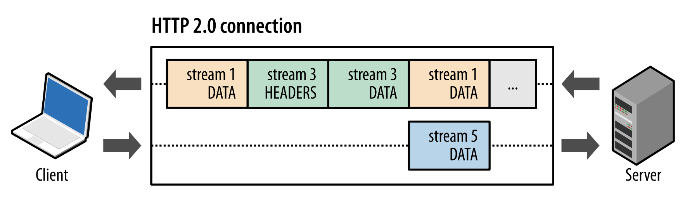
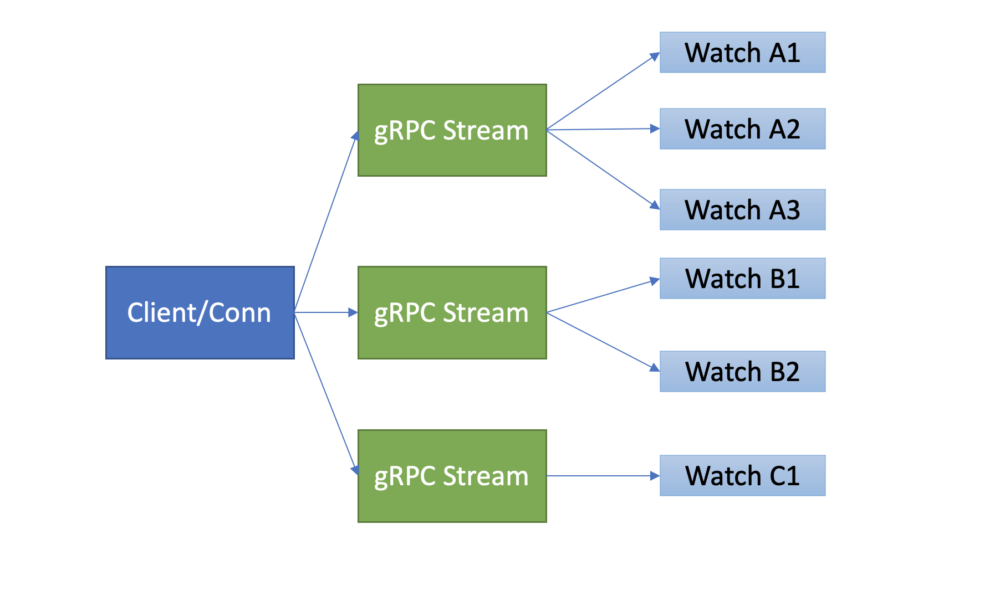
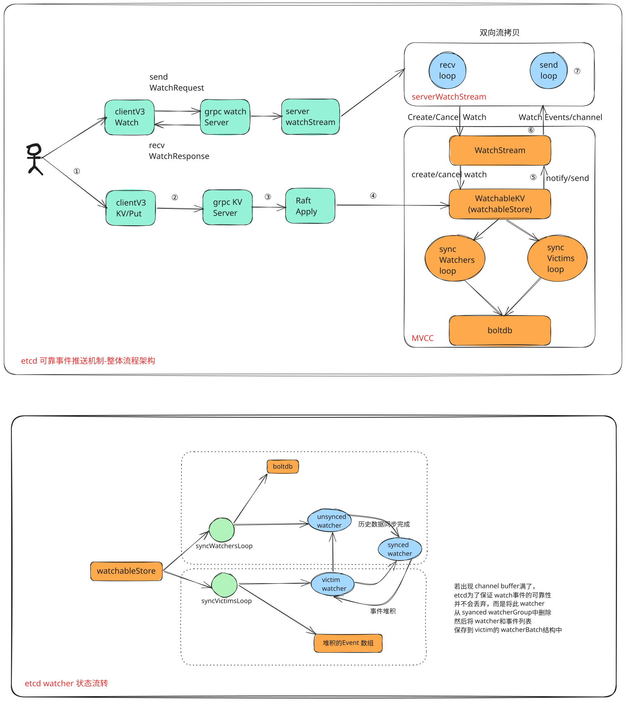
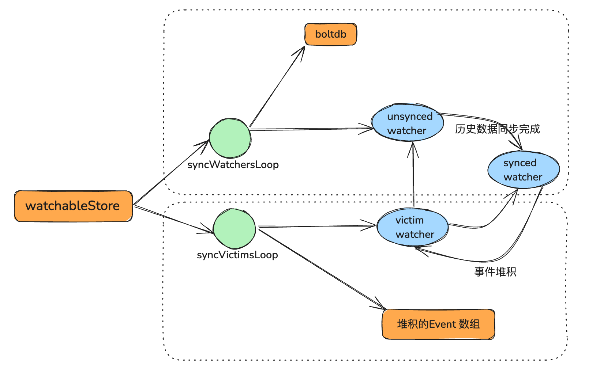
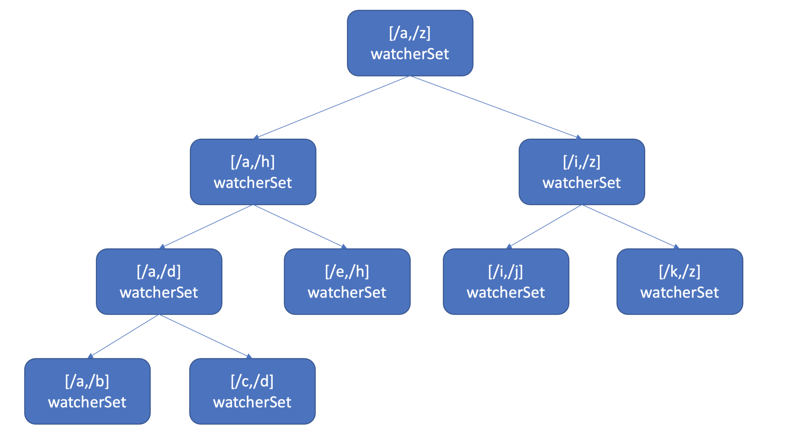

# Watch: 如何高效获取数据变量通知

# 目的

1. client watch 的机制是推(服务端推送)还是拉(客户端主动论轮询)？
2. 事件是如何存储的？会保留多久？watch 命令中的版本号具有什么作用？
3. 当 client 和 server 端出现短暂网络波动等异常因素，导致事件堆积时，server 端会丢弃事件吗？
4. 当监听的历史版本 revision 不存在，该如何处理？
5. 如果一个 key 有上万个 watcher,server 端接收到一个写请求后，etcd 是如何根据变化的 key 快速找到监听它的 watcher?

# 流式推送

首先第一个问题是 **client 获取事件机制** ，etcd 是使用轮询模式还是推送模式呢？两者各有什么优缺点？

答案是两种机制 etcd 都使用过。

在 etcd v2 Watch 机制实现中，使用的是 HTTP/1.x 协议，实现简单、兼容性好，每个 watcher 对应一个 TCP 连接。client 通过 HTTP/1.1 协议长连接定时轮询 server，获取最新的数据变化事件。

然而当你的 watcher 成千上万的时，即使集群空负载，大量轮询也会产生一定的 QPS，server 端会消耗大量的 socket、内存等资源，导致 etcd 的扩展性、稳定性无法满足 Kubernetes 等业务场景诉求。

etcd v3 的 Watch 机制的设计实现并非凭空出现，它正是吸取了 etcd v2 的经验、教训而重构诞生的。

在 etcd v3 中，为了解决 etcd v2 的以上缺陷，使用的是基于 HTTP/2 的 gRPC 协议，双向流的 Watch API 设计，实现了连接多路复用。

**HTTP/2 协议为什么能实现多路复用呢？**



在 HTTP/2 协议中，HTTP 消息被分解独立的帧（Frame），交错发送，帧是最小的数据单位。每个帧会标识属于哪个流（Stream），流由多个数据帧组成，每个流拥有一个唯一的 ID，一个数据流对应一个请求或响应包。

如上图所示，client 正在向 server 发送数据流 5 的帧，同时 server 也正在向 client 发送数据流 1 和数据流 3 的一系列帧。一个连接上有并行的三个数据流，HTTP/2 可基于帧的流 ID 将并行、交错发送的帧重新组装成完整的消息。

通过以上机制，HTTP/2 就解决了 HTTP/1 的请求阻塞、连接无法复用的问题，实现了多路复用、乱序发送。

etcd 基于以上介绍的 HTTP/2 协议的多路复用等机制，实现了一个 client/TCP 连接支持多 gRPC Stream， 一个 gRPC Stream 又支持多个 watcher，如下图所示。同时事件通知模式也从 client 轮询优化成 server 流式推送，极大降低了 server 端 socket、内存等资源。



当然在 etcd v3 watch 性能优化的背后，也带来了 Watch API 复杂度上升, 不过你不用担心，etcd 的 clientv3 库已经帮助你搞定这些棘手的工作了。

在 clientv3 库中，Watch 特性被抽象成 Watch、Close、RequestProgress 三个简单 API 提供给开发者使用，屏蔽了 client 与 gRPC WatchServer 交互的复杂细节，实现了一个 client 支持多个 gRPC Stream，一个 gRPC Stream 支持多个 watcher，显著降低了你的开发复杂度。

同时当 watch 连接的节点故障，clientv3 库支持自动重连到健康节点，并使用之前已接收的最大版本号创建新的 watcher，避免旧事件回放等。

# 滑动窗口&MVCC

介绍完 etcd v2 的轮询机制和 etcd v3 的流式推送机制后，再看第二个问题，事件是如何存储的？ 会保留多久呢？watch 命令中的版本号具有什么作用？

第二个问题的本质是 **历史版本存储** ，etcd 经历了从滑动窗口到 MVCC 机制的演变，滑动窗口是仅保存有限的最近历史版本到内存中，而 MVCC 机制则将历史版本保存在磁盘中，避免了历史版本的丢失，极大的提升了 Watch 机制的可靠性。

**etcd v2 滑动窗口是如何实现的？它有什么缺点呢？**

它使用的是如下一个简单的环形数组来存储历史事件版本，当 key 被修改后，相关事件就会被添加到数组中来。若超过 eventQueue 的容量，则淘汰最旧的事件。在 etcd v2 中，eventQueue 的容量是固定的 1000，因此它最多只会保存 1000 条事件记录，不会占用大量 etcd 内存导致 etcd OOM。

```
type EventHistory struct {
   Queue      eventQueue
   StartIndex uint64
   LastIndex  uint64
   rwl        sync.RWMutex
}
```

但是它的缺陷显而易见的，固定的事件窗口只能保存有限的历史事件版本，是不可靠的。当写请求较多的时候、client 与 server 网络出现波动等异常时，很容易导致事件丢失，client 不得不触发大量的 expensive 查询操作，以获取最新的数据及版本号，才能持续监听数据。

特别是对于重度依赖 Watch 机制的 Kubernetes 来说，显然是无法接受的。因为这会导致控制器等组件频繁的发起 expensive List Pod 等资源操作，导致 APIServer/etcd 出现高负载、OOM 等，对稳定性造成极大的伤害。

etcd v3 的 MVCC 机制，就是为解决 etcd v2 Watch 机制不可靠而诞生。相比 etcd v2 直接保存事件到内存的环形数组中，etcd v3 则是将一个 key 的历史修改版本保存在 boltdb 里面。boltdb 是一个基于磁盘文件的持久化存储，因此它重启后历史事件不像 etcd v2 一样会丢失，同时你可通过配置压缩策略，来控制保存的历史版本数，在压缩篇我会和你详细讨论它。

**最后 watch 命令中的版本号具有什么作用呢?**

版本号是 etcd 逻辑时钟，当 client 因网络等异常出现连接闪断后，通过版本号，它就可从 server 端的 boltdb 中获取错过的历史事件，而无需全量同步，它是 etcd Watch 机制数据增量同步的核心。

# 可靠的事件推送机制

再看第三个问题，当 client 和 server 端出现短暂网络波动等异常因素后，导致事件堆积时，server 端会丢弃事件吗？若你监听的历史版本号 server 端不存在了，你的代码该如何处理？

第三个问题的本质是 **可靠事件推送机制** ，要搞懂它，我们就得弄懂 etcd Watch 特性的整体架构、核心流程，下图是 Watch 特性整体架构图。

## 整体架构



关键词

双向 grpc 流式传输，基于 http2 多路复用，提供高效的数据传输效率

syncWatchersLoop

syncVictimsLoop

synced watcherGroup

synced watcher

unsynced watcherGroup

unsynced watcher

我先通过上面的架构图，给你简要介绍下一个 watch 请求流程，让你对全流程有个整体的认识。

当你通过 etcdctl 或 API 发起一个 watch key 请求的时候，etcd 的 gRPCWatchServer 收到 watch 请求后，会创建一个 serverWatchStream, 它负责接收 client 的 gRPC Stream 的 create/cancel watcher 请求(recvLoop goroutine)，并将从 MVCC 模块接收的 Watch 事件转发给 client(sendLoop goroutine)。

当 serverWatchStream 收到 create watcher 请求后，serverWatchStream 会调用 MVCC 模块的 WatchStream 子模块分配一个 watcher id，并将 watcher 注册到 MVCC 的 WatchableKV 模块。

在 etcd 启动的时候，WatchableKV 模块会运行 syncWatchersLoop 和 syncVictimsLoop goroutine，分别负责不同场景下的事件推送，它们也是 Watch 特性可靠性的核心之一。

从架构图中你可以看到 Watch 特性的核心实现是 WatchableKV 模块，下面我就为你抽丝剥茧，看看”etcdctl watch hello -w=json –rev=1”命令在 WatchableKV 模块是如何处理的？面对各类异常，它如何实现可靠事件推送？

**etcd 核心解决方案是复杂度管理，问题拆分。**

etcd 根据不同场景，对问题进行了分解，将 watcher 按场景分类，实现了轻重分离、低耦合。首先介绍下 synced watcher、unsynced watcher 它们各自的含义。

- synced watcher，顾名思义，表示此类 watcher 监听的数据都已经同步完毕，在等待新的变更。如果你创建的 watcher 未指定版本号(默认 0)、或指定的版本号大于 etcd sever 当前最新的版本号(currentRev)，那么它就会保存到 synced watcherGroup 中。watcherGroup 负责管理多个 watcher，能够根据 key 快速找到监听该 key 的一个或多个 watcher。
- unsynced watcher，表示此类 watcher 监听的数据还未同步完成，落后于当前最新的数据变更，正在努力追赶。如果你创建的 watcher 指定版本号小于 etcd server 当前最新版本号，那么它就会保存到 unsynced watcherGroup 中。比如我们的这个案例中 watch 带指定版本号 1 监听时，版本号 1 和 etcd server 当前版本之间的数据并未同步给你，因此它就属于此类。

我们可以将可靠的事件推送机制拆分成最新事件推送、异常场景重试、历史事件推送机制三个子问题来进行分析。

## 最新事件推送机制

当 etcd 收到一个写请求，key-value 发生变化的时候，处于 syncedGroup 中的 watcher，是如何获取到最新变化事件并推送给 client 的呢？

当你创建完成 watcher 后，此时你执行 put hello 修改操作时，如上图所示，请求经过 KVServer、Raft 模块后 Apply 到状态机时，在 MVCC 的 put 事务中，它会将本次修改的后的 mvccpb.KeyValue 保存到一个 changes 数组中。

在 put 事务结束时，如下面的精简代码所示，它会将 KeyValue 转换成 Event 事件，然后回调 watchableStore.notify 函数（流程 5）。notify 会匹配出监听过此 key 并处于 synced watcherGroup 中的 watcher，同时事件中的版本号要大于等于 watcher 监听的最小版本号，才能将事件发送到此 watcher 的事件 channel 中。

serverWatchStream 的 sendLoop goroutine 监听到 channel 消息后，读出消息立即推送给 client（流程 6 和 7），至此，完成一个最新修改事件推送。

```go
evs := make([]mvccpb.Event, len(changes))
for i, change := range changes {
   evs[i].Kv = &changes[i]
   if change.CreateRevision == 0 {
      evs[i].Type = mvccpb.DELETE
      evs[i].Kv.ModRevision = rev
   } else {
      evs[i].Type = mvccpb.PUT
   }
}
tw.s.notify(rev, evs)
```

注意接收 Watch 事件 channel 的 buffer 容量默认 1024(etcd v3.4.9)。若 client 与 server 端因网络波动、高负载等原因导致推送缓慢，buffer 满了，事件会丢失吗？

这就是第二个子问题，异常场景的重试机制。

## 异常场景重试机制

若出现 channel buffer 满了，etcd 为了保证 Watch 事件的高可靠性，并不会丢弃它，而是将此 watcher 从 synced watcherGroup 中删除，然后将此 watcher 和事件列表保存到一个名为受害者 victim 的 watcherBatch 结构中，通过**异步机制重试**保证事件的可靠性。

```go
type eventBatch struct {
	// evs is a batch of revision-ordered events
	evs []mvccpb.Event
	// revs is the minimum unique revisions observed for this batch
	revs int
	// moreRev is first revision with more events following this batch
	moreRev int64
}

type watcherBatch map[*watcher]*eventBatch


func (wb watcherBatch) add(w *watcher, ev mvccpb.Event) {
	eb := wb[w]
	if eb == nil {
		eb = &eventBatch{}
		wb[w] = eb
	}
	eb.add(ev)
}

// newWatcherBatch maps watchers to their matched events. It enables quick
// events look up by watcher.
func newWatcherBatch(wg *watcherGroup, evs []mvccpb.Event) watcherBatch {
	if len(wg.watchers) == 0 {
		return nil
	}

	wb := make(watcherBatch)
	for _, ev := range evs {
		for w := range wg.watcherSetByKey(string(ev.Kv.Key)) {
			if ev.Kv.ModRevision >= w.minRev {
				// don't double notify
				wb.add(w, ev)
			}
		}
	}
	return wb
}
```

还有一个点你需要注意的是，notify 操作它是在修改事务结束时同步调用的，必须是轻量级、高性能、无阻塞的，否则会严重影响集群写性能。

在介绍 Watch 机制整体架构时，我们知道 WatchableKV 模块会启动两个异步 goroutine，其中一个是 syncVictimsLoop，正是它负责 slower watcher 的堆积的事件推送。

它的基本工作原理是，遍历 victim watcherBatch 数据结构，尝试将堆积的事件再次推送到 watcher 的接收 channel 中。若推送失败，则再次加入到 victim watcherBatch 数据结构中等待下次重试。

若推送成功，watcher 监听的最小版本号(minRev)小于等于 server 当前版本号(currentRev)，说明可能还有历史事件未推送，需加入到 unsynced watcherGroup 中，由下面介绍的历史事件推送机制，推送 minRev 到 currentRev 之间的事件。

若 watcher 的最小版本号大于 server 当前版本号，则加入到 synced watcher 集合中，进入上面介绍的最新事件通知机制。

各类 watcher 状态转换关系，在整体架构图中有体现，可以快速理清之间的关系。

## 历史事件处理机制

WatchableKV 模块的另一个 goroutine，syncWatchersLoop，正是负责 unsynced watcherGroup 中的 watcher 历史事件推送。

在历史事件推送机制中，如果你监听老的版本号已经被 etcd 压缩了，client 该如何处理？

要了解这个问题，我们就得搞清楚 syncWatchersLoop 如何工作，它的核心支撑是 boltdb 中存储了 key-value 的历史版本。

syncWatchersLoop，它会遍历处于 unsynced watcherGroup 中的每个 watcher，为了优化性能，它会选择一批 unsynced watcher 批量同步，找出这一批 unsynced watcher 中监听的最小版本号。

因 boltdb 的 key 是按版本号存储的，因此可通过指定查询的 key 范围的最小版本号作为开始区间，当前 server 最大版本号作为结束区间，遍历 boltdb 获得所有历史数据。

然后将 KeyValue 结构转换成事件，匹配出监听过事件中 key 的 watcher 后，将事件发送给对应的 watcher 事件接收 channel 即可。发送完成后，watcher 从 unsynced watcherGroup 中移除、添加到 synced watcherGroup 中，如下面的 watcher 状态转换图上半部分所示。



若 watcher 监听的版本号已经小于当前 etcd server 压缩的版本号，历史变更数据就可能已丢失，因此 etcd server 会返回 `ErrCompacted`错误给 client。client 收到此错误后，需重新获取数据最新版本号后，再次 Watch。你在业务开发过程中，使用 Watch API 最常见的一个错误之一就是未处理此错误。

# 高效的事件匹配-区间树

介绍完可靠的事件推送机制后，最后我们再看第四个问题，如果你创建了上万个 watcher 监听 key 变化，当 server 端收到一个写请求后，etcd 是如何根据变化的 key 快速找到监听它的 watcher 呢？一个个遍历 watcher 吗？

显然一个个遍历 watcher 是最简单的方法，但是它的时间复杂度是 O(N)，在 watcher 数较多的场景下，会导致性能出现瓶颈。更何况 etcd 是在执行一个写事务结束时，同步触发事件通知流程的，若匹配 watcher 开销较大，将严重影响 etcd 性能。

**那使用什么数据结构来快速查找哪些 watcher 监听了一个事件中的 key 呢？**

也许你会说使用 map 记录下哪些 watcher 监听了什么 key 不就可以了吗？ etcd 的确使用 map 记录了监听单个 key 的 watcher，但是你要注意的是 Watch 特性不仅仅可以监听单 key，它还可以指定监听 key 范围、key 前缀，因此 etcd 还使用了如下的区间树。



当收到创建 watcher 请求的时候，它会把 watcher 监听的 key 范围插入到上面的区间树中，区间的值保存了监听同样 key 范围的 watcher 集合/watcherSet。

当产生一个事件时，etcd 首先需要从 map 查找是否有 watcher 监听了单 key，其次它还需要从区间树找出与此 key 相交的所有区间，然后从区间的值获取监听的 watcher 集合。

区间树支持快速查找一个 key 是否在某个区间内，时间复杂度 O(LogN)，因此 etcd 基于 map 和区间树实现了 watcher 与事件快速匹配，具备良好的扩展性。

# 问题

## 1. 如何保证 WatchableKV 模块启动的 syncVictimsLoop 是可靠的呢？机器重启了怎么办？

整个 watch 链路的可靠性，不能光靠 server，从业务逻辑正确使用 watch api 到 client watch 中断重试机制，再到本讲介绍的 server 推送机制，层层相连才能尽量保证 watch 事件可靠性。如果机器重启了，这时就依赖 client 库的重试机制了，client 收到每个 watch 事件时，会记录收到的版本号，连接到新节点后，再次创建 watcher 时会带上这个版本号，然后就会进入历史数据同步逻辑。

## 2. key 变化一定要去查询一下 watcher 区间树吗，这种实现有什么考量，有没有更好的方式？

当某个 key 发生变化的一定要去 key 的 watcher 区间树去查询是否对应的 watcher 吗？这样会不会有很大的浪费，当一个系统 监听了一些不经常变的 key, 另一些经常变化的 key 没有对应的 watcher ,这样经常变化的 key 就会一直去查询 key 的 watcher 区间树。 难道 key 不能直接知道是否有对应的 watcher 呢？ （比如 key 的结构体记录一个 watcherId 的数组）

> 一定会查，这性能开销很低的。正如我文章中所介绍的，有两类 watcher, 一类是监听一个 key 的 watcher，这种直接使用 map 来保存，也就是检查这个 key 是否有相关 watcher，时间复杂度是 o(1)，另一类是监听整个区间的 watcher，查找这个 key 落在了哪些 watcher 监听的范围，一般情况下，时间复杂度 o(log n), n 是你创建的 watcher 数。而你建议的方案，使用 key，结构体记录一个 watcher id 数组，这在 key 非常多的情况下，内存开销是非常大，假设一个 watcher 监听了一个非常大的 key 范围，那么 etcd 创建此 watcher 的时候，还需要遍历这个 key 范围，给 key 增加相应的 watcher id, 不仅内存，cpu 开销也是不可忽略的。在哪些场景下 watcher 事件通知性能会非常慢呢？如果你成千上万个 watcher,监听同一个 key 或者范围时，就会导致性能极差。
