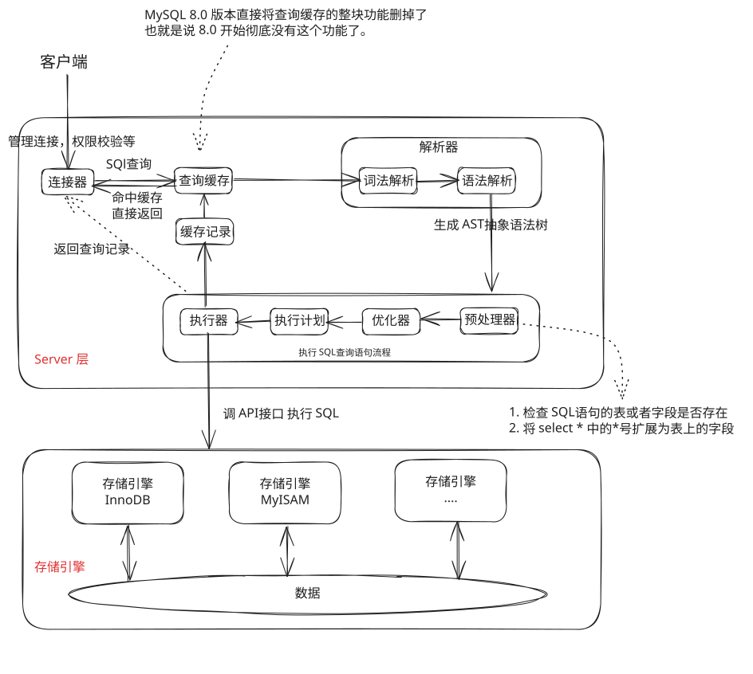
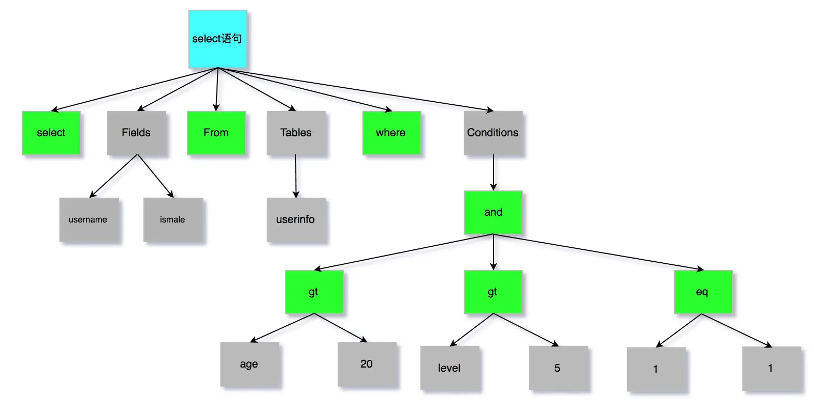
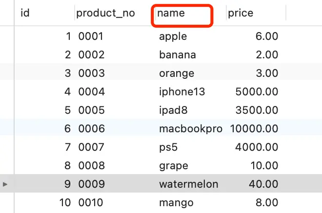
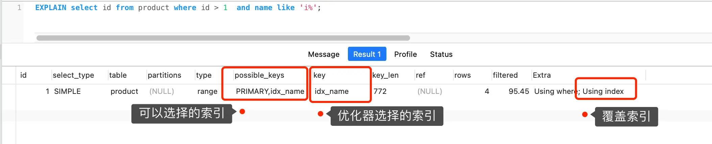

# 整体架构



Server 层：包括连接器、查询缓存、分析器、优化器、执行器等，涵盖 MySQL 的大多数核心服务功能，以及所有的内置函数（如日期、时间、数学和加密函数等），所有跨存储引擎的功能都在这一层实现，比如存储过程、触发器、视图等。

存储引擎层：负责数据的存储和提取。其架构模式是插件式的，支持 InnoDB、MyISAM、Memory 等多个存储引擎。现在最常用的存储引擎是 InnoDB，它从 MySQL 5.5.5 版本开始成为了默认存储引擎。

分析以下语句执行的过程

```bash
mysql> select * from T where ID=10；
```

# 1. 连接器

```bash
mysql -h$ip -P$port -u$user -p
```

连接命令中的 mysql 是客户端工具，用来跟服务端建立连接。在完成经典的 TCP 握手后，连接器就要开始认证你的身份，这个时候用的就是你输入的用户名和密码。

- 如果用户名或密码不对，你就会收到一个"Access denied for user"的错误，然后客户端程序结束执行。
- 如果用户名密码认证通过，连接器会到权限表里面查出你拥有的权限。之后，这个连接里面的权限判断逻辑，都将依赖于此时读到的权限。

> 一个用户成功建立连接后，即使你用管理员账号对这个用户的权限做了修改，也不会影响已经存在连接的权限。修改完成后，只有再新建的连接才会使用新的权限设置。

连接完成后，如果你没有后续的动作，这个连接就处于空闲状态，你可以在 show processlist 命令中看到它。文本中这个图是 show processlist 的结果，其中的 Command 列显示为“Sleep”的这一行，就表示现在系统里面有一个空闲连接。

```bash
mysql> show processlist;
+----+-----------------+-----------+------------+---------+-------+------------------------+------------------+
| Id | User            | Host      | db         | Command | Time  | State                  | Info             |
+----+-----------------+-----------+------------+---------+-------+------------------------+------------------+
|  5 | event_scheduler | localhost | NULL       | Daemon  | 18821 | Waiting on empty queue | NULL             |
|  8 | root            | localhost | panlq_test | Sleep   |  6422 |                        | NULL             |
|  9 | root            | localhost | panlq_test | Query   |     1 | init                   | show processlist |
+----+-----------------+-----------+------------+---------+-------+------------------------+------------------+
3 rows in set, 1 warning (0.04 sec)
```

客户端如果太长时间没动静，连接器就会自动将它断开。这个时间是由参数 wait_timeout 控制的，默认值是 8 小时。如果在连接被断开之后，客户端再次发送请求的话，就会收到一个错误提醒： Lost connection to MySQL server during query。这时候如果你要继续，就需要重连，然后再执行请求了。

建立连接的过程通常是比较复杂的，所以一般建议使用中要尽量减少建立连接的动作，也就是尽量使用长连接。

但是全部使用长连接后，你可能会发现，有些时候 MySQL 占用内存涨得特别快，这是因为 MySQL 在执行过程中临时使用的内存是管理在连接对象里面的。这些资源会在连接断开的时候才释放。所以如果长连接累积下来，可能导致内存占用太大，被系统强行杀掉（OOM），从现象看就是 MySQL 异常重启了。

**如何解决长链接占用内存问题？**

- 定期断开长连接。使用一段时间，或者程序里面判断执行过一个占用内存的大查询后，断开连接，之后要查询再重连。
- 如果你用的是 MySQL 5.7 或更新版本，可以在每次执行一个比较大的操作后，通过执行 mysql_reset_connection (这个是接口函数不是命令)来重新初始化连接资源。这个过程不需要重连和重新做权限验证，但是会将连接恢复到刚刚创建完时的状态。

# 2. 查询缓存

连接建立完成后，你就可以执行 select 语句了。执行逻辑就会来到第二步：查询缓存。MySQL 拿到一个查询请求后，会先到查询缓存看看，之前是不是执行过这条语句。之前执行过的语句及其结果可能会以 key-value 对的形式，被直接缓存在内存中。key 是查询的语句，value 是查询的结果。如果你的查询能够直接在这个缓存中找到 key，那么这个 value 就会被直接返回给客户端。

但是大多数情况下建议不要使用查询缓存，为什么呢？因为查询缓存往往弊大于利。查询缓存的失效非常频繁，只要有对一个表的更新，这个表上所有的查询缓存都会被清空。因此很可能你费劲地把结果存起来，还没使用呢，就被一个更新全清空了。对于更新压力大的数据库来说，查询缓存的命中率会非常低。除非你的业务就是有一张静态表，很长时间才会更新一次。比如，一个系统配置表，那这张表上的查询才适合使用查询缓存。

MySQL 8.0 版本直接将查询缓存的整块功能删掉了，也就是说 8.0 开始彻底没有这个功能了。

> 注意：这里说的查询缓存是 server 层的，并不是 Innodb 中的 buffer pool

# 3. 解析器

在正式执行 SQL 语句前，MySQL 需要知道你在做什么，所以会先对 sql 语句进行解析。

分析器先会做“词法分析”。你输入的是由多个字符串和空格组成的一条 SQL 语句，MySQL 需要识别出里面的字符串分别是什么，代表什么。

MySQL 从你输入的"select"这个关键字识别出来，这是一个查询语句。它也要把字符串“T”识别成“表名 T”，把字符串“ID”识别成“列 ID”。

做完了这些识别以后，就要做“语法分析”。根据词法分析的结果，语法分析器会根据语法规则，判断你输入的这个 SQL 语句是否满足 MySQL 语法。

如果你的语句不对，就会收到“You have an error in your SQL syntax”的错误提醒，比如下面这个语句 select 少打了开头的字母“s”。

```bash
mysql> elect * from t where ID=1;

ERROR 1064 (42000): You have an error in your SQL syntax; check the manual that corresponds to your MySQL server version for the right syntax to use near 'elect * from t where ID=1' at line 1
```

经过语法分析没问题后，会构建出 SQL 语法树，方便后面模块获取 SQL 类型、表明、字段名、where 条件等



> 注意：表不存在或者字段不存在，并不是在解析器里做的，解析器只负责检查语法和构建语法树，但是不会去查表或者字段存不存在。

# 4. 执行 SQL

经过解析器后，接着就要进入执行 SQL 查询语句的流程了，每条 `SELECT` 查询语句流程主要可以分为下面这三个阶段：

- prepare 阶段，预处理
- optimize 阶段，优化
- execute 阶段，执行

## 4.1 预处理器

1. 检查 SQL 查询语句中的表或者字段是否存在；
2. 将 `select *` 中的 `*` 符号，扩展为表上的所有列；

## 4.2 优化器

经过预处理阶段后，还需要为 SQL 查询语句先制定一个执行计划，这个工作交由「优化器」来完成。

优化原则：尽可能扫描少的数据库行纪录

1. 在表里面有多个索引的时候，决定使用哪个索引；
2. 或者在一个语句有多表关联（join）的时候，决定各个表的连接顺序。

比如你执行下面这样的语句，这个语句是执行两个表的 join：

```
mysql> select * from t1 join t2 using(ID)  where t1.c=10 and t2.d=20;
```

- 既可以先从表 t1 里面取出 c=10 的记录的 ID 值，再根据 ID 值关联到表 t2，再判断 t2 里面 d 的值是否等于 20。
- 也可以先从表 t2 里面取出 d=20 的记录的 ID 值，再根据 ID 值关联到 t1，再判断 t1 里面 c 的值是否等于 10。

这两种执行方法的逻辑结果是一样的，但是执行的效率会有不同，而优化器的作用就是决定选择使用哪一个方案。

再比如这张 product 表只有一个索引就是主键，现在我在表中将 name 设置为普通二级索引



这时 product 表就有主键索引（id）和普通索引（name）。假设执行如下语句

> select id from product where id > 1 and name like 'i%';

这条查询语句的结果既可以使用主键索引，也可以使用普通索引，但执行的效率会不同。

很显然这条查询语句是 **覆盖索引** ，直接在二级索引就能查找到结果（因为二级索引的 B+树叶子节点的数据存储是主键值），就没有必要在回表查找了，本来 select 查询的字段就是 id。优化器基于成本的考虑，选择查询代价最小的普通索引。



优化器阶段完成后，这个语句的执行方案就确定下来了，然后进入执行器阶段。

## 4.3 执行器

开始执行的时候，要先判断一下你对这个表 T 有没有执行查询的权限，如果没有，就会返回没有权限的错误，如下所示 (在工程实现上，如果命中查询缓存，会在查询缓存返回结果的时候，做权限验证。查询也会在优化器之前调用 precheck 验证权限)。

**为什么 MySQL 要在执行器阶段再次进行权限验证，而不是仅在分析器阶段完成所有的权限验证？**

MySQL 采用两阶段权限验证主要是为了：

1. 处理查询重写后的真实对象权限
2. 支持高级功能（视图、存储过程）的安全执行
3. 应对动态 SQL 的安全挑战
4. 实现更细粒度的行级安全控制
5. 在性能和安全之间取得平衡

当执行涉及存储过程或触发器时：

- 分析器阶段只能验证调用存储过程的权限
- 执行阶段需要验证存储过程内部语句对各个表的操作权限
- 防止通过存储过程绕过直接表访问的权限限制

对于动态生成的 SQL：

```sql
PREPARE stmt FROM @sql;
EXECUTE stmt;
```

- 分析器阶段无法预知@sql 变量的具体内容
- 执行阶段必须验证实际执行的语句权限

某些安全策略需要在执行阶段验证：

- 行级权限过滤（如企业版的数据掩码功能）
- 执行时才能确定的 WHERE 条件附加（如基于登录用户的自动过滤）

两阶段验证实现了最佳平衡：

- **分析器阶段** ：快速拒绝明显无权限的查询（语法级权限）
- **执行器阶段** ：精确验证实际数据访问权限（数据级权限）

在执行的过程中，执行器就会和存储引擎交互了，交互是以记录行为单位的。有三种执行方式

- 主键索引查询
- 全表扫描
- 索引下推

### 4.3.1 主键索引查询

```
select * from product where id = 1;
```

这条查询语句的查询条件用到了主键索引，而且是等值查询，同时主键 id 是唯一，不会有 id 相同的记录，所以优化器决定选用访问类型为 const 进行查询，也就是使用主键索引查询一条记录，那么执行器与存储引擎的执行流程是这样的：

1. 执行器调用 innodb 引用索引查询的接口，把条件 `id = 1` 交给存储引擎， **让存储引擎定位符合条件的第一条记录** 。
2. 存储引用通过主键索引的 B+tree 结构定位到 id=1 的数据，如果记录不存在，就报错结束查询，否则返回查询记录

### 4.3.2 全表扫描

```
select * from product where name = 'iphone';
```

这条查询语句的查询条件没有用到索引，所以优化器决定选用访问类型为 ALL 进行查询，即全表扫描

1. 这条查询语句的查询条件没有用到索引，所以优化器决定选用访问类型为 ALL 进行查询，让存储引擎读取表中的第一条记录
2. 执行器会判断读到的这条记录的 name 是不是 iphone，如果不是则跳过；如果是则将记录发给客户的（是的没错，Server 层每从存储引擎读到一条记录就会发送给客户端，之所以客户端显示的时候是直接显示所有记录的，是因为客户端是等查询语句查询完成后，才会显示出所有的记录）。
3. 一直重复上述过程，直到存储引擎把表中的所有记录读完，然后向执行器（Server 层） 返回了读取完毕的信息；
4. 执行器收到存储引擎报告的查询完毕的信息，退出循环，停止查询。

### 4.3.3 索引下推

利用索引中包含的字段先做判断，减少回表次数

索引下推能够减少二级索引在查询时的回表操作，减少 I/O 操作，提高查询效率

具体案例，跟优化器里提到的案例类型，更多参考索引分析篇

# 5. 参考与延伸阅读

1. 《MySQL 45 讲》
2. [小林 coding 图解 MySQL](https://www.xiaolincoding.com/mysql/base/how_select.html#%E6%89%A7%E8%A1%8C%E5%99%A8)
