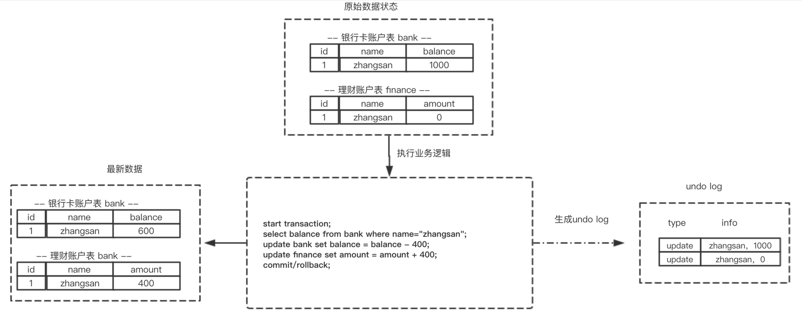
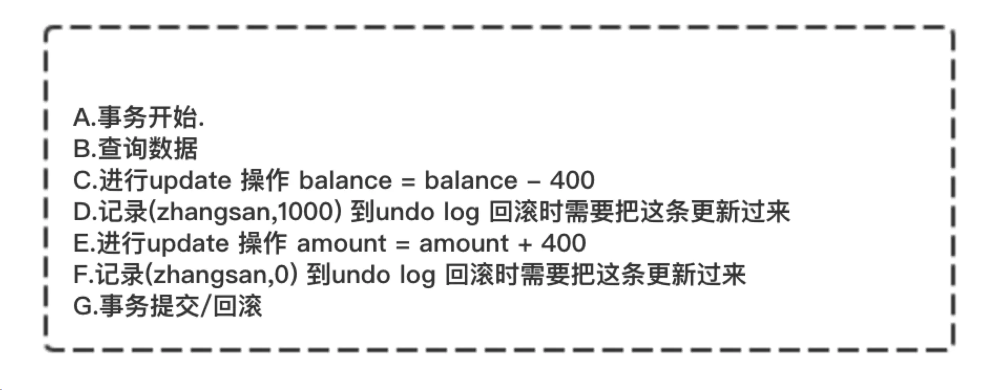
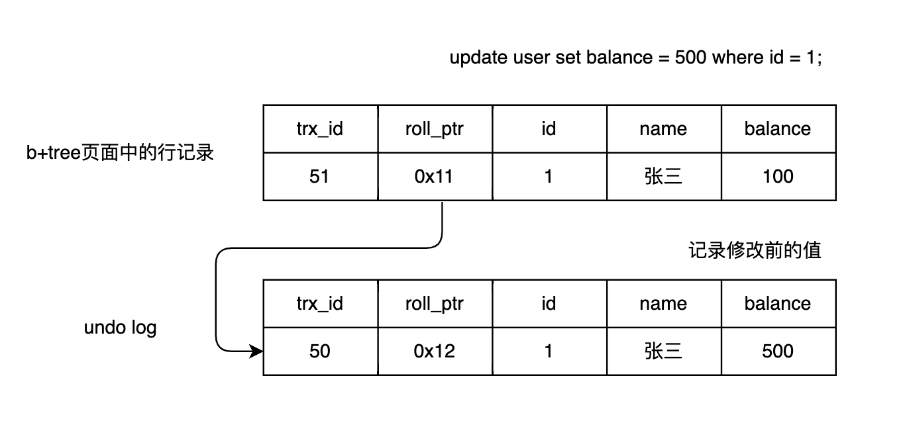
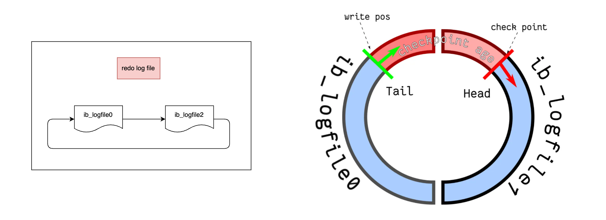
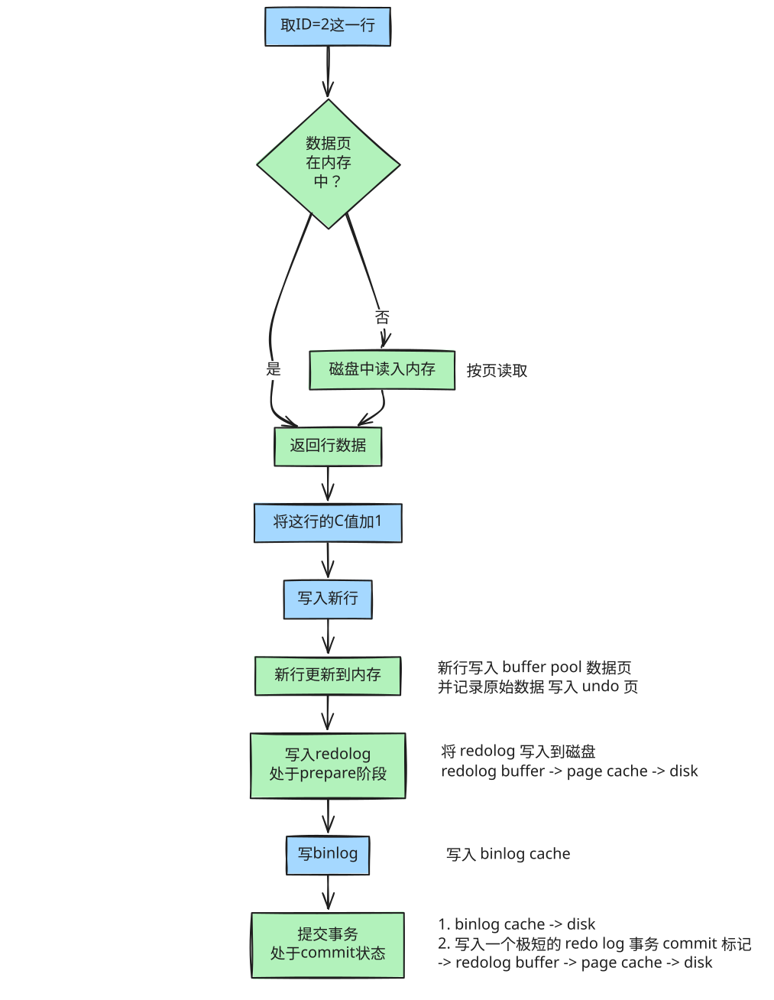

# 整体架构


> ⚠️： 本文默认存储引擎为 InnoDB

执行一条 update 语句的流程，跟查询一句一样，要经过如上流程

> update user set name = 'zhangsan' where id = 1;

1. 客户端先通过连接器建立连接，连接器自会判断用户身份；
2. 因为这是一条 update 语句，所以不需要经过查询缓存，但是表上有更新语句，是会把整个表的查询缓存清空的，所以说查询缓存很鸡肋，在 MySQL 8.0 就被移除这个功能了；
3. 解析器会通过词法分析识别出关键字 update，表名等等，构建出语法树，接着还会做语法分析，判断输入的语句是否符合 MySQL 语法；
4. 预处理器会判断表和字段是否存在；
5. 优化器确定执行计划，因为 where 条件中的 id 是主键索引，所以决定要使用 id 这个索引；
6. 执行器负责具体执行，找到这一行，然后更新。

与查询流程不一样的是，更新流程还涉及三个重要的日志模块，undo log（回滚日志）、redo log（重做日志） 、binlog （归档日志）

| 日志类型 | 层次       | 主要用途                   | 日志类型 |
| -------- | ---------- | -------------------------- | -------- |
| redo log | 存储引擎层 | 崩溃恢复，实现事务的持久性 | 物理日志 |
| undo log | 存储引擎层 | 事务回滚/MVCC，事务原子性  | 物理日志 |
| binlog   | Server 层  | 主从复制/数据恢复          | 逻辑日志 |

# 目标

为什么需要 undo log?

为什么需要 redo log？

# 为什么需要 undo log?

考虑一个问题。一个事务在执行过程中，在还没有提交事务之前，如果 MySQL 发生了崩溃，要怎么回滚到事务之前的数据呢？

如果我们每次在事务执行过程中，都记录下回滚时需要的信息到一个日志里，那么在事务执行中途发生了 MySQL 崩溃后，就不用担心无法回滚到事务之前的数据，我们可以通过这个日志回滚到事务之前的数据。

## 保证原子性

实现这一机制就是 **undo log（回滚日志），它保证了事务的 [ACID 特性**中的原子性（Atomicity）**](https://xiaolincoding.com/mysql/transaction/mvcc.html#%E4%BA%8B%E5%8A%A1%E6%9C%89%E5%93%AA%E4%BA%9B%E7%89%B9%E6%80%A7)。**

undo log 属于逻辑日志，它记录的是 sql 执行相关的信息。当发生回滚时，InnoDB 会根据 undo log 的内容做与之前相反的工作：对于每个 insert，回滚时会执行 delete；对于每个 delete，回滚时会执行 insert；对于每个 update，回滚时会执行一个相反的 update，把数据改回去。

以 update 操作为例：当事务执行 update 时，其生成的 undo log 中会包含被修改行的主键(以便知道修改了哪些行)、修改了哪些列、这些列在修改前后的值等信息，回滚时便可以使用这些信息将数据还原到 update 之前的状态。





> 每条数据变更（insert/update/delete）操作都会伴随一条 undo log 的生成，并回滚日志必须先于数据持久化到磁盘上。
>
> 所以为的回滚就是根据回滚日志做逆向操作，比如 delete 的逆向操作为 insert，insert 的逆向操作为 delete，update 的逆向为 update 等。

一条记录的每一次更新操作产生的 undo log 格式都有一个 roll_pointer 指针和一个 trx_id 事务 id：

- 通过 trx_id 可以知道该记录是被哪个事务修改的；
- 通过 roll_pointer 指针可以将这些 undo log 串成一个链表，这个链表称为版本链



## 支持 MVCC 可见性回滚

**undo log 还有一个作用，通过 ReadView + undo log 实现 MVCC**

对于「读提交」和「可重复读」隔离级别的事务来说，它们的快照读（普通 select 语句）是通过 Read View+undo log 来实现的，它们的区别在于创建 Read View 的时机不同：

- 「读提交」隔离级别是在每个 select 都会生成一个新的 Read View，也意味着，事务期间的多次读取同一条数据，前后两次读的数据可能会出现不一致，因为可能这期间另外一个事务修改了该记录，并提交了事务。
- 「可重复读」隔离级别是启动事务时生成一个 Read View，然后整个事务期间都在用这个 Read View，这样就保证了在事务期间读到的数据都是事务启动前的记录。

这两个隔离级别实现是通过「事务的 Read View 里的字段」和「记录中的两个隐藏列（trx_id 和 roll_pointer）」的对比，如果不满足可见性，就会顺着 undo log 版本链里找到满足其可见性的记录，从而控制并发事务访问同一个记录时的行为，这就叫 MVCC（多版本并发控制）。

> Q: undo log 是如何刷盘（持久化到磁盘）的？
>
> undo log 和数据页的刷盘策略是一样的，都需要通过 redo log 保证持久化。
>
> buffer pool 中有 undo 页，对 undo 页的修改也都会记录到 redo log。
>
> redo log 会每秒刷盘，提交事务时也会刷盘，数据页和 undo 页都是靠这个机制保证持久化的。

# 为什么需要 Buffer Pool?

MySQL 的数据都是存在磁盘中的，那么我们要更新一条记录的时候，得先要从磁盘读取该记录，然后在内存中修改这条记录。那修改完这条记录是选择直接写回到磁盘，还是选择缓存起来呢？

当然是缓存起来好，这样下次有查询语句命中了这条记录，直接读取缓存中的记录，就不需要从磁盘获取数据了。

为此，Innodb 存储引擎设计了一个缓冲池（Buffer Pool），来提高数据库的读写性能。

## 缓存的什么？

InnoDB 会把存储的数据划分为若干个「页」，以页作为磁盘和内存交互的基本单位，一个页的默认大小为 16KB。因此，Buffer Pool 同样需要按「页」来划分。

在 MySQL 启动的时候，**InnoDB 会为 Buffer Pool 申请一片连续的内存空间，然后按照默认的 16KB 的大小划分出一个个的页， Buffer Pool 中的页就叫做缓存页**。此时这些缓存页都是空闲的，之后随着程序的运行，才会有磁盘上的页被缓存到 Buffer Pool 中。

所以，MySQL 刚启动的时候，你会观察到使用的虚拟内存空间很大，而使用到的物理内存空间却很小，这是因为只有这些虚拟内存被访问后，操作系统才会触发缺页中断，申请物理内存，接着将虚拟地址和物理地址建立映射关系。

Buffer Pool 除了缓存「索引页」和「数据页」，还包括了 Undo 页，插入缓存、自适应哈希索引、锁信息等等。


> Q: 查询一条记录，就只会缓存一条记录吗？

InnoDB 与磁盘交互的单位是页

当我们查询一条记录时，InnoDB 会把整个页的数据加载到 Buffer Pool 中，将页加载到 Buffer Pool 后，再通过页里的「页目录」去定位到某条具体的记录。

# 为什么需要 redo log?

Buffer Pool 是提高了读写效率没错，但是问题来了，Buffer Pool 是基于内存的，而内存总是不可靠，万一断电重启，还没来得及落盘的脏页数据就会丢失。

为了防止断电导致数据丢失的问题，当有一条记录需要更新的时候，InnoDB 引擎就会先更新内存（同时标记为脏页），然后将本次对这个页的修改以 redo log 的形式记录下来，这个时候更新就算完成了。

后续，InnoDB 引擎会在适当的时候，由后台线程将缓存在 Buffer Pool 的脏页刷新到磁盘里，这就是 WAL （Write-Ahead Logging）技术。

WAL 技术指的是， MySQL 的写操作并不是立刻写到磁盘上，而是先写日志，然后在合适的时间再写到磁盘上。


> Q: 既然 redo log 也需要存储，也涉及磁盘 IO 为啥还用它？

1. 刷脏是随机 IO, 因为每次修改的数据位置随机，但写 redolog 是追加操作，属于顺序 IO
2. 刷脏是以数据页为单位的，MySQL 默认页大小是 16KB, 一个 page 上一个小修改都要整页写入，而 redo log 中只包含真正需要写入的部分，无效 IO 大大减少

> Q: 被修改的 undo 页，需要记录对应的 redo log 吗？

需要！开启事务后，innodb 层更新记录前，首要记录 undo log，假设是更新操作，需要把被更新的列的旧值记下来，也就是要生成一条 undo log，undo log 会写入 Buffer Pool 中的 Undo 页面。

**在内存修改该 Undo 页面后，也是需要记录对应的 redo log，**因为 undo log 也要实现持久性的保护** 。**

> Q: redo log 和 undo log 有什么区别？

这两种日志是属于 InnoDB 存储引擎的日志，它们的区别在于：

- redo log 记录了此次事务「修改后」的数据状态，记录的是更新之后的值，主要用于事务崩溃恢复，保证事务的持久性。
- undo log 记录了此次事务「修改前」的数据状态，记录的是更新之前的值，主要用于事务回滚，保证事务的原子性。

在崩溃宕机重启后，会通过重做日志重放恢复事务，如果事务已经是 commit 状态了，就会应用事务，如果还未提交就崩溃了，则执行回滚

> Q: 产生的 redo log 是直接写入磁盘吗？

No.

实际上， 执行一个事务的过程中，产生的 redo log 也不是直接写入磁盘的，因为这样会产生大量的 I/O 操作，而且磁盘的运行速度远慢于内存。

所以，redo log 也有自己的缓存—— redo log buffer，每当产生一条 redo log 时，会先写入到 redo log buffer，后续在持久化到磁盘。

redo log buffer 默认大小 16 MB，可以通过 innodb_log_Buffer_size 参数动态的调整大小，增大它的大小可以让 MySQL 处理「大事务」是不必写入磁盘，进而提升写 IO 性能。

## redo log 什么时候刷盘？

缓存在 redo log buffer 里的 redo log 还是在内存中，它什么时候刷新到磁盘？

主要有下面几个时机：

MySQL 正常关闭时；
当 redo log buffer 中记录的写入量大于 redo log buffer 内存空间的一半时，会触发落盘；
InnoDB 的后台线程每隔 1 秒，将 redo log buffer 持久化到磁盘。
每次事务提交时都将缓存在 redo log buffer 里的 redo log 直接持久化到磁盘（这个策略可由 innodb_flush_log_at_trx_commit 参数控制）

> Q: innodb_flush_log_at_trx_commit 参数控制的是什么？

MySQL 默认的行为是在事务提交时就将 redo log buffer 刷盘。

除此之外，InnoDB 还提供了另外两种策略，由参数 innodb_flush_log_at_trx_commit 参数控制，可取的值有：0、1、2，默认值为 1，这三个值分别代表的策略如下：

- 当设置该参数为 0 时，表示每次事务提交时 ，还是将 redo log 留在 redo log buffer 中 ，该模式下在事务提交时不会主动触发写入磁盘的操作。
- 当设置该参数为 1 时，表示每次事务提交时，都将缓存在 redo log buffer 里的 redo log 直接持久化到磁盘，这样可以保证 MySQL 异常重启之后数据不会丢失。
- 当设置该参数为 2 时，表示每次事务提交时，都只是缓存在 redo log buffer 里的 redo log 写到 redo log 文件，注意写入到「 redo log 文件」并不意味着写入到了磁盘，因为操作系统的文件系统中有个[ Page Cache](https://xiaolincoding.com/os/6_file_system/pagecache.html)，Page Cache 是专门用来缓存文件数据的，所以写入「 redo log 文件」意味着写入到了操作系统的文件缓存。

> Q: innodb_flush_log_at_trx_commit 为 0 和 2 的时候，什么时候才将 redo log 写入磁盘？

InnoDB 的后台线程每隔 1 秒：

- 针对参数 0 ：会把缓存在 redo log buffer 中的 redo log ，通过调用 write() 写到操作系统的 Page Cache，然后调用 fsync() 持久化到磁盘。所以参数为 0 的策略，MySQL 进程的崩溃会导致上一秒钟所有事务数据的丢失;
- 针对参数 2 ：调用 fsync，将缓存在操作系统中 Page Cache 里的 redo log 持久化到磁盘。所以参数为 2 的策略，较取值为 0 情况下更安全，因为 MySQL 进程的崩溃并不会丢失数据，只有在操作系统崩溃或者系统断电的情况下，上一秒钟所有事务数据才可能丢失。


与事务相关的几个参数

1. innodb_flush_log_at_trx_commit
   该参数控制 innodb 在提交事物时刷 redo log 的行为，默认值为 1，即每次提交事物，都进行刷盘行为(即持久化到磁盘)，为了降低对性能的影响，有时候生产环境会设置成 2，设置是 0。但为了保证 MySQL 异常重启之后数据不丢失，建议使用默认值 1。
2. sync_binlo
   Mysql 在提交事务时调用 MYSQL_LOG::write 完成写 binlog，并根据 sync_binlog 决定是否进行刷盘。默认值是 0，即不刷盘，从而把控制权让给 OS。如果设为 1，则每次提交事务，就会进行一次刷盘；这对性能有影响(5.6 已经支持 binlog group)，所以很多人将其设置为 100，为了保证 MySQL 异常重启之后 binlog 不丢失，建议设置成 1。
3. innodb_support_xa

   用于控制 innodb 是否支持 XA 事务的 2PC，默认是 TRUE。如果关闭，则 innodb 在 prepare 阶段就什么也不做；这可能会导致 binlog 的顺序与 innodb 提交的顺序不一致(比如 A 事务比 B 事务先写 binlog，但是在 innodb 内部却可能 A 事务比 B 事务后提交)，这会导致在恢复或者 slave 产生不同的数据。

三者都设置为 1(TRUE)，数据才能真正安全。sync_binlog 非 1，可能导致 binlog 丢失(OS 挂掉)，从而与 innodb 层面的数据不一致。

## redo log 文件满了怎么办？

默认情况下， InnoDB 存储引擎有 1 个重做日志文件组( redo log Group），「重做日志文件组」由有 2 个 redo log 文件组成，这两个 redo 日志的文件名叫 ：ib_logfile0 和 ib_logfile1 。

redo log 是循环写的方式，相当于一个环形，InnoDB 用 write pos 表示 redo log 当前记录写到的位置，用 checkpoint 表示当前要擦除的位置，如下图：



图中的：

- write pos 和 checkpoint 的移动都是顺时针方向；
- write pos ～ checkpoint 之间的部分（图中的红色部分），用来记录新的更新操作；
- check point ～ write pos 之间的部分（图中蓝色部分）：待落盘的脏数据页记录；

如果 write pos 追上了 checkpoint，就意味着 redo log 文件满了，这时 MySQL 不能再执行新的更新操作，也就是说 MySQL 会被阻塞（因此所以针对并发量大的系统，适当设置 redo log 的文件大小非常重要），此时会停下来将 Buffer Pool 中的脏页刷新到磁盘中，然后标记 redo log 哪些记录可以被擦除，接着对旧的 redo log 记录进行擦除，等擦除完旧记录腾出了空间，checkpoint 就会往后移动（图中顺时针），然后 MySQL 恢复正常运行，继续执行新的更新操作。

所以，一次 checkpoint 的过程就是脏页刷新到磁盘中变成干净页，然后标记 redo log 哪些记录可以被覆盖的过程。

# 为什么需要 binlog?

因为最开始 MySQL 里并没有 InnoDB 引擎。MySQL 自带的引擎是 MyISAM，但是 MyISAM 没有 crash-safe 的能力，binlog 日志只能用于归档。而 InnoDB 是另一个公司以插件形式引入 MySQL 的，既然只依靠 binlog 是没有 crash-safe 能力的，所以 InnoDB 使用另外一套日志系统——也就是 redo log 来实现 crash-safe 能力。

这两种日志有以下三点不同。

1. 适用对象不同：
   1. redo log 是 InnoDB 引擎特有的；
   2. binlog 是 MySQL 的 Server 层实现的，所有引擎都可以使用。
2. 文件格式不同：
   1. binlog 是逻辑日志，记录的是这个语句的原始逻辑，比如“给 ID=2 这一行的 c 字段加 1 ”
   2. redo log 是物理日志，记录的是在某个数据页做了什么修改，比如对 XXX 表空间中的 YYY 数据页 ZZZ 偏移量的地方做了 AAA 更新，关于页的分配和存储结构会耦合引擎的具体实现，提高解析效率
3. 写入方式不同：
   1. redo log 是追加循环写，顺序 IO，空间固定会用完，全部写满就从头开始，保存未被刷入磁盘的脏页日志。；
   2. binlog 是追加写，“追加写”是指 binlog 文件写到一定大小后，写满一个文件，就新建下一个文件继续写，并不会覆盖以前的日志。
4. 用途不同：
   1. redo log 用于掉电等故障恢复
   2. binlog 用于备份恢复、主从赋值

> **Q: 如果不小心整个数据库的数据被删除了，能使用 redo log 文件恢复数据吗？**

不可以使用 redo log 文件恢复，只能使用 binlog 文件恢复。

因为 redo log 文件是循环写，是会边写边擦除日志的，只记录未被刷入磁盘的数据的物理日志，已经刷入磁盘的数据都会从 redo log 文件里擦除。

binlog 文件保存的是全量的日志，也就是保存了所有数据变更的情况，理论上只要记录在 binlog 上的数据，都可以恢复，所以如果不小心整个数据库的数据被删除了，得用 binlog 文件恢复数据。

# 更新语句的执行流程



图中绿色框表示是在 InnoDB 内部执行的，蓝色框表示是在执行器中执行的。

后三步看上去有点“绕”，将 redo log 的写入拆成了两个步骤：prepare 和 commit，这就是"两阶段提交"。

## 两阶段提交

```bash
mysql> update T set c=c+1 where ID=2;
```

由于 redo log 和 binlog 是两个独立的逻辑，如果不用两阶段提交，要么就是先写完 redo log 再写 binlog，或者采用反过来的顺序。我们看看这两种方式会有什么问题。

用上面的 update 语句来做例子。假设当前 ID=2 的行，字段 c 的值是 0，再假设执行 update 语句过程中在写完第一个日志后，第二个日志还没有写完期间发生了 crash，会出现什么情况呢？

1. 先写 redo log 后写 binlog。假设在 redo log 写完，binlog 还没有写完的时候，MySQL 进程异常重启。由于我们前面说过的，redo log 写完之后，系统即使崩溃，仍然能够把数据恢复回来，所以恢复后这一行 c 的值是 1。但是由于 binlog 没写完就 crash 了，这时候 binlog 里面就没有记录这个语句。因此，之后备份日志的时候，存起来的 binlog 里面就没有这条语句。

如果需要用这个 binlog 来恢复临时库的话，由于这个语句的 binlog 丢失，这个临时库就会少了这一次更新，恢复出来的这一行 c 的值就是 0，与原库的值不同。

2. 先写 binlog 后写 redo log。如果在 binlog 写完之后 crash，由于 redo log 还没写，崩溃恢复以后这个事务无效，所以这一行 c 的值是 0。但是 binlog 里面已经记录了“把 c 从 0 改成 1”这个日志。

在之后用 binlog 来恢复的时候就多了一个事务出来，恢复出来的这一行 c 的值就是 1，与原库的值不同。

如果不使用“两阶段提交”，会造成主备不一致。

## 数据库崩溃恢复过程

MySQL 重启时会检查：

1. **有 prepare 但无 commit 的 redo log** ：

- 检查对应的 binlog 是否完整
- 如果 binlog 完整，则提交事务（前滚）
- 如果 binlog 不完整，则回滚事务

1. **有 commit 标记的 redo log** ：

- 必定提交事务（即使数据页未刷盘，可以通过 redo 重放）

# 总结

1. 首先客户端通过 tcp/ip 发送一条 sql 语句到 server 层的 SQL interface
2. SQL interface 接到该请求后，先对该条语句进行解析，验证权限是否匹配
3. 验证通过以后，分析器会对该语句分析,是否语法有错误，词法分析，生成抽象语法树，方便后续逻辑判断
4. 预处理器判断表/字段是否存在，如果是 select \* 则将字段扩展为表的所有列
5. 接下来是优化器器生成相应的执行计划，选择最优的执行计划
6. 之后会是执行器根据执行计划执行这条语句。在这一步会去 open table, 如果该 table 上有 MDL，则等待。
   如果没有，则加在该表上加短暂的 MDL(S)
   (如果 opend_table 太大,表明 open_table_cache 太小。需要不停的去打开 frm 文件)
7. 进入到引擎层，首先会去 innodb_buffer_pool 里的 data dictionary(元数据信息)得到表信息
8. 通过元数据信息,去 lock info 里查出是否会有相关的锁信息，并把这条 update 语句需要的
   锁信息写入到 lock info 里(锁这里还有待补充)
9. 然后涉及到的老数据通过快照的方式存储到 innodb_buffer_pool 里的 undo page 里,并且记录 undo log 修改的 redo
   (如果 data page 里有就直接载入到 undo page 里，如果没有，则需要去磁盘里取出相应 page 的数据，载入到 undo page 里)
10. 在 innodb_buffer_pool 的 data page 做 u
11. pdate 操作。并把操作的物理数据页修改记录到 redo log buffer 里
    由于 update 这个事务会涉及到多个页面的修改，所以 redo log buffer 里会记录多条页面的修改信息。
    因为 group commit 的原因，这次事务所产生的 redo log buffer 可能会跟随其它事务一同 flush 并且 sync 到磁盘上
12. 同时修改的信息，会按照 event 的格式,记录到 binlog_cache 中。(这里注意 binlog_cache_size 是 transaction 级别的,不是 session 级别的参数, 一旦 commit 之后，dump 线程会从 binlog_cache 里把 event 主动发送给 slave 的 I/O 线程)
13. 之后把这条 sql,需要在二级索引上做的修改，写入到 change buffer page，等到下次有其他 sql 需要读取该二级索引时，再去与二级索引做 merge
    (随机 I/O 变为顺序 I/O,但是由于现在的磁盘都是 SSD,所以对于寻址来说,随机 I/O 和顺序 I/O 差距不大)
14. 此时 update 语句已经完成，需要 commit 或者 rollback。这里讨论 commit 的情况
15. commit 操作，由于存储引擎层与 server 层之间采用的是内部 XA(保证两个事务的一致性,这里主要保证 redo log 和 binlog 的原子性),
    所以提交分为 prepare 阶段与 commit 阶段
16. prepare 阶段, 将事务的 xid 写入 redo log，事务状态设置为 prepare，并将 redo log 持久化到磁盘
17. commit 阶段，将 binlog_cache 里的进行 flush 以及 sync 操作(大事务的话这步非常耗时)，由于之前该事务产生的 redo log 已经 sync 到磁盘了。所以这步只是在 redo log 里标记 commit，最终也会写入磁盘
18. 当 binlog 和 redo log 都已经落盘以后，如果触发了刷新脏页的操作，先把该脏页复制到 doublewrite buffer 里，把 doublewrite buffer 里的刷新到共享表空间，然后才是通过 page cleaner 线程把脏页写入到磁盘中

# 参考与延伸阅读

1. 《MySQL 实战 45 讲》
2. [《小林 coding 图解 MySQL》](https://www.xiaolincoding.com/mysql/log/how_update.html#redo-log-%E6%96%87%E4%BB%B6%E5%86%99%E6%BB%A1%E4%BA%86%E6%80%8E%E4%B9%88%E5%8A%9E)
