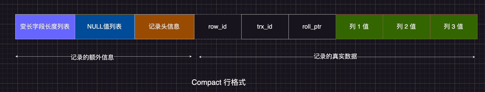
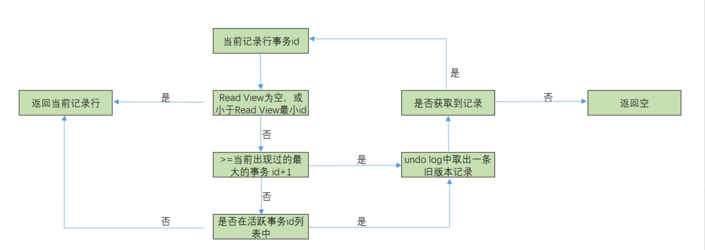

# MVCC 实现原理-可见性算法分析

版本控制（Multiversion Concurrency Control）: 指的是一种提高并发的技术。最早的数据库系统，只有读读之间可以并发，读写，写读，写写都要阻塞。引入多版本之后，只有写写之间相互阻塞，其他三种操作都可以并行，这样大幅度提高了 InnoDB 的并发度。在内部实现中，InnoDB 通过 undo log 保存每条数据的多个版本，并且能够找回数据历史版本提供给用户读，每个事务读到的数据版本可能是不一样的。在同一个事务中，用户只能看到该事务创建快照之前已经提交的修改和该事务本身做的修改。

MVCC 只在 Read Committed 和 Repeatable Read 两个隔离级别下工作。其他两个隔离级别和 MVCC 不兼容，Read Uncommitted 总是读取最新的记录行，不需要 MVCC 的支持；Serializable 则会对所有读取的记录行都加锁，单靠 MVCC 无法完成。

MySQL 的 InnoDB 存储引擎默认事务隔离级别是 RR(可重复读)，是通过 "行级锁+MVCC"一起实现的，正常读的时候不加锁，写的时候加锁。

- (一个事务)写操作对(另一个事务)写操作的影响：锁机制保证隔离性
- (一个事务)写操作对(另一个事务)读操作的影响：MVCC 保证隔离性

而**MCVV 的实现依赖**：隐藏字段、Read View、Undo log。

## 隐藏字段

InnoDB 存储引擎在每行数据的后面添加了三个隐藏字段：

- `DB_TRX_ID`：记录最后一次插入或更新该行的事务 ID，没处理一个事务，其值自动+1，删除视为更新，将其标记为已删除
- `DB_ROLL_PTR`：回滚指针，指向该行的 undo log 记录
- `DB_ROW_ID`：当表没有主键时生成的隐藏主键，单调自增 id

## Read View

其实 Read View（读视图），跟快照、snapshot 是一个概念。Read View 里面保存了“**对本事务不可见的其他活跃事务**”，主要是用来做可见性判断。Read View 比较重要字段如下

- `m_ids`：生成 Read View 时所有活跃的事务 ID 列表，意思就是创建 Read View 时，将当前未提交事务 ID 记录下来，后续即使它们修改了记录行的值，对于当前事务也是不可见的
- `min_trx_id`：m_ids 中的最小事务 ID，如果 trx_ids 为空，则 min_trx_id=max_trx_id
- `max_trx_id`：m_ids 中的最大事务 ID+1，即下一个将被分配的事务 ID
- `creator_trx_id`：创建该 Read View 的事务 ID

**一旦一个 Read View 被创建，这 m_ids,min_trx_id,max_trx_id 三个参数将不再发生变化， 理解这点很重要，其中 max_trx_id 和 min_trx_id 分别是 trx_Ids 数组的上下界。**

## Undo log

undo log 中存储的是老版本数据，当一个事务需要读取记录行时，如果当前记录行不可见，可以顺着 undo log 链找到满足其可见性条件的记录版本。

对数据的变更操作包括 insert/update/delete，在 InnoDB 里，undo log 分为如下两类：

①insert undo log : 事务对 insert 新记录时产生的 undo log, 因为不存在正在对这行数据进行读的事务，所以这个日志只在事务回滚时需要, 所以在事务提交后就可以立即丢弃。

②update undo log : 事务对记录进行 delete 和 update 操作时产生的 undo log，不仅在事务回滚时需要，快照读也需要，因为可能存在正在对这行数据进行读的事务，只有当数据库所使用的快照中不涉及该日志记录，对应的回滚日志才会被 purge 线程删除。

# 记录行的修改流程

1. 首先当前事务对记录行加排他锁
2. 然后把该行数据拷贝到 undolog 中作为旧版本
3. 拷贝完毕后，修改该行的数据
4. 事务提交，提交前用 CAS 机制判断记录行当前最新修改的事务 id 是否发生了变化，如果没变，则修改 DB_TRX_ID 为当前事务 id 并提交。如果变了，说明存在其他事务修改了这个记录行，那么就应该回滚这个事务。也就是当前事务没有生效。

# 记录行查询时的可见性判断算法

在 innodb 中，创建一个新事务后，执行第一个 select 语句的时候，innodb 会创建一个快照（read view），快照中会保存系统当前不应该被本事务看到的其他活跃事务 id 列表（即 trx_ids）。当用户在这个事务中要读取某个记录行的时候，innodb 会将该记录行的 DB_TRX_ID 与该 Read View 中的一些变量进行比较，判断是否满足可见性条件。

1. **比较记录的 DB_TRX_ID 与 creator_trx_id** ：

- 如果一致，说明记录由当前事务修改，对当前事务可见

2. **比较 DB_TRX_ID 与 min_trx_id** ：

- 如果 DB_TRX_ID < min_trx_id，说明修改该记录的事务已提交，记录对当前事务可见

3. **比较 DB_TRX_ID 与 max_trx_id** ：

- 如果 DB_TRX_ID ≥ max_trx_id，说明记录由当前事务启动后的事务修改，不可见，需通过 DB_ROLL_PTR 回滚到可见版本

4. **检查 DB_TRX_ID 是否在 m_ids 中** ：

- 如果在，说明修改该记录的事务仍活跃，记录对当前事务不可见
- 如果不在，说明事务已提交，记录对当前事务可见

5. 通过 DB_ROLL_PTR 查找可见版本：

- 如果当前版本不可见，则通过 undo log 查找上一个版本，重复判断过程

# 不同隔离级别 Read View 的差异

提交读和可重复读都是使用 MVCC 机制来实现的，但是实现过程略微有一些不同，

1. 在 innodb 中的 Repeatable Read 级别, 只有事务在 begin 之后，执行第一条 select（读操作）时, 才会创建一个快照(read view)，将当前系统中活跃的其他事务记录起来；并且事务结束前都是使用的这个快照，不会重新创建，直到事务结束。
2. 在 innodb 中的 Read Committed 级别, 事务在 begin 之后，执行每条 select（读操作）语句时，快照会被重置，即会重新创建一个快照(read view)。使用间隙锁防止幻读

所以这个实现的差别可以达到不同的隔离级别，两个隔离级别都是快照读

# can 参考与延伸阅读

1. [MySQL MVCC 和 锁机制](https://www.cnblogs.com/hi3254014978/p/12730794.html)
2. [《小林 coding 图解 MySQL》事务隔离级别是怎么实现的-Read View 在 MVCC 里如何工作的？](https://xiaolincoding.com/mysql/transaction/mvcc.html#read-view-%E5%9C%A8-mvcc-%E9%87%8C%E5%A6%82%E4%BD%95%E5%B7%A5%E4%BD%9C%E7%9A%84)
