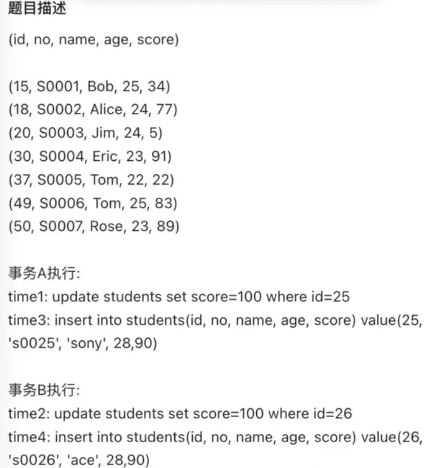
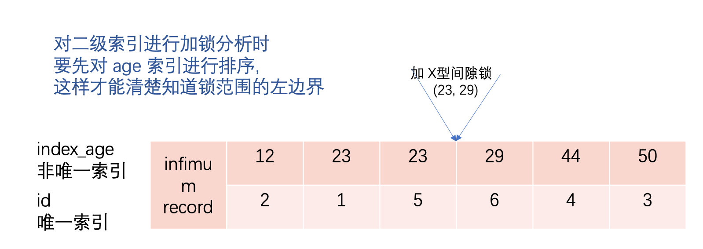
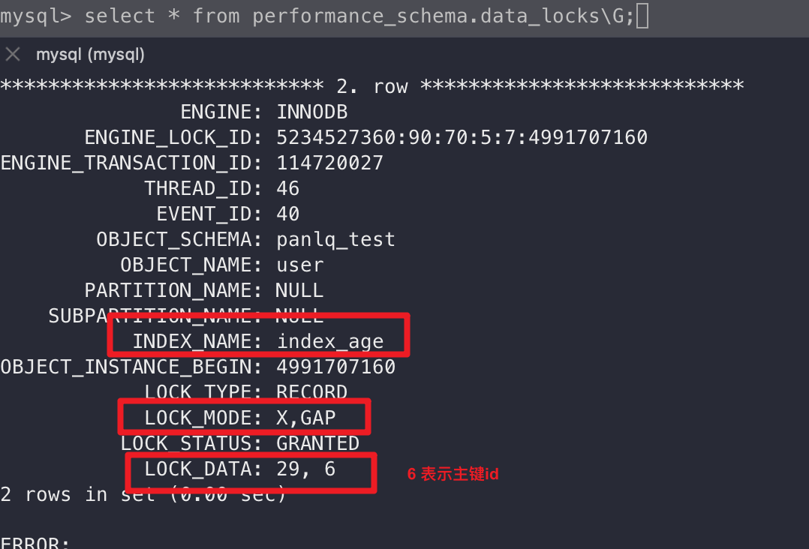
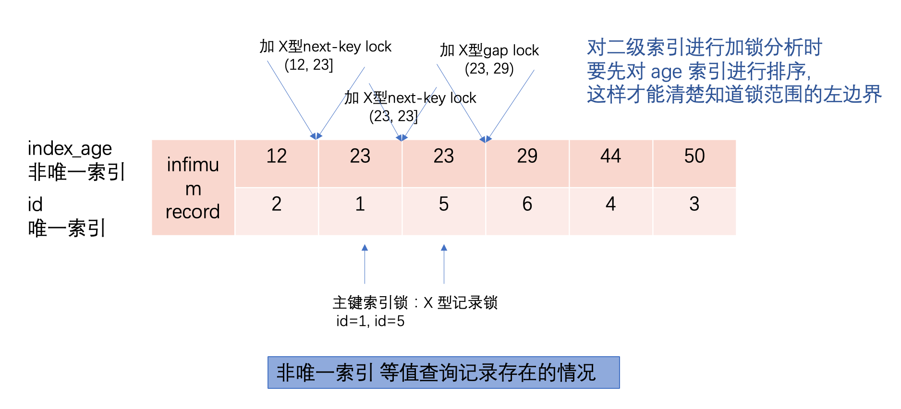

```sql
BEGIN;  -- 事务开始，此时还没有获取任何锁

-- 执行UPDATE语句时获取id=1的行的排他锁
UPDATE accounts SET balance = balance - 100 WHERE id = 1;

-- 执行SELECT FOR UPDATE时获取id=2的行的排他锁
SELECT * FROM accounts WHERE id = 2 FOR UPDATE;

COMMIT;  -- 事务结束，释放所有锁
```

- **两阶段锁定协议** ：MySQL 遵循这个协议，锁在事务期间逐步获取，但只在事务结束时统一释放。
- **锁的粒度** ：InnoDB 支持行级锁，只有实际访问的行才会被锁定。
- **锁的类型** ：包括共享锁(S 锁)、排他锁(X 锁)、意向锁等，根据操作类型自动获取。

> **内容大部分转载自：[小林 coding 《图解 MySQL》](https://www.xiaolincoding.com/mysql/lock/mysql_lock.html)+个人实践学习**

# 1. **全局锁**

## 1.1. **使用方式**

使用全局锁

flush tables with read lock

释放全局锁 (注：当会话断开后，全局锁会被自动释放)

unlock tables

## 1.2. 影响范围

全局锁，执行后，整个数据库就处于只读状态，这时其他线程执行以下操作，都会被阻塞

- 对数据的增删改操作： insert、delete、update...
- 对表结构的更改操作：alter table、drop table...

## 1.3. 使用场景

全局锁主要应用于做 全库逻辑 备份 ，这样在备份数据库期间，不会因为数据或表结构的更新，出现备份文件的数据与实际的不一样。

在全库逻辑备份期间，如果不加全局锁，会出现什么场景？

比如，备份期间，有用户买了一件商品，一般购买商品的业务逻辑会涉及到多张数据库表的更新，如果用户表，库存表。有如下场景

1. 先备份了用户表的数据
2. 然后有用户发起了购买商品的操作
3. 接着再备份商品表的数据

也就是在备份用户表和商品表之间，有用户购买了商品，这种情况下，备份的结果是用户表中该用户的余额并没有扣除，但是商品表中该商品的库存被减少了。相当于如果用备份的数据恢复数据库，用户就白嫖了一件商品(余额多了一份)。

加全局锁会带来什么影响？

加全局锁，意味着整个数据库都是只读状态，如果有大量数据，备份就会话费很多时间，如果不能更新数据，就会导致业务停滞。

既然备份数据库的时候，使用全局锁会影响业务，那么什么其他方式可以避免？

如果数据库的引擎支持的事务支持可重复读的隔离级别，那么在备份数据库之前先开启事务，会先创建 Read View， \*\*然后整个实物执行期间都在用这个 Read View 的数据, 在 MVCC 的加持下，备份期间业务依然可以对数据进行更新操作。

基于事务的隔离性，备份期间的数据是开启了事务时的视图数据。

备份数据库的工具 `mysqldump`，在使用时，加上 `--signal-transaction`参数，就会在备份数据库之前先开启事务。这种方法只适用于支持「可重复度隔离级别的事务」的存储引擎

InnoDB 存储引擎默认的事务隔离级别正是可重复读，因此可以采用这种方式来备份数据库。

但是，对于 MyISAM 这种不支持事务的引擎，在备份数据库时就要使用全局锁的方法。

# 2. **表级锁**

## 2.1. **概念**

表级锁有哪几种

- 表锁
- 元数据锁 （MDL）
- 意向锁
- AUTO-INC 锁

## 2.2. **表锁**

```shell
// 表级别的共享锁，读锁
lock tables table_name read;


// 表级别的独占锁，写锁
lock tables table_name write；


// 释放当前会话的所有表锁
unlock tables；
```

## 2.3. **metadata lock MDL**

”metadata lock”简称为 MDL ，即元数据锁，从 MySQL 5.5 开始引入的，他是基于表元数据(表结构)的锁，MDL 锁是为了保证并发环境下元数据和表数据的结构一致性。**如果有事务对表加了 MDL 锁，那么其他事务就不能对表结构进行变更，同样对于正在进行表结构变更的时候也不允许其他事务对表数据进行增删改查，他能解决或者保证的是 DDL 操作与 DML 操作之间的一致性。**

**不需要显示的使用 MDL，当我们对数据表进行操作时，会自动给这个表加 MDL**

- **对一张表进行 CRUD 操作时「DML」，加的是 MDL 读锁**
- **对一张表做结构变更操作时「DDL」，加的是 MDL 写锁**

**当有线程在执行 select 语句(加 MDL 读锁)的期间，如果有其他线程要更改表的结构（申请 MDL 写锁），那么将会被阻塞，直到执行完 select 语句(释放 MDL 读锁)**

**反之，当有线程对表结构进行变更(加 MDL 写锁)的期间，如果有线程执行了 CRUD 操作(申请读锁)，那么就会被阻塞，直到表结构变更完成(释放 MDL 写锁)**

**MDL 是在事务提交后才会释放，这意味着，事务执行期间，MDL 是一直持有的。**

场景分析：

如果数据库有一个长事务(开启了事务，但没有提交)，那么在对表结构做变更操作的时候，可能会发生意想不到的事情，如下面的顺序

1. 线程 a 先启用事务，执行一条 select 语句，但不 commit，此时就先对该表加上了 MDL 读锁
2. 线程 b 也执行了同样的 select 语句，并不会阻塞，读读 不冲突
3. 线程 c 修改表字段，此时由于线程 a 的事务并没有提交，MDL 读锁还占用着，这时线程 c 就无法申请到 MDL 写锁，就会被阻塞

在线程 c 阻塞后，后续所有对该表的 select 语句，都会被阻塞，如果此时有大量该表的 select 语句请求，就会有大量线程被阻塞，数据库的线程很快就会爆满。

**为什么线程 c 申请不到 MDL 写锁，会导致后续申请读锁的查询操作都被阻塞呢？**

这是因为申请 MDL 锁的操作会形成一个队列，队列中写锁获取优先级高于读锁，一单出现 MDL 写锁等待，会阻塞后续该表的所有 CRUD 操作。

- DML (Data Manipulation Language): 包括 SELECT, UPDATE, INSERT, DELETE 等语句。这些语句用于查询和改变数据。比如，在一个表中插入数据、删除一些记录、更改一个字段的值或者从数据库中搜索特定的记录都是通过 DML 操作实现的。
- DDL (Data Definition Language): 包括 CREATE, DROP, ALTER 等语句。这些语句用于定义或改变表（Table）的结构，或者数据库（Database）。比如，创建新表，删除表，增加表中的字段，添加/删除索引，或者改变字段的类型都是通过 DDL 操作实现的。

所以，如果你想要查询或修改数据，你会用到 DML。如果你需要创建新的表，或者修改现有表的结构，你会用到 DDL。

## 2.4. **意向锁**

- **在使用 InnoDB 引擎的表里，对某些记录加「共享锁」之前，需要先在表级别加上一个「意向共享锁」**
- **在使用 InnoDB 引擎的表里，对某些记录加「独占锁」之前，需要先在表级别加上一个「意向独占锁」**

也就是说，当执行插入，更新，删除操作，需要先对表加上「意向独占锁」，然后对该记录加独占锁。而普通的 select 是不会加行级锁的，select 语句是利用 mvcc 实现一致性，是无锁的。

**当然，select 也可以对记录加共享锁或独占锁**

```sql
-- 先给表加上意向共享锁，然后对读取的记录加共享锁
select ... lock in share mode;

-- 先给表加上意向独占锁，然后对读取的记录加独占锁
select ... for update;
```

**_意向共享锁和意向独占锁是表级锁，不会和行级的共享锁和独占锁发生冲突，而且意向锁之间也不会发生冲突，只会和共享表锁(_** `<strong><em>lcok tables ... read</em></strong>` **_)和独占表锁(_** `<strong><em>lock tables ... write</em></strong>`**_) 发生冲突_**

表锁和行锁都满足

- 读读共享
- 读写互斥
- 写写互斥

**如果没有意向锁，那么加独占表锁时，就需要遍历全表，查看是否有记录存在独占锁，这样效率很慢。那有了意向锁，由于在对记录加独占锁前，先会加上表级别的意向独占锁。那么在加「独占表锁」时，直接查该表是否有意向独占锁，如果有就意味着表里已经有记录被独占了，就不需要全表扫描了。**

**所以：意向锁的目的是为了加快速判断表里是否有记录被加锁**

## 2.5. **AUTO-INC 锁**

表里主键通常都会设置成自增的，这是通过对逐渐字段声明 `AUTO_INCREMENT`属性实现的。

之后可以在插入数据时，可以不指定主键的值，数据库会自动给主键赋值(递增的值)，这主要是通过 AUTO-INC 锁实现的。

AUTO-INC 锁是特殊的表锁机制，**锁不是在一个事务提交后才释放，而是在执行完插入语句后就会立即释放**。

**在插入数据时，会加一个表级别的 AUTO-INC 锁**，然后为被 AUTO_INCREMENT 修饰的字段赋值递增的值，等插入语句执行完成后，才会把 AUTO-INC 锁释放。

一个事务在持有 AUTO-INC 锁的过程中，其他事务如果要向该表执行插入语句都会被阻塞，从而保证插入数据时，被 AUTO_INCREMENT 修饰的字段的值时连续递增的。

但是 AUTO-INC 锁在对大量数据进行插入的时候，会影响插入性能，因为另一个事务中的插入会被阻塞。

因此，在 MySQL5.1.22 版本开始，InnoDB 存储引擎提供了一种 轻量级的锁来实现自增 。

一样也是在插入数据的时候，会为被 AUTO_INCREMENT 修饰的字段加上轻量级锁，然后给该字段赋值一个自增的值，就把这个轻量级锁释放了，而不需要等待整个插入语句执行完后才释放锁。

**innoDB 存储引擎提供了个** `innodb_autoinc_lock_mode`的系统变量，是用来控制选择用 AUTO-INC 锁，还是轻量级锁

- `innodb_autoinc_lock_mode=0`，就采用 AUTO-INC 锁，语句执行结束才释放锁
- `innodb_autoinc_lock_mode=2`，就采用轻量级锁， 盛情自增主键后就释放锁，并不需要等语句执行完后才释放
- `innodb_autoinc_lock_mode=1`
  - 普通 insert 语句，自增锁在申请之后就马上释放
  - 类似 insert ... select 这样的批量插入数据的语句，自增锁还是要等语句结束后才被释放

**注意：当 innodb_autoinc_lock_mode=0 时，自增值是连续的，而 1.2 模式下，自增值在高并发的场景下时非连续的**

`innodb_autoinc_lock_mode=2`是性能最高的方式，但是当搭配 binlog 的日志格式是 statement 一起使用的时候，在「主从复制的场景」中会发生**数据不一致的问题**

**举个列子，如下场景**

| **session A**                                                                                                                                          | **session B**                                |
| ------------------------------------------------------------------------------------------------------------------------------------------------------ | -------------------------------------------- |
| insert into t values(null, 1, 1);<br />insert into t values(null, 2, 2);<br />insert into t values(null, 3, 3);<br />insert into t values(null, 4, 4); |                                              |
|                                                                                                                                                        | **create table t2 like t;**                  |
| **insert into t2 values(null, 5, 5)**                                                                                                                  | **insert into t2(c, d) select c, d from t;** |

session A 往表 t 中插入了 4 行数据，然后创建了一个相同结构的表 t2，然后两个 session 同时执行向表 t2 中插入数据。

如果 innodb_autoinc_lock_mode = 2，意味着「申请自增主键后就释放锁，不必等插入语句执行完」。那么就可能出现这样的情况：

- session B 先插入了两个记录，(1,1,1)、(2,2,2)；
- 然后，session A 来申请自增 id 得到 id=3，插入了（3,5,5)；
- 之后，session B 继续执行，插入两条记录 (4,3,3)、 (5,4,4)。

可以看到， session B 的 insert 语句，生成的 id 不连续 。

当「主库」发生了这种情况，binlog 面对 t2 表的更新只会记录这两个 session 的 insert 语句，如果 binlog_format=statement，记录的语句就是原始语句。记录的顺序要么先记 session A 的 insert 语句，要么先记 session B 的 insert 语句。

但不论是哪一种，这个 binlog 拿去「从库」执行，这时从库是按「顺序」执行语句的，只有当执行完一条 SQL 语句后，才会执行下一条 SQL。因此，在 从库上「不会」发生像主库那样两个 session 「同时」执行向表 t2 中插入数据的场景。所以，在备库上执行了 session B 的 insert 语句，生成的结果里面，id 都是连续的。这时，主从库就发生了数据不一致 。

要解决这问题，binlog 日志格式要设置为 row，这样在 binlog 里面记录的是主库分配的自增值，到备库执行的时候，主库的自增值是什么，从库的自增值就是什么。

所以， 当 innodb_autoinc_lock_mode = 2 时，并且 binlog_format = row，既能提升并发性，又不会出现数据一致性问题 。

# 3. **行锁**

普通的 select 语句不会对记录加锁，因为它属于快照读，通过 mvcc 实现一致性隔离。如果要在查询时对记录加行锁，可以使用以下方式，这种查询枷锁的语句被称为锁定读。

```sql
//对读取的记录加共享锁
select ... lock in share mode;

//对读取的记录加独占锁
select ... for update;
```

**上面这两条语句必须在一个事务中执行，因为当事务提交了，锁就会被释放。**

**除了上面两条锁定读会加行锁之外，udpate 和 delete 操作都会加行锁，且锁的类型都是独占锁**

```sql
-- X锁
update table .... where id = 1;

-- X锁
delete from table where id = 1;
```

InnoDB 存储引擎实现了如下两种标准的行级锁：

- 共享锁(S Lock)：允许事务读一行数据，读读共享，读写互斥
- 独占锁(排他锁)(X Lock)：允许事务删除或更新一行数据，写写互斥，读写互斥

## 3.1. **行级锁的类型**

主要有三类

- Record Lock，记录锁，就是把一条记录上锁
- Gap Lock，间隙锁，锁定一个范围，但不包含锁记录本身
- Next-Key Lock，Record Lock + Gap Lock 的组合，锁定一个范围+记录本身

在不同隔离级别下，行级锁的种类是不同的。

- 读已提交：记录锁
- 可重复读：记录锁，间隙锁，临键锁

## 3.2. **Record Lock**

- 当一个事务对一条记录加了 S 型记录锁后，其他事务也可以继续对该记录加 S 型记录锁，但是不可以对该记录加 X 型记录锁
- 当一个事务对一条记录加了 X 型记录锁后，其他事务不可以对该记录加 S、X 锁

```sql
begin;
select * from test_tb where id = 1 for update;
commit;
```

上面的实例就是对 id=1 的记录加上 X 型记录锁，其他事务无法对该数据进行修改。

当事务执行 commit 后，事务过程中生成的锁都会被释放。

## 3.3. **Gap Lock**

间隙锁，只存在于可重复读隔离级别，目是时为了解决可重复读隔离级别下幻读的现象。

假设，表中有一个范围 id 为(1, 5)的间隙锁，那么其他事务就无法插入 id=4 这条记录了，这样就有效防止了幻读现象的发生。


间隙锁虽然存在 X 型间隙锁和 S 型间隙锁，但是并没有什么区别，**间隙锁之间是兼容的，即两个事务可以同时持有包含共同间隙范围的间隙锁，并不存在互斥关系，因为间隙锁的目的是防止插入幻影记录而提出的。**

> **在事务 A 中按照某个条件先后两次查询数据库，两次查询结果的条数不同，这种现象称为幻读。不可重复读与幻读的区别可以通俗的理解为：前者是数据变了，后者是数据的行数变了**
>
> [MySQL 基础回顾(2020/06/14 修改) - JonPan - 博客园](https://www.cnblogs.com/panlq/p/10612430.html#3057857392)

两个事务的间隙锁之间是相互兼容的，不会产生冲突。

在 MySQL 官网上还有一段非常关键的描述：

> Gap locks in InnoDB are “purely inhibitive”, which means that their only purpose is to prevent other transactions from Inserting to the gap. Gap locks can co-exist. A gap lock taken by one transaction does not prevent another transaction from taking a gap lock on the same gap. There is no difference between shared and exclusive gap locks. They do not conflict with each other, and they perform the same function.

间隙锁的意义只在于阻止区间被插入，因此是可以共存的。一个事务获取的间隙锁不会阻止另一个事务获取同一个间隙范围的间隙锁，共享（S 型）和排他（X 型）的间隙锁是没有区别的，他们相互不冲突，且功能相同。

## 3.4. **Next-Key Lock**

临键锁，假设，表中有一个范围 id 为（3，5] 的 next-key lock，那么其他事务即不能插入 id = 4 记录，也不能修改 id = 5 这条记录。

所以，next-key lock 即能保护该记录，又能阻止其他事务将新纪录插入到被保护记录前面的间隙中。

next-key lock 是包含间隙锁+记录锁的，如果一个事务获取了 X 型的 next-key lock，那么另外一个事务在获取相同范围的 X 型的 next-key lock 时，是会被阻塞的。

**虽然相同范围的间隙锁是多个事务相互兼容的，但对于记录锁，我们是要考虑 X 型与 S 型关系，X 型的记录锁与 X 型的记录锁是冲突的。**

## 3.5 插入意向锁

> An Insert intention lock is a type of gap lock set by Insert operations prior to row Insertion. This lock signals the intent to Insert in such a way that multiple transactions Inserting into the same index gap need not wait for each other if they are not Inserting at the same position within the gap. Suppose that there are index records with values of 4 and 7. Separate transactions that attempt to Insert values of 5 and 6, respectively, each lock the gap between 4 and 7 with Insert intention locks prior to obtaining the exclusive lock on the Inserted row, but do not block each other because the rows are nonconflicting.

一个事务在插入一条记录的时候，需要判断插入位置是否已被其他事务加了间隙锁(next-key lock 也包含间隙锁)。

如果有的话，插入操作就会发生阻塞，直到拥有间隙锁的那个事务提交位置（释放间隙锁的时刻），在此期间会生成一个插入意向锁，表明有事务想在某个区间插入新记录，但是出于等待状态。

举个例子，假设事务 A 已经对表加了一个范围 id 为 (3,5)间隙锁


当时事务 A 还没有提交的时候，事务 B 向该表插入一条 id=4 的新纪录，这时会判断插入的位置已经被事务 A 加了间隙锁，于是事务 B 会生成一个插入意向锁，然后将锁的状态设置为等待状态(**_PS: mysql 加锁时，是先生成锁结构，然后设置锁的状态，如果锁状态是等待状态，并不是意味着事务成功获取到锁，只有当锁的状态为正常时，才代表事务成功获取到锁_**)。此时事务 B 会阻塞。

插入意向锁名字虽然有意向锁，但是它是一种特殊的间隙锁，属于行级别锁。用于并发插入操作

如果说间隙锁锁住的是一个区间，那么「插入意向锁」锁住的就是一个点。因而从这个角度来说，插入意向锁确实是一种特殊的间隙锁。

插入意向锁与间隙锁的另一个非常重要的差别是：**尽管「插入意向锁」也属于间隙锁，但两个事务却不能在同一时间内，一个拥有间隙锁，另一个拥有该间隙区间内的插入意向锁（当然，插入意向锁如果不在间隙锁区间内则是可以的）。**

》》[间隙锁+插入意向锁案例](https://www.xiaolincoding.com/mysql/lock/show_lock.htm)

## 3.6 间隙锁+插入意向锁案例分析

```sql

CREATE TABLE students (
    id INT NOT NULL,
    no VARCHAR(255),
    name VARCHAR(255),
    age INT DEFAULT NULL,
    score INT DEFAULT NULL,
    PRIMARY KEY (`id`)
) ENGINE=InnoDB DEFAULT CHARSET=utf8mb4;


INSERT INTO students (id, no, name, age, score) VALUES
(15, 'S0001', 'Bob', 25, 34),
(18, 'S0002', 'Alice', 24, 77),
(20, 'S0003', 'Jim', 24, 5),
(30, 'S0004', 'Eric', 23, 91),
(37, 'S0005', 'Tom', 22, 22),
(49, 'S0006', 'Tom', 25, 83),
(50, 'S0007', 'Rose', 23, 89);
```

```bash
mysql> select * from students;
+----+-------+-------+------+-------+
| id | no    | name  | age  | score |
+----+-------+-------+------+-------+
| 15 | S0001 | Bob   |   25 |    34 |
| 18 | S0002 | Alice |   24 |    77 |
| 20 | S0003 | Jim   |   24 |     5 |
| 30 | S0004 | Eric  |   23 |    91 |
| 37 | S0005 | Tom   |   22 |    22 |
| 49 | S0006 | Tom   |   25 |    83 |
| 50 | S0007 | Rose  |   23 |    89 |
+----+-------+-------+------+-------+
7 rows in set (0.00 sec)
```

**在可重复隔离级别下，上面的题目会发生什么？**




以上的题目会造成死锁，死锁的四个必要条件：互斥、占有且等待、不可强占用，循环等待。

#### 如何避免死锁

只要系统发⽣死锁，这些条件必然成⽴，但是只要破坏任意⼀个条件就死锁就不会成⽴。

在数据库层⾯，有两种策略通过「打破循环等待条件」来解除死锁状态：

- 设置事务等待锁的超时时间。当⼀个事务的等待时间超过该值后，就对这个事务进⾏回滚，于是锁就释放了，另⼀个事务就可以继续执⾏了。在 InnoDB 中，参数 innodb_lock_wait_timeout 是⽤来设置超时时间的，默认值时 50 秒。

当发⽣超时后，就出现下⾯这个提示：

> ERROR 1205 (HY000): Lock wait timeout exceeded; try restarting transaction

- 开启主动死锁检测。主动死锁检测在发现死锁后，主动回滚死锁链条中的某⼀个事务，让其他事务得以继续执⾏。将参数 innodb_deadlock_detect 设置为 on，表示开启这个逻辑，默认就开启。

当检测到死锁后，就会出现下⾯这个提示：

> ERROR 1213 (40001): DeadLock found when tring to get lock; try restarting transaction

> 最后说个段⼦：
> ⾯试官: 解释下什么是死锁?
> 应聘者: 你录⽤我,我就告诉你
> ⾯试官: 你告诉我,我就录⽤你
> 应聘者: 你录⽤我,我就告诉你
> ⾯试官: 卧槽滚！

# 4. **Innodb 是怎么加行锁的？**

**加锁的对象是索引，加锁的基本单位是 next-key-lock** **，它是由记录锁+范围锁结合而成的。**

**next-key-lock 是前开后闭区间，间隙锁时前开后开区间。**

**但是，next-key-lock 在一些场景下会退化成记录所或间隙锁。**

**具体是什么场景呢？**

**总结一句话：在能使用记录锁或间隙锁就能避免幻读现象的场景下，next-key-lock 就会退化成记录锁或间隙锁。**

用以下表来进行后续的理论实验说明

```sql
CREATE TABLE `user` (
  `id` bigint NOT NULL AUTO_INCREMENT,
  `name` varchar(30) COLLATE utf8mb4_unicode_ci NOT NULL,
  `age` int NOT NULL,
  PRIMARY KEY (`id`),
  KEY `index_age` (`age`) USING BTREE
) ENGINE=InnoDB  DEFAULT CHARSET=utf8mb4 COLLATE=utf8mb4_unicode_ci;
```

其中，id 是主键索引（唯一索引），age 是普通索引（非唯一索引），name 是普通的列。

表中的有这些行记录：

```sql
INSERT INTO user(name, age) VALUES
('小王',23),
('小李',12),
('老王',50),
('小三',29),
('小红',23),
('小四',29);

mysql> select * from user;
+----+--------+-----+
| id | name   | age |
+----+--------+-----+
|  1 | 小王   |  23 |
|  2 | 小李   |  12 |
|  3 | 老王   |  50 |
|  4 | 小三   |  29 |
|  5 | 小红   |  23 |
|  6 | 小四   |  29 |
+----+--------+-----+
6 rows in set (0.00 sec)
```

实验的 mysql 版本是 mysql Ver 8.1.0，隔离级别如下

```bash
**mysql> SHOW VARIABLES LIKE 'transaction_isolation';**
+-----------------------+-----------------+
| Variable_name         | Value           |
+-----------------------+-----------------+
| transaction_isolation | REPEATABLE-READ |
+-----------------------+-----------------+
1 row in set (0.01 sec)
```

1. READ UNCOMMITTED（读未提交）
2. READ COMMITTED（读提交）
3. REPEATABLE READ（可重复读）
4. SERIALIZABLE（可串行化）

## 4.1. **等值唯一索引**

当使用唯一索引等值查询时，查询的记录是否存在，枷锁的规则也会不同

- **当查询的记录存在时，在索引树上定位到这一条记录后，将该记录的索引中的 next-key-lock 退化成记录锁**
- **当查询的记录不存在，在索引树找到第一条大于该查询的记录后，将该记录的索引中的 next-key-lock 退化成间隙锁**

### 4.1.1. **记录存在的情况**

1. 假设事务 a 执行了等值查询的记录并尝试加 X 型记录锁，查询的记录存在于表中

```sql
mysql> begin;
Query OK, 0 rows affected (0.00 sec)

mysql> select * from user2 where id = 1 for update;
+----+--------+-----+
| id | name   | age |
+----+--------+-----+
|  1 | 小王   |  23 |
+----+--------+-----+
1 row in set (0.00 sec)
```


接下来，如果有其他事务，对 id 为 1 的记录进行更新或者删除操作的话，这些操作都会被阻塞，因为更新或者删除操作也会对记录加 X 型的记录锁，而 X 锁和 X 锁之间是互斥关系。

**有什么命令可以分析加了什么锁吗？**

可以通过 `select * from performance_schema.data_locks\G; `这条语句，查看事务执行 SQL 过程中加了什么锁。


**从上图可以看到，共加了两个锁，分别是**

- **表锁：X 型意向锁**
- **行锁：X 型记录锁**

图中 `LOCK_TYPE` RECORD 表示行锁，而不是记录锁的意思

- LOCK_MODE=X，说明是 next-key-lock
- LOCK_MODE=X, REC_NOT_GAP，说明是记录锁
- LOCK_MODE=X, GAP，说明是间隙锁

因此，此时事务 a (上图事务 id=61) 在 id=1 的记录的主键索引上加了记录锁，锁住的范围是 id=1 这条记录。这样其他事务就无法对 id=1 这条记录进行更新或删除操作了。

**为什么唯一索引等值查询并且查询记录存在的场景下，该记录的索引中的 next-lock-key 会退化成记录锁？**

**原因就是在唯一索引等值查询并且查询记录存在的场景下，仅靠记录锁也能避免幻读的问题。**

幻读的定义就是，当一个事务前后两次查询的结果集(即数量不同)，不相同时，就认为发生幻读。所以，要避免幻读就是避免结果集某一条记录被其他事务删除，或者有其他事务插入了一条新记录，这样前后两次查询的结果集就不会出现不相同的情况。

- 由于主键具有唯一性，所有其他事务插入 id=1 的时候，会因为主键冲突，导致无法插入和删除，这样事务 a 在多次查询 id=1 的记录时，不会出现前后两次查询的结果不同的情况，也就避免了幻读的问题。

在其他窗口启动执行更新操作，可以发现被阻塞

```sql
update user2 set name = 'xxx' where id = 1;
```

查询当前锁的状态，可以看到，原有事务 a(事务 ID=61) 的锁还在，多了两条锁信息是事务 b(事务 ID=62)


**从上图可以看出，每次操作都会给表加意向锁，且表级意向锁之间不会出现冲突。**

从上图可以看到，共加了两个锁，分别是

- 表锁：X 型意向锁
- 行锁：X 型记录锁

X 型记录锁，处于等待状态

### 4.1.2. **记录不存在的情况**

假设事务 a 执行了以下语句，查询的记录不存在

```sql
mysql> select * from user2;
+----+--------+-----+
| id | name   | age |
+----+--------+-----+
|  1 | 小王   |  23 |
|  5 | 小李   |  12 |
| 10 | 老王   |  50 |
| 15 | 小三   |  29 |
| 20 | 小红   |  28 |
| 25 | 小四   |  29 |
+----+--------+-----+
6 rows in set (0.00 sec)
mysql> begin;
Query OK, 0 rows affected (0.00 sec)

mysql> select * from user2 where id = 2;
Empty set (0.00 sec)

mysql> select * from user2 where id = 2 for update;
Empty set (0.00 sec)
```

**此时事务 a 在 id=5 记录的主键索引上加的是间隙锁，锁住的范围是(1, 5)**


接下来，如果有其他事务插入 id 值为 2，3，4 这些记录的话，这些插入语句都会发生阻塞

如果插入 id=1 或 id=5 的记录，并不会发生阻塞，而是直接报主键冲突错误.

**为什么唯一索引等值查询并且查询记录「不存在」的场景下，在索引树找到第一条大于该查询记录的记录后，要将该记录的索引中的 next-key lock 会退化成「间隙锁」？**

**原**因就是在唯一索引等值查询并且查询记录不存在的场景下，仅靠间隙锁就能避免幻读的问题。

- **为什么 id = 5 记录上的主键索引的锁不可以是 next-key lock？**如果是 next-key lock，就意味着其他事务无法删除 id = 5 这条记录，但是这次的案例是查询 id = 2 的记录，只要保证前后两次查询 id = 2 的结果集相同，就能避免幻读的问题了，所以即使 id =5 被删除，也不会有什么影响，那就没必须加 next-key lock，因此只需要在 id = 5 加间隙锁，避免其他事务插入 id = 2 的新记录就行了。
- **为什么不可以针对不存在的记录加记录锁？**锁是加在索引上的，而这个场景下查询的记录是不存在的，自然就没办法锁住这条不存在的记录。


既然是开区间，如果我们把 id=5，id=1 的数据删除，对锁会有什么影响吗？能成功插入中间数据？

```sql
mysql> select * from user2;
+----+--------+-----+
| id | name   | age |
+----+--------+-----+
|  1 | 小王   |  23 |
|  5 | 小李   |  12 |
| 10 | 老王   |  50 |
| 15 | 小三   |  29 |
| 20 | 小红   |  28 |
| 25 | 小四   |  29 |
+----+--------+-----+
6 rows in set (0.00 sec)

mysql> insert user2 (id,name,age) values (3, 'df', 23);
ERROR 1205 (HY000): Lock wait timeout exceeded; try restarting transaction
mysql> delete from user2 where id = 5;
Query OK, 1 row affected (0.01 sec)

mysql> select * from user2;
+----+--------+-----+
| id | name   | age |
+----+--------+-----+
|  1 | 小王   |  23 |
| 10 | 老王   |  50 |
| 15 | 小三   |  29 |
| 20 | 小红   |  28 |
| 25 | 小四   |  29 |
+----+--------+-----+
5 rows in set (0.00 sec)

mysql> insert user2 (id,name,age) values (3, 'df', 23);
ERROR 1205 (HY000): Lock wait timeout exceeded; try restarting transaction

mysql> delete from user2 where id = 1;
Query OK, 1 row affected (0.00 sec)

mysql> select * from user2;
+----+--------+-----+
| id | name   | age |
+----+--------+-----+
| 10 | 老王   |  50 |
| 15 | 小三   |  29 |
| 20 | 小红   |  28 |
| 25 | 小四   |  29 |
+----+--------+-----+
4 rows in set (0.01 sec)

mysql> insert user2 (id,name,age) values (2, 'df', 23);
ERROR 1205 (HY000): Lock wait timeout exceeded; try restarting transaction

ERROR 1317 (70100): Query execution was interrupted
mysql> insert user2 (id,name,age) values (1, '小王', 23);
Query OK, 1 row affected (0.01 sec)

mysql> insert user2 (id,name,age) values (2, '小d', 23);
ERROR 1205 (HY000): Lock wait timeout exceeded; try restarting transaction

mysql> mysql> insert user2 (id,name,age) values (6, '小六', 23);
Query OK, 1 row affected (0.00 sec)
```

**经过验证，删除开区间，上界和下界对已存在的锁不影响，还是无法插入区间值数据，但可以重新插入上下限区间数据**

TODO：遗留问题，研究 mysql 间隙锁的 LOCK_DATA 显示的到底是什么数据，怎么确认上下界限的。看 mysql 内参

## 4.2 唯一索引范围查询

范围查询和等值查询的加锁规则是不同的。

当唯一索引进行范围查询时，会对每一个扫描到的索引加 next-key 锁，然后如果遇到下面的这些情况，会将锁退化成间隙锁或者记录锁

- case1: 针对「大于等于」的范围查询，因为存在等值查询的条件，那么如果等值查询的记录是存在于表中，那么该记录的索引中的 next-key-lock 会退化成记录锁
- case2: 针对「小于或者小于等于」的范围查询，看条件值的记录是否存在于表中：

  - 当条件值不存在，那么不管是「小于」还是「小于等于」条件的范围查询，扫描到终止范围查询的记录时，*该记录*的索引的 next-key-lock 会退化成间隙锁，其他扫描到的记录，都是在这些记录的索引上加 next-key-lock
  - 当条件值存在
    - 如果是「小于」条件的范围查询，扫描到终止范围查询的记录时，该记录的索引退化成间隙锁，其他扫描到的记录，索引都加上 next-key-lock；
    - 如果是「小于等于」，扫描到终止范围查询的记录时，该记录的索引 next-key-lock 不退化成间隙锁，其他记录的索引加上 next-key-lock。

### 4.2.1「大于/大于等于」的范围查询

**实验一：针对「大于」的范围查询**

**假设事务 A 进行以下查询语句**

**事件 A 加锁过程如下：**

1. **最开始要找的第一行是 id=20，由于不是一个等值查询(非大于等于条件查询)，所以对该主键索引加的是范围为(15, 20]的 next-key-lock。**
2. **由于是范围查询，就会继续往后找存在的记录，虽然表最后一条数据是 id=20 的记录，但是实际在 innodb 存储引擎中，会用一个特殊的记录来标记最后一条记录，该特殊记录的名字叫** `supremum pseudo-record`，所以扫描第二行的时候，也就扫描了这个特殊记录，会对该主键索引加范围锁(20, +∞] 的 next-key-lock
3. **停止扫描**


- 在 id=20 这条记录的主键索引上，加了范围(15, 20]的 next-key-lock，意味着其他事务即无法更新或者删除 id=20 的记录，同时无法插入 id 值为 16，17，18，19 的新纪录
- **在特殊记录(**`supremum pseudo-record`)的主键索引上，加了范围为(20, +∞]的 next-key-lock，意味这其他事务无法插入 id 值大于 20 的记录

**根据 sql 语句** `select * from performance_schema.data_locks\G;`也可以查看加锁信息。


**从上图分析中，可以得到，事务 A 在主键索引上加了两个 X 型的 next-key-lock**

**实验二：针对「大于等于」的范围查询**

```sql
mysql> begin;
Query OK, 0 rows affected (0.00 sec)

mysql> select * from user2 where id >= 15 for update;
+----+--------+-----+
| id | name   | age |
+----+--------+-----+
| 15 | 小三   |  29 |
| 20 | 小红   |  28 |
+----+--------+-----+
2 rows in set (0.00 sec)
```

**事件 B 加锁过程如下：**

1. 最开始要找的第一行是 id=15，由于是一个等值查询，所以该主键索引的 next-key-lock 会退化成记录锁，仅锁住 id=15 这行数据。
2. 由于是范围查询，就会继续往后找存在的记录，扫描到第二行是 id=20，所以对该主键索引加的是范围为(15, 20]的 next-key-lock。
3. 接着扫描第三行，扫描到特殊记录叫 `supremum pseudo-record`，对该主键索引加范围锁(20, +∞] 的 next-key-lock
4. 停止扫描


**通过实验证明**

- **针对「大于等于」条件的唯一索引范围查询的情况下，如果条件值的记录存在，那么由于查询该条件值的记录是包含一个等值查询的操作，所以该记录的索引中的 next-key-lock 会退化成记录锁**

### 4.2.1 针对「小于/小于等于」的范围查询

**实验一： 针对「小于」的范围查询，条件值不存在的情况**

假设事务 A 执行了这条范围查询语句，注意查询条件值的记录（id 为 5）并不存在于表中。

```sql
mysql> begin;
Query OK, 0 rows affected (0.00 sec)

mysql> select * from user2 where id < 5 for update;
+----+--------+-----+
| id | name   | age |
+----+--------+-----+
|  1 | 小王   |  23 |
+----+--------+-----+
1 row in set (0.00 sec)
```

**事件 A 加锁过程如下：**

1. 最开始要找的第一行是 id=1，满足小于 5，则对该主键索引加上范围(-∞, 1]的 next-key-lock
2. 由于是范围查询，就会继续往后找存在的记录，扫描到第二行是 id=6， 不满足条件，所以对 id=6 这行记录的主键索引会退化成间隙锁，(1, 6)
3. 停止扫描


- 在 id = 1 这条记录的主键索引上，加了范围为 (-∞, 1] 的 next-key 锁，意味着其他事务即无法更新或者删除 id = 1 的这一条记录，同时也无法插入 id 小于 1 的这一些新记录。
- 在 id = 6 这条记录的主键索引上，加了范围为 (1, 6) 的间隙锁，意味着其他事务无法插入 id 值为 2、3、4、5 的这一些新记录。

**通过 sql 查看锁情况，也可以得出如上结论**


虽然这次范围查询的条件是「小于」，但是查询条件值的记录不存在于表中（ id 为 5 的记录不在表中），所以如果事务 A 的范围查询的条件改成 <= 5 的话，加的锁还是和范围查询条件为 < 5 是一样的

因此，针对「小于或者小于等于」的唯一索引范围查询，如果条件值的记录不在表中，那么不管是「小于」还是「小于等于」的范围查询，扫描到终止范围查询的记录时，该记录中索引的 next-key 锁会退化成间隙锁，其他扫描的记录，则是在这些记录的索引上加 next-key 锁。

**实验二：针对「小于等于」，查询条件值存在的范围查询**

假设事务 B 执行了这条范围查询语句，注意查询条件值的记录（id 为 6）存在于表中。

```sql
mysql> begin;
Query OK, 0 rows affected (0.00 sec)

mysql> select * from user2 where id <=6 for update;
+----+--------+-----+
| id | name   | age |
+----+--------+-----+
|  1 | 小王   |  23 |
|  6 | 小六   |  23 |
+----+--------+-----+
2 rows in set (0.00 sec)
```

**事件 B 加锁过程如下：**

1. 最开始要找的第一行是 id=1，满足小于 6，则对该主键索引加上范围(-∞, 1]的 next-key-lock
2. 由于是范围查询，就会继续往后找存在的记录，扫描到第二行是 id=6， 满足条件，于是对该记录主键索引加范围(1, 6]的 next-key-lock
3. 由于主键索引具有唯一性，不会存在两个 id=6 的记录，所以终止扫描。


- 在 id = 1 这条记录的主键索引上，加了范围为 (-∞, 1] 的 next-key 锁。意味着其他事务即无法更新或者删除 id = 1 的这一条记录，同时也无法插入 id 小于 1 的这一些新记录。
- 在 id = 6 这条记录的主键索引上，加了范围为 (1, 6] 的 next-key 锁。意味着其他事务即无法更新或者删除 id = 6 的这一条记录，同时也无法插入 id 值为 2、3、4、5 的这一些新记录。


**实验三：针对「小于」，查询值存在的范围查询**

假设事务 A 执行了这条范围查询语句，注意查询条件值的记录（id 为 6）存在于表中。

```sql
mysql> begin;
Query OK, 0 rows affected (0.00 sec)

mysql> select * from user2 where id <6 for update;
+----+--------+-----+
| id | name   | age |
+----+--------+-----+
|  1 | 小王   |  23 |
+----+--------+-----+
1 rows in set (0.00 sec)
```

**事件 A 加锁过程如下：**

1. 最开始要找的第一行是 id=1，满足小于 6，则对该主键索引加上范围(-∞, 1]的 next-key-lock
2. 由于是范围查询，就会继续往后找存在的记录，扫描到第二行是 id=6， 不满足条件，于是对该记录主键索引加范围(1, 6]的 next-key-lock，由于非等值查询，所以锁退化成间隙锁(1,6)
3. 由于找到了第一条不满足 id<6 的记录，停止扫描


- 在 id = 1 这条记录的主键索引上，加了范围为 (-∞, 1] 的 next-key 锁，意味着其他事务即无法更新或者删除 id = 1 的这一条记录，同时也无法插入 id 小于 1 的这一些新记录。
- 在 id = 6 这条记录的主键索引上，加了范围为 (1,6) 的间隙锁，意味着其他事务无法插入 id 值为 2、3、4、5 的这一些新记录**。**


**因此，通过前面这三个实验，可以得知。**

**在针对「小于或者小于等于」的唯一索引（主键索引）范围查询时，存在这两种情况会将索引的 next-key 锁会退化成间隙锁的：**

- **当条件值的记录「不在」表中时，那么不管是「小于」还是「小于等于」条件的范围查询，扫描到终止范围查询的记录时，该记录的主键索引中的 next-key 锁会退化成间隙锁，其他扫描到的记录，都是在这些记录的主键索引上加 next-key 锁。**
- **当条件值的记录「在」表中时：**
  - **如果是「小于」条件的范围查询，扫描到终止范围查询的记录时，该记录的主键索引中的 next-key 锁会退化成**间隙锁，其他扫描到的记录，都是在这些记录的主键索引上，加 next-key 锁。
  - **如果是「小于等于」条件的范围查询，扫描到终止范围查询的记录时，该记录的主键索引中的 next-key 锁** **「不会」** **退化成间隙锁，其他扫描到的记录，都是在这些记录的主键索引上加 next-key 锁。**

## 4.3 非唯一等值索引

当我们使用非唯一索引进行等值查询的时候，**因为存在两个索引，一个是主键索引，一个是非主键索引(二级索引)，所以在加锁的时候后，同时会对这两个索引都加锁，但是对主键索引加锁时，只有满足查询条件的记录才会对它们的主键索引加锁。**

针对非唯一索引等值查询，查询的记录是否存在，加锁的规则也不对同：

- 当查询的记录「存在」时，由于不是唯一索引，所以肯定存在索引值相同的记录，于是非唯一索引等值查询的过程是一个扫描的过程，知道扫描到第一个不符合条件的二级索引记录就停止扫描，然后扫描的过程中，对扫描的二级索引加的是 next-key 锁，而对于第一个不符合条件的二级索引记录，该二级索引的 next-key 锁退化成间隙锁。同时，在符合查询条件的记录行主键索引上加记录锁。
- 当查询的记录「不存在」时，扫描到第一个不符合条件的二级索引记录，该二级索引的 next-key 锁会退化成间隙锁。以为不存在满足条件的记录，所以不会对主键索引加锁

### 4.3.1 记录不存在的情况

假设事务 A 对非唯一所以（age)进行了等值查询，且表中不存在 age = 25 的记录

```bash
mysql> select * from user;
+----+--------+-----+
| id | name   | age |
+----+--------+-----+
|  1 | 小王   |  23 |
|  2 | 小李   |  12 |
|  3 | 老王   |  50 |
|  4 | 小三   |  44 |
|  5 | 小红   |  23 |
|  6 | 小四   |  29 |
+----+--------+-----+
6 rows in set (0.00 sec)

mysql> begin;
Query OK, 0 rows affected (0.01 sec)

mysql> select * from user where age = 25 for update;
Empty set (0.00 sec)
```

事务 A 加锁过程如下

- 定位到第一条不符合查询条件的二级索引记录，即扫描到 age=29，于是二级索引的 next-key 锁会退化成间隙锁，范围是(23, 29)
- 停止查询

事务 A 在 aget = 29 的二级索引上，加上了 X 型的间隙锁，意味着，其他事务无法插入 age 值为 24,25,26,27,28 这些记录，不过对于 age=23, age=29 的记录，在一些情况下可以成功插入。具体情况后面分析。





> 当有⼀个事务持有⼆级索引的间隙锁 (23, 29) 时，什么情况下，可以让其他事务的插⼊ age
> = 23 或者 age = 29 记录的语句成功？⼜是什么情况下，插⼊ age = 23 或者 age = 29 记录
> 时的语句会被阻塞？

**什么情况下插入语句会发生阻塞？**

**插⼊语句在插⼊⼀条记录之前，需要先定位到该记录在 B+树 的位置，如果插⼊的位置的下⼀条记录的索引上有间隙锁，才会发⽣阻塞。**

> **在分析⼆级索引的间隙锁是否可以成功插⼊记录时，我们要先要知道⼆级索引树是如何存放记录的？**
> ⼆级索引树是按照⼆级索引值（age 列）按顺序存放的，在相同的⼆级索引值情况下， 再按主键 id 的顺序存放。知道了这个前提，我们才能知道执⾏插⼊语句的时候，插⼊的位置的下⼀条记录是谁。

插⼊ age = 23 记录的成功和失败的情况分别如下：

- 当其他事务插⼊⼀条 age = 23，id = 3 的记录的时候，在⼆级索引树上定位到插⼊的位置，⽽该位置的下⼀条是 id = 15、age = 23 的记录，该记录的⼆级索引上没有间隙锁，所以这条插⼊语句可以执⾏成功。
- 当其他事务插⼊⼀条 age = 23，id = 12 的记录的时候，在⼆级索引树上定位到插⼊的位置，⽽该位置的下⼀条是 id = 6、age = 29 的记录，正好该记录的⼆级索引上有间隙锁，所以这条插⼊语句会被阻塞，⽆法插⼊成功。

插⼊ age = 29 记录的成功和失败的情况分别如下：

- 当其他事务插⼊⼀条 age = 29，id = 3 的记录的时候，在⼆级索引树上定位到插⼊的位置，⽽该位置的下⼀条是 id = 6、age = 29 的记录，正好该记录的⼆级索引上有间隙锁，所以这条插⼊语句会被阻塞，⽆法插⼊成功。
- 当其他事务插⼊⼀条 age = 29，id = 21 的记录的时候，在⼆级索引树上定位到插⼊的位置，⽽该位置的下⼀条是 id = 4、age = 44 的记录，没有间隙锁了，所以这条插⼊语句可以插⼊成功。

所以，**当有⼀个事务持有⼆级索引的间隙锁 (23, 29) 时，插⼊ age = 23 或者 age = 29 记录的语句是否可以执⾏成功，关键还要考虑插⼊记录的主键值，因为「⼆级索引值（age 列）+主键值(id 列)」才可以确定插入的位置，确定了插入位置后，就要看插入位置的下一条记录是否存在间隙锁，如果存在就会发生阻塞**

针对 `LOCK_DATA: 29, 6`+`LOCK_MODE: X, GAP`解读 ：事务 A 在 aget = 29 记录的二级索引上加了 age 值范围 (23, 29)的 X 型间隙锁，同时针对其他事务插入 age 值为 29 的新纪录，不允许插入的新记录 id 小于 6。

### 4.3.2 记录存在的情况

假设事务 A 对非唯一索引 进行等值查询

```bash
mysql> begin;
Query OK, 0 rows affected (0.00 sec)

mysql> select * from user where age = 23 for update;
+----+--------+-----+
| id | name   | age |
+----+--------+-----+
|  1 | 小王   |  23 |
|  5 | 小红   |  23 |
+----+--------+-----+
2 rows in set (0.01 sec)
```

```bash
mysql> select * from performance_schema.data_locks\G;
*************************** 1. row ***************************
               ENGINE: INNODB
       ENGINE_LOCK_ID: 5234527360:92:1420:4969243304
ENGINE_TRANSACTION_ID: 114720028
            THREAD_ID: 46
             EVENT_ID: 44
        OBJECT_SCHEMA: panlq_test
          OBJECT_NAME: user
       PARTITION_NAME: NULL
    SUBPARTITION_NAME: NULL
           INDEX_NAME: NULL
OBJECT_INSTANCE_BEGIN: 4969243304
            LOCK_TYPE: TABLE
            LOCK_MODE: IX
          LOCK_STATUS: GRANTED
            LOCK_DATA: NULL
*************************** 2. row ***************************
               ENGINE: INNODB
       ENGINE_LOCK_ID: 5234527360:92:70:5:7:4991707848
ENGINE_TRANSACTION_ID: 114720028
            THREAD_ID: 46
             EVENT_ID: 44
        OBJECT_SCHEMA: panlq_test
          OBJECT_NAME: user
       PARTITION_NAME: NULL
    SUBPARTITION_NAME: NULL
           INDEX_NAME: index_age
OBJECT_INSTANCE_BEGIN: 4991707848
            LOCK_TYPE: RECORD
            LOCK_MODE: X,GAP
          LOCK_STATUS: GRANTED
            LOCK_DATA: 29, 6
*************************** 3. row ***************************
               ENGINE: INNODB
       ENGINE_LOCK_ID: 5234527360:92:70:5:2:4991707160
ENGINE_TRANSACTION_ID: 114720028
            THREAD_ID: 46
             EVENT_ID: 44
        OBJECT_SCHEMA: panlq_test
          OBJECT_NAME: user
       PARTITION_NAME: NULL
    SUBPARTITION_NAME: NULL
           INDEX_NAME: index_age
OBJECT_INSTANCE_BEGIN: 4991707160
            LOCK_TYPE: RECORD
            LOCK_MODE: X
          LOCK_STATUS: GRANTED
            LOCK_DATA: 23, 1
*************************** 4. row ***************************
               ENGINE: INNODB
       ENGINE_LOCK_ID: 5234527360:92:70:5:6:4991707160
ENGINE_TRANSACTION_ID: 114720028
            THREAD_ID: 46
             EVENT_ID: 44
        OBJECT_SCHEMA: panlq_test
          OBJECT_NAME: user
       PARTITION_NAME: NULL
    SUBPARTITION_NAME: NULL
           INDEX_NAME: index_age
OBJECT_INSTANCE_BEGIN: 4991707160
            LOCK_TYPE: RECORD
            LOCK_MODE: X
          LOCK_STATUS: GRANTED
            LOCK_DATA: 23, 5
*************************** 5. row ***************************
               ENGINE: INNODB
       ENGINE_LOCK_ID: 5234527360:92:70:4:2:4991707504
ENGINE_TRANSACTION_ID: 114720028
            THREAD_ID: 46
             EVENT_ID: 44
        OBJECT_SCHEMA: panlq_test
          OBJECT_NAME: user
       PARTITION_NAME: NULL
    SUBPARTITION_NAME: NULL
           INDEX_NAME: PRIMARY
OBJECT_INSTANCE_BEGIN: 4991707504
            LOCK_TYPE: RECORD
            LOCK_MODE: X,REC_NOT_GAP
          LOCK_STATUS: GRANTED
            LOCK_DATA: 1
*************************** 6. row ***************************
               ENGINE: INNODB
       ENGINE_LOCK_ID: 5234527360:92:70:4:6:4991707504
ENGINE_TRANSACTION_ID: 114720028
            THREAD_ID: 46
             EVENT_ID: 44
        OBJECT_SCHEMA: panlq_test
          OBJECT_NAME: user
       PARTITION_NAME: NULL
    SUBPARTITION_NAME: NULL
           INDEX_NAME: PRIMARY
OBJECT_INSTANCE_BEGIN: 4991707504
            LOCK_TYPE: RECORD
            LOCK_MODE: X,REC_NOT_GAP
          LOCK_STATUS: GRANTED
            LOCK_DATA: 5
6 rows in set (0.00 sec)
```



## 4.4 非唯一范围索引

非唯一索引和主键索引的范围查询的加锁情况有所不同，不同支出在于，

**非唯一索引范围查询，索引的 next-key lock 不会有退化为间隙锁和记录锁的情况，即二级索引范围查询，加的都是 next-key lock**

## 4.5 没有索引

> 前提：在 InnoDB RR 隔离级别下
>
> - 在 RC(读已提交)隔离级别下，只加记录锁(Record Lock)，不加间隙锁
> - 在 RR(可重复读)隔离级别下，会在所有扫描到的记录上加 next-key lock

如果锁定读(update/delete)查询语句，没有是用索引作为查询条件，或者查询语句没有走索引查询，导致全表扫描(非唯一的查询条件，所以要全表扫描)，那么，每一条记录的主键索引上都会加 next-key-lock，这样就相当于锁住全表了，这时如果其他事务对该表进行增、删、改操作的时候，都会被阻塞

因此，在线上在执行 update、delete、select ... for update 等具有加锁性质的语句，一定要检查语句是否走了索引，如果是全表扫描的话，会对每一个索引加 next-key 锁，相当于把整个表锁住了，这是挺严重的问题。

**如何避免这种事故？**

我们可以将 MySQL 里的 `sql_safe_updates` 参数设置为 1，开启安全更新模式。

> 官方的解释： If set to 1, MySQL aborts UPDATE or DELETE statements that do not use a key in the WHERE clause or a LIMIT clause. (Specifically, UPDATE statements must have a WHERE clause that uses a key or a LIMIT clause, or both. DELETE statements must have both.) This makes it possible to catch UPDATE or DELETE statements where keys are not used properly and that would probably change or delete a large number of rows. The default value is 0.

当 sql_safe_updates 设置为 1 时。

update 语句必须满足如下条件之一才能执行成功：

使用 where，并且 where 条件中必须有索引列；
使用 limit；
同时使用 where 和 limit，此时 where 条件中可以没有索引列；
delete 语句必须满足以下条件能执行成功：

同时使用 where 和 limit，此时 where 条件中可以没有索引列；
如果 where 条件带上了索引列，但是优化器最终扫描选择的是全表，而不是索引的话，我们可以使用 force index([index_name]) 可以告诉优化器使用哪个索引，以此避免有几率锁全表带来的隐患。

## 4.6 Insert 语句是怎么加行锁的？

Insert 语句在正常执⾏时是不会⽣成锁结构的，它是靠聚簇索引记录⾃带的 trx*id 隐藏列来作为\*\**隐式锁\_\*\*来保护记录的。

**什么是隐式锁？**

当事务需要加锁的时，如果这个锁不可能发⽣冲突，InnoDB 会跳过加锁环节，这种机制称为隐式锁。隐式锁是 InnoDB 实现的⼀种延迟加锁机制，其特点是只有在可能发⽣冲突时才加锁，从⽽减少了锁的数量，提⾼了系统整体性能。

隐式锁就是在 Insert 过程中不加锁，只有在特殊情况下，才会将隐式锁转换为显示锁，

- 如果记录之间有间隙锁，为了避免幻读，此时是不能插入记录的
- 如果 Insert 的记录和已有记录存在唯一键冲突，此时也不能插入记录

# 5. 总结

mysql 行级锁的加锁规则：

### 5.1 唯一索引等值查询

- 当查询的记录存在时，在索引树上定位到这条记录后，该记录的索引中 next-key-lock 会退化成记录锁
- 当记录不存在时，在索引树上找到第一个条大于该查询记录的记录后，将该记录索引中的 next-key-lock 退化成间隙锁

### 5.2 非唯一索引等值查询

- 当查询记录存在时，由于不是唯一索引，所以肯定存在索引值相同的记录，于是非唯一索引等值查询的过程是一个扫描的过程，直到扫描到第一个不符合条件的二级索引记录就停止扫描。在扫描过程中，对扫描到的二级索引记录加的是 next-key-lcok，而对于第一个不符合条件的二级索引记录，该二级索引的 next-key 锁会退化成间隙锁。同时，在符合查询条件的记录的主键索引上加记录锁。
- 当查询的记录不存在时，扫描到第一条不符合条件的二级索引记录，该二级索引的 next-key-lock 会退化成间隙锁，因为不存在满足查询条件的就，所以不会对主键索引加锁

### 5.3 唯一索引/非唯一索引范围查询

- 唯一索引在满足一些条件的时候，索引的 next-key-lock 退化成间隙锁或记录锁
- 非唯一索引范围查询，索引的 next-key-lock 不会退化成间隙锁和记录锁

其实理解 MySQL 为什么要这样加锁，主要要以避免幻读角度去分析，这样就很容易理解这些加锁的规则了。

还有一件很重要的事情，在线上在执行 update、delete、select ... for update 等具有加锁性质的语句，一定要检查语句是否走了索引。

唯一索引（主键索引）加锁的流程图如下

_（注意这个流程图是针对「主键索引」的，如果是二级索引的唯一索引，除了流程图中对二级索引的加锁规则之外，还会对查询到的记录的主键索引项加「记录锁」，流程图没有提示这一个点，所以在这里用文字补充说明下）_


**非唯一索引加锁的流程图：**


# 6. **mysql 错误分析**

## 6.1. **error 1213**

**"Error 1213: Deadlock found when trying to get lock; try restarting transaction**

## 6.2. **error 1205**

**ERROR 1205 (HY000): Lock wait timeout exceeded; try restarting transaction**

# 参考

1. [技术分享 | MySQL 的 MDL 锁解惑 - 爱可生开源社区](https://opensource.actionsky.com/20220426-mysql/)
2. [技术分享 | Online DDL 工具 pt-osc - 爱可生开源社区](https://opensource.actionsky.com/20200916-ddl/)
3. [PolarDB 数据库内核月报](http://mysql.taobao.org/monthly/2015/11/04/)
4. [一网打尽总结 Mysql 的所有 Buffer](https://mp.weixin.qq.com/s/VFxwbJ09d9_XIxcFk6I3aA)
5. [MYSQL- Lock--gap before rec insert intention waiting:意向锁(IX)等待](http://www.linuxmysql.com/14/2019/1029.htm)
6. [《MySQL 是怎样运行的：从根儿上理解 MySQL》](https://relph1119.github.io/mysql-learning-notes)
