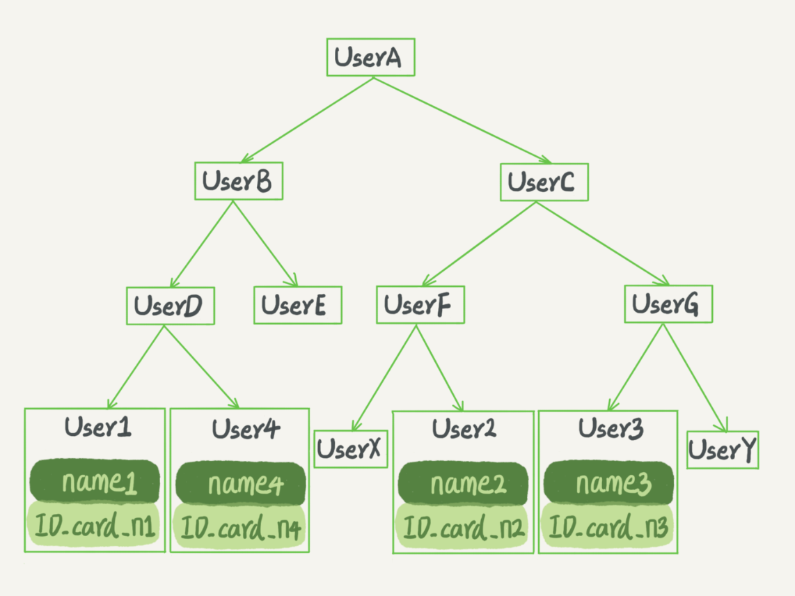
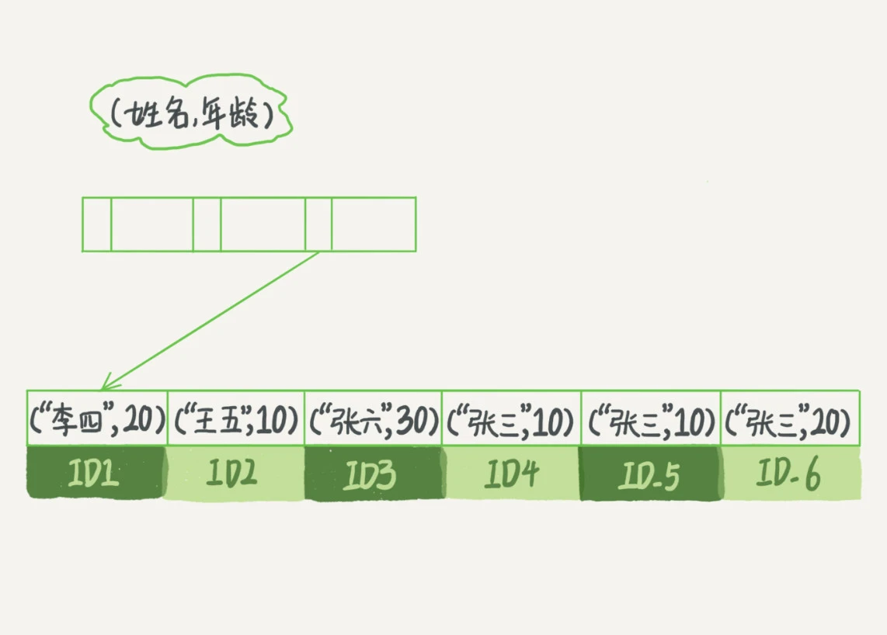

# 索引

索引的作用是提高数据查询效率

# 常见的索引模型

## 哈希表

键值对存储，哈希思路：把值放在数组里，用一个哈希函数把 key 换算成一个确定的位置，然后把 value 放在数组的这个位置

适用场景：等值查询，各语言的 map 底层实现，还有 redis 等 key-val NoSQL

### 哈希函数

1. 取模法
2. 与运算

详细分析可参考: [按位与运算替换取模计算](../../算法/按位与运算替换取模计算.md)

### 哈希冲突

不可避免地，多个 key 值经过哈希函数的换算，会出现同一个值的情况，即哈希冲突。

- 开链法（链地址法)：使用链表将多个哈希值相同的节点串连在一起，从而解决冲突问题，redis 的哈希表就是用这种方式
- 开放地址法：包括线性探测法，二次探测法，伪随机探测法，通过线性函数逐步探测可用的地址，因为函数一样所以插入或查询计算的结果肯定是一样的
- 再哈希法：使用另一个哈希函数计算新的地址，直到不发生冲突

## 有序数组

按顺序存储。查询用二分法就可以快速查询，时间复杂度是：O(log(N))

查询效率高，同时也支持范围查询。

更新效率低，当插入一个记录时，必须挪动后面的所有记录，成本太高

适用场景有序数组索引只适用于静态存储引擎，比如你要保存的是 2017 年某个城市的所有人口信息，这类不会再修改的数据。

## 二叉搜索树



二叉搜索树的特点：每个节点的左儿子小于父节点，父节点又小于右儿子

当然为了维持 O(log(N)) 的查询复杂度，你就需要保持这棵树是平衡二叉树，即满足上面的特点。为了做这个保证，更新的时间复杂度也是 O(log(N))。

二叉树也会畸变成单链表，所以才有了 AVL 树通过旋转的方式来维持树的平衡，但后来发现大量的旋转实在是性能不好，所以有了红黑树。都是二叉树，只是约束条件不一样。没有最好的方法只有更适合的方法，要维持某一方面的优势需要牺牲另一方面的优势，就看如何选择了。

树可以有二叉，也可以有多叉。多叉树就是每个节点有多个儿子，儿子之间的大小保证从左到右递增。二叉树是搜索效率最高的，

但是实际上大多数的数据库存储却并不使用二叉树。其原因是，索引不止存在内存中，还要写到磁盘上。

你可以想象一下一棵 100 万节点的平衡二叉树，树高 20。一次查询可能需要访问 20 个数据块。在机械硬盘时代，从磁盘随机读一个数据块需要 10 ms 左右的寻址时间。也就是说，对于一个 100 万行的表，如果使用二叉树来存储，单独访问一个行可能需要 20 个 10 ms 的时间，这个查询可真够慢的。

为了让一个查询尽量少地读磁盘，就必须让查询过程访问尽量少的数据块。那么，我们就不应该使用二叉树，而是要使用“N 叉”树。这里，“N 叉”树中的“N”取决于数据块的大小。

以 InnoDB 的一个整数字段索引为例，这个 N 差不多是 1200。这棵树高是 4 的时候，就可以存 1200 的 3 次方个值，这已经 17 亿了。考虑到树根的数据块总是在内存中的，一个 10 亿行的表上一个整数字段的索引，查找一个值最多只需要访问 3 次磁盘。其实，树的第二层也有很大概率在内存中，那么访问磁盘的平均次数就更少了。

> N 叉树由于在读写上的性能优点，以及适配磁盘的访问模式，已经被广泛应用在数据库引擎中了。

# 索引类型

我们可以按照四个角度来分类索引。

按「数据结构」分类：B+tree 索引、Hash 索引、Full-text 索引。
按「物理存储」分类：聚簇索引（主键索引）、二级索引（辅助索引）。
按「字段特性」分类：主键索引、唯一索引、普通索引、前缀索引。
按「字段个数」分类：单列索引、联合索引。

## 按数据结构


## 按物理存储

在创建表时，InnoDB 存储引擎会根据不同的场景选择不同的列作为索引：

- 如果有主键，默认会使用主键作为聚簇索引的索引键（key）；
- 如果没有主键，就选择第一个不包含 NULL 值的唯一列作为聚簇索引的索引键（key）；
- 在上面两个都没有的情况下，InnoDB 将自动生成一个隐式自增 id (row_id)列作为聚簇索引的索引键（key）；

其它索引都属于辅助索引（Secondary Index），也被称为二级索引或非聚簇索引。创建的主键索引和二级索引默认使用的是 B+Tree 索引。

主键索引的 B+tree: 非叶子节点存储的主键索引页记录，叶子节点才存储的真实数据记录

二级索引的 B+tree: 非叶子节点存储的列内容索引页记录，叶子节点存储的是主键 ID

主键索引和普通索引的区别：主键索引只要搜索 ID 这个 B+Tree 即可拿到数据。普通索引先搜索索引拿到主键值，再到主键索引树搜索一次(回表)

详细差异内容可以查看》》[InnoDB 数据页结构](./基础/InnoDB数据页结构.md)

## 按字段特性

从字段特性的角度来看，索引分为主键索引、唯一索引、普通索引、前缀索引。

### 主键索引

```sql
CREATE TABLE table_name  (
  ....
  PRIMARY KEY (index_column_1) USING BTREE
);
```

### 唯一索引

```sql
-- 建表时指定
CREATE TABLE table_name  (
  ....
  UNIQUE KEY(index_column_1,index_column_2,...)
);

-- 手动创建

CREATE UNIQUE INDEX index_name
ON table_name(index_column_1,index_column_2,...);
```

### 普通索引

```
-- 建表时指定
CREATE TABLE table_name  (
  ....
  INDEX(index_column_1,index_column_2,...)
);

-- 手动创建
CREATE INDEX index_name
ON table_name(index_column_1,index_column_2,...);
```

### 前缀索引

前缀索引是指对字符类型字段的前几个字符建立的索引，而不是在整个字段上建立的索引，前缀索引可以建立在字段类型为 char、 varchar、binary、varbinary 的列上。

使用前缀索引的目的是为了减少索引占用的存储空间，提升查询效率。

```sql
-- 建表时
CREATE TABLE table_name(
    column_list,
    INDEX(column_name(length))
);

-- 手动创建
CREATE INDEX index_name
ON table_name(column_name(length));
```

## 按字段个数

从字段个数的角度来看，索引分为单列索引、联合索引（复合索引）。

- 建立在单列上的索引称为单列索引，比如主键索引；
- 建立在多列上的索引称为联合索引；

### 联合索引

```sql
-- 建表
CREATE TABLE `tuser` (
  `id` int(11) NOT NULL,
  `id_card` varchar(32) DEFAULT NULL,
  `name` varchar(32) DEFAULT NULL,
  `age` int(11) DEFAULT NULL,
  `ismale` tinyint(1) DEFAULT NULL,
  PRIMARY KEY (`id`),
  KEY `id_card` (`id_card`),
  KEY `name_age` (`name`,`age`)
) ENGINE=InnoDB

-- 手动创建
CREATE INDEX index_name_age ON tuser(name, age);
```



# InnoDB B+tree


操作系统的页默认大小为 4KB，innoDB 的页大小为 16KB，当表中的记录存入 InnoDB 时，为了查询方便会采用操作系统文件管理中的文件索引思路存放记录数据，一个记录从访问到被访问基本会经过如下过程：目录页、页目录、页、记录，其中前三者体现的就是索引的价值，最后一者就是我们说的数据了，而这就是 B+树为什么非叶子节点只有索引，叶子节点才有数据的根源。

B+树是为磁盘及其他存储辅助设备而设计一种平衡查找树（不是二叉树）。B+树中，所有记录的节点按大小顺序存放在同一层的叶子节点中，各叶子节点用指针进行连接。MySQL 将每个叶子节点的大小设置为一个页的整数倍，利用磁盘的预读机制，能有效减少磁盘 I/O 次数，提高查询效率。每一个索引在 InnoDB 里面对应一棵 B+ 树。

底层存储结构可以查看》》[InnoDB 数据页结构](./基础/InnoDB数据页结构.md)

## 索引维护

- 一个数据页满了，按照 B+Tree 算法，新增加一个数据页，叫做页分裂，会导致性能下降。空间利用率降低大概 50%。当相邻的两个数据页利用率很低的时候会做数据页合并，合并的过程是分裂过程的逆过程。
- 从性能和存储空间方面考量，自增主键往往是更合理的选择。

索引项是按照索引定义里面出现的字段顺序排序的。

# [索引优化](https://dev.mysql.com/doc/refman/8.0/en/optimization-indexes.html)

查询优化器逻辑上的索引优化方法

- 索引范围扫描
  - 优化器可以根据条件将某些查询转换为范围扫描，以减少访问数据的行数。例如，当查询带有范围条件时，优化器可以通过范围扫描高效地查找数据。(叶子节点间是双向链表)
- 索引合并
  - 优化器可以合并多个索引的结果集，以满足复杂查询条件。例如，一个查询可能需要对多个列进行条件判断，优化器可以合并这些列上的索引结果。
- 索引条件下推
  - 在存储引擎层面进行部分 WHERE 条件的过滤。这可以减少存储引擎向服务器层返回的数据行数，提高查询效率。
- 索引覆盖
  - 如果一个索引包含了查询所需的所有列，那么优化器可以直接使用该索引而无需访问基表。这可以显著减少 I/O 操作，提高查询性能。
- 多例索引优化
  - 当查询涉及多个列的条件时，优化器可以充分利用多列索引，将查询条件映射到适当的索引，以提高查询性能。
- 子查询优化
  - 优化器可以将某些子查询转换为索引查找或半连接，从而提高查询效率。
- 视图优化
  - 对视图的查询可以被优化为访问底层表的索引，有时可以避免从视图中每次查找数据。
- 等值条件优化
  - 对于等值条件，优化器可以快速定位索引中的匹配行，减少全表扫描的机会。
- 索引扩展
  - 查询优化器，分析语句过程中，自动为二级索引附加主键索引，来提升查询效率

```sql
mysql> create table T(
id int primary key,
k int not null,
name varchar(16),
index (k))engine=InnoDB;
```

有如下数据

```sql
select * from T;
+-----+---+------+
| id  | k | name |
+-----+---+------+
|   1 | 2 | a    |
|   2 | 3 | b    |
|   3 | 4 | c    |
|   5 | 8 | d    |
| 100 | 1 | aa   |
| 200 | 2 | bb   |
| 300 | 3 | cc   |
| 500 | 5 | ee   |
| 600 | 6 | ff   |
| 700 | 7 | gg   |
+-----+---+------+
```

> insert into T values(100,1, 'aa'),(200,2,'bb'),(300,3,'cc'),(500,5,'ee'),(600,6,'ff'),(700,7,'gg');

## 覆盖索引

减少树的搜索次数，提升查询性能

```sql
select id, k where k = 4;
```

由于二级索引 k 的叶子节点存的就是主键 id 的值，且查询的字段只有 id,k，所以可以不用回表直接拿到数据返回

## 最左前缀原则

利用索引的最左前缀定位记录

支持联合索引的最左 N 个字段

支持字符串索引的最左 M 个字符

## 索引下推

利用索引中包含的字段先做判断，减少回表次数

假设表 T 有组合索引(name, k)

```sql
select * from T where name like 'a%' and k = 1;
```

在 mysql 5.7 之前 ，这个语句会先在 name 索引中找出 a 开头的数据，并回表查询数据，在等值判断 k 的值，最后返回数据 「两次回表」

5.7 版本后，增加了索引下推优化，当索引中包含条件字段，则直接先做判断，上述执行过程就变成

先在 name 索引中找出 a 开头的数据，并根据联合索引中 k 做等值判断，然后回表查询数据返回「1 次回表」

## [索引扩展](https://dev.mysql.com/doc/refman/8.0/en/index-extensions.html)

在 MySQL 中，索引扩展（index extension）主要针对于覆盖索引（covering index）和索引条件下推（Index Condition Pushdown, ICP）等优化技术。在 MySQL 中，这些优化技术不仅仅适用于联合主键索引，也适用于单列主键索引。

无论是联合主键索引还是单列主键索引，只要该索引能覆盖查询所需的列，MySQL 的查询优化器就能使用索引扩展技术来提高查询性能。

当然，具体的优化效果依赖于你的查询模式和数据分布情况，但可以肯定的是，单列主键索引同样可以从索引扩展中受益

官方案例：

```sql
CREATE TABLE t1 (
  i1 INT NOT NULL DEFAULT 0,
  i2 INT NOT NULL DEFAULT 0,
  d DATE DEFAULT NULL,
  PRIMARY KEY (i1, i2),
  INDEX k_d (d)
) ENGINE = InnoDB;

INSERT INTO t1 VALUES
(1, 1, '1998-01-01'), (1, 2, '1999-01-01'),
(1, 3, '2000-01-01'), (1, 4, '2001-01-01'),
(1, 5, '2002-01-01'), (2, 1, '1998-01-01'),
(2, 2, '1999-01-01'), (2, 3, '2000-01-01'),
(2, 4, '2001-01-01'), (2, 5, '2002-01-01'),
(3, 1, '1998-01-01'), (3, 2, '1999-01-01'),
(3, 3, '2000-01-01'), (3, 4, '2001-01-01'),
(3, 5, '2002-01-01'), (4, 1, '1998-01-01'),
(4, 2, '1999-01-01'), (4, 3, '2000-01-01'),
(4, 4, '2001-01-01'), (4, 5, '2002-01-01'),
(5, 1, '1998-01-01'), (5, 2, '1999-01-01'),
(5, 3, '2000-01-01'), (5, 4, '2001-01-01'),
(5, 5, '2002-01-01');
```

执行如下语句

```sql
EXPLAIN SELECT COUNT(*) FROM t1 WHERE i1 = 3 AND d = '2000-01-01'
```

如果优化器不考虑索引扩展，则只会用到索引 d，并回表 5 次，判断 i1 = 3 的数据

当考虑索引扩展后，优化器会把索引 d 当做(d, i1, i2)，此时这句 sql 的执行过程如下

找到 d 后由于是 count 语句，且按照最左匹配原则 t1 的值不需要回表就能拿到，可直接判断，所以不需要回表，直接返回数据结果

# 问题

## 1. 为什么选择 B+tree 作为索引的数据结构？

1、B+Tree vs B Tree

B+Tree 只在叶子节点存储数据，而 B 树 的非叶子节点也要存储数据，所以 B+Tree 的单个节点的数据量更小，在相同的磁盘 I/O 次数下，就能查询更多的节点。

另外，B+Tree 叶子节点采用的是双链表连接，适合 MySQL 中常见的基于范围的顺序查找，而 B 树无法做到这一点。

2、B+Tree vs 二叉树

对于有 N 个叶子节点的 B+Tree，其搜索复杂度为 O(logdN)，其中 d 表示节点允许的最大子节点个数为 d 个。

在实际的应用当中， d 值是大于 100 的，这样就保证了，即使数据达到千万级别时，B+Tree 的高度依然维持在 3-4 层左右，也就是说一次数据查询操作只需要做 3-4 次的磁盘 I/O 操作就能查询到目标数据。

而二叉树的每个父节点的儿子节点个数只能是 2 个，意味着其搜索复杂度为 O(logN)，这已经比 B+Tree 高出不少，因此二叉树检索到目标数据所经历的磁盘 I/O 次数要更多。

3、B+Tree vs Hash

Hash 在做等值查询的时候效率贼快，搜索复杂度为 O(1)。

但是 Hash 表不适合做范围查询，它更适合做等值的查询，这也是 B+Tree 索引要比 Hash 表索引有着更广泛的适用场景的原因。

## 2. 为什么非主键索引的叶子结点是主键的值？

1. **减少数据冗余和存储空间** **：**

**如果辅助索引的叶子节点存储的是实际的行数据，那么每创建一个辅助索引，都会重复存储整行数据，造成大量的数据冗余和存储浪费。通过存储主键值，InnoDB 只需维护一个较小的主键索引，这样即使有多个辅助索引也不会显著增加存储开销。**

2. **提高查询效率** **：**

**在使用辅助索引进行查询时，InnoDB 首先通过辅助索引找到对应的主键值，然后通过主键值快速定位到主键聚簇索引中的实际行数据。**

**这种方式叫做“回表”操作（即通过辅助索引找到主键值，再通过主键值访问聚簇索引中的行数据），尽管增加了一次访问，但仍然比直接存储行数据的冗余方式更高效和灵活。**

3. **保持索引的一致性和易维护性** **：**

**当行数据发生变化（如插入、删除或更新）时，只需更新聚簇索引中的数据和相关辅助索引中的主键值，减少了数据一致性和维护的复杂度。如果普通索引页每行的 value 是主键索引页地址，那么在发生页分裂、页合并、主键索引重建的时候，需要遍历所有的普通索引，查找涉及到的普通索引 key 进行更新。**

## 3. 为什么有时候需要重建索引？

索引可能因为删除，或者页分裂等原因，导致数据页有空洞，删除数据的时候，当前删除索引被标记为被删除，该索引位置则可以被空间复用，当一页数据都被删除时页可以被复用，空间被复用但是磁盘系统表空间是未改变的，需要通过重建表，重建表的逻辑对数据紧凑排列来保存到临时文件中也就是 online 的逻辑对 server 端来说就是 inplace 逻辑。

重建索引的过程会创建一个新的索引，把数据按照顺序插入，这样页面的利用率最高，也就是索引更紧凑，更省空间

### 案例 1

线上的一个表, 记录日志用的, 会定期删除过早之前的数据. 虽然删除了表的部分记录,但是它的索引还在, 并未释放.。最后这个表实际内容的大小才 10G, 而他的索引却有 30G. 在阿里云控制面板上看, 就是占了 40G 空间。

#### 解决方案

1. 记录日志的表使用分区表，历史数据直接 drop 分区表
2. 删除数据后重建索引

### 案例 2

有如下表，分析以下两个重建索引语句的

```sql
mysql> create table T(
id int primary key,
k int not null,
name varchar(16),
index (k))engine=InnoDB;
```

对于上面例子中的 InnoDB 表 T，如果你要重建索引 k，你的两个 SQL 语句可以这么写：

```sql
alter table T drop index k;
alter table T add index(k);
```

如果你要重建主键索引，也可以这么写：

```sql
alter table T drop primary key;
alter table T add primary key(id);
```

对于上面这两个重建索引的作法，说出你的理解。如果有不合适的，为什么，更好的方法是什么？

重建索引 k 的做法是合理的，可以达到节省空间的目的。

但是，重建主键的过程不合理，不论是删除主键，还是创建主键，都会将整个表重建，所以连着执行上面两个语句，第一个语句就白做了。

如果需要删除主键索引，官方推荐三种措施

1. 第一个是整个数据库迁移，先 dump 出来再重建表（这个一般只适合离线的业务来做）
2. 第二个是用空的 alter 操作，比如 ALTER TABLE t1 ENGINE = InnoDB;这样子就会原地重建表结构；
3. 第三个是用 repaire table，不过这个是由存储引擎决定支不支持的（innodb 就不行）

## 4. 下面查询语句会访问几次磁盘？

```sql_more
t1
id a b c d

select * from t1 where c = 5;
```

id 是主键，然后有 c 的索引，这一条语句会访问几次磁盘？

假设树的高度为 3，正常第二层树会被加载到缓存 Buffer 中，所以先找到 c 对应的主键值 这里 1 次，然后根据主键 ID 在回表查询一次，总共 2 次。如果不考虑缓存则是 6 次

## 5. 索引优化典型案例

**1. 一张表两个字段 id, uname, id 主键，uname 普通索引**

> SELECT \* FROM test_like WHERE uname LIKE 'j' / 'j%' / '%j' / '%j%'

模糊查询 like 后面四种写法都可以用到 uname 的普通索引

**2. 添加一个 age 字段**

`select *`like 后面的 `'%j'/ '%j%' ` 这两种情况用不到索引

把 `select * ` 改为 `select id / select uname / select id, uname`

like 后面 `'j'/ 'j%' / '%j'/ '%j%' ` 这四种情况又都可以用到 uname 普通索引

**3. 建立 uname, age 的联合索引**

模糊查询还是 `LIKE 'j'/ 'j%' / '%j'/ '%j%'` 四种情况.

其中 `select id / select uname / select id,uname` 会用到 uname 的普通索引

`select * ` 会用到 uname, age 的组合索引

分析 👆 以上几种情况

1. 因为查询的是\*，会查询所有字段(id,name)，而二级索引恰恰包含这些数据，又二级索引树比主键索引树小很多(主键索引还有隐藏列)，所以直接挨个扫描二级索引要比查询主键索引要快 （覆盖索引）
2. 因为添加了 age 字段，但是二级索引里没有 age 字段，就要回主键树查询所有字段(回表)，所以挨个查询主键索引树，就不走二级索引了
3. 因为建立了联合索引，所以二级索引树里面就包含了所有字段（id, name, age），不需要搜索主键索引树

综上：二级索引树小，且又包含 select 所需要的字段，就会直接使用二级索引，但仍然是挨个遍历的

关键区别

用索引顺序扫描：在索引树上顺序便利查数据

用索引定位记录：可使用二分法快速定位找到数据

## 6. 索引顺序问题

有如下表结构，由于历史原因，这个表需要 a、b 做联合主键，既然主键包含了 a、b 这两个字段，那意味着单独在字段 c 上创建一个索引，就已经包含了三个字段了呀，为什么要创建“ca”“cb”这两个索引？

```sql
CREATE TABLE `geek` (
  `a` int(11) NOT NULL,
  `b` int(11) NOT NULL,
  `c` int(11) NOT NULL,
  `d` int(11) NOT NULL,
  PRIMARY KEY (`a`,`b`),
  KEY `c` (`c`),
  KEY `ca` (`c`,`a`),
  KEY `cb` (`c`,`b`)
) ENGINE=InnoDB;
```

同事告诉他，是因为他们的业务里面有这样的两种语句. 这位同事的解释对吗，为了这两个查询模式，这两个索引是否都是必须的？为什么呢？

```sql
select * from geek where c=N order by a limit 1;
select * from geek where c=N order by b limit 1;
```

解答：

主键 a，b 的聚簇索引组织顺序相当于 order by a,b ，也就是先按 a 排序，再按 b 排序，c 无序。

索引 ca 的组织是先按 c 排序，再按 a 排序，同时记录主键

根据最左原则，c = N order by a 根据 c 索引出来就是按照（a,b）排好序的主键，直接去主键索引取数据就可以了。但是 order by b 不行。

所以 ca 可以去掉，但是 cb 需要保留
