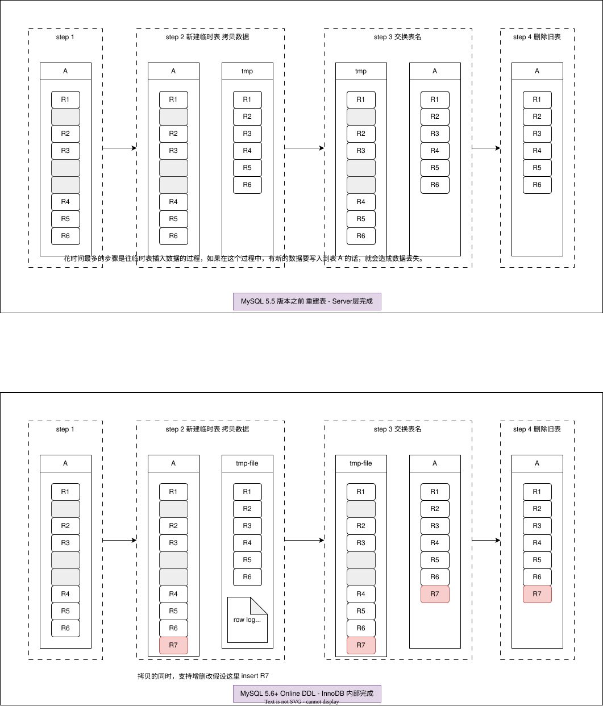

# 背景

Mysql 中每个 InnoDB 表数据存储在一个以 .ibd 为后缀的文件中。

当我们删除行数据，只是把这行记录标记为删除，在文章》》「[MySQL 表数据存储底层结构](./基础/MySQL表数据存储底层结构.md)」中有提到过 记录头信息里有一个字段 `delete_mask` 。当后面有新的插入时可以直接复用这个位置。磁盘的大小并不会缩小。

如果我们是按页删除的，也是这样，整个数据页就可以被复用。

这种设计的考量就相当于内存复用一样，可以避免新建再分配的 I/O。

如果一个大表有很多数据被删除，或页分裂，就会造成很多数据空洞，占用磁盘空间。

不止是删除数据会造成空洞，插入数据也会。如果数据是按照索引递增顺序插入的，那么索引是紧凑的。但如果数据是随机插入的，就可能造成索引的数据页分裂。

① 删除表记录，被删除的记录只是被标记删除，索引值所在的空间能被复用，但是没有真正的删除。

② 新增表记录，如果索引的值是随机分散的，那么会造成数据页的分裂，也会造成空洞

③ 更新索引上的值(非主键索引，如二级索引)，实际上是把旧值标记为删除，然后新增一个新值，旧值虽然能被复用，但是还是造成了空洞

经过大量增删改的表，都是可能是存在空洞的。所以，如果能够把这些空洞去掉，就能达到收缩表空间的目的。

重建表可以收缩空间，减小空洞！

# 重建表

你可以新建一个与表 A 结构相同的表 B，然后按照主键 ID 递增的顺序，把数据一行一行地从表 A 里读出来再插入到表 B 中。由于表 B 是新建的表，所以表 A 主键索引上的空洞，在表 B 中就都不存在了。显然地，表 B 的主键索引更紧凑，数据页的利用率也更高。如果我们把表 B 作为临时表，数据从表 A 导入表 B 的操作完成后，用表 B 替换 A，从效果上看，就起到了收缩表 A 空间的作用。

> 可以使用 alter table A engine=InnoDB 命令来重建表

在 MySQL 5.5 版本之前，这个命令的执行流程跟我们前面描述的差不多，区别只是这个临时表 B 不需要你自己创建，MySQL 会自动完成转存数据、交换表名、删除旧表的操作。



MySQL 5.6 版本开始引入的 Online DDL

重建表的流程：

1. 建立一个临时文件，扫描表 A 主键的所有数据页；
2. 用数据页中表 A 的记录生成 B+ 树，存储到临时文件中；
3. 生成临时文件的过程中，将所有对 A 的操作记录在一个日志文件（row log）中，对应的是图中 state2 的状态；
4. 临时文件生成后，将日志文件中的操作应用到临时文件，得到一个逻辑数据上与表 A 相同的数据文件，对应的就是图中 state3 的状态；
5. 用临时文件替换表 A 的数据文件。

> redis 的 AOF 重写也是 fork 一个子进程去重写, 同时主进程的命令写入重写缓冲区, 等子进程通知重写完毕后, 主进程将重写文件和缓冲区编成新的文件, 再替换原来的 AOF 文件. 这种增量复制的思想其实很多地方都有用到, 包括前面提到的 redis 主从复制, 也是开辟一个有限大的缓冲区解决某个子节点短暂断链的问题

上图中，由于日志文件记录和重放操作这个功能的存在，这个方案在重建表的过程中，允许对表 A 做增删改操作。

> Q: alter 语句不是会给表加 MDL 锁吗？

Online DDL 其实是会先获取 MDL 写锁, 再退化成 MDL 读锁；但 MDL 写锁持有时间比较短，所以可以称为 Online； 而 MDL 读锁，不阻止数据增删查改，但会阻止其它线程修改表结构；

那为什么不干脆直接解锁呢？为了保护自己，禁止其他线程对这个表同时做 DDL。

而对于一个大表来说，Online DDL 最耗时的过程就是拷贝数据到临时表的过程，这个步骤的执行期间可以接受增删改操作。所以，相对于整个 DDL 过程来说，锁的时间非常短。对业务来说，就可以认为是 Online 的。

需要补充说明的是，上述的这些重建方法都会扫描原表数据和构建临时文件。对于很大的表来说，这个操作是很消耗 IO 和 CPU 资源的。因此，如果是线上服务，你要很小心地控制操作时间。如果想要比较安全的操作的话，推荐使用 GitHub 开源的 gh-ost 来做。

# Online & inplace

在上图 5.5 版本的逻辑是把表 A 中的数据导出来的存放位置叫作 tmp_table。这是一个临时表，是在 server 层创建的。

在下图 5.6+版本的逻辑： 根据表 A 重建出来的数据是放在“tmp_file”里的，这个临时文件是 InnoDB 在内部创建出来的。整个 DDL 过程都在 InnoDB 内部完成。对于 server 层来说，没有把数据挪动到临时表，是一个“原地”操作，这就是“inplace”名称的来源。

> Q: 如果你有一个 1TB 的表，现在磁盘间是 1.2TB，能不能做一个 inplace 的 DDL 呢？

答案是不能。因为 tmp_file 也要占用临时空间。

重建表的这个语句 alter table t engine=InnoDB，其实隐含的意思是

```sql
alter table t engine=innodb,ALGORITHM=inplace;
```

跟 inplace 对应的就是拷贝表的方式了，用法是：

```sql
alter table t engine=innodb,ALGORITHM=copy;
```

当你使用 ALGORITHM=copy 的时候，表示的是强制拷贝表，对应的流程就是 5.5 版本的操作过程。

Online: 对表结构的 ddl 操作不影响对表数据的增删改查

inplace: 创建临时文件由 innodb 引擎层创建，而非 server 层，对 server 端无感知

# 问题

## 1. Truncate 会释放表空间吗

Truncate 相当于 drop+create

`TRUNCATE` 命令主要用于删除表中的所有数据

1. **数据删除** ：`TRUNCATE` 会把表内的所有数据快速删除，且不会逐行删除。
2. **释放空间** ：它会释放表所占用的数据页，将表空间恢复到初始状态。
3. **重置自增计数器** ：若表中有自增列，使用 `TRUNCATE` 后，自增计数器会重置为初始值（通常是 1）。
4. **不可回滚** ：`TRUNCATE` 属于 DDL（数据定义语言）操作，是不可回滚的，一旦执行，数据无法通过 `ROLLBACK` 语句恢复。

## 2. 重建表的时候如果没有数据更新，有没有可能产生页分裂和空洞

Online DDL 可以认为没有

## 3. Online DDL 过程，应用 row log 的过程会不会再次产生页分裂和空洞

可能会

## 4. 相对 Server 层没有新建临时表，就是 inplace，这里怎么判断是不是相对 Server 层没有新建临时表

怎么判断是不是相对 Server 层没有新建临时表。一个最直观的判断方法是看命令执行后影响的行数，没有新建临时表的话新建的行数是 0。

## 5. 一个表 t 文件大小 1TB，重建表后反而变大了？

对这个表执行 alter table t engine=InnoDB，发现执行完成后，空间不仅没变小，还稍微大了一点儿，比如变成了 1.01TB。

答：

本来就很紧凑，没能整出多少剩余空间。
重新收缩的过程中，页会按 90%满的比例来重新整理页数据（10%留给 UPDATE 使用），
未整理之前页已经占用 90%以上，收缩之后，文件就反而变大了。

在重建表的时候，InnoDB 不会把整张表占满，每个页留了 1/16 给后续的更新用。也就是说，其实重建表之后不是“最”紧凑的。

假如是这么一个过程：将表 t 重建一次；插入一部分数据，但是插入的这些数据，用掉了一部分的预留空间；这种情况下，再重建一次表 t，就可能会出现问题中的现象。

# 参考与延伸阅读

[MySQL · 社区动态 · Online DDL 工具 gh-ost 支持阿里云 RDS-阿里云开发者社区](https://developer.aliyun.com/article/594722)

[MySQL 之 Online DDL - 墨天轮](https://www.modb.pro/db/100527)

[Vitess | Online DDL strategies](https://vitess.io/docs/16.0/user-guides/schema-changes/ddl-strategies/)

[MySQL DDL 执行方式-Online DDL 介绍 - FreeBuf 网络安全行业门户](https://www.freebuf.com/news/345258.html)

[MySQL 8.0 Online DDL 和 pt-osc、gh-ost 深度对比分析](https://zhuanlan.zhihu.com/p/115277009)
