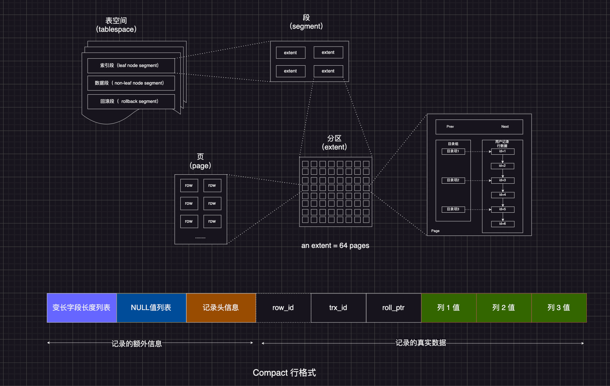

环境说明

MySQL 8.3

```shell
mysql --version
mysql  Ver 8.3.0 for macos14.2 on arm64 (Homebrew)
```

## 1. MySQL 的数据存放在哪个文件？

mysql 的数据是存在磁盘上的，存储的行为是由存储引擎实现的，mysql 支持多种存储引擎，不同的存储疫情保存的文件也不同。InnoDB 是我们常用的存储引擎，也是 mysql 默认的存储引擎。

怎么知道数据库的文件存储在什么目录？

> show variables like 'datadir';

```sql
mysql> show variables like 'datadir';
+---------------+--------------------------+
| Variable_name | Value                    |
+---------------+--------------------------+
| datadir       | /opt/homebrew/var/mysql/ |
+---------------+--------------------------+
1 row in set (0.04 sec)
```

没创建一个 database 数据库，都在在该目下生成一个以 database 为名的目录，表结构和表数据的文件都会放在这个目录下。

创建 my_test 数据库，并添加 t_user 表插入 3 条数据

```sql
CREATE TABLE `t_user` (
  `id` int(11) NOT NULL,
  `name` VARCHAR(20) DEFAULT NULL,
  `phone` VARCHAR(20) DEFAULT NULL,
  `age` int(11) DEFAULT NULL,
  PRIMARY KEY (`id`) USING BTREE
) ENGINE = InnoDB DEFAULT CHARACTER SET = ascii ROW_FORMAT = COMPACT;


insert into t_user (id, name, phone, age) values (1, 'a', '123', 18);
insert into t_user (id, name, phone) values (2, 'bb', '1234');
insert into t_user (id, name) values (3, 'ccc');

```

```sql
mysql> system ls -al /opt/homebrew/var/mysql/my_test
total 224
drwxr-x---   3 jonpan  admin      96  7 10 12:43 .
drwxr-xr-x  37 jonpan  admin    1184  7 10 12:41 ..
-rw-r-----   1 jonpan  admin  114688  7 10 12:45 t_user.ibd


```

在 mysql 8 之前 会有一个 t_user.frm 的文件来存储表的原数据，主要包含表结构的定义。在 MySQL 8.0 及更高版本中，InnoDB 存储引擎默认情况下不再使用 `.frm` 文件来存储表的元数据（表结构）。相反，表的元数据现在存储在 InnoDB 数据字典中。InnoDB 数据字典是一个内部的数据结构，存储在共享表空间（`ibdata` 文件）中，或者在表分区情况下存储在单个表空间（`.ibd` 文件）中.

> oracle 官方将 frm 文件的信息(Serialized Dictionary Information, SDI)写入到 ibd 文件内部

可以用 mysqll8 自带的工具 `ibd2sdi` 验证

> ibd2sdi --dump-file=my_test-t_user /opt/homebrew/var/mysql/my_test/t_user.ibd

详细参考：[MySQL 高级篇之第 02 章 MySQL 的数据目录 ](https://www.cnblogs.com/chenguanqin/p/16366307.html "发布于 2022-06-11 17:14")

表数据即可存在共享表空间文件(文件名 ibdata1)里，也可以存放在独占表空间文件（文件名：表明.ibd）。这个行为由参数 `innodb_file_per_table` 控制。若设置了参数 innodb_file_per_table 为 1，则会将存储的数据、索引等信息单独存储在一个独占表空间，从 MySQL 5.6.6 版本开始，它的默认值就是 1 了，因此从这个版本之后， MySQL 中每一张表的数据都存放在一个独立的 .ibd 文件。

## 2. 表空间文件的逻辑结构是什么样的？

表空间由段、区、页、行组成。InnoDB 的逻辑存储结构大概如下图



从下往上看

### 1. 行（row）

数据库表中的记录都是按行(row)进行存放的，每行记录根据不同的格式，有不同的存储结构

### 2. 页（page）

记录是按行存储，但是数据库的读取并不以「行」为单位，否则一次读取（也就是一次 I/O 操作）只能处理一行数据，效率会非常低。

因此，InnoDB 的数据是按「页」为单位来读写的，也就是说，当需要读一条记录的时候，并不是将这条行记录从磁盘读出来，而是以页为单位，将其整体读入内存。

**默认每个页的大小为 16KB**，也就是最多保证 16KB 的连续存储空间。

页是 InnoDB 存储引擎磁盘管理的最小单位，意味着数据库每次读写都是以 16KB 为单位的，一次最少从磁盘读取 16KB 的内容到内存中，一次最少把内存中的 16KB 内容刷新到磁盘中。

页的类型有很多，常见的有数据页，undo 日志页，溢出页等等。数据表中的行记录是用「数据页」来管理的，数据页的结构在另外一篇文章中详细说明。

### 3. 区（extent）

我们知道 InnoDB 存储引擎是用 B+树来组织数据的

B+树中每一层都是通过双向链表连接起来的，如果是以页为单位来分配存储空间，那么链表中相邻的两个页之间的物理位置并不是连续的，可能离得非常远，那么磁盘查询时就会有大量的随机 I/O。

解决这个问题也很简单，就是让链表中相邻页的物理位置页相邻，这样就可以使用顺序 I/O 了，那么在范围查询（扫描叶子节点）的时候效率就很高了。

为索引分配空间的时候按照区为单位，每个区的大小为 1MB，对于 16KB 的页来说，连续的 64 个页会被划分为一个区，这样就使得链表中相邻页的物理位置也相邻了，就能使用顺序 I/O 了。

### 4. 段（segment）

表空间是由各个段（segment）组成的，段由多个区组成。段一般分为数据段、索引段和回滚段等。

- 索引段：存放 B+树的非叶子节点的区的集合
- 数据段：存放 B+树的叶子节点的区的集合
- 回滚段：存放的是回滚数据的区的结合，事务隔离 MVCC 机制就是利用回滚段实现的多版本控制

# 3. InnoDB 行格式有哪些？

行格式（row_format），即一条记录的存储结构。

InnoDB 提供了 4 中行格式，Redundant、Compact、Dynamic 和 Compressed

- Redundant 是很古老的行格式了，MySQL5.0 版本之前用的格式，现在基本没人用了
- Compact：由于 Redundant 不是一种紧凑型的行格式，所以 MySQL5.0 之后引入了 Compact 行记录存储方式，Compact 是一种紧凑的行格式，设计的初衷就是为了让一个数据页中可以存放更多的行记录，从 MySQL5.1 版本之后，行格式默认设置成 Compact
- Dynamic 和 Compressed 两个都是基于 Compact 改进而来的。从 MySQL5.7 版本之后，默认使用 Dynamic 行格式

下文主要介绍 Compact 行格式，因为 Dynamic 和 Compressed 这两个行格式跟 Compact 非常像

# 4. Compact 行格式

一条行记录分为「记录的额外信息」和「记录的真实数据」两部分

## 4.1 记录的额外信息

### 4.1.1 变长字段长度列表

varchar(n)和 char(n)的区别，char 是定长，varchar 是变长的，变长字段实际存储的数据长度不固定。

所以在存储数据的时候，也要把数据占用的大小存起来，存到「变长字段长度列表」里，读取数据的时候才能根据这个属性去读取响应长度的数据。其他 Text，Blob 等变长字段也是这么实现的。

为了展示「变长字段长度列表」具体是怎么保存「变长字段的真实数据占用的字节数」，我们先创建这样一张表，字符集是 ascii（所以每一个字符占用的 1 字节），行格式是 Compact，t_user 表中 name 和 phone 字段都是变长字段：（上文段落 1 中有对应的建表语句）

```sql

mysql> select * from t_user;
+----+------+-------+------+
| id | name | phone | age  |
+----+------+-------+------+
|  1 | a    | 123   |   18 |
|  2 | bb   | 1234  | NULL |
|  3 | ccc  | NULL  | NULL |
+----+------+-------+------+
3 rows in set (0.01 sec)
```

接下来，我们看看这三条记录的行格式中的变长字段长度列表是怎么存储的。

先看第一条记录：

- name 列的值为 a，真是数据占用 1 个字节，十六进制 0x01
- phone 列的值为 123，真实数据占用 3 个字节，十六进制 0x03
- age 列和 id 列不是变长字段

这些变长字段的真实数据占用的字节数会按照列的顺序逆序存放。所以「变长字段长度列表」的内容是「03 01」。为什是逆序？

同样的道理，第二条记录的行格式中，「变长字段长度列表」里的内容是「04 02」

第三条记录中的 phone 列是 NULL，NULL 是不会存放在行格式中记录真实数据部分里的。所以「变长字段长度列表」里不需要保存值为 NULL 的变长字段的长度

> 为什么「变长字段长度列表」的信息要按照逆序存放？

这个设计是有想法的，主要是因为「记录头信息」中指向下一个记录的指针，指向的是下一条记录的「记录头信息」和「真实数据」之间的位置，这样的好处是向左读就是记录头信息，向右读就是真实数据，比较方便。

「**变长字段长度列表」中的信息之所以要逆序存放，是因为这样可以使得位置靠前的记录的真实数据和数据对应的字段长度信息可以同时在一个 CPU Cache Line 中，这样就可以提高 CPU Cache 的命中率。**

> 每个数据库表的行格式都有「变长字段字节数列表」？

变长字段长度列表不是必须的，当数据表没有变长字段的时候，比如全部是 int 类型的字段，这时候表里 的行格式就不会有「变长字段长度列表」。

### 4.1.2 NULL 值列表

表中的某些列可能会存储 NULL 值，如果把这些 NULL 值都放到记录的真实数据中会比较浪费空间，所以 Compact 行格式把这些值为 NULL 的列存在到 NULL 列表中。

如果存在允许 NULL 值的列，则每个列对应一个二进制位（bit），二进制位按照列的顺序逆序排列。

- 二进制位的值为 1 时，代表该列的值为 NULL
- 二进制为的值为 0 时，代表该列的值不为 NULL

另外，NULL 值列表必须用整数个字节的位表示(1 字节 8 位)，如果使用二进制位个数不足整数个字节，则在字节的高位补 0。

还是以 t_user 表的这三条记录作为例子：

先看第一条记录，第一条记录所有列都有值，不存在 NULL 值，所以用二进制来表示是酱紫的：


但是 InnoDB 是用整数字节的二进制位来表示 NULL 值列表的，现在不足 8 位，所以要在高位补 0，最终用二进制来表示是酱紫的：


所以对一第一条数据，NULL 值列表的十六进制表示是 0x00。

接下来看第二条记录，第二条记录 age 列是 NULL 值，所以对于第二条数据，NULL 值列表的十六进制表示是 0x04


最后第三条记录，第三条记录 phone 列 和 age 列是 NULL 值，所以，对于第三条数据，NULL 值列表用十六进制表示是 0x06。


> 每个数据库表的行格式都有「NULL 值列表」吗？

NULL 值列表也不是必须的。

当数据表的字段都定义成 NOT NULL 时，这时候表里的行格式就不会有 NULL 值列表了。

在设计数据库表字段的时候，通常都是建议将字段设置为 NOT NULL，这样可以至少节省 1 个字节的空间（NULL 列表至少占用 1 字节空间 ）

> 「NULL 值列表」是固定 1 字节空间吗？如果这样的话，一条记录有 9 个字段都是 NULL，这个时候怎么表示？

「NULL 值列表」的空间不是固定 1 字节的。

当一条记录有 9 个字段值都是 NULL，那么就会创建 2 字节空间的「NULL 值列表」，以此类推。

### 4.1.3 记录头信息

记录头信息中包含的内容很多，这里列几个比较重要的：

- delete_mask：标识此条数据是否被删除。从这里可以知道，我们执行 delete 的时候，并不会真正的删除记录，只是将这个记录的 delete_mark 标记为 1。这样做的目的是支持事务回滚。InnoDB 有一个后台线程会周期性地清理这些被标记为删除的行，以释放空间，这是一个自动的内部过程。对于 MyISAM 引擎，`delete` 操作会立即将数据行从表文件中物理删除，并将其空间标记为可用。
- next_record: 下一条记录的位置，从这里可以知道，记录与记录之间是通过双向链表连接的。在前面我也提到了，指向的是下一条记录的「记录头信息」和「真实数据」之间的位置，这样的好处是向左读就是记录头信息，向右读就是真实数据，比较方便。
- record_type: 表示当前记录的类型，0 表示普通记录，1 表示 B+树非叶子节点记录，2 表示最小记录，3 表示最大记录。最小和最大记录在页结构分析文章中会讲到。

# 5. 记录的真实数据

记录真实数据部分除了我们定义的字段，还有三个隐藏字段，分别为：row_id、trx_id、roll_pointer，

- row_id：如果我们建表的时候指定了主键或者唯一约束，那么就没有 row_id 隐藏字段了。如果没有指定主键，又没有唯一约束，InnoDB 会为记录添加 row_id 隐藏字段。所以说 row_id 不是必须的，自动添加的 row_iid，存在的话占用 6 个字节
- trx_id: 事务 id，表示这个数据是由那个事务生成的，trx_id 是必须的，占用 6 个字节
- roll_pointer： 记录上一个版本的指针。roll_pointer 是必须的，占用 7 个字节

trx_id 和 roll_pointer 的作用就是 MVCC 机制的实现关键数据

# 6. varchar(n)中 n 最大取值为多少？

**_MySQL 规定除了 TEXT、BLOBS 这种大对象类型之外，其他所有列（不包含隐藏列和记录投信息）占用的字节长度加起来不超过 65535 个字节。_**

也就是说，一行记录除了 TEXT、BLOBs 类型的列，限制最大为 65535 字节，注意是一行的总长度，不是一列。

varchar(n)字段类型的 n 代表的是最多存储的字符数量，并不是字节大小。

要算 varchar(n) 最大能允许存储的字节数，还要看数据库表的字符集，因为字符集代表着，1 个字符要占用多少字节，比如 ascii 字符集， 1 个字符占用 1 字节，那么 varchar(100) 意味着最大能允许存储 100 字节的数据。

## 单字段情况

假设数据库表只有 一个 varchar(n)类型的列且字符集是 ascii，在这种情况下，varchar(n)的最大取值是 65535 吗？

```sql
CREATE TABLE test (
`name` VARCHAR(65535)  NULL
) ENGINE = InnoDB DEFAULT CHARACTER SET = ascii ROW_FORMAT = COMPACT;
```

执行以上建表语句，直接就报错了

```sql
CREATE TABLE test (
    -> `name` VARCHAR(65535)  NULL
    -> ) ENGINE = InnoDB DEFAULT CHARACTER SET = ascii ROW_FORMAT = COMPACT;
ERROR 1118 (42000): Row size too large. The maximum row size for the used table type, not counting BLOBs, is 65535. This includes storage overhead, check the manual. You have to change some columns to TEXT or BLOBs
mysql>
```

从报错信息就可以知道 **一行数据的最大字节数是 65535（不包含 TEXT、BLOBs 这种大对象类型），其中包含了 storage overhead** 。

问题来了，这个 storage overhead 是什么呢？其实就是「变长字段长度列表」和 「NULL 值列表」，也就是说 **一行数据的最大字节数 65535，其实是包含「变长字段长度列表」和 「NULL 值列表」所占用的字节数的** 。所以， 我们在算 varchar(n) 中 n 最大值时，需要减去 storage overhead 占用的字节数。

当我们存储字段类型为 varchar(n)的数据时，其实分成了三个部分存储

- 真实数据
- 真实数据占用的字符数(变长字眼长度列表)
- NULL 标识，如果不允许为 NULL，这部分不需要

> 本次案例中「NULL 值列表，所占用的字节数是多少？

根据建表语句，name 字段是允许为 NULLL 的，所以会用 1 字节来表示 (整数值表示，不够 8 位高位补 0)

> 本次案例中「变长字段长度列表」所占用的字节数是多少？

「变长字段长度列表」所占用的字节数 = 所有「变长字段长度」占用的字节数只和

所以要先知道每个变长字段的长度需要用多少字节表示？具体情况分为：

- 条件一：如果变长字段允许存储的最大字节数小于等于 255 字节，就用 1 字节表示「变长字段长度」
- 条件二：如果变长字段允许存储的最大字节数大于 255 字节，就用 2 字节表示「变长字段长度」

我们这里字段类型是 varchar(65535)，字符集是 ascii，所以代表变长字段允许存储的最大字节数为 65535，复合条件二，所以会用 2 字节表示「变长字段长度」。

因此在数据库表只有一个 varchar(n)字段且字符集是 ascii 的情况下，varchar(n)中 n 的最大值= 65535 - 2 -1 = 65532。

进一步验证：

```sql
mysql> CREATE TABLE test (
    -> `name` VARCHAR(65532)  NULL
    -> ) ENGINE = InnoDB DEFAULT CHARACTER SET = ascii ROW_FORMAT = COMPACT;
Query OK, 0 rows affected (0.13 sec)
```

可以创建成功，说明推论是正确的。

当然，上面的列子是针对字符集为 ascii 的情况，如果采用的是 UTF-8，varchar(n)最多能存储的数据计算方式就不一样了。

在 utf-8 字符集下，一个字符最多需要三个字节，varchar(n)的最大取值就是 65532/3 = 21844。

## 多字段的情况

如果有多个字段，要保证所有字段的长度+变长字段字节数列表所占用的字节数+NULL 值列表所占用字节数 ≤65535

```sql
CREATE TABLE test (
`id` VARCHAR(255) NOT NULL,
`name` VARCHAR(65277) NOT NULL
) ENGINE = InnoDB DEFAULT CHARACTER SET = ascii ROW_FORMAT = COMPACT;

```

> 255(小于等于 255) -> 1 字节(变长长度)
> 65277(大于 255) -> 2 字节(变长长度)
>
> => 255 + 1 + 65277 + 2 = 65535

验证：

```sql
mysql> CREATE TABLE test2 (
    -> `id` VARCHAR(255) NOT NULL,
    -> `name` VARCHAR(65278) NOT NULL
    -> ) ENGINE = InnoDB DEFAULT CHARACTER SET = ascii ROW_FORMAT = COMPACT;
ERROR 1118 (42000): Row size too large. The maximum row size for the used table type, not counting BLOBs, is 65535. This includes storage overhead, check the manual. You have to change some columns to TEXT or BLOBs
```

## 行溢出后，MySQL 是怎么处理的？

MySQL 中磁盘和内存交互的基本单位是页，一个页大小一般是 16KB，也就是 16384 字节，而一个 varchar(n)类型的列最多可以存储 65532 字节(表单字段且字符集为 ascii 的情况下)，一些大对象如 TEXT，BLOB 可能存储更多的数据，这时一个页可能就存不了一条记录。这个时候就会发生行溢出，多的数据就会存到另外的「溢出页」中。

如果一个数据页存不了一条记录，InnoDB 存储引擎会自动将溢出的数据存储到「溢出页」中。在一般情况下，InnoDB 的数据都是存放在「数据页」中。

当发生行溢出时，在记录的真实数据处只会保存该列的一部分数据，而把剩余的数据放在「溢出页」中，然后真实数据处用 20 字节存储指向溢出页的地址，从而可以找到剩余数据所在页。


上图是 Compact 行格式溢出后的处理。

Compressed 和 Dynamic 这两个行格式和 Compact 非常类似，主要的区别在于处理行溢出数据时的不同

这两种格式采用完全的行溢出方式，记录的真实数据只存储 20 个字节的指针指向溢出页，实际的数据全部存储在溢出页中


# 7. 总结

> MySQL 的 NULL 值是怎么存放的？

> MySQL 怎么知道 varchar(n)实际占用数据的大小？

> varchar(n)中 n 的最大取值为多少？

> 行溢出后，MySQL 是怎么处理的？

# 8. 参考与延伸阅读

1. [执行一条 SQL 查询语句，期间发生了什么？](https://www.xiaolincoding.com/mysql/base/how_select.html)
2. [《小林 coding 图解 mysql》MySQL 一行记录是怎么存储的](https://www.xiaolincoding.com/mysql/base/row_format.html)
