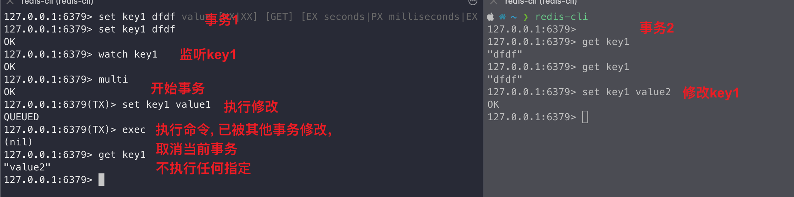

# 1. 原子性定义

通常意义上，我们说的原子性是指关系型[数据库](https://cloud.tencent.com/product/tencentdb-catalog?from_column=20065&from=20065)RDBMS（比如 **MySQL**）的原子性，也就是 ACID（Atomicity、Consistency、Isolation、Durability）中 Atomicity 这一项特性。

ACID 中的原子性指是：事务中的所有操作要么全部执行成功，要么全部失败回滚。

这里以银行转账这个生活实例来解释原子性：账户 A 给 账户 B 转账 100 元，原子性就是指账户 A 减去 100 元的同时，账户 B 必须增加 100 元，如果账户 A 减少 100 元，账户 B 没有增加 100 元，该操作就不具备原子性，需要进行回滚，将账户 A 减少的 100 元加回去。

## 2. Redis Lua 原子性怎么理解?

Lua 是一种功能强大、高效、轻量级、可嵌入的脚本语言。Lua 本身并没有提供对于原子性的直接支持，它只是一种脚本语言，通常是嵌入到其他宿主程序中运行，比如 Redis。

> **在 Redis 中，执行 Lua 脚本的原子性是指：整个 Lua 脚本在执行期间，不会被其他客户端的命令打断。**
>
> 整个 luaScript 字符串脚本作为一个整体被执行且不被其他事务打断，这就是一个原子性的操作。
>
> 至于 Lua 脚本里面的命令是否必须全部成功，或者全部失败，并不要求

# 3. Redis 事务

Redis 事务可以一次执行多个命令， 并且带有以下三个重要的特性：

- 批量操作在发送 EXEC 命令前被放入队列缓存。
- 收到 EXEC 命令后进入事务执行，事务中任意命令执行失败，其余的命令依然被执行。
- 在事务执行过程，其他客户端提交的命令请求不会插入到事务执行命令序列中。

一个事务从开始到执行会经历以下三个阶段：

- 开始事务。
- 命令入队。
- 执行事务。

单个 Redis 命令的执行是原子性的，但 Redis 没有在事务上增加任何维持原子性的机制，所以 Redis 事务的执行并不是原子性的。

Redis 事务可以理解为一个打包的批量执行脚本，但批量指令并非原子化的操作，中间某条指令的失败不会导致前面已做指令的回滚，也不会造成后续的指令不做。

> **这是官网上的说明 From redis docs on [transactions](http://redis.io/topics/transactions):**
>
> It's important to note that even when a command fails, all the other commands in the queue are processed – Redis will not stop the processing of commands.

## WATCH & DISCARD

DISCARD 和 WATCH 也是 Redis 中用于事务的两个命令，它们与 MULTI 和 EXEC 一起使用，提供更复杂的事务处理机制。

WATCH 命令用于监听一个或多个 Key，如果在执行事务期间这些 Key 中任何一个 Key 的 value 被其他事务修改，当前整个事务将会被中止。（需要注意：低于 6.0.9 的 Redis 版本，Key 过期不会中止事务）



Redis 的事务由 MULTI/EXEC 两个命令完成，WATCH/DISCARD 两个命令的加持，给 Redis 事务提供了 CAS 乐观锁机制。Redis 事务不支持回滚，它和关系型数据库（比如 MySQL）的事务（ACID）是不一样的。

# 执行 lua 案例

```go
package main

import (
    "context"
    "fmt"
    "github.com/go-redis/redis/v8"
)

func main() {
    // 创建 Redis 客户端
    rdb := redis.NewClient(&redis.Options{
        Addr:     "localhost:6379",
        Password: "", // no password set
        DB:       0,  // use default DB
    })

    ctx := context.Background()

    // 设置初始值
    err := rdb.Set(ctx, "stock", 5, 0).Err()
    if err != nil {
        panic(err)
    }

    // 定义 Lua 脚本
    luaScript := `
        local current = redis.call("GET", KEYS[1])
        if tonumber(current) > 0 then
            redis.call("DECR", KEYS[1])
            return 1
        else
            return 0
        end
    `

    // 使用 redis.NewScript 创建脚本对象
    script := redis.NewScript(luaScript)

    // 执行 Lua 脚本
    result, err := script.Run(ctx, rdb, []string{"stock"}, nil).Result()
    if err != nil {
        panic(err)
    }

    // 输出结果
    fmt.Println("Lua script result:", result) // 应该输出 1
}
```

redis.call() 用于执行 Redis 的命令。当命令执行出错时，会阻断整个脚本执行，并将错误信息返回给客户端。

redis.pcall() 也用于执行 Redis 的命令。当命令执行出错时，不会阻断脚本的执行，而是内部捕获错误，并继续执行后续的命令。

# 为什需要 lua?

既然 redis 事务能保证原性，为什么还需要 lua 脚本呢？

1. Lua 脚本一般比 MuLTI/EXEC 更快、更简单
2. Redis 事务中，事务队列中的所有命令都是在 EXEC 命令执行才会被执行，对于多个命令之间存在依赖关系，比如后面的命令需要依赖上一个命令的结果的场景，Redis 事务无法满足，因此 Lua 脚本更适合复杂场景
3. Redis 能做到的 Lua 能做，Redis 事务做不到的 Lua 也能做

# **Lua 注意事项**

Redis 执行 Lua 脚本时，Lua 的编写需要注意以下几个点：

1. 不要在 Lua 脚本中使用阻塞命令（如 BLPOP、BRPOP 等）。因此这些命令可能会导致 Redis 服务器在执行脚本期间被阻塞，无法处理其他请求；
2. 不要编写过长的 Lua 脚本。因为 Redis 读写命令是单线程，过长的脚本，加载，解析，运行会比较耗时，导致其他命令的延迟延迟增加；
3. 不要在 Lua 脚本中进行复杂耗时的逻辑；因为 Redis 读写命令是单线程的，长时间运行脚本可能导致其他命令的延迟增加；
4. Lua 脚本中，需要注意区分 redis.call() 和 redis.pcall() 命令；
5. Lua 索引表从索引 1 开始，而不是 0；

> 综上，redis+lua 的原子性其实不大准确，叫排他性可能更准确些

# 参考与延伸阅读

1. [Redis 执行 Lua，能保证原子性吗？](https://cloud.tencent.com/developer/article/2391645)
