# 学习资料

1. [代码随想录-carl](https://www.bilibili.com/video/BV1XS4y1p7qj)
2. [0x3f-灵神](https://www.bilibili.com/video/BV1bM411X72E)
3. [数据结构基础](https://menghaoguo.com/Data_Structure_with_Python_book/index.html)
4. [慕课-波波老师](https://www.bilibili.com/video/BV1Ap4y1s7Jv)

# 1. [寻找两个正序数组的中位数](https://leetcode.cn/problems/median-of-two-sorted-arrays/)

前提：有序数组

不需要把两个数组真的合并排序，而是通过“每次排除一部分不可能的答案”，一步步逼近中位数的位置。这就是为什么时间复杂度可以做到 O(log(m+n))。

每次排除一部分不可能是答案的数字时，就让 k 减去这部分数量，表示我们在更小的范围内继续寻找“新的第 k 小”元素。这就像不断缩小搜索范围的“猜数字游戏”。

## 🧠 想象一个场景（类比理解）：

你和朋友比赛猜数字：
你们每人手里都有一张排好序的卡片（数组），你想找出所有卡片中第 6 小的数字。

你可以这样想：

- 我们每人先各看一半（比如前 3 张）
- 如果你发现你的第 3 张卡片比朋友的大 → 那说明你这张卡片前面的那几张一定不是第 6 小的数
- 所以你可以把它们丢掉，缩小搜索范围

这就是这个算法的核心思想！

# [283. 移动零](https://leetcode.cn/problems/move-zeroes/)

1. 原地栈思想
   相当于重新分配位置，将非 0 的数据从新在原地栈里放置，剩下的位置都赋值为 0
   时间复杂度 O(n)，空间复杂度 O(1)

```python
class Solution:
    def moveZeroes(self, nums: List[int]) -> None:
        """
        Do not return anything, modify nums in-place instead.
        """
        stack_size = 0
        for n in nums:
            if n != 0:
                nums[stack_size] = n
                stack_size+=1

        for i in range(stack_size, len(nums)):
            nums[i] = 0
```

1. 快慢指针

   方法一在全为 0 的情况下需要遍历两次，能不能只遍历一次就解决？

```py
class Solution:
    def moveZeroes(self, nums: List[int]) -> None:
        """
        Do not return anything, modify nums in-place instead.
        """
        fast, low = 0, 0
        while fast < len(nums):
	    fast+=1
            if nums[fast] == 0:
                continue

            nums[low],nums[fast]= nums[fast], nums[low]
            low+=1
```

    一个指针指向 0 的位置，一个指针指向非 0 的位置，然后将两者数据逐一交换，始终保持零空位在左边，就能保证原数组顺序不变

```python
class Solution:
    def moveZeroes(self, nums: List[int]) -> None:
        """
        Do not return anything, modify nums in-place instead.
        """
        i0 = 0
        for i in range(len(nums)):
            if nums[i]:
                nums[i], nums[i0] = nums[i0], nums[i]
                i0+=1
```

# [167. 两数之和 II - 输入有序数组](https://leetcode.cn/problems/two-sum-ii-input-array-is-sorted/)

前提：有序数组，利用有序数组的性质，两数字和的大小，排除不符合条件的数据，逐渐逼近目标值

相向双指针

```python
class Solution:
    def twoSum(self, numbers: List[int], target: int) -> List[int]:
        # 时间复杂度 O(n)
        # 空间复杂度 O(1)
        left, right = 0, len(numbers) - 1
        while left < right:
            s = numbers[left] + numbers[right]
            if s == target:
                break

            if s > target:
                # 由于数组有序，说明left之后的所有数+right都大于target
                # 所以排除right
                right -= 1
            else:
                left += 1

        return [left+1, right+1]
```

# [15. 三数之和](https://leetcode.cn/problems/3sum/)

思路：先排序，排序后，枚举 nums[i]，从剩下的 j->k 找到 target (-nums[i]), 即两数之和的思路，相向双指针，输出的顺序和三元组的顺序并不重要，所以去重就和前一个枚举数对比就好了(内外循环都要去重)

```python
class Solution:
    def threeSum(self, nums: List[int]) -> List[List[int]]:
        # 时间复杂度 O(n^2)
        # 空间复杂度 O(1)
        nums.sort()
        ans = []
        n = len(nums)
        for i in range(n - 2):
            x = nums[i]

            # 输出的顺序和三元组的顺序不重要，所以直接判断去重，计算一个最后一个就可以了
            if i > 0 and x == nums[i-1]:
                continue

            # 有序的特性，前面几个数加起来都大于零了，后面肯定没有=0的
            if x+nums[i+1]+nums[i+2] > 0:
                break

            # 有序特性，第一个加后两个已经小于零了，就要往后找，才能找到可能相加等于0的
            if x + nums[-2] + nums[-1] < 0:
                continue

            # 开始两数之和的相向双指针
            j = i+1
            k = n-1
            while j < k:
                s = x + nums[j] + nums[k]
                if s > 0:
                    # 说明大的太大 左移
                    k -= 1
                elif s < 0:
                    # 说明小的太小 右移
                    j += 1
                else:
                    # 找到了
                    ans.append([x, nums[j], nums[k]])
                    # 继续找下一个，内层的相向双指针也要去重，避免找到重复的
                    j += 1
                    while j < k and nums[j] == nums[j - 1]:
                        j += 1

                    k -= 1
                    while k > j and nums[k] == nums[k + 1]:
                        k -= 1


        return ans
```

# [11. 盛最多水的容器](https://leetcode.cn/problems/container-with-most-water/)

贪心算法

首先明确水的容量由长度和高度决定，高度最短的那条 x 两条线之间距离

所以就可以用相向双指针，逐步逼近，然后每次计算取最大值，当两个指针相遇是退出

```python
class Solution:
    def maxArea(self, height: List[int]) -> int:
        # 时间复杂度 O(n)
        # 空间复杂度 O(1)
        left, right = 0, len(height) - 1
        ans = 0
        while left < right:
            l, r = height[left], height[right]
            ans = max(ans, (right - left) * min(l, r))
            if l < r:
                left+=1
            else:
                right-=1

        return ans
```

# [42. 接雨水](https://leetcode.cn/problems/trapping-rain-water/)

```python
class Solution:
    def trap(self, height: List[int]) -> int:
        # 时间复杂度 O(n)
        # 空间复杂度 O(1)
        ans = 0
        left, right = 0, len(height) - 1
        pre_max, suf_max = 0, 0
        while left <= right:
            # 计算前缀最大值
            pre_max = max(pre_max, height[left])
            # 计算后缀最大值
            suf_max = max(suf_max, height[right])
            # 如果前缀小于后缀 往左移
            if pre_max < suf_max:
                # 前缀最大值-高度=可接水量
                ans += pre_max - height[left]
                left += 1
            else:
            # 否则往右移
                # 后缀最大值-高度=可接水量
                ans += suf_max - height[right]
                right -= 1

        return ans
```

前缀最大值，后缀最大值的最小值(左右边，比最短边高水都会溢出)，减去底座高度 所有结果相加就是可承接的容量

所以用相向双指针来计算，那边小统计那边的

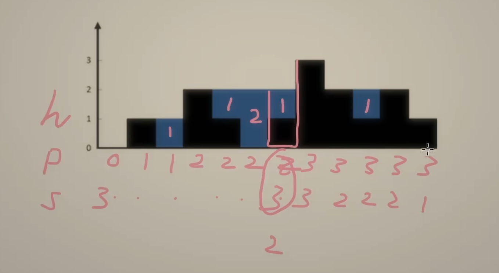

# [209. 长度最小的子数组](https://leetcode.cn/problems/minimum-size-subarray-sum/)


[0x3f-讲解-滑动窗口-单调性](https://www.bilibili.com/video/BV1hd4y1r7Gq)

```python
class Solution:
    def minSubArrayLen(self, target: int, nums: List[int]) -> int:
        # 时间复杂度 O(n)
        # 空间复杂度 O(1)
        # 假设长度为n, 方便后面去min
        n = len(nums)
        # 答案最大是n, 方案后面取min, 且跟ans=n时区分开，所以假设为n+1, 只要比n大就行
        ans = n+1
        s = 0
        left = 0
        # 枚举数组的右边数值
        for right, x in enumerate(nums):
            s += x
            # 我们要找长度最小的
            # 所以 如果s-左端点还是大于target，且由于都是正整数，所以排除掉左端点继续向右看，知道不符合条件，那么end-start+1就是当前找到最小的，然后继续外层for
            # 为什么这里的left 就当成下一轮查找的start了，因为题目要求是连续的
            while s >= target:
                # 这里right-left+1为什么要加1，结果统计的是长度，是整数，代码是从0开始的，0,1,2,3 3-0=3，其实是4个
                ans = min(ans, right-left+1)
                s -= nums[left]
                left += 1

        return ans if ans <= n else 0
```

# [713. 乘积小于 K 的子数组](https://leetcode.cn/problems/subarray-product-less-than-k/)

跟上提一样，用快慢指针，逐步逼近，找严格小于 k 的连续子数组

```python
class Solution:
    def numSubarrayProductLessThanK(self, nums: List[int], k: int) -> int:
        # 题目声明是整数数组，当目标是0的时候，直接return 0
        if k <= 1:
            return 0

        # 增量计算有效子数组个数-》r-l+1
        left = 0
        ans = 0
        prod = 1
        for right, x in enumerate(nums):
            prod *= x
            while prod >= k:
                prod /= nums[left]
                left += 1

            ans += right - left + 1

        return ans
```

> 如何计算 增量 子数组数量是个难点，首先我们看看窗口内的子数组怎么“数”的问题，比如数组[1,2,3,4]，当前窗口[1,2,3]。
>
> 我们全量数一次窗口内的子数组: [1], [1,2], [1,2,3], [2], [2,3], [3], 一共 6 个，当 right 右移后，窗口变成[1,2,3,4]，这时如果我们再进行“全量数”，上一个窗口[1,2,3]就被重复计算了。
>
> 为了消除这种重复，我们需要使用“增量数”，从右向左看，right 右移后，窗口新增一个元素，会新增哪些子数组？
>
> 例如[1,2,3] -> [1,2,3,4] 窗口内新增一个元素 4 时，新增的子数组肯定要包含 4，以 4 为右端点，新增的子数组是[4],[3,4],[2,3,4],[1,2,3,4]， 一共 4 个，这个增量就是窗口大小 right-left+1。

# [3. 无重复字符的最长子串](https://leetcode.cn/problems/longest-substring-without-repeating-characters/)

思路：同向双指针

```python
class Solution:
    def lengthOfLongestSubstring(self, s: str) -> int:
        ans = 0
        # 同向双指针，原理跟 713,209题目一样，找最长连续子串
        # 在原字符串中迭代，快指针找到重复的目标值，然后慢指针内循环知道不重复的位置计算right-left+1 取最长
        hashmap = defaultdict(int)
        left = 0
        for right, x in enumerate(s):
            hashmap[x]+=1
            while hashmap[x] > 1:
                hashmap[s[left]] -= 1
                left += 1

            ans = max(ans, right-left+1)

        return ans
```

# [438. 找到字符串中所有字母异位词](https://leetcode.cn/problems/find-all-anagrams-in-a-string/)

思路：定长滑动窗口

```python
class Solution:
    def findAnagrams(self, s: str, p: str) -> List[int]:
        # 同向双指针，找到等量字符, 收集字母出现次数相同的起点index
        ans = []
        """
        >>> from collections import Counter
        >>> Counter('dfddf')
        Counter({'d': 3, 'f': 2})
        """
        cnt_p = Counter(p) # 统计p的没中字母出现的次数
        cnt_s = Counter()  # 统计s中长为len(p)的子串 的没中字母的出现次数
        for right, c in enumerate(s):
            cnt_s[c] += 1
            left = right - len(p) + 1
            if left < 0:
                # 表示窗口长度不足 len(p)
                continue
            if cnt_s == cnt_p:
                # 子串和目标子串的字母出现次数相同
                ans.append(left)
            cnt_s[s[left]] -= 1  # 左边的字母离开窗口，继续找下一个窗口

        return ans

```

# [1456. 定长子串中元音的最大数目](https://leetcode.cn/problems/maximum-number-of-vowels-in-a-substring-of-given-length/)

# [1. 两数之和](https://leetcode.cn/problems/two-sum/)

思路：哈希表+枚举

```python
class Solution:
    def twoSum(self, nums: List[int], target: int) -> List[int]:
       d = dict()
       # 枚举右，寻找左」
       for i, x in enumerate(nums):
            a = target - x
            if a in d:
                return [d[a], i]
            d[x] = i
```

# [303. 区域和检索 - 数组不可变](https://leetcode.cn/problems/range-sum-query-immutable/)

思路：前缀和

> 本文中的「子数组」均表示「连续子数组」。
>
> 比如 nums=[1,2,3,4,5,6]，要想计算子数组 [3,4,5] 的元素和，可以用前缀 [1,2,3,4,5] 的元素和，减去另一个前缀 [1,2] 的元素和，就得到了子数组 [3,4,5] 的元素和，即
> 3+4+5=(1+2+3+4+5)−(1+2)
>
> 换句话说，把前缀 [1,2,3,4,5] 的前缀 [1,2] 去掉，就得到了子数组 [3,4,5]。
>
> 一般地，任意子数组都是一个前缀去掉前缀后的结果。所以任意子数组的和，都可以表示为两个前缀和的差。
>
> 作者：灵茶山艾府
> 链接：https://leetcode.cn/problems/range-sum-query-immutable/solutions/2693498/qian-zhui-he-ji-qi-kuo-zhan-fu-ti-dan-py-vaar/

```python
class NumArray:

    def __init__(self, nums: List[int]):
        s = [0] * (len(nums)+1)
        # 计算前缀和
        for i, x in enumerate(nums):
            s[i+1] = s[i] + x
        self.s = s

    def sumRange(self, left: int, right: int) -> int:
        return self.s[right+1] - self.s[left]
```

# [560. 和为 K 的子数组](https://leetcode.cn/problems/subarray-sum-equals-k/)

觉得这个视频讲的还不错 可以参考下 [跳转 b 站](https://leetcode.cn/link/?target=https%3A%2F%2Fwww.bilibili.com%2Fvideo%2FBV1gN411E7Zx%2F%3Fspm_id_from%3D333.337.search-card.all.click%26vd_source%3Db5cc04f324fc9d6ee48a5febd77392fc)

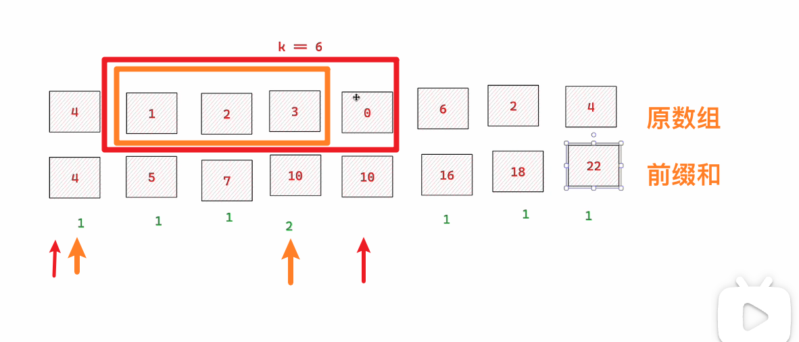

橙色部分：10-6=4 在前缀和 hash 表中，即 1,2,3 (4+1+2+3)-(4)

红色部分：10-6=4 在前缀和 hash 表中，即 1,2,3,0. (4+1+2+3+0) - (4)

```python
class Solution:
    def subarraySum(self, nums: List[int], k: int) -> int:
        # 边计算前缀和，边统计前缀和出现的次数
        # 初始化一个前缀和为0的
        count = defaultdict(int)
        count[0] = 1
        ans = 0
        pre_sum=0
        for i, n in enumerate(nums):
            pre_sum += n
            if pre_sum-k in count:
                ans += count[pre_sum-k]

            count[pre_sum]+=1

        return ans
```

# [203. 移除链表元素](https://leetcode.cn/problems/remove-linked-list-elements/)

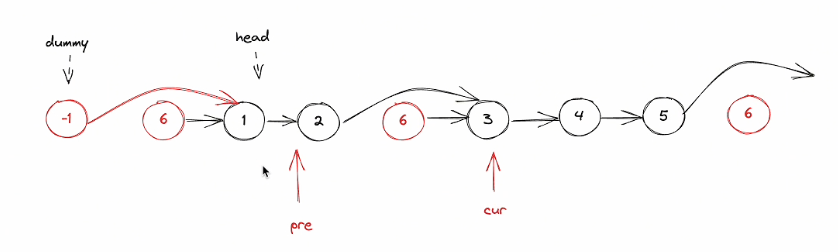

> https://www.bilibili.com/video/BV1a14y1k7rt

```python
# Definition for singly-linked list.
# class ListNode:
#     def __init__(self, val=0, next=None):
#         self.val = val
#         self.next = next
class Solution:
    def removeElements(self, head: Optional[ListNode], val: int) -> Optional[ListNode]:
        # 临界条件
        if not head:
            return head

        # 引入虚拟头节点，方便记录如果移除的是头节点，有人来接盘
        cur = dummy = ListNode(next=head)
        while cur.next:
            if cur.next.val == val:
                cur.next = cur.next.next
            else:
                cur = cur.next
        return dummy.next
```

# [237. 删除链表中的节点](https://leetcode.cn/problems/delete-node-in-a-linked-list/)


给定一个待删除节点，不知道头节点，要求删除给定的节点，剩下的节点不变

变通一下，把下一个节点的值 copy 过来，然后删除下一个节点

```python
# Definition for singly-linked list.
# class ListNode:
#     def __init__(self, x):
#         self.val = x
#         self.next = None

class Solution:
    def deleteNode(self, node):
        """
        :type node: ListNode
        :rtype: void Do not return anything, modify node in-place instead.
        """
        # 把下一个节点的值copy到当前节点，然后删除下一个节点
        node.val = node.next.val
        node.next = node.next.next
```

# [19. 删除链表的倒数第 N 个结点](https://leetcode.cn/problems/remove-nth-node-from-end-of-list/)


1. 先遍历链表得到数组长度，然后遍历到 l-n 的节点，如果就是 5-2=3 第三个节点，3.next=3.next.next
2. 快慢指针，快慢指针中间的距离始终保持 n，当快指针指向最后是，慢指针刚好到达 n+1

```python
# Definition for singly-linked list.
# class ListNode:
#     def __init__(self, val=0, next=None):
#         self.val = val
#         self.next = next
class Solution:
    def removeNthFromEnd(self, head: Optional[ListNode], n: int) -> Optional[ListNode]:
        dummy = ListNode(next=head)
        right = dummy
        # 快指针先走n步
        for _ in range(n):
            right = right.next

        left = dummy
        # 接着快慢指针一起走, 知道快指针结束
        while right.next:
            left = left.next
            right = right.next

        left.next = left.next.next

        return dummy.next
```

# [83. 删除排序链表中的重复元素](https://leetcode.cn/problems/remove-duplicates-from-sorted-list/)

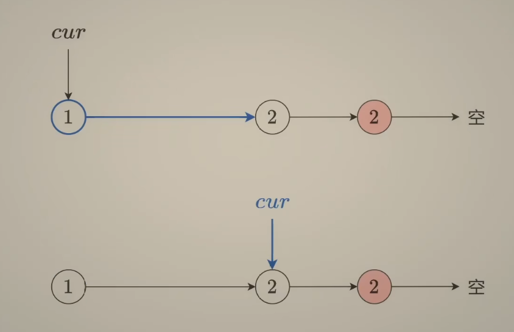

单指针逐个循环 判断 cur.next.val == cur.val 如果不相等，cur 右移

```python
# Definition for singly-linked list.
# class ListNode:
#     def __init__(self, val=0, next=None):
#         self.val = val
#         self.next = next
class Solution:
    def deleteDuplicates(self, head: Optional[ListNode]) -> Optional[ListNode]:
        # 链表中节点数目在范围 [0, 300] 内
        # 特判链表为空的情况
        if not head:
            return head

        cur = head

        while cur.next:
            if cur.next.val == cur.val:
                cur.next = cur.next.next
            else:
                cur = cur.next

        return head

```

# [82. 删除排序链表中的重复元素 II](https://leetcode.cn/problems/remove-duplicates-from-sorted-list-ii/)

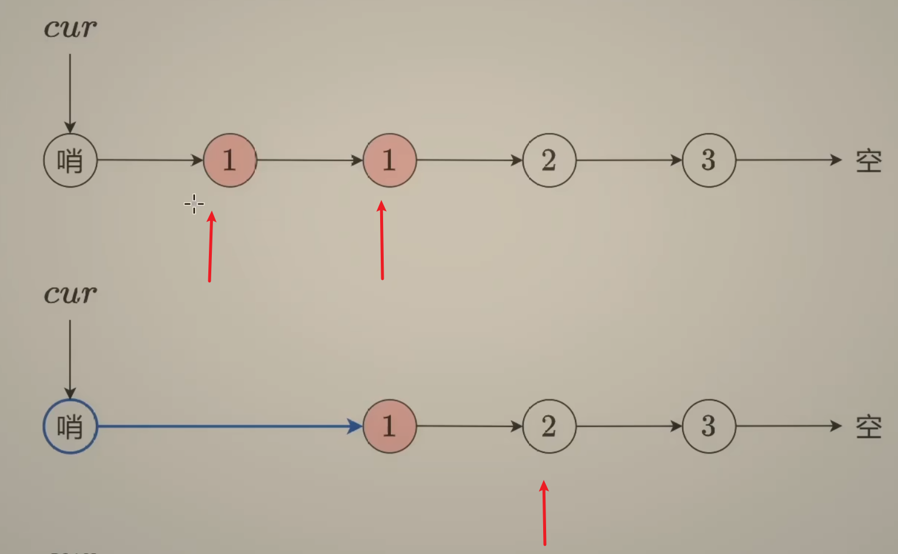

```python
# Definition for singly-linked list.
# class ListNode:
#     def __init__(self, val=0, next=None):
#         self.val = val
#         self.next = next
class Solution:
    def deleteDuplicates(self, head: Optional[ListNode]) -> Optional[ListNode]:
        dummy = ListNode(next=head)
        cur = dummy

        # 删除重复的节点，因为cur是dummy，就要判断下一节点和下下个节点
        while cur.next and cur.next.next:
            val = cur.next.val
            if cur.next.next.val == val:
                # 不断右移删除重复的元素，知道没有重复的，然后移动cur到下一个非重复的继续判断下一个窗口的重复值
                while cur.next and cur.next.val == val:
                    cur.next = cur.next.next
            else:
                cur = cur.next

        return dummy.next
```

# [206. 反转链表](https://leetcode.cn/problems/reverse-linked-list/)

```python
# Definition for singly-linked list.
# class ListNode:
#     def __init__(self, val=0, next=None):
#         self.val = val
#         self.next = next
class Solution:
    def reverseList(self, head: Optional[ListNode]) -> Optional[ListNode]:
        pre = None
        cur = head
        while cur:
            # 记录下一个几点
            nxt = cur.next
            # 将当前节点的next指向前一个节点
            cur.next = pre
            # 将pre指向cur
            pre = cur
            cur = nxt
        return pre
```

# [92. 反转链表 II](https://leetcode.cn/problems/reverse-linked-list-ii/)

```python
# Definition for singly-linked list.
# class ListNode:
#     def __init__(self, val=0, next=None):
#         self.val = val
#         self.next = next
class Solution:
    def reverseBetween(self, head: Optional[ListNode], left: int, right: int) -> Optional[ListNode]:
        dummy = ListNode(next=head)
        p0 = dummy

        # 原理，在小范围内，执行链表反转的逻辑 206题目
        # 找到left的起始位置的上一个节点，开始执行链表反转
        # 这里为什么要left-1, 看图更容易理解，我们要记住反转链表的上一个位置，当链表反转后，原来上一个位置的.next.next指向原来尾部，p0.next指向反转后的头
        for _ in range(left-1):
            p0 = p0.next

        pre = None
        cur = p0.next
        # 执行链表反转流程
        for _ in range(right-left+1):
            nxt = cur.next
            cur.next = pre
            pre = cur
            cur = nxt

        # 将p0
        p0.next.next = cur
        p0.next = pre

        return dummy.next
```

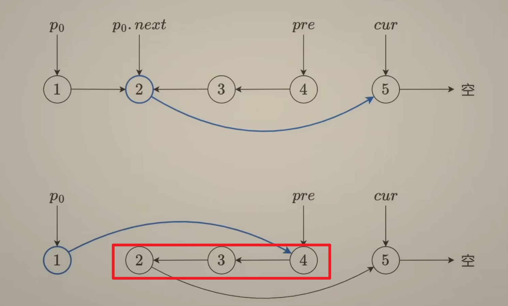

# [25. K 个一组翻转链表](https://leetcode.cn/problems/reverse-nodes-in-k-group/)

跟上题一样，只是这题是要计算组内的 k 个，不断循环，所以要找出退出循环的条件，以及记住下一次循环的起点

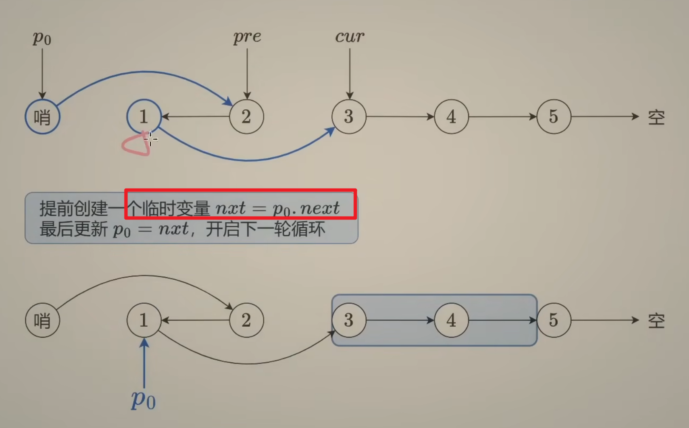

```python
# Definition for singly-linked list.
# class ListNode:
#     def __init__(self, val=0, next=None):
#         self.val = val
#         self.next = next
class Solution:
    def reverseKGroup(self, head: Optional[ListNode], k: int) -> Optional[ListNode]:
        # 先计算链表的长度，才能知道什么时候退出循环
        s = 0
        cur = head
        while cur:
            s+=1
            cur = cur.next

        # 每k个做组内链表反转
        dummy = ListNode(next=head)
        p0 = dummy
        pre = None
        cur = p0.next

        while s >= k:
            s -= k
            # 执行链表反转流程
            for _ in range(k):
                nxt = cur.next
                cur.next = pre
                pre = cur
                cur = nxt

            # 将p0
            nxt = p0.next
            p0.next.next = cur
            p0.next = pre
            p0 = nxt

        return dummy.next
```

# [876. 链表的中间结点](https://leetcode.cn/problems/middle-of-the-linked-list/)

思路：快慢指针，每次循环快指针走 2 步，慢指针走一步

当为奇数时，f 指向最后一个节点 f.next = None，l 指向中间节点

当为偶数时，f 指向 None l 指向中间节点

```python
    1  ->  2  ->  3  ->  4  ->  5

    f/l
           l      f
                  l             f

    1 -> 2 ->  3  ->  4  ->  5  ->  6
    f/l
         l     f
               l             f
                      l                  f
```

```python
# Definition for singly-linked list.
# class ListNode:
#     def __init__(self, val=0, next=None):
#         self.val = val
#         self.next = next
class Solution:
    def middleNode(self, head: Optional[ListNode]) -> Optional[ListNode]:
        fast, slow = head, head
        while fast and fast.next:
            fast = fast.next.next
            slow = slow.next

        return slow
```

# [141. 环形链表](https://leetcode.cn/problems/linked-list-cycle/)

判断是否有环：根据快慢指针相对速度，最终能遇上的结论，快指针走 2 步，慢指针走 1 步

```python
    1  ->  2  ->  3  ->  4  ->  5  -> 3

    f/l
           l      f
                  l             f
                         lf --> 有环
```

```python
# Definition for singly-linked list.
# class ListNode:
#     def __init__(self, x):
#         self.val = x
#         self.next = None

class Solution:
    def hasCycle(self, head: Optional[ListNode]) -> bool:
        fast, slow = head, head
        while fast and fast.next:
            fast = fast.next.next
            slow = slow.next
            if fast == slow:
                return True

        return False
```

# [142. 环形链表 II](https://leetcode.cn/problems/linked-list-cycle-ii/)

## 判断有环还要找到环的头，简单做法，哈希表

```python
# Definition for singly-linked list.
# class ListNode:
#     def __init__(self, x):
#         self.val = x
#         self.next = None

class Solution:
    def detectCycle(self, head: Optional[ListNode]) -> Optional[ListNode]:
        hashset = set()
        cur = head
        while cur:
            if cur in hashset:
                return cur
            hashset.add(cur)
            cur = cur.next


```

## 解放 2：快慢指针

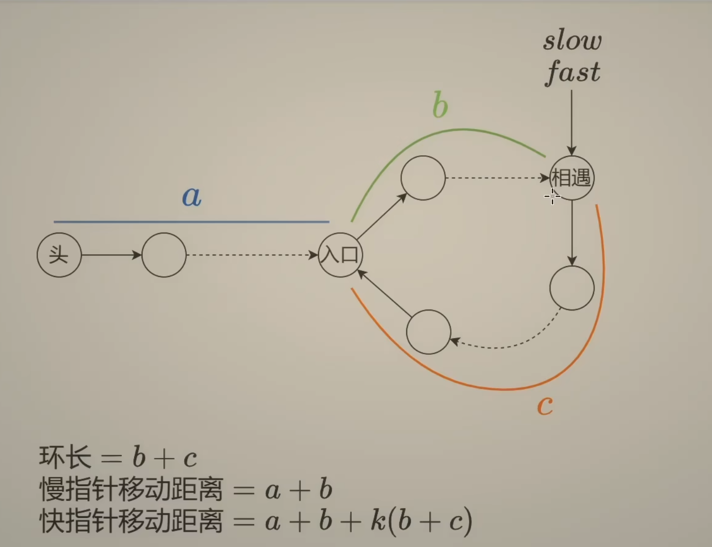

为什么是 k(b+c)？

因为快慢指针相遇，快指针可能已经走了好几圈，假设最坏的情况，当慢指针进入环的时候，快指针刚好在慢指针前面，假设最快相遇只要一步，slow+1 = fast 绕一圈-1，所以对于其他情况，快指针移动的举例都会小于 环长-1。所以快慢指针相遇时，慢指针移动的举例小于环长

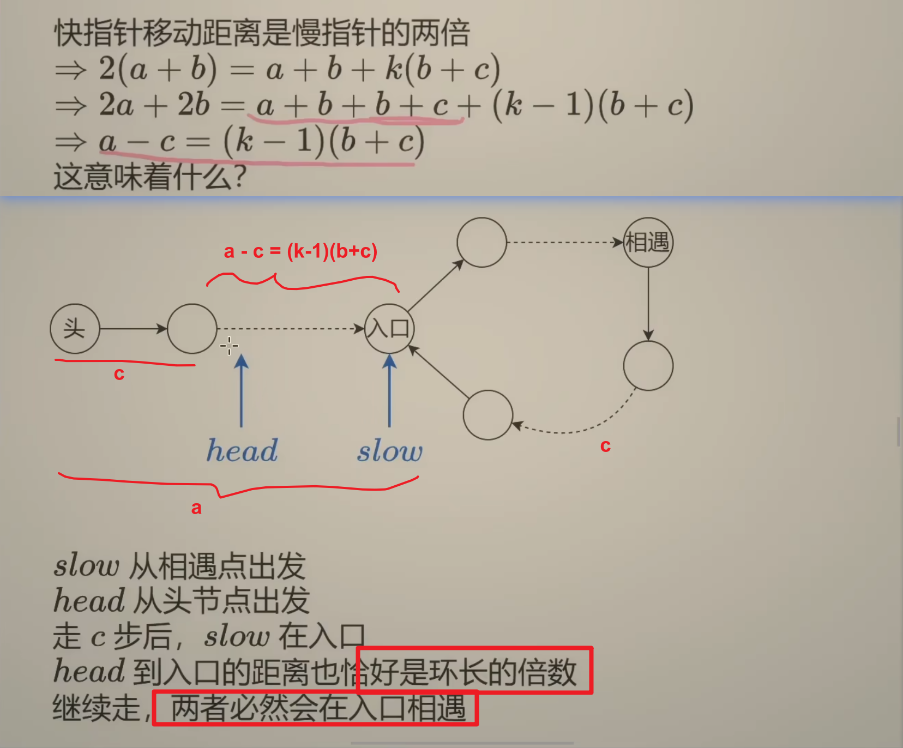

```python
# Definition for singly-linked list.
# class ListNode:
#     def __init__(self, x):
#         self.val = x
#         self.next = None

class Solution:
    def detectCycle(self, head: Optional[ListNode]) -> Optional[ListNode]:
        slow, fast = head, head
        while fast and fast.next:
            slow = slow.next
            fast = fast.next.next
            if fast is slow:
                # 当快慢指针相遇时，在此走动head 和 slow, 直到相遇，就都指向入口了
                while slow is not head:
                    slow = slow.next
                    head = head.next
                return slow
```

# [160. 相交链表](https://leetcode.cn/problems/intersection-of-two-linked-lists/)


```python
# Definition for singly-linked list.
# class ListNode:
#     def __init__(self, x):
#         self.val = x
#         self.next = None

class Solution:
    def getIntersectionNode(self, headA: ListNode, headB: ListNode) -> Optional[ListNode]:
        # 链表相交，链表的总数一直，所以当链表相交的时候，
        # a 走完，在走到b, b走完在走到a, 最终就会相遇
        p, q = headA, headB
        while p is not q:
            p = p.next if p else headB
            q = q.next if q else headA

        return p
```

# [24. 两两交换链表中的节点](https://leetcode.cn/problems/swap-nodes-in-pairs/)


```python
class Solution:
    def swapPairs(self, head: Optional[ListNode]) -> Optional[ListNode]:
        if not head:
            return head

        node0 = dummy = ListNode(next=head)
        node1 = head
        # 至少两个节点，才能交换
        while node1 and node1.next:
            node2 = node1.next
            node3 = node2.next

            node0.next = node2  # 0 -> 2
            node2.next = node1  # 2 -> 1
            node1.next = node3  # 1 -> 3

            node0 = node1  # 0 -> 1
            node1 = node3  # 1 -> 3

        return dummy.next
```

# [21. 合并两个有序链表](https://leetcode.cn/problems/merge-two-sorted-lists/)

```python
# Definition for singly-linked list.
# class ListNode:
#     def __init__(self, val=0, next=None):
#         self.val = val
#         self.next = next
class Solution:
    def mergeTwoLists(self, list1: Optional[ListNode], list2: Optional[ListNode]) -> Optional[ListNode]:
	# 时间复杂度：O(n+m)，其中 n 为 list1 的长度，m 为 list2 的长度。
        cur = dummy = ListNode()
        while list1 and list2:
            if list1.val < list2.val:
                cur.next = list1
                list1 = list1.next
            else:
                cur.next = list2
                list2 = list2.next

            cur = cur.next

        cur.next = list1 or list2 # 拼接剩余的链表
        return dummy.next
```

# [148. 排序链表](https://leetcode.cn/problems/sort-list/)

思路：归并排序，分而治之

找到链表的中间结点 head2 的前一个节点，并断开 head2 与其前一个节点的连接。这样我们就把原链表均分成了两段更短的链表。
分治，递归调用 sortList，分别排序 head（只有前一半）和 head2。
排序后，我们得到了两个有序链表，那么合并两个有序链表，得到排序后的链表，返回链表头节点。

作者：灵茶山艾府
链接：https://leetcode.cn/problems/sort-list/solutions/2993518/liang-chong-fang-fa-fen-zhi-die-dai-mo-k-caei/


```python
# Definition for singly-linked list.
# class ListNode:
#     def __init__(self, val=0, next=None):
#         self.val = val
#         self.next = next
class Solution:
    def sortList(self, head: Optional[ListNode]) -> Optional[ListNode]:
        # 如果链表为空或者只有一个节点，直接返回
        if not head or not head.next:
            return head
        # 找到中间节点 head2 并段考head2与前一个节点的连接
        head2 = self.middleNode(head)
        # 递归分治
        head = self.sortList(head)
        head2 = self.sortList(head2)

        # 合并两个有序数组
        return self.mergeTwoLists(head, head2)

    def mergeTwoLists(self, list1, list2):
        cur = dummy = ListNode()
        while list1 and list2:
            if list1.val < list2.val:
                cur.next = list1
                list1 = list1.next
            else:
                cur.next = list2
                list2 = list2.next
            cur = cur.next

        cur.next = list1 or list2
        return dummy.next

    def middleNode(self, head):
        fast, slow = head, head
        while fast and fast.next:
            pre = slow  # 记录slow的前一个节点
            fast = fast.next.next
            slow = slow.next
        pre.next = None  # 断开slow 的前一个节点和slow的连接
        return slow
```

# [23. 合并 K 个升序链表](https://leetcode.cn/problems/merge-k-sorted-lists/)

暴力做法，先合并前两个链表，再把得到的新链表和第三个链表合并，再和第四个链表合并，依此类推。，时间复杂度就是 O(nk)

根据二分的思想，递归后时间复杂度 O(nlogk)

```python
# Definition for singly-linked list.
# class ListNode:
#     def __init__(self, val=0, next=None):
#         self.val = val
#         self.next = next
class Solution:
    def mergeKLists(self, lists: List[Optional[ListNode]]) -> Optional[ListNode]:
        # 分而治之
        m = len(lists)
        if m == 0:
            return None
        if m == 1:
            return lists[0]
        # 合并左半部分
        left = self.mergeKLists(lists[:m // 2])
        # 合并右半部分
        right = self.mergeKLists(lists[m//2:])
        return self.mergeTwoLists(left, right)


    def mergeTwoLists(self, list1, list2):
        cur = dummy = ListNode()
        while list1 and list2:
            if list1.val < list2.val:
                cur.next = list1
                list1 = list1.next
            else:
                cur.next = list2
                list2 = list2.next
            cur = cur.next

        cur.next = list1 or list2
        return dummy.next
```

# [146. LRU 缓存](https://leetcode.cn/problems/lru-cache/)

```python
__slots__ 是 Python 中的一个特殊属性，它用于限制类的属性。通过使用 __slots__，你可以指定类实例可以拥有的属性名称。

当你定义一个类时，Python 会自动为其创建一个 __dict__ 属性，这是一个字典，用于存储类实例的属性。但是，这会带来一些额外的内存开销和性能损失。

通过使用 __slots__，你可以告诉 Python 只为类实例创建指定的属性，而不是创建一个完整的 __dict__。这可以节省内存和提高性能。
```

```python
class Node:
    __slots__ = ("key", "value", "prev", "next")

    def __init__(self, key=0, value=0):
        self.key = key
        self.value = value
        self.prev = None
        self.next = None


class LRUCache:
    def __init__(self, capacity: int):
        self.capacity = capacity
        self.cache = {}
        # dummy 节点，辅助节点，并让链表成环，链表里的所有元素都是双向的
        self.dummy = Node()
        self.dummy.prev = self.dummy
        self.dummy.next = self.dummy

        # dummy <-> dummy
        # put node a
        """
        <-- dummy <-> a <-> dummy <-
        |                           |
        ----------------------------
        """

    def get_node(self, key: int) -> Node | None:
        if key not in self.cache:
            return None

        node = self.cache[key]
        # 从链表中移除
        self.remove(node)
        # 重新插入到头部
        self.push_front(node)
        return node

    # 将节点插入到头部
    def push_front(self, node: Node) -> None:
        # dummy <-> b <-> c
        # node.prev -> dummy
        # node.next -> b
        # node.prev.next(dummy.next) -> node
        # node.next.prev(b.prev) -> node
        # => dummy <-> node <-> b <-> c
        node.prev = self.dummy
        node.next = self.dummy.next
        node.prev.next = node
        node.next.prev = node

    # 删除链表中某个节点
    def remove(self, node: Node) -> None:
        # a <-> b <-> c
        # b.prev.next a.next -> a.next -> c
        # b.next.prev b.prev -> c.prev -> a
        # => a <-> c
        node.prev.next = node.next
        node.next.prev = node.prev

    def get(self, key: int) -> int:
        node = self.get_node(key)
        return node.value if node else -1

    def put(self, key: int, value: int) -> None:
        node = self.get_node(key)
        if node:
            # 如果节点存在，更新值
            node.value = value
            return

        # new Node
        node = Node(key, value)
        self.cache[key] = node
        # 推入到头部
        self.push_front(node)
        # 如果超过容量，删除尾部节点
        if len(self.cache) <= self.capacity:
            return

        # 删除尾部节点
        tail_node: Node = self.dummy.prev
        del self.cache[tail_node.key]
        self.remove(tail_node)
```

# [239. 滑动窗口最大值](https://leetcode.cn/problems/sliding-window-maximum/)

思路：单调队列

```python
class Solution:
    def maxSlidingWindow(self, nums: List[int], k: int) -> List[int]:
        ans = []
        q = deque()
        for i, x in enumerate(nums):
            # 1. 入队
            while q and nums[q[-1]] <= x:
                q.pop()
            q.append(i)
            # 2. 出队
            if i - q[0] >= k:
                q.popleft()

            # 3. 记录结果
            if i >= k - 1:
                ans.append(nums[q[0]])
        return ans
```

# [tree](https://jonpan.gitbook.io/jonpan/shi-da-ji-chu-pai-xu-suan-fa/tree)

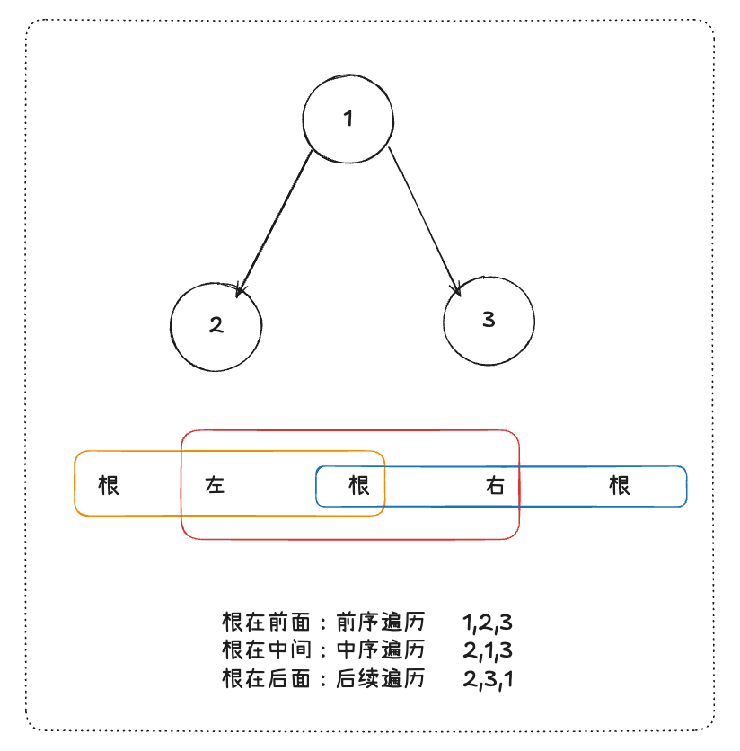

前序遍历，中序遍历，后序遍历

## 递归

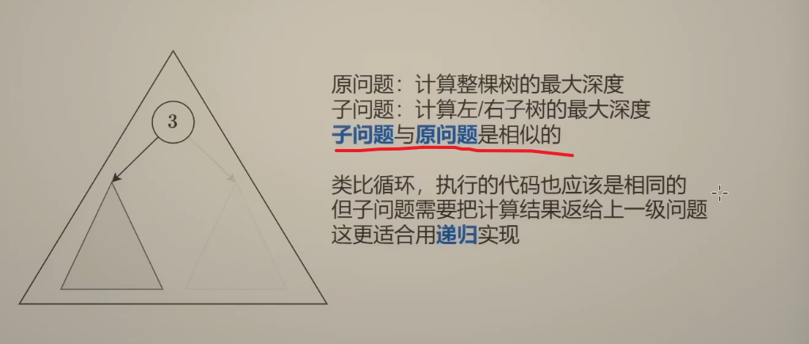

[原问题+子问题+边界条件](https://www.bilibili.com/video/BV1UD4y1Y769)

## [226. 翻转二叉树](https://leetcode.cn/problems/invert-binary-tree/)

```python
# Definition for a binary tree node.
# class TreeNode:
#     def __init__(self, val=0, left=None, right=None):
#         self.val = val
#         self.left = left
#         self.right = right
class Solution:
    def invertTree(self, root: Optional[TreeNode]) -> Optional[TreeNode]:
        if root is None:
            return root

        root.left, root.right = self.invertTree(root.right), self.invertTree(root.left)
        return root
```

堆栈-演示网站：https://pythontutor.com/

## [104. 二叉树的最大深度](https://leetcode.cn/problems/maximum-depth-of-binary-tree/)

二叉树的 **最大深度** 是指从根节点到最远叶子节点的最长路径上的节点数。


```python
# Definition for a binary tree node.
class TreeNode:
    def __init__(self, val=0, left=None, right=None):
        self.val = val
        self.left = left
        self.right = right

class Solution:
    def maxDepth(self, root: Optional[TreeNode]) -> int:
        # 时间复杂度： O(n)
        # 空间复杂度： O(n). 递归调用，是栈回退，最坏情况就是一颗全是左或全是右的树
        if root is None:
            return 0

        l_depth = self.maxDepth(root.left)
        r_depth = self.maxDepth(root.right)
        return max(l_depth, r_depth) + 1
```

## [100. 相同的树](https://leetcode.cn/problems/same-tree/)

```python
# Definition for a binary tree node.
# class TreeNode:
#     def __init__(self, val=0, left=None, right=None):
#         self.val = val
#         self.left = left
#         self.right = right
class Solution:
    def isSameTree(self, p: Optional[TreeNode], q: Optional[TreeNode]) -> bool:
        # 递归退出条件，两棵树有一个遍历到空了，并判断节点是否一样
        if p is None or q is None:
            return p is q   # p==q => p is None /  None is None / None is q

        # 递归判断节点值是否一样
        return p.val == q.val and self.isSameTree(p.left, q.left) and self.isSameTree(p.right, q.right)
```

## [101. 对称二叉树](https://leetcode.cn/problems/symmetric-tree/)

```python
# Definition for a binary tree node.
# class TreeNode:
#     def __init__(self, val=0, left=None, right=None):
#         self.val = val
#         self.left = left
#         self.right = right
class Solution:
    def isSymmetric(self, root: Optional[TreeNode]) -> bool:
        # 根据题100，这里只要将跟节点下的左右字数对比一样是否是一样的
        # 不同点是左子树的左节点 跟 右子树右节点对比
        # 左子树的右节点 跟 右子树左节点对比
        return self.isSameTree(root.left, root.right)

    def isSameTree(self, p: Optional[TreeNode], q: Optional[TreeNode]) -> bool:
        # 递归退出条件，两棵树有一个遍历到空了，并判断节点是否一样
        if p is None or q is None:
            return p is q   # p==q => p is None /  None is None / None is q

        # 递归判断节点值是否一样
        return p.val == q.val and self.isSameTree(p.left, q.right) and self.isSameTree(p.right, q.left)
```

## [110. 平衡二叉树](https://leetcode.cn/problems/balanced-binary-tree/)

```python
# Definition for a binary tree node.
# class TreeNode:
#     def __init__(self, val=0, left=None, right=None):
#         self.val = val
#         self.left = left
#         self.right = right
class Solution:
    def isBalanced(self, root: Optional[TreeNode]) -> bool:
        # 平衡二叉树定义：左子树的高度和右子树的高度差=1
        # 根据题104 计算树深度的规则，增加高度差的判断，如果>1 则返回特定值，退出递归

        def get_depth(node):
            if node is None:
                return 0

            l_depth = get_depth(node.left)
            if l_depth == - 1:
                return -1

            r_depth = get_depth(node.right)
            if r_depth == -1 or abs(r_depth - l_depth) > 1:
                return -1

            return max(l_depth, r_depth) + 1

        return get_depth(root) != -1
```

## [199. 二叉树的右视图](https://leetcode.cn/problems/binary-tree-right-side-view/)

由于是先遍历的右节点，所以一定是右节点的深度先遇到，如果没有右节点，说明没有遮挡，就记录左节点


```python
# Definition for a binary tree node.
# class TreeNode:
#     def __init__(self, val=0, left=None, right=None):
#         self.val = val
#         self.left = left
#         self.right = right
class Solution:
    def rightSideView(self, root: Optional[TreeNode]) -> List[int]:
        ans = []
        def f(node, depth):
            if node is None:
                return
            # 当深度首次遇到的时候，就是右视图看到的节点
            if depth == len(ans):
                ans.append(node.val)
            # 先递归右子树，保证首次遇到的一定是最右边的节点
            f(node.right, depth+1)
            f(node.left, depth+1)
        f(root, 0)
        return ans
```

## [98. 验证二叉搜索树](https://leetcode.cn/problems/validate-binary-search-tree/)

定义：[二叉搜索树](https://jonpan.gitbook.io/jonpan/shi-da-ji-chu-pai-xu-suan-fa/tree#er-cha-cha-zhao-shu-er-cha-sou-suo-shu)

节点的左子树只包含小于当前节点的数

节点的右子树只包含大于当前节点的数

所有左子树和右子树自身必须也是二叉搜索树

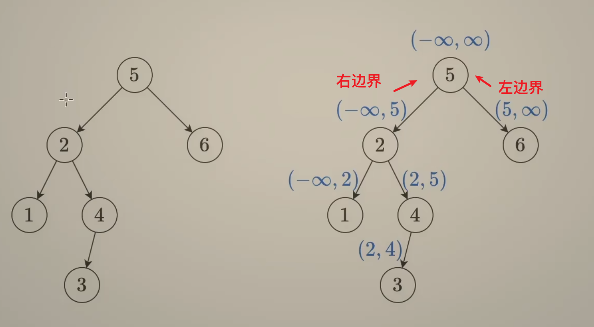

### 先序遍历

根节点->左子树->右子树

```python
# Definition for a binary tree node.
# class TreeNode:
#     def __init__(self, val=0, left=None, right=None):
#         self.val = val
#         self.left = left
#         self.right = right
class Solution:

    def isValidBST(self, root: Optional[TreeNode], left=-inf, right=inf) -> bool:
        if root is None:
            return True

        x = root.val
        # 递归判断左右节点的大小边界是否符合二叉搜索树的条件
        # 左节点都小于跟节点，右节点都大于跟节点
        # (-♾️, 跟节点) (跟节点，+♾️)
        return left < x < right and self.isValidBST(root.left, left, x) and self.isValidBST(root.right, x, right)
```

### 中序遍历

左子树->根节点->右子树

中序遍历验证 严格递增的数组，看当前节点值是否大于上一个节点

```python
# Definition for a binary tree node.
# class TreeNode:
#     def __init__(self, val=0, left=None, right=None):
#         self.val = val
#         self.left = left
#         self.right = right
class Solution:
    pre = -inf
    def isValidBST(self, root: Optional[TreeNode], left=-inf, right=inf) -> bool:
        if root is None:
            return True

        if not self.isValidBST(root.left):
            return False

        if root.val <= self.pre:
            return False

        self.pre = root.val
        return self.isValidBST(root.right)
```

## [230. 二叉搜索树中第 K 小的元素](https://leetcode.cn/problems/kth-smallest-element-in-a-bst/)

```python
class Solution:
    def kthSmallest(self, root: Optional[TreeNode], k: int) -> int:
        # 题目声明root内都是正整数，所以可以在递归时约定遇到-1就return
        # 通过中序遍历递归二叉搜索树，可以走一遍单调递增的树节点，每走一步k--
        def dfs(node):
            if node is None:
                return -1

            left_res = dfs(node.left)
            if left_res != -1:
                # 答案在左子树中
                return left_res

            nonlocal k
            k -= 1
            if k==0:
                # 答案在当前节点
                return node.val
            return dfs(node.right) # 右子树会返回答案或者-1

        return dfs(root)
```

## [236. 二叉树的最近公共祖先](https://leetcode.cn/problems/lowest-common-ancestor-of-a-binary-tree/)

熟悉二叉树的定义和特性，然后分类讨论

> [灵神讲解](https://www.bilibili.com/video/BV1W44y1Z7AR)

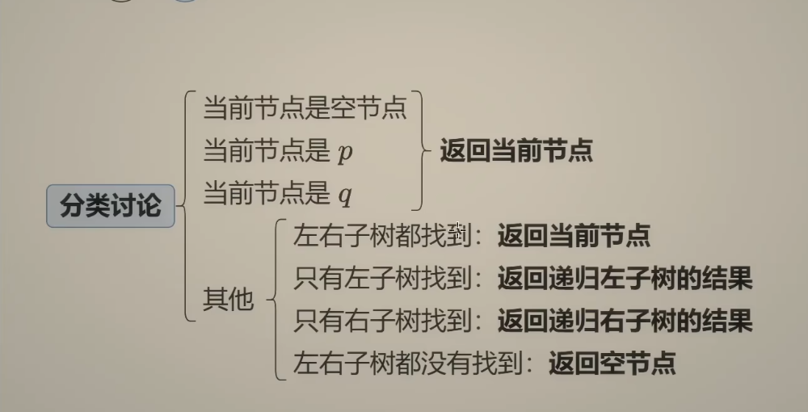

```python
# Definition for a binary tree node.
# class TreeNode:
#     def __init__(self, x):
#         self.val = x
#         self.left = None
#         self.right = None

class Solution:
    def lowestCommonAncestor(self, root: 'TreeNode', p: 'TreeNode', q: 'TreeNode') -> 'TreeNode':
        if root is None or root is p or root is q:
            return root
        left = self.lowestCommonAncestor(root.left, p, q)
        right = self.lowestCommonAncestor(root.right, p, q)
        if left and right:
            return root

        if left:
            return left
        return right
```

## [235. 二叉搜索树的最近公共祖先](https://leetcode.cn/problems/lowest-common-ancestor-of-a-binary-search-tree/)

## [102. 二叉树的层序遍历](https://leetcode.cn/problems/binary-tree-level-order-traversal/)


### 层序遍历-两个列表维护数据

```python
# Definition for a binary tree node.
# class TreeNode:
#     def __init__(self, val=0, left=None, right=None):
#         self.val = val
#         self.left = left
#         self.right = right
class Solution:
    def levelOrder(self, root: Optional[TreeNode]) -> List[List[int]]:
        if root is None:
            return []
        ans = []

        # 逐层遍历，cur记录当前层，然后遍历cur层中的数据，获取到下一层，在进入循环继续遍历
        cur = [root]

        while cur:
            nxt = []
            vals = []
            for node in cur:
                vals.append(node.val)
                if node.left:
                    nxt.append(node.left)
                if node.right:
                    nxt.append(node.right)
            cur = nxt
            ans.append(vals)
        return ans
```

### 层序遍历-fifo 队列

```python
# Definition for a binary tree node.
# class TreeNode:
#     def __init__(self, val=0, left=None, right=None):
#         self.val = val
#         self.left = left
#         self.right = right
class Solution:
    def levelOrder(self, root: Optional[TreeNode]) -> List[List[int]]:
        if root is None:
            return []
        ans = []
        # 使用fifo队列 逐层迭代
        # 将第一层先放进去，然后根据队列长度遍历每层的每个节点获取数据以及下一层的数据入队
        # 当队列pop完后就退出循环
        q = deque([root])
        while q:
            vals = []
            # 每次迭代一层
            for _ in range(len(q)):
                # fifo 之前对入队的就出队
                node = q.popleft()
                vals.append(node.val)
                if node.left: q.append(node.left)
                if node.right: q.append(node.right)

            ans.append(vals)

        return ans
```

## [103. 二叉树的锯齿形层序遍历](https://leetcode.cn/problems/binary-tree-zigzag-level-order-traversal/)


<pre><strong>输入：</strong>root = [3,9,20,null,null,15,7]
<strong>输出：</strong>[[3],[20,9],[15,7]]</pre>

思路：在层序遍历的基础上，实现偶数层数据的反转

```python
# Definition for a binary tree node.
# class TreeNode:
#     def __init__(self, val=0, left=None, right=None):
#         self.val = val
#         self.left = left
#         self.right = right
class Solution:
    def zigzagLevelOrder(self, root: Optional[TreeNode]) -> List[List[int]]:
        if root is None:
            return []
        ans = []

        # 逐层遍历，cur记录当前层，然后遍历cur层中的数据，获取到下一层，在进入循环继续遍历
        cur = [root]
        even = False
        while cur:
            nxt = []
            vals = []
            for node in cur:
                vals.append(node.val)
                if node.left:
                    nxt.append(node.left)
                if node.right:
                    nxt.append(node.right)
            cur = nxt
            ans.append(vals[::-1] if even else vals)
            even = not even
        return ans
```

## [513. 找树左下角的值](https://leetcode.cn/problems/find-bottom-left-tree-value/)


<pre><strong>输入: </strong>[1,2,3,4,null,5,6,null,null,7]
<strong>输出: </strong>7</pre>

思路：层序遍历，先入队右，再入队左，根据 fifo 的策略，最后出队的就是**最底层 最左边**节点的值。

```python
# Definition for a binary tree node.
# class TreeNode:
#     def __init__(self, val=0, left=None, right=None):
#         self.val = val
#         self.left = left
#         self.right = right
class Solution:
    def findBottomLeftValue(self, root: Optional[TreeNode]) -> int:
        if root is None:
            return 0

        ans = 0
        q = deque([root])
        while q:
            node = q.popleft()
            ans = node.val
            if node.right: q.append(node.right)
            if node.left: q.append(node.left)

        return ans
```

# 回溯

本质是暴力 for 循环，但是是一种可定义嵌套层次的暴力搜索法。

如果单纯写 for 循环，写 n 层嵌套的代码看不了。

所以就是定义好单层嵌套的逻辑，然后用外层的函数递归调用，得到结果。

回溯三部曲：一定要画属性结构分析结果集

1. 递归函数参数第一
2. 递归函数的退出条件
3. 单层 for 循环的处理逻辑

排列问题是用 used 数组树枝去重；

组合问题用 startIndex 去重，

有重复元素的要做数层去重（used 数组或者 hashset）

## [17. 电话号码的字母组合](https://leetcode.cn/problems/letter-combinations-of-a-phone-number/)


**示例 1：**

<pre><strong>输入：</strong>digits = "23"
<strong>输出：</strong>["ad","ae","af","bd","be","bf","cd","ce","cf"]
</pre>

```python

MAPPING = ["", "", "abc", "def", "ghi", "jkl", "mno", "pqrs", "tuv", "wxyz"]

class Solution:
    def letterCombinations(self, digits: str) -> List[str]:
        # 时间复杂度：O(n4^n)
        # 空间复杂度：O(n)
        n = len(digits)
        if n == 0:
            return []

        ans = []
        # 用path记录每次递归的结果
        path = [''] * n

        def dfs(i):
            # 边界条件，递归次数是指定字母长度
            if i == n:
                ans.append(''.join(path))
                return
            for c in MAPPING[int(digits[i])]:
                # 记录递归的0,1的结果
                path[i] = c
                # 递归下一个子问题
                dfs(i+1)
        dfs(0)
        return ans
```

# 子集型回溯

每个元素选/不选

## [78. 子集](https://leetcode.cn/problems/subsets/)

```python
class Solution:
    def subsets(self, nums: List[int]) -> List[List[int]]:

        ans = []
        path = []
        n = len(nums)

        def dfs(si):
            # 首先空集合也算, 且每个节点都要
            ans.append(path.copy())
            # 退出条件
            if si == n:
                return

            for i in range(si, n):
                path.append(nums[i])
                dfs(i+1)
                path.pop()

        dfs(0)
        return ans
```

## [90. 子集 II](https://leetcode.cn/problems/subsets-ii/)

```python
class Solution:
    def subsetsWithDup(self, nums: List[int]) -> List[List[int]]:
        ans = []
        path = []
        n = len(nums)
        nums.sort()
        def dfs(si):
            # 首先空集合也算, 且每个节点都要
            ans.append(path.copy())
            # 退出条件
            if si == n:
                return

            for i in range(si, n):
                if i > si and nums[i] == nums[i-1]:
                    continue
                path.append(nums[i])
                dfs(i+1)
                path.pop()

        dfs(0)
        return ans
```

## [491. 非递减子序列](https://leetcode.cn/problems/non-decreasing-subsequences/)

```python
class Solution:
    def findSubsequences(self, nums: List[int]) -> List[List[int]]:
        path = []
        ans = []
        n = len(nums)

        # 无法利用排序+递归index判断，就用树层去重+树枝去重的逻辑
        # 结果集是符合条件的每个节点

        # 1. 树层上去重
        # 2. 树枝上判断是否递增，非递增就退出

        def dfs(si):
            used_index = set()

            # 先收集结果
            if len(path) >= 2:
                ans.append(path[::])

            #  在判断退出条件
            if si >= n:
                return

            for i in range(si, n):
                # 判断树枝单调递增，当前节点，与上一个递归的节点比较是否符合递增条件
                if path and path[-1] > nums[i]:
                    continue

                # 判断树层去重，递归回到原本的栈继续for循环的时候判断后面的数是否已经递归过了
                if nums[i] in used_index:
                    continue

                used_index.add(nums[i])
                path.append(nums[i])
                dfs(i+1)
                path.pop()

                # 注意这里的used_index不需要回溯，因为这个就是记录树的每一层的节点来判断是否已经递归过了


        dfs(0)
        return ans
```

## [131. 分割回文串](https://leetcode.cn/problems/palindrome-partitioning/)

```python
class Solution:
    def partition(self, s: str) -> List[List[str]]:
        ans = []
        path = []
        n = len(s)

        def dfs(si):
            # 每个子节点都是答案，所以退出条件就是si==n
            if si == n:
                ans.append(path.copy())
                return

            for i in range(si, n):
                subs = s[si:i+1]
                # [si:i+1] 这个闭区间就是一个分割子串
                if self.isPartition(subs):
                    path.append(subs)
                    dfs(i+1)
                    path.pop()
        dfs(0)
        return ans


    def isPartition(self, s):
        return s[::-1] == s
```

# 组合型回溯

[回溯三部曲：](https://www.bilibili.com/video/BV1cy4y167mM)

1. 递归的参数
2. 递归的退出条件
3. 递归内的单层循环逻辑+回溯

> 推荐代码随想录：[https://www.bilibili.com/video/BV1cy4y167mM](https://www.bilibili.com/video/BV1cy4y167mM)

## [77. 组合](https://leetcode.cn/problems/combinations/)

### 普通回溯

```python
class Solution:
    def combine(self, n: int, k: int) -> List[List[int]]:

        ans = []
        path = []
        def dfs(s):
            # 退出条件
            if len(path) == k:
                # 收集结果，并退出
                ans.append(path.copy())
                return

            # 单层嵌套处理逻辑
            # n+1是为了包括n, s也是从1开始的
            for i in range(s, n+1):
                path.append(i)
                # 递归下一个节点
                dfs(i+1)
                # 回溯让出
                path.pop()

        dfs(1)
        return ans
```

### 剪枝版回溯

```python
class Solution:
    def combine(self, n: int, k: int) -> List[List[int]]:

        ans = []
        path = []
        def dfs(s):
            # 退出条件
            if len(path) == k:
                # 收集结果，并退出
                ans.append(path.copy())
                return

            # 单层嵌套处理逻辑
            # 增加剪枝的逻辑，相当于只需要遍历有效节点
            sizecut = n - (k - len(path)) + 1
            # n+1是为了包括n, s也是从1开始的
            for i in range(s, sizecut+1):
                path.append(i)
                # 递归下一个节点
                dfs(i+1)
                # 回溯让出
                path.pop()

        dfs(1)
        return ans
```

## [216. 组合总和 III](https://leetcode.cn/problems/combination-sum-iii/)

在上题的基础上加了个判断条件

```python
class Solution:
    def combinationSum3(self, k: int, n: int) -> List[List[int]]:
        return self.combine(9, k, n)

    def combine(self, n: int, k: int, sn: int) -> List[List[int]]:

        ans = []
        path = []
        def dfs(s):
            # 退出条件
            if len(path) == k:
                # 收集结果，并退出
                if sum(path) == sn:
                    ans.append(path.copy())
                return

            # 单层嵌套处理逻辑
            # 增加剪枝的逻辑，相当于只需要遍历有效节点
            sizecut = n - (k - len(path)) + 1
            # n+1是为了包括n, s也是从1开始的
            for i in range(s, sizecut+1):
                path.append(i)
                # 递归下一个节点
                dfs(i+1)
                # 回溯让出
                path.pop()

        dfs(1)
        return ans
```

## [39. 组合总和](https://leetcode.cn/problems/combination-sum/)

增加同一个元素可重复使用的逻辑

```python
class Solution:
    def combinationSum(self, candidates: List[int], target: int) -> List[List[int]]:
        ans = []
        path = []

        def dfs(si):
            # 退出条件
            if sum(path) > target:
                return

            # 收集数据
            if sum(path) == target:
                ans.append(path.copy())
                return

            # 单层循环处理逻辑
            for i in range(si, len(candidates)):
                path.append(candidates[i])
                # 同一个元素可以重复使用
                dfs(i)
                path.pop()

        dfs(0)
        return ans
```

## [40. 组合总和 II](https://leetcode.cn/problems/combination-sum-ii/)

### 栈分析

具体流程可以通过[可视化网站看](https://pythontutor.com/render.html#mode=display)

```python
[1,1,1]
递归遍历的场景分析
n=3
栈①si=0, path.append(1)
栈②si=1, path.append(1)
栈③si=2, path.append(1)
栈④si=3, sum(path) == target: return

回到栈③
path.pop()  回溯 此时 path = [1, 1]
退出for循环(2,3)

回到栈②
path.pop()  回溯 此时 path = [1]
此时 for i in range(1, 3), i=2
i>si and candidates[i] == candidates[i-1]
continue
退出for循环

回到栈①
path.pop()  回溯 此时 path = []
此时 for i in range(0, 3), i=1
i>si and candidates[i] == candidates[i-1] continue
继续for 循环 i = 2
i>si and candidates[i] == candidates[i-1] continue

退出for循环
回到main函数


```

```python
class Solution:
    def combinationSum2(self, candidates: List[int], target: int) -> List[List[int]]:
        ans = []
        path = []
        candidates.sort()
        # 重复元素不在计入下一次递归
        def dfs(start_index, left):

            if left == 0:
                ans.append(path.copy())
                return

            for i in range(start_index, len(candidates)):
                # 如果当前节点大于left, 后面的数都不用选了，肯定都大于target
                if left < candidates[i]:
                    break
                # 如果
                if i > start_index and candidates[i] == candidates[i-1]:
                    continue
                path.append(candidates[i])
                # 逐个递减结果
                dfs(i+1, left-candidates[i])
                path.pop()
        dfs(0, target)
        return ans
```

# 全排列

## [46. 全排列](https://leetcode.cn/problems/permutations/)

<pre><strong>输入：</strong>nums = [1,2,3]
<strong>输出：</strong>[[1,2,3],[1,3,2],[2,1,3],[2,3,1],[3,1,2],[3,2,1]]</pre>

```python
class Solution:
    def permute(self, nums: List[int]) -> List[List[int]]:
        ans = []
        path = []

        l = len(nums)
        used = [0] * l
        def dfs():
            if len(path) == l:
                ans.append(path[:])

            # 注意全排列是要所有元素再次搜索，所以每次递归都是循环所有数组
            # 再根据used 来判断是否已经使用过，不能出现重复的
            for i, num in enumerate(nums):
                if used[i] == 1:
                    continue

                used[i] = 1
                path.append(num)
                dfs()
                path.pop()
                used[i] = 0

        dfs()
        return ans
```

# 贪心

## [455. 分发饼干](https://leetcode.cn/problems/assign-cookies/)

```python
class Solution:
    def findContentChildren(self, g: List[int], s: List[int]) -> int:
        g.sort()
        s.sort()
        # 胃口 表示孩子的总数
        n = len(g)

        i = 0
        # 遍历饼干,将最小的喂给胃口最小的，如果最小的喂不了，后面的肯定都喂不了了
        for x in s:
            if i < n and g[i] <= x:
                i+=1

        return i
```

## [121. 买卖股票的最佳时机](https://leetcode.cn/problems/best-time-to-buy-and-sell-stock/)

只能买卖一次

```python
class Solution:
    def maxProfit(self, prices: List[int]) -> int:
        # 只能买卖一次，所以要找到最低点和后面的最高点，再找的这个过程就可以记录最低，然后迭代计算最高
        cost, profit = float('+inf'), 0
        for price in prices:
            cost = min(cost, price)
            profit = max(profit, price-cost)

        return profit
```

## [122. 买卖股票的最佳时机 II](https://leetcode.cn/problems/best-time-to-buy-and-sell-stock-ii/)

可以多次买卖

```python
class Solution:
    def maxProfit(self, prices: List[int]) -> int:
        # 由于可以多次买卖，所以最大利润就是低位买，高位买，然后跌价的利润
        profit = 0

        for i in range(1, len(prices)):
            tp = prices[i] - prices[i-1]
            if tp > 0:
                profit+=tp

        return profit
```

## [55. 跳跃游戏](https://leetcode.cn/problems/jump-game/)

```python
class Solution:
    def canJump(self, nums: List[int]) -> bool:
        # 计算最大可达是否可以覆盖数组长度
        max_reach = 0
        last_index = len(nums) - 1
        for i, jump in enumerate(nums):
            if i > max_reach:
                return False

            # i+jump 表示当前下标前面的步数已经算过了，加上当前数值判断可覆盖到的范围
            max_reach = max(max_reach, i+jump)
            if max_reach >= last_index:
                return True
```

## [45. 跳跃游戏 II](https://leetcode.cn/problems/jump-game-ii/)

贪心思路：每次走最远的距离，并在走的时候记录下一次能走的最远距离，当每次走的结束位置还不能到达终点，就计算继续走能不能到达下一个最远距离，(注意这里前面走的已经被算在下一次走的路径里了)，在看下一次这次能不能走到终点。

```python
cclass Solution:
    def jump(self, nums: List[int]) -> int:
        # 计算最大可达是否可以覆盖数组长度
        if len(nums) == 1:
            return 0

        ans = 0  # 步数
        # 当前一步能够到达的最远索引
        cur_right = 0
        # 下一步能到达的最远索引
        next_right = 0
        for i in range(len(nums)):
            # 更新走一步到最远的距离内，其他点能走的最远距离
            next_right = max(next_right, i+nums[i])
            # 到达当前步能够走到d最远距离，如果还没到达，继续轮询
            if i == cur_right:
                # ⚠️：这里的cur_right=next_right 并继续循环，隐含意思：上一次走的距离，其实已经算在next_right里了，继续for往后走，走到next_right的最远距离，看能不能到达终点
                cur_right = next_right
                ans+=1
                # 走了ans步后，跳跃范围已经覆盖下标，直接退出，题目已声明肯定能走到nums[n-1]
                if next_right >= len(nums)-1:
                    break

        return ans
```

## [1005. K 次取反后最大化的数组和](https://leetcode.cn/problems/maximize-sum-of-array-after-k-negations/)

时间复杂度：排序+for 循环 nlogn

空间复杂度：O(n)

```python
class Solution:
    def largestSumAfterKNegations(self, nums: List[int], k: int) -> int:
        # 思路：将负数变成整数，然后找最小的值进行剩余次数的取反，最终和就是最大的了

        # 1. 先排序(元素中有负数，所以要用绝对值取反，方便最后取最小值)
        nums = sorted(nums, key=lambda x: abs(x))
        for i in range(len(nums)-1, 0, -1):
            if k>0 and nums[i] < 0:
                k-=1
                nums[i] = nums[i]*-1

        # 2. k 还有剩余的画，取最小的进行取反
        if (k!=0 and k % 2 ==1): nums[0]*=-1
        return sum(nums)
```

最小堆实现：时间复杂度 Onlogn，空间复杂度 O(1)

```python
class Solution:
    def largestSumAfterKNegations(self, nums: List[int], k: int) -> int:
        # 思路：用最小堆，每次去除堆顶取反，然后入队，继续取反入队，直到k=0

        heapq.heapify(nums)
        while k:
            min_val = heapq.heappop(nums)
            heapq.heappush(nums, min_val*-1)
            k-=1

        return sum(nums)
```

## [134. 加油站](https://leetcode.cn/problems/gas-station/)

贪心思路：能走一圈说明，整体油量大于等于整体消耗，说明肯定存在这么个位置，那这个位置在哪里。

当油量出现负数的时候，就往下找直到最后一个负数的下一个位置

就是有油量的走完了，在低消负的，一正一负，一正一负，一正一负...这种情况才能走完。

```python
class Solution:
    def canCompleteCircuit(self, gas: List[int], cost: List[int]) -> int:
        # 统计剩余油量
        cur_sum = 0
        # 统计整体消耗数量，如果整体加起来大于等于0,说明是有这么个位置可以绕一圈的
        totao_sum = 0
        # 记录位置
        start = 0
        for i, n in enumerate(gas):
            cur_sum += n - cost[i]
            totao_sum += n - cost[i]
            if cur_sum < 0:
                start = i + 1
                cur_sum = 0

        if totao_sum >= 0:
            return start
        return -1
```

## [860. 柠檬水找零](https://leetcode.cn/problems/lemonade-change/)

由于 10 美元钞票只能用于 20 美元的找零，而 5 美元钞票既可以用于 20 美元的找零，又可以用于 10 美元的找零，更加通用（使用场景更多），所以如果可以用 10 美元，应当优先用 10 美元，其次用 5 美元。如果优先用 5 美元，可能会面临 bills[i]=10 无法找零的情况。

设当前有 five 张 5 美元钞票，ten 张 10 美元钞票。20 美元的无需统计，因为它无法用来找零。

```python
class Solution:
    def lemonadeChange(self, bills: List[int]) -> bool:
        # 注意题目说明，付款面额为 5， 10， 20
        five = ten = 0
        for b in bills:
            if b == 5:
                five += 1  # 无需找零，收获一张5元
            elif b == 10:
                ten += 1   # 收入一张10元
                five -= 1  # 找零一张5元
            elif ten > 0:  # 前两个都不是，这里就是b=20的情况了
                five -= 1
                ten -= 1
            else: # b=20 且没有10元面额的
                five -= 3
            if five < 0:  # 前面收支后无法平衡，就是false
                return False

        return True
```

## [763. 划分字母区间](https://leetcode.cn/problems/partition-labels/)

```python
class Solution:
    def partitionLabels(self, s: str) -> List[int]:
        ans = []
        # 1. 首先找到每次字母的最大索引位置
        max_index = {}
        for i, b in enumerate(s):
            max_index[b] = i

        left = right = 0
        # 2. 遍历字符串，找到字母的最大区间
        # ababcbaca|defegde
        # 858575878|
        # 888888888 贪心，取最大区间，当i=最大索引，说明已经遇到相同字母的最后一个位置了，就是最大区间
        for i, b in enumerate(s):
            right = max(right, max_index[b])
            if i == right:
                ans.append(right-left+1)
                left = i+1

        return ans
```

## [435. 无重叠区间](https://leetcode.cn/problems/non-overlapping-intervals/)

把 intervals 按照右端点从小到大排序。
初始化计数器 ans=0，上一个选的区间的右端点 preR=−∞。
遍历 intervals，如果发现 intervals[i][0]≥preR，那么选 intervals[i]，把 ans 加一，更新 preR=intervals[i][1]。
遍历结束后，ans 就是不重叠区间个数的最大值，那么需要移除的区间个数的最小值就是 n−ans。

```python
class Solution:
    def eraseOverlapIntervals(self, intervals: List[List[int]]) -> int:
        # 排序统计相邻两个数据的重叠部分
        intervals.sort(key=lambda x: x[1])
        # 统计交叉重叠的部分，剩下的就是需要删除的有重叠的
        count = 1
        end = intervals[0][1]
        for i in range(1, len(intervals)):
            if end <= intervals[i][0]:
                count += 1
                end = intervals[i][1]
        return len(intervals) - count
```

```python
class Solution:
    def eraseOverlapIntervals(self, intervals: List[List[int]]) -> int:
        # 排序统计相邻两个数据的重叠部分
        intervals.sort(key=lambda x: x[1])
        # 统计交叉重叠的部分，剩下的就是需要删除的有重叠的
        ans = 0
        pre_right = -inf
        for left, right in intervals:
            if left >= pre_right:
                # 说明无重叠
                ans+=1
                pre_right = right

        return len(intervals) - ans
```

## [56. 合并区间](https://leetcode.cn/problems/merge-intervals/)

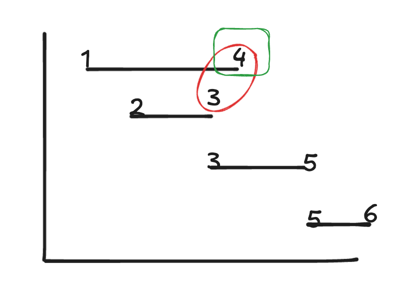

```python
class Solution:
    def merge(self, intervals: List[List[int]]) -> List[List[int]]:
        ans = []
        intervals.sort(key=lambda x: x[0])
        ans.append(intervals[0])
        for i in range(1, len(intervals)):
            # 如果上一个数组的右边界大于等于当前数组的左边界，说明有重叠了
            if intervals[i][0] <= ans[-1][1]:
                # 合并
                ans[-1][1] = max(ans[-1][1], intervals[i][1])
            else:
                ans.append(intervals[i])

        return ans


    def merge2(self, intervals):
        ans = []
        intervals.sort(key=lambda x: x[0])
        for p in intervals:
            if ans and p[0] <= ans[-1][1]:
                # 更新右端点最大值，继续下一轮循环
                ans[-1][1] = max(ans[-1][1], p[1])
            else:
                ans.append(p)

        return ans
```

# 单调栈

## [739. 每日温度](https://leetcode.cn/problems/daily-temperatures/)

```
class Solution:
    def dailyTemperatures(self, temperatures: List[int]) -> List[int]:
        n = len(temperatures)
        ans = [0] * n
        # 及时去掉无用数据，保证栈中数据有序

        stack = []
        for i, t in enumerate(temperatures):
            # 遇到比栈定大的元素，就循环出栈，计算间隔天数，就是结果
            while stack and t > temperatures[stack[-1]]:
                j = stack.pop()
                ans[j] = i - j

            stack.append(i)

        return ans
```

## [42. 接雨水](https://leetcode.cn/problems/trapping-rain-water/)

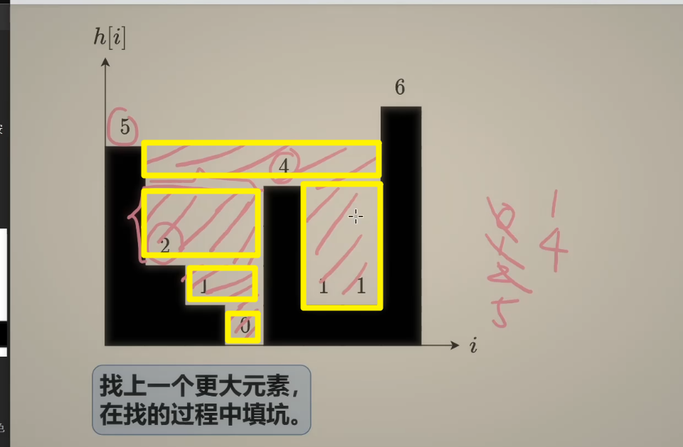

```python
class Solution:
    def trap(self, height: List[int]) -> int:
        ans = 0
        st = []

        for i, h in enumerate(height):
            while st and h >= height[st[-1]]:
                bootom_h = height[st.pop()]
                if len(st) == 0:
                    break
                left = st[-1]
                dh = min(height[left], h) -bootom_h
                ans += dh * (i - left -1)
            st.append(i)

        return ans
```

# 单调队列

## [239. 滑动窗口最大值](https://leetcode.cn/problems/sliding-window-maximum/)

```python
class Solution:
    def maxSlidingWindow(self, nums: List[int], k: int) -> List[int]:
        ans = []
        q = deque()

        for i, x in enumerate(nums):
            # 1. 入队
            # 当前值，大于队列，移除队列中比当前值小的数据，保证队列里的数据单调递减，且栈口是最大值
            while q and x >= nums[q[-1]]:
                q.pop()

            # 注意队列里记录的是下标
            q.append(i)

            # 2. 出队，当i-q[0] >= k: s说明达到窗口限制了,将栈口推出
            if i - q[0] >= k:
                q.popleft()

            # 3. 记录结果
            if i >= k-1:
                ans.append(nums[q[0]])

        return ans
```

# [459. 重复的子字符串](https://leetcode.cn/problems/repeated-substring-pattern/)

```python
class Solution:
    def repeatedSubstringPattern(self, s: str) -> bool:
        return (s+s).find(s, 1) != len(s)
```

## KMP 算法的理论基础

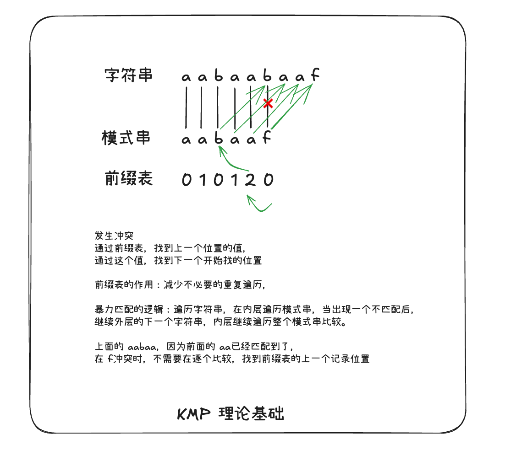

# 动态规划

## 方法论建设

1. dp 数组以及下标的含义
2. 递推公式
3. dp 数组如何初始化
4. 遍历顺序
   1. 排列和组合的遍历顺序是不相同的，一个是树层遍历(排列)， 一个是树枝遍历(组合)
5. 打印 dp 数组 (出现问题后，打印 dp 数组，分析问题)

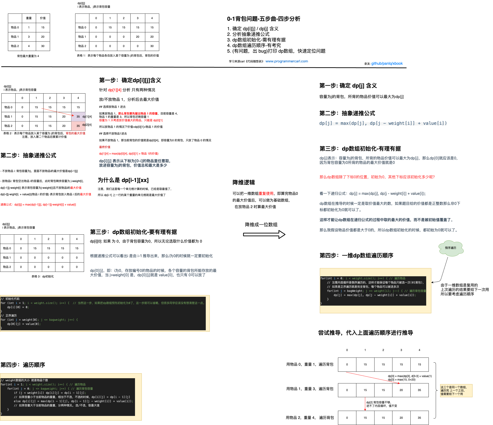

### 0-1 背包问题

#### dp 含义

dp[i][j]表示从下标[0-i]，任取一个，或两个，或三个等，每个物品只能放一次，放进容量为 j 的背包，能达到的最大价值总和是多少

#### 递推公式

> dp[i][j] = max(dp[i-1][j], dp[i-1]j-weight[i]] + value[i])

- **不放物品 i** ：背包容量为 j，里面不放物品 i 的最大价值是 dp[i - 1][j]。
- **放物品 i** ：背包空出物品 i 的容量后，背包容量为 j - weight[i]，dp[i - 1]j - weight[i]] 为背包容量为 j - weight[i]且不放物品 i 的最大价值，那么 dp[i - 1]j - weight[i]] + value[i] （物品 i 的价值），就是背包放物品 i 得到的最大价值

#### 降维成一维数组

一维 dp 数组，其实就上上一层 dp[i-1] 这一层 拷贝的 dp[i]来。

> dp[j] = max(dp[j], dp[j-weight[i] + value[i])

dp[j] 含义》》容量为 j 的背包，所背的物品价值可以最大为 dp[j]。

#### 遍历顺序

```python
# 0-1背包
# 遍历物品
for i in range(len(weight)):
    # 倒序遍历可用的背包容量
    for j in range(bagWeight, weight[i]-1, -1):
        # 更新背包容量为j的最大价值
        dp[j] = max(dp[j], dp[j-weight[i]] + value[i])
```

### 完全背包问题

#### dp 含义

dp[i][j] 表示从下标[0-i]的物品，每个物品可以去无限次，放进容量为 j 的背包，能达到的最大价值总和是多少

#### 递推公式

> dp[i][j] = max(dp[i-1][j], dp[i]j-weight[i] + value[i])

- **不放物品 i** ：背包容量为 j，里面不放物品 i 的最大价值是 dp[i - 1][j]。
- **放物品 i** ：背包空出物品 i 的容量后，背包容量为 j - weight[i]，dp[i]j - weight[i]] 为背包容量为 j - weight[i]且不放物品 i 的最大价值，那么 dp[i]j - weight[i]] + value[i] （物品 i 的价值），就是背包放物品 i 得到的最大价值

#### 降维成一维数组

> dp[j] = max(d[j], dp[j-weight[i]]+value[i])

dp[j]含义》容量为 j 的背包，所背的物品价值可以最大为 dp[j]，物品可以重复放入

#### 遍历顺序

```python
# 完全背包
# 遍历物品
for i in range(len(weight)):
    # 正序遍历可用的背包容量
    for j in range(weight[i], bagWeight+1):
        # 更新背包容量 j 的最大价值
        dp[j] = max(dp[j], dp[j-weight[i]]+value[i])
```

## [509. 斐波那契数](https://leetcode.cn/problems/fibonacci-number/)

```python
class Solution:
    def fib2(self, n: int) -> int:
        if n <= 1:
            return n

        # 初始化dp数组
        dp = [0] * (n+1)
        dp[0], dp[1] = 0, 1

        for i in range(2, n+1):
            # 递推公式
            dp[i] = dp[i-1] + dp[i-2]

        return dp[n]

    def fib(self, n):
        if n <= 1:
            return n

        dp = [0]*2
        dp[0] = 0
        dp[1] = 1
        for i in range(2, n+1):
            total = dp[0]+dp[1]
            dp[0] = dp[1]
            dp[1] = total

        return dp[1]
```

## [118. 杨辉三角](https://leetcode.cn/problems/pascals-triangle/)


```python
class Solution:
    def generate(self, numRows: int) -> List[List[int]]:
        # dp 含义
        # dp[i][j] 第i行第j列的数值
        # dp 递推公式
        # dp[i][j] = dp[i-1][j-1]+dp[i-1][j]
        # dp数组初始化
        # 数组第一位和最后一位都是1，所以可以把初始元素都赋值为1，置于有个元素可以看到
        # 第一行1个，第二行2个，第三行3个..., 所以从第二行开始计算
        dp = [[1]*(i+1) for i in range(numRows)]
        # 遍历顺序
        for i in range(2, numRows):
            for j in range(1, i):
                # 左上方的数+正上方的数
                dp[i][j] = dp[i-1][j-1]+dp[i-1][j]

        return dp
```

## [70. 爬楼梯](https://leetcode.cn/problems/climbing-stairs/)

```python
class Solution:
    def climbStairs(self, n: int) -> int:
        # dp含义
        # dp[i]含义 达到i阶有dp[i]种方法
        # dp[i-2]
        # 递推公式 dp[i] = dp[i-2]+dp[i-1]
        if n <= 1:
            return n

        dp = [0]*(n+1)
        # 从1开始表示1阶有一种方法，2阶有两种方法
        dp[1], dp[2] = 1, 2
        for i in range(3, n+1):
            dp[i] = dp[i-2] + dp[i-1]

        return dp[n]
```

## [746. 使用最小花费爬楼梯](https://leetcode.cn/problems/min-cost-climbing-stairs/)

```
class Solution:
    def minCostClimbingStairs(self, cost: List[int]) -> int:
        # dp含义
        # dp[i] 到达i位置cost为dp[i]
        # 数组初始化
        dp = [0] * (len(cost)+1)
        # 初始值，表示从起点开始不需要花费体力
        dp[0],dp[1] = 0, 0
        for i in range(2, len(cost)+1):
            # 在第i步，可以选择从前一步（i-1）花费体力到达当前步，或者从前两步（i-2）花费体力到达当前步
            # 选择其中花费体力较小的路径，加上当前步的花费，更新dp数组
            dp[i] = min(dp[i-1]+cost[i-1], dp[i-2]+cost[i-2])

        return dp[-1]
```

## [62. 不同路径](https://leetcode.cn/problems/unique-paths/)


```python
class Solution:
    def uniquePaths(self, m: int, n: int) -> int:
        # dp含义
        # dp[i][j] 表示到第i行第j列有几种方法
        # dp初始化
        dp = [[0]* n for _ in range(m)]

        # 设置第一行和第一列的初始值
        # 为什么都是1，题目说了只能往左或者往下走，所以横着走或者竖着走只有1种方法
        for i in range(m):
            dp[i][0] = 1

        for j in range(n):
            dp[0][j] = 1

        # 递推公式
        for i in range(1, m):
            for j in range(1, n):
                dp[i][j] = dp[i-1][j] + dp[i][j-1]

        # 返回右下角单元格的值
        return dp[m-1][n-1]
```

## [63. 不同路径 II](https://leetcode.cn/problems/unique-paths-ii/)

```python
class Solution:
    def uniquePathsWithObstacles(self, obstacleGrid: List[List[int]]) -> int:
        m = len(obstacleGrid)
        n = len(obstacleGrid[0])
        # 第一个各自和最后一个格子有障碍物，直接return
        if obstacleGrid[m-1][n-1] == 1 or obstacleGrid[0][0] == 1:
            return 0

        # dp初始化
        # 设置第一行和第一列的初始值
        # 为什么都是1，题目说了只能往左或者往下走，所以横着走或者竖着走只有1种方法
        # 遇到障碍物后面的都走不了了
        # dp初始化
        dp = [[0]* n for _ in range(m)]
        for i in range(m):
            if obstacleGrid[i][0] == 0:
                dp[i][0] = 1
            else:
                # 有障碍物，后面的都是0
                break

        for j in range(n):
            if obstacleGrid[0][j] == 0:
                dp[0][j] = 1
            else:
                break

        # 递推公式
        for i in range(1, m):
            for j in range(1, n):
                # 有障碍物走不了
                if obstacleGrid[i][j] == 1:
                    continue
                dp[i][j] = dp[i-1][j] + dp[i][j-1]

        # 返回右下角单元格的值
        return dp[m-1][n-1]

```

## [416. 分割等和子集](https://leetcode.cn/problems/partition-equal-subset-sum/)

```python
class Solution:
    def canPartition(self, nums: List[int]) -> bool:
        # 题目说分割成两个子集，且和相等，说明和要能整除2，不然分割不了
        if sum(nums) % 2 != 0:
            return False

        target = sum(nums) // 2

        # dp含义
        # dp[j] 容量为j最大值为dp[j]

        # dp递推公式
        # dp[j] = max(dp[j], dp[j-nums[i]]+nums[i])
        dp = [0] * (target + 1)
        for num in nums:
            # 倒序到num-1 就表示 j>=num; 背包容量小于num的数据不用计算
            for j in range(target, num-1, -1):
                dp[j] = max(dp[j], dp[j-num] + num)

        return True if dp[target] == target else False
```

## [518. 零钱兑换 II](https://leetcode.cn/problems/coin-change-ii/)

使用组合背包问题解决，背包容量为 5， 有物品[1,2,5]，放满容量为 5 的背包有几种方式

```python
class Solution:
    def change(self, amount: int, coins: List[int]) -> int:

        dp = [0] * (amount + 1)
        dp[0] = 1

        # 遍历物品
        for i in range(len(coins)):
            # 遍历背包，从可用容量开始遍历
            for j in range(coins[i], amount+1):
                dp[j] = dp[j] + dp[j-coins[i]]

        return dp[amount]
```

## [198. 打家劫舍](https://leetcode.cn/problems/house-robber/)

<pre><strong>输入：</strong>[2,7,9,3,1]
<strong>输出：</strong>12
<strong>解释：</strong>偷窃 1 号房屋 (金额 = 2), 偷窃 3 号房屋 (金额 = 9)，接着偷窃 5 号房屋 (金额 = 1)。
     偷窃到的最高金额 = 2 + 9 + 1 = 12 。</pre>

### 分析递推公式

dp[i]含义： 当偷到下标 i 时，能获得的最大金额

假设现在投到最后一个位置 4 -> dp[4]

- 如果偷下标 4，能获得的最大金额为 dp[4-2] + nums[4]
- 如果不偷下标 4，能获得的最大金额为 dp[4-1]

抽象递推公式

> dp[i] = max(dp[i-1), dp[i-2] + nums[i])

### dp 初始化

根据递推公式，需要 i-2，所以我们最好就好 0，2 给初始化了

dp[0]=nums[0]

dp[1]=max(nums[0], nums[1])

```python
class Solution:
    def rob(self, nums: List[int]) -> int:
        if len(nums) == 1:
            return nums[0]
        dp = [0] * (len(nums))
        dp[0] = nums[0]
        dp[1] = max(nums[0], nums[1])
        for i in range(2, len(nums)):
            dp[i] = max(dp[i-1], dp[i-2] + nums[i])

        return dp[-1]
```

## [213. 打家劫舍 II](https://leetcode.cn/problems/house-robber-ii/)

将首尾相连了

<pre><strong>输入：</strong>[2,7,9,3,1]
<strong>输出：</strong>12
<strong>解释：</strong>偷窃 1 号房屋 (金额 = 2), 偷窃 3 号房屋 (金额 = 9)，接着偷窃 5 号房屋 (金额 = 1)。
     偷窃到的最高金额 = 2 + 9 + 1 = 12 。</pre>

### 分析情况：如果首尾相连，怎么考虑

分三种情况考虑

一：首尾都不选，那么就是考虑 nums[1:-1]

二：选首不选尾，那么就是考虑 nums[1:]

三：选尾不选首，那么就是考虑 nums[:-1]

注意上面说的选，只是说考虑选首，或者考虑选尾，或者考虑首尾都不选，最终偷不偷，是由递推公式计算的

最后在给三种情况取个最大值，注意[1:-1]，穿进去可能是空数组

```python
class Solution:
    def rob(self, numss: List[int]) -> int:
        if len(numss) == 1:
                return numss[0]

        def dfs(nums):
            if len(nums) == 0:
                return 0
            if len(nums) == 1:
                return nums[0]
            dp = [0] * (len(nums))
            dp[0] = nums[0]
            dp[1] = max(nums[0], nums[1])
            for i in range(2, len(nums)):
                dp[i] = max(dp[i-1], dp[i-2] + nums[i])

            return dp[-1]

        return max(dfs(numss[1:-1]), dfs(numss[1:]), dfs(numss[:-1]))
```

### 继续分析

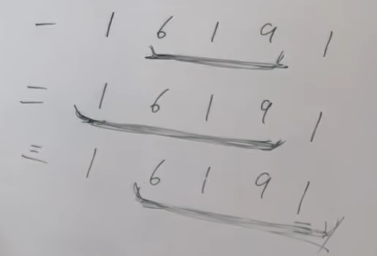

可以注意到

[1:] 的区间其实是包含[1:-1]的，[:-1]也是包含[1:-1]的，所以可以值计算 nums[1:]和 nums[:-1]

```python
class Solution:
    def rob(self, numss: List[int]) -> int:
        if len(numss) == 1:
                return numss[0]

        def dfs(nums):
            if len(nums) == 1:
                return nums[0]
            dp = [0] * (len(nums))
            dp[0] = nums[0]
            dp[1] = max(nums[0], nums[1])
            for i in range(2, len(nums)):
                dp[i] = max(dp[i-1], dp[i-2] + nums[i])

            return dp[-1]

        return max(dfs(numss[1:]), dfs(numss[:-1]))
```

# 树形 dp

## [337. 打家劫舍 III](https://leetcode.cn/problems/house-robber-iii/)

[视频解答思路》》](https://www.bilibili.com/video/BV1H24y1Q7sY)


在递归二叉树的是偶，分析节点偷或者不偷

```python
# Definition for a binary tree node.
# class TreeNode:
#     def __init__(self, val=0, left=None, right=None):
#         self.val = val
#         self.left = left
#         self.right = right
class Solution:
    def rob(self, roott: Optional[TreeNode]) -> int:

        def dfs(root):
            # 定义一个长度为2的数组，dp[0]表示不偷时的最高金额，dp[1]表示偷时的最高金额
            dp = [0] * 2

            # 退出条件，遍历到叶子节点了
            if root is None:
                return dp

            # 递归计算左节点
            leftdp = dfs(root.left)
            # 递归计算右节点
            rightdp = dfs(root.right)

            # 计算 偷当前节点的最高金额，偷了当前节点，则表示左右子节点都不能偷
            # 当前节点的价值+左节点不偷的最高金额+右节点不偷的最高金额
            dp[1] = root.val + leftdp[0] + rightdp[0]
            # 计算 不偷当前节点的最高金额，表示 偷/不偷 左右子节点 的最高金额总和
            # 左节点：偷/不偷的最高金额
            # 右节点：偷/不偷的最高金额
            dp[0] = max(leftdp[1], leftdp[0]) + max(rightdp[0], rightdp[1])

            return dp

        ans = dfs(roott)
        return max(ans[0], ans[1])
```

### **为什么后序遍历是自然选择？**

- **状态依赖关系** ：当前节点的状态依赖于子节点的状态，因此必须先处理子节点，再处理父节点，符合后序遍历的顺序。
- **递归的天然适配** ：递归函数的调用顺序天然形成后序遍历（先递归左子树，再递归右子树，最后处理当前节点）。
