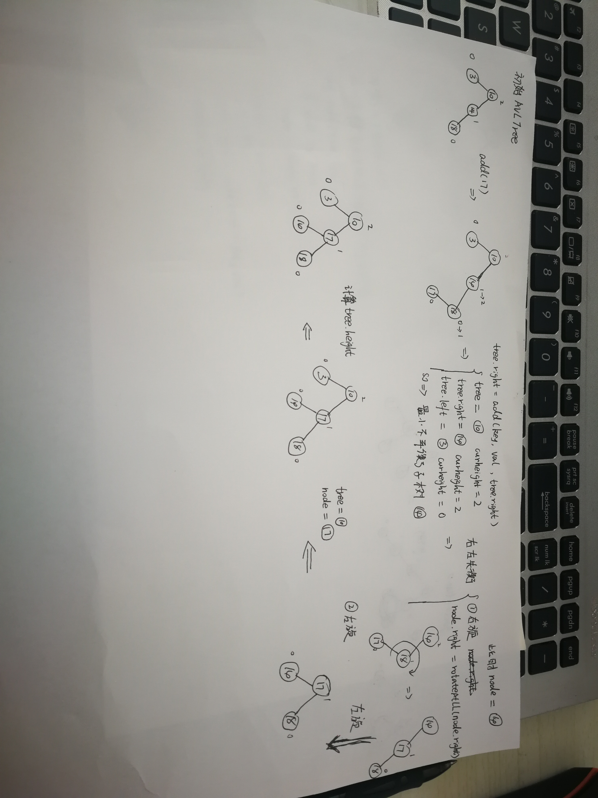

### 树的概念

树（英语：tree）是一种抽象数据类型（ADT）或是实作这种抽象数据类型的数据结构，用来模拟具有树状结构性质的数据集合。它是由 n（n>=1）个有限节点组成一个具有层次关系的集合。把它叫做“树”是因为它看起来像一棵倒挂的树，也就是说它是根朝上，而叶朝下的。它具有以下的特点：

- 每个节点有零个或多个子节点；
- 没有父节点的节点称为根节点；
- 每一个非根节点有且只有一个父节点；
- 除了根节点外，每个子节点可以分为多个不相交的子树；
- **节点的度**：一个节点含有的子树的个数称为该节点的度；
- **树的度**：一棵树中，最大的节点的度称为树的度；
- **叶节点或终端节点**：度为零的节点；
- **父亲节点或父节点**：若一个节点含有子节点，则这个节点称为其子节点的父节点；
- **孩子节点或子节点**：一个节点含有的子树的根节点称为该节点的子节点；
- **兄弟节点**：具有相同父节点的节点互称为兄弟节点；
- **节点的层次**：从根开始定义起，根为第 1 层，根的子节点为第 2 层，以此类推；
- **树的高度或深度**：树中节点的最大层次；
- **堂兄弟节点**：父节点在同一层的节点互为堂兄弟；
- **节点的祖先**：从根到该节点所经分支上的所有节点；
- **子孙**：以某节点为根的子树中任一节点都称为该节点的子孙。
- **森林**：由 m（m>=0）棵互不相交的树的集合称为森林；

### 二叉树

每个节点最多含有两个子树的树称为二叉树

- 平衡二叉树（AVG 树）: 当且仅当任何节点的两棵子树的高度差不大于 1 的二叉树
- 完全二叉树: 对于一颗二叉树，假设其深度为 d(d>1)。除了第 d 层外，其它各层的节点数目均已达最大值，且第 d 层所有节点从左向右连续地紧密排列，这样的二叉树被称为完全二叉树，其中满二叉树的定义是所有叶节点都在最底层的完全二叉树;
- 排序二叉树: (二叉查找数 Binary Search Tree), 也称二叉搜索树，有序二叉树，任意一个结点左边子节点的数据要比根结点的值小，右边子节点的数据要比根结点的值大。**但是如果二叉树是单增的情况会退化成链表**

### 二叉树的遍历

1. 深度优先遍历

- 先序遍历 preorder 在先序遍历中，我们先访问根节点，然后递归使用先序遍历访问左子树，再递归使用先序遍历访问右子树 根节点->左子树->右子树
- 中序遍历 inorder 在中序遍历中，我们递归使用中序遍历访问左子树，然后访问根节点，最后再递归使用中序遍历访问右子树 左子树->根节点->右子树
- 后序遍历 postorder 在后序遍历中，我们先递归使用后序遍历访问左子树和右子树，最后访问根节点 左子树->右子树->根节点
  )

2. 广度优先遍历（层次遍历）

### 二叉树反推

如果已知**_中序和先序，或者中序和后序_**，可以确定二叉树的结构
eg:
先序：A B C D E F
中序: C B A E D F

1. 先序找根，中序定两边
   先序遍历序列为 ABCDEF，第一个字母是 A 被打印出来，就说明 A 是根结点的数据。
   再由中序遍历序列是 CBAEDF，可以知道 C 和 B 是 A 的左子树的结点，
   E、D、F 是 A 的右子树的结点

然后我们看先序中的 C 和 B，它的顺序是 A**BC**DEF，B 是在 C 的前面打印，所以 B 应该是 A 的左孩子，而 C 就只能是 B 的孩子，此时是左还是右孩子还不确定。再看中序序列是**CB**AEDF，C 是在 B 的前面打印，这就说明 C 是 B 的左孩子，否则就是右孩子了

再看先序中的 E、D、F，它的顺序是 ABC**DEF**，那就意味着 D 是 A 结点的右孩子，E 和 F 是 D 的子孙，注意，它们中有一个不一定是孩子，还有可能是孙子的。再来看中序序列是 CBA**EDF**，由于 E 在 D 的左侧，而 F 在右侧，所以可以确定 E 是 D 的左孩子，F 是 D 的右孩子

如果已经先序和后序无法判断二叉树结构：

先序序列:ABC

后序序列:CBA

**我们可以确定 A 一定是根结点，但接下来，我们无法知道，哪个结点是左子树，哪个是右子树**

### 二叉查找树(二叉搜索树)

节点的左子树只包含小于当前节点的数。

节点的右子树只包含大于当前节点的数。

**_所有左子树和右子树自身必须也是二叉搜索树_**

[Python 实现二叉查找树](./binary-search-tree.py)

参考以下两篇文章（**最好是自己画图**）:

- [6 天通吃树结构—— 第一天 二叉查找树](https://www.cnblogs.com/huangxincheng/archive/2012/07/21/2602375.html)
- [二叉排序树、红黑树、AVL 树最简单的理解](https://juejin.im/entry/58f4268f61ff4b0058fcb190)

### 二叉平衡树

[Python 实现平衡二叉树](./AVL-tree.py)

平衡二叉树  （Height-Balanced Binary Search Tree）  是一种二叉排序树，

其中**每一个结点的左子树和右子树的高度差不超过 1（小于等于 1）**

二叉树的平衡因子  （Balance Factor）  等于该结点的左子树深度减去右子树深度的值称为平衡因子。平衡因子只可能是[－1，0，1]。距离插入结点最近的，且平衡因子的绝对值大于 1 的结点为根的子树，称为最小不平衡子树

平衡二叉树就是二叉树的构建过程中，每当插入一个结点，看是不是因为树的插入破坏了树的平衡性，若是，则找出最小不平衡树。在保持二叉树特性的前提下，**调整最小不平衡子树中各个结点之间的链接关系**，进行相应的旋转，使之成为新的平衡子树。简记为： **步步调整，步步平衡**

参考以下两篇文章（**最好是自己画图**）:

> **注：**第一篇文章中针对左右失衡和右左失衡的处理图片和代码中有误，但是主要是看个人理解，作者可以只对根节点进行失衡处理，而我这边是按照第二篇文章说的，**调整最小不平衡子树**

- [6 天通吃树结构—— 第二天 平衡二叉树](https://www.cnblogs.com/huangxincheng/archive/2012/07/22/2603956.html)
- [二叉排序树、红黑树、AVL 树最简单的理解](https://juejin.im/entry/58f4268f61ff4b0058fcb190)

对于其中添加元素的递归代码的理解:

### 霍夫曼树

（用于信息编码）：带权路径最短的二叉树称为哈夫曼树或最优二叉树；
应用: 压缩文件

### B 树(B-Tree)

一种对读写操作进行优化的自平衡的二叉查找树，能够保持数据有序，拥有多余两个子树。B 树是多路平衡查找树，2 阶 B 树才是平衡二叉树
应用: 数据库存储

M 阶的 Btree 的几个重要特性：

1. 节点最多含有 m 棵字树(指针), m-1 个关键字(存的数据，空间)（m > 2）
2. 除根节点和叶子节点外，其他每个节点至少有 ceil（m / 2）个子节点，（ceil 为上取整）
3. 若根节点不是叶子节点，则至少有两棵子树

M 阶: 这个由磁盘的页大小决定，页内存是 4KB, 好处是一次性取数据就可以取出这个节点即这个页数据，不会造成 IO 读取的浪费。

### B+Tree

1. 每个节点最多有 m 个子节点
2. 除根节点外，每个节点至少有 m/2 个子节点，注意如果结果除不尽，就取上蒸，如 5/2=3
3. 根节点要么是空，要么是独根，否则至少有 2 个子节点
4. 有 k 个子节点的节点必有 k 个关键字
5. 叶节点的高度一致
6. 叶子节点存数据，非叶子节点存索引键

适合大数据的磁盘索引，经典的 MySQL，所有的数据都存在叶子节点，其他上层节点都是索引，增加了系统的稳定性以及遍历查找效率。叶子节点之间是双向指针，这一点就有利于范围查找。

### B-tree&B+tree 对比

- **节点数据存储方**：B-tree 的每个节点既存储键（key），也存储数据（data）；而 B+tree 只有叶子节点存储数据，非叶子节点仅存储键，这样使得 B+tree 的非叶子节点能够存储更多的键，从而降低树的高度
- 节点数据量：由于 B+tree 的非叶子节点不存储数据，所以相比 B-tree，B+tree 单个非叶子节点能存储的数据量更大。在相同的内存空间下，B+tree 可以拥有更高的扇出（fan-out），即每个节点能有更多的子节点
- 磁盘 I/O 效率：B+tree 在磁盘 I/O 效率上更具优势。因为 B+tree 的叶子节点形成了一个有序链表，范围查询时可以沿着链表顺序访问，减少磁盘 I/O 次数。而 B-tree 在范围查询时，可能需要在多个节点间跳跃，增加了磁盘 I/O 的开销。
- **搜索复杂度** ：B-tree 的搜索复杂度为 O (logdN)，其中 d 为节点的度数，N 为节点数量。B+tree 的搜索复杂度也是 O (logdN)，但由于 B+tree 的结构特点，在范围查询时，B+tree 的效率更高

**MyISAM 存储引擎的数据结构（非聚集）**

索引文件和数据文件是分离的，非聚集（非聚族）

.MYD 存储数据的文件

.MYI 存储索引的文件

.FRM 表结构文件，管理索引和数据的框架

**InnoDB 索引的实现（聚集）**

- 表数据本身就是按 B+Tree 组织的一个索引结构文件
- 聚集索引-叶子节点包含了完整的数据记录，**索引跟数据合并，MySQL 默认节点大小为 16KB，所以说高度为 3 的 B+树就能够存储千万级别的数据。**
- 为什么 InnoDB 表必须有主键，并且推荐使用整形的自增主键？
  - 整形存储占用比较少，且比较容易，如果是 uuid 字符串还需要进行转换且占用空间大
  - 使用自增是为了避免二叉树的频繁自平衡分裂，自增主键，只需要每次都忘后面增加即可，不会造成大范围的性能开销
- 为什么非主键索引结构叶子节点存储的是主键值？（一直性）
  - 减少数据冗余和存储空间：如果辅助索引的叶子节点存储的是实际的行数据，那么每创建一个辅助索引，都会重复存储整行数据，造成大量的数据冗余和存储浪费。通过存储主键值，InnoDB 只需维护一个较小的主键索引，这样即使有多个辅助索引也不会显著增加存储开销。
  - 提高查询效率：
    在使用辅助索引进行查询时，InnoDB 首先通过辅助索引找到对应的主键值，然后通过主键值快速定位到聚簇索引中的实际行数据。
    这种方式叫做“回表”操作（即通过辅助索引找到主键值，再通过主键值访问聚簇索引中的行数据），尽管增加了一次访问，但仍然比直接存储行数据的冗余方式更高效和灵活。
  - 保持索引的一致性和易维护性：
    当行数据发生变化（如插入、删除或更新）时，只需更新聚簇索引中的数据和相关辅助索引中的主键值，减少了数据一致性和维护的复杂度。

**联合索引的底层存储结构**

参考[B 站-100 分钟讲透 MySQL 索引底层原理](https://www.bilibili.com/video/BV1aE41117sk?p=5)

参考:[MySQL 底层索引算法](https://www.bilibili.com/video/BV1AE41117R5?p=8)

参考:[为什么 MySQL 使用 B+ 树](https://draveness.me/whys-the-design-mysql-b-plus-tree/)

参考:[MYSQL-B+TREE 索引原理-详细解释了 SQL 语句的执行过程](https://www.jianshu.com/p/486a514b0ded)

### 常见树的应用场景

1. xml，html 等，那么编写这些东西的解析器的时候，不可避免用到树
2. 路由协议就是使用了树的算法
3. mysql 数据库索引
4. 文件系统的目录结构
5. 所以很多经典的 AI 算法其实都是树搜索，此外机器学习中的 decision tree 也是树结构

### 堆

堆是一种完全二叉树，分为大根堆和小根堆

- 大根堆: 每个节点的值都大于或等于左右子节点
- 小根堆: 每个节点的值都小于或等于左右子节点

### 红黑树

二叉平衡树-内存查找高效树，适合一些底层系统做内存运算。数据量大的时候，红黑树层数很大，如果存储在磁盘中，取数据会消耗大量 IO

不适合磁盘存储的数据，也不适合存储大量的数据，因为 IO 浪费太大，读取的资源也浪费很大。HashMap 底层就是红黑树，因为 HashMap 实在内存中而不是磁盘，所以 MySQL 不使用红黑树最为存储的数据结构。

#### [数据结构动图展示网站](https://www.cs.usfca.edu/~galles/visualization/Algorithms.html)
