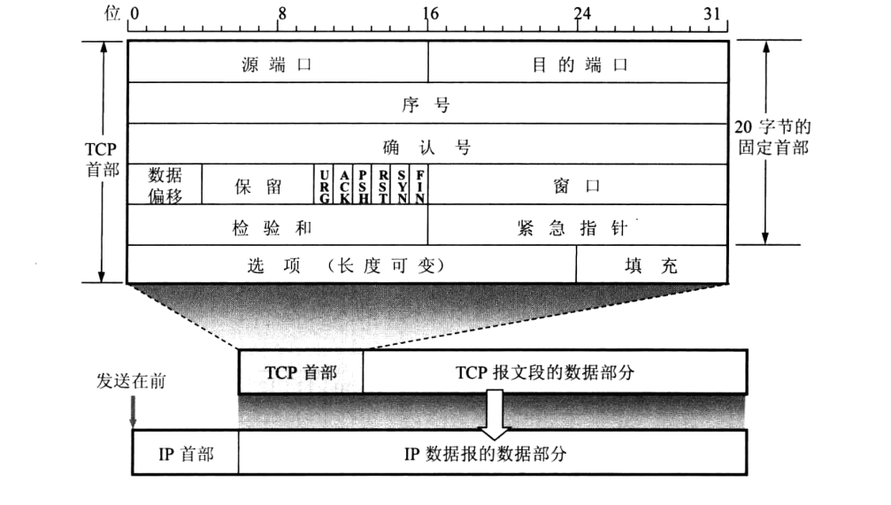
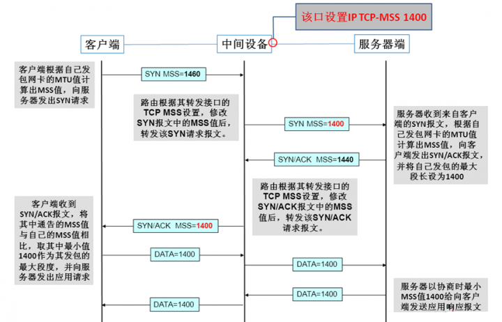
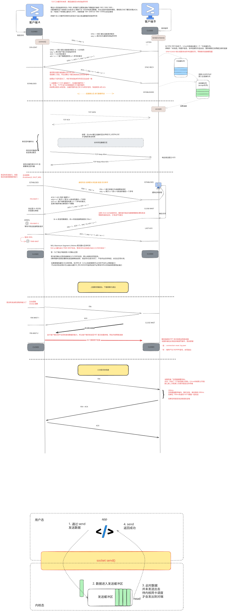
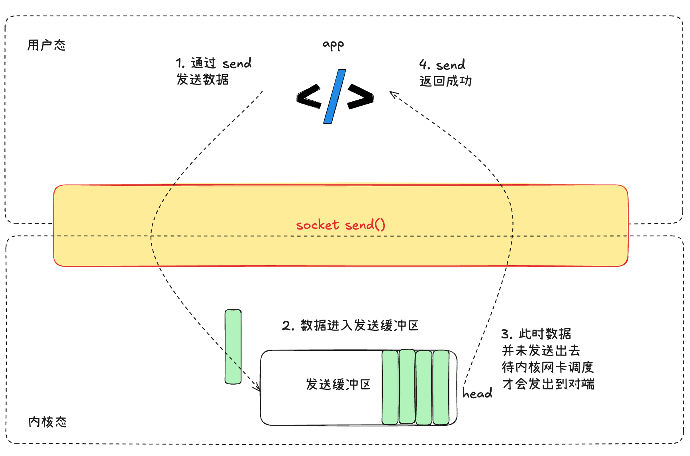
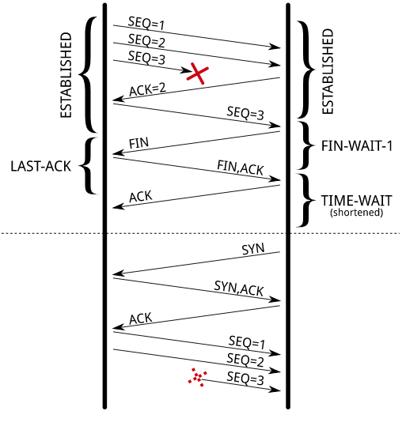
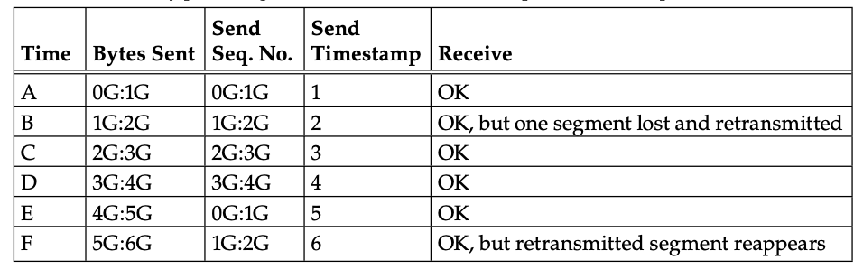

# TCP 基本认识



## TCP 头格式

- 序列号：在建立连接时由计算机生成的随机数作为其初始值，通过 SYN 包传给接收端主机，每发送一次数据，就「累加」一次该「数据字节数」的大小。「用来解决网络包乱序问题」。
- 确认应答号：指下一次「期望」收到的数据的序列号，发送端收到这个确认应答以后可以认为在这个序号以前的数据都已经被正常接收。「用来解决丢包的问题。」
- 控制位：

  - ACK：该位为 1 时，「确认应答」的字段变为有效，TCP 规定除了最初建立连接时的 SYN 包之外该位必须设置为 1 。
  - RST：该位为 1 时，表示 TCP 连接中出现异常必须强制断开连接。
  - SYN：该位为 1 时，表示希望建立连接，并在其「序列号」的字段进行序列号初始值的设定。
  - FIN：该位为 1 时，表示今后不会再有数据发送，希望断开连接。当通信结束希望断开连接时，通信双方的主机之间就可以相互交换 FIN 位为 1 的 TCP 段。

* 窗口：占 2 个字节，表示发送该报文段的一方能够接收的字节数，表明期望接受到的数据包字节数，用于拥塞控制。窗口值范围为[0:2^16−1]
* 校验和：占 2 个字节，用于检验报文段是否出错。发送方根据发送的报文段计算检验和填入报文段首部，接收方根据接收的报文段重新计算，如果不匹配，表明报文段出错
* 紧急指针：占 2 个字节，表示紧急数据的个数。在紧急状态下(URG 打开)，指出窗口中紧急数据的位置(末端)。
* 选项：用于支持一些特殊的变量，比如最大分组长度(MSS)，MSS 指的是数据的最大长度而不是 TCP 报文段长度。在将数据发送之前，会根据 MSS 将数据进行合理的切分，即单次发送的报文段中的数据不能超过 MSS，所以 MSS 应该适当调大一些以降低网络中的报文段个数

### ISN 序列号是如何随机产生的？

起始 ISN 是基于时钟的，每 4 微秒 + 1，转一圈要 4.55 个小时。

RFC793 提到初始化序列号 ISN 随机生成算法：ISN = M + F(localhost, localport, remotehost, remoteport)。

M 是一个计时器，这个计时器每隔 4 微秒加 1。
F 是一个 Hash 算法，根据源 IP、目的 IP、源端口、目的端口生成一个随机数值。要保证 Hash 算法不能被外部轻易推算得出，用 MD5 算法是一个比较好的选择。
可以看到，随机数是会基于时钟计时器递增的，基本不可能会随机成一样的初始化序列号。

所以每次建立 tcp 连接，初始化的序列号都是不一样的，才可以避免一下问题

- 防止历史报文被下一个相同四元组的连接接收
- 防止黑客伪造相同序列号的 TCP 报文

tcp 三次握手后交换双方的 ISN 后就开始通信了

- **ISN 只在连接初始化时使用** ，后续数据包的序列号是 `ISN + 已发送字节数`。TCP 序列号是一个 **32 位无符号整数** ，范围是 `0 ~ 2^32-1`（即 `0 ~ 4,294,967,295`）；
- 当序列号达到最大值（`4,294,967,295`）后， **下一个序列号会回绕到 `0`** ，而不是回到 ISN。大约每传送 4GB 的数据之后，序列号就会回到最初的值（也就是 ISN，因为当达到最大值时会再从 0 开始一直加到 ISN），如此循环往复。
- **ISN（Initial Sequence Number）** 仅在连接建立时（三次握手）由内核动态生成，后续数据传输的序列号递增，与 ISN 无关

## TCP 特性

TCP 是**面向连接的、可靠的、基于字节流**的传输层通信协议。

面向连接：一定是「一对一」才能连接，不能像 UDP 协议可以一个主机同时向多个主机发送消息，也就是一对多是无法做到的；

可靠的：无论网络的链路中出现什么样的链路变化，TCP 都可以保证一个报文一定能到达接收端；

字节流：用户消息通过 TCP 协议传输时，消息可能会被操作系统「分组」成多个的 TCP 报文，如果接收方的程序如果不知道**「消息的边界」**，是无法读出一个有效的用户消息的。并且 TCP 报文是「有序的」，当「前一个」TCP 报文没有收到的时候，即使它先收到了后面的 TCP 报文，那么也不能扔给应用层去处理，同时对「重复」的 TCP 报文会自动丢弃。

> Q: [为什么 TCP 协议有粘包问题](https://draveness.me/whys-the-design-tcp-message-frame/)？

TCP 协议粘包问题是因为应用层协议开发者的错误设计导致的，他们忽略了 TCP 协议数据传输的核心机制 — 基于字节流，其本身不包含消息、数据包等概念，所有数据的传输都是流式的，需要应用层协议自己设计消息的边界，即消息帧（Message Framing），我们重新回顾一下粘包问题出现的核心原因：

1. TCP 协议是基于字节流的传输层协议，其中不存在消息和数据包的概念；
2. 应用层协议没有使用基于长度或者基于终结符的消息边界，导致多个消息的粘连；

**解决粘包问题的方法： 在应用层协议中，最常见的两种解决方案就是基于长度或者基于终结符（Delimiter），HTTP 协议的消息边界就是基于长度实现的：**

```http
HTTP/1.1 200 OK
Content-Type: text/html; charset=UTF-8
Content-Length: 138
```

[理解字节序-阮一峰](https://www.ruanyifeng.com/blog/2016/11/byte-order.html)

[脑残式网络编程入门(九)：面试必考，史上最通俗大小端字节序详解](http://www.52im.net/thread-3101-1-1.html)

socket 通信案例》》》[socket-example(py and golang)](./socket-example/node.md)

## 什么是 TCP 连接

用于保证可靠性和流量控制维护的某些状态信息，这些信息的组合，包括 Socket、序列号和窗口大小称为连接。

- **Socket** ：由 IP 地址和端口号组成
- **序列号** ：用来解决乱序问题等
- **窗口大小** ：用来做流量控制

## 窗口大小

[ **MSS** （Maximum Segment Size）](https://forum.huawei.com/enterprise/zh/thread-287745.html)：MSS 是 TCP 选项中最经常出现，也是最早出现的选项。MSS 选项占 4byte。MSS 是每一个 TCP 报文段中数据字段的最大长度，注意：只是数据部分的字段，不包括 TCP 的头部。TCP 在三次握手中，每一方都会通告其期望收到的 MSS（MSS 只出现在 SYN 数据包中）如果一方不接受另一方的 MSS 值则定位默认值 536byte。
MSS 值太小或太大都是不合适。太小，例如 MSS 值只有 1byte，那么为了传输这 1byte 数据，至少要消耗 20 字节 IP 头部+20 字节 TCP 头部=40byte，这还不包括其二层头部所需要的开销，显然这种数据传输效率是很低的。MSS 过大，导致数据包可以封装很大，那么在 IP 传输中分片的可能性就会增大，接受方在处理分片包所消耗的资源和处理时间都会增大，如果分片在传输中还发生了重传，那么其网络开销也会增大。因此合理的 MSS 是至关重要的。MSS 的合理值应为保证数据包不分片的最大值，对于以太网 MSS 可以达到 1460byte，在 IP 层中有一个类似的概念，MTU(Maximum Transfer Unit)

MTU=MSS+TCP Header + IP Header = 1500 字节



### _为什么需要 MSS?_

主要是为了最大程度的保证传输的高效和稳定性

那么 MTU 和 MSS 又有什么必然联系呢？虽然 MTU 限制了 IP 层的报文大小，但分层网络模型本来不就是为了对上层提供透明的服务么？即使一个很大的 TCP 报文传递给 IP 层，IP 层也应该可以经过分段等手段成功传输报文才对。

理论上来说是没错的，UDP 中就不存在 MSS，UDP 生成任意大的 UDP 报文，然后包装成 IP 报文根据底层网络的 MTU 分段进行发送。

MSS 存在的本质原因就是 TCP 和 UDP 的根本不同：

_TCP 提供**稳定**的连接。假设生成了很大的 TCP 报文，经过 IP 分段进行发送，而其中一个 IP 分段丢失了，则 TCP 协议需要重发整个 TCP 报文，造成了严重的网络性能浪费，_ 而相对的由于 UDP 无保证的性质，即使丢失了 IP 分段也不会进行重发。

所以说， **_MSS 存在的核心作用，就是避免由于 IP 层对 TCP 报文进行分段而导致的性能下降_** 。

通常将 MSS 设置为 MTU-40（20 字节 IP 头部+20 字节 TCP 头部），在 TCP 建立连接时由连接双方商定，双方得到的 MSS 值可能并不相同，建立 MSS 所基于 MTU 的值基于[路径 MTU 发现机制](https://en.wikipedia.org/wiki/Path_MTU_Discovery)获取。

参考：

[TCP 报文段首部格式](https://blog.csdn.net/sinat_35261315/article/details/79426867)

[TCP Maximum Segment Size (MSS)](http://blog.kongfy.com/2015/07/tcp-maximum-segment-size-mss/)

[**TCP Maximum Segment Size (MSS) and Relationship to IP Datagram Size**](http://www.tcpipguide.com/free/t_TCPMaximumSegmentSizeMSSandRelationshiptoIPDatagra-2.htm)

## 如何确定一个 tcp 连接？

TCP 四元组

- 源地址
- 源端口
- 目的地址
- 目的端口

源地址和目的地址的字段（32 位）是在 IP 头部中，作用是通过 IP 协议发送报文给对方主机。

源端口和目的端口的字段（16 位）是在 TCP 头部中，作用是告诉 TCP 协议应该把报文发给哪个进程。

> Q: 有一个 IP 的服务端监听了一个端口，它的 TCP 的最大连接数是多少？

服务端通常固定在某个本地端口上监听，等待客户端的连接请求。因此，客户端 IP 和端口是可变的，其理论值计算公式如下:

对 IPv4，客户端的 IP 数最多为 2 的 32 次方，客户端的端口数最多为 2 的 16 次方，也就是服务端单机最大 TCP 连接数，约为 2 的 48 次方。

当然，服务端最大并发 TCP 连接数远不能达到理论上限，会受以下因素影响：

- 文件描述符限制，每个 TCP 连接都是一个文件，如果文件描述符被占满了，会发生 Too many open files。Linux 对可打开的文件描述符的数量分别作了三个方面的限制：

  - 系统级：当前系统可打开的最大数量，通过 cat /proc/sys/fs/file-max 查看；
  - 用户级：指定用户可打开的最大数量，通过 cat /etc/security/limits.conf 查看；
  - 进程级：单个进程可打开的最大数量，通过 cat /proc/sys/fs/nr_open 查看；

- 内存限制，每个 TCP 连接都要占用一定内存，操作系统的内存是有限的，如果内存资源被占满后，会发生 OOM。

# TCP 连接的建立



## 为什么是三次握手，不是二次，四次？

TCP 连接的本质：确认双方的 ISN 序列号，并保持一个 socket 连接，**为什么三次握手才可以初始化 Socket、序列号和窗口大小并建立 TCP 连接。**

重要的是为什么三次握手才可以初始化 Socket、序列号和窗口大小并建立 TCP 连接。

接下来，以三个方面分析三次握手的原因：

- 三次握手才可以阻止重复历史连接的初始化避免数据错乱和资源浪费
- 三次握手才可以同步双方的初始序列号

### 两次握手无法避免历史连接

我们来看看 RFC 793 指出的 TCP 连接使用三次握手的首要原因：

> The principle reason for the three-way handshake is to prevent old duplicate connection initiations from causing confusion.

简单来说，三次握手的首要原因是为了防止旧的重复连接初始化造成混乱。

我们考虑一个场景，客户端先发送了 SYN（seq = 90）报文，然后客户端宕机了，而且这个 SYN 报文还被网络阻塞了，服务端并没有收到，接着客户端重启后，又重新向服务端建立连接，发送了 SYN（seq = 100）报文（注意！不是重传 SYN，重传的 SYN 的序列号是一样的）。

> 衍生问题：[tcp 三次握手中，客户端项服务器发送请求，但收到的 ack 不是自己期望的，会怎样？](https://mp.weixin.qq.com/s/sqkYBM-4l4qFFPkjY_zCJA)


当客户端连续发送多次建立连接的 SYN 报文，然后在网络拥堵的情况，就会发生客户端收到不正确的 ack 的情况。具体过程如下：

- 客户端先发送了 SYN（seq = 90） 报文，但是被网络阻塞了，服务端并没有收到，接着客户端又重新发送了 SYN（seq = 100） 报文，注意不是重传 SYN，重传的 SYN 的序列号是一样的。
- 「旧 SYN 报文」比「最新的 SYN 」 报文早到达了服务端，那么此时服务端就会回一个 SYN + ACK 报文给客户端，此报文的确认号是 91（90+1）。
- 客户端收到后，发行自己期望收到的确认号应该是 100+1，而不是 90 + 1，于是就会回 RST 报文。
- 服务端收到 RST 报文后，就会中止连接。
- 后续最新的 SYN 抵达了服务端后，客户端与服务端就可以正常的完成三次握手了。

上述中的「旧 SYN 报文」称为历史连接，TCP 使用三次握手建立连接的 **最主要原因就是防止「历史连接」初始化了连接** 。


可以看到，如果采用两次握手建立 TCP 连接的场景下，在两次握手的情况下，服务端在收到 SYN 报文后，就进入 ESTABLISHED 状态，意味着这时可以给对方发送数据，但是客户端此时还没有进入 ESTABLISHED 状态，假设这次是历史连接，客户端判断到此次连接为历史连接，那么就会回 RST 报文来断开连接，而服务端在第一次握手的时候就进入 ESTABLISHED 状态，所以它可以发送数据的，但是它并不知道这个是历史连接，它只有在收到 RST 报文后，才会断开连接。

服务端在向客户端发送数据前，并没有阻止掉历史连接，导致服务端建立了一个历史连接，又白白发送了数据，妥妥地浪费了服务端的资源。

因此，要解决这种现象，最好就是在服务端发送数据前，也就是建立连接之前，要阻止掉历史连接，这样就不会造成资源浪费，而要实现这个功能，就需要三次握手。

所以，TCP 使用三次握手建立连接的最主要原因是防止「历史连接」初始化了连接。

### 确认双方的 ISN

TCP 协议的通信双方， 都必须维护一个「序列号」， 序列号是可靠传输的一个关键因素，它的作用：

- 接收方可以去除重复的数据；
- 接收方可以根据数据包的序列号按序接收；
- 可以标识发送出去的数据包中， 哪些是已经被对方收到的（通过 ACK 报文中的序列号知道）；


四次握手其实也能够可靠的同步双方的初始化序号，但由于第二步和第三步可以优化成一步，所以就成了「三次握手」。

而两次握手只保证了一方的初始序列号能被对方成功接收，没办法保证双方的初始序列号都能被确认接收。

### 确认通信窗口大小

置于为什么要确认通信窗口大小，可以看上文对 MTU 和 MSS 的解释


## TCP 和 UDP 可以使用同一个端口吗？

答案：可以的。

在数据链路层中，通过 MAC 地址来寻找局域网中的主机。在网际层中，通过 IP 地址来寻找网络中互连的主机或路由器。在传输层中，需要通过端口进行寻址，来识别同一计算机中同时通信的不同应用程序。

所以，传输层的「端口号」的作用，是为了区分同一个主机上不同应用程序的数据包。

传输层有两个传输协议分别是 TCP 和 UDP，在内核中是两个完全独立的软件模块。

当主机收到数据包后，可以在 IP 包头的「协议号」字段知道该数据包是 TCP/UDP，所以可以根据这个信息确定送给哪个模块（TCP/UDP）处理，送给 TCP/UDP 模块的报文根据「端口号」确定送给哪个应用程序处理。

因此，TCP/UDP 各自的端口号也相互独立，如 TCP 有一个 80 号端口，UDP 也可以有一个 80 号端口，二者并不冲突。

# TCP 四次挥手

[TCP 四次挥手，可以变成三次吗？](https://xiaolincoding.com/network/3_tcp/tcp_three_fin.html#tcp-%E5%9B%9B%E6%AC%A1%E6%8C%A5%E6%89%8B)

> 当被动关闭方（服务端）在 TCP 挥手过程中，「没有数据要发送」并且「开启了 TCP 延迟确认机制」 默认是开启的，那么第二和第三次挥手就会合并传输，这样就出现了三次挥手。

# [问题-from-小林 coding 图解网络](https://mp.weixin.qq.com/s/M1ZuZPdKnoXEpBmdNFgmZQ)


## 1. 一个服务进程最大能支持多少条 TCP 连接？

同类问题：一个服务器最大能支持多少条 TCP 连接？影响因素一样，只是理论计算只不一样

理论上限=客户端 IP(ipv4) * 客户端的端口数=2^32*2^16

但是实际上进程的 TCP 连接数会收到文件描述符、内存资源大小限制。本质上 socket 也是一个文件资源，且 socket 占用一定的内存资源。

#### 文件描述符限制

linux 对打开文件描述符的数量有三种类型的限制，如果超出限制，会报错 `Too many open files`

- 系统级：当前系统可打开的最大数量，通过 `cat /proc/sys/fs/file-max` 查看；
- 用户级：指定用户可打开的最大数量，通过 `cat /etc/security/limits.conf` 查看；
- 进程级：单个进程可打开的最大数量，通过 `cat /proc/sys/fs/nr_open` 查看；

```bash
ubuntu@node1:~$ cat /proc/sys/fs/nr_open
1048576
ubuntu@node1:~$ cat /proc/sys/fs/file-max
10485760
```

#### 内存限制

每个 TCP 连接都要占用一定内存，操作系统的内存是有限的，如果内存资源被占满后，会发生 OOM。

#### 内核 tcp 连接数限制

tcp 半连接队列

tcp 全连接队列

如果超过了最大限制，会丢弃连接

具体可以参考：[TCP 半连接队列和全连接队列满了会发生什么？又该如何应对？](https://www.cxyxiaowu.com/11337.html)

## 2. socket 编程服务端 listen 之后 sleep, 客户端能 connect 成功吗？

根据 tcp 3 次握手的流程，在服务端 listen 后，客户端发起 connect，经过三次握手是能正常 connect 的。

我们知道 socket 编程 在 listen 之后一般都要 while 循环监听 accept() 获取连接处理请求，所以 sleep 之后，只是没有处理请求，请求会一直放在 tcp 全连接队列中，内核仍然会继续监听连接请求，等待服务端调用 accept 获取连接。

```go
// server.go
package main

import (
    "bufio"
    "fmt"
    "net"
)

func handleConnection(conn net.Conn) {
    defer conn.Close()
    fmt.Printf("New connection established: %s\n", conn.RemoteAddr().String())

    reader := bufio.NewReader(conn)
    for {
        message, err := reader.ReadString('\n')
        if err != nil {
            fmt.Println("Connection closed:", err)
            break
        }
        fmt.Printf("Received message: %s", message)

        // 回复客户端
        _, err = conn.Write([]byte("Server received: " + message + "\n"))
        if err != nil {
            fmt.Println("Write error:", err)
            break
        }
    }
}

func main() {
    listener, err := net.Listen("tcp", ":8080")
    if err != nil {
        panic(err)
    }
    defer listener.Close()

    fmt.Println("Server is listening on port 8080...")

    for {
        conn, err := listener.Accept()
        if err != nil {
            fmt.Println("Accept error:", err)
            continue
        }
        go handleConnection(conn)
    }
}
```

#### 如果两边建立连接了，有一段 sleep 了，write 和 read 能正常收发吗？

发送方调用 wirte 发送数据的时候，当把数据从应用层拷贝到 socket 发送缓冲区之后，函数就会返回成功了，至于 **什么时候发数据，发多少数据** ，这个后续由内核自己做决定。并不是等接收方调用 read 函数读到数据后，发送方的 write 函数才返回。因此，接收方的进程即使处于睡眠状态，也不会影响发送方执行 wirte。



# 3. 第一次握手丢失了，会发生什么？

当客户端和服务端建立 tcp 连接时，首先第一个发的即使 SYN 报文，然后进入 SYN_SENT 状态

在这之后，如果客户端迟迟收不到服务端的 SYN-ACK 报文，就会触发「超时重传」机制，重传 SYN 报文，而且重传的 SYN 报文的序列号都是一样的。

不同版本的操作系统可能的超时时间不同，1s/3s。这个时间是写死在内核里的。那到底会触发几次重传？

在 Linux 里，客户端的 SYN 报文最大重传次数由 `tcp_syn_retries`内核参数控制，这个参数是可以自定义的，默认值一般是 5。

```bash
# cat /proc/sys/net/ipv4/tcp_syn_retries
5
```

通常，第一次超时重传是在 1 秒后，第二次超时重传是在 2 秒，第三次超时重传是在 4 秒后，第四次超时重传是在 8 秒后，第五次是在超时重传 16 秒后。没错， **每次超时的时间是上一次的 2 倍** 。

> 当第五次超时重传后，会继续等待 32 秒，如果服务端仍然没有回应 ACK，客户端就不再发送 SYN 包，然后断开 TCP 连接。

所以，总耗时是 1+2+4+8+16+32=63 秒，大约 1 分钟左右。

> 举个例子，假设 tcp_syn_retries 参数值为 3，那么当客户端的 SYN 报文一直在网络中丢失时，已达到最大重试次数，于是在等待一段时间(时间是上次超时时间的 2 倍)，还是没收到第二次握手的话就会断开连接。

## 4. 第二次挥手丢失了，会发生什么？

当服务端收到客户端的第一次挥手后，内核就会回应一个 ACK 确认报文，然后服务端的连接进入 CLOSE_WAIT 状态。「内核会在接收数据流后追加一个 EOF 标记，当服务端 read 读取到后，就会退出 recv，然后将没发送完的数据发完后调用 close 关闭连接」

由于 ACK 报文是不会重传的。所以如果服务端的第二次挥手丢失了，客户端就会触发超时重传机制，重传 FIN 报文，直到接收到服务端的第二次挥手，或者达到最大重试次数。

具体过程：

> 假设最大重试次数 tcp_orphan_retries 参数值为 2，当客户端超时重传两次 FIN 报文后，会在等一段时间(时间为上一次超时的 2 倍)，如果还是没能收到服务端的第二次挥手 ACK 报文，那么客户端就会断开连接。

当客户端收到第二挥手 ACK 后，客户端就会进入 FIN_WAIT_2 状态，在这个状态需要等服务端发送第三次挥手 FIN 报文。

对于 close 函数关闭的链接，由于无法在发送和接收收据，所以 FIN_WAIT_2 状态不可以持续太久，而 `tcp_fin_timeout` 控制了这个状态下连接的持续时长，默认值是 60 秒。

这意味着对于调用 close 关闭的连接，如果在 60 秒后还没有收到 FIN 报文，客户端（主动关闭方）的连接就会直接关闭。


如果主动关闭方使用 shutdown 函数关闭连接，指定了只关闭发送方向，而接收方向并没有关闭，那么意味着主动关闭方还是可以接收数据的。

此时，如果主动关闭方一直没收到第三次挥手，那么主动关闭方的连接将会一直处于 `FIN_WAIT2` 状态（`tcp_fin_timeout` 无法控制 shutdown 关闭的连接）

## 5. 第三次挥手丢失了，会发生什么？

当服务端（被动关闭方）收到客户端（主动关闭方）的 FIN 报文后，内核会自动回复 ACK，同时连接处于 `CLOSE_WAIT` 状态，会等待应用进程调用 close 函数。如果程序奔溃，也会调用 close.

服务端处于 CLOSE_WAIT 状态时，调用了 close 函数，内核就会发出 FIN 报文，同时连接进入 LAST_ACK 状态，等待客户端返回 ACK 来确认连接关闭。

如果迟迟收不到这个 ACK，服务端就会重发 FIN 报文，重发次数仍然由 `tcp_orphan_retrie`s 参数控制，这与客户端重发 FIN 报文的重传次数控制方式是一样的。

> - 当服务端重传第三次挥手报文的次数达到最大重试次数(假设是)3，于是再等待一段时间（时间为上一次超时时间的 2 倍），如果还是没能收到客户端的第四次挥手（ACK 报文），那么服务端就会断开连接。
> - 客户端因为是通过 close 函数关闭连接的，处于 FIN_WAIT_2 状态是有时长限制的，如果 tcp_fin_timeout 时间内还是没能收到服务端的第三次挥手（FIN 报文），那么客户端就会断开连接。

## 6. 第四次挥手丢失了，会发生什么？

当客户端收到服务端的第三次挥手的 FIN 报文后，就会回 ACK 报文，也就是第四次挥手，此时客户端连接进入 `TIME_WAIT` 状态。

在 Linux 系统，TIME_WAIT 状态会持续 2MSL 后才会进入关闭状态。

然后，服务端（被动关闭方）没有收到 ACK 报文前，还是处于 LAST_ACK 状态。

如果第四次挥手的 ACK 报文没有到达服务端，服务端就会重发 FIN 报文，重发次数仍然由前面介绍过的 `tcp_orphan_retries` 参数控制。


> - 当服务端重传第三次挥手报文达到最大重试次数 (假设是)2，于是在等待一段时间(时间为上一次超时时间的 2 倍)，如果还是没能接收到客户端的第四次挥手 ACK 报文，那么服务端就会断开连接
> - 客户端在收到第三次挥手后，就会进入 TIME_WAIT 状态，开启时长为 2MSL 的定时器，如果中途再次收到第三次挥手 FIN 报文，重置定时器，当等待 2MSL 时长后，客户端就会断开连接

## 7. 为什么 TIME_WAIT 等待 2MSL?

### 为什么是 2MSL?

`MSL` 是 Maximum Segment Lifetime， **报文最大生存时间** ，它是任何报文在网络上存在的最长时间，超过这个时间报文将被丢弃。因为 TCP 报文基于是 IP 协议的，而 IP 头中有一个 `TTL` 字段，是 IP 数据报可以经过的最大路由数，每经过一个处理他的路由器此值就减 1，当此值为 0 则数据报将被丢弃，同时发送 ICMP 报文通知源主机。

MSL 与 TTL 的区别：MSL 的单位是时间，而 TTL 是经过路由跳数。所以 **MSL 应该要大于等于 TTL 消耗为 0 的时间** ，以确保报文已被自然消亡。

**TTL 的值一般是 64，Linux 将 MSL 设置为 30 秒，意味着 Linux 认为数据报文经过 64 个路由器的时间不会超过 30 秒，如果超过了，就认为报文已经消失在网络中了** 。

> TIME_WAIT 等待 2 倍的 MSL，比较合理的解释是:
>
> 网络中可能存在来自发送方的数据包，当这些发送方的数据包被接收方处理后又会向对方发送响应，所以 **一来一回需要等待 2 倍的时间** 。
>
> 比如，如果被动关闭方没有收到断开连接的最后的 ACK 报文，就会触发超时重发 `FIN` 报文，另一方接收到 FIN 后，会重发 ACK 给被动关闭方， 一来一去正好 2 个 MSL。
>
> 可以看到 **2MSL 时长** 这其实是相当于 **至少允许报文丢失一次** 。比如，若 ACK 在一个 MSL 内丢失，这样被动方重发的 FIN 会在第 2 个 MSL 内到达，TIME_WAIT 状态的连接可以应对。
>
> `2MSL` 的时间是从 **客户端接收到 FIN 后发送 ACK 开始计时的** 。如果在 TIME-WAIT 时间内，因为客户端的 ACK 没有传输到服务端，客户端又接收到了服务端重发的 FIN 报文，那么 **2MSL 时间将重新计时** 。

### 为什么不是 4MSL, 8MSL？

你可以想象一个丢包率达到百分之一的糟糕网络，连续两次丢包的概率只有万分之一，这个概率实在是太小了，忽略它比解决它更具性价比。

### 为什么需要 TIME_WAIT 状态?

[RFC1185](https://tools.ietf.org/html/rfc1185#page-12)、[RFC1323](https://tools.ietf.org/html/rfc1323#page-28)、[RFC7323](https://tools.ietf.org/html/rfc7323#page-35)

需要 TIME-WAIT 状态，主要是两个原因：

- 防止历史连接中的数据，被后面相同四元组的连接错误的接收， TIME_WAIT 状态的存在可以确保该连接的所有报文在网络中“自然死亡” ，不会干扰后续的新连接。；
- 保证「被动关闭连接」的一方，能被正确的关闭；

#### 第二点详细说明：

一个由四元组标识的唯一连接，因某种原因被关闭。但随即以相同的四元组重新打开。那么这是同一个连接的新化身（incarnation），这个时候 TCP 必须要防止前一个连接的老的报文段因为网络延迟而重新到达，以致被误解为新连接的数据。



图中该连接的前一个化身序列号为 3 的报文段超时重传了，之后连接关闭。假设没有经过 `TIME_WAIT`，或者 `TIME_WAIT` 的时间很短，在新的连接化身刚刚发送完序列号为 2 的报文段之后，前一个化身迷途的 `seq=3` 的报文段又抵达了。TCP 必须防止这种情况。

为了做到这一点，TCP 设计了 `TIME_WAIT` 。它会锁定这个四元组 `2*MSL` 的时间 ，这期间不允许以相同的四元组打开新连接，我们知道 MSL 是 TCP 报文段最大的网络生存时间，那么 `2*MSL` 足以让这个连接上的所有延迟的报文被丢弃，通过 `TIME_WAIT` 这个规则，我们就能保证每成功建立一个 TCP 连接时，来自该连接先前化身的老的重复的报文都已在网络中消逝了。

#### 第二点详细说明：

第一个理由：假设第四次挥手丢失。这时服务端将重新发送它的最后的那个 FIN，因此客户端必须维护状态信息，以允许它重新发送最终的 ACK。要是客户端不维护状态信息，其所在的服务器将响应一个 RST，服务端将收到这个 RST 并将其解释为一个错误，这对于一个可靠的协议来说是不完美的终止方式。为了防止这种情况出现，客户端必须等待足够长的时间确保对端收到 ACK，如果对端没有收到 ACK，那么就会触发 TCP 重传机制，服务端会重新发送一个 FIN，这样一去一来刚好 2MSL 的时间。当收到重传的 FIN，发出 ACK 的同时也会重置计时器，继续等待 2MSL。直到服务端达到最大重试次数，服务端就会关闭连接，而客户端经过 2MSL 后也会关闭连接。

## **8. TCP 时间戳（Timestamps）PAWS 机制和 TIME-WAIT（2MSL）的关系**

### TIME_WAIT 太多会有什么问题？

1. `TIME_WAIT` 会长时间占用（`2*MSL`）一个四元组连接，这可能导致后续相同元组的连接创建失败。
2. `2*MSL` 期间内核需要维持该 SOCKET 的数据结构，因此数量过多的话会消耗内存、并且增加内核遍历有关 hash table 的时间（更消耗 CPU），从而导致性能问题。

**如果客户端（主动发起关闭连接方）的 TIME_WAIT 状态过多** ，占满了所有端口资源，那么就无法对「目的 IP+ 目的 PORT」都一样的服务端发起连接了，但是被使用的端口，还是可以继续对另外一个服务端发起连接的。

因此，客户端（发起连接方）都是和「目的 IP+ 目的 PORT 」都一样的服务端建立连接的话，当客户端的 TIME_WAIT 状态连接过多的话，就会受端口资源限制，如果占满了所有端口资源，那么就无法再跟「目的 IP+ 目的 PORT」都一样的服务端建立连接了。

**如果服务端（主动发起关闭连接方）的 TIME_WAIT 状态过多** ，并不会导致端口资源受限，因为服务端只监听一个端口，而且由于一个四元组唯一确定一个 TCP 连接，因此理论上服务端可以建立很多连接，但是 TCP 连接过多，会占用系统资源，比如文件描述符、内存资源、CPU 资源、线程资源等。

### TIME_WAIT 优化相关参数

各种操作系统实现也提供了绕过 TIME_WAIT 的方法，如果你去 google 解决方法，网上十有八九会让你设置 **net.ipv4.tcp_tw_reuse** 和 **net.ipv4.tcp_tw_recycle** 这两个参数。如果你不深入了解 TIME_WAIT 的机制以及这两个参数的内在原理而贸然使用，那么结果可能会更加糟糕。

- **net.ipv4.tcp_timestamps**
- **net.ipv4.tcp_tw_reuse**

需要郑重说明的一点：**net.ipv4.tcp_tw_reuse** 和 **net.ipv4.tcp_tw_recycle** 这两个参数全部依赖于 **net.ipv4.tcp_timestamps** 。

[RFC1323](https://tools.ietf.org/html/rfc1323#page-12) 引入了 `timestamp` 时间戳选项，主要为了精确计算 `RTT（ROUND-TRIP TIME）` 。时间戳的另一个功用是为了防止序列号回绕

#### PAWS

`PAWS（PROTECT AGAINST WRAPPED SEQUENCE NUMBERS）`是防序列号回绕的意思。

经过前面的介绍，我们对序列号回绕（wrap around）已经有了清晰的认识。但之前我们都是在讨论新旧连接之间怎么防止延迟的报文段，随着网络性能的提升，同一个连接内也面临着延迟报文的问题。

我们知道序列号是一个 32 位的无符号整型，用它来编码，我们最多编码 4GB 的数据，超过 4GB 后就需要将序列号回绕进行重用。这在以前网速慢的年代不会造成什么问题，但在一个速度足够快的网络中传输大量数据时，序列号的回绕时间就会变短。当 `wrap around time` 小于 MSL 的时候会发生什么呢？TCP 一切的设计都基于假设报文段最大的生存时间不会超过 MSL 的，如果序列号回绕的时间极短，我们就会再次面临之前延迟的报文段抵达后序列号依然有效的问题。这就让 TCP 协议难以自圆其说，试看下面的示例：



我们假设 TCP 的发送窗口是 1 GB，并且使用了时间戳选项，发送者会针对每个发送窗口分配时间戳数值，我们假设每个窗口时间加 1，然后使用这个连接传输一个 6GB 大小的数据流。

32 位的序列号字段在时刻 D 和 E 之间回绕。假设在时刻 B 有一个报文段丢失并被重传，又假设这个报文段在网络上绕了远路并在时刻 F 重新出现。而且这段时间小于 MSL ，也就是说回绕时间很短，比 MSL 还要小，之前的报文段还没有在网络中消逝，并且还及时绕了回来。

如果 TCP 无法识别这个“乔装”的报文段，那么数据完整性就会遭到破坏。使用时间戳选项能够有效的防止上述问题。接收者可以将时间戳看作一个 32 位的扩展序列号。丢失的报文段会在时刻 F 重新出现，由于它的时间戳为 2，小于最近的有效时间戳（5 或 6），因此防回绕序列号算法会将其丢弃。

需要注意的是，防回绕序列号算法并不要求在发送者与接受者之间有任何形式的时钟同步，接受者所需要的是保证时间戳数值单调增长。

#### net.ipv4.tcp_tw_reuse

```c
tcp_tw_reuse - INTEGER
	Enable reuse of TIME-WAIT sockets for new connections when it is
	safe from protocol viewpoint.
	0 - disable
	1 - global enable
	2 - enable for loopback traffic only
	It should not be changed without advice/request of technical
	experts.
	Default: 2
```

其含义是对处于 `TIME_WAIT` 的 sockets 启动重用功能，使得新建连接时可以重用 `TIME_WAIT` 状态的四元组。定义中声称这是协议安全的，默认只对回环网卡启用。

这里面有一句很鲜明的话： **It should not be changed without advice/request of technical** 。

**意思是如果没有专业指导就请不要修改它！** 我们回顾一下 TCP 的四次挥手，只有主动断开连接的一方才会进入 `TIME_WAIT` 状态，并且只有重新发起连接的时候才会重用具有相同四元组的处于 `TIME_WAIT` 状态的 socket。这也就是说： **tcp_tw_reuse 这个参数只对主动发起连接的客户端才奏效，只适用于 outbound 连接！**

那么使用 `tcp_tw_reuse` 跳过了 `TIME_WAIT` 阶段后，如何防止旧连接的延迟报文段呢？这就要依靠 `timestamp` 时间戳选项提供的功能了。当新连接建立后，时间戳更新为最新的时间，当延迟的报文段到达后，其时间戳是小于当前连接的最近有效时间戳的。这个时候 TCP 就可以将这个报文段直接丢弃了。

再次强调，这个参数只适用于发起连接的一方，只影响出站连接，也就是作为客户端的情况。

## [如何避免过多的 TIME_WAIT](https://liupzmin.com/2020/02/26/network/tcp-time-wait/#%E6%80%BB%E7%BB%93)

1. 如果服务端要避免过多的 TIME_WAIT 状态的连接，永远不要主动断开连接，让客户端去断开，由分布在各处的客户端去承受 TIME_WAIT。
2. 如果你非要在服务端断开连接，且你的服务不会有出站连接，那么服务器除了承受维护 TIME_WAIT 状态所带来的性能影响和资源占用之外，不需要对其有过多的担心。
3. 如果你的服务端既要建立出站连接又要建立入站连接，黄金法则依然是：如果 TIME_WAIT 注定要发生，那么就让它发生在对端。如果对端超时了，直接使用 RST 终止连接。但你服务端也要避免发起频繁的短时连接，尽量使用长连接或者连接池。
4. 如果你是客户端，尽量使用长连接和连接池，并发扬风格主动断开连接。
5. 如果你非要写那种快速打开关闭，分分钟干出一堆 TIME_WAIT 的客户端，或许你可以设计一个应用层的关闭机制，你在客户端发送“我干完了”，服务端接收之后返回一个“再见”，之后客户端便可以发送 RST 终止连接。注意，这虽然解决了 TIME_WAIT 和数据完整性问题，但是延时报文仍然可能成为问题，而 timestamps 选项无法完全解决不同“化身”之间的报文延时，比如 NAT 网络。如果你使用这种方式与服务端断开连接，那么在你的 NAT 网络中恰好另一台机器使用相同的客户端程序连接同一个服务端的时候就有可能遭遇时间戳无法保证单调递增的情况。
6. 作为客户端请合理的设置 `net.ipv4.ip_local_port_range`。

[TCP TIME-WAIT](https://ylgrgyq.github.io/2017/06/30/tcp-time-wait/)

[好朋友 TIME_WAIT](https://liupzmin.com/2020/02/26/network/tcp-time-wait/)
