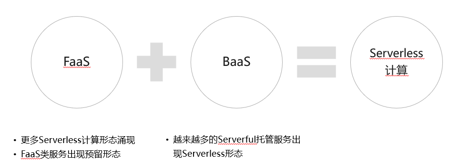
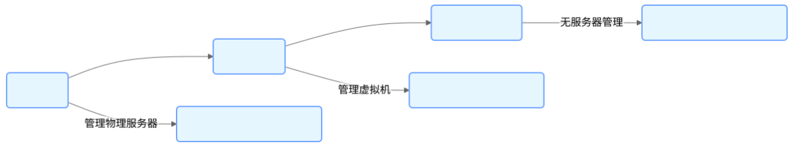

# 1. 简介

Serverless（无服务器）架构是一种云计算范式，开发者无需管理底层服务器资源，只需专注于业务逻辑的开发。Serverless 的核心思想是 **“按需执行、自动扩缩容、按量付费”** ，它通过事件驱动的方式运行代码，大幅降低了运维成本，提升了开发效率。

# 2. Serveless 架构的核心组成

## 1. FaaS (Function as a Service, 函数即服务)

- 定义 ：开发者编写函数（Function），由云平台动态调度执行，无需管理服务器。
- 特点 ：
  - 事件驱动 ：函数由 HTTP 请求、数据库变更、消息队列等事件触发执行。
  - 无状态 ：函数执行完成后，状态不保留，需依赖外部存储（如数据库）。
  - 自动扩缩容 ：根据请求量自动调整实例数量，应对突发流量。
- 代表产品 ：AWS Lambda、阿里云函数计算、腾讯云 SCF。

## 2. BaaS (Backend as a Service, 后端即服务)

- 定义：云厂商提供的托管服务，如数据库、存储、消息队列，开发者通过 API/SDK 调用，无需自建和管理。

* 典型服务 ：
  - 数据库：AWS DynamoDB、阿里云 Serverless HBase
  - 存储：AWS S3、阿里云 OSS
  - 消息队列：AWS SQS、阿里云 Kafka Serverless

# 2. 架构演进

## 传统架构

在传统架构中，开发者需要自行搭建服务器，管理服务器的硬件资源、操作系统、网络配置等。应用程序部署在这些服务器上，当业务流量增加时，需要手动进行服务器的扩容。

## 云计算架构

云计算架构引入了虚拟化技术，开发者可以通过云服务提供商提供的云服务器（如 Amazon EC2、阿里云 ECS）来部署应用程序。虽然无需管理物理服务器，但仍需要管理虚拟机的配置、维护和扩展。

## Serverless 架构

Serverless 架构进一步抽象了服务器的管理工作，开发者只需上传代码，云服务提供商根据实际的请求量自动分配资源并运行代码。常见的 Serverless 服务包括函数即服务（FaaS）和后端即服务（BaaS）。

## [案例](https://developer.aliyun.com/article/766206)

假如我们要做一个信息展示的网站，需求很简单，就像早年的中国黄页那样，信息更新很少，大概有以下几种主要选择：

- 买台服务器放在 IDC 机房里托管，运行站点；
- 去云厂商上买台云服务器运行站点，为了解决高可用的问题又买了负载均衡服务和多个服务器；
- 采用静态站点方式，直接由对象存储服务（如 OSS）支持，并使用 CDN 回源 OSS。

这三种方式由云下到云上，由管理服务器到无需管理服务器，即 Serverless。这一系列的转变给使用者带来了什么变化呢？前两种方案需要预算，需要扩展，需要实现高可用，需要自行监控等，这些都不是马老师当年想要的，他只想去展示信息，让世界了解中国，这是他的业务逻辑。Serverless 正是这样一种理念，最大化地让人去专注业务逻辑。第三种方式就是采用了 Serverless 架构去构建一个静态站点，它有其它方案无法比拟的优势，比如：

- 可运维性：无需管理服务器，比如操作系统的安全补丁升级、故障升级、高可用性，这些云服务（OSS，CDN）都帮着做了；
- 可扩展性：无需对资源做预估和考虑未来的扩展，因为 OSS 本身是弹性的，使用 CDN 使得系统延迟更小、费用更低、可用性更高；
- 成本：按实际使用的资源付费，包括存储费用和请求费用，没有请求时不收取请求费用；
- 安全性：这样一个系统甚至看不到服务器，不需要通过 SSH 登录，DDoS 攻击也交给云服务来解决。

# **3. Serverless 解决的问题及优势**

| **传统架构痛点** | **Serverless 解决方案**                  |
| ---------------- | ---------------------------------------- |
| **运维复杂**     | 全托管，无需管理服务器、操作系统、网络。 |
| **资源浪费**     | 按需付费，空闲时不收费。                 |
| **弹性不足**     | 自动扩缩容，应对流量高峰。               |
| **开发效率低**   | 专注业务逻辑，缩短上线时间。             |

Serverless 特别适用于希望专注于核心业务逻辑而不愿管理服务器基础设施的开发者和组织，他有如下好处：

### 降低成本

采用 Serverless 架构，用户只需为实际使用的计算资源付费，而无需预先支付或预留服务器成本。这有助于减少空闲时间和资源浪费，从而在很多场景下显著降低成本。

### 弹性缩放

Serverless 平台能够根据应用的实际需求自动扩展计算资源。在流量高峰时自动增加容量以处理更多请求，在需求降低时则释放资源，确保应用程序始终能高效运行，而无需人工干预，避免资源浪费。

### 提高开发效率

开发者可以将更多精力放在业务逻辑和功能开发上，而不是服务器配置和维护上。Serverless 平台通常提供一系列现成的服务和功能，如数据库、API 网关等，加速了开发和部署流程。

### 快速迭代

由于部署简单且资源管理自动化，开发者可以更快地测试新特性或更新，加速产品上市时间。这促进了持续集成和持续部署（CI/CD）的实践。

### 高可用性和容错性

主流 Serverless 提供商通常会在多个区域部署服务，以实现高可用性和故障转移，从而增强应用的稳定性和可靠性。

### 易于维护

服务器管理和运维工作由云服务商负责，包括安全补丁、操作系统升级等，减轻了团队的运维负担。

# **4. 实际案例解析**

### **案例 1：阿里云 Elasticsearch Serverless（日志分析降本 70%）**

- **问题** ：传统自建 ES 集群资源利用率低，运维成本高。
- **方案** ：改用 Serverless 版本，按需付费，自动扩缩容。
- **效果** ：存储压缩率提升 80%，成本降低 70%。

### **案例 2：曹操出行（Kafka Serverless 降本 20%）**

- **问题** ：流量波动大，自建 Kafka 集群资源闲置率高。
- **方案** ：采用阿里云 Kafka Serverless，按需弹性扩展。
- **效果** ：资源利用率优化，成本节省 20%。

### **案例 3：华为云 Serverless 可观测性（故障排查效率提升）**

- **问题** ：Serverless 函数调用链难追踪，故障定位慢。
- **方案** ：集成日志（LTS）、监控（AOM）、链路追踪（APM）。
- **效果** ：异常请求秒级定位，运维效率提升 50%。

# 5. 总结

Serverless 通过 **FaaS + BaaS** 组合，让开发者摆脱服务器管理，专注于业务逻辑。它适合**事件驱动、突发流量、短任务**场景，但在**长耗时任务、强状态应用**方面仍有局限。随着技术成熟，Serverless 将成为云原生时代的核心架构之一

# 6. 参考及延伸阅读

1. [Serverless 技术公开课---从入门到实践，你的第一堂 Serverless 课程](https://developer.aliyun.com/learning/roadmap/serverless)
2. [从零入门 Serverless | 一文详解 Serverless 架构模式](https://developer.aliyun.com/article/766206)
3. [Serverless 是什么？有什么优势？](https://docs.serverless-devs.com/introduction/what-is-serverless/)
4. [无服务器架构（Serverless Architectures）](https://amio.github.io/serverless-zhcn/)
5. [Serverless 架构模式及演进](https://xie.infoq.cn/article/0a64bf7982178abd3426025e6)
6. [阿里云 Kafka Serverless 10 倍降本实践](https://new.qq.com/rain/a/20250403A05QKQ00)
7. [华为云 Serverless 可观测性方案](https://www.163.com/dy/article/JA52RH0J0511D2I6.html)
8. [把 MCP 和 AI 代理部署在无服务器架构上，大幅提升业务性能](https://mp.weixin.qq.com/s/kXj-CV0PHg1fO49D6FaNXA)
