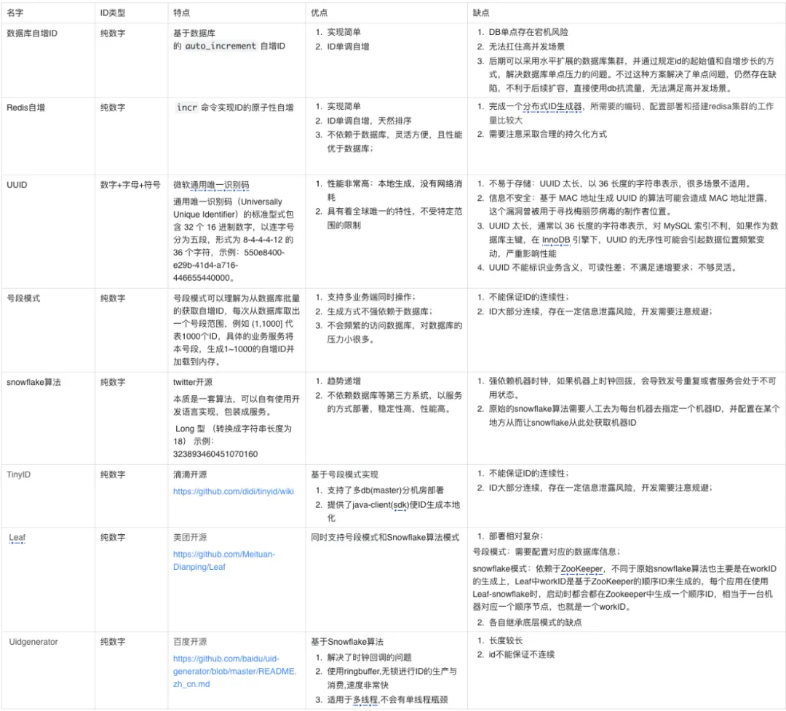
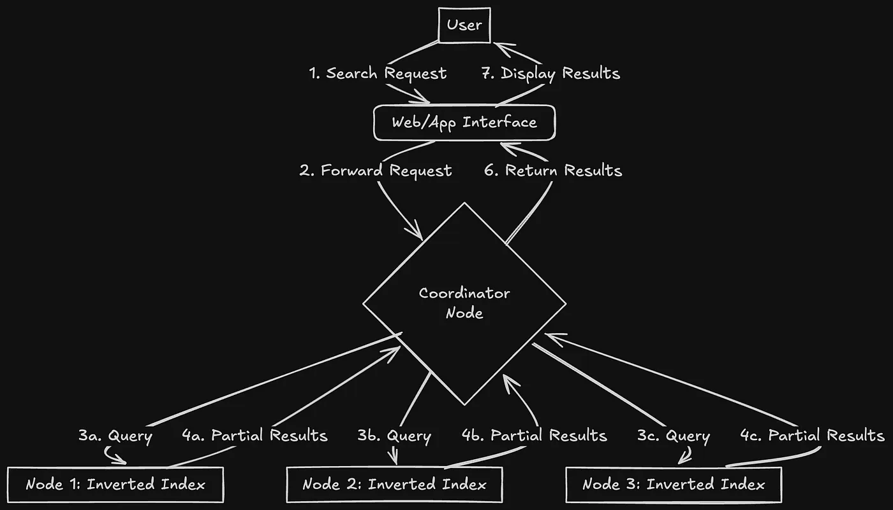
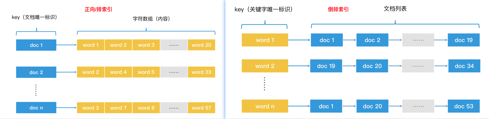
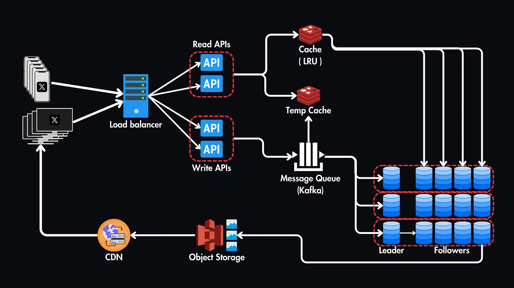

# 好文收藏

## [系统设计面试：内幕指南](https://learning-guide.gitbook.io/system-design-interview/)

## 高并发分布式 ID 设计

1. [如何设计一个分布式 ID 发号器？ ](https://www.cnblogs.com/chanshuyi/p/how-to-design-a-distributed-id-system.html "发布于 2022-08-01 10:31")
2. [Leaf——美团点评分布式 ID 生成系统](https://tech.meituan.com/2017/04/21/mt-leaf.html)
3. [代码层走进“百万级”分布式 ID 设计 ｜ 得物技术](https://mp.weixin.qq.com/s/o1taBSE4HhIb0Zb47_PEgA)
4. [leaf：美团开源的分布式 ID 生成系统剖析](https://mp.weixin.qq.com/s/A56iqJh-04vyVI7k22uvAA)
5. [UidGenerator：百度开源的分布式 ID 服务（解决了时钟回拨问题）｜ QPS 600w/s](https://mp.weixin.qq.com/s/8NsTXexf03wrT0tsW24EHA)
6. [京东二面：为什么需要分布式 ID？你项目中是怎么做的？](https://mp.weixin.qq.com/s/GRi2zP-7nlWHFFBzl3G2YQ)
7. [分布式 ID 生成服务的技术原理和项目实战](https://mp.weixin.qq.com/s/Qr463rDQxPCYnOLpvT0_Kw)
8. [分布式系统中设计唯一 ID 生成器](https://learning-guide.gitbook.io/system-design-interview/xi-tong-she-ji-mian-shi-nei-mu-zhi-nan-di-yi-juan/chapter-07-design-a-unique-id-generator-in-distributed-systems)
9. IM 消息 ID 技术专题

- 《[IM 消息 ID 技术专题(一)：微信的海量 IM 聊天消息序列号生成实践（算法原理篇）](http://www.52im.net/thread-1998-1-1.html)》
- 《[IM 消息 ID 技术专题(二)：微信的海量 IM 聊天消息序列号生成实践（容灾方案篇）](http://www.52im.net/thread-1999-1-1.html)》
- 《[IM 消息 ID 技术专题(三)：解密融云 IM 产品的聊天消息 ID 生成策略](http://www.52im.net/thread-2747-1-1.html)》
- 《[IM 消息 ID 技术专题(四)：深度解密美团的分布式 ID 生成算法](http://www.52im.net/thread-2751-1-1.html)》
- 《[IM 消息 ID 技术专题(五)：开源分布式 ID 生成器 UidGenerator 的技术实现](http://www.52im.net/thread-2953-1-1.html)》
- 《[IM 消息 ID 技术专题(六)：深度解密滴滴的高性能 ID 生成器(Tinyid)](http://www.52im.net/thread-3129-1-1.html)》
- 《[IM 消息 ID 技术专题(七)：深度解密 vivo 的自研分布式 ID 服务(鲁班)](http://www.52im.net/thread-4378-1-1.html)》

百度 Uidgenerator 是如何解决 snowflake 时钟回拨的问题

百度 UidGenerator 通过**缓冲未来 ID+时间差容忍+WorkerID 动态分配**的组合方案，有效解决了时钟回拨问题。其核心创新在于：

1. **时间预生成机制** ：将时间戳"提前消费"，为时钟同步争取时间窗口
2. **无锁环形缓冲池设计** ：解耦 ID 生成与消费，提高系统吞吐量
3. **分级处理策略** ：根据回拨严重程度采取不同应对措施

## [Linkedin 是如何把消息搜索做到 150 毫秒内完成？](https://mp.weixin.qq.com/s/DiNASVdCIMf-RLHBTza0cg)

1. 高性能键值对存储 [RocksDB](https://www.luozhiyun.com/archives/842)
2. 倒排索引
3. 只在需要的时候才建索引(按序创建索引)
4. LinkedIn 实施的一个重要的性能优化是索引存储在内存中而不是磁盘上。这对于性能至关重要，因为将索引存储在内存中可以更快地获得搜索结果，从而最大限度地减少延迟。当发出搜索请求时，系统快速扫描内存中的索引并返回结果。
5. Partitioning 索引分区，可以确保节点不会被某个特性用户的大量消息淹没，这个思想很多设计都会用到(golang GPM 调度模型为了解决 GM 模型大锁问题，引入 P，将锁粒度减少，且将 g 分流处理，提高性能)

[倒排索引：](https://time.geekbang.org/column/article/219268)将文本分割成 token, 然后反向索引到出现这些 token 的文章。主要应用在搜索引擎等需要高效信息检索的地方

[深入 RocksDB 高性能的技术关键](https://www.luozhiyun.com/archives/842)

## [系统设计面试：设计 Twitter (X)](https://mp.weixin.qq.com/s/DT-1iSdnVa_BmbdU-MmEYQ)

通过规模和数据大小，推理出是一个读多写少的服务，读取负载很大的系统，然后从 API 设计分析再到整体架构设计。

1. 规模
2. 数据大小
3. API 设计
   1. 结合数据库设计读写分离，通过 7 层负载均衡，路由决策实现
4. 高层设计
   1. 数据库
      1. 主从架构
      2. 分区分片
      3. 读写分离
   2. 缓存
      1. 临时缓存
      2. LRU 缓存
      3. 热点数据缓存
   3. 对象存储&CDN
   4. 削峰填谷-消息队列-缓冲负载

# 优秀博主

1. [hayk-simonyan-system-design-concepts](https://hayk-simonyan.medium.com/list/system-design-concepts-fb9a2a37d76f)

# 公众号

### [明天小事-系统设计专题](https://mp.weixin.qq.com/s/DiNASVdCIMf-RLHBTza0cg)

主要来自 medium 的转载，以后有空就逛逛英文社区学习学习

- 1. 优势教练，咨询师。
- 2. 世界 500 强航天领域工程师，创业公司 CTO，航天国企技术总监，新能源架师。
- 3. 长期写作者，终生成长倡导者。

### [TechLead 少个分号-系统设计](https://mp.weixin.qq.com/s/u7yp_SpJS18kkzoXdUNXCw)

Thoughtworks 相关软件工程师 维护

1. 系统设计专题
2. 每周组织系统设计研讨会

### [架构师之路-沈剑](https://mp.weixin.qq.com/s/GLyVYyU97OWg4aBIoQsDrQ)

过去 15 年，从百度，到 58，到快狗打车，一直在互联网公司做架构设计。
