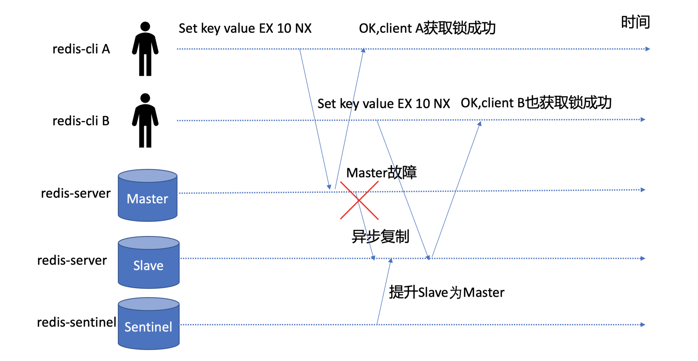
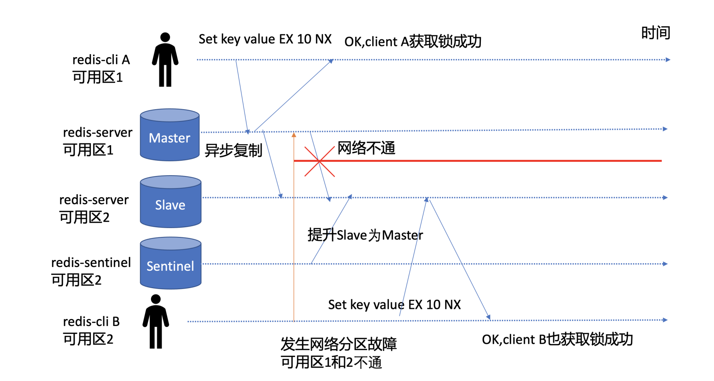
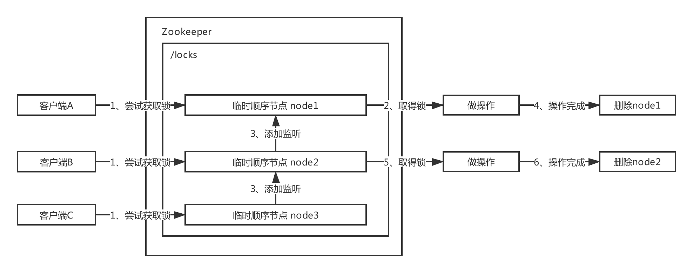
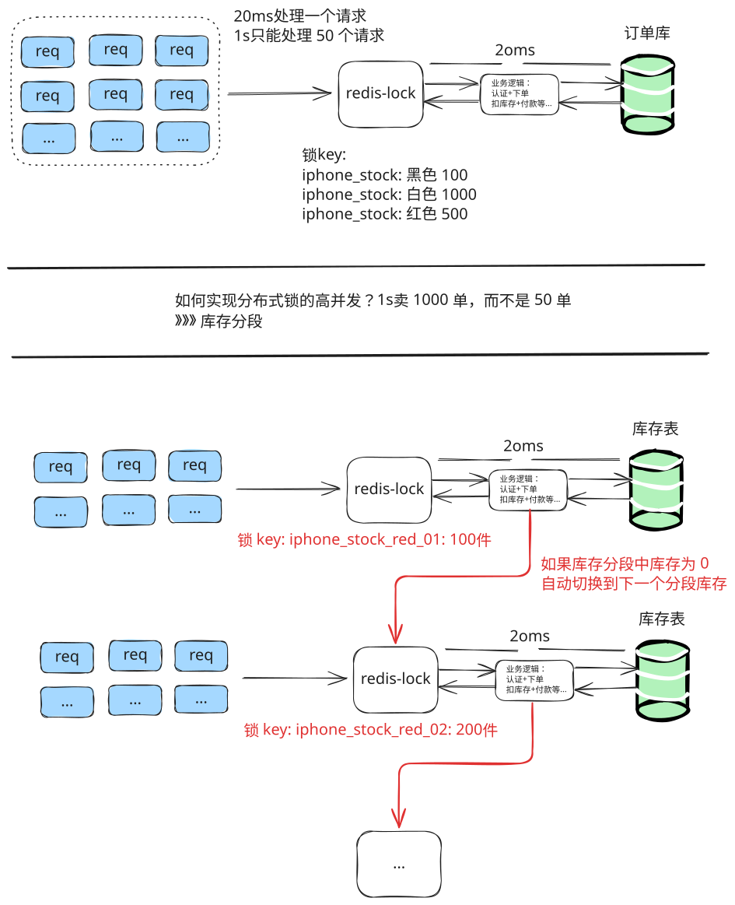

# 从一个案例看分布式锁的核心要素

首先我们从去年一个因 Redis 分布式锁实现问题导致[茅台超卖案例](https://juejin.cn/post/6854573212831842311)说起，在这个网友分享的真实案例中，因茅台的稀缺性，事件最终定级为 P0 级生产事故，后果影响严重。

此案例中实现的 redis 分布式锁的方式如下

> Set key value EX 10 NX

简单给你介绍下 SET 命令重点参数含义：

- `EX` 设置过期时间，单位秒；
- `NX` 当 key 不存在的时候，才设置 key；
- `XX` 当 key 存在的时候，才设置 key。

就是利用 SET NX 的特性来做分布式锁，当 key 不存在是 设置 key 表示加锁成功，当 key 存在时，表示加锁失败。

上述案例中用到的伪代码如下：

```bash
# 对资源key加锁，key不存在时创建，并且设置，10秒自动过期
SET key value EX 10 NX
业务逻辑流程1，校验用户身份
业务逻辑流程2，查询并校验库存(get and compare)
业务逻辑流程3，库存>0，扣减库存(Decr stock)，生成秒杀茅台订单

# finally 释放锁
Del key
```

从以上案例可以思考以下几个问题

- NX 参数有什么作用?
- 为什么需要原子的设置 key 及过期时间？
- 为什么基于 Set key value EX 10 NX 命令还出现了超卖呢?
- 为什么大家都比较喜欢使用 Redis 作为分布式锁实现？

NX 参数是为了保证当分布式锁不存在时，只有一个 client 能写入此 key 成功，获取到此锁。我们使用分布式锁的目的就是希望在高并发系统中，有一种互斥机制来防止彼此相互干扰，保证数据的一致性。

假设我们没有设置过期时间，如果程序 crash 或者网络分区后，无法与 redis 节点通信，此时其他 client 将无法获取到锁，将导致死锁

所以这个就是分布式锁的第二个核心要素，活性。**在实现分布式锁的过程中要考虑到 client 可能会出现 crash 或者网络分区，你需要原子申请分布式锁及设置锁的自动过期时间，通过过期、超时等机制自动释放锁，避免出现死锁，导致业务中断。**

**在看问题三：为什么基于 Set key value EX 10 NX 命令还出现了超卖呢?**

原来是抢购活动开始后，加锁逻辑中的业务流程 1 访问的用户身份服务出现了高负载，导致阻塞在校验用户身份流程中(超时 30 秒)，然而锁 10 秒后就自动过期了，因此其他 client 能获取到锁。关键是阻塞的请求执行完后，它又把其他 client 的锁释放掉了，导致进入一个恶性循环。

> 因此申请锁时，写入的 value 应确保唯一性（随机值等）。client 在释放锁时，应通过 Lua 脚本原子校验此锁的 value 与自己写入的 value 一致，若一致才能执行释放工作。

```

```

更关键的是库存校验是通过 get and compare 方式，它压根就无法防止超卖。正确的解决方案应该是通过 LUA 脚本实现 Redis 比较库存、扣减库存操作的原子性。

> **从这个问题中可以看到，分布式锁实现具备一定的复杂度，它不仅依赖存储服务提供的核心机制，同时依赖业务领域的实现。无论是遭遇高负载、还是宕机、网络分区等故障，都需确保锁的互斥性、安全性，否则就会出现严重的超卖生产事故。**

**最后一个问题：为什么大家都比较喜欢使用 Redis 做分布式锁的实现呢?**

考虑到在秒杀等业务场景上存在大量的瞬间、高并发请求，加锁与释放锁的过程应是高性能、高可用的。而 Redis 核心优点就是快、简单，是随处可见的基础设施，部署、使用也及其方便，因此广受开发者欢迎。

### redis+lua 实现秒杀的脚本

```lua
-- 获取库存扣减记录缓存key KYES[2] = hot_{itemCode-skuCode}_deduction_history
-- 使用 Redis Cluster hash tag 保证 stock 和 history 在同个槽
local hot_deduction_history = KYES[2]
-- 请求幂等判断,存在返回0, 表达已扣减过库存
local exist = redis.call('hexists', hot_deduction_history, ARGV[2])
if exist = 1 then return 0 end

-- 获取库存缓存key KYES[1] = hot_{itemCode-skuCode}_stock
local hot_item_stock = KYES[1]
-- 获取剩余库存数量
local stock = tonumber(redis.call('get', hot_item_stock))
-- 购买数量
local buy_qty = tonumber(ARGV[1])
-- 如果库存小于购买数量 则返回 1, 表达库存不足
if stock < buy_qty then return 1 end
-- 库存足够
-- 1.更新库存数量
-- 2.插入扣减记录 ARGV[2] = ${扣减请求唯一key}-${扣减类型} 值为 buy_qty
stock = stock - buy_qty
redis.call('set', hot_item_stock, tostring(stock))
redis.call('hset', hot_deduction_history, ARGV[2], buy_qty)
-- 如果剩余库存等于0 则返回 2, 表达库存已为0
if stock = 0 then return 2 end
-- 剩余库存不为0 返回 3 表达还有剩余库存
return 3 end
```

## 小结

1. 互斥性、安全性。在同一时间内，不允许有多个 client 同时获取锁
2. 活性。在实现分布式锁的过程中要考虑到 client 可能会出现 crash 或者网络分区，你需要原子申请分布式锁及设置锁的自动过期时间，通过过期、超时等机制自动释放锁，避免出现死锁，导致业务中断。
3. 高性能、高可用。**加锁、释放锁的过程性能开销要尽量低，同时要保证高可用，确保业务不会出现中断。**

# Redis 分布式锁有问题吗？

首先，如果我们的分布式锁跑在单节点的 Redis Master 节点上，那么它就存在单点故障，无法保证分布式锁的高可用。

于是我们需要一个主备版的 Redis 服务，至少具备一个 Slave 节点。

我们又知道 Redis 是基于主备异步复制协议实现的 Master-Slave 数据同步，如下图所示，若 client A 执行 SET key value EX 10 NX 命令，redis-server 返回给 client A 成功后，Redis Master 节点突然出现 crash 等异常，这时候 Redis Slave 节点还未收到此命令的同步。



若你部署了 Redis Sentinel 等主备切换服务，那么它就会以 Slave 节点提升为主，此时 Slave 节点因并未执行 SET key value EX 10 NX 命令，因此它收到 client B 发起的加锁的此命令后，它也会返回成功给 client。

> 那么在同一时刻，集群就出现了两个 client 同时获得锁，分布式锁的互斥性、安全性就被破坏了。

除了主备切换可能会导致基于 Redis 实现的分布式锁出现安全性问题，在发生网络分区等场景下也可能会导致出现脑裂，Redis 集群出现多个 Master，进而也会导致多个 client 同时获得锁。

如下图所示，Master 节点在可用区 1，Slave 节点在可用区 2，当可用区 1 和可用区 2 发生网络分区后，部署在可用区 2 的 Redis Sentinel 服务就会将可用区 2 的 Slave 提升为 Master，而此时可用区 1 的 Master 也在对外提供服务。因此集群就出现了脑裂，出现了两个 Master，都可对外提供分布式锁申请与释放服务，分布式锁的互斥性被严重破坏。



**主备切换、脑裂是 Redis 分布式锁的两个典型不安全的因素，本质原因是 Redis 为了满足高性能，采用了主备异步复制协议，同时也与负责主备切换的 Redis Sentinel 服务是否合理部署有关。**

> 有没有其他方案解决呢？
>
> 当然有，Redis 作者为了解决 SET key value [EX] 10 [NX]命令实现分布式锁不安全的问题，提出了[RedLock 算法](https://redis.io/topics/distlock)。它是基于多个独立的 Redis Master 节点的一种实现（一般为 5）。client 依次向各个节点申请锁，若能从多数个节点中申请锁成功并满足一些条件限制，那么 client 就能获取锁成功。

## [Redlock 真的安全吗？](http://kaito-kidd.com/2021/06/08/is-redis-distributed-lock-really-safe/)

> [内容来自 kaito](http://kaito-kidd.com/2021/06/08/is-redis-distributed-lock-really-safe/)

Realock 的方案基于 2 个前提：

1. 不再需要部署**从库**和**哨兵**实例，只部署**主库**
2. 但主库要部署多个，官方推荐至少 5 个实例

**注意：不是部署 Redis Cluster，就是部署 5 个简单的 Redis 实例。**


Redlock 具体如何使用呢？

整体的流程是这样的，一共分为 5 步：

1. 客户端先获取「当前时间戳 T1」
2. 客户端依次向这 5 个 Redis 实例发起加锁请求（用前面讲到的 SET 命令），且每个请求会设置超时时间（毫秒级，要远小于锁的有效时间），如果某一个实例加锁失败（包括网络超时、锁被其它人持有等各种异常情况），就立即向下一个 Redis 实例申请加锁
3. 如果客户端从 >=3 个（大多数）以上 Redis 实例加锁成功，则再次获取「当前时间戳 T2」，如果 T2 - T1 < 锁的过期时间，此时，认为客户端加锁成功，否则认为加锁失败
4. 加锁成功，去操作共享资源（例如修改 MySQL 某一行，或发起一个 API 请求）
5. 加锁失败，向「全部节点」发起释放锁请求（前面讲到的 Lua 脚本释放锁）

大致小结一下：

1. 客户端在多个 Redis 实例上申请加锁
2. 必须保证大多数节点加锁成功
3. 大多数节点加锁的总耗时，要小于锁设置的过期时间
4. 释放锁，要向全部节点发起释放锁请求

**1) 为什么要在多个实例上加锁？**

本质上是为了「容错」，部分实例异常宕机，剩余的实例加锁成功，整个锁服务依旧可用。

**2) 为什么大多数加锁成功，才算成功？**

多个 Redis 实例一起来用，其实就组成了一个「分布式系统」。

在分布式系统中，总会出现「异常节点」，所以，在谈论分布式系统问题时，需要考虑异常节点达到多少个，也依旧不会影响整个系统的「正确性」。

这是一个分布式系统「容错」问题，这个问题的结论是：**如果只存在「故障」节点，只要大多数节点正常，那么整个系统依旧是可以提供正确服务的。**

> 这个问题的模型，就是我们经常听到的「拜占庭将军」问题，感兴趣可以去看算法的推演过程。

**3) 为什么步骤 3 加锁成功后，还要计算加锁的累计耗时？**

因为操作的是多个节点，所以耗时肯定会比操作单个实例耗时更久，而且，因为是网络请求，网络情况是复杂的，有可能存在**延迟、丢包、超时**等情况发生，网络请求越多，异常发生的概率就越大。

所以，即使大多数节点加锁成功，但如果加锁的累计耗时已经「超过」了锁的过期时间，那此时有些实例上的锁可能已经失效了，这个锁就没有意义了。

**4) 为什么释放锁，要操作所有节点？**

在某一个 Redis 节点加锁时，可能因为「网络原因」导致加锁失败。

例如，客户端在一个 Redis 实例上加锁成功，但在读取响应结果时，网络问题导致 **读取失败** ，那这把锁其实已经在 Redis 上加锁成功了。

所以，释放锁时，不管之前有没有加锁成功，需要释放「所有节点」的锁，以保证清理节点上「残留」的锁。

好了，明白了 Redlock 的流程和相关问题，看似 Redlock 确实解决了 Redis 节点异常宕机锁失效的问题，保证了锁的「安全性」。

它通过独立的 N 个 Master 节点，避免了使用主备异步复制协议的缺陷，只要多数 Redis 节点正常就能正常工作，显著提升了分布式锁的安全性、可用性。

但是，它的实现建立在一个不安全的系统模型上的，它依赖系统时间，当时钟发生跳跃时，也可能会出现安全性问题。你要有兴趣的话，可以详细阅读下分布式存储专家 Martin 对[RedLock 的分析文章](https://martin.kleppmann.com/2016/02/08/how-to-do-distributed-locking.html)，Redis 作者的也专门写了[一篇文章进行了反驳](http://antirez.com/news/101)。

# 分布式系统会遇到的问题

## 分布式锁的目的是什么？

Martin 表示，你必须先清楚你在使用分布式锁的目的是什么？

他认为有两个目的。

**第一，效率。**

使用分布式锁的互斥能力，是避免不必要地做同样的两次工作（例如一些昂贵的计算任务）。如果锁失效，并不会带来「恶性」的后果，例如发了 2 次邮件等，无伤大雅。

**第二，正确性。**

使用锁用来防止并发进程互相干扰。如果锁失效，会造成多个进程同时操作同一条数据，产生的后果是**数据严重错误、永久性不一致、数据丢失**等恶性问题，就像给患者服用重复剂量的药物一样，后果严重。

他认为，如果你是为了前者——效率，那么使用单机版 Redis 就可以了，即使偶尔发生锁失效（宕机、主从切换），都不会产生严重的后果。而使用 Redlock 太重了，没必要。

**而如果是为了正确性，Martin 认为 Redlock 根本达不到安全性的要求，也依旧存在锁失效的问题！**

## 分布式系统会遇到的问题

Martin 表示，一个分布式系统，更像一个复杂的「野兽」，存在着你想不到的各种异常情况。

这些异常场景主要包括三大块，这也是分布式系统会遇到的三座大山： **NPC** 。

- N：Network Delay，网络延迟
- P：Process Pause，进程暂停（GC）
- C：Clock Drift，时钟漂移

Martin 用一个进程暂停（GC）的例子，指出了 Redlock 安全性问题：

1. 客户端 1 请求锁定节点 A、B、C、D、E
2. 客户端 1 的拿到锁后，进入 GC（时间比较久）
3. 所有 Redis 节点上的锁都过期了
4. 客户端 2 获取到了 A、B、C、D、E 上的锁
5. 客户端 1 GC 结束，认为成功获取锁
6. 客户端 2 也认为获取到了锁，发生「冲突」


Martin 认为，GC 可能发生在程序的任意时刻，而且执行时间是不可控的。

> 注：当然，即使是使用没有 GC 的编程语言，在发生网络延迟、时钟漂移时，也都有可能导致 Redlock 出现问题，这里 Martin 只是拿 GC 举例。

**假设时钟正确的是不合理的**

又或者，当多个 Redis 节点「时钟」发生问题时，也会导致 Redlock **锁失效** 。

1. 客户端 1 获取节点 A、B、C 上的锁，但由于网络问题，无法访问 D 和 E
2. 节点 C 上的时钟「向前跳跃」，导致锁到期
3. 客户端 2 获取节点 C、D、E 上的锁，由于网络问题，无法访问 A 和 B
4. 客户端 1 和 2 现在都相信它们持有了锁（冲突）

Martin 觉得，Redlock 必须「强依赖」多个节点的时钟是保持同步的，一旦有节点时钟发生错误，那这个算法模型就失效了。

Martin 继续阐述，机器的时钟发生错误，是很有可能发生的：

- 系统管理员「手动修改」了机器时钟
- 机器时钟在同步 NTP 时间时，发生了大的「跳跃」

总之，Martin 认为，Redlock 的算法是建立在「同步模型」基础上的，有大量资料研究表明，同步模型的假设，在分布式系统中是有问题的。

在混乱的分布式系统的中，你不能假设系统时钟就是对的，所以，你必须非常小心你的假设。

**提出 fencing token 的方案，保证正确性**

相对应的，Martin 提出一种被叫作 fencing token 的方案，保证分布式锁的正确性。

这个模型流程如下：

1. 客户端在获取锁时，锁服务可以提供一个「递增」的 token
2. 客户端拿着这个 token 去操作共享资源
3. 共享资源可以根据 token 拒绝「后来者」的请求


这样一来，无论 NPC 哪种异常情况发生，都可以保证分布式锁的安全性，因为它是建立在「异步模型」上的。

而 Redlock 无法提供类似 fencing token 的方案，所以它无法保证安全性。

他还表示，**一个好的分布式锁，无论 NPC 怎么发生，可以不在规定时间内给出结果，但并不会给出一个错误的结果。也就是只会影响到锁的「性能」（或称之为活性），而不会影响它的「正确性」。**

Martin 的结论：

**1、Redlock 不伦不类** ：它对于效率来讲，Redlock 比较重，没必要这么做，而对于正确性来说，Redlock 是不够安全的。

**2、时钟假设不合理** ：该算法对系统时钟做出了危险的假设（假设多个节点机器时钟都是一致的），如果不满足这些假设，锁就会失效。

**3、无法保证正确性** ：Redlock 不能提供类似 fencing token 的方案，所以解决不了正确性的问题。为了正确性，请使用有「共识系统」的软件，例如 Zookeeper。

## [Chubby 的分布式锁是怎样做 fencing 的？](http://zhangtielei.com/posts/blog-redlock-reasoning-part2.html)

> 内容来自张铁蕾老师》》》》[基于 Redis 的分布式锁到底安全吗（下）？](http://zhangtielei.com/posts/blog-redlock-reasoning-part2.html)

提到分布式锁，就不能不提 Google 的 Chubby。

Chubby 是 Google 内部使用的分布式锁服务，有点类似于 ZooKeeper，但也存在很多差异。Chubby 对外公开的资料，主要是一篇论文，叫做“The Chubby lock service for loosely-coupled distributed systems”，下载地址如下：

- [https://research.google.com/archive/chubby.html](https://research.google.com/archive/chubby.html)

另外，YouTube 上有一个的讲 Chubby 的 talk，也很不错，播放地址：

- [https://www.youtube.com/watch?v=PqItueBaiRg&amp;feature=youtu.be&amp;t=487](https://www.youtube.com/watch?v=PqItueBaiRg&feature=youtu.be&t=487)

Chubby 自然也考虑到了延迟造成的锁失效的问题。论文里有一段描述如下：

> a process holding a lock L may issue a request R, but then fail. Another process may ac- quire L and perform some action before R arrives at its destination. If R later arrives, it may be acted on without the protection of L, and potentially on inconsistent data.
>
> （译文： 一个进程持有锁 L，发起了请求 R，但是请求失败了。另一个进程获得了锁 L 并在请求 R 到达目的方之前执行了一些动作。如果后来请求 R 到达了，它就有可能在没有锁 L 保护的情况下进行操作，带来数据不一致的潜在风险。）

这跟 Martin 的分析大同小异。

Chubby 给出的用于解决（缓解）这一问题的机制称为 sequencer，类似于 fencing token 机制。锁的持有者可以随时请求一个 sequencer，这是一个字节串，它由三部分组成：

- 锁的名字。
- 锁的获取模式（排他锁还是共享锁）。
- lock generation number（一个 64bit 的单调递增数字）。作用相当于 fencing token 或 epoch number。

客户端拿到 sequencer 之后，在操作资源的时候把它传给资源服务器。然后，资源服务器负责对 sequencer 的有效性进行检查。检查可以有两种方式：

- 调用 Chubby 提供的 API，CheckSequencer()，将整个 sequencer 传进去进行检查。这个检查是为了保证客户端持有的锁在进行资源访问的时候仍然有效。
- 将客户端传来的 sequencer 与资源服务器当前观察到的最新的 sequencer 进行对比检查。可以理解为与 Martin 描述的对于 fencing token 的检查类似。

当然，如果由于兼容的原因，资源服务本身不容易修改，那么 Chubby 还提供了一种机制：

- lock-delay。Chubby 允许客户端为持有的锁指定一个 lock-delay 的时间值（默认是 1 分钟）。当 Chubby 发现客户端被动失去联系的时候，并不会立即释放锁，而是会在 lock-delay 指定的时间内阻止其它客户端获得这个锁。这是为了在把锁分配给新的客户端之前，让之前持有锁的客户端有充分的时间把请求队列排空(draining the queue)，尽量防止出现延迟到达的未处理请求。

可见，为了应对锁失效问题，Chubby 提供的三种处理方式：CheckSequencer()检查、与上次最新的 sequencer 对比、lock-delay，它们对于安全性的保证是从强到弱的。而且，这些处理方式本身都没有保证提供绝对的正确性(correctness)。但是，Chubby 确实提供了单调递增的 lock generation number，这就允许资源服务器在需要的时候，利用它提供更强的安全性保障。

# 基于 ZooKeeper 的分布式锁更安全吗？

如果你有了解过 Zookeeper，基于它实现的分布式锁是这样的：

1. 客户端 1 和 2 都尝试创建「临时节点」，例如 /lock
2. 假设客户端 1 先到达，则加锁成功，客户端 2 加锁失败
3. 客户端 1 操作共享资源
4. 客户端 1 删除 /lock 节点，释放锁

你应该也看到了，Zookeeper 不像 Redis 那样，需要考虑锁的过期时间问题，它是采用了「临时节点」，保证客户端 1 拿到锁后，只要连接不断，就可以一直持有锁。

而且，如果客户端 1 异常崩溃了，那么这个临时节点会自动删除，保证了锁一定会被释放。

**不错，没有锁过期的烦恼，还能在异常时自动释放锁，是不是觉得很完美？**

其实不然。

思考一下，客户端 1 创建临时节点后，Zookeeper 是如何保证让这个客户端一直持有锁呢？

原因就在于，**客户端 1 此时会与 Zookeeper 服务器维护一个 Session，这个 Session 会依赖客户端「定时心跳」来维持连接。**

如果 Zookeeper 长时间收不到客户端的心跳，就认为这个 Session 过期了，也会把这个临时节点删除。

同样地，基于此问题，我们也讨论一下 GC 问题对 Zookeeper 的锁有何影响：

1. 客户端 1 创建临时节点 /lock 成功，拿到了锁
2. 客户端 1 发生长时间 GC
3. 客户端 1 无法给 Zookeeper 发送心跳，Zookeeper 把临时节点「删除」
4. 客户端 2 创建临时节点 /lock 成功，拿到了锁
5. 客户端 1 GC 结束，它仍然认为自己持有锁（冲突）

可见，即使是使用 Zookeeper，也无法保证进程 GC、网络延迟异常场景下的安全性。

**这就是 Redis 作者在反驳的文章中提到的：如果客户端已经拿到了锁，但客户端与锁服务器发生「失联」（例如 GC），那不止 Redlock 有问题，其它锁服务都有类似的问题，Zookeeper 也是一样！**

所以，这里我们就能得出结论了：**一个分布式锁，在极端情况下，不一定是安全的。**

如果你的业务数据非常敏感，在使用分布式锁时，一定要注意这个问题，不能假设分布式锁 100% 安全。

### 小结

Zookeeper 的优点：

1. 不需要考虑锁的过期时间，由客户端和服务端的心跳保持锁的长时间持有
2. watch 机制，加锁失败，可以 watch 等待锁释放，实现乐观锁

但它的劣势是：

1. 性能不如 Redis
2. 部署和运维成本高
3. 客户端与 Zookeeper 的长时间失联，锁被释放问题

## redis 能不能做到像 zookeeper 想可以长时间持有并且能自动删除呢？

> [拜托，面试请不要再问我 Redis 分布式锁的实现原理！【石杉的架构笔记】](https://juejin.cn/post/6844903717641142285)
>
> [每秒上千订单场景下的分布式锁高并发优化实践！【石杉的架构笔记】](https://juejin.cn/post/6844903719318847495)

》》》redisson

watch dog 自动延期机制

```java
RLock lock = redisson.getLock("myLock");
try {
    // 获取锁并设置过期时间，同时启动看门狗
    lock.lock();
    // 执行业务逻辑
    // ...
} finally {
    lock.unlock();
}
```

## zookeeper herd effect

顺便提一下，如上所述的基于 ZooKeeper 的分布式锁的实现，并不是最优的。它会引发“herd effect”（羊群效应），降低获取锁的性能。一个更好的实现参见下面链接：

- [http://zookeeper.apache.org/doc/r3.4.9/recipes.html#sc_recipes_Locks](http://zookeeper.apache.org/doc/r3.4.9/recipes.html#sc_recipes_Locks)

### 什么是羊群效应？

Zookeeper 分布式锁场景中的羊群效应指的是所有的客户端都尝试对一个临时节点去加锁，当一个锁被占有的时候，其他的客户端都会监听这个临时节点。一旦锁被释放，Zookeeper 反向通知添加监听的客户端，然后大量的客户端都尝试去对同一个临时节点创建锁，最后也只有一个客户端能获得锁，但是大量的请求造成了很大的网络开销，加重了网络的负载，影响 Zookeeper 的性能。

### 如何解决羊群效应？



步骤为：

1. 所有客户端都尝试去创建临时有序节点以获取锁
2. 序号最小的临时有序节点获得锁
3. 未获取到锁的客户端给自己的上一个临时有序节点添加监听
4. 获得锁的客户端进行自己的操作，操作完成之后删除自己的临时有序节点
5. 当监听到自己的上一个临时有序节点释放了锁，尝试自己去加锁
6. 操作完成之后释放锁
7. 之后剩下的客户端重复加锁和解锁的操作

核心思路就是让锁有序排队。

# 基于 etcd 的分布式锁实现方案

## etcd 分布式锁

基于 etcd 实现的分布式锁是如何确保安全性、互斥性、活性的呢？

### 事务与锁的安全性

etcd 的事务特性，它由 IF 语句、Then 语句、Else 语句组成。其中在 IF 语句中，支持比较 key 的是修改版本号 mod_revision 和创建版本号 create_revision。

在分布式锁场景，你就可以通过 key 的创建版本号 create_revision 来检查 key 是否已存在，因为一个 key 不存在的话，它的 create_revision 版本号就是 0。

若 create_revision 是 0，你就可发起 put 操作创建相关 key，具体代码如下:

```css
txn: = client.Txn(ctx) .If(v3.Compare(v3.CreateRevision(k), "=", 0));
```

你要注意的是，实现分布式锁的方案有多种，比如你可以通过 client 是否成功创建一个固定的 key，来判断此 client 是否获得锁，你也可以通过多个 client 创建 prefix 相同，名称不一样的 key，哪个 key 的 revision 最小，最终就是它获得锁。

相比 Redis 基于主备异步复制导致锁的安全性问题，etcd 是基于 Raft 共识算法实现的，一个写请求需要经过集群多数节点确认

因此一旦分布式锁申请返回给 client 成功后，它一定是持久化到了集群多数节点上，不会出现 Redis 主备异步复制可能导致丢数据的问题，具备更高的安全性。

### Lease 与锁的活性

通过事务实现原子的检查 key 是否存在、创建 key 后，我们确保了分布式锁的安全性、互斥性。那么 etcd 是如何确保锁的活性呢? 也就是发生任何故障，都可避免出现死锁呢？

Lease 就是一种活性检测机制，它提供了检测各个客户端存活的能力。业务 client 需定期向 etcd 服务发送”特殊心跳”汇报健康状态，若你未正常发送心跳，并超过和 etcd 服务约定的最大存活时间后，就会被 etcd 服务移除此 Lease 和其关联的数据。

通过 Lease 机制就优雅地解决了 client 出现 crash 故障、client 与 etcd 集群网络出现隔离等各类故障场景下的死锁问题。一旦超过 Lease TTL，它就能自动被释放，确保了其他 client 在 TTL 过期后能正常申请锁，保障了业务的可用性。

具体代码如下:

```css
txn := client.Txn(ctx).If(v3.Compare(v3.CreateRevision(k), "=", 0))
txn = txn.Then(v3.OpPut(k, val, v3.WithLease(s.Lease())))
txn = txn.Else(v3.OpGet(k))
resp, err := txn.Commit()
if err != nil {
    return err
}
```

### Watch 与锁的可用性

当一个持有锁的 client crash 故障后，其他 client 如何快速感知到此锁失效了，快速获得锁呢，最大程度降低锁的不可用时间呢？

答案是 Watch 特性，Watch 提供了高效的数据监听能力。当其他 client 收到 Watch Delete 事件后，就可快速判断自己是否有资格获得锁，极大减少了锁的不可用时间。

具体代码如下所示：

```go
var wr v3.WatchResponse
wch := client.Watch(cctx, key, v3.WithRev(rev))
for wr = range wch {
   for _, ev := range wr.Events {
      if ev.Type == mvccpb.DELETE {
         return nil
      }
   }
}
```

### etcd 自带的 concurrency 包

为了帮助你简化分布式锁、分布式选举、分布式事务的实现，etcd 社区提供了一个名为 concurrency 包帮助你更简单、正确地使用分布式锁、分布式选举。

下面我简单为你介绍下分布式锁[concurrency](https://github.com/etcd-io/etcd/tree/v3.4.9/clientv3/concurrency)包的使用和实现，它的使用非常简单，如下代码所示，核心流程如下：

- 首先通过 concurrency.NewSession 方法创建 Session，本质是创建了一个 TTL 为 10 的 Lease。
- 其次得到 session 对象后，通过 concurrency.NewMutex 创建了一个 mutex 对象，包含 Lease、key prefix 等信息。
- 然后通过 mutex 对象的 Lock 方法尝试获取锁。
- 最后使用结束，可通过 mutex 对象的 Unlock 方法释放锁。

案例

```go
cli, err := clientv3.New(clientv3.Config{Endpoints: endpoints})
if err != nil {
   log.Fatal(err)
}
defer cli.Close()
// create two separate sessions for lock competition
s1, err := concurrency.NewSession(cli, concurrency.WithTTL(10))
if err != nil {
   log.Fatal(err)
}
defer s1.Close()
m1 := concurrency.NewMutex(s1, "/my-lock/")
// acquire lock for s1
if err := m1.Lock(context.TODO()); err != nil {
   log.Fatal(err)
}
fmt.Println("acquired lock for s1")
if err := m1.Unlock(context.TODO()); err != nil {
   log.Fatal(err)
}
fmt.Println("released lock for s1")
```

那么 mutex 对象的 Lock 方法是如何加锁的呢？

核心还是使用了我们上面介绍的事务和 Lease 特性，当 CreateRevision 为 0 时，它会创建一个 prefix 为/my-lock 的 key（ /my-lock + LeaseID)，并获取到/my-lock prefix 下面最早创建的一个 key（revision 最小），分布式锁最终是由写入此 key 的 client 获得，其他 client 则进入等待模式。

```go
m.myKey = fmt.Sprintf("%s%x", m.pfx, s.Lease())
cmp := v3.Compare(v3.CreateRevision(m.myKey), "=", 0)
// put self in lock waiters via myKey; oldest waiter holds lock
put := v3.OpPut(m.myKey, "", v3.WithLease(s.Lease()))
// reuse key in case this session already holds the lock
get := v3.OpGet(m.myKey)
// fetch current holder to complete uncontended path with only one RPC
getOwner := v3.OpGet(m.pfx, v3.WithFirstCreate()...)
resp, err := client.Txn(ctx).If(cmp).Then(put, getOwner).Else(get, getOwner).Commit()
if err != nil {
   return err
}
```

那未获得锁的 client 是如何等待的呢?

答案是通过 Watch 机制各自监听 prefix 相同，revision 比自己小的 key，因为只有 revision 比自己小的 key 释放锁，我才能有机会，获得锁，如下代码所示，其中 waitDelete 会使用我们上面的介绍的 Watch 去监听比自己小的 key，详细代码可参考[concurrency mutex](https://github.com/etcd-io/etcd/blob/v3.4.9/clientv3/concurrency/mutex.go)的实现。

这个方案跟 zookeeper 也是解决惊群效应。

```go
// wait for deletion revisions prior to myKey
hdr, werr := waitDeletes(ctx, client, m.pfx, m.myRev-1)
// release lock key if wait failed
if werr != nil {
   m.Unlock(client.Ctx())
} else {
   m.hdr = hdr
}
```

# 如何选择合适的锁

| 特性           | etcd                     | ZooKeeper          | Redis                |
| -------------- | ------------------------ | ------------------ | -------------------- |
| **一致性**     | 强一致性（Raft）         | 强一致性（ZAB）    | 最终一致性           |
| **性能**       | 中等                     | 较低               | 高                   |
| **锁安全性**   | 高                       | 中                 | 低                   |
| **部署复杂度** | 简单                     | 复杂               | 简单                 |
| **适用场景**   | 强一致性需求的分布式系统 | 服务发现、配置共享 | 高性能缓存和分布式锁 |

业务还在单机就可以搞定的量级时，那么按照需求使用任意的单机锁方案就可以。

如果发展到了分布式服务阶段，但业务规模不大，qps 很小的情况下，使用哪种锁方案都差不多。如果公司内已有可以使用的 ZooKeeper、etcd 或者 Redis 集群，那么就尽量在不引入新的技术栈的情况下满足业务需求。

业务发展到一定量级的话，就需要从多方面来考虑了。首先是你的锁是否在任何恶劣的条件下都不允许数据丢失，如果不允许，那么就不要使用 Redis 的 `setnx` 的简单锁。

对锁数据的可靠性要求极高的话，那只能使用 etcd 或者 ZooKeeper 这种通过一致性协议保证数据可靠性的锁方案。但可靠的背面往往都是较低的吞吐量和较高的延迟。需要根据业务的量级对其进行压力测试，以确保分布式锁所使用的 etcd 或 ZooKeeper 集群可以承受得住实际的业务请求压力。需要注意的是，etcd 和 Zookeeper 集群是没有办法通过增加节点来提高其性能的。要对其进行横向扩展，只能增加搭建多个集群来支持更多的请求。这会进一步提高对运维和监控的要求。多个集群可能需要引入 proxy，没有 proxy 那就需要业务去根据某个业务 id 来做分片。如果业务已经上线的情况下做扩展，还要考虑数据的动态迁移。这些都不是容易的事情。

在选择具体的方案时，还是需要多加思考，对风险早做预估。

# 如何对分布式锁进行高并发优化？

分布式锁的方案在高并发场景下有什么问题？

库存超卖就是用分布式锁来解决，而且一秒对一个 iphone 下上千订单，怎么优化？

比如，对 iphone 这个商品的下单，都必对“iphone_stock”这个锁 key 来加锁。这样会导致对同一个商品的下单请求，就必须串行化，一个接一个的处理。

假设加锁之后，释放锁之前，查库存 -> 创建订单 -> 扣减库存，这个过程性能很高吧，算他全过程 20 毫秒，这应该不错了。

那么 1 秒是 1000 毫秒，只能容纳 50 个对这个商品的请求依次串行完成处理。

比如一秒钟来 50 个请求，都是对 iphone 下单的，那么每个请求处理 20 毫秒，一个一个来，最后 1000 毫秒正好处理完 50 个请求。

> 可以利用分片的思想，将库存分段到不同的 key 中



上图的方法有什么不足吗？不足就是实现有点复杂

- 首先，你得对一个数据分段存储，一个库存字段本来好好的，现在要分为 20 个分段库存字段；
- 其次，你在每次处理库存的时候，还得自己写随机算法，随机挑选一个分段来处理；
- 最后，如果某个分段中的数据不足了，你还得自动切换到下一个分段数据去处理。

但确实能提高并发性能。

有没有其他更好的方案？要提高并发度，就要减小锁的粒度。

是不是也可以独立库存库，然后初始化一张 1000+数据的表作为库存表，每条数据就是独立的行锁，如果锁冲突了，就进行线性探测找到可用的库存锁，这个方案有待深入考虑！！

# 参考与延伸阅读

1. [Redis——由分布式锁造成的重大事故茅台超卖案例](https://juejin.cn/post/6854573212831842311)
2. [张铁雷-基于 Redis 的分布式锁到底安全吗（上）？](http://zhangtielei.com/posts/blog-redlock-reasoning.html "基于Redis的分布式锁到底安全吗（上）？")
3. [深度剖析：Redis 分布式锁到底安全吗？看完这篇文章彻底懂了！](http://kaito-kidd.com/2021/06/08/is-redis-distributed-lock-really-safe/)
4. [《go 高级编程》-分布式锁 ](https://chai2010.cn/advanced-go-programming-book/ch6-cloud/ch6-02-lock.html)
5. [分布式锁用 Redis 还是 Zookeeper？](https://cloud.tencent.com/developer/article/1961105?policyId=1004)
6. [分布式锁实战-偶遇 etcd 后就想抛弃 Redis ？](https://juejin.cn/post/7162874884035444766)
